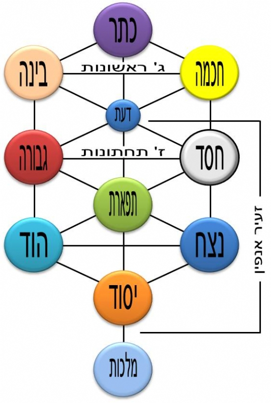

**<u>  
ספר הבהיר</u>**

**זמנו ומחברו לא ידועים. מניחים שנכתב במאה השתים
עשרה.המחבר מכיר את ספרות ההיכלות, את ספר יצירה, וכותב בלשון
המדרשים.**

**למרות ייחוס, כרגיל, לתנא קדום, הכותב אינו מסתיר
שהייחוס דמיוני. הוא משתמש בשמות חכמים שלא היו מעולם.**

**לראשונה התייחסות למבנה האלוהות המכיל את הספירות,
שימשיך להיות מרכזי בקבלה עד ימינו. כמו כן, מוטיבים קבליים אחרים כבר
מופיעים בו.**

ספר הבהיר - המיוחס לרבי נחוניא בן הקנה ז"ל

יא. יד. למה ב סתומה מכל צד ופתוחה מלפניה ללמדך שהוא בית
לעולם והיינו דקב"ה מקומו של עולם ואין העולם מקומו, ואל תקרא ב אלא בית
הדא היא דכתיב (משלי כ"ד ג) בחכמה יבנה בית ובתבונה יתכונן:

**לא אימננטיות ולא טרנסצנדטיות... רעיון קטן שיפותח שלוש
מאות שנה מאוחר יותר בקבלת האר"י.**

יג. טז. אמר ר' רחומאי האורה קדמה לעולם שענן וערפל סביביו
שנאמר (בראשית א' ג) ויאמר אלהים יהי אור ויהי אור, אמרו לו קודם יצירת
ישראל בנך תעשה לו עטרה, א"ל הן, משל למה"ד למלך שהתאווה לבן ומצא עטרה נאה
קלוסה ומשובחת שמח שמחה ואמר זה לבני לראשו כי לו נאה, א"ל ויודע הוא שבנו
ראוי, אמר שתוקי כך עלה במחשבה ונודע שנאמר (שמואל ב' י"ד יד) וחשב מחשבות
וגו':

**מרכזיות ישראל – העולם נברא בשביל עם ישראל... מקובל
במדרשים ומודגש בקבלה.**

יז. ישב ר' אמוראי ודרש למה אל"ף בראש, שהיא היתה קודמת
לכל, ואפילו לתורה:

**אלף בראש האותיות. האותיות קודמות לתורה. טיפול באותיות
כשלעצמן. רמז לספר יצירה.**

ל. אמרו לו מאי וא"ו, אמר להם בששה קצוות נחתם העולם, אמרו
לו והלא ו' אחת, אמר להם והלא כתוב (תהלים ק"ד ב) עוטה אור כשלמה:

**ממדי העולם ששה – אבל הוא עטוף במעטפת אחת. אולי גם רמז
לשש ספירות מרכזיות. שישיה שמתייחסים אליה בקבלה בהמשך.**

מ. שאלו תלמידיו מהו חולם, א"ל נשמה ושמה חולם שאם תשמע
תחלים גופך לעתיד לבוניו ואם תמרוד בה ישובו חלאיך בראשך וחלים
בראשה:

**לגבי הניקוד, הכותב משתמש בדרשנות על שם התנועה
עצמו.**

מב. אמר להם עולו ושמעו דקדוקי נקודה דאורייתא דמשה. ישב
ודרש להם חיריק שונא את הרעים ומייסרם, ובצדו הקנאה והשנאה והתחרות דכתיב
(תהלים ל"ז יב) וחרק עליו שניו אל תקרי חרק אלא רחק, רחק אלה המדות ממך
ויתרחק ממך הרע, וכל שכן דהטוב ידבק בך:

**מדרש הנקודות מהגבוה לנמוך – מהטוב לרע.**

נב. ..., א"ל זה הזהב דכתיב לי הכסף ולי הזהב:

נג. ולמה נקרא שמו זהב, שבו כלולות שלש מדות, זכר, והוא
זי"ן, הנשמה, והיא הה"א, וחמשה שמות לנשמה רוח חיה יחידה נפש נשמה,
.....

**החלוקה של הנשמה אופיינית לימי הבינים. היוונים יצרו את
ההבחנה בין גוף ונפש (שכנראה איננה במקרא). אצל המיסטיקנים היהודים, ההבחנה
יכולה להיות: נפש אחראית על יצרים הקשורים בגוף, רוח על הרגשות ועל הדיבור,
נשמה על היצירתיות והקשרים העל טבעיים. חיה אחראית על הרצון, יחידה על התת
מודע. אך יש פרשנויות שונות.**

נד. ומאי עבידתיה הכא, משל למה"ד למלך שהיתה לו בת טובה
ונעימה ונאה ושלימה, והשיאה לבן מלך, והלבישה ועטרה וקשטה ונתנה לו בממון
רב, אפשר לו למלך לישב חוץ מביתו, אמרת לא, אפשר לו לשבת כל היום תמיד עמה,
אמרת לא, הא כיצד, שם חלון בינו לבינה וכל שעה שצריכה הבת לאביה או האב
לבתו מתחברים יחד דרך החלון הה"ד (תהלים מ"ה יח) כל כבודה בת מלך פנימה
ממשבצות זהב לבושה:

**מיהי הבת? מי המלך? מיהו בן המלך?**

סג. ומאי לבו, א"ל א"כ בן זומא מבחוץ ואתה עמו, לב הוא
שלשים ושתים והיו סתומים ובהם נברא העולם, מאי ל"ב, א"ל ל"ב נתיבות, משל
למלך שהיה בחדרי חדרים ומנין החדרים ל"ב, ולכל חדר יש לו נתיב, נאה למלך זה
להכנס הכל בחדרו על דרך נתיבתיו, אמרת לא, נאה לו לגלות פניניו ומשבצותיו
ומצפוניו וגנזיו וחמודותיו, אמרת לא, מה עשה נגע בבת וכלל בה כל הנתיבות
ובמלבושה, והרוצה להכנס בפנים יסתכל הנה, ונשאה למלך גם נתנה לו במתנה,
לפעמים קורא אותה באהבתו בה אחותי כי ממקום אחד היו, ולפעמים קורא אותה בתו
כי בתו היא, ולפעמים קורא אותה אמי:

**מושגים מספר יצירה. וכמו קודם מי היא הבת? מיהו זה שנשא
אותה או קיבל אותה במתנה?**

לג. סח. שאלו תלמידיו את ר' רחומאי מאי דכתיב (חבקוק ג, א)
תפלה לחבקוק הנביא על שגיונות, תפלה, תהלה מיבעי ליה, אלא כל המפנה לבו
מעסקי עולם ומסתכל במעשה מרכבה מקובל לפני הקב"ה כאלו מתפלל כל היום שנאמר
תפלה, מאי שגיונות, כדכתיב (משלי ה' יט) באהבתה תשגה תמיד ' ומאי ניהו.
מעשה מרכבה דכתיב (חבקוק ג' ב) ה' שמעתי שמעך יראתי:

**ספרות ההיכלות.**

פה. ומאי מ"ם, אל תקרי מ"ם אלא מים מה המים הללו לחים אף
הבטן לח לעולם, ולמה מ"ם פתוחה כלולה מזכר ונקבה וסתומה זכר, ללמדך שעיקר
המ"ם הוא זכר, והוסיפה פתוחה לשם נקבה, ומה הזכר הזה אינו מוליד בפתיחה אף
מ"ם סתומה אינה מולדת אלא בפתוחה, ומה הנקבה מולידה בפתוחה אף מ"ם סתומה
ופתוחה.

**מם – מים – בטן מספר יצירה. פתוחה סגורה (אותיות סופיות)
מקביל לזכר ונקבה. ומכאן לפרשנות נועזת יותר... פרשנות מינית מקובלת מאד
בקבלה בהמשך.**

פו. ומה ראית לרבות מ"ם בפתיחה וסתימה, משום דאמרינן אל
תקרי מ"ם אלא מים, והאשה קרה על כן צריכה להתחמם בזכר, .....

צד. ישב ר' אמוראי ודרש מאי דכתיב (מ"א ח' כז) הנה השמים
ושמי השמים לא יכלכלוך, מלמד שע"ב שמות יש לו להקב"ה וכולם קבעם בשבטים
דכתיב (שמות כ"ח י) ששה משמותם על האבן האחת ואת שמות הששה הנותרים על האבן
השנית כתולדותם, וכתיב (יהושע ד' ט) ושתים עשרה אבנים הקים וגו', מה אלה
אבני זכרון אף אלה אבני זכרון, ושתים עשרה אבנים הם ע"ב כנגד ע"ב שמות של
הקב"ה, ומאי טעמא התחיל בשתים עשרה, ללמדך שי"ב מנהיגים יש לו להקב"ה ובכל
אחד ואחד ששה כוחות' ומאי נינהו, ע"ב לשונות:

**שיטת 72 השמות, המקובלת בקבלה גם היום**

**שמות י"ד. שלושה פסוקים שבכל אחד 72 אותיות. נכתבים ברצף
ללא רווחים, כאשר השני נכתב הפוך, זה מתחת זה. השמות הם בני שלוש אותיות,
בקריאה ניצבת.**

**(יט) וַיִּסַּע מַלְאַךְ הָאֱלֹהִים הַהֹלֵךְ לִפְנֵי מַחֲנֵה יִשְׂרָאֵל וַיֵּלֶךְ
מֵאַחֲרֵיהֶם וַיִּסַּע עַמּוּד הֶעָנָן מִפְּנֵיהֶם וַיַּעֲמֹד מֵאַחֲרֵיהֶם:**

**(כ) וַיָּבֹא בֵּין מַחֲנֵה מִצְרַיִם וּבֵין מַחֲנֵה יִשְׂרָאֵל וַיְהִי הֶעָנָן
וְהַחשֶׁךְ וַיָּאֶר אֶת הַלָּיְלָה וְלֹא קָרַב זֶה אֶל זֶה כָּל הַלָּיְלָה:**

**(כא) וַיֵּט משֶׁה אֶת יָדוֹ עַל הַיָּם וַיּוֹלֶךְ יהוה אֶת הַיָּם בְּרוּחַ קָדִים
עַזָּה כָּל הַלַּיְלָה וַיָּשֶׂם אֶת הַיָּם לֶחָרָבָה וַיִּבקעו המים:**

**ניתן למצוא ברשת, משום מה באתר שמצאתי הפרק היה לא
נכון...**

**בנוסף קיימות שיטות נוספות ליצירת שמות לאל.**

צה. ואילן אחד יש לו להקב"ה ובו שנים עשר גבולי אלכסונין
גבול מזרחית צפונית, גבול מזרחית דרומית.....

קא. ישב ר' ברכיה ודרש מה לולב דאמרינן אלא ל"ו מסור לל"ב,
והאיך, א"ל שלשה שרים הם תלי וגלגל ולב, וכל אחד ואחד י"ב, חזרו בשלשה מנין
ל"ו שבהם נתקיים העולם דכתיב (משלי ג' כה) וצדיק יסוד עולם:

**מסורת ל"ו צדיקים, מתחילה כנראה מהתלמוד, מסכת סנהדרין,
דברי אביי:**

**"לא פחות עלמא מתלתין ושיתא צדיקי דמקבלי אפי שכינה בכל
דרא שנאמר "אשרי כל חוכי לו".**

קיב. ואלו הן השמות המפורשות היקרות והמפוארות שהם שתים
עשרה לשנים עשר שבטי ישראל אהציצה"רון אכליתה"רון שמקת"רון דמושה"רון
וצפצפסית"רון הורמי"רון ברחיה"רון ער"ש גדר"און בסאו"ה מנא"הון חז"הויה
הוהי"רי הא"ה אהי"ה והראית"הון. וכולם נכללים בל"ב השמים ומתחלקין לכ"ד
שמות, ובהם כלול זכר ונקבה ופקודים בתלי וגלגל ולב, והם מעיינות
החכמה:

**מזכיר את ספרות ההיכלות.**

קיח. יו"ד, בעשרה מאמרות שנברא בהן העולם, ומאי ניהו היינו
תורת אמת שכוללת כל העולמים, ושי"ן מאי הוי, א"ל שרש האילן, דשי"ן הוי כעין
שרש האילן:

**בעשרה מאמרות נברא העולם (משנה אבות פרק ה')**

קיט. ומאי הוי אילן דאמרת, א"ל כוחותיו של הקב"ה זה על גב
זה, והן דומין לאילן, מה אילן זה על ידי המים מוציא פירות אף הקב"ה על ידי
המים מרבה כחות כאילן, ומאי ניהו מים של הקב"ה, היינו חכמה, והיינו נשמות
הצדיקים שפורחין מן המעיין אל הצנור הגדול ועולה ודבק באילן, ועל ידי מה
פורח, על ידי ישראל, כשהם צדיקים וטובים שכינה שרויה ביניהם ושרויה במעשיהם
בחיקו של הקב"ה ומפרה אותם ומרבה אותם:

**זוגיות השכינה והקב"ה, הזוגיות והפריון תלויים
בישראל.**

קכא. מאי דור דור אמר ר' פפייס דור הולך ודור בא (קהלת א'
ד') ואמר רבי עקיבא דור בא שכבר בא:

**תפיסת גלגול הנשמות.**

קכב. משל למה"ד למלך שהיו לו עבדים והלבישן כפי יכלתו בגדי
משי ורקמה, קלקלו השורה, השליכן ודחפן מעליו והפשיטן בגדיו והלכו להם, לקח
הבגדים ורחצן היטב עד שלא נותר בהן שום סיג והניחן אצלו מזומנין, וקנה
עבדים אחרים והלבישן הבגדים ההם והוא לא ידע אם טובים הם אותם העבדים אם
לאו, והרי זכו בבגדים שכבר באו לעולם ולבשום אחרים לפניהם, אבל הארץ לעולם
עומדת והיינו דכתיב (קהלת י"ב ו') וישב העפר על הארץ כשהיה והרוח תשוב אל
האלהים אשר נתנה:

**גלגול נשמות כמו העברת בגד מזה לזה...**

קכד. ומאי טעמא בנשיאות כפים וליברוך להון בברכה, אלא משום
דאית בידים עשר אצבעות, רמז לעשר ספירות שבהם נחתמו שמים וארץ, ואותם העשרה
כנגד עשרת הדברות, ובכלל אותן י' נכללו תרי"ג מצות, ומנה אותם אותיות של י'
דברות ותשכח דאינו"ן תרי"ג אותיות, ובהם כל כ"ב אותיות בר מן ט' דליתא
בהון, מאי טעמא, ללמדך דט' הוא בטן ואינה בכלל הספירות:

קכה. ואמאי קרי ליה ספירות, משום דכתיב (תהלים י"ט ב)
השמים מספרים כבוד אל:

**ומכאן מתחיל למנות את הספירות.**

קמא. מאי ניהו עשרה מאמרות, ראשון כתר עליון ברוך ומבורך
שמו ועמו, ומי עמו, ישראל, דכתיב (תהלים ק' ג) דעו כי ה' הוא אלהים הוא
עשני ולא אנחנו עמו, ולאל"ף אנחנו, להכיר ולידע אחד האחדים המיוחד בכל
שמותיו:

**מדרש מתחכם, לא = ל...א', כלומר "לא אנחנו" – אנחנו
שייכם לאלף, לאחד.**

קמב. שניה, חכמה, דכתיב (משלי ח' כב) ה' קנני ראשית דרכו
קדם מפעליו מאז, ואין ראשית אלא חכמה דכתיב (תהלים קי"א י) ראשית חכמה יראת
ה':

קמג. שלישי, מחצב התורה, אוצר החכמה, מחצבה רוח אלהים,
מלמד שחצב הקב"ה כל אותיות התורה וחקקו ברוח, ועשה בו צורותיו, והיינו
דכתיב (ש"א ב' ב) ואין צור כאלהינו, ואין צייר כאלהינו:

**ספירת "בינה", עדיין בכינוי אחר.**

קמד. שלישי הוי רביעי מאי, רביעי הם צדקת ה' וזכיותיו
וחסדיו עם כל העולם, והיינו ימינו של הקב"ה:

**ייחוס ספירת "חסד" ליד ימין. התייחסות לגוף הקב"ה.  
אחת השאלות הגדולות בקבלה, אם הספירות הן חלק מהאלוהות, או מכשירים בידי
האל.**

קמה. חמישי מאי, חמישי אשו הגדולה של הקב"ה שנאמר (דברים
י"ח ט"ז) ואת האש הגדולה הזאת לא אראה עוד ולא אמות, והיא שמאלו של הקב"ה,
ומאי ניהו הם חיות הקודש והשרפים הקדושים מימינם ומשמאלם, הם הנעימים
הגבוהים עד למעלה דכתיב (קהלת ה' ז) וגבוהים עליהם, ועוד (יחזקאל א, יח)
וגביהן וגובה להם ויראה להם וגבותיו מלאת עינים סביב לארבעתן, וסביביו
מלאכים, גם סביבותיהם משתחוים לפניהם וכורעים ואומרים ה' הוא האלהים ה' הוא
האלהים:

**מקביל לספירת "גבורה".**

קמו. ששי, כסא הכבוד המעוטר המוכלל המהולל המאושר, הוא בית
העולם הבא, ומקומו בחכמה דכתיב (בראשית א' ג) ויאמר אלהים יהי אור ויהי
אור:

**אולי "נצח"**

קנג. ומאי שביעי, היא ערבות שמים ולמה נקרא שמים אלא שהוא
עגול כמו ראש, ומלמד שמים מימינו ואש משמאלו והוא באמצע, והוא שא מים מאש
וממים, ומכניס שלום ביניהם, בא האש ומצא צדו מדת אש, ובאו המים ומצאו מצדן
מדת המים, והיינו עושה שלום במרומיו (איוב כ"ה ב):

**אולי "הוד" ואולי משמיט את "הוד" ומאחד עם
"תפארת".**

קנד. שביעי אינו אלא ששי, אלא מלמד שכאן היכל הקודש והוא
נושא את כולם ונחשב לשנים, והוי שביעי, ומאי הוא, המחשבה שאין לה סוף
ותכלית, וכך המקום הזה אין לו סוף ותכלית:

קנה. שביעי הוי מזרחו של עולם, ומשם בא זרעם של ישראל, כי
חוט השדרה משוך מן המח של אדם, ובא לאמה ומשם הוא הזרע, דכתיב (ישעי' מ"ג
ה) ממזרח אביא זרעך, כשישראל טובים מזה המקום אביא זרעך, ויתחדש לך זרע
חדש, וכשישראל רעים מן הזרע שכבר בא לעולם שנאמר (קהלת א' ד) דור הולך ודור
בא, מלמד שכבר בא:

**כאן ברור שזו ספירת "תפארת". מסלול הזרע: מהראש דרך עמוד
השדרה לאיבר המין. בספירה המקובלת צריכה להיות שמינית. התאמה בין הידע
הביולוגי של התקופה ובין מבנה האלוהות.**

קנז. שמיני מאי הוי, יש לו להקב"ה צדיק אחד בעולמו והוא
חביב לו מפני שמקיים כל העולם כולו והוא יסודו, והוא מכלכלו והוא מצמחו
ומגדלו ומשמרו, אהוב וחביב למעלה, אהוב וחביב למטה, נורא ואדיר למעלה, נורא
ואדיר למטה, ומתוקן ומקובל למעלה, מתוקן ומקובל למטה, והוא יסוד הנפשות
כולן, ואמרת שמיני, ואמרת יסוד הנפשות כולן והכתיב (שמות ל"א יז) וביום
השביעי שבת וינפש, אין שביעי הוי, משום דמכריע בינייהו, דשית אינון תלת
מלרע ותלת מלעיל והוא דאכרע בינייהו:

**ספירת "יסוד". ונקראת גם "צדיק" על פי הפסוק "צדיק יסוד
עולם" (משלי י').**

קסט. תשיעי מאי הוי, א"ל תשיעי ועשירי הם יחד זה כנגד זה,
והאחד גבוה מחבירו ת"ק שנה, והם כעין שני אופנים, האחד נוטה לצד צפון והאחד
נוטה לצד מערב והולכין עד הארץ התחתונה, ומאי תחתונה, אחרונה שבשבע ארצות
למטה, וסוף שכינתו של הקב"ה תחת רגליו שנא' (ישעי' ס"ו א') השמים כסאי
והארץ הדום רגלי, ושם נצחונו של עולם למטה דכתיב (שם ל"ד י') לנצח
נצחים:

**ספירת "מלכות" היא השכינה.**

**עשרה שלבים באלוהות, מהכתר ועד "הארץ הדום רגליו". השמות
מזכירים את השמות בתיאוסופיה הקבלית המאוחרת יותר, אך חלקית. התיאורים
והפונקציות משתנות בהמשך..**

קעא. אמרו לו תלמידיו מלמעלה למטה ידעינן, מלמטה למעלה לא
ידעינן, אמר להו ולאו חד הוי מלמטה למעלה ומלמעלה למטה, אמרו רבינו אינו
דומה העולה ליורד שהיורד יורד במרוצה והעולה אינו כן, אמר להם צאו וראו,
ישב ודרש להם שכינה למטה כשם ששכינה למעלה. ומאי שכינה זו, הוי אומר זה
האור הנאצל מן האור הראשון שהוא חכמה, גם הוא מסובב הכל שנאמר (ישעי' ו'
ג') מלא כל הארץ כבודו, מאי עבידתיה הכא, משל למה"ד למלך שהיו לו שבעה בנים
ושם לכל אחד ואחד מקומו, אמר להם שבו זה ע"ג זה, אמר התחתון אני לא אשב
למטה ולא אתרחק ממך, אמר להם הריני מסובב ורואה אתכם כל היום והיינו מלא כל
הארץ כבודו, ולמה הוא ביניהם, כדי להעמידם ולקיימם:

**האצילות או האצלה. תתכן השפעה של הנאופלטוניזם
(פלוטוניוס, פורפירוס, המאה השלישית).**

קעט. תאנא עשרה גלגלים ועשרה מאמרות הם, וכל גלגל וגלגל יש
לו מאמר, לא שהוא סובב בו אלא שהוא מסבבו, העוה"ז כהרדלא בעזקתא, מ"ט משום
רוחא דמנשבא ביה וקאים בהכי, ואלמלא כליא רוחא חדא שעתא או רגעא חדא איתחרב
עלמא:

**אסטרונומיה, אסטרולוגיה, ותורת הסוד. הגלגלים
האסטורנומיים מסבירים את תנועת כוכבי הלכת (כולל שמש וירח, סיבוב הארץ הלא
מודע, והפרצסיה).**

קצט. נשמת נקבה מן הנקבה ונשמת זכר מן הזכר, והיינו דקאזיל
נחש בתרה דחוה, אמר הואיל ונשמתה מצד צפון. אסיתנה מהרה, ומאי הסתה הוה בה,
משום דבא עליה:

**הרע מצד צפון (מצפון תפתח הרעה) אך צפון הוא גם
שמאל.**
