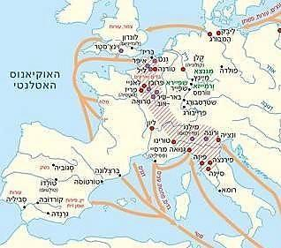
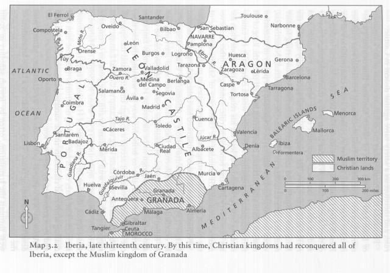

תורת הסוד 8 הקבלה לפני הזוהר

חלק מחכמי ישראל העוסקים בקבלה, לפני ספר הזוהר

הראב"ד השלישי 1120-1198

יצחק סגי נהור 1160-1235

(עזרא) ועזריאל מגירונה
1160-1238

אלעזר מוורמוס 1165-1240

הרמב"ן 1197-1270

יעקב ויצחק הכהן

חלק מחכמי ישראל העוסקים בקבלה, בתקופת כתיבת ספר
הזוהר

אברהם אבולעפיה 1240-1291 קבלה נבואית.

יוסף ג'קטילה 1248-1323

משה דה ליאון 1240-1305

יצחק דמן עכו 1250-1340

המאות השתים עשרה והשלוש עשרה הן תקופה סוערת באליטה של
חכמי פרובנס וקטלוניה בעיקר. מקובלים אינם רק מקובלים, הם גם אנשי הלכה,
פילוסופים, משוררים.

בצרפת ובספרד מתחיל לחץ נוצרי חזק על היהודים, הגבלות,
גירושים ופרעות.

ביהדות, הפולמוס על הפילוסופיה, גישות רציונליסטיות
וקבליות מתחרות ומתאחדות.

חסידי אשכנז נחשבים למאמינים באמונות תפלות, חכמי פרובנס
וספרד הרציונליסטים יותר.

גרשום שלום רואה "זרימת" רעיונות הקבליים מצפון
לדרום.

ספר הזוהר נכתב בערך ב 1280 במרכז ספרד.

חכמי צרפת מטילים חרם על הפילוסופיה, ובפרט על ספרי הרמב"ם
(נפטר ב 1204) (לפני שריפת ספרי הרמב"ם 1233)

הפילוסופים בפרובנס, בתגובה, מייחסים לצרפתים, בצדק או שלא
בצדק, את תורת חסידי אשכנז "הפרימיטיבית".

דוגמה לכך היא איגרת התעמולה שנשלחה מנרבון לקהילות ספרד,
בניסיון לגייס תמיכה נגד חרם הצרפתים (בערך ב 1200):

כי תהִלה לאלהי אבותינו. אין פרץ ואין יוצאת ואין צווחה
ברחובותינו \] תה' קמד\]. ואין בקרבנו קטני אמנה. לא שֹׁרש פֹּרֶה ראש ולענה
\]דב' כט \[. ולא שבט ולא משפחה אשר לבבו פונה היום מעם ייי' אלהינו ללכת
לעשות כתועבות הגוים לשמוע אל הקוסמים. ואל החולמים.חלומות שקר. להתעות עם
ייי' עד אין חקר. בהבלי שמות כִּנויי מלאכים ושדים ולעשות השבעות. ולכתוב
קמיעות. לפתאים להתעות ... זהו רוב חוכמתם. למי שיחקור בתבונתם. ויבוא עד
תכונתם. כאשר שמענו על גדולי ישראל הצרפתים וחכמיהם. ראשיהם
ומביניהם.

אשר בזה חטאו ונואלו. וברבות יבערו ויכסלו. כי הלכו אחרי
ההבל ויהבלו. כי עשו עצמם בעלי שם כנביאי האמת הידועים. והמה אוילים
משוגעים. מלאי תעתועים. מוחם מזוהם. כקוץ מֻנָד כולהם. לנים בבית אפל. חוזים
שוא ותפל. טבולים במי מערות סרוחים. ויחזו להם משאֹת שוא ומדוחים \]איכה ב
\[.

!!!!!!!!!

אלעזר מוורמס

מלבד עיסוקו בהלכה

עוסק בהלכות מלאכים, צורתם, תפקידיהם.

מפרש את ספר יצירה.

עוסק במדרשי אותיות וגימטראות.

ר' אלעזר מוורמיזה – מתוך "סודי רזיי"

המלאכים הם גופי׳ דקין מאוד, כרוח שהוא דק ולא נראה, כי
גופו הוא מן הרוח ומן האש, "עושה מלאכיו רוחות" (תהלים קד ד), ואף על פי
שקצת גופן אש, אולם גופו דק בחילוף האש שבינינו ואם יחפוץ להראותם יכביד
משאם, "ועף אלי אחד מן השרפים" (ישעיהו
ו)....

הסבר פיזיקלי לתורת המלאכים, על פי יסודות יווניים, עם
ביסוס מהמקרא, והיגיון....

"כל האותיות נקראים שניים שניים
מלבד מהלמ"ד שגבוה מכל האותיות, א"ב, ג"ד...כ"ך, ל, מ"ם, נ"ן, ס"ע...לפי
שהמלך יושב למעלה מכולם ואין שווה לו, "ואשכון כמלך בגדוד" (איוב כ"ט כ"ה).
מל"ך בגימטריה צדי"ק....

(מספר "סודי רזייא" )

מדרש אותיות, ייתכן בעקבות ספר יצירה.

יצחק הכהן מסוריה אשר בספרד, לומד אצל מקובל בפרובנס, שהיה
תלמידו של אלעזר מוורמס, ומספר:

עוד קבלה מסוּרה ביד בעלי השמות בעתות ידועות, שִׁמושא דאוירא
דשדי....

וקפיצת הדרך אצלם, המשתמש במין ההשגה הנקרית אוירא דשמושא
דשידי. והחכם הגדול המקובל שהיינו עמו בנרבונה, העיד על רבו הרב החסיד ר'
אלעזר מורמיש ז"ל, ורבים אחרים שבאו משם שידעוהו משם היו מעידין עליו, כי
לעתות כמו זו כשהייתה מצות מקום רחוק מוטלת עליו, היה רוכב בדמות הענן
המזומן לכך, והגיע אל המקום הרחוק ההוא ומקיים מצותו וחזר למקומו, וכמה
ימים רכב על בהמה כשאר בני אדם. ופעם אחת נזדמנה לו מצות ברית מילה במקום
רחוק, ורכב על פי השבעה כמשפטו המורגל אצלו, ושכח דבר אחד מהשימוש הצריך
לאנשי החכמה הזאת, ונפל מן הענן קרוב אל הארץ ונעשה פִּסח חולה על יריכו, ולא
נתרפא מאותו חולי בשום תחבושת בעולם עד יום מותו והיתה מנוחתו כבוד.

לפעמים זה מצליח, אבל רצוי להיזהר, בעיקר אם הזיכרון לא
משהו…

יצחק סגי נהור (עיוור?) היה בנו של הראב"ד (ר' אברהם בן
דוד מפוסקירה - פרובנס) ונחשב לאחד מראשוני המקובלים.

כך הוא כותב בהתייחסו לספר יצירה:

מספר עשר, מה שהזכיר בשתי פסקות שהזכיר את נתיבות ואותיות
שמהם הויה מושגת, לכך אחר עד הנה לומר מספר עשר, שפירושו ההויות המושגות
המתקבלות בהתעלותם במועל ידיהם למעלה. חמש הם נצח הוד תפארת חסד חכמה, הרי
חמשה. העטרה עם צדיק שהם כח מדת הפחד, ועם הבינה והחכמה מכרעת בכל הרי חמש
כנגד חמש, ....... בשביל החכמה שהיא אמצעית וסובבת הכל, וכן המוח באמצע
הראש... על כן הוזקק לומר אחר פסקא זו "עשר ולא אחת עשרה", שאינם אלא
עשר....

כמקובל, הוא שומר סוד -

איגרת ר' יצחק סגי נהור לחכמי גירונה:

הדר זקנים ותפארת בחורים, רבותי ורעי אוהבי המשכילים
החכמים הנבונים ר' יונה ור' משה
\[כנראה, יונה גירונדי ומשה בן
נחמן\], יראי אלהים, אנשי
אמת, עושי צדקה בשכר אמת......

ואני לא במעל ולא במרד מדתי, ולא דברתי עד הנה כי אם מרוב
פחדתי ויראתי, על אשר ראיתי חכמים ונבונים וחסידים שהאריכו בלשונם ופשטו
ידיהם לכתוב גדולות ונוראות בספריהם ובאגרותיהם. והדבר הנכתב אין לו ארון,
כי פעמים רבות יאבד, או ימותו בעליו, ויגיעו הספרים לידי פתאים ומלעיגים,
ונמצא שם שמים מתחלל.....

וגם שמעתי מהארצות אשר סביבותיכם ומאנשי עיר ברגש שהם
מדברים בגלוי בשוקים וברחובות כמבוהלים וכמבולבלים, ומתוך דבריהם נכר שסר
לבם מן העליונה וקוצצים בנטיעות....

הרמב"ן בהקדמה לפירוש התורה:

ואני הנני מביא בברית נאמנה, והיא הנותנת עצה הוגנת לכל
מסתכל בספר הזה, לבל יסבור סברה, ואל יחשוב מחשבות בדבר, מכל הרמזים אשר
אני כותב בסתרי התורה, כי אני מודיעו נאמנה שלא יושגו דבר ולא יודעו כלל
<u>בשום שכל ובינה</u>,
זולתי מפי מקובל חכם, לאוזן מקובל מבין. <u>והסברא בהן
אולת</u> מחשבה מועלת רבת
הנזקין מונעת התועלת. אל יאמר בשוא נתעה, כי לא תבואהו בסברותיו רק רעה, כי
ידברו אל ה' סרה, אשר לא יכלו כפרה, שנאמר: אדם תועה מדרך השכל בקהל רפאים
ינוח, אל יהרסו אל ה' לראות
כי ה' אש
אוכלה הוא אל קנאות. והוא
יראה את רצוייו מתורתו נפלאות.  
אבל יחזו בפירושינו חדושים <u>בפשטים
ובמדרשים</u>, יקחו מוסר
מפי רבותינו הקדושים:

בגדול ממך אל תדרוש  
בחזק ממך בל תחקור  
במופלא ממך כל תדע  
במכוסה ממך בל תשאל  
במה שהורשית התבונן,  
שאין לך עסק בנסתרות.

הרמב"ן מתוך הפירוש לתורה, בראשית פרק א':

פירוש קבלי, מעורפל למדי, אך מייחס למצוות משמעות
קבלית.

והתשובה,
מפני שמעשה בראשית סוד עמוק אינו מובן מן המקראות, ולא
יוודע על בוריו אלא <u>מפי הקבלה</u>
עד משה רבנו מפי הגבורה, <u>ויודעיו חייבין להסתיר
אותו</u>,....

וכוונתם זו, שמלת בראשית
תרמוז, כי בעשר ספירות נברא העולם (עיין ספר יצירה א יד),
ורמז לספירה הנקראת חכמה שבה יסוד כל, כעניין שנאמר (משלי ג יט): ה' בחכמה
יסד ארץ, .... וכאשר ימנה אדם עשר מדות ויפריש אחת מעשר רמז לעשר ספירות.
יתבוננו החכמים בעשירית וידברו בה, והחלה מצווה יחידה בעיסה תרמוז לזה.
וישראל שנקראו ראשית היא כנסת ישראל, המשולה בשיר השירים לכלה, שקראה הכתוב
בת ואחות ואם, וכבר בא להם זה במדרש (שהש"ר ג כא): בעטרה שעטרה לו אמו (שם
ג יא), ובמקומות רבים.

יעקב הכהן מדרש אותיות (כנראה, השפעה ישירה של תורת
אשכנז):

... ידוע תדע כי כל האותיות
מוזכרות וקבועות בפה מקומות ידועים. והאלף היא ראש האותיות הנזכרות בפה
באויר בלי עמל ויגיעה, ללמד כי הקב"ה אחד מבלי שני והוא נעלם מען כל בריה
כמו שהאלף נזכרת בסוף הלשון שהוא מקום מכוסה, כן הקב"ה מכוסה ממראה
עינים....

....כי הצורה הלבנה שבאלף היא כנגד
מעלתו של הקב"ה ולא הצורה השחורה החיצונה, לא אמרתי לך דבר זה כי אם על דרך
עיקר וסוד גדול, כי הצורה הלבנה כנגד אצטלית לבנה וחז"ל אמרו מהיכן נבראה
האורה? מלמד שנתעטף הקב"ה באצטלית לבנה והבהיק זיוה מסוף העולם ועד
סופו..

... ומה שאתה רואה כי ראש האלף
דומה ליוד, בא ללמנו כי הקב"ה הוא אחד וברא והמציא בחכמתו עשרה גלגלים
והנחיל לעמו ישראל עשרת הדברים שהן כנגד עשרה מאמרות שבהן נברא העולם.
ובראש הדיבור הראשון נתיסדה אות האלף...

... והקו האמצעי באלף שהוא כצורת
ואו בא ללמדנו על שש קצוות שהם מזרח ומערב צפון ודרום רום ותחת, והקב"ה הוא
אחד מושל בכל אלו הקצוות...

ר' עזריאל מגירונה – פירוש עשר הספירות  

תפיסה פילוספית של הקבלה (או קבלית של
הפילוסופיה...)

<u>ב) אם ישאל שואל מי יכרחני להאמין בא"ס:</u>

תשובה. דע כי כל הנראה והנתפס בהרהור הלב מוגבל וכל מוגבל
יש לו סוף וכל שיש לו סוף אינו שוה. אם כן מה שאינו מוגבל קרוי אין סוף
והוא (ההשואה) \[השוואה\] גמורה באחדות השלימה שאין בה שינוי, ואם הוא מבלי
גבול אין חוץ ממנו. ולפי שהוא מתעלה ומתעלם הוא עיקר כל נסתר וגלוי. ולפי
שהוא נעלם הוא שרש האמונה והוא שרש המרי, ועל זה נאמר וצדיק באמונתו יחיה.
וחכמי המחקר מודים לדברי האומר כי אין השגתינו כי אם על דרך לא. והדברים
הנאצלים מאין סוף הם י' ספירות:

<u>ג) ואם יוסיף השואל לשאול באיזה הכרח תכריח כי יש שם
ספירות כי רצוני לומר כי אין שם רק אין סוף לבד:</u>

תשובה. אין סוף הוא שלימות בלי חסרון וא"ת שיש לו כח בלי
גבול ואין לו כח בגבול אתה מחסר שלימותו:

וא"ת שהגבול הנמצא ממנו תחילה היה העולם הזה שהוא חסר
מהשלמותו חסרת הכח שהוא ממנו. ולפי שאין לחסר שלימותו יש לנו לומר בהכרח
שיש לו כח בגבול מבלי גבול. והנמצא ממנו תחלה הם הספירות שהם כח השלם וכח
החסר. כשהם מקבלים מהשפע הבא מהשלמתו הם כח שלם. ובהמנע השפע מהם יש בהם כח
חסר לכך יש בהם כח לפעול בהשלמה ובחסרון.

<u>י) ואם יוסיף השואל לשאול מה שמם סדרם
ומקומם:</u>

תשובה. שם הכח הראשון קרוי רום מעלה שהוא מרומם מחקר חוקר.
השני קרוי חכמה שהוא תחילת ההשתכלות. השלישי קרוי בינה, ועד כאן עולם השכל.
הרביעי קרוי חסד, החמישי קרוי פחד, הששי קרוי תפארת, עד כאן עולם הנפש.
השביעי קרוי נצח, השמיני קרוי הוד, התשיעי קרוי צדיק יסוד עולם, העשירי
קרוי צדק, עד כאן עולם הגוף. וזהו סדר פעולתן:

הראשון לכח אלהיי, השני לכח מלאכותיי, השלישי לכח נבואה,
הרביעי להגדיל חסד אל העליונים, החמישי לדון, בפחד גבורתו, הששי לרחם על
התחתונים בפחד, השביעי לגדל ולחזק נפש הצומחת, השמיני להחלישה ולהחליאה
התשיעי להמשיך כח כולן פעם לדבר אחד פעם לתמורה, העשירי מדת הדין שלמטה
שהיא כלולה מכח כולם לדון התחתונים. .....
