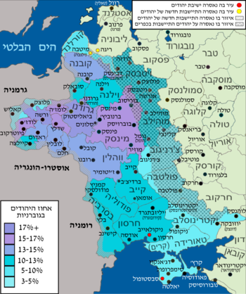

> **<u>הומור יהודי 10 – מומרים.</u>**
>
> 1444

שאלו למוריץ מושקובסקי, הפסנתרן הידוע:

מה טעם לא הלך בדרך בני-משפחתו, שהם כּוּלם המירו, והוא נשאר
יהודי?

החזיר מושקובסקי:

להמיר? לא; יותר מדי מנהג יהודי הוא זה...

> 1398

שאל מכּס הקטן את אביו:

אבא, בן כמה אדם נעשה יהודי?

גער בו אביו:

שטות זו מניין לך? אין אדם נעשה
כלום; כל אדם הוא מה שהוא.

לא קיבּל מכּס הקטן והחזיר:

> אבא, לא כך. הנה אני בן עשר, ונוצרי אני. אתה בן ארבעים,
> ועדיין גם אתה נוצרי. ואילו סבא, יהודי הוא כבר...
>
> **האם זה באמת מנהג יהודי?....**
>
> **התנ"ך מרבה לדבר על עבודת אלוהים אחרים. ואכן, תמיד
> הייתה תחרות בין תרבויות שונות על פולחן, על מנהגים, ועל אורחות חיים.
> בימי בית שני, ההתיוונות שהשפעתה הייתה עצומה. בתקופות כאלה, הדומות אולי
> למצבנו היום, קיים רצף בין נאמנות לדת ובין הסתגלות לתרבות שונה, בין
> קנאים ובין מתונים או מתפשרים.**
>
> **לאחר החורבן, נוצר מצב חדש עם התפשטות הנצרות שקראה
> תגר על השליטה של "החכמים" בחברה היהודית. מתקופה זו אנו מכירים את
> היהדות כבנויה מקהילות מיעוט, והמרת דת היא גם יציאה מהקהילה, כלומר,
> תמורה חברתית. המרת הדת היא עתה דרמטית.**
>
> **בערך המרת דת בויקיפדיה כתוב שבהיסטוריה היהודית
> ידועים "מקרים רבים" של המרת דת. ב *Jewish Encyclopedia*
> נטען שרבע מיליון יהודים באירופה התנצרו במאה התשע עשרה.
> **
>
> **אבל, הרבה קודם, יש להניח שבלחץ של התקופה הביזנטית
> רבים הנתנצרו, והכיבוש הערבי של המזרח התיכון וצפון אפריקה במאה השביעית
> והשמינית, הביא להתאסלמות של יהודים רבים מאוד.**
>
> **כמובן, שמספר גדול של יהודים התנצר במאות החמש עשרה
> והשש עשרה בספרד. מעריכים בין 20 ל 50 אלף את מספר המתנצרים בגירוש עצמו,
> אבל מספר גדול יותר התנצר באונס במאה שקדמה לגירוש. הסטטיסטיקות בנושא
> זה, מעורפלות.**
>
> **המרות הדת של יהודים בימי הבינים ועד אחרי גירוש ספרד,
> היו המרות שנבעו מאיום במוות או בגירוש אכזרי, רובן בעולם הנוצרי,
> ומיעוטן גם בעולם המוסלמי.**
>
> **בעולם המוסלמי ידועים גזירות השמד של שלטון
> אל-מוואחידון, שושלת ברברית מצפון אפריקה ששלטה על חלק מספרד ואיזורים
> נרחבים בצפון אפריקה (במאה ה 12), והכריחה יהודים (ונוצרים) להגר, או
> להתאסלם באיום במוות, ולפעמים רצחו מבלי לאפשר התאסלמות. הדעאש היום
> דומים להם מאוד.**
>
> **בהקשר זה ידועה "איגרת השמד" של הרמב"ם.**
>
> **הרמב"ם עצמו היה פליט של המוואחידון (כילד). מכיוון
> שהיו פוסקים שטענו שצריך ליהרג ולא להמיר את הדת, מתמודד איתם הרמב"ם
> באיגרת זו למתאסלמים, משבח אותם על רצונם לשוב ליהדות, ופוסק שמותר
> להתאסלם מאונס, ואחר כך להשתדל לברוח למקום בו ניתן לחזור
> ליהדות.**
>
> **המרות דת מאונס קיימות במאות האחרונות, כאמור, רק
> בארגונים קיצוניים ביותר.**
>
> **מה שמאפיין את המומר של המאה התשע עשרה, זה, אולי,
> המרה מתוך אינטרס, כאשר האמונה דועכת. ניתן לקרוא לזה – המרת דת של
> חילוני (דתי לייט או דתל"ש), או המרת דת טכנית כחלק מהחילוניות.**
>
> **וכך כותב זלקינד הורביץ, משכיל יהודי, עוד במאה השמונה
> עשרה (מתוך: "המומרים בממלכת פולין-ליטא" מאת יעקב גולדברג, מרכז שזר
> 1985):**
>
> "העוברים מן היהדות לדתות אחרות עושים זאת פשוט למען
> טובת הנאה בת חלוף או כדי להשתמט ממרות ההורים, או למען הגירושין,
> ההכנסה, המשרה וכו'. הראיה לכך היא, שעל פי רוב הם עוברים לדת השלטת.
> יהודי לא ייהפך לנוצרי באיסטנבול, או לקתולי באמסטרדם, או לפרוטסטנטי
> בפריז."
>
> **ומסכים איתו אינאץ מאסאלסקי, הבישוף של וילנה, שכותב
> לכמרים שלו ב 1783 (מקור הנ"ל) שעל הכמרים לבדוק אם הרצון להתנצר אינו
> נובע מהרצון להתחמק מצרה, או להרוויח:**
>
> "מחרם שהטילו עליהם הכופרים או מן השאיפה לעשות רווחים,
> כפי שנוכחנו לדעת לעתים כה קרובות"  
> **אם כן, מניע נוסף, מאבקים פנימיים בקהילה שמביאים לחרם על אדם
> מסוים...**
>
> **ספר הבדיחה והחידוד, עוסק בהמרות של המאה התשע עשרה,
> שהיו נפוצות מאוד הן ברוסיה, והן בגרמניה, ובארצות שביניהן...**
>
> **האינטרסים או היתרונות שנבעו מההתנצרות באירופה, היו
> מגוונים.**
>
> 1386

ימים רבים נאבק יהודי מוסקבאי עם המשטרה: עיתים ניצח מתן
בסתר, עיתים הצליחה הערמה. לסוף כּלו כל הקיצים. בשכונתו נתמנה קצין-שוטרים
חדש רשע-מרושע: לא ידע רחם וארב לכל אדם מישראל. לא עמד היהודי בנסיון ועשה
מעשה: הלך לכומר – ושב לביתו "גוי".

ויהי בחצות הלילה והמשטרה באה. לא קם ולא זע המומר החדש
והעמיד פנים כאילו הוא ישׁן. ניגש קצין-השוטרים למיטתו, הסתכל בו יפה-יפה,
הכירוֹ וקרא:

אהא, ז'יד! באת בכפי. עכשיו לא תימלט עוד...

פּיהק המוּמר החדש לכל רוחב פיו, התמתח לכל אורך המיטה,
פישפש ומצא צלבוֹ מתחת לכר, הגיעוֹ עד לחוטמו של
הקצין הרשע, נענה ואמר:

והלה מי הוא בעיניך – כּלב?...

**אחד המניעים העיקריים להתנצרות ברוסיה, הוא אפשרות
המגורים בערים הגדולות, בעיקר במוסקבה.**

**כפי שהזכרנו באחת הפגישות הקודמות, יהודים כמעט ולא
התגוררו ברוסיה, עד שרוסיה התפשטה מערבה, וכבשה חלקים גדולים ממזרח אירופה
(היום פולין, ליטא, אוקראינה, בילורוס, מולדוביה).**

**באיזורים אלו התגוררה אוכלוסיה יהודית גדולה ביותר
(למעלה מארבעה מיליון יהודים). השלטון הרוסי רצה שטח אבל לא רצה יהודים
(מוכר?)**

**ב1791 קבעו השלטונות ברוסיה תחום מושב ליהודים, באיזורים
אלו שגרו בהם ממילא, עם הגבלות נוספות. יהודים שכבר התפזרו וחיו מחוץ לתחום
זה גורשו אליו.**

**תחום המושב היה נחות כלכלית לעומת מרכז רוסיה, מוסקבה
בפרט, גם בו הוטלו גזרות שונות על היהודים, והפיתוי להגר לעיר הגדולה היה
גדול.**

**בסוף המאה התשע עשרה, ותחילת המאה העשרים התחוללו
הפוגרומים הגדולים, וכשני מיליון יהודים עזבו את תחום המושב בעיקר
לאמריקה.  
**

**התנצרות הייתה אחד האמצעים להיחלץ מתחום המושב ומחוקי
האפליה הקיצוניים הללו. ולכן המומר בקטע לעיל, חוגג.**

**היו גם סעיפים בחוק, של "יוצאים מן הכלל", שהורשו
להתגורר במוסקבה, כמו שנראה בקטע הבא:**

1385

נציב רשע היה לה למוסקבה – סרגי אלכסנדרוביץ דוֹדוֹ של
הקיסר. הרבה גזירות גזר על היהודים והרבה קיצץ בזכוּתם לדוּר במוסקבה
עיר-הקודש. מהם התחכמו ומצאו תחבולות שונות, שלא תשיגם ידו של אותו רשע,
מהם לא עמדו בניסיון וקיבלו עלהם נצרוּת, ונפטרו בבת-אחת מכל עוּנוֹתם, ומהם –
והם הרוב- גלוּ.

פעם אחת ישבו יהודים מוסקבאים בחבורה וסיפרו זה עם זה על
צרת-הישיבה בעיר שלטונו של סרגי הרשע. פתח אחד ואמר: הרבה עמלתי והרבה
יסורים שבעתי, אבל סוף-סוף כּבר יש לי, ברוך-השם, זכות ישיבה כאן.

אמרו לו חבריו:

זכותך מה היא?

החזיר הנשאל:

מיום אתמול ואילך מוכתב אני לסוחר ממדריגה ראשונה.

נענה שני ואמר:

ברוך השם, אף אני כבר יש לי זכות-ישיבה.

אמרו לו:

זכותך שלך מה היא?

החזיר הלה:

אני מוכתב לדוקטור.

קם שלישי ואמר:

זכויותיכם שלכם קליפת-השום לגבי זכותי שלי.

שאלה כל החבורה פה אחד:

אתה מה זכותך?

הוציא הוא מכיסו צלב קטן, הניח לפניהם ואמר:

הרי!... אני מוכתב לישו המשיח...

**<u>מוכתב ל...</u> – ניתנה רשות לסוחרים גדולים, ולבעלי
השכלה גבוהה לגור במוסקבה, ואפילו להעסיק עוזרים או משרתים במספר מוגבל
(המוכתבים). אבל, צודק המומר. הרשות תלויה בשרירות לב השלטונות, בעוד
שהמומר כמוהו כרוסי לא יהודי.**

**העוני היה, כמובן, מניע רציני להמרה:**

1390

יוֹמיים קודם פסח בא יהודי למסית **\[מיסיונר\]** וגילה לו,
שרצונו לטבול. שמח עליו המסית וביקש למסור אותו לכומר, שילמדוֹ עיקרי הדת.
סירב היהודי ודרש טבילה מיד. אמר לו המסית:

למה אתה אץ כל-כך?

השיב היהודי:

אני אץ, משום שמחרתיים פסח.

תמה המסית:

ואם מחרתיים פסח, מה בכך?

החזיר לו היהודי:

אלא לשׁם מה אני מבקש לטבול, אם לא כדי שיהא בידי
לקנות צורכי-פסח?...

**ועוד יותר קיצוני...**

1392

לשעבר נהגו רבים מן הכמרים ליתן דינר זהב לכל אדם מישראל,
שבא אליהם להמיר. ונמצאו יהודים, שהיו מערימים ומחליפים שמותיהם ונוטלים
דינרים כמה פעמים, ומשתמטים ואינם ממירים. ראו הכמרים שׁכּך, נמלכו וביטלו
מנהגם, שלא יהיו מערימים נשׂכרים.

בינתיים נכנס יהודי זקן אצל כומר ואמר לו:

אדוני כומר, להמיר באתי.

נסתכל בו הכומר והכירוֹ: זקן זה כבר הוציא מידו כמה
דינרים.

אמר לו:

לחינם טרחת ובאת אלי. אותו מנהג כבר נתבטל.

יצא הזקן מביתו של הכומר וזעף:

תיפּח רוחם של הרשעים! פרנסה נקייה וקלה היתה לנו, ואף אותה
ביטלו מאיתנו...

**אבל, למרות שבדרך כלל מצבם הכלכלי של המומרים היה טוב
יותר, לא תמיד הצליח...**

1387

כמה זמן ישב יהודי במוסקבה שלא ברשות והתפרנס בקושי. אף
קפץ עליו רוגזה של המשטרה. ולילה-לילה הוצרך לבקש לו מקום-לינה חדש. וכשבאו
לו מים עד נפש, הלך אל הכומר וטבל.

עברו שבועות וירחים. מצד המשטרה מנוחה ושׁלווה, אבל פרנסה
אין. לימים פגש אותו יהודי מכּרוֹ ושאל:

מה כוחו וגבורתו של אלהיך החדש?

החזיר לו המומר:

כוחו וגבורתו לגבי מה? אם לגבי
זכות-ישיבה – הפלא ופלא, ואם לגבי פרנסה - הבל הבלים...

1419

יהודי עני השתמד, וכשם שהיה עני קודם שמד, כך נשאר עני גם
לאחר שמד. אמרו לו:

בשלמא עשירים משתמדים: להוטים הם אחרי תענוגות העולם הזה;
אתה, הקבצן, למה השתמדת?

החזיר המשומד:

קצתי בחיי מפני אשתי, שכל יום שישי היתה מטרידה אותי
ותובעת כסף לצורכי-שבת.

אמרו לו:

מה תיקנת? עכשיו היא מטרידה אותך
כל יום שבת ותובעת כסף לצורכי-יום ראשון?

השיב המשומד:

אף חיי-שעה קרויים חיים...

**אבל, כנראה שבסך הכל, חיי המומרים היו טובים
יותר....**

1424

שאלו למחודד:

מפני מה רוב מומרים עשירים ורוב גרים עניים?

החזיר המחודד:

טבעם של דברים גורם. מומר – מוחו מוח יהודי ומזלו מזל גוי,
ואילו גר – מוחו מוח גוי ומזלו מזל יהודי...

**אבל התנצרות מתוך העדפה של הדת הנוצרית עצמה, ספק אם יש
בדור הזה...**

1405

ארבעה מומרים נכנסו לפונדק. שתו כוס ראשונה, שנייה
ושלישית, וכשהתחיל היין תוסס התחילה הלשון מקשקשת. פתח הזקן שבחבורה
ואמר:

מודה אני: התאווה לממון, לחיים טובים, היא שגרמה
לי…

נענה השני ואמר:

אני פילוסוף גדול הייתי. כפרתי בכל. אמרתי: הואיל והכל הבל
לית דין ולית דיין, למה אשא ואסבול חינם?...

כפף השלישי ראשו והתוודה:

אותי הביאה אשה אל הכומר...היה מעשה...

הרביעי שתק. אמר לו הזקן:

ואתה?

זקף הוא קומתו והחזיר:

לא מהמונכם אני; הכרה שבלב...

קיפחו הזקן:

חביבי, צא וספּר לגויים...

**הפולקלור מלגלג על הקושי של המומר להתרגל לדתו החדשה.
קשה להתנתק...**

1391

שני אחים נדברו והלכו יחדיו להשתמד. נכנסו אל הכומר ולא
מצאוּהוּ בבית. עד שישבו וחיכו לו התחילה השמשׁ שוקעת. קם אחד מן העתידים
להיות מומרים ואמר לאחיו:

מי יודע, כמה יתמהמה עוד? בוא ונלך בינתיים להתפלל מנחה
בציבור...

1406

השמש הביא טה ופת-שחרית. כל הפקידים אכלו ושתו. הגזבר הזקן
לא נגע במה שהביא השמש, לא אכל ולא שתה – ונאנח.

אמר לו חברו:

מה לך? חולה אתה?

החזיר הזקן:

יום-כיפור היום...

ליגלג עליו חברו:

לעבוד מותר ולשתות כוס טה אסור?

גימגם הזקן ואמר:

באמת איני חייב כלל לצום... עוד לפני שלושים שנה
המירותי...

התפלא חברו:

אם כן, למה זה אתה?

החזיר הזקן:

יודע אתה? קשה לזקן כמוני לזוּר מרגילוּת ישׁנה...

1407

בּמסיבּה של מומרים התפאר הזקן שבהם ואמר:

זה שלושים שנה יצאתי מכלל ישראל, וכבר ניצחתי בי כל סימני
היהדות, חוץ מאחד.

אמרו לו:

אותו שיוּר יהודי מהו?

החזיר הזקן:

לעבור על-פני בית-יראה שלהם ולא לאמר: "שׁקץ תשׁקצנוּ" – איני
יכול...

**נוהג הוא, לקלל את הכנסיה כאשר עוברים לידה. ויש חוקרים
שטוענים שגילו מומרים יהודים בדרום אמריקה, על פי זה , שחרף היותם נוצרים
טובים ולא טוענים למוצא יהודי, בעוברם על יד כנסיה הם לוחשים לחש הדומה
ל"שקץ תשקצנו", מבלי שהם יודעים את משמעותו. מסורת היא בידם.**

1408

היתה לו לנחום סוקולוב שיחה עם כומר זקן בן-שמונים, צנזור
לספרי-ישראל בפטרבורג; התוודה לפניו הזקן ואמר לו: עשרים שנות עמל מינוּ לי
עד שלימדתי לשוני להתיז את הרי"ש הרוסית כהלכה, עוד עשרים שנה יגעתי עד
שלימדתי פי וקיבתי ליהנות מבשר חזיר, ועוד עשרים שנה הוגעתי את נשמתי עד
שלמדתי לשבת במנוחה בבית-יראה שלהם. ואף-על-פי-כן יודע ומכיר אני, ש"שקץ"
קטן משלהם גוי גדול הוא הרבה יותר ממני...

**מלבד זכות ישיבה, ומלבד ניסיון להיחלץ מהעוני, תמיד יש
תפקיד היסטורי גם לאהבה...**

1414

בחור מומר, מבני-בניו של רב מפורסם, ארס לו בחורה עשירה,
בתו של יהודי שנתבארון. וגדול ויפה היה נשף-האירוסין בביתהּ של הכלה, וגדולה
היתה השמחה של "הבארונית" הזקנה, אמהּ של הכלה. עיניה נוצצו מהנאה, ורגע-רגע
ליטפה את החתן ולחשה לו:

כל ימי התפללתי לחתן כמותך בשביל בתי…

חייך החתן ואמר לה:

כלום אחד מאלף אני?

החזירה לו הזקנה:

הן, יקירי, אחד מאלף… גוי הגון ממשפחה מיוחסת
בישראל…

1415

בחור מומר, בנו של מומר עשיר, חשקה נפשו בבת-ישראל ענייה
ובקש לישא אותה. עיכּב אביו ואמר לו:

בני זיווג זה לא נאה לך מצדי-צדדים. ראשית, לא נאה לך
שתישא בת-ישראל, כי גוי אתה, ושנית, לא נאה לך שתישא בת-עניים, כי יהודי
אתה…

**והמשכילים, בחלקם, מסתכלים על ההמרה עצמה בביטול, היהדות
אצלם מתבטאת בשפה דווקא ...**

1440

הפרקליט המוסקבאי המפורסם לב קוּפרניק חשק בבתו של שצפּקין,
השחקן הרוסי המפורסם. המיר ונשא אותה לאשה. לפייס את דעתו של אברהם אביו,
שהיה מן המשכילים העברים בקיוב, כתב לו מכתב עברי וביקש מאתו סליחה על
המעשה אשר עשה. החזיר לו אביו:

יכול אני לסלוח לך על החטא, שחטאת לאלהי העברים, אבל איני
יכול לסלוח לך על החטא, שחטאת לדקדוק הלשון העברית וכתבת אל"פין במקום
עי"נין...

**כנראה שגם מפורסמים מפסיקים להיות מפורסמים אחרי מאה
מאתיים שנה .... (לא מצאתי אינפורמציה על שני המפורסמים ברשת). בימינו
הפרסום אפילו קצר יותר.**
