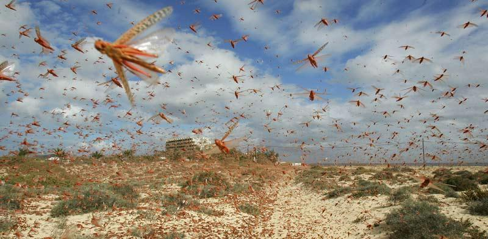

פרשת בוא - מכת הארבה

<u>שמות י'</u>

(יג) וַיֵּט משֶׁה אֶת מַטֵּהוּ עַל אֶרֶץ מִצְרַיִם
וַיהוה נִהַג רוּחַ קָדִים בָּאָרֶץ כָּל הַיּוֹם הַהוּא וְכָל הַלָּיְלָה הַבֹּקֶר הָיָה וְרוּחַ הַקָּדִים נָשָׂא
אֶת הָאַרְבֶּה:

(יד) וַיַּעַל הָאַרְבֶּה עַל כָּל אֶרֶץ מִצְרַיִם
וַיָּנַח בְּכֹל גְּבוּל מִצְרָיִם כָּבֵד מְאֹד לְפָנָיו לֹא הָיָה כֵן אַרְבֶּה כָּמֹהוּ וְאַחֲרָיו לֹא יִהְיֶה
כֵּן:

(טו) וַיְכַס אֶת עֵין כָּל הָאָרֶץ וַתֶּחְשַׁךְ
הָאָרֶץ וַיֹּאכַל אֶת כָּל עֵשֶׂב הָאָרֶץ וְאֵת כָּל פְּרִי הָעֵץ אֲשֶׁר הוֹתִיר הַבָּרָד וְלֹא נוֹתַר כָּל יֶרֶק
בָּעֵץ וּבְעֵשֶׂב הַשָּׂדֶה בְּכָל אֶרֶץ מִצְרָיִם:

כותב ספר שמות ידע הרבה על הארבה.

- שמו – ארבה, כנראה שם עם משמעות, הרבה.

- ה' הוא המביא אותו, אבל הוא תופעת טבע ידועה למספר (הוא
  לא "קסם" חדש, כמו הדם ביאור).

- הוא מגיע בעזרת הרוח, וגם נעלם בעזרתה (בפסוק מאוחר
  יותר).

- הוא מדהים... "לפניו לא היה כן, ארבה כמוהו, ואחריו לא
  יהיה כן".

- הוא מחשיך את השמים כענן כבד.

- הוא לא משאיר שום ירק על הארץ ועל העצים.

התיאור היפה ביותר בתנ"ך של תופעה קשה זו, נמצא בספר יואל
(אחד מנביאי תרי-עשר), ותיאור זה הוא מרכז הספר הקטן הזה. להלן פסוקים
מתיאורו, המקבילים לתיאור מכת הארבה בפרשה שלנו.

(לא ידוע זמנו של יואל, יש המניחים
שהוא ניבא בתקופה שבין חורבן שומרון לחורבן ירושלים, ויש המאחרים לתקופה
הפרסית).

<u>מתוך יואל פרק א' ופרק ב'</u>

(ב) שִׁמְעוּ זֹאת הַזְּקֵנִים וְהַאֲזִינוּ כֹּל
יוֹשְׁבֵי הָאָרֶץ הֶהָיְתָה זֹּאת בִּימֵיכֶם וְאִם בִּימֵי אֲבֹתֵיכֶם:

(ג) עָלֶיהָ לִבְנֵיכֶם סַפֵּרוּ וּבְנֵיכֶם
לִבְנֵיהֶם וּבְנֵיהֶם לְדוֹר אַחֵר:

(ד) יֶתֶר הַגָּזָם אָכַל הָאַרְבֶּה וְיֶתֶר הָאַרְבֶּה
אָכַל הַיָּלֶק וְיֶתֶר הַיֶּלֶק אָכַל הֶחָסִיל:

(ו) כִּי גוֹי עָלָה עַל אַרְצִי עָצוּם וְאֵין
מִסְפָּר שִׁנָּיו שִׁנֵּי אַרְיֵה וּמְתַלְּעוֹת לָבִיא לוֹ:

(ז) שָׂם גַּפְנִי לְשַׁמָּה וּתְאֵנָתִי לִקְצָפָה חָשׂף
חֲשָׂפָהּ וְהִשְׁלִיךְ הִלְבִּינוּ שָׂרִיגֶיהָ:

(ב) יוֹם חשֶׁךְ וַאֲפֵלָה יוֹם עָנָן וַעֲרָפֶל
כְּשַׁחַר פָּרֻשׂ עַל הֶהָרִים עַם רַב וְעָצוּם כָּמֹהוּ לֹא נִהְיָה מִן הָעוֹלָם וְאַחֲרָיו לֹא יוֹסֵף עַד
שְׁנֵי דּוֹר וָדוֹר:

(יא) וַיהוה נָתַן קוֹלוֹ לִפְנֵי חֵילוֹ כִּי
רַב מְאֹד מַחֲנֵהוּ כִּי עָצוּם עֹשֵׂה דְבָרוֹ כִּי גָדוֹל יוֹם יהוה וְנוֹרָא מְאֹד וּמִי
יְכִילֶנּוּ:

(כ) וְאֶת הַצְּפוֹנִי אַרְחִיק מֵעֲלֵיכֶם
וְהִדַּחְתִּיו אֶל אֶרֶץ צִיָּה וּשְׁמָמָה אֶת פָּנָיו אֶל הַיָּם הַקַּדְמֹנִי וְסֹפוֹ אֶל הַיָּם הָאַחֲרוֹן וְעָלָה
בָאְשׁוֹ וְתַעַל צַחֲנָתוֹ כִּי הִגְדִּיל לַעֲשׂוֹת:  

- שמות המכה הזאת, אצל יואל, הם חמישה.  
  הגזם, הארבה, הילק, החסיל, הצפוני.  
  הגזם – על שם פעולתו.  
  הארבה – על שם כמותו.  
  החסיל – מן הסתם, משום שהוא מחסל את השדות, ואמנם מופיע כך בספר דברים
  כ"ח (פרק קללות): " זֶרַע רַב תּוֹצִיא הַשָּׂדֶה וּמְעַט תֶּאֱסֹף כִּי יַחְסְלֶנּוּ
  הָאַרְבֶּה:" אבל, השורש
  ח'ס'ל' שידוע לנו מעברית מאוחרת, לא נמצא בתנ"ך אלא במקום זה. שאלה...  
  הילק – לא ידוע פירושו.  
  הצפוני – לא ברור, הארבה לא מגיע מהצפון.  
  שמות הארבה בתנ"ך כולו, ובמקורות המאוחרים יותר, רבים עוד יותר, דבר
  המדגיש את חשיבותו ומשקלו באזורנו. לאסקימוסים יש עשרה שמות לסוגי קרח
  (לנו אחד), ולנו יש שמות רבים לסוגי תאנה, שהם לא מכירים אותה...

- גם אצל יואל, האלוהים מביא את הארבה.  
  ברור, שמכה קשה, שהיא אקראית, שאיננו יודעים להסביר את מקורה ואת התהוותה
  ואת מועדיה, ובוודאי לא את התרופה לה – האל מביא אותה. מן הסתם, סיבתה
  חטאים שחטאנו, והתרופה היחידה לה היא חזרה בתשובה ותפילה. ואמנם בחנוכת
  בית המקדש בספר מלכים א' פרק ח', מתאר שלמה את תפקיד בית המקדש:  
  (לז) רָעָב כִּי יִהְיֶה בָאָרֶץ
  דֶּבֶר כִּי יִהְיֶה שִׁדָּפוֹן יֵרָקוֹן אַרְבֶּה חָסִיל כִּי יִהְיֶה כִּי יָצַר לוֹ אֹיְבוֹ בְּאֶרֶץ שְׁעָרָיו כָּל
  נֶגַע כָּל מַחֲלָה:

> (לח) כָּל תְּפִלָּה כָל תְּחִנָּה אֲשֶׁר תִּהְיֶה
> לְכָל הָאָדָם לְכֹל עַמְּךָ יִשְׂרָאֵל אֲשֶׁר יֵדְעוּן אִישׁ נֶגַע לְבָבוֹ וּפָרַשׂ כַּפָּיו אֶל הַבַּיִת הַזֶּה:  
> תפיסת אסונות טבע ואדם כעונשים משמים קיימת, כמובן, עד היום אצל חלק
> מהדתיים. הנה, לדוגמה, מקור מהמאה השבע עשרה, שמטרתו דווקא לפאר את האר"י
> הקדוש מצפת.  
> 
>
> <u>הקדמה ל"ספר עמק המלך" (1650 בערך, נפתלי הרץ בכרך,
> פרנקפורט)</u>
>
> פעם אחת ישב האר"י ז"ל בשדה, אצל קבר הושע בן בארי סמוך
> לצפת תוב"ב, עם העשרה תלמידים המובחרים, והיה דורש ומגלה להן סתרי תורה,
> באמצע הדרוש פתח ואמר להם, חבירים קול של כרוז אני שומע, שעומד ומכריז
> ברקיע למעלה וקולו הולך בכל הרקיעים. ואומר בזה הלשון, 'בגזירת עירין
> פתגמא, ובמאמר קדישין שאלתא' \[דניאל ד' י"ד\]
> (במאמר מלאכים הדבר ובמאמר
> קדושים השאלה), שיבא ארבה
> אין מספר בגבול צפת ויאכל כל עשב וכל פרי האדמה, לא תשאר מחיה לכל
> יושביה. בעבור עני אחד ושמו ר' יעקב אלטריץ, שיושב ומתרעם על הקב"ה,
> והקב"ה אינו יכול להתאפק עוד, על כל שכיניו הרעים יושבי צפת, שאינם
> משגיחים עליו, עד כאן לשון הכרוז.  
> 

- יואל לא מזכיר את הרוח. אך ניתן להניח שזו כוונתו "את
  הצפוני ארחיק מעליכם והדחתיו אל ארץ ציה וכו'".

- התופעה מדהימה את יואל, כמו את כותב ספר שמות, ותיאורו
  ספרותי הרבה יותר. גם אצלו כָּמֹהוּ לֹא נִהְיָה מִן הָעוֹלָם וְאַחֲרָיו לֹא יוֹסֵף עַד שְׁנֵי
  דּוֹר וָדוֹר:  
  בסלנג שלנו: "אין דבר כזה".  
  בנוסף לפחד, לאימה ולחוסר האונים, קיימת גם הערצה מסוימת לארבה. הנביא
  מעריץ אותו על המשמעת החברתית:  
  (ז) כְּגִבּוֹרִים יְרֻצוּן כְּאַנְשֵׁי
  מִלְחָמָה יַעֲלוּ חוֹמָה וְאִישׁ בִּדְרָכָיו יֵלֵכוּן וְלֹא יְעַבְּטוּן אֹרְחוֹתָם: (ח) וְאִישׁ אָחִיו לֹא
  יִדְחָקוּן גֶּבֶר בִּמְסִלָּתוֹ יֵלֵכוּן וּבְעַד הַשֶּׁלַח יִפֹּלוּ לֹא יִבְצָעוּ: (פרק
  ב')  
  הערצה דומה נמצא גם בספר משלי פרק ל':  
  (כד) אַרְבָּעָה הֵם קְטַנֵּי אָרֶץ
  וְהֵמָּה חֲכָמִים מְחֻכָּמִים:

> (כה) הַנְּמָלִים עַם לֹא עָז וַיָּכִינוּ
> בַקַּיִץ לַחְמָם:
>
> (כו) שְׁפַנִּים עַם לֹא עָצוּם וַיָּשִׂימוּ
> בַסֶּלַע בֵּיתָם:
>
> (כז) מֶלֶךְ אֵין לָאַרְבֶּה וַיֵּצֵא חֹצֵץ
> כֻּלּוֹ:
>
> (כח) שְׂמָמִית בְּיָדַיִם תְּתַפֵּשׂ וְהִיא
> בְּהֵיכְלֵי מֶלֶךְ:  
> 

החושך שענן הארבה מייצר, והחיסול הטוטלי של כל מה שירוק,
מתוארים אצל יואל בצורה דרמטית הרבה יותר.  
(ב) יוֹם חשֶׁךְ וַאֲפֵלָה יוֹם עָנָן
וַעֲרָפֶל כְּשַׁחַר פָּרֻשׂ עַל הֶהָרִים עַם רַב וְעָצוּם כָּמֹהוּ לֹא נִהְיָה מִן הָעוֹלָם וְאַחֲרָיו לֹא יוֹסֵף
עַד שְׁנֵי דּוֹר וָדוֹר:

(ג) לְפָנָיו אָכְלָה אֵשׁ וְאַחֲרָיו תְּלַהֵט
לֶהָבָה כְּגַן עֵדֶן הָאָרֶץ לְפָנָיו וְאַחֲרָיו מִדְבַּר שְׁמָמָה וְגַם פְּלֵיטָה לֹא הָיְתָה לּוֹ:

היום יודעים על הארבה יותר, כמובן, אך תיאורי ספר שמות
וספר יואל משכנעים גם היום, חוץ מאשר אולי הפסוק האחרון "ואחריו מדבר
שממה".

מהויקיפדיה ניתן ללמוד, שידועים בעולם כ 8000 מינים של
חגבים. מתוכם, יש 12 מינים, שבתנאים מסוימים מתלכדים ללהקות נודדות, ולהקות
אלו נקראות בשפתנו ארבה.  
בין המינים האלה: חגב נודד, חגב אדום, חגב אוסטרלי, וידידנו העיקרי הוא חגב
סודני מדברי.  
האחרון שנראה כך:  

מופיע בשתי צורות: העליונה כחרק בודד, והתחתונה במדי חייל
בגדוד (כלומר, בלהקת ארבה).

החגב הסודני המדברי, בהופעתו כארבה, הוא הנפוץ במזרח
התיכון, צפון אפריקה ובהודו.

איך הופך חגב לארבה?

עדיין הנושא נחקר.

ההנחה המקובלת היא, שבמצב של שפע, נקבת החגב מטילה פי כמה
ביצים בשנה, מאשר במצב רגיל, והחגבים שבוקעים הם בצבע אחר, והם או צאצאיהם
כבר יתלכדו לנחילים. לכן, למרבה הציניות של עולם הטבע, גשמי ברכה בסודן,
יכולים להביא לשואה לחקלאות בארצות עניות שמסביב.

הנחילים מתקדמים בכל דרך, כי הם מחסלים את מזונם במהירות.
גם בהליכה, ואפילו חציית נחלים על גבי חבריהם ("שנשכבים על הגדר"), וכמובן,
במעוף בסיוע רוחות. נחיל עף, יכול לעבור מאתיים קילומטר ביום, ולהגיע
למרחקים עצומים. נחילים הגיעו מאפריקה לבריטניה.

אולם בניגוד לדעתו של הנביא יואל "כגן עדן הארץ לפניו
ואחריו מדבר שממה" –

הארבה (בניגוד לבני האדם...) דואג גם לעתיד:

א. הוא לא משמיד את הצמחים, אלא רק זולל את העלים ומאפשר
להם לצמוח מחדש.

ב. הוא מדשן את האדמה מתחתיו. ואם הארבה מגיע בוגר, הנקבות
מטילות ביצים במקום הנחיתה, והיצורים הקטנים (שאינם זחלים, אלא חגבים קטנים
הגדלים ומשילים את עורם כמה פעמים בזמן גידולים), יגדלו הישר למרעה שיצמח
מחדש יחד איתם... ואוי לחקלאים.

כאן אנו רואים את פלאי האבולוציה. הארבה שלא מחזיק אלפי
מדענים החוזים את חורבן העולם על ידי ניצולו המוגזם, "למד" בדרך
אבולוציונית, לתחזק גם את הדורות הבאים שלו.

<u>והערה על הרעיון הפילוסופי של האבולוציה:</u>

רעיון האבולוציה הוא מהפכני גם מבחינה פילוסופית, מבחינה
זו שהוא מסביר תכלית, על ידי סיבה, המורכבת מאקראיות, יחד עם המרכיב הדרמטי
של הזמן.

- המאמין יגיד, שאלוהים ברא את הארבה עם תכונות שמתאימות
  להישרדותו, והוא פועל עם תחושת תכלית, דאגה לעתיד. פרקים שלמים בתהילים,
  איוב, משלי, מביעים רעיון זה.

- הביולוג יגיד, שמיליוני שנים של מוטציות בחרקים, הביאו
  להכחדת אלפי מינים של ארבה שלא היה בעל התכונה המתאימה, והותירו את זה,
  שבאופן מקרי לא משמיד את הצמחים, ואם הוא נשאר מספיק זמן להתרבות, הוא גם
  מדשן.

הארבה אינו "מכה" היסטורית. הוא מהווה בעייה עצומה עד
היום, בעיקר במדינות מתפתחות, שלא ערוכות להתמודד איתו.  
בישראל, הארבה בהחלט איום, אבל משתדלים לקדם אותו על ידי ריסוסו באוויר,
בהתאם למשטר הרוחות, ואם אין ברירה מרססים אותו על הארץ.

הנה קטע מהתקשורת, והתאריך: מאי 2020.

מאי 2020 – האיים הקנריים

"הכול התחיל לפני שנתיים, במדבריות
המרוחקים והריקים של עומאן, הפריפריה של העולם. אוקיינוס של חול וגלי
דיונות גבוהים. שם גדלו הנחילים באין רואה, תודות לגשמים הנדיבים שירדו.
בסוף 2018 החלו להופיע בדרום עומאן ומשם התפשטו צפונה, לאיראן מוכת הקורונה
והסנקציות, לפקיסטן (וממנה להודו) וגם דרומה, לכיוון תימן המוכה ממלחמת
אזרחים ארוכה. בתחילת הקיץ האחרון קפץ הארבה והתפשט למפרץ. משם עברו
הנחילים לסומליה, היכו בה קשה וקפצו לאתיופיה ולקניה. מהירים ורציניים כמו
שריפות".

כך נראה הארבה השנה, 20 ביוני 2020, פקיסטן.

[<u>https://www.euronews.com/2020/07/03/crop-killing-locust-swarms-spotted-across-three-continents</u>](https://www.euronews.com/2020/07/03/crop-killing-locust-swarms-spotted-across-three-continents)

מה עושים, כאשר מכת הארבה גורמת לרעב קשה??? מה
אוכלים???

אוכלים את הארבה עצמו.

ואפילו תורתנו הקדושה, שהטילה עלינו מגבלות אינסוף בנושאי
המזון, ואת רוב החרקים הגדירה כשרצים טמאים, לא רק למאכל אלא למגע – את
הארבה התירה לאכול.

<u>ויקרא י"א</u>

(כא) אַךְ אֶת זֶה תֹּאכְלוּ מִכֹּל שֶׁרֶץ הָעוֹף
הַהֹלֵךְ עַל אַרְבַּע אֲשֶׁר לֹוֹ כְרָעַיִם מִמַּעַל לְרַגְלָיו לְנַתֵּר בָּהֵן עַל הָאָרֶץ:

(כב) אֶת אֵלֶּה מֵהֶם תֹּאכֵלוּ אֶת הָאַרְבֶּה
לְמִינוֹ וְאֶת הַסָּלְעָם לְמִינֵהוּ וְאֶת הַחַרְגֹּל לְמִינֵהוּ וְאֶת הֶחָגָב לְמִינֵהוּ:

ואכן, הארבה, הוא מאכל מקובל במקומות רבים, ולא רק אצל
הסינים שכל החרקים עולים על שולחנם. אצלנו היה מקובל אצל התימנים. אפשר גם
להמליח, ולשמור בצורות שונות.

מצאתי גם מתכון, כדי לעורר את התיאבון.

חגבים מוקפצים

ולסיום, הומור המופיע במדרש "שמות רבה" מלפני כאלף שנה.  
כתוב בפרשה שלנו, שמכת הארבה נעלמה, כמו כל המכות שלפניה אחרי תחנוני פרעה,
או סתם מפני שהיה צריך להתקדם לגאולה. ואיך היא נעלמה?

<u>שמות פרק י'</u>

(יט) וַיַּהֲפֹךְ יהוה רוּחַ יָם חָזָק מְאֹד
וַיִּשָּׂא אֶת הָאַרְבֶּה וַיִּתְקָעֵהוּ יָמָּה סּוּף לֹא נִשְׁאַר אַרְבֶּה אֶחָד בְּכֹל גְּבוּל מִצְרָיִם:

והפרשן, מה הוא אומר:

<u>שמות רבה פרשה י"ג (ספר מדרשים, כנראה מהמאה ה
12)</u>

(ז) "ויהפך ה' רוח ים" מהו "לא
נשאר ארבה אחד"?  
א"ר יוחנן כיון שבא ארבה שמחו המצרים. אמרו נקבוץ ונמלא מהם חביות. אמר
הקב"ה, רשעים, במכה שהבאתי עליכם בה אתם שמחים?! מיד ויהפך ה' רוח ים חזק
מאד, זה רוח מערבית, וישא את הארבה וגו'. מהו לא נשאר ארבה אחד? אפילו מה
שהיו בקדירות ובחביות מלוחות פרחו והלכו להם...

