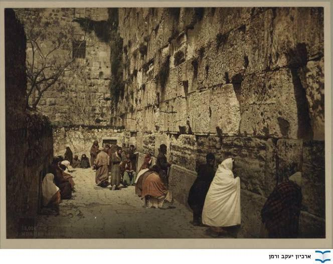
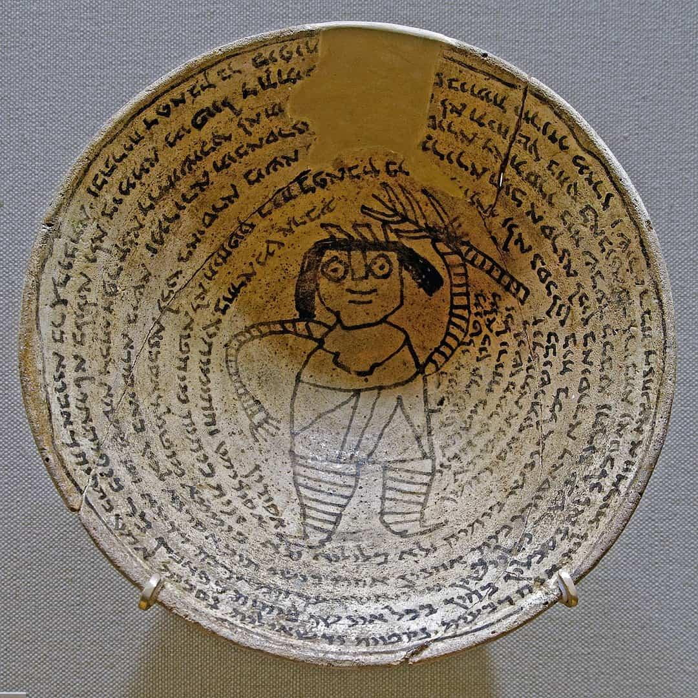

<u>פרשת בשלח – "קול באשה
ערוה"</u>

<u>מהי ערווה?</u>

1. איברי המין.

2. הכללה לחטא הקשור במין.

3. הכללה לחטא הקשור בהרהורים על
חטא הקשור במין.

4. כנוי לאשה שאסור לאדם לבוא במגע
אתה (ברבים "עריות").

"קול באשה ערוה" –

קולה של אשה, הוא גורם (לגבר...) להרהר בחוויות מיניות שהן
חטא לגביו.

נראה, שההתייחסות המגוונת למותר ואסור בנושא זה, ונושאים
הקרובים אליו, אינה חידוש של קיצוניים בימינו, אלא מלווה את היהדות (ודתות
אחרות) לאורך אלפי שנים.

התייחסות זו היא חלק מגישה כללית הרואה את האשה כנחותה,
חסרת זכויות, חסרת יכולת, ואפילו אם לא, היא מפתה מבחינה מינית ומערערת את
הסדר הנכון.

והפסוקים הבאים בפרשה שלנו, הביאו לדיון זה....

<u>שמות ט"ו</u>

(כ) וַתִּקַּח מִרְיָם הַנְּבִיאָה אֲחוֹת אַהֲרֹן אֶת
הַתֹּף בְּיָדָהּ וַתֵּצֶאןָ כָל הַנָּשִׁים אַחֲרֶיהָ בְּתֻפִּים וּבִמְחֹלֹת:

(כא) וַתַּעַן לָהֶם מִרְיָם שִׁירוּ לַיהוה כִּי
גָאֹה גָּאָה סוּס וְרֹכְבוֹ רָמָה בַיָּם:

למה לה מותר, ואילו על במות ציבוריות מישראל יש
בעיה?

ממתי "קול באשה ערווה", וריקוד נשים פריצות מוחלטת?

בניגוד לתחושה, המתקבלת מהיהדות האורתודוקסית בימינו, על
מקומה של האישה, נחיתותה וחולשתה, אין הדבר כך בתנ"ך. וזאת למרות ההיררכיה
המקובלת בחברות שבטיות (ולא רק). גם אחר כך, לא היה תמיד כך ולא בכל מקום
כך.

בספר בראשית, בתקופת האבות, הנשים מנווטות לא רע (שרה,
רבקה, ואפילו לאה ורחל המחליטות עם מי ישכב יעקב...).

בתחילת ספר שמות, הנשים נוטלות פיקוד: יוכבד, מרים, בת
פרעה, המיילדות...

בספר במדבר, מקבלות בנות צלפחד זכות ירושה, כאשר אין בנים
במשפחה, אבל מה שמפתיע יותר, שהן מלמדות את אלוהים חוק חדש...

<u>במדבר כ"ז:</u>

(ו) וַיֹּאמֶר יהוה אֶל משֶׁה
לֵּאמֹר:

(ז) כֵּן בְּנוֹת צְלָפְחָד דֹּבְרֹת נָתֹן תִּתֵּן
לָהֶם אֲחֻזַּת נַחֲלָה בְּתוֹךְ אֲחֵי אֲבִיהֶם וְהַעֲבַרְתָּ אֶת נַחֲלַת אֲבִיהֶן לָהֶן:

(ח) וְאֶל בְּנֵי יִשְׂרָאֵל תְּדַבֵּר לֵאמֹר אִישׁ
כִּי יָמוּת וּבֵן אֵין לוֹ וְהַעֲבַרְתֶּם אֶת נַחֲלָתוֹ לְבִתּוֹ:

נעמי ורות מובילות את בועז "לחופה". (נעמי מנחה את רות,
להתייחד עם בועז בגורן...)

אביגיל, ובת שבע "מסובבות" את דוד מלך ישראל. אביגיל הופכת
לאשתו, בת שבע לא רק אשתו, אלא גם דואגת שבנה יירש את הממלכה.

את דבורה הנביאה כולנו מכירים... אך גם לחולדה הנביאה
תפקיד חשוב בעידוד יאשיהו המלך למלא את הכתוב בספר התורה "שנמצא" לפתע
במקדש..

מלכות לא קיימות ביהודה ובישראל (מלבד עתליה, שנוטלת את
המלוכה באלימות), אבל ספר מלכים מזכיר את אם המלך, ומן הסתם היה לה
תפקיד:

ירבעם... ושם אמו צרועה...

רחבעם... ושם אמו נעמה...

אסא... שם אמו מעכה...

יהושפט... שם אמו עזובה...

עוזיה... שם אמו יכליהו...

וכן הלאה.

גם ב"שיר השירים" האשה נראית בולטת יותר מהגבר, ובהחלט
איננה פסיבית. כדאי לקרוא בעיון.  
בכל מקרה זו שירת אהבה, שרובה נשית, וגברים יהודים קוראים אותה בכל
הדורות.

ספר "משלי" שהוא אנטולוגיה , מכיל כבר עמדות שונות.

מצד אחד, פרק ז', האשה הנואפת, הפתיינית, המסוכנת (אבל
היוזמת):

(ד) אֱמֹר לַחָכְמָה אֲחֹתִי אָתְּ וּמֹדָע לַבִּינָה
תִקְרָא:

(ה) לִשְׁמָרְךָ מֵאִשָּׁה זָרָה מִנָּכְרִיָּה אֲמָרֶיהָ
הֶחֱלִיקָה:

(ו) כִּי בְּחַלּוֹן בֵּיתִי בְּעַד אֶשְׁנַבִּי
נִשְׁקָפְתִּי:

(ז) וָאֵרֶא בַפְּתָאיִם אָבִינָה בַבָּנִים נַעַר
חֲסַר לֵב:

.........

(יג) וְהֶחֱזִיקָה בּוֹ וְנָשְׁקָה לּוֹ הֵעֵזָה
פָנֶיהָ וַתֹּאמַר לוֹ:

........

(יח) לְכָה נִרְוֶה דֹדִים עַד הַבֹּקֶר נִתְעַלְּסָה
בָּאֳהָבִים:

(יט) כִּי אֵין הָאִישׁ בְּבֵיתוֹ הָלַךְ בְּדֶרֶךְ
מֵרָחוֹק:

מצד שני האישה המושלמת בפרק ל"א:

(י) אֵשֶׁת חַיִל מִי יִמְצָא וְרָחֹק מִפְּנִינִים
מִכְרָהּ:

(יא) בָּטַח בָּהּ לֵב בַּעְלָהּ וְשָׁלָל לֹא
יֶחְסָר:

(יב) גְּמָלַתְהוּ טוֹב וְלֹא רָע כֹּל יְמֵי
חַיֶּיהָ:

(יג) דָּרְשָׁה צֶמֶר וּפִשְׁתִּים וַתַּעַשׂ בְּחֵפֶץ
כַּפֶּיהָ:

(יד) הָיְתָה כָּאֳנִיּוֹת סוֹחֵר מִמֶּרְחָק תָּבִיא
לַחְמָהּ:

(טו) וַתָּקָם בְּעוֹד לַיְלָה וַתִּתֵּן טֶרֶף
לְבֵיתָהּ וְחֹק לְנַעֲרֹתֶיהָ:

(טז) זָמְמָה שָׂדֶה וַתִּקָּחֵהוּ מִפְּרִי כַפֶּיהָ
נטעה כָּרֶם:

(יז) חָגְרָה בְעוֹז מָתְנֶיהָ וַתְּאַמֵּץ
זְרוֹעֹתֶיהָ:

(יח) טָעֲמָה כִּי טוֹב סַחְרָהּ לֹא יִכְבֶּה
בַלַּיְלָה נֵרָהּ:

(יט) יָדֶיהָ שִׁלְּחָה בַכִּישׁוֹר וְכַפֶּיהָ תָּמְכוּ
פָלֶךְ:

.......

(כו) פִּיהָ פָּתְחָה בְחָכְמָה וְתוֹרַת חֶסֶד עַל
לְשׁוֹנָהּ:

(כז) צוֹפִיָּה הֲלִיכוֹת בֵּיתָהּ וְלֶחֶם עַצְלוּת
לֹא תֹאכֵל:

(כח) קָמוּ בָנֶיהָ וַיְאַשְּׁרוּהָ בַּעְלָהּ
וַיְהַלְלָהּ:

לכאורה, אישה נאמנה יושבת בית וצייתנית, אך בפירוט הדברים,
היא גם עובדת קשה בכל עבודה מקצועית, סוחרת, פילנטרופית, וחכמתה ניכרת גם
בדבריה. רמה גבוהה של שוויון.

ואם נחזור ונדגיש שירה וריקודים, מרים הנביאה לא היתה
הזמרת והרקדנית היחידה.

בספר שופטים כ"א, בהקשר העצוב של סיפור פילגש בגבעה, מתגלה
מנהג:

<u>שופטים כ"א</u>

(יט) וַיֹּאמְרוּ הִנֵּה <u>חַג יהוה בְּשִׁלוֹ
מִיָּמִים יָמִימָה</u> אֲשֶׁר מִצְּפוֹנָה
לְבֵית אֵל מִזְרְחָה הַשֶּׁמֶשׁ לִמְסִלָּה הָעֹלָה מִבֵּית אֵל שְׁכֶמָה וּמִנֶּגֶב לִלְבוֹנָה:

(כ) וַיְצַוֻּו אֶת בְּנֵי בִנְיָמִן לֵאמֹר לְכוּ
וַאֲרַבְתֶּם בַּכְּרָמִים:

(כא) וּרְאִיתֶם וְהִנֵּה <u>אִם יֵצְאוּ בְנוֹת
שִׁילוֹ לָחוּל בַּמְּחֹלוֹת</u>
וִיצָאתֶם מִן הַכְּרָמִים וַחֲטַפְתֶּם לָכֶם אִישׁ אִשְׁתּוֹ מִבְּנוֹת שִׁילוֹ וַהֲלַכְתֶּם
אֶרֶץ בִּנְיָמִן:

ואם הן מחוללות בכרמים, מן הסתם, מותר להסתכל
לכל...

וכאשר דוד חוזר מנצחונו על גוליית:

<u>שמואל א' י"ח</u>

(ו) וַיְהִי בְּבוֹאָם בְּשׁוּב דָּוִד מֵהַכּוֹת אֶת
הַפְּלִשְׁתִּי וַתֵּצֶאנָה הַנָּשִׁים מִכָּל עָרֵי יִשְׂרָאֵל לָשִׁיר וְהַמְּחֹלוֹת לִקְרַאת שָׁאוּל הַמֶּלֶךְ בְּתֻפִּים
בְּשִׂמְחָה וּבְשָׁלִשִׁים:

(ז) וַתַּעֲנֶינָה הַנָּשִׁים הַמְשַׂחֲקוֹת וַתֹּאמַרְןָ
הִכָּה שָׁאוּל בַּאֲלָפָיו וְדָוִד בְּרִבְבֹתָיו:

אם כך את הכלל "קול באשה ערוה" לא למדו חכמינו מהתנ"ך,
בוודאי לא מימי הבית הראשון.

בחמש מאות השנים של ימי הבית השני היו התפתחויות רבות, וגם
זרמים שונים ביהדות, ופולמוסים שונים. אבל היסטוריונים מועטים
מאוד...

אנחנו יודעים על מלכה אחת בתקופת החשמונאים, שלומציון
המלכה, שהייתה בברית עם הפרושים (שחז"ל הם ממשיכי דרכם).

בתקופה זו נכתב "ספר היובלים" (נכתב כמאתיים שנה לפני
חורבן בית שני, בעברית. נמצא במלואו רק בתרגום לשפת געז, ובחלקו בעברית בין
מגילות מדבר יהודה). ספר היובלים, שמסבות שונות נדחה כספר חיצוני, "מתקן"
את ספר בראשית, ובין השאר מוסיף את שמות הנשים החסרות...

טו) וביובל השביעי בשבוע השלישי לקח
אנוש את אחותו נעמה לו לאשה, ותלד לו בן בשנה השלישית לשבוע החמישי, ויקרא
את שמו קינן.

  
טז) ומקץ היובל השמיני לקח קינן
את אחותו מהללאית לו לאשה, ותלד לו בן ביובל התשיעי בשבוע הראשון בשנה
השלישית לשבוע, ויקרא את שמו מהללאל.

  
יז) ובשבוע השני ליובל
העשירי לקח מהללאל את דינה בת ברכאל בת אחות אביו לו לאשה, ותלד לו בן
בשבוע השלישי בשנה השישית, ויקרא את שמו ירד. (יח) כי בימיו ירדו מלאכי ה'
הנקראים שומרים על הארץ, ללמד את בני אדם משפט ומישרים לעשותם
בארץ.

  
יט) וביובל העשתי עשר לקח לו
ירד לאשה את בכה בת רצוצאל בת אחות אביו, בשבוע הרביעי ליובל הזה. (כ) ותלד
לו בן בשבוע החמישי בשנה הרביעית ליובל, ויקרא את
שמו חנוך.

בכל בתי הכנסת שנמצאו בארץ, מתקופת בית שני וגם בתקופת
המשנה והתלמוד לא נמצא סימן להפרדה בין נשים וגברים.

ובהחלט ידוע שנשים הלכו לבית הכנסת.

הנה, למשל, קטע שדן בשאלה, מה פירוש שבעל מקנא לאשתו, ולכן
דורש את מבחן הסוטה:

<u>ירושלמי סוטה ג' א'</u>

 .... אמר רבי יוסי בי רבי בון אמר
לה <u>אל תיכנסי לבית הכנסת</u>
\[כי את מסתכלת על גבר
אחר...\]. <u>נכנסת
עמו</u> \[זה
בסדר?\]. אמר רבי מנא לא
אמר אלא עמו הא זה אחר זה לא. רבי אבין אמר אפילו זה אחר זה. מכל מקום יש
רגלים לדבר. \[כלומר אם הם
לא נכנסים יחד מותר לו לחשוד\]

האם הייתה הפרדה בבית המקדש?

על כך הדעות חלוקות.

אפילו ליוסף בן מתתיהו, שהיה כוהן בעצמו בתקופת המקדש יש
גירסאות שונות.

בבית המקדש הייתה "עזרת נשים" אך לא במשמעות של בתי הכנסת
היום, אלא במשמעות שעד שם יכלו גם הנשים להיכנס, כי פנימה יותר נכנסו רק
גברים עם דרישות טהרה גדולות יותר.

<u>משנה, כלים, פרק א'</u>

(ח) לפנים מן החומה מקֻדש מהם,
שאוכלים שם קדשים קלים ומעשר שני. הר הבית מקֻדש ממנו, שאין זבים וזבות נדות
ויולדות נכנסים לשם. החיל מקדש ממנו, שאין גוים וטמא מת נכנסים לשם. עזרת
נשים מקדשת ממנו, <u>שאין טבול יום נכנס
לשם</u>, \[כלומר גברים
נכנסים לעזרת נשים\] ואין
חיבים עליה חטאת. עזרת ישראל מקדשת ממנה, שאין מחסר כפורים נכנס לשם,
וחיבין עליה חטאת. עזרת הכהנים מקדשת ממנה, שאין ישראל נכנסים לשם אלא בשעת
צרכיהם, לסמיכה לשחיטה ולתנופה:

<u>יוסף בן מתתיהו, "נגד אפיון" ב' ח'</u>

כי ארבע חצרות (עזרות) במקדש מסביב, ובכל חצר וחצר נמצאה
משמרת מיוחדה לה לבדה על פי החק הקבוע. לכל אדם היה מותר להיכנס אל החצר
החיצונה (עזרת הנכרים) גם לנכרים, <u>ורק על הנשים הנידות נאסר לדרוך
בקרבה</u>. אל החצר השנייה
(עזרת-נשים) <u>באו כל היהודים הגברים
והנשים</u>, הטהורים מכל
טומאת הגוף. ואל החצר השלישית (עזרת ישראל) באו רק הזכרים מקרב היהודים,
אשר היו טהורים והתקדשו. 

עדותו מתאימה לכתוב במשנה.

לעומת זה בספר "מלחמת היהודים" ספר ה' ס' 198:

"במזרח היה צורך בשני שערים: מאחר
שבצד זה הוקם קיר מפריד התוחם מקום מיוחד לעבודת האלוהים של הנשים, היה
צורך בשער שני, והוא נפרץ אל מול השער הראשון..."

מה שניתן להבין מכאן, שבימיו, או קרוב לימיו חל שינוי!
וכנראה, השינוי קשור לשמחת בית השואבה:

<u>משנה, מסכת סוכה, פרק ה'</u>

 (ב) במוצאי יום טוב הראשון של חג,
ירדו לעזרת נשים, ומתקנין שם <u>תקון
גדול</u>. ומנורות של זהב
היו שם.....

(ד) חסידים ואנשי מעשה היו מרקדים
לפניהם באבוקות של אור שבידיהן, ואומרים לפניהן דברי שירות ותשבחות. והלוים
בכנורות ובנבלים ובמצלתים ובחצוצרות ובכלי שיר בלא מספר, על חמש עשרה מעלות
היורדות מעזרת ישראל לעזרת נשים, ...

והגמרא, אומנם שנים רבות לאחר מכן, מפרשת, בבלי, סוכה דף
נ"א

גמרא:....

מאי <u>תיקון גדול</u>
אמר רבי אלעזר כאותה ששנינו חלקה היתה בראשונה והקיפוה
גזוזטרא, והתקינו שיהו נשים יושבות מלמעלה ואנשים מלמטה. תנו רבנן בראשונה
היו נשים מבפנים ואנשים מבחוץ והיו באים לידי קלות ראש התקינו שיהו נשים
יושבות מבחוץ ואנשים מבפנים ועדיין היו באין לידי קלות ראש התקינו שיהו
נשים יושבות מלמעלה ואנשים מלמטה...

וכמובן, שאלה, אם רבי אליעזר מפרש נכון לאחר שנים רבות מהו
"תיקון גדול" ......

בכל אלה לא מצאנו כלל, איסור על שמיעת שירת נשים או צפייה
בריקודי נשים.

מהיכן זה בא?

לכאורה, בבלי ברכות דף כ"ד:

אמר רבי יצחק טפח באשה ערוה למאי אילימא לאסתכולי
בה \[אם לומר
הסתכלות\] ...... אמר רב
חסדא, שוק באשה ערוה שנאמר, "גלי שוק עברי נהרות" וכתיב "תגל ערותך וגם
תראה חרפתך". אמר שמואל, <u>קול באשה
ערוה</u>, שנאמר "כי קולך
ערב ומראך נאוה". אמר רב ששת, שער באשה ערוה, שנאמר שערך כעדר
העזים...

המינוח של "ערוה" כאן כוונתו "פיתוי מיני אסור". <u>אבל כל
האיסורים כאן, הם רק לעניין קריאת שמע (שזה נושא הדיון). כלומר אסור לקרוא
קריאת שמע בנוכחות...</u>

אבל אם נקפוץ מהמאה השלישית או החמישית, שבה נכתבו הדברים,
אל הרמב"ם במאה האחת עשרה, אנחנו כבר בצרות:

<u>רמב"ם היד החזקה, איסורי ביאה כ"א ב'</u>

(ב) ואסור לאדם לקרוץ בידיו
וברגליו, או לרמוז בעיניו, לאחת מן העריות
\[כל אשה שאסורה
עליו\]; וכן לשחק עימה, או
להקל ראש. ואפילו להריח בשמים שעליה, או להביט ביופייה - אסור; ומַכִּין
למתכוון לדבר זה, מכת מרדות. והמסתכל אפילו באצבע קטנה של אישה, ונתכוון
ליהנות, כמו שנסתכל במקום התורף; <u>ואפילו לשמוע קול
הערווה</u>, או לראות
שיערה - אסור:

אבל הוא המחמיר שבמחמירים (אולי רק הרלב"ג, היה "שונא
נשים" יותר ממנו).

בימיו, או מעט לפניו, התנהגו יהודי ספרד, כנראה, אחרת
לחלוטין.

<u>יהודה הלוי</u>

שׁוּר אִם קָרְעָה בַּת שַׁחַר שַׁחְרוּת שִׁרְיוֹנֶיהָ

אֶל קוֹל שִׁירֵי הַנַּעֲרָה וּלְקוֹל שִׁיר יוֹנֶיהָ

בְּתוּלוֹת עַל שִׁירָתָן וְכִנּוֹר עַל נְגִינָתוֹ

לַעֲלֹז הַיּוֹם בְּחָתָן יֹצֵא מֵחֻפָּתוֹ

<u>שלמה אבן גבירול:</u>

וְאַתְּ יוֹנָה, חֲבַצֶּלֶת שְׁרוֹנִים, / וְשׁוּלַיך מְלֵאִים פַּעֲמוֹנִים...

שְׁבִי פֹה, יַעֲלַת –הַחֵן, לְנֶגְדִּי / וְהָעִירִי לְדוֹדֵך הששונים

קְחִי הַתֹּף וְהַנֶּבֶל וְשִׁירִי / בְּנִגּוּנֵך עֲלֵי עָשור ומנים

וְקוּמִי, הַלֲלִי דוֹדֵך בְּחִירֵך/ יקותיאל, נשיא שרים
ורוזנים.

(מתוך המאמר ברשת, "אל קול שירי
הנערה" על נשים אומרות שיר בשירה העברית בספרד, מאת יהושע גרנט)

<u>שולחן ערוך (המאה השבע עשרה), אורח חיים, סימן
ע"ה.</u>

 (ג) יש ליזהר משמיעת קול זמר אשה
<u>בשעת קריאת שמע</u>:
הגה - ואפי' באשתו, אבל קול הרגיל בו אינו ערוה (ב"י בשם אהל מועד והגהות
מיימוני):

חוזר לגירסה המתונה של הבבלי.

<u>וכן ספר בן איש חי , הלכות שנה ראשונה, פרשת
בא</u>

(נכתב על ידי ר' יוסף חיים מבגדד,
מגדולי הרבנים בסוף המאה התשע עשרה, ומחמיר יחסית לרבנים המזרחיים)

\[יג\] קול זמר של אשה, בין פנויה
בין אשת איש, ואפיל קול זמר של אשתו הוא ערוה, <u>ואסור לקרות בדברי תורה
או להתפלל ולברך
כששומעו</u>, ואין חילוק
בזה בין כעורה או זקנה, ופה עירנו דרך הנשים להיות פועות לתינוק הבוכה בקול
ניגון באזניו כדי להשתיקו, ולהביא לו השינה, וצריך ליזהר שלא ילמוד בעת
שהאשה פועה ומנגנת לתינוק, ואפילו היא אשתו, ...

הדעות תמיד חלוקות.

בשנת 1890 ניתן לראות נשים וגברים יחד ליד הכותל
המערבי.

תפילה מעורבת בכותל המערבי בערך ב 1890

מה זה, לעומת רבנינו היום...

YNET 17/11/2011

רב השומרון וראש ישיבת ההסדר באלון
מורה, [אליקים](https://www.ynet.co.il/articles/0,7340,L-4040414,00.html)
[לבנון](https://www.ynet.co.il/articles/0,7340,L-4040414,00.html),
מזהיר כי אם צה"ל יאמץ את ההמלצות המסתמנות של הוועדה שהקים הרמטכ"ל, לפיהן
יחויבו חיילים דתיים להשתתף בטקסים רשמיים שבהם
יש [שירת](https://www.ynet.co.il/articles/0,7340,L-4119654,00.html)
[נשים](https://www.ynet.co.il/articles/0,7340,L-4119654,00.html),
רבנים רבים ינחו את תלמידיהם לנטוש אירועים אלה,
<u>"גם אם בשל כך יועמדו מול כיתת
יורים". </u>

 

ולסיכום עד כאן, נראה כי הפרדת נשים בכלל, וממילא שירת
נשים בפרט לא היוותה בעייה בימי בית ראשון ואף בימי בית שני, אך החל מסופו
ודרך תקופת חז"ל, הגאונים בבבל והלאה באירופה מתחילה החמרה, וגם היא תלויה
במקום ובאישיות של הרב.

<u>מה הגורם לכך?</u>

בעולם העתיק מוצאים שתי מגמות:

אצל היוונים הפליית נשים וסגירתן ברורה, ואילו במזרח הרבה
פחות, אם בכלל.

נשים ביוון העתיקה (ויקיפדיה)

החברה ביוון
הייתה [פטריארכלית](https://he.wikipedia.org/wiki/%D7%A4%D7%98%D7%A8%D7%99%D7%90%D7%A8%D7%9B%D7%99%D7%94),
ומכאן היחס לנשים. בדרך כלל מקומה של האישה נשמר בבית (באויקוס) בתחום
שהוקצה לה - ....  
הנשים ישבו במקום נפרד, קרוב לאזור הבישול, וגם אכלו בנפרד מבעליהן. בדרך
כלל חדרי הנשים
(gunaikeion) נמצאו בקומה
העליונה, והן ישנו שם ביחד עם הילדים. הגבלת מקומן של הנשים לא הצטמצם
לתחום הבית אלא גם לתחום הציבורי והחברתי. לנשים אסור היה לצאת מהבית אלא
לאירועים מיוחדים כמו הלוויות, טקסים דתיים ....  
כמו כן, לנשים אסור היה להשתתף או להיות נוכחות באירועים פוליטיים כמו
אסיפות העם וההצבעות שנערכו שם, ובאירועים חברתיים כמו הצגות
תיאטרון.

<u>לא כן, במזרח. לא במצרים, לא בפרס.</u>

הנה עדות של אבי ההיסטוריונים, הירודוטוס, על מסעו
במצרים.

כתבי הרודוטוס (המאה החמישית לפני הספירה), תרגום אלכסנדר
שור, הוצאת ראובן מס, תרצ"ה.

<u>ספר שני סעיף 35...</u>

"כך הם המצרים כמעט בכל דבר ההפך
לגמרי במנהגיהם ובנמוסיהם מאלה של שאר בני אדם. אצלם הנשים הולכות אל השוק
ועוסקות במסחר ובעליהן יושבים בבית ואורגים... את המשאות נושאים הגברים על
ראשם והנשים בכתפיהן, הנשים משתינות כשהן עומדות, הגברים כשהם יושבים...
אשה אינה נעשית לכוהנת... גברים הם הכוהנים...לפרנס את ההורים כל החובה
מוטלת על הבנות..."

<u>סעיפים 59-60</u>

"מועדי עם עושים המצרים לא פעם אחת
בשנה, כי אם פעמים רבות וברוב התלהבות בעיר בסת...  
בעת נסעם לעיר בסת הם עושים ככה: נוסעים יחד אנשים ונשים, המון גדול משניהם
בכל סירה וסירה. אחדות מהנשים אוחזות מכושים ומכישות, והאנשים מחללים
בחלילים בכל הדרך ויתר האנשים והנשים שרים ומוחאים כף....ובעת עברם במסעם
על עיר אחרת....... אחרות רוקדות ואחרות קמות ומרימות את
שמלותיהן...

ממש כמו מרים והנשים אחרי קריעת ים סוף...

הנצרות פורשת מהיהדות במאה השנים הראשונות לאחר חורבן בית
שני.

בנצרות יש יחס "עוין" למין בכלל, אך אין הפרדה בין נשים
וגברים ("החטא הקדמון" הוא של כולם...).

<u>Reno gazette jounal 24/12/2014
(ויקיפדיה)</u>

**While many of us are used to attending mixed-gender religious services
where men and women sit together, many religions/denominations separate
men and women.**

**Men and women sit separately in Islamic, Sikh, Orthodox Jewish, Coptic
Christian, Amish; many Hindu and Jain; and some Buddhist; etc.; worship
centers.**

<u>תרגום בקצרה:</u>

רובנו (הנוצרים) מקיימים טקסי דת משותפים גברים ונשים, אך
הרבה דתות לא כן. הפרדה קיימת באסלאם, אצל הסיקים, היהודים האורתודוקסים,
<u>הנוצרים הקופטים</u>,
אמיש, הרבה מההינדואיסטים והג'יין (דת
הודית), וחלק
מהבודהיסטים.

ולפי הסקירה הקצרה הזאת נראית השפעה ברורה של האסלאם
(שהתפשט מצפון אפריקה ועד הודו).  
כנראה, האסלאם מדגיש את "שמירת האישה" עוד מהמנהגים השבטיים הטרום
אסלאמיים, שאנחנו מוצאים אותם עד היום אצל הבדווים בעיקר. תופעה בולטת היא,
כמובן, מנהג עטיית הרעלה.

גם בהתאם למקום, וגם בהתאם לתקופה ניתן לראות את יסודות
"קול באשה ערוה" אצלנו משני כיוונים:

- השפעה יוונית דרך ההלניזם, שמתחיל באמצע ימי בית שני, אך
  משפיע מאוד בימי הביניים (בפרט, הרמב"ם).

- השפעה של האסלאם, שמתחילה אצלנו בערך בתקופת הגאונים
  בבבל.

ונראה שיש גם גורם שלישי מעניין.

בגלל תנאיו המיוחדים של עם ישראל, התפתחה בו האוריינות,
ידיעת קרוא וכתוב, בתקופה מוקדמת יחסית.

נושא זה נדון בהרחבה בספרה של רחל אליאור ("סבתא לא ידעה
קרוא וכתוב").

כאן החלה הפלייה מובהקת בלימוד הילדים, מסיבות שונות,
והידע הזה היה כמעט רק נחלת גברים.

<u>משנה סוטה ג'</u>

 רבי אליעזר אומר, כל המלמד את בתו
תורה, כאלו מלמדה תפלות.

בסוף ימי הבית השני ובעיקר לאחר החורבן צמח, הודות לידע
הזה, מוסד "החכמים" שהיו גברים בלבד, והם היו גם המחוקקים, וגם הפרשנים,
וגם הדיינים.

מטבע הדברים, שבכל בעיה ביחסים המיניים, האשה אשמה, ובפרט
אם הצעירים מוסחים מתלמודם, האשה הופכת לפתיינית המפריעה להם למלא את
יעודם. <u>כלומר דווקא ההשכלה היתרה הייתה גורם לנחיתות הנשים ולמגבלות
עליהן.</u>  
פרדוקס – ההשכלה המביאה לידי פיגור חברתי ...

ולסיכום, תכונה נוספת המיוחסת בעיקר לנשים, שבזכותה נביא
אנקדוטה בסוף, שתשאיר שאלות פתוחות...

כידוע, חלקן של הנשים מכשפות, בעיקר הזקנות.

"משלי בן סירא" גם הוא ספר חיצוני
מימי בית שני שלא הוכנס לתנ"ך, אבל, מעניין שבתלמוד הוא מצוטט.

<u>בן סירא מ"ב</u>

בת לאביה מטמונת שוא מפחדה לא יישן בלילה. בקטנותה שמא
תתפתה, בנערותה שמא תזנה, בגרה שמא לא תינשא, נישאת שמא לא יהיו לה בנים,
<u>הזקינה שמא תעשה כשפים</u>.

אבל הארכיאולוגים טוענים שבן סירא צודק...

ממצאים מעניינים מבבל מתקופת התלמוד, הן "קערות הַשְׁבָּעָה".
מוצר דמוי צלחת, שעליו רשומות שורות של השבעת שדים. קערות אלה אמורות להגן
על הקונה אותן מכל הצרות שהוא לא נפטר מהן בדרך אחרת...

אנחנו יודעים, שלפחות חלק מקערות אלה נכתבו בידי נשים,
פשוט מפני שהן כתבו את שמן.

 (האינפורמציה מאתר "אלכסון"
ברשת).

לדוגמה, כתובת:

"היום מכל יום, שנה ודור עולם, אני
כומיש בת מחלפתא מעזיבה ופוטרת ומגרשת אותך, את לילית, <u>לילית מהמדבר
הלוכדת והחוטפת</u>..."

ואמנם בתלמוד הבבלי, מוזכרות נשים כקשורות בכשפים:

"רוב נשים מצויות בכשפים" (בבלי
סנהדרין סז ע"א(

אך מה שצץ כאן לפתע, שבכל זאת היו נשים שידעו קרוא וכתוב,
אבל – היו רחוקות מאוד מהמימסד הרבני...  
רב שמחלק ברכות וקמעות הוא רב חשוב גם בימינו, ומתלחש עם ראש
הממשלה.

אשה שמשתמשת במגיה לסלק שדים ושדות היא מכשפה....

