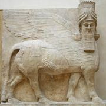

**<u>פרשת ויקהל - הכרובים</u>**

<u>חיי האהבה של האלוהות</u>

**מתברר שגם ליושבים במרומים יש חיי אהבה.**

**לא נתייחס בפגישה זו לעדויות ארכיאולוגיות, על תפיסת
האלוהות הישראלית בימים קדומים, שנמחקו מהמקורות שקודשו במשך
השנים.**

**נתייחס רק למקורות שהמסורת היהודית מקבלת אותם
היום.**

**בפרשת "ויקהל" נזכרים "הכרובים".**

**למעשה, כפסלים במשכן ה', הם נזכרים לראשונה קודם, בפרשת
"תרומה", אבל את הפרשה הזאת כבר פספסנו....**

**הכרובים מופיעים בתנ"ך כבר קודם, לא כפסלים אלא כיצורים
אמיתיים.**

**בראשית פרק ג'**

(כד) וַיְגָרֶשׁ אֶת הָאָדָם וַיַּשְׁכֵּן מִקֶּדֶם לְגַן עֵדֶן אֶת הַכְּרֻבִים וְאֵת לַהַט
הַחֶרֶב הַמִּתְהַפֶּכֶת לִשְׁמֹר אֶת דֶּרֶךְ עֵץ הַחַיִּים.

**לכרובים אלה, שנראים כמין מלאכים, או חיות מבויתות של
האל, אין, כנראה זמן לחיי אהבה, שהרי תפקידם להגן על האינטרסים האלוהיים
מפני האדם המורד.**

**אבל, בפרשתנו מופיעים זוג כרובים פחות אלימים:**

**שמות פרק ל"ז**

(ז) וַיַּעַשׂ שְׁנֵי כְרֻבִים זָהָב מִקְשָׁה עָשָׂה אֹתָם מִשְּׁנֵי קְצוֹת
הַכַּפֹּרֶת:

(ח) כְּרוּב אֶחָד מִקָּצָה מִזֶּה וּכְרוּב אֶחָד מִקָּצָה מִזֶּה מִן הַכַּפֹּרֶת עָשָׂה אֶת
הַכְּרֻבִים מִשְּׁנֵי קְצוֹותָיו :

(ט) וַיִּהְיוּ הַכְּרֻבִים פֹּרְשֵׂי כְנָפַיִם לְמַעְלָה סֹכֲכִים בְּכַנְפֵיהֶם עַל הַכַּפֹּרֶת
וּפְנֵיהֶם אִישׁ אֶל אָחִיו אֶל הַכַּפֹּרֶת הָיוּ פְּנֵי הַכְּרֻבִים:

**והואיל והמשכן הוא רק ההקדמה או הדימוי למקדש שלמה, אנו
עוברים לספר מלכים. כאן, נלמד, אגב, שהם יצורים גדולים למדי.**

**מלכים א' פרק ו'**

(כג) וַיַּעַשׂ בַּדְּבִיר שְׁנֵי כְרוּבִים עֲצֵי שָׁמֶן עֶשֶׂר אַמּוֹת
קוֹמָתוֹ:

(כד) וְחָמֵשׁ אַמּוֹת כְּנַף הַכְּרוּב הָאֶחָת וְחָמֵשׁ אַמּוֹת כְּנַף הַכְּרוּב הַשֵּׁנִית
עֶשֶׂר אַמּוֹת מִקְצוֹת כְּנָפָיו וְעַד קְצוֹת כְּנָפָיו:

(כה) וְעֶשֶׂר בָּאַמָּה הַכְּרוּב הַשֵּׁנִי מִדָּה אַחַת וְקֶצֶב אֶחָד לִשְׁנֵי
הַכְּרֻבִים:

(כו) קוֹמַת הַכְּרוּב הָאֶחָד עֶשֶׂר בָּאַמָּה וְכֵן הַכְּרוּב הַשֵּׁנִי:

(כז) וַיִּתֵּן אֶת הַכְּרוּבִים בְּתוֹךְ הַבַּיִת הַפְּנִימִי וַיִּפְרְשׂוּ אֶת כַּנְפֵי
הַכְּרֻבִים וַתִּגַּע כְּנַף הָאֶחָד בַּקִּיר וּכְנַף הַכְּרוּב הַשֵּׁנִי נֹגַעַת בַּקִּיר הַשֵּׁנִי וְכַנְפֵיהֶם אֶל תּוֹךְ
הַבַּיִת נֹגְעֹת כָּנָף אֶל כָּנָף:

(כח) וַיְצַף אֶת הַכְּרוּבִים זָהָב:

**מלכים א' פרק ח'**

(ו) וַיָּבִאוּ הַכֹּהֲנִים אֶת אֲרוֹן בְּרִית יהוה אֶל מְקוֹמוֹ אֶל דְּבִיר הַבַּיִת
אֶל קֹדֶשׁ הַקֳּדָשִׁים אֶל תַּחַת כַּנְפֵי הַכְּרוּבִים:

(ז) כִּי הַכְּרוּבִים פֹּרְשִׂים כְּנָפַיִם אֶל מְקוֹם הָאָרוֹן וַיָּסֹכּוּ הַכְּרֻבִים עַל
הָאָרוֹן וְעַל בַּדָּיו מִלְמָעְלָה:

**אבל, פסוק בדברי הימים מעורר שאלה, אם הכרובים הם קישוט,
או מתייחסים להווית האל עצמו.**

**דברי הימים א פרק י"ג**

(ו) וַיַּעַל דָּוִיד וְכָל יִשְׂרָאֵל בַּעֲלָתָה אֶל קִרְיַת יְעָרִים אֲשֶׁר לִיהוּדָה
לְהַעֲלוֹת מִשָּׁם אֵת אֲרוֹן הָאֱלֹהִים יהוה יוֹשֵׁב הַכְּרוּבִים אֲשֶׁר נִקְרָא שם.

כלומר, ה' הוא "יושב הכרובים" עוד בטרם נבנה המקדש. אולי,
הכרובים מהמשכן, אך אם כן, מדוע יוצר שלמה חדשים? אולי, ה' הוא "יושב
הכרובים" באמת?

**תהילים פרק י"ח**

(יא) וַיִּרְכַּב עַל כְּרוּב וַיָּעֹף וַיֵּדֶא עַל כַּנְפֵי רוּחַ.

**אולי משהו כזה (פסל אשורי)**

**מתברר, שבאמת, יש לאל קשר עם כרובים, לא רק באמנות.
וחזון יחזקאל מאשר זאת. בחזונו, השמים נפתחים והוא רואה מראות
אלוהים...**

**יחזקאל פרק י'**

יט) וַיִּשְׂאוּ הַכְּרוּבִים אֶת כַּנְפֵיהֶם וַיֵּרוֹמּוּ מִן הָאָרֶץ לְעֵינַי בְּצֵאתָם
וְהָאוֹפַנִּים לְעֻמָּתָם וַיַּעֲמֹד פֶּתַח שַׁעַר בֵּית יהוה הַקַּדְמוֹנִי וּכְבוֹד אֱלֹהֵי יִשְׂרָאֵל עֲלֵיהֶם
מִלְמָעְלָה:

כ) הִיא הַחַיָּה אֲשֶׁר רָאִיתִי תַּחַת אֲלֹהֵי יִשְׂרָאֵל בִּנְהַר כְּבָר וָאֵדַע כִּי
כְרוּבִים הֵמָּה:

(כא) אַרְבָּעָה אַרְבָּעָה פָנִים לְאֶחָד וְאַרְבַּע כְּנָפַיִם לְאֶחָד וּדְמוּת יְדֵי
אָדָם תַּחַת כַּנְפֵיהֶם:

**כיצד מתייחסת היהדות לכרובים בהמשך?**

**במשנה, בדרך כלל, הכרוב הוא הירק שאנחנו אוכלים במרק או
בסלט.**

**אך בתלמוד יש (בנוסף לתיאורים פשוטים) הערה
מעניינת.**

**תלמוד בבלי יומא דף נ"ד**

"אמר רב קטינא בשעה שהיו ישראל עולין לרגל מגללין להם את
הפרוכת ומראין להם את הכרובים שהיו <u>מעורים זה בזה</u> ואומרים להן ראו
חבתכם לפני המקום כחבת זכר ונקבה"

**ומפרש רש"י על אתר:**

"הכרובים - מדובקין זה בזה, ואחוזין ומחבקין זה את זה,
<u>כזכר החובק את הנקבה</u>:"

**ובהמשך...**

"אחא בר יעקב אמר: לעולם במקדש שני וכרובים דצורתא הוו
קיימי, .....וכתיב כמער איש וליות מאי <u>כמער איש וליות</u> אמר רבה בר רב
שילא <u>כאיש המעורה בלוייה שלו</u> ......

אמר ריש לקיש: בשעה שנכנסו נכרים להיכל ראו <u>כרובים
המעורין זה בזה</u> הוציאון לשוק ואמרו, ישראל הללו שברכתן ברכה וקללתן
קללה יעסקו בדברים הללו? מיד הזילום. שנאמר כל מכבדיה <u>הזילוה כי ראו
ערותה</u>."

**פרשנות ארוטית זו לא הכרחית, וקיימים מדרשים אחרים
כמובן. למשל:**

**מדרש תנחומא (המאה התשיעית, ישראל) "מטהר" את הכרובים
לחלוטין.**

**מדרש תנחומא ויקהל פרק ז'**

"עשה למעלה ממנו כפורת שהשרפים עומדין ממעל לו ועשה בו שני
כרובים שהן חביבין לו <u>כנגד שמים וארץ</u> <u>שהיה בהם מושבו של
הקב"ה</u> שנאמר ודברתי אתך שם מעל הכפורת אשר על ארון העדות מבין שני
הכרובים וכתיב כרוב אחד מקצה מזה וכרוב אחד מקצה מזה כשם שהשמים נפתחין
אוצרן לארץ...."

**ילקוט שמעוני (נערך במאה השלש עשרה באירופה, אבל הוא לקט
של מדרשים קדומים) מתייחס לחשש האלילות בפסלי הכרובים.**

**ילקוט שמעוני צפניה פרק ב'**

שמעתי חרפת מואב, אתה מוצא כיון שגרמו העונות ונכנסו
אויבים לירושלים נכנסו עמהם עמונים ומואבים ונכנסו לבית קדש הקדשים, ונטלו
הכרובים, והיו מחזירים אותם בכל חוצות ירושלים, והיו אומרים: לא היו ישראל
אומרים אין אנו עובדים ע"א? ראו מה הם עושים, הה"ד יען כי אמר מואב הנה ככל
הגוים בית יהודה, באותה שעה אמר הקב"ה כי מואב כסדום תהיה:

**אבל חלק מהפרשנים המאוחרים יותר, חוזרים לאופי האירוטי
של הכרובים.**

**ר"י מיגאש, פירוש על בבא בתרא (ר' יוסף בן ר' מאיר הלוי
אבן מיגאש, בערך 1100, ספרד)**

"ופריש רבינו הרב ז"ל, ששניהם בשורה אחת הן עומדים כדכתיב
בקרא, וזה שהיו מעורים זה בזה כזכר עם נקבה, בשעה שישראל עולים לרגל בלבד.
והיה מעשה נס להראות חיבת ישראל לפני המקום כחיבת זכר עם נקבה, אבל בשאר
ימות השנה לא היו מעורים, ובשעה שנכנסו עכו"ם להיכל נמי היו מעורים במעשה
נס, כמו שהיו מעורים בשעה שעולים לרגל, להראות לעכו"ם מה היתה חיבת ישראל
לפני המקום, אי נמי כדי להראות ערותם לעכו"ם כדי שיזילום, שנאמר כל מכבדיה
הזילוה כי ראו ערותה:"

**וכמו כן הוא מצוטט**

**בחידושי הרמב"ן על בבא בתרא (בערך 1250)**

ולכולי עלמא קשיא הא דאמרינן במסכת יומא (נ"ד ב') בשעה
שנכנסו גוים להיכל וראו כרובים מעורין זה בזה כזכר עם נקבה אמרו ישראל הללו
שקללתן קללה וברכתן ברכה יעסקו בדברים הללו מיד הזילום שנאמר כל מכבדיה
הזילוה. ואמרינן נמי התם בשעה שישראל עולין לרגל היו מגלים להם את הפרוכת
ורואין כרובים מעורין זה בזה כזכר עם נקבה. ותירץ ה"ר יוסף הלוי ז"ל בשם
רבו שמעשה נסים נעשין להם בשעה שישראל עולין לרגל כדי להראות חיבת הקב"ה
לכנסת ישראל ובשעה שנכנסו גוים להיכל כדי שיזילום:

**אבל, אם בפרשנויות עד כה ראינו שזיווג זכר ונקבה הם רק
סמל ליחסים בין הקב"ה ועם ישראל, כמו הפרשנות הדתית המקובלת על שיר השירים,
הרי באלף השני, מתפתחת הקבלה, ושם עוסקים לא מעט בארוטיקה בתוך האלוהות
עצמה.**

**זה אפשרי, כמובן, אחרי חלוקת האלוהות ליסודות שונים כמו
עשר הספירות, צד ימין וצד שמאל, "אבא ואמא", "המלך והמלכה", תפארת ומלכות,
הקב"ה והשכינה (לפעמים, גבירה, מטרוניתא), וכד'. מבלי להיכנס לסבך הקבלה
לסוגיה השונים, ברור שרבים מהמושגים מדגישים יסוד זכרי ויסוד
נקבי.**

**נצטט כמה קטעים המדגימים זאת.**

**הנה קטע מספר הזוהר, המדבר על יחסי הקב"ה עם השכינה.
והשכינה איננה "עם ישראל" אלא הספירה הנמוכה באלוהות ("מלכות") שהיא הקרובה
לעם ישראל.**

**(זוהר חלק ג' דף ק"ט) התרגום מ"זוהר מנקד ומתורגם"
ב HEBREW BOOKS במרשתת (כרך ה' ויקרא,
בהר).**

**להלן דוגמאות לפרשנים מאוחרים של קבלה, כבר אחרי
האר"י.**

**נפתלי הרץ בכרך (בערך 1650, גרמניה).**

**ספרו "עמק המלך" על קבלת האר"י על פי שיטת ישראל
סרוג.**

"וכן כשנכללים <u>אבא ואמא</u> בסוד הזווג בסוד נשיקין,
ומנחילים מוחין לבתי בראי שלהם, שהם נצח והוד של פרצוף תבונה. כי שם מתגלים
השש קצוות דז"א **\[של זעיר אנפין\]** ונוקביה, ובנין ז"א ונוקביה בפועל
גמור, כי שם הוא ממש גלוי האור. הנה הוד אבא נכלל בנצח אמא, ונצח אמא נכלל
בהוד אבא, כמו להבדיל שני בני אדם העומדים פנים אל פנים, שמאלו של זה בצד
ימינו של זה, וימינו של זה בצד שמאלו שם זה, כן הוא בכאן כביכול, כי הם
לעולם פנים בפנים.... ומיסודות שניהם הכלולות זה בזה כעין מעשה הכרובים
'כמער איש ולויות' \[יומא נ"ד א'\], ופירשו רז"ל, 'עם הלויה שלו', שהיא
הנקיבה, שהיה מעורים זכרות ונקבות שלהם זה בתוך זה, לרמוז על הזווג התמידי,
שהוא ביניהם, שלא מתפרשים זה מזה לעולם. ... לכן אחר הנשיקין שהם זווג
עליון באבא ואמא עצמם, שהם עומדים תחת הפה דאריך **\[אריך אנפין\]** כנודע,
נעשה תמיד הזווג והעבור ראשון ושני, על ידי הפרצופים התחתונים של אבא ואמא,
הנקראים ישראל סבא ותבונה."

**צבי אלימלך שפירא מדינוב (1783-1841 גליציה, אדמו"ר
חסידי) בספר "דרך פיקודיך":**

"מכאן תבין ותשכיל בני הסוד חתן וכלה מצות פ"ו **\[פרו
ורבו\]**, ודע לך בני באמת כי כל ההויות כמער איש ולויות כאיש המעורה בלויה
שלו, ראה בני דברים נעלמים. ועתה אומר לך קושט דברי אמת שעליהם אין לפרכס
ואין לזוז ואין לשאול כי מושאלים הם מפי מלאך אלקים מלאך ממש. ודע כי עוה"ז
הוא צל לעולם העליון, ז"ש התנא כל מה שברא הקב"ה בעולמו ברא מנגד שנאמר
\[קהלת ז יד\] גם את זה לעומת זה עשה אלקים, וגם בפ' המוכר את הספינה
אמרז"ל אמר ר' יהודה כל מה שברא הקב"ה בעולמו זכר ונקבה בראם, ראה והבן כי
הכל הוא דוגמא עליונה, ומה מעלה יש לו פ"ו כי בשבת <u>כשמתחברין המלך עם
המלכה</u> **\[הקב"ה עם השכינה, תפארת עם מלכות\]** פב"פ **\[פנים
בפנים\]** דרך החלון הוא היסו"ד **\[הספירה התשיעית, פעמים רבות מקבילה
לאיבר מין גברי\]** אז נעשים גוף אחד וכל העולם מתברכין ועומדים בשלוה
ובחדוה והשקט......"

**בספר "פרי צדיק" (ר' צדוק הכהן מלובלין
1823-1900)**

**פירוש "עדין יותר" שחוזר לכרובים.**

"והיינו דשם הכרובים כמער איש ולויות, שהוא יחוד קודשא
בריך הוא ושכינתיה, דהיא כנסת ישראל והם התפוחים קדישין."

"וכל איש לא יבוא באהל מועד, כי צריך להיות בחשאי, כי שם
הכרובים כמער איש ולויות שהוא דבר שבצנעא, ומכבדיה הזילוה כי ראו ערותה,
כמו שאמרו ז"ל דאצלם נחשב זה ערוה ושיקוע תאוה. כי הם אינם יודעים שיש
מציאות קדושה בענין זה. וכמו שאמרו (נדה לא.) .... ובאמת מי שהוא קדוש אצלו
אין זה ערוה ודבר של גנאי ובושה כלל וכאדם הראשון קודם החטא דהיו ערומים
ולא יתבוששו כתיב. ועל ידי שמירתו מצות ה' היו נעשים לו כתנות
אור...."

**צעד גדול, לתפיסה כמעט אלילית (אך בו זמנית, אבסטרקטית
מאוד, וזהירה ומזהירה מאלילות), נעשה ב"אדרא רבא".**

**האדרא רבה (הכינוס הגדול) הוא אחד הסיפורים (בניגוד
לפרשנויות) בספר הזוהר, המשתרע על כעשרים עמודים. בסיפור זה ר' שמעון בר
יוחאי מכנס תשעה חכמים לכינוס חירום, שמטרתו תיקון האלוהות (!).**

**דרך סיפור זה זה אנו לומדים את תיאור האלוהות על פי סופר
האדרא רבה, תיאור שהוא מוחשי ביותר, למרות אזהרותיו שלא לקחת את הדברים
כפשוטם.**

**האלוהות מורכבת משלושה:**

**"אריך אנפין" – ארוך הפנים, הנקרא גם "עתיקא קדישא",
ועוד, שהוא מופיע כראש בלבד, כולו לבן, וכולו נוטף חסד, רחמים
ואהבה.**

**"זעיר אנפין" – קטן הפנים, מופיע תחילה כראש אדום ולבן,
הוא האל הדתי, יהוה, שיש בו גם כעס, חרון אף,עונשים וגם רחמים. אל דואלי,
מייצג את החוק והמשפט.**

**מתוך זעיר אנפין מתפתח גוף האלוהות, הנקרא "אדם" (לא
אנושי, אלא אלוהי... אך מתייחס למיתוס של אדם הראשון). "אדם" כוללת זכר
(המייצג את החסד) ונקבה (המייצגת את הדין), מחוברים <u>גב אל גב</u>
והתיקון של הבריאה מתבצע על ידי חיתוך האדם ל"זעיר אנפין" ול"נוקבא"
(הנקבה) ובהזדווגותם <u>פנים אל פנים</u> בא השפע והשלום לעולם.**

**(התרגומים להלן, הם של מלילה הלנר-אשר מתוך "מבקשי
הפנים", מכון שלום הרטמן, 2017)**

"וכאשר הפרידם, הפיל תרדמה על זעיר אפין והפריד את הנקבה
מאחורי צדו, והתקין לה כל תיקוניה, והצניעה ליומו, להביאה אל הזכר...ועלתה
ונתקנה, ובמקומה שיקע רחמים וחסד, זה הוא שכתוב "ויסגור בשר תחתנה" וכתוב
"והסירותי את לב האבן מבשרכם ונתתי לכם לב בשר" (יחזקאל ל"ו)"

**וההמשך טוב ומיטיב:**

"וכאשר נתחברו, נתבשמו זה בזה, יום שהכל נתבשם בו. ומפני
כך נתבשמו דינים זה בזה ונתקנו עליונים ותחתונים."

**בסיפור זה יש מוטיבים רבים שלא נוכל לעמוד עליהם כאן,
אלא ברמזים:**

**סיפור בריאת האדם כישות מצורפת מזכר ונקבה גב אל גב,
והפרדתם על ידי האלים, הוא מוטיב יווני, מוזכר אצל אפלטון, ובא להסביר את
המשיכה המינית, ההטרוסקסואלית וגם ההומוסקסואלית. מוטיב זה נלקח כבר על ידי
חז"ל, להסביר את הפסוקים בפרק א' של בראשית: מצד אחד "נעשה אדם" ובהמשך
"זכר ונקבה ברא אותם". וזה יחד עם בריאת האשה מהצלע בפרק ב'. (כלומר, תחילה
ברא יצור אנושי המורכב מזכר ונקבה ואחר כך הפרידם).**

**הקבלה מצרפת מוטיב נוסף שנלקח מחז"ל, שלפיו נברא העולם
תחילה "במידת הדין", כיון שבא דור המבול ודור הפלגה, ראה שאין העולם יכול
לעמוד במידת הדין, והוסיף את "מידת הרחמים". הקבלה מייחסת את מידת הדין
ליסוד הנקבי (!) ואת מידת הרחמים (החסד) ליסוד הגברי.**

**האידרא רבא נועזת הרבה יותר, ומעבירה את כל סיפור "חיתוך
האדם" לאלוהות, ומייצרת דרגות באלוהות (בעקבות תפיסות קבליות מוקדמות,
כמובן).**

**אלוהות החסד והרחמים (אריך אנפין) היא דווקא "העתיקה"
ושורש הבריאה, והיא בוראת את האלוהות הדואלית (זעיר אנפין), שמתפלגת לזכר
ונקבה (שמייצגים אמנם דין ורחמים), וההזדווגות ביניהם, פנים אל פנים, מביאה
לטוב בעולם.**

**ועיקר חשוב, לאדם יש תפקיד ביחסים הנוצרים באלוהות, אך
התפקיד מתמקד בצדיקים כמו רשב"י וחבריו (שאפילו מקריבים את חייהם כדי לבצע
תיקון באלוהות, ולהביא לזיווג המיוחל, המביא שלום, שפע ורחמים
בעולם).**

**קבלת האר"י, מייצרת קבלה עממית יותר, ונותנת לכל אדם
מישראל את האפשרות לתרום לתיקון האלוהות. (ואולי בגלל זה היא פופולרית יותר
היום...)**
