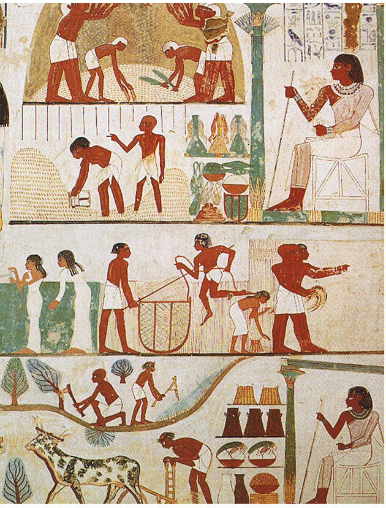

<u>פרשת צו – בגדי כוהן גדול ובגדים אחרים</u>

<u>ספר ויקרא פרק ח</u>

(ו) וַיַּקְרֵב משֶׁה אֶת אַהֲרֹן וְאֶת בָּנָיו וַיִּרְחַץ אֹתָם בַּמָּיִם:

(ז) וַיִּתֵּן עָלָיו אֶת הַכֻּתֹּנֶת וַיַּחְגֹּר אֹתוֹ בָּאַבְנֵט וַיַּלְבֵּשׁ אֹתוֹ אֶת
הַמְּעִיל וַיִּתֵּן עָלָיו אֶת הָאֵפֹד וַיַּחְגֹּר אֹתוֹ בְּחֵשֶׁב הָאֵפֹד וַיֶּאְפֹּד לוֹ בּוֹ:

(ח) וַיָּשֶׂם עָלָיו אֶת הַחשֶׁן וַיִּתֵּן אֶל הַחשֶׁן אֶת הָאוּרִים וְאֶת
הַתֻּמִּים:

(ט) וַיָּשֶׂם אֶת הַמִּצְנֶפֶת עַל רֹאשׁוֹ וַיָּשֶׂם עַל הַמִּצְנֶפֶת אֶל מוּל פָּנָיו אֵת
צִיץ הַזָּהָב נֵזֶר הַקֹּדֶשׁ כַּאֲשֶׁר צִוָּה יְהֹוָה אֶת משֶׁה:

....:

(יב) וַיִּצֹק מִשֶּׁמֶן הַמִּשְׁחָה עַל רֹאשׁ אַהֲרֹן וַיִּמְשַׁח אֹתוֹ לְקַדְּשׁוֹ:

(יג) וַיַּקְרֵב משֶׁה אֶת בְּנֵי אַהֲרֹן וַיַּלְבִּשֵׁם כֻּתֳּנֹת וַיַּחְגֹּר אֹתָם אַבְנֵט
וַיַּחֲבשׁ לָהֶם מִגְבָּעוֹת כַּאֲשֶׁר צִוָּה יְהֹוָה אֶת משֶׁה:

אלו בגדי הכוהן הגדול: כתונת, אבנט, מעיל, אפוד חגור בחשב
האפוד. ועליהם החושן והאורים והתומים. על הראש מצנפת, ועל המצח ציץ
הזהב.

ויש גם פירוט יתר של הקישוטים השקטים והרועשים:

<u>ספר שמות פרק כח</u>

(לא) וְעָשִׂיתָ אֶת מְעִיל הָאֵפוֹד כְּלִיל תְּכֵלֶת:

(לב) וְהָיָה פִי רֹאשׁוֹ בְּתוֹכוֹ שָׂפָה יִהְיֶה לְפִיו סָבִיב מַעֲשֵׂה אֹרֵג כְּפִי
תַחְרָא יִהְיֶה לּוֹ לֹא יִקָּרֵעַ:

(לג) וְעָשִׂיתָ עַל שׁוּלָיו רִמֹּנֵי תְּכֵלֶת וְאַרְגָּמָן וְתוֹלַעַת שָׁנִי עַל שׁוּלָיו
סָבִיב וּפַעֲמֹנֵי זָהָב בְּתוֹכָם סָבִיב:

(לד) פַּעֲמֹן זָהָב וְרִמּוֹן פַּעֲמֹן זָהָב וְרִמּוֹן עַל שׁוּלֵי הַמְּעִיל
סָבִיב:

(לה) וְהָיָה עַל אַהֲרֹן לְשָׁרֵת וְנִשְׁמַע קוֹלוֹ בְּבֹאוֹ אֶל הַקֹּדֶשׁ לִפְנֵי יְהֹוָה
וּבְצֵאתוֹ וְלֹא יָמוּת:

האם יש גם משהו מתחת הבגדים הללו? לא יפה להציץ, אבל בכל
זאת...

<u>ספר שמות פרק כח</u>

(מב) וַעֲשֵׂה לָהֶם מִכְנְסֵי בָד לְכַסּוֹת בְּשַׂר עֶרְוָה מִמָּתְנַיִם וְעַד יְרֵכַיִם
יִהְיוּ:

(מג) וְהָיוּ עַל אַהֲרֹן וְעַל בָּנָיו בְּבֹאָם אֶל אֹהֶל מוֹעֵד אוֹ בְגִשְׁתָּם אֶל
הַמִּזְבֵּחַ לְשָׁרֵת בַּקֹּדֶשׁ וְלֹא יִשְׂאוּ עָוֹן וָמֵתוּ חֻקַּת עוֹלָם לוֹ וּלְזַרְעוֹ אַחֲרָיו:

המכנסיים נזכרים בהקשר הזה, אך אינם המכנסיים המוכרות לנו.
נראים יותר כתחתונים מגושמים. הנה המשנה מתארת החלפת משמרות.

<u>משנה מסכת תמיד פרק ה</u>

(ג) מְסָרוּם לַחַזָּנִים, הָיו מַפְשִׁיטִין אוֹתָם אֶת בִּגְדֵיהֶם, וְלֹא הָיוּ
מַנִּיחִים עֲלֵיהֶם אֶלָּא מִכְנְסַיִם בִּלְבָד.

נחזור בהמשך לעניין המכנסיים.

לפני כן יש לנו בעייה הלכתית חמורה. בעיית השעטנז.

<u>ספר שמות פרק לט</u>

(כז) וַיַּעֲשׂוּ אֶת הַכָּתְנֹת שֵׁשׁ מַעֲשֵׂה אֹרֵג לְאַהֲרֹן וּלְבָנָיו:

(כח) וְאֵת הַמִּצְנֶפֶת שֵׁשׁ וְאֶת פַּאֲרֵי הַמִּגְבָּעֹת שֵׁשׁ וְאֶת מִכְנְסֵי הַבָּד שֵׁשׁ
מָשְׁזָר:

(כט) וְאֶת הָאַבְנֵט <u>שֵׁשׁ מָשְׁזָר וּתְכֵלֶת וְאַרְגָּמָן וְתוֹלַעַת שָׁנִי מַעֲשֵׂה
רֹקֵם</u> כַּאֲשֶׁר צִוָּה יְהֹוָה אֶת משֶׁה:

הפירוש המקובל במקורותינו הוא, <u>שש הוא פשתן</u>, ואילו
<u>הצבעוניים הם מצמר</u>.

מבלי להיכנס לעובי הקורה, התורה מזהירה מלבוש שעטנז,
שפירושו, בגד העשוי מצמר ופשתים. ודווקא האבנט של הכוהן הגדול הוא שעטנז,
צמר ופשתים יחד. כך על פי חז"ל, והרמב"ם בעקבותיהם.

<u>רמב"ם יד החזקה הלכות כלי המקדש פרק ח</u>

(א) בגדי כהונה שלשה מינים בגדי כהן הדיוט ובגדי זהב ובגדי
לבן בגדי כהן הדיוט הם ארבעה כלים <u>כתנת ומכנסים ומגבעות ואבנט וארבעתן
של פשתן</u> לבנים וחוטן כפול ששה <u>והאבנט לבדו רקום בצמר</u>.

לא מצאתי הסבר טוב לא לאיסור שעטנז, וגם לא להתרתו בבגדי
כהונה.

(ההסבר הלא דתי, יהיה, כמובן, שהדברים נכתבו על ידי סופרים
שונים, בעלי דעות שונות).

המדרש מסביר, דרך אגדה, את איסור השעטנז:

<u>מדרש תנחומא בראשית - פרק ט</u>

אמרו חז"ל בני ארבעים שנה היו קין והבל. ויבא קין מפרי
האדמה מהו? מן מותר מאכלו. ורבנן אמרו, <u>זרע פשתן היה</u>. והבל הביא גם
הוא מבכורות צאנו ומחלביהן. לפיכך נאסר צמר ופשתים שנא' (דברים כב) "לא
תלבש שעטנז וגו'" ואמר הקב"ה: אינו דין שיתערב מנחת החוטא עם מנחת זכאי.
לפיכך נאסר.

כאשר אין הלכה מבוססת על הגיון, האגדה ממלאת את החסר
ומייצרת פרשנות.

ואם כך, מדוע בבגדי כהונה מותר? אין הסבר במקורות הקדומים.
כך ציווה האל וזהו. במקורות מאוחרים, ממשיכים את האגדה וטוענים: תפקיד
הכוהן הגדול להביא שלום, ולתקן מחלוקות, ולכן גם את זו של קין
והבל...

אבל, קטע מספר יחזקאל, תקופת גלות בבל, מרמז על התייחסות
לבעיה, הוא פוסל את הצמר, ובכך מוכיח שהפרשנות שקיים צמר באבנט
נכונה.

<u>ספר יחזקאל פרק מד</u>

(טו) וְהַכֹּהֲנִים הַלְוִיִּם בְּנֵי צָדוֹק אֲשֶׁר שָׁמְרוּ אֶת מִשְׁמֶרֶת מִקְדָּשִׁי
בִּתְעוֹת בְּנֵי יִשְׂרָאֵל מֵעָלַי הֵמָּה יִקְרְבוּ אֵלַי לְשָׁרְתֵנִי וְעָמְדוּ לְפָנַי לְהַקְרִיב לִי חֵלֶב וָדָם
נְאֻם אֲדֹנָי יֱהֹוִה:

(טז) הֵמָּה יָבֹאוּ אֶל מִקְדָּשִׁי וְהֵמָּה יִקְרְבוּ אֶל שֻׁלְחָנִי לְשָׁרְתֵנִי וְשָׁמְרוּ
אֶת מִשְׁמַרְתִּי:

(יז) וְהָיָה בְּבוֹאָם אֶל שַׁעֲרֵי הֶחָצֵר הַפְּנִימִית <u>בִּגְדֵי פִשְׁתִּים יִלְבָּשׁוּ
וְלֹא יַעֲלֶה עֲלֵיהֶם צֶמֶר בְּשָׁרְתָם בְּשַׁעֲרֵי הֶחָצֵר הַפְּנִימִית וָבָיְתָה</u><u>:</u>

בגדי כוהן גדול הם גם מקור לפרשנות מיסטית קבלית:

<u>רבנו בחיי על ויקרא פרק ח פסוק ז
(בחיי בן אשר, נפטר ב 1340, ספרד).</u>

(ז) ויתן עליו את הכתונת ויחגור אותו באבנט וגו'. בגדי
כהונה סדר לבישתן כך הוא, כתונת אבנט מעיל אפוד חושן מצנפת ציץ הזהב, והנה
הם שבעה שהיה משה מלבישן לאהרן ונותנן עליו, ועם המכנסים שהיו לובשין הם
עצמן תחילה הן שמונה. וסדר לבישתן כסדר שבעה רקיעים, מכנסים שהיו לכסות בשר
ערוה, כנגד הרקיע הראשון שבו לבנה, שהוא מכסה לאהל העולם השפל... כתונת
כנגד הרקיע שבו כוכב, אבנט כנגד הרקיע שבו נוגה, מעיל כנגד הרקיע שבו חמה,
אפוד כנגד אפודת הרקיע שבו מאדים, חושן כנגד הרקיע שבו צדק, ולכך היו בכפלו
אורים ותומים שהיו מצודקין בדבריהם, מצנפת שהיה עליון בראש כנגד הרקיע שבו
שבתאי שהוא עליון על כל השבעה, והכתוב קראו ראש כוכבים, הוא שכתוב (איוב
כב, יב) "וראה ראש כוכבים כי רמו", ציץ שכתוב בו קודש לה' כנגד כסא הכבוד
שהוא למעלה משבעה.

נחזור לעניין המכנסיים ונגיע עד התחתונים....

לאמוראים המתדיינים להלן, חשוב מאוד להימנע ממגע של הבגד
עם איברי המין. אנחנו מכירים את התופעה מחסידי גור של ימינו. דילגנו על
הנושא המוזר עצמו, והנה קטע מהמשך דיון בנושא:

<u>תלמוד בבלי מסכת נדה דף יג/ב</u>

אמר רב פפא: שמע מינה, מכנסים אסורים \[לפי הדיון הקודם,
מפני שהם נוגעים באיבר המין ועלול חס ולשלום...\]. והכתיב \[תשובה של
אחר\]: ועשה להם מכנסי בד לכסות בשר ערוה? \[כלומר, אם כך למה לכוהנים יש
מכנסים?\] ההוא, כדתניא, מכנסי כהנים למה הן דומין? כמין פמלניא של פרשים,
למעלה עד מתנים, למטה עד ירכים, ויש להם שנצים, ואין להם לא בית הנקב ולא
בית הערוה...

<u>פירוש רש"י על נדה דף יג/ב</u>

פמלניא - סינר פורצינ"ט חללו <u>תלוי למטה ברוחב שלא יתעטף
האבר ויתחמם</u>:

של <u>פרושים</u> – <u>צנועים.</u> ל"א (לשון אחר) של
פרשים:

<u>פירוש שטיינזלץ:</u>

ומשיבים: הבגד **ההוא** (מכנסי הכהנים) עניינו
שונה, **כדתניא** \[כברייתא
זו ששנינו\] **מכנסי כהנים למה הן
דומין** — **כמין פמלניא** (מכנסי
רכיבה) **של פרשים,** וכך
הם נראים: **למעלה** —
מגיעים הם **עד מתנים, למטה** מגיעים הם
— **עד ירכים, ויש להם שנצים** (רצועות
רכיסה ), **...**

עם כל אי הבהירות, מה שחשוב לענייננו, שרוב הבגדים הם
עליונים בלבד, ויש רתיעה מבגדים תחתונים... ועדין שטיינזלץ בימינו, מסכים
שמקור המכנסים הוא אצל רוכבי הסוסים (שגם האמוראים ידעו זאת...).

ומה עוד?

נסתכל מעט על לבוש עתיק יותר, ועתיק פחות, שידוע לנו
מתמונות מצויירות.

<u>בגדים במצרים העתיקה</u>

המלכה נפרטרי

בגדים ביוון העתיקה

בגד זה נקרא הימטון, הוא עשוי פשוט מבד מלבני, וצורה
מיוחדת של התעטפות.

זוהי הטוגה הרומאית. פסל מספרד מהמאה הראשונה
לספירה.

הטוגה וההימטון נראו דומה, בעטיפה המסובכת של הגוף. אף
ההימטון היה בד מלבני (כמו סדין), ואילו הטוגה הייתה גיזרה של
עיגול.

הטוגה מילאה, מבחינה מסויימת, תפקיד של מדים, מפני שרק
אזרח רומאי היה מורשה ללבוש טוגה.

המלך צרלס הרביעי, מקבל אורחים, ציור מהמאה ה -14. גם בימי
הבינים לבוש המקובל הוא כמו שמלה, פתוח למטה.

חיילי הטרה-קוטה מסין, כ 6000 מהם נקברו עם הקיסר הראשון
של סין, קין צי הוואן, בערך בשנת 200 לפנה"ס.  
מלבד השריון והכובע, נראה שהם לבושים גם מכנסיים, אבל אולי אלו גרביים
ארוכות...

שחזור צבעוני של דמות החייל הסיני.

רוב הלבוש העתיק, (לפחות של האנשים המהוגנים...) הוא לבוש
שעוטף את כל הגוף, פתוח מלמטה, וללא לבוש תחתון. ארוך יותר – נכבד
יותר...

<u>ובכל זאת היו גם אחרים....</u>

הרומאים לא נרתעו ממכנסיים הדוקים, כשצריך, לפחות אצל
הגלדיאטורים, אבל גם הם כבגד תחתון. הבגד העליון מפריע לגלדיאטורים להרוג
זה את זה.

פסיפס רומי מסיציליה, המאה הרביעית לספירה.

ואפילו ביקיני מפתיע, בפסיפס בוילה רומאית בסיציליה. בהחלט
יוצא דופן...

מניחים שהמכנסיים עתיקים מאוד, מקורם מהמזרח (סין,
מונגוליה..), להקלת רכיבה על סוסים. במערב שימשו בדרך כלל כלבוש תחתון (כמו
הכוהן הגדול...) במקרים מיוחדים.

למרות שאינם המצאה חדשה, רק במאות השנים האחרונות החלו
לשמש <u>כלבוש עליון</u>, בעיקר של גברים, והחל מהמאה ה-19 גם של
נשים.

אבל, היו כמה בעיות, במוצר, שאיננו חושבים עליהם היום
כלל.

<u>הכפתור למשל.</u>

בתנ"ך מופיע הכפתור כמוצר קישוט ("כפתור ופרח"). וכך גם
היה בעולם העתיק בכלל. היו בעיות טכניות הפריעו להתפשוטת הכפתור: החומר
ממנו מיוצר הכפתור, חורים לתפירה של הכפתור לבד, ויצירת הלולאות.

<u>מתוך הרשת</u>

הכפתורים הראשונים נתגלו באתרים אשר השתייכו ל[תרבות עמק
האינדוס](https://he.wikipedia.org/wiki/%D7%AA%D7%A8%D7%91%D7%95%D7%AA_%D7%A2%D7%9E%D7%A7_%D7%94%D7%90%D7%99%D7%A0%D7%93%D7%95%D7%A1) (2800-2600
לפני הספירה), ל[סין
הקדומה](https://he.wikipedia.org/wiki/%D7%A1%D7%99%D7%9F_%D7%94%D7%A7%D7%93%D7%95%D7%9E%D7%94) של [תקופת
הברונזה](https://he.wikipedia.org/wiki/%D7%AA%D7%A7%D7%95%D7%A4%D7%AA_%D7%94%D7%91%D7%A8%D7%95%D7%A0%D7%96%D7%94) (2000-1500
לפני הספירה) וב[רומא
העתיקה](https://he.wikipedia.org/wiki/%D7%A8%D7%95%D7%9E%D7%90_%D7%94%D7%A2%D7%AA%D7%99%D7%A7%D7%94).
הם לא שימשו אז לרכיסת בגדים אלא לקישוט. הכפתורים
הראשונים היו עשויים מעצם, קרן, עץ, מתכת, או צדף.

.....

הכפתורים \[הנתפרים לבגד\] הומצאו בגרמניה רק במאה ה-13
כאשר נמצאה הדרך לחורר את הכפתור. מתקופה זו ואילך הכפתורים נתפרו על
הבגדים בעיקר לקישוט.

המלך [לואי הארבעה
עשר](https://he.wikipedia.org/wiki/%D7%9C%D7%95%D7%90%D7%99_%D7%94%D7%90%D7%A8%D7%91%D7%A2%D7%94_%D7%A2%D7%A9%D7%A8) השתמש
ביותר מ-5 מיליון כפתורים על בגדיו השונים בתקופת שלטונו.

ב[מאה
ה-17](https://he.wikipedia.org/wiki/%D7%94%D7%9E%D7%90%D7%94_%D7%94-17) המציאו
ה[חייטים](https://he.wikipedia.org/wiki/%D7%97%D7%99%D7%99%D7%98) הצרפתים
כפתורים חדשים שהיו עשויים מטקסטיל ונראו ככדורים קטנים עשויים
מחוטים.

במאה ה-19 החלו לייצר כפתורים באופן מתועש. כפתורי טקסטיל,
עצם, קרמיקה ומתכת נמכרו במחירים גבוהים ולכן היו האנשים מסירים אותם מעל
גבי הבגדים הישנים ושומרים לשימוש חוזר. ...

... לולאות הכפתורים הראשונות היו לא יותר מחריץ בבגד
שדרכו ניתן היה להעביר את הכפתור, מאוחר יותר התחילו לרקום מסביב לחריץ עד
שנוצרה הלולאה המוכרת לנו.

עם המצאת הפלסטיק, בסוף שנות ה-30 של המאה שעברה, התחילו
לייצר כפתורי פלסטיק בכל מיני צורות וצבעים ...

<u>וגם על הרוכסן (הריצ'רץ') ניתן ללמוד
מהרשת...</u>

ובעיקר ניתן ללמוד, כמה זמן עבר מהסטארטאפ עד
לייצור...

האמריקאי אליאס האו פרסם כבר
ב-[1851](https://he.wikipedia.org/wiki/1851) הצעה
לרוכסן הדומה לזה המוכר לנו כיום, אבל ההצעה לא הגיעה לכלל ייצור.

ב-[1893](https://he.wikipedia.org/wiki/1893) רשם
ויטקומב ג'אדסון
ב[שיקגו](https://he.wikipedia.org/wiki/%D7%A9%D7%99%D7%A7%D7%92%D7%95) פטנט
לרוכסן לנעליים, תחת הכותרת "Clasp locker".
...

ה[פטנט](https://he.wikipedia.org/wiki/%D7%A4%D7%98%D7%A0%D7%98) לרוכסן
בן-ימינו נרשם ב[ארצות
הברית](https://he.wikipedia.org/wiki/%D7%90%D7%A8%D7%A6%D7%95%D7%AA_%D7%94%D7%91%D7%A8%D7%99%D7%AA) בידי
המהנדס
ה[שוודי](https://he.wikipedia.org/wiki/%D7%A9%D7%95%D7%95%D7%93%D7%99%D7%94)-[אמריקאי](https://he.wikipedia.org/wiki/%D7%90%D7%9E%D7%A8%D7%99%D7%A7%D7%90%D7%99) [גדעון
סאנדבק](https://he.wikipedia.org/wiki/%D7%92%D7%93%D7%A2%D7%95%D7%9F_%D7%A1%D7%90%D7%A0%D7%93%D7%91%D7%A7) בשנת [1917](https://he.wikipedia.org/wiki/1917)
, והוא כלל פיתוחים רבים להמצאתו המקורית של ג'אדסון.
ההמצאה זכתה לפריחה בימי [מלחמת העולם
הראשונה](https://he.wikipedia.org/wiki/%D7%9E%D7%9C%D7%97%D7%9E%D7%AA_%D7%94%D7%A2%D7%95%D7%9C%D7%9D_%D7%94%D7%A8%D7%90%D7%A9%D7%95%D7%A0%D7%94),
כששווקה עבור [חיל הים
האמריקאי](https://he.wikipedia.org/wiki/%D7%97%D7%99%D7%9C_%D7%94%D7%99%D7%9D_%D7%94%D7%90%D7%9E%D7%A8%D7%99%D7%A7%D7%90%D7%99).
 ...ולאחר מכן התבסס השיווק על ייצור המוני בסרט נע, באופן
שהתפתח בארצות הברית בשנים אלו, והחל שימוש ברוכסן בבגדים לשימוש יום
יומי.

פתרנו, פחות או יותר, את בעיית המכנסיים, שהומצאו על ידי
פרשי המזרח הרחוק, אך לא את מכנסי הכוהן הגדול, שהיו למעשה תחתונים
מגושמים, ונחשבו ללא ראויים לאדם הפשוט. מתי הוחל השימוש בתחתונים?

<u>מתוך "לאשה"  
</u>התחתונים, מצידם, לא נמצאים איתנו כל כך הרבה זמן, בטח
שלא בגרסתם הנוכחית. עד המאה ה-19, שבה התרעמה המלכה ויקטוריה על החיכוך
בין הבגדים לבין אברי המין, לא היו תחתונים בנמצא. גם לאחר שהם הומצאו הם
נאלצו להמתין עד תחילת המאה ה-20 כדי להפוך לפריט הכרחי. למעשה, יכול להיות
שאילולא הצהיר האפיפיור כי על אברי המין להיות מוצנעים עד כמה שאפשר, היינו
כולנו מהלכים היום ביתר חופשיות.

המניע העיקרי, היה, ההיגיינה של התקופה האחרונה.

בהזדמנות זו נזכיר עוד פריט לבוש, שהיום באופנה, והכוהן
הגדול אפילו לא חלם עליו – העניבה.

גברים ונשים לאורך ההיסטוריה ענדו על צווארם מיני צעיפים
וקישוטים שונים. עם זאת, את תחילת השימוש בעניבה כפי שהיא מוכרת לנו היום
מייחסים ל[מלחמת שלושים
השנים](https://he.wikipedia.org/wiki/%D7%9E%D7%9C%D7%97%D7%9E%D7%AA_%D7%A9%D7%9C%D7%95%D7%A9%D7%99%D7%9D_%D7%94%D7%A9%D7%A0%D7%99%D7%9D)
\[1618-1648 פרוטסטנטים נגד קתולים\]. שכירי החרב
ה[קרואטים](https://he.wikipedia.org/wiki/%D7%A7%D7%A8%D7%95%D7%90%D7%98%D7%99%D7%9D) בצבא [צרפת](https://he.wikipedia.org/wiki/%D7%A6%D7%A8%D7%A4%D7%AA) לבשו
צעיפים לצווארם; יש הטוענים, שמטרת הצעיף הייתה לקינוח הפה בעת האכילה, או
להגנה על החולצה מפני כתמים ויש הטוענים שמטרת הצעיף הייתה לניגוב הזיעה.
<u>מכל מקום,
תושבי [פריז](https://he.wikipedia.org/wiki/%D7%A4%D7%A8%D7%99%D7%96)</u><u> התלהבו
מהמראה החדש ובמהרה פשטה אופנת צעיפי הצוואר, לנשים ולגברים, בכל רחבי
אירופה.</u> המילה עניבה
ב[צרפתית](https://he.wikipedia.org/wiki/%D7%A6%D7%A8%D7%A4%D7%AA%D7%99%D7%AA) (קְרַווָאט)
ובשפות אירופאיות נוספות התפתחה מהמילה "קרואטים". מאופנה זו התפתחו סוגי
העניבות השונים המוכרים לנו כיום.

וזה מעביר אותנו לנגיעה קטנה מאוד בנושא האופנה.

אך לכבודה כדאי להתפלסף מעט.

ציטוט:

הקשר בין בגידה למעילה לבין בגד ומעיל מוכר היטב. זה אולי
נשמע כמו אטימולוגיה עממית – כלומר פרשנות בלשנית של העם – אבל במקרה זה גם
רבים מהבלשנים מסכימים שבשני המקרים מדובר בכיסוי והסתרה. הבגד, או המעיל,
מכסים את עירומו של אדם, ואילו האדם הערמומי מכסה את האמת העירומה כשהוא
בוגד ומועל. בכלל, הצורך שלנו בבגדים – בכיסוי – נוצר כתוצאה מהחטא הראשון.
לפניו לא ידע האדם כי הוא עירום.

 

ואכן, קרוב לוודאי, שהקשר המילולי בין בגד ובגידה ובין
מעיל ומעילה הוא מקרי לחלוטין (נראה שאינו קיים בשפות אחרות).

אבל, קיימת שאלה אמיתית, אם הבגד מבטא את זהותנו, או את
הזהות שאנו מעוניינים להציג, או רק את התפקיד שאנו ממלאים.

וכנראה שלושת התשובות נכונות.

ללא ספק הבגד, שהוא <u>שלנו</u>, קיים גם בשביל
<u>האחרים</u>, אלו שרואים אותנו. בבית לא כל כך חשוב מה אנחנו
לובשים...

<u>פרידיריך הגל – הפנומנולוגיה של הרוח – גרמניה 1807
(מהויקיפדיה)</u>

הגל טוען שהצורך הבסיסי ביותר בתודעה העצמית הוא
באובייקטיבציה של עצמה, כלומר לתפוס עצמה, על ידי עצמה, כאובייקט.

\[במילים פשוטות, לצורך הכרת עצמנו אנחנו זקוקים להסתכל על
עצמנו מבחוץ\]  
התודעה מסוגלת לתפוס את עצמה כאובייקט רק דרך הכרה בתודעה אחרת כסובייקט
שהיא האובייקט שלו.

\[לשם כך אנחנו זקוקים למבט של האחרים, היום אנחנו אומרים,
שהאחרים הם המראה שלנו\].

אופן חשיבה זה מוביל למסקנה שהתודעה העצמית כרוכה במה שהוא
קורא לו ההכרה ההדדית, הכרה בזולת כסובייקט.

\[כלומר, כאדם כמוני, לא כחפץ\].

כלומר שתודעה עצמית אפשרית רק בהקשר חברתי.

ונוסיף:

ברגע שאנחנו מציגים עצמנו כאובייקט כלפי "האחרים" אנחנו
רוצים שיראו אותנו על פי הערכים שכבר רכשנו, או על פי התפקיד שאנו ממלאים
וגאים בו.

כלומר, אם נלך בעקבות הגל, אנחנו רוכשים תודעה עצמית, דרך
האחרים, אבל בו זמנית, אנחנו מכוונים את התודעה הזאת על פי ערכים קודמים,
כלומר, <u>מרמים את האחרים כדי לאשר שאנחנו מה שאנחנו</u>. והבגד הוא אחד
האמצעים לכך.

לדוגמה, אם אני פוליטיקאי חלש, אבל הייתי קצין מצטיין,
אעדיף להראות במדי קצין. ואם הפכתי מקצין כושל לרופא טוב, אעדיף את לבוש
הרופא בביה"ח.

ושאלה לא פשוטה:

הבגדים משתנים כאשר אנחנו משתנים, או אנחנו משתנים
בעקבותיהם?

<u>אסתר פרק ד</u>

(א) וּמָרְדֳּכַי יָדַע אֶת כָּל אֲשֶׁר נַעֲשָׂה וַיִּקְרַע מָרְדֳּכַי אֶת בְּגָדָיו וַיִּלְבַּשׁ
שַׂק וָאֵפֶר וַיֵּצֵא בְּתוֹךְ הָעִיר וַיִּזְעַק זְעָקָה גְדֹלָה וּמָרָה:

<u>אסתר פרק ח</u>

(טו) וּמָרְדֳּכַי יָצָא מִלִּפְנֵי הַמֶּלֶךְ בִּלְבוּשׁ מַלְכוּת תְּכֵלֶת וָחוּר וַעֲטֶרֶת
זָהָב גְּדוֹלָה וְתַכְרִיךְ בּוּץ וְאַרְגָּמָן וְהָעִיר שׁוּשָׁן צָהֲלָה וְשָׂמֵחָה:

גם מרדכי לבוש השק, וגם מרדכי בלבוש מלכות, הוא מרדכי, אבל
לא אותו מרדכי. הבגדים הפכו אותו לאיש אחר. בוודאי דרך ראייתם של האחרים,
אבל, באמת, גם דרך ראייתו את עצמו.

הלבוש לא רק מבטא אותנו, אלא לא פעם, עושה אותנו. מי שהלך
למילואים יודע שהוא "משתנה" אחרי שהוא לובש את בגדי הצבא. הוא מדבר בשפה
אחרת.

"הבגדים עושים את האדם" היא תופעה הבולטת אצלי לובשי
מדים.

הלבוש מייצג את התפקיד. ובתפקיד האדם שונה מאשר מחוץ
לתפקיד.

השוטר יכול לומר:

אם לא הייתי לובש את המדים האלה הייתי מצטרף להפגנה. אבל
אני חייב לפזר אותה. אני עם המדים, זה לא אני עם בגדים אחרים.

אפילו השופט אומר לפעמים:

אלמלא הגלימה הזאת הייתי אומר שאתה צודק, אבל החוק מחייב
אותי להעניש אותך.

אבל, קודם כל, במשך דורות, הבגד ציין את הלאום. אנחנו היום
קוראים לזה "לבוש מסורתי".

הנביא צפניה אומר:

<u>צפניה פרק א</u>

(ח) וְהָיָה בְּיוֹם זֶבַח יְהֹוָה וּפָקַדְתִּי עַל הַשָּׂרִים וְעַל בְּנֵי הַמֶּלֶךְ וְעַל
כָּל הַלֹּבְשִׁים מַלְבּוּשׁ נָכְרִי:

המעמדות העליונים "העזו" ללבוש מלבוש נכרי, והנביא רואה
בכך בגידה. הלבוש מסמל את ההזדהות עם החברה, התרבות, והאלהים שלך.

הלבוש הלאומי איבד חשיבות, ככל שהתרבו הקשרים בין האומות,
אם על ידי כיבושים, ואם על ידי קשרים מסחריים, תיירותיים ואחרים.

בתקופה מסוימת החליף אותו הלבוש האידיאולוגי, כמו החולצה
הכחולה, אך כאן, יש, כמובן, יסוד של בחירה.

נמנענו מלעסוק בלבוש כפוי, שאנחנו מכירים בעיקר על יהודים,
שבא להבחין בפרהסיה בין האדם שזה לבושו, ובין הציבור הלגיטימי.

ולעניין האופנה. האופנה מכילה סגנון לבוש משותף, עם גמישות
אישית.

קטע ממאמר באנציקלופדיה בריטניקה, על "צורות של התנהגות
משותפת":

fashion generally flows from the higher levels to the lower levels,
providing a continuous verification of class differences. Continuous
change is essential if the higher classes are to maintain their
distinctiveness after copies of their clothing styles appear at lower
levels.

אופנה, בדרך כלל, זורמת מהרמות הגבוהות לנמוכות, מספקת
אימות מתמשך של הבדלי המעמדות. שינוי מתמיד הוא יסודי, אם על המעמדות
הגבוהים לשמר את ייחודן, אחרי שהעתקים של סגנון הבגדים שלהם מופיעים אצל
המעמדות הנמוכים יותר.

סיבת "ירידת האופנה מלמעלה למטה" (לפעמים מתחילה
בידוענים), ברורה. הרצון להציג זהות "משופרת", אולי בגלל התחושה שהצגת זהות
כזאת על ידי הלבוש יוצרת אותה ממש. הבגדים יעשו את האדם. וזאת למרות שהכל
יודעים שזו אשליה. אבל, כמובן, שהיום קיימות גם סיבות מסחריות. מיליוני
אנשים מתפרנסים מכך שאנחנו מחליפים לבוש ללא כל צורך.

למרות שהכוהן הגדול ויורשיו, נבחרו תחילה להיות כוהנים,
ואז הפכו למה שהם בעזרת הבגדים, וכמוהם גם המלך, ואפילו השוטר –

למרות זה – קשה לנו להימלט מהתחושה הילדותית שהתחפושת
הופכת אותנו למישהו שהיינו רוצים להיות.  

