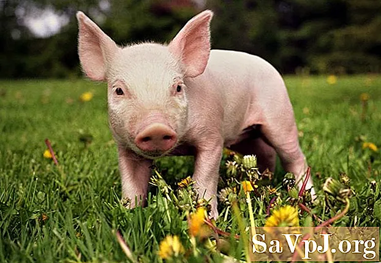

<u>פרשת שמיני – השם הרע של החזיר</u>

<u>ספר ויקרא פרק יא</u>

(ד) אַךְ אֶת זֶה לֹא תֹאכְלוּ מִמַּעֲלֵי הַגֵּרָה וּמִמַּפְרִסֵי הַפַּרְסָה אֶת הַגָּמָל
כִּי מַעֲלֵה גֵרָה הוּא וּפַרְסָה אֵינֶנּוּ מַפְרִיס טָמֵא הוּא לָכֶם:

(ה) וְאֶת הַשָּׁפָן כִּי מַעֲלֵה גֵרָה הוּא וּפַרְסָה לֹא יַפְרִיס טָמֵא הוּא
לָכֶם:

(ו) וְאֶת הָאַרְנֶבֶת כִּי מַעֲלַת גֵּרָה הִוא וּפַרְסָה לֹא הִפְרִיסָה טְמֵאָה הִוא
לָכֶם:

(ז) וְאֶת הַחֲזִיר כִּי מַפְרִיס פַּרְסָה הוּא וְשֹׁסַע שֶׁסַע פַּרְסָה וְהוּא גֵּרָה
לֹא יִגָּר טָמֵא הוּא לָכֶם:

(ח) מִבְּשָׂרָם לֹא תֹאכֵלוּ וּבְנִבְלָתָם לֹא תִגָּעוּ טְמֵאִים הֵם לָכֶם:

פרשת "שמיני" מונה את האסור והמותר למאכל, ולמגע עם החיה
המתה, אם דרך תכונות בעל החיים (מעלה גרה, ומפריס פרסה לחיות הגדולות) ואם
דרך שמות בעלי החיים ממש.

והחזיר מופיע בין שמות רבים של יונקים, עופות וחרקים,
כאסור למאכל ולמגע עם נבלתו. אחד מני רבים...

מדוע דווקא לחזיר, יש שם כל כך רע? מדוע דווקא אכילת בשר
חזיר היא המסמלת את שיא הכפירה? ואפילו סלידה ממש.

האם בתנ"ך, כלומר, ימי הבית הראשון רואים כך את
החזיר?

בפעם הראשונה שמצאתי התייחסות לחזיר, מלבד בתורה, זה בספר
ישעיהו, ואפילו המאוחר (סוף ימי הבית הראשון, ואולי תחילת השני).

גם בתורה הוא נזכר פעמיים בלבד, ובנוסח זהה, בספר "ויקרא"
ובספר "דברים".

<u>ספר ישעיה פרק סו</u>

(ג) שׁוֹחֵט הַשּׁוֹר מַכֵּה אִישׁ זוֹבֵחַ הַשֶּׂה עוֹרֵף כֶּלֶב מַעֲלֵה מִנְחָה דַּם
חֲזִיר מַזְכִּיר לְבֹנָה מְבָרֵךְ אָוֶן גַּם הֵמָּה בָּחֲרוּ בְּדַרְכֵיהֶם וּבְשִׁקּוּצֵיהֶם נַפְשָׁם חָפֵצָה:

על פי רוב המפרשים צריך לקרוא את הפסוק כך:

שוחט השור – מכה איש. זובח השה – עורף כלב. מעלה מנחה – דם
חזיר. מזכיר לבונה – מברך און. גם המה בחרו בדרכיהם, ובשקוציהם נפשם
חפצה.

כלומר: אני (אלוהים) שונא את הפולחן שלכם, ולכן גם מי
שמקריב שור הוא חוטא בעיני כמו מי שהורג איש, ומי שזובח שה כמו המקריב כלב,
ומי שמעלה מנחה כמו מקריב דם חזיר...

ברור שהקרבת חזיר הוא דבר חמור, אך לא יותר מהקרבת
כלב...

ובאותו פרק, החזיר מודגש, אבל כמו העכבר...:

<u>ספר ישעיה פרק סו</u>

(טו) כִּי הִנֵּה יְהֹוָה בָּאֵשׁ יָבוֹא וְכַסּוּפָה מַרְכְּבֹתָיו לְהָשִׁיב בְּחֵמָה אַפּוֹ
וְגַעֲרָתוֹ בְּלַהֲבֵי אֵשׁ:

(טז) כִּי בָאֵשׁ יְהֹוָה נִשְׁפָּט וּבְחַרְבּוֹ אֶת כָּל בָּשָׂר וְרַבּוּ חַלְלֵי
יְהֹוָה:

(יז) הַמִּתְקַדְּשִׁים וְהַמִּטַּהֲרִים אֶל הַגַּנּוֹת אַחַר אַחַת בַּתָּוֶךְ אֹכְלֵי בְּשַׂר
הַחֲזִיר וְהַשֶּׁקֶץ וְהָעַכְבָּר יַחְדָּו יָסֻפוּ נְאֻם יְהֹוָה:

החזיר טמא, כמו הכלב, העכבר, וחיות אחרות.

כנראה, שאין סלידה מיוחדת מהחזיר, כי השם חזיר, מופיע,
כנראה, כשם של אדם בתנ"ך, כמו גם שמות של בעלי חיים אחרים, כשרים וטמאים
(דבורה, יונה, חולדה, שפן ועוד).

הנה למשל, רשימה (אנכרוניסטית) של משפחות כוהנים בימי דוד
המלך:

<u>ספר דברי הימים א פרק כד
</u>(שנכתב בימי בית שני)

(ו) וַיִּכְתְּבֵם שְׁמַעְיָה בֶן נְתַנְאֵל הַסּוֹפֵר מִן הַלֵּוִי לִפְנֵי הַמֶּלֶךְ וְהַשָּׂרִים
וְצָדוֹק הַכֹּהֵן וַאֲחִימֶלֶךְ בֶּן אֶבְיָתָר וְרָאשֵׁי הָאָבוֹת לַכֹּהֲנִים וְלַלְוִיִּם בֵּית אָב אֶחָד אָחֻז
לְאֶלְעָזָר וְאָחֻז אָחֻז לְאִיתָמָר:

(ז) וַיֵּצֵא הַגּוֹרָל הָרִאשׁוֹן לִיהוֹיָרִיב לִידַעְיָה הַשֵּׁנִי:

......

(טו) לְחֵזִיר שִׁבְעָה עָשָׂר לְהַפִּצֵּץ שְׁמוֹנָה עָשָׂר:

.....

אמנם הניקוד הוא חֵזיר, אך ניקוד התנ"ך הוא מאוחר במאות
שנים מכתיבתו. איש לא היה מעלה בדעתו היום, לתת שם כזה לילדו, או
למשפחתו.

ועוד, בספר נחמיה, שהוא היסטורי הרבה יותר, ומתאר כריתת
אמנה בין "האל" והמשפחות החשובות שעלו מבבל, עם שמות מוזרים לנו היום,
וביניהם חזיר:

<u>ספר נחמיה פרק י</u>

(א) וּבְכָל זֹאת אֲנַחְנוּ כֹּרְתִים אֲמָנָה וְכֹתְבִים וְעַל הֶחָתוּם שָׂרֵינוּ
לְוִיֵּנוּ כֹּהֲנֵינוּ:

(ב) וְעַל הַחֲתוּמִים נְחֶמְיָה הַתִּרְשָׁתָא בֶּן חֲכַלְיָה וְצִדְקִיָּה:

......

.......

(טו) רָאשֵׁי הָעָם פַּרְעֹשׁ פַּחַת מוֹאָב עֵילָם זַתּוּא בָּנִי:

(טז) בֻּנִּי עַזְגָּד בֵּבָי:

....

(כא) מַגְפִּיעָשׁ מְשֻׁלָּם חֵזִיר:

(כב) מְשֵׁיזַבְאֵל צָדוֹק יַדּוּעַ:

ומוכר לנו קבר ידוע בירושלים, קבר בני חזיר, מימי בית שני
ובו כתובת:

זה הקבר והנפש שלאלעזר חניה יועזר יהודה שמעון יוחנן בני
יוסף בן עובד יוסף ואלעזר בני חניה כהנים מבני חזיר.

(שוב, מקובל לקרוא חֵזיר, אך הכתובת אינה מנוקדת, ולא מצאתי
הסבר לשם הכתוב בצירה).

הבה נעשה הכרה עם החזיר, ונברר מדוע הוא ידוע
לשמצה...

<u>מיהו החזיר?</u>

החזיר (סוג המכיל כמה מינים) הוא יונק בעל תכונות מצוינות
להתרבות.

הוא אוכל כל, צמחים ופירות, קליפות עצים, חרקים מתים,
תולעים, בשר גם של נבלות.

בגרות מינית עד שנה וחצי. בכל המלטה בין 6 ל 12
צאצאים.

אינטליגנציה מהגבוהות בבעלי החיים. בוודאי יותר מהכלב,
למשל, ויש טוענים שהוא ברמה של שימפנזה!

ממילא מובן, שהחזיר אינו בסכנת הכחדה... אדם וחזיר, לא
ברור מי ייכחד קודם.

אחת התכונות שיוצרות לו שם רע נובעת מחוסר בלוטות זיעה.
הוא אינו יכול לצנן את עצמו, לכן הוא מתפלש בבוץ ובכל רטיבות, כדי להתקרר,
ונחשב למלוכלך (באמת מתלכלך...).

ובכל זאת החזיר דומה לנו בהרבה תכונות. משתמשים במסתמי לב
של חזיר להשתלה בלב אדם...

אותנו מעסיק חזיר הבית (את החיפאים חזירי הבר...).

חזיר הבית בוית מחזיר הבר, לפני כעשרת אלפים שנה באזור
המזרח התיכון, כנראה אנטוליה, וכנראה באותה תקופה, גם בסין, ובמקומות אחרים
באסיה.

<u>החזיר הוא מחיות הבית הראשונות שבויתו (הראשונה הייתה
הכלב)</u>

כחיית בית, החזיר מיועד לבשר (ושימושים משניים כמו עור,
שער, וכד'). היום הוא גם משמש בכמה מקומות כחיית מחמד... (כאמור,
אינטיליגנטי יותר מהכלב), ובזכות חוש ריח מפותח, גם לזיהוי חומרי נפץ
ופטריות כמהין, שערכן גבוה מאוד.

כחיית בית יש לו יתרונות רבים, בגלל שהוא אוכל אשפה, מתרבה
במהירות, ובשרו ניתן לשימור בעישון או בהמלחה גם בלי קירור, מבלי לאבד
מטעמו.

מצד שני, החזירה אינה מתאימה לחליבה, בגלל ריבוי הפטמות
ומיעוט החלב, וגם טעמו.

היסטורית, חסרונו הגדול הוא בצריכה גדולה של מים, ובחוסר
התאמתו לנדודים ארוכים (המתאימים לכבשים ועיזים).
לכן, נודדי המדבריות לא הכירו אותו, או לא אהבו
אותו.

וזה מרמז לנו, אולי, מדוע המתנחלים בארץ ישראל, בסוף תקופת
הברונזה, שבאו מהמדבריות במזרח ובדרום, לא נהגו לאכול חזיר.

חוקרים מוצאים שאכילת בשר חזיר הייתה נפוצה באזורנו בעבר
הרחוק, <u>ופוסקת בערך בתחילת תקופת הברזל</u> ( שנים קרובות לשנת 1000
לפנה"ס), וזה מתאים באמת להתיישבות בני ישראל.

הארכיאולוגים מזהים ישובים של התנחלות בני ישראל על פי אי
מציאותם של עצמות חזירים, בניגוד, למשל, לאזורים שבהם התיישבו הפלשתים
באותו זמן, שהגיעו מאיי הים האירופאים.

מובן, שעל פי המסורת, האיסור לאכול בשר חזיר הוא הגורם.
אבל, אם נניח על פי המחקר שהתורה עצמה נכתבת בסוף ימי הבית השני, <u>צריך
להניח שהמנהג שלא לאכול חזיר קדם למסורת הכתובה.</u>

אין הוכחות ברורות לסיבות ההתנגדות לחזיר אצלנו, אך יש כמה
השערות לכך:

1.  ידוע שכוהנים במצרים, וגם במסופוטמיה נמנעו מבשר חזיר,
    כאיסור ממש, ותיתכן השפעה על שבטי ישראל שבאו מהמזרח או מהדרום, או
    מהשפעות האימפריות האלה (לפחות על ההנהגה הדתית).

2.  כאמור, החזיר אינו מתאים למדבר, ולכן שבטים שבאו
    מהמדבר לא היו רגילים לאכול אותו.

3.  בתקופה זו ממש מתחיל גידול עופות אצל מתיישבי קבע,
    ולעופות יש כמה יתרונות על החזיר (פחות השקעת מזון ביחידת בשר, וכן,
    שימוש בביצים).

כך או כך, החזיר הפך במשך השנים למאפיין זהות של שבטי
ישראל. מן הסתם, בסוף ימי הבית הראשון, כאשר מתחילה התורה להיכתב, הוא נמנה
עם החיות הטמאות, והופך מאפיין לאומי.

המאפיין הזה הופך למודגש יותר ואפילו מרכזי, בחצי השני של
ימי הבית השני, עם הכיבוש ההלניסטי והרומי. <u>היוונים ובעיקר הרומאים אהבו
מאוד את בשר החזיר.</u> הנכבשים מדגישים את זהותם מול הכובשים.

ספר מקבים ב', או חשמונאים ב', נכתב על ידי מחבר לא ידוע
באלכסנדריה, בשפה היוונית הלניסטית, בערך בשנת 100 לפנה"ס.

שם מוצג בשר החזיר כמאפיין לאומי דתי חזק, בסיפורים על על
גזירות אנטיוכוס:

<u>מקבים ב' פרק ו'</u>

כא . איש נבון ויודע ספר היה
בישראל, והוא זקן ובא בימים ויפה מראה, ושמו אלעזר

כב. ויפתחו את פיו בחוזקה להאכילו בשר חזיר, ויקא אותו
לעיניהם

כג. כי בחרה נפשו לתת את גוו למכים ולמות ביושר לבבו,
מחיות חיי תמרורים

ובהמשך...

(א) וגם אשה ושבעה בניה היו אסורים בבית הסוהר, ויפצר בם
המלך לאכול מבשר החזיר, ויכו אותם בשוטים ובמקלות.

והסיפור ידוע כ"חנה ושבעת בניה", ומופיע במקורותינו
בגירסאות שונות.

החזיר תופס מקום "מכובד" בין העבירות החמורות לאחר
החורבן:

<u>תוספתא מסכת הוריות פרק א</u>

(ד) האוכל שקצים זה מומר. כיצד מומר? אוכל נבלות וטרפות
שקצים ורמשים, האוכל בשר חזיר והשותה יין נסך, או המחלל את השבת והמנסך. ר'
יוסי בר' יהודה אומר אף הלובש כלאים...

וייתכן, שהחזיר מודגש מכל החיות הטמאות, פשוט מפני שהיה
זמין, גודל בארץ ונאכל על ידי אחרים, ואת האחרות ממילא לא אכלו.

כשרוצים להראות שעבירה היא חמורה, משווים אותה לאכילת בשר
חזיר.

<u>משנה מסכת שביעית פרק ח</u>

(י) וְעוֹד אָמְרוּ לְפָנָיו, אוֹמֵר הָיָה רַבִּי אֱלִיעֶזֶר, הָאוֹכֵל פַּת כּוּתִים
כְּאוֹכֵל בְּשַׂר חֲזִיר.

אין ספק שבתקופה זו זו החזיר זמין ביותר, בגלל ריבוי אוכלי
החזיר בארץ ישראל ובאיזור בכלל.

<u>ירושלמי ברכות פרק ג הלכה ה
(זהירות כאשר רוצים להתפלל)</u>

ר' יוסי בר חנינא אמר, מרחיקין מגללי בהמה ארבע אמות. רבי
שמואל בר רב יצחק אמר ברכים, ובלבד בשל חמור. ר' חייא בר אבא אמר...
מרחיקין מצואת חזיר ארבע אמות, ותני כן, מרחיקין מצואת חזיר ארבע אמות,
ומצואת הנמייה ארבע אמות, ומצואת התרנגולין ארבע אמות ....

<u>תלמוד בבלי מסכת שבת דף קנה/ב</u>

\[מה מותר בשבת\]כדתניא, נותנין מזונות לפני כלב ואין
נותנין מזונות לפני חזיר. ומה הפרש בין זה לזה? זה מזונותיו עליך וזה אין
מזונותיו עליך...\[כלומר, הוא מסתדר לבד\]

כבר במשנה יש התנגדות לגידול חזירים, אבל במסגרת הגבלות
כלליות, וצריך לשים לב שאלו לא הלכות מפורשות, אלא כעין המלצות אקולוגיות
ואחרות:

<u>משנה מסכת בבא קמא פרק ז</u>

(ז) אֵין מְגַדְּלִין בְּהֵמָה דַּקָּה בְּאֶרֶץ יִשְׂרָאֵל, אֲבָל מְגַדְּלִין בְּסוּרְיָא,
וּבְמִדְבָּרוֹת שֶׁבְּאֶרֶץ יִשְׂרָאֵל. אֵין מְגַדְּלִין תַּרְנְגוֹלִים בִּירוּשָׁלַיִם, מִפְּנֵי הַקֳּדָשִׁים\[מפני
שהם מסתובבים ועלולים להביא משהו טמא לאיזור המקדש\], וְלֹא כֹהֲנִים בְּאֶרֶץ יִשְׂרָאֵל
מִפְּנֵי הַטַּהֲרוֹת. <u>אֵין מְגַדְּלִין חֲזִירִים בְּכָל מָקוֹם</u>. לֹא יְגַדֵּל אָדָם אֶת הַכֶּלֶב, אֶלָּא
אִם כֵּן הָיָה קָשׁוּר בְּשַׁלְשֶׁלֶת. אֵין פּוֹרְסִין נִשָּׁבִין לַיּוֹנִים. אֶלָּא אִם כֵּן הָיָה רָחוֹק מִן
הַיִּשׁוּב שְׁלֹשִׁים רִיס \[לא מעמידים מלכודות ליונים, כי עלולות להילכד בהן יונים
ששייכם למישהו בישוב\]:

לא ברור אם "אין מגדלים חזירים" מהסיבה של איסור בשר חזיר
(שהרי ברור שגדלוהו גם כעסק) או מסיבות אקולוגיות, כמו חלק מהדרישות
האחרות.

<u>שהרי כך בתלמוד בבלי מסכת קידושין דף מט/ב</u>

עשרה קבים נגעים ירדו לעולם ט' נטלו חזירים כו'

אפשר שהתדמית המלוכלכת של החזיר מצטרפת להיותו
טריפה.

מפני שאין פירוש במשנה לאיסור גידול חזירים, התלמוד מביא
הסבר "היסטורי" כאשר הוא מפרש את המשנה שצוטטה לעיל.

<u>תלמוד בבלי מסכת בבא קמא דף פב/ב</u>

אין מגדלין חזירים בכל מקום. תנו רבנן: כשצרו בית חשמונאי
זה על זה היה הורקנוס מבפנים ואריסטובלוס מבחוץ. ובכל יום היו משלשים להם
בקופה דינרין והיו מעלין להם תמידים. היה שם זקן אחד שהיה מכיר בחכמת
יוונית, אמר להם, כל זמן שעוסקין בעבודה אין נמסרים בידכם. למחר שילשלו
דינרין בקופה והעלו להם חזיר. כיון שהגיע לחצי החומה נעץ צפרניו בחומה
ונזדעזעה ארץ ישראל ארבע מאות פרסה על ארבע מאות פרסה.

באותה שעה אמרו: ארור האיש שיגדל חזירים, וארור האדם שילמד
את בנו חכמת יוונית.

אגדה יפה, שמתאימה גם למלחמות אחים בימינו, אבל היא מראה
שאיסור גידול חזירים הוא לא איסור מבוסס, אפילו בתקופת התלמוד
הבבלי.

ואמנם ספק אם "איסור גידול" הוא מצווה שקויימה, או מצווה
בכלל.

למעשה, ממש לא.

<u>תוספתא מסכת עבודה זרה פרק א</u>

מוכר לתגר, או מוכר לבעל הבית. אם היה תגר חשוד \[שהוא
עובד אלילים\] אסור למכור לו. <u>מוכר לו חזירין,</u> ואינו חושש שמא מוכר
לעבודת כוכבים. מוכר לו יין ואינו חושש שמא מנסכו לעבודת כוכבים. ואם פירש
לו \[שהוא עובד אלילים\] אפילו מים ומלח אסור למכור לו...

וגם בתקופות מאוחרות ביותר, עד ימינו, שבהן יש רק החמרה
בכל המצוות, מותר להחזיק חזירים, לפחות בנסיבות מסוימות:

<u>שו"ע חו"מ סימן שצ (יוסף קארו,
המאה השש עשרה, צפת)</u>

בהמה שנכנסה לחצר הניזק והיו צרורות מנתזין מתחת רגליה
ושברו את הכלים, משלם חצי נזק מהיפה שבנכסיו; ודבר זה הלכה למשה
מסיני:

(ד) וכן אם היתה מהלכת בר"ה ונתזו צרורות מתחת רגליה לרשות
הניזק ושברו את הכלים, משלם חצי נזק. והוא הדין לתרנגולים שהדסו והעלו עפר
או צרורות ושברו, <u>וכן חזיר שהיה נובר באשפה</u> והתיז צרורות והזיק,
משלם חצי נזק:

(מובן, שבעל החזיר הוא משלם את חצי הנזק, ומובן שהוא
יהודי, אם ה"שולחן ערוך" פוסק לגביו...)

<u>משנה ברורה על או"ח סימן שכד
(נכתב על ידי "החפץ חיים", ר' ישראל מאיר הכוהן מראדין,
בערך 1900)</u>

\[מתייחס להאכלת חיות בשבת, ככתוב בתלמוד הבבלי לעיל\] ולא
לפני חזיר - דאין מזונותיו עליו לפי <u>שאסור לגדלו</u> וכדאיתא בח"מ סימן
ת"ט. ואם נפלו לו בפרעון חובו, <u>שמותר להשהותן עד שימצא למכרן
בשויין,</u> מקרי מזונותן עליך, ומותר ליתן להם מזונות:

בתקופות רבות תוהים על טעמי המצוות, ומבחינים בין מצוות
"שכליות" (אלו המצוות המוסריות, "הברורות מאליהן", ומכונות גם "משפטים")
ומצוות "שמעיות" ("כך אלוהים רוצה" ומצוות אלו מכונות גם "חוקים").

"ספרא" הוא מדרש מוקדם על ספר ויקרא, שנכתב בארץ ישראל
כנראה במאה השלישית או קודם.

<u>ספרא פרשת אחרי מות פרק יג</u>

(ט) את משפטי תעשו, אלה הדברים הכתובים בתורה, שאילו לא
נכתבו בדין היה לכתבן. כגון הגזלות והעריות וע"א וקללת השם ושפיכות דמים,
שאילו לא נכתבו בדין היה לכתבן.

ואלו שיצר הרע משיב עליהם \[מערער עליהם\], ואומות העולם
עו"ג משיבין עליהם, כגון אכילת חזיר ולבישת כלאים וחליצת יבמה וטהרת המצורע
ושעיר המשתלח, שיצר הרע משיב עליהן ואומות העולם עו"ג משיבין עליהם, תלמוד
לומר, <u>אני ה' חקקתים אין את רשאי להשיב עליהם</u>:

והרמב"ם מפרש ב"יד החזקה" ("משנה תורה"), ממש כך.

<u>רמב"ם יד החזקה הלכות מעילה פרק ח</u>

הרי נאמר בתורה <u>ושמרתם את כל חקותי ואת כל משפטי ועשיתם
אותם</u> ...

<u>והמשפטים</u> הן המצות שטעמן גלוי וטובת עשייתן בעולם
הזה ידועה, כגון איסור גזל ושפיכות דמים וכיבוד אב ואם \[בניגוד למשנה, הוא
לא כולל כאן עבודת אלילים וקללת השם!\]. <u>והחוקים</u> הן המצות שאין טעמן
ידוע. אמרו חכמים, חוקים חקתי לך ואין לך רשות להרהר בהן. ויצרו של אדם
נוקפו בהן \[היצר רוצה לעבור עליהם\] ואומות העולם משיבין עליהן \[מערערים
על ההיגיון בהם\], כגון איסור בשר חזיר ובשר בחלב ועגלה ערופה ופרה אדומה
ושעיר המשתלח...

גם ב"ספרא" וגם הרמב"ם, מרמזים, שהיצר הרע דוחף לאכול בשר
חזיר, ואומות העולם אוכלים בשר חזיר (ושאר איסורים), אבל "לך", כלומר
היהודי, אין רשות להרהר בהיגיון של המצווה הזאת, כך פסק הקב"ה וזהו.

לרמב"ם יש גישה אזוטרית (אפשר לומר מתנשאת). להמון העם,
להדיוטות, הוא מסביר בעברית, ב"משנה תורה", שפשוט חייבים למלא כל מצווה,
ולא לחשוב יותר מדי.

אבל ב"מורה נבוכים" שנכתב על ידו בערבית (השפה
הבינלאומית), לחכמים בלבד, הוא מנסה למצוא הסבר הגיוני גם למצוות השמעיות.
ולא נשפוט אותו על בורות בנושאים זואולוגיים.

<u>ספר מורה נבוכים - חלק ג פרק מח</u>

ואומר, כי כל מה שאסרתו התורה עלינו מן המאכלים - מזונם
מגונה. ואין בכל מה שנאסר עלינו מה שיסופק \[שמטילים ספק\] שאין הזק בו, רק
החזיר והחֵלב; ואין הענין כן \[אין סיבה לספק\], כי <u>החזיר יותר לח ממה
שצריך ורב הפסולת והמותרות</u>, <u>ורוב מה שמאסתו התורה לרוב לכלוכו
ומזונו בדברים הנמאסים.</u> וכבר ידעת הקפדת התורה על ראית הלכלוכים,
ואפילו בשדות במחנה - כל שכן בתוך המדינה. <u>ואילו היתה מותרת אכילת
החזיר, היו השווקים עם הבתים יותר מלוכלכים מ'בית הכסא' - כמו שתראה ארצות
הצרפתים היום.</u>

\[רכילות לגבי הצרפתים, הוא חי במצרים\]

קוהלת רבה הוא מדרש אגדה שנכתב, כנראה, במאות האחרונות של
האלף הראשון (תקופת הגאונים), והוא רואה באיסור בשר חזיר מאפיין
דתי.

<u>קוהלת רבה – פרשה א</u>

...למה נקרא שמו חזיר אמר להם שהוא עתיד להחזיר את המלכות
לבעליה...

רבנן אמרין: לעתיד לבא, הקב"ה מוציא כרוז ומכריז ואומר, כל
מי שלא אכל בשר חזיר מימיו יבא ויטול שכרו. והרבה מאומות העולם, שלא אכלו
בשר חזיר מימיהם, והם באים ליטול שכרן...\[כלומר, הגויים שאינם אוכלים חזיר
מתיימרים להיות יהודים בדתם\]

אבל, אל נטעה, הקב"ה לא נופל בפח, ודורש מאפיינים דתיים
נוספים...

(אגב, המוסלמים, שבהלכות כשרות, הולכים די רחוק בעקבות
ההלכה היהודי, אינם אוכלים חזיר, ובתקופת כתיבת המדרש כבר היה האסלאם נפוץ,
ואולי אף נכתב הספר תחת שלטון האסלאם).

במאות האחרונות, בתקופת ההשכלה והחילון, מובן שאיסור בשר
חזיר איננו כבר מאפיין לאומי, אלא דתי בלבד. ומי מתאר יהודים אוכלי חזיר
טוב יותר מספר הבדיחה והחידוד של דרויאנוב?!

<u>מתוך ספר הבדיחה והחידוד</u>

יהודי נכנס אצל גוי שכנו, ומצא אותו מיסב בסעודה ולפניו
כרכשאות וקדלי-חזיר. התחיל ריחם היפה מגרה את יצרו של היהודי, ולא עמד
בניסיון: פרס פרוסה קטנה ונתנה לתוך פיו. בו ברגע הרעים רעם. נתחלחל
היהודי, פלט מיד כל מה שבפיו ופנה כלפי מעלה: אי! בשל פחות מכזית אתה מרעיש
עולמות...

\*\*\*\*

באו אל הרב וסיפרו לו, שראו את פלוני החשוב רוקד עם
"שיקצה" ואוכל חזיר.

שלח הרב אחריו ואמר לו:

<u>תמה אני מאוד</u>, כיצד הגעת אתה לידי כיעור
כזה?

החזיר לו אותו חשוב:

רבי, אילו אכלתי "שיקצה" ורקדתי עם חזיר, היתה תמיהתך
תמיהה.

עכשיו, שאכלתי חזיר ורקדתי עם "שיקצה", מה תמיהה יש
כאן?...

העובדה שעיקר הזהות היהודית בגולה התבססה על הדת, ואילו
רוב התשתית למדינת ישראל נבנתה על ידי ציונים חילוניים, יוצרת את האתגר של
זהות יהודית במדינת ישראל.

אחת התוצאות היא התערבות פוליטית בנושא הזהות
הלאומית.

והנה, החזיר שהיה מאפיין לאומי, והפך למאפיין דתי, הוא
עכשיו מאפיין פוליטי.

בשנותיה הראשונות של המדינה, המפד"ל ממצבת את עצמה בתפקיד
של בניית צביונה של המדינה, קרוב ככל האפשר לדרישות ההלכה.

בגלל הסמליות המודגשת של איסור החזיר, כמאפיין לאומי
(לדעתה ולדעת מסורתיים רבים), הצליחה להעביר את החוק הבא, חרף משקלה
הפוליטי הקטן:

<u>חוק איסור גידול חזיר,
תשכ"ב-1962</u><u>\*</u>

**האיסור**

1.    לא יגדל אדם חזירים, לא יחזיקם ולא ינחרם.

**אי תחולת האיסור**

2.    הוראות סעיף 1 לא יחולו –

> (1)   בתחומי הישובים המפורטים בתוספת לחוק זה;
>
> (2)   על גידול, החזקה ונחירה של חזירים במוסדות מדע
> ומחקר ובגני חיות ציבוריים.

**ענשין**

3.    העובר על הוראות סעיף 1, דינו - קנס 10,000
לירות.

וכן הלאה... (אגב, "נחירה" היא שחיטה, אך משתמשים במושג זה
כדי להרחיק כל דימוי של כשרות...).

וזה מה שקורה, כאשר מאפיין דתי הופך לפוליטי.

האיסור בחוק איננו האיסור הדתי כלל...

המעוניינים ממשיכים לאכול בשר חזיר...

אבל רואים פחות חזירים...

והעיקר, זה נרשם לזכות המפד"ל (כלומר, מאפיין פוליטי של
המפד"ל...).

<u>הנה פיסקה סיכום ממאמר של גיורא גודמן ב"קתדרה" משנת
1965</u>

החוק לאיסור גידול חזיר, שנחקק בשנת 1962 ,ושיושם כעבור
שנה, הוא מהחוקים המשפיעים ביותר על משק בעלי החיים במדינת ישראל מאז
הקמתה. ...

\[על משק בעלי החיים, לא על מזונם של היהודים...\]

ענף שפרח לפתע בקיבוצים בשנות החמישים נעלם במהירות גדולה
משצמח: כמעט כל הקיבוצים חיסלו את הדירים וניצלו את כוחם הפוליטי להשיג
מהמדינה פיצויים....

רבים מהמגדלים הפרטיים פרשו גם הם מהענף; אחרים העבירו את
אלפי חזיריהם ממרכז הארץ ומאזור חיפה לאזורים שהיו מותרים בגידול.
הצלחת החוק להביא לביעור החזירים ממרבית חלקי הארץ בפרק
זמן כה קצר, הייתה תוצאה של כלי האכיפה הקשוחים שהוא נתן בידי הרשויות
המנהליות, בעיקר האפשרות להחרים ולהשמיד חזירים, וכמובן של נחישות משרד
הפנים <u>בראשות המפד"ל</u> לאכוף את החוק כלשונו ובמלואו....

רוב תושבי הארץ <u>יוכלו לראות מעתה חזיר מבוית חי רק
בסרטים או בתמונות בספרי ילדים</u><u>.</u>
...

<u>....גידול החזירים באזורים המותרים המשיך לספק את
הצריכה הארצית. ...</u>

וכך הפך איסור החזיר, ממאפיין שבטי, ללאומי, וממאפיין
לאומי לדתי, ולבסוף למאפיין פוליטי, שניתן להיאבק עליו כדי לרכוש מצביעים
בשני הצדדים...

ולא ברור עד היום הזה מי אינטיליגנטי יותר, האדם או
החזיר.
