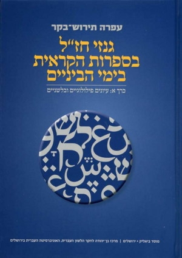

<u>פרשת קורח – מחלוקות לשם שמים ולא</u>

<u>ספר במדבר פרק טז</u>

(א) וַיִּקַּח קֹרַח בֶּן יִצְהָר בֶּן קְהָת בֶּן לֵוִי וְדָתָן וַאֲבִירָם בְּנֵי אֱלִיאָב
וְאוֹן בֶּן פֶּלֶת בְּנֵי רְאוּבֵן:

(ב) וַיָּקֻמוּ לִפְנֵי משֶׁה וַאֲנָשִׁים מִבְּנֵי יִשְׂרָאֵל חֲמִשִּׁים וּמָאתָיִם נְשִׂיאֵי
עֵדָה קְרִאֵי מוֹעֵד אַנְשֵׁי שֵׁם:

(ג) וַיִּקָּהֲלוּ עַל משֶׁה וְעַל אַהֲרֹן וַיֹּאמְרוּ אֲלֵהֶם רַב לָכֶם כִּי כָל הָעֵדָה
כֻּלָּם קְדשִׁים וּבְתוֹכָם יְהֹוָה וּמַדּוּעַ תִּתְנַשְּׂאוּ עַל קְהַל יְהֹוָה:

(ד) וַיִּשְׁמַע משֶׁה וַיִּפֹּל עַל פָּנָיו:

(ה) וַיְדַבֵּר אֶל קֹרַח וְאֶל כָּל עֲדָתוֹ לֵאמֹר בֹּקֶר וְיֹדַע יְהֹוָה אֶת אֲשֶׁר
לוֹ וְאֶת הַקָּדוֹשׁ וְהִקְרִיב אֵלָיו וְאֵת אֲשֶׁר יִבְחַר בּוֹ יַקְרִיב אֵלָיו:

והסוף ידוע, אלוהים בוחר את הטובים, והאדמה פוצה את פיה
ובולעת את הרעים.

עוד ניסיון להפר את רצון אלוהים, שמסתיים בעונש
כבד.

אבל חז"ל, לא פעם מסיקים מסקנות ערכיות חשובות מפרשיות
כאלה. הם ראו בפרשת קורח דוגמא למחלוקת "שאינה לשם שמים":

<u>משנה מסכת אבות פרק ה</u>

כָּל מַחֲלוֹקֶת שֶׁהִיא לְשֵׁם שָׁמַיִם, סוֹפָהּ לְהִתְקַיֵּם. וְשֶׁאֵינָהּ לְשֵׁם שָׁמַיִם,
אֵין סוֹפָהּ לְהִתְקַיֵּם. אֵיזוֹ הִיא מַחֲלוֹקֶת שֶׁהִיא לְשֵׁם שָׁמַיִם, זוֹ מַחֲלוֹקֶת הִלֵּל וְשַׁמַּאי.
וְשֶׁאֵינָהּ לְשֵׁם שָׁמַיִם, זוֹ מַחֲלוֹקֶת קֹרַח וְכָל עֲדָתוֹ:

שאלה מעניינת כשלעצמה, היא מה פירושה "סופה להתקיים".
כנראה שהכוונה שיש ממנה תועלת לעתיד. גם ממחלוקות יש תועלת.

(זוהי תפיסה מתקדמת מאוד, שמאפיינת את גישתו של הפילוסוף
הגל, למשל, שההתקדמות נוצרת מהניגודים, כמעט אפשר לומר, שרק ממחלוקות יש
תועלת).

אך להמשך ענייננו חשב במה מתבטא ההבדל בין שני סוגי
המחלוקות. במשנה, הם מביאים את שתי הדוגמאות. בתלמוד הבבלי, הם מנסים
להסביר ולהכליל.

<u>תלמוד בבלי מסכת עירובין דף יג/ב</u>

אמר רבי אבא אמר שמואל: שלש שנים נחלקו בית שמאי ובית הלל.
הללו אומרים הלכה כמותנו והללו אומרים הלכה כמותנו. יצאה בת קול ואמרה: אלו
ואלו דברי אלהים חיים הן, והלכה כבית הלל.

וכי מאחר שאלו ואלו דברי אלהים חיים מפני מה זכו בית הלל
לקבוע הלכה כמותן? **מפני שנוחין ועלובין היו, ושונין דבריהן ודברי בית
שמאי, ולא עוד אלא שמקדימין דברי בית שמאי לדבריהן.**

פרשנויות שונות, או לפחות עם דגשים שונים לאמירה זו. בדרך
כלל מדגישים המקורות שמחלוקת לשם שמים אינה כוללת טינה אישית (בית הלל ובית
שמאי התחתנו זה בזה), ובמחלוקת לשם שמים מתיחסים בכבוד לא רק ליריב, אלא גם
לדעותיו, ולומדים אותן ברצינות.

ומחלוקת שלא לשם שמים? היא מחלוקת של אינטרסים, אגו,
שנאה.

ובכל זאת במחלוקות שמתפתחות לאורך זמן, לא קל
להבחין.

בקיצור, בשפתנו היינו אומרים, לטובת בית הלל ובהתאם
למסורת:

1.  בויכוחים על ההלכות לא שיחק האגו שלהם.

2.  היו לומדים **ברצון ובכנות** את עמדות המתנגדים
    להם.

נבחן מחלוקות אחרות בעם ישראל.

עם ישראל עתיר מחלוקות, ואם אנו באים למנות את כולן – לא
תספיק לנו השעה, גם לא כל היום ולא כל השבוע....

עם ישראל "אוהב" מחלוקות, ויש אומרים, שאם מחפשים משהו
המאפיין את התרבות היהודית, הרי זה המחלוקת.

<u>וכך מתבדח יורם טהרלב:</u>

**מתוך ספרו לקחתי את הסיפור הבא, שהוא, כמובן, מספר אותו
יותר יפה..**

בבית הכנסת, כל פעם שהגיעו לעשרת הדברות, היו חלק
מהמתפללים קמים, וחלקם יושבים. צעקו אלו על אלה: קומו, עשרת הדברות! ואלה
החזירו להם: שבו! בקריאת עשרת הדברות יושבים... והמהומה רבה.

החליט הרב לשים סוף לעניין. לקח את נציגי בעלי המחלוקת,
והלכו אצל הזקן שבעיירה, ושאלו אותו מה היה המנהג כאשר הוא היה
צעיר.

שאל נציג העומדים: האם המנהג היה לעמוד? ..... לא כך היה
המנהג, השיב הזקן.

התלהב נציג היושבים: האם המנהג היה לשבת? .... לא כך היה
המנהג, השיב הזקן.

נזעק הרב: סבא, אתה חייב להיזכר, אחרת כל פעם תהיה מהומה
בבית הכנסת.

כך היה המנהג, השיב הזקן.

הבה ונסקור, לפחות חלק קטן מהמחלוקות הדרמטיות שליוו את עם
ישראל במשך הדורות.

מאבק הירושה של החשמונאים.

<u>תלמוד בבלי מסכת סוטה דף מט/ב</u>

תנו רבנן, כשצרו מלכי בית חשמונאי זה על זה היה הורקנוס
מבחוץ ואריסטובלוס מבפנים. בכל יום ויום היו משלשלין דינרים בקופה ומעלין
להן תמידים. היה שם זקן אחד שהיה מכיר בחכמת יוונית, לעז להם בחכמת יוונית,
אמר להן כל זמן שעוסקים בעבודה אין נמסרין בידכם. למחר שלשלו להם דינרים
בקופה והעלו להם חזיר. כיון שהגיע לחצי חומה נעץ צפרניו נזדעזעה א"י ארבע
מאות פרסה אותה.

זו אגדה המראה כיצד יכולה להתפתח מחלוקת לשנאה הרסנית.
ואמנם המחלוקת הזאת הקלה על פומפיאוס הרומאי להשתלט על הארץ.

יוסף בן מתתיהו מתאר את אותו מאבק תיאור ריאלי ולא פחות
עצוב.

הוא מספר בספרו
"[קדמוניות
היהודים](https://he.wikipedia.org/wiki/%D7%A7%D7%93%D7%9E%D7%95%D7%A0%D7%99%D7%95%D7%AA_%D7%94%D7%99%D7%94%D7%95%D7%93%D7%99%D7%9D)"
על מותו של אדם "חביב אלוהים" בשם "חוניו", שבעבר הוריד
גשמים. בעת המאבקים על ירושת [בית
חשמונאי](https://he.wikipedia.org/wiki/%D7%97%D7%A9%D7%9E%D7%95%D7%A0%D7%90%D7%99%D7%9D),
שניהלו האחים [אריסטובולוס
השני](https://he.wikipedia.org/wiki/%D7%90%D7%A8%D7%99%D7%A1%D7%98%D7%95%D7%91%D7%95%D7%9C%D7%95%D7%A1_%D7%94%D7%A9%D7%A0%D7%99) ו[הורקנוס
השני](https://he.wikipedia.org/wiki/%D7%94%D7%95%D7%A8%D7%A7%D7%A0%D7%95%D7%A1_%D7%94%D7%A9%D7%A0%D7%99),
צר הורקנוס, יחד עם בן בריתו
[חרתת](https://he.wikipedia.org/w/index.php?title=%D7%97%D7%A8%D7%AA%D7%AA&action=edit&redlink=1) מלך
ה[נבטים](https://he.wikipedia.org/wiki/%D7%A0%D7%91%D7%98%D7%99%D7%9D),
על [ירושלים](https://he.wikipedia.org/wiki/%D7%99%D7%A8%D7%95%D7%A9%D7%9C%D7%99%D7%9D_%D7%91%D7%99%D7%9E%D7%99_%D7%91%D7%99%D7%AA_%D7%A9%D7%A0%D7%99)
\[למעשה על הר הבית\]. הדבר היה בימי הפסח של שנת [65
לפנה"ס](https://he.wikipedia.org/wiki/65_%D7%9C%D7%A4%D7%A0%D7%94%22%D7%A1).
בעיר הנצורה שהו המלך אריסטובולוס ועמו הכוהנים. במהלך
המצור נתפס חוני על ידי הצרים, ומכיוון שהיה ידוע כמי שתפילתו נענית, נדרש
להתפלל לאובדנם של הנצורים. משסירב, וביקש מהאל כי לא יביא על הנצורים מה
שמבקשים עליהם הצרים, העלה עליו את חמת הצרים, ואלה המיתוהו בסקילה.

כאן אין ספק. המחלוקת היא "לא לשם שמים". תאוות השלטון
בלבד.

מחלוקת חכמי ישראל וחכמי בבל לאחר מרד בר כוכבא

מחלוקת שכבר הזכרנו היא המחלוקת על הסמכות לעבר שנים, בין
ישראל לבבל. מחלוקת מהמאה השנייה לספירה שנמשכת מאות רבות של שנים!

לכאורה, מחלוקת על שליטה, ובכל זאת שונה. נקרא את הקטע
שנית, עם תוספת שהתעלמנו ממנה. נזכור שבמאה השנייה, גם ראשי חודשים וגם
עיבור נקבעו על פי ראייה בהחלטת בעלי הסמכות.

<u>תלמוד בבלי מסכת ברכות דף סג/א</u>

כשירד חנינא בן אחי רבי יהושע לגולה היה מעבר שנים וקובע
חדשים בחוצה לארץ. שגרו אחריו שני תלמידי חכמים, רבי יוסי בן כיפר ובן בנו
של זכריה בן קבוטל. כיון שראה אותם אמר להם, למה באתם? אמרו ליה ללמוד תורה
באנו. הכריז \[עליהם\] אנשים הללו גדולי הדור. הם ואבותיהם שמשו בבית המקדש
.... התחיל הוא מטמא והם מטהרים, הוא אוסר והם מתירים. הכריז עליהם, אנשים
הללו של שוא הם של תהו הם. אמרו לו, כבר בנית ואי אתה יכול לסתור, כבר גדרת
ואי אתה יכול לפרוץ. אמר להם, מפני מה אני מטמא ואתם מטהרים אני אוסר ואתם
מתירים? אמרו לו, מפני שאתה מעבר שנים וקובע חדשים בחוץ לארץ. אמר להם והלא
עקיבא בן יוסף היה מעבר שנים וקובע חדשים בחוץ לארץ. אמרו לו, הנח רבי
עקיבא שלא הניח כמותו בארץ ישראל. אמר להם אף אני לא הנחתי כמותי בארץ
ישראל \[גדולי החכמים נהרגו במרד בר כוכבא\]. אמרו לו, **גדיים שהנחת נעשו
תישים בעלי קרנים והם שגרונו אצלך. וכן אמרו לנו לכו ואמרו לו בשמנו, אם
שומע מוטב, ואם לאו יהא בנדוי. ואמרו לאחינו שבגולה, אם שומעין מוטב, ואם
לאו יעלו להר, אחיה יבנה מזבח, חנניה ינגן בכנור, ויכפרו כולם ויאמרו אין
להם חלק באלהי ישראל. מיד געו כל העם בבכיה ואמרו, חס ושלום, יש לנו חלק
באלהי ישראל. וכל כך למה? משום שנאמר כי מציון תצא תורה ודבר ה'
מירושלים..**

כלומר, במקרה זה יש נצחון מלא של האוטוריטה של המרכז בארץ
ישראל שחוזרת אליו אחרי שהתפתח המרכז בגליל.

יש קטעים רבים העוסקים במתח בין שני המרכזים, חלקם כמעט
הומוריסטיים. למשל:

**תלמוד בבלי מסכת מנחות דף צט/ב
מצטט ברייתא ממקור ישראלי ומפרש...**

....חל יום כפורים להיות בשבת, החלות מתחלקות לערב. חל
להיות בערב שבת שעיר של יום הכפורים נאכל לערב, והבבליים **אוכלין אותו
כשהוא חי** מפני שדעתן יפה:

......

אמר רבה בר בר חנה אמר רבי יוחנן: **לא בבליים הם אלא
אלכסנדריים הם** ומתוך **ששונאין את בבליים** קורין אותם על שם בבליים.
תניא נמי הכי ר' יוסי אומר, לא בבליים הם אלא אלכסנדריים הם ומתוך ששונאין
את בבליים קוראין אותן על שם בבליים. אמר לו ר' יהודה תנוח דעתך שהנחת
דעתי... \[כלומר, הם לא אומרים עלינו ברצינות שאנחנו אוכלים בשר חי, אלא רק
מתוך שנאה... למה זה מניח את דעתו...\]

והנה נדלג על שבע מאות שנה, למחלוקת מהמאה העשירית בין
בבליים לישראלים, שוב על קביעת הלוח (שעכשיו כמעט כל כללי החישוב שלו כבר
היו מוסכמים, ולא נקבע עוד על ידי תצפית בירח). כאן כבר הניצחון הוא של
המרכז בבבל.

<u>מחלוקת ר' סעדיה גאון ור' אהרון בן מאיר על הלוח בשנת
ד'תרפ"א</u>

ב[קיץ](https://he.wikipedia.org/wiki/%D7%A7%D7%99%D7%A5) שנת [ד'תרפ"א](https://he.wikipedia.org/wiki/%D7%93%27%D7%AA%D7%A8%D7%A4%22%D7%90) ל[מניין
השנים בלוח
העברי](https://he.wikipedia.org/wiki/%D7%9E%D7%A0%D7%99%D7%99%D7%9F_%D7%94%D7%A9%D7%A0%D7%99%D7%9D_%D7%91%D7%9C%D7%95%D7%97_%D7%94%D7%A2%D7%91%D7%A8%D7%99) [921](https://he.wikipedia.org/wiki/921)) ל[ספירת
הנוצרים](https://he.wikipedia.org/wiki/%D7%A1%D7%A4%D7%99%D7%A8%D7%AA_%D7%94%D7%A0%D7%95%D7%A6%D7%A8%D7%99%D7%9D)(,
פרצה [מחלוקת](https://he.wikipedia.org/wiki/%D7%9E%D7%97%D7%9C%D7%95%D7%A7%D7%AA) בין [רב
סעדיה
גאון](https://he.wikipedia.org/wiki/%D7%A8%D7%91_%D7%A1%D7%A2%D7%93%D7%99%D7%94_%D7%92%D7%90%D7%95%D7%9F) 
\[ראש גאוני בבל\] ובין [רב אהרן הכהן בן
מאיר](https://he.wikipedia.org/wiki/%D7%90%D7%94%D7%A8%D7%9F_%D7%91%D7%9F_%D7%9E%D7%90%D7%99%D7%A8),
ראש [ישיבת גאון
יעקב](https://he.wikipedia.org/wiki/%D7%99%D7%A9%D7%99%D7%91%D7%AA_%D7%92%D7%90%D7%95%D7%9F_%D7%99%D7%A2%D7%A7%D7%91),\[כנראה,
טבריה\] על אודות [קביעת לוח השנה וקביעת
ה](https://he.wikipedia.org/wiki/%D7%94%D7%9C%D7%95%D7%97_%D7%94%D7%A2%D7%91%D7%A8%D7%99)[מועדים](https://he.wikipedia.org/wiki/%D7%97%D7%92%D7%99_%D7%99%D7%A9%D7%A8%D7%90%D7%9C_%D7%95%D7%9E%D7%95%D7%A2%D7%93%D7%99%D7%95).
המחלוקת היא אחת מהמפורסמות בין חכמי [ארץ
ישראל](https://he.wikipedia.org/wiki/%D7%90%D7%A8%D7%A5_%D7%99%D7%A9%D7%A8%D7%90%D7%9C) לחכמי [התפוצות](https://he.wikipedia.org/wiki/%D7%92%D7%9C%D7%95%D7%AA_(%D7%99%D7%94%D7%93%D7%95%D7%AA)),
ובמשך כשנתיים - מ[ראש
חודש](https://he.wikipedia.org/wiki/%D7%A8%D7%90%D7%A9_%D7%97%D7%95%D7%93%D7%A9) [כסלו](https://he.wikipedia.org/wiki/%D7%9B%D7%A1%D7%9C%D7%95) [ד'תרפ"ב](https://he.wikipedia.org/wiki/%D7%93%27%D7%AA%D7%A8%D7%A4%22%D7%91) [4)
בנובמבר](https://he.wikipedia.org/wiki/4_%D7%91%D7%A0%D7%95%D7%91%D7%9E%D7%91%D7%A8)( [921](https://he.wikipedia.org/wiki/921)
עד [זאת
חנוכה](https://he.wikipedia.org/wiki/%D7%96%D7%90%D7%AA_%D7%97%D7%A0%D7%95%D7%9B%D7%94) [ד'תרפ"ד](https://he.wikipedia.org/wiki/%D7%93%27%D7%AA%D7%A8%D7%A4%22%D7%93)
[13)
בדצמבר](https://he.wikipedia.org/wiki/13_%D7%91%D7%93%D7%A6%D7%9E%D7%91%D7%A8)
( [923](https://he.wikipedia.org/wiki/923)- נהגו בגללה
בני ארץ ישראל והקהילות הכפופות לה בלוח שנה אחד, ואילו [בני
בבל](https://he.wikipedia.org/wiki/%D7%99%D7%94%D7%93%D7%95%D7%AA_%D7%91%D7%91%D7%9C) והקהילות
הכפופות לה בלוח שנה אחר. לא ברור כיצד נסתיימה המחלוקת, אולם בדורות שלאחר
מכן **הוכרעה ההלכה כדעת [רב סעדיה
גאון](https://he.wikipedia.org/wiki/%D7%A8%D7%91_%D7%A1%D7%A2%D7%93%D7%99%D7%94_%D7%92%D7%90%D7%95%D7%9F)**.
**המחלוקת, שהחלה כמחלוקת הלכתית, הפכה למחלוקת פוליטית
חשובה ביותר על סמכות חישוב לוח השנה ועל הנהגת הדור, בין חכמי ארץ ישראל
לחכמי [בבל](https://he.wikipedia.org/wiki/%D7%91%D7%91%D7%9C),
ועל הנחלת מורשת ההוראה לדורות הבאים.**

שני המרכזים שימשו מרכזי לימוד והוראת הלכה במשך כאלף שנה,
ובדרך כלל שיתוף הפעולה ביניהם (על ידי מעבר חכמים ממקום למקום) היה גדול
מהמחלוקות.

על המחלוקות המתבטאות בהבדלים בין תלמוד ירושלמי לתלמוד
בבבלי ישנם מחקרים שלא תמו. אך אין ספק שישיבות בבל עסקו בלימוד הלכות
שנקבעו בארץ ישראל, וכנראה גם להיפך.

אך כבר קודם, הייתה השפעתה של ישיבת ארץ ישראל (טבריה,
ואחר כך ירושלים, רמלה ועוד) רק באיזור מצרים, סוריה ואולי איטליה ואשכנז),
והשפעתם של גאוני בבל על רוב הגולה.

בכל מאבק מסוג זה קיים אגו. ואף על פי כן ניתן לומר,
שהמחלוקות הללו היו בעיקר מחלוקות היא לשם שמים ...

הייתה מחלוקת נוספת שקרעה ממש את עם ישראל מתחילה במאה
השביעית לספירה במשך כמה מאות שני, ודועכת רק במאות האחרונו.

מחלוקת קראים – רבניים.

<u>הקראים</u>

הזרם הקראי בישראל, מיוסד, לפי המקובל, על ידי ענן בן דוד
במאה השביעית לספירה, בבל. מבחינה מסוימת הוא דומה בראשיתו למחלוקת קורח,
מפני שהוא מרד כנגד הנהגת ישיבות בבל (התקופה היא תחילת השלטון המוסלמי,
והמרכז הבבלי בשיאו).

ענן בן דוד קבע שאין תוקף לכל התורה שבעל פה (שכבר הייתה
בכתב, במשנה ובתלמוד) ויש לקבל רק את התורה שבכתב ("התורה"), עם מינימום
פירושים ההכרחיים לצורך הזמן. וזו תורת הקראים. "רבניים" הם הממשיכים את
מסורת התנאים, האמוראים, הסבוראים, והגאונים.

מבחינת המצוות, נמצא שבחלקן הקראים מחמירים, כמו איסור אש
בשבת. אצל הקראים אסור להשתמש גם באש הדולקת מערב שבת, כלומר, הם יושבים
בחושך ואוכלים אוכל קר.

מצד שני בהלכות כשרות, "לא תבשל גדי בחלב אמו", הם מקבלים
כפשוטו, ולכן אין להם כל בעיה באכילת בשר עם חלב.

תופעה נוספת הנובעת מהתנגדות לסמכות רבנים, היא ליברליות
בפרשנות. פיחות בסמכות של הרב ומותר לאנשים שונים לנהוג אחרת על פי
פרשנותם, במידה רבה. למרות שבמשך השנים היו גם להם חכמים סמכותיים במידה זו
או אחרת.

ר' סעדיה גאון, במאה התשיעית – עשירית נלחם בקראים בקנאות,
על ידי כתיבת ספרות נגדם (כשלושה ספרים).

**בתקופות מסוימות היו הקראים כ 40% מעם ישראל** (!),
ומרכזם היה בארץ ישראל. אחרי תקופת הצלבנים (המאה ה-11) וצרות אחרות,
התפזרו למצרים, ובעיקר לתורכיה, בלקנים ומזרח אירופה, והלכו ופחתו. הם
התמעטו מאוד בדורות האחרונים, וחלקם אף הגדירו עצמם כלא יהודים (למשל,
בתקופת השואה, כדי להינצל). היום נמצאים בארץ כמה עשרות אלפי קראים, בעיקר
במושבות הדרום (13 בתי כנסת) רבים מהם כבר חילוניים.

הנה התייחסות הרמב"ם לנושא במאה ה-12:

<u>רמב"ם פירוש המשניות - מסכת אבות פרק א משנה
ג</u>

ומאז יצאו אלו הכתות רעות, ויקראו באלו הארצות, ר"ל מצרים,
**קראים**, ושמותם אצל החכמים **צדוקים וביתוסים**, והם אשר התחילו להשיב
על הקבלה ולפרש על הפסוקים כפי מה שיראה להם **מבלי שישמעו לחכם כלל,** הפך
אִַמָרו יתברך, "על פי התורה אשר יורוך ועל המשפט אשר יאמרו לך תעשה לא תסור
מן הדבר אשר יגידו לך ימין ושמאל".  
צריך לשים לב, שהרמב"ם, בשם החכמים, מכנה אותם צדוקים וביתוסים, כינויים
שהיו לאויבי הפרושים בימי בית שני, אבל הוא לא מוציא אותם מכלל
ישראל.

<u>שו"ת הרמב"ם - פאר הדור סימן קסג</u>

ולענין מילה, מעולם לא נמנעו רבותינו, עליהם השלום, מלמול
את בניהם של קראים בשבת, כי אפשר שיחזרו אל המוטב, ואין מעבירין עליהם,
ודברים הללו באלו ובכל כיוצא בהם **שמלין כדת חכמים**, וכמנהגותיהם, ובמוהל
הממונה בבית דין, ומתכנסין לבתיהם תלמידי חכמים, ומתפללין **כמנהג שלנו**,
ואין משנין מזאת כלום אלו דברי ר' יהודה רבינו האיי גאון זצ"ל.\[מאחרוני
גאוני בבל\]

<u>שו"ת הרמב"ם - פאר הדור סימן עח</u>

שאלה:

ילמדנו רבינו, אם זאת הכתה הנקראים קראין, אם נמצאו במקום
מיוחד או בבית המדרש או בבית הכנסת, ויש תשעה רבנים אשר הם מודים בתורה
שבכתב ותורה שבע"פ, אם אחד מאלו הקראין יגמור המניין, ויכולין לומר קדיש
וכיוצא מהדברים הצריכים מניין עשרה, וכמו כן אם באחד מהם יכולין לזמן, וכן
אם היו ששה רבנים והשאר קראים. הביננו מלכנו הדין בזה ולא נטה ימין ושמאל
והיה שכרו כפול מה'.

תשובה:

**מהיכא תיתי שישלימו בהם מניין מאחר שהם אינם מודים בדברי
רז"ל ואם כן ודאי הם אין משלימין המניין** .... בודאי שאינם מצטרפים לא
למניין לקדיש לתפלה ולא לזמון ולא לשום דבר. ואפילו יהיו מאה, כלא חשיבי,
דהם אינן משגיחין בדברי רז"ל כלל, כי אם מה שיֵראה להם מהכתובים, ואין
משימין לב על כל החקים והמשפטים אשר צוו רז"ל, ומי שאינן מודה בדבריהם איכה
נוכל להצטרף עמהם בדבר אשר הם תקנו, ואלו אינם מודים? ובודאי אסור
הוא:

וכתב משה:

.

<u>מתוך הויקיפדיה.</u>

בשנת [878](https://he.wikipedia.org/wiki/878) 
נכבשה ארץ ישראל בידי [אחמד אבן
טולון](https://he.wikipedia.org/wiki/%D7%90%D7%97%D7%9E%D7%93_%D7%90%D7%91%D7%9F_%D7%98%D7%95%D7%9C%D7%95%D7%9F),
שליט [מצרים](https://he.wikipedia.org/wiki/%D7%9E%D7%A6%D7%A8%D7%99%D7%9D).
הקראים ניצלו שינוי שלטון זה ובעקבותיו החלה הגירה
לירושלים ול[ארץ
ישראל](https://he.wikipedia.org/wiki/%D7%90%D7%A8%D7%A5_%D7%99%D7%A9%D7%A8%D7%90%D7%9C).
בעקבות כך עבר ב[מאה
העשירית](https://he.wikipedia.org/wiki/%D7%94%D7%9E%D7%90%D7%94_%D7%94-10) מרכז
הכובד של התנועה הקראית
מ[פרס](https://he.wikipedia.org/wiki/%D7%9E%D7%9E%D7%9C%D7%9B%D7%AA_%D7%A4%D7%A8%D7%A1) ו[בבל](https://he.wikipedia.org/wiki/%D7%91%D7%91%D7%9C) לירושלים.
הקראים הירושלמים נקראו [אבלי
ציון](https://he.wikipedia.org/wiki/%D7%90%D7%91%D7%9C%D7%99_%D7%A6%D7%99%D7%95%D7%9F) או
"עדת השושנים". הם קיבלו עליהם חיי עוני, צום וסגפנות, ועסקו בקינה על
החורבן. "עדת השושנים" היא תופעה מיוחדת במינה בתולדות ישראל ב[ימי
הביניים](https://he.wikipedia.org/wiki/%D7%99%D7%9E%D7%99_%D7%94%D7%91%D7%99%D7%A0%D7%99%D7%99%D7%9D),
שכן חבריה ניהלו תעמולה "ציונית" פעילה וקראו לעליה המונית
לארץ, שתזרז את בוא הגאולה. בירושלים הייתה קיימת ישיבה קראית מרכזית שמשכה
תלמידים מכל הארצות והייתה נודעת בחשיבותה.

בתקופה זו יצרו חכמים קראים יצירות מרכזיות. את רובם כתבו
בשפה הערבית באותיות עבריות. בין החכמים הקראים הארץ-ישראלים מפורסמים
שמותיהם של:

- החכם [דניאל בן משה
  אלקומיסי](https://he.wikipedia.org/wiki/%D7%93%D7%A0%D7%99%D7%90%D7%9C_%D7%91%D7%9F_%D7%9E%D7%A9%D7%94_%D7%90%D7%9C%D7%A7%D7%95%D7%9E%D7%99%D7%A1%D7%99),
  שקרא לעלות לארץ ישראל

- החכם [סלמון בן
  ירוחם](https://he.wikipedia.org/wiki/%D7%A1%D7%9C%D7%9E%D7%95%D7%9F_%D7%91%D7%9F_%D7%99%D7%A8%D7%95%D7%97%D7%9D),
  בעל "ספר מלחמות ה'", ניהל פולמוס חריף עם רבי [סעדיה
  גאון](https://he.wikipedia.org/wiki/%D7%A1%D7%A2%D7%93%D7%99%D7%94_%D7%92%D7%90%D7%95%D7%9F).

- החכם [סהל בן מצליח
  הכהן](https://he.wikipedia.org/wiki/%D7%A1%D7%94%D7%9C_%D7%91%D7%9F_%D7%9E%D7%A6%D7%9C%D7%99%D7%97_%D7%94%D7%9B%D7%94%D7%9F),
  הפיץ את היהדות הקראית בקרב הקהילות היהודיות
  השונות.

- החכם [יפת בן עלי
  הלוי](https://he.wikipedia.org/wiki/%D7%99%D7%A4%D7%AA_%D7%91%D7%9F_%D7%A2%D7%9C%D7%99_%D7%94%D7%9C%D7%95%D7%99),
  מגדולי פרשני המקרא הקראים.

- החכם [הארון בן אל-פרג' (אהרון בן
  ישועה)](https://he.wikipedia.org/wiki/%D7%90%D7%91%D7%95_%D7%90%D7%9C-%D7%A4%D7%A8%D7%92%27_%D7%94%D7%90%D7%A8%D7%95%D7%9F),
  המדקדק הירושלמי המפורסם.

- החכם [יוסף בן אברהם הכהן
  (הרואה)](https://he.wikipedia.org/w/index.php?title=%D7%99%D7%95%D7%A1%D7%A3_%D7%91%D7%9F_%D7%90%D7%91%D7%A8%D7%94%D7%9D_%D7%94%D7%9B%D7%94%D7%9F_(%D7%94%D7%A8%D7%95%D7%90%D7%94)&action=edit&redlink=1),
  חיבר כתבים פילוסופיים והלכתיים.

- החכם [ישועה בן
  יהודה](https://he.wikipedia.org/wiki/%D7%99%D7%A9%D7%95%D7%A2%D7%94_%D7%91%D7%9F_%D7%99%D7%94%D7%95%D7%93%D7%94),
  פעל לצמצום שיטת הריכוב
  ב[עריות](https://he.wikipedia.org/wiki/%D7%90%D7%99%D7%A1%D7%95%D7%A8_%D7%A2%D7%A8%D7%99%D7%95%D7%AA).

- החכם [משה בן
  אשר](https://he.wikipedia.org/w/index.php?title=%D7%9E%D7%A9%D7%94_%D7%91%D7%9F_%D7%90%D7%A9%D7%A8&action=edit&redlink=1) ובנו
  החכם [אהרון בן
  אשר](https://he.wikipedia.org/wiki/%D7%90%D7%94%D7%A8%D7%95%D7%9F_%D7%91%D7%9F_%D7%90%D7%A9%D7%A8) -
  יש חוקרים הסבורים כי גם מדקדקי המקרא הטבריינים בעלי
  המסורה, שנוסח התנ"ך שבידינו מנוקד על ידם, היו
  קראים.

ואת כל הרשימה הזאת הוספתי, להראות כמה אנחנו בורים
בתולדות ישראל, בעיקר במה שקשור, לקבוצות מרכזיות שהתנגדו לסמכות הרבנית של
אז, שהיא המקובלת על הסמכות הרבנית היום. כלומר, **כרגיל, ההיסטוריה נקבעת
על ידי כותביה**...

כאמור, הכיבוש הצלבני ב 1099 הביא את סופה של הקהילה
הקראית המשגשגת בארץ ישראל.

מאוחר יותר הם נפוצו במצרים, ובעיקר בתורקיה ובבלקנים,
בממלכת הכוזרים ובמזרח אירופה.

בסוף המאה ה-14 מתאר כך אותם, ר' שמעון בן צמח דוראן,
מאלג'יר.

<u>ספר מגן אבות לרשב"ץ ז"ל - פרק ג התורה מן השמים
(בערך 1400)</u>

והקראים נתדלדלו אחר חורבן הבית \[נראה שהוא באמת רואה בהם
ממשיכי מתנגדי הפרושים מהבית השני\] עד שבימי הגאונים ז"ל עמד ענן אחד מבית
דוד מתלמידי ר' יהודאי גאון. **ומפני שהכירו בו שמץ פסול לא סמכוהו גאון
ולא סייעוהו מן השמים להיות ראש גולה. ומפני קנאה וטינא שהיה בלבו הכחיש
תורה שבעל פה והסית והדיח את ישראל** \[כאמור, ההיסטוריה נכתבת לפי
האידיאולוגיה\] הוא ושאול בנו, והעמיד תלמידים ובדה בלבו חוקים ומשפטים
והכת זו נקראת קראים. וההולכים על דרך הקבלה נקראו רבנין. וע"כ נהגו כל
ישראל לקרוא לכל אחד מישראל רבי, ואף על פי שהוא עם הארץ. ובימי ר' סעדיה
גאון היה חיואי אל כלאבי \[קראי\], שבדה מלבו תורה והיו מלמדים אותם
לתינוקות בלוחות, עד שבא ר' סעדיה גאון ונצחם. ולא היו התועים כי אם מעט
\[טעות בידו של הרשב"ץ\]. כי כל קהלות הקדש שבארץ אדום וישמעאל מתנהגים על
פי המשנה והש"ס. והיו בהם רבנים מחברים ספרים על פי הקבלה לאין קץ. ואלו
הקראים כולם בטלים במיעוטם, כי אין אלא מיעוט במצרים ובקצת מקומות המזרח,
ובמקום אחד במדבר נקרא ורגלאן. ושמענו כי מתו כולם ולא נשאר מהם עד אחד
באותו מקום, **וכולם כלבים אלמים לא יוכלו לנבוח, אין בהם מחבר ספר ואפילו
פייט אחד ולא בקשה ותפלה כמו שעשו הרבנים הסומכים על הקבלה**. ומי שירצה
להכזיב הפסוק יראה ענין הקראים....

השנאה והבורות מדברים מגרונו של הרשב"ץ, כמו שראינו בקטע
הקודם.

ובמאה ה-15 הם מתמעטים עוד אבל קיימים ...

<u>רע"ב על מסכת ידים פרק ד משנה ו</u>

ועד היום הזה נשארו מהם פליטים במצרים בדמשק
ובקוסטאנטינ"א, והם לשכים בעינינו ולצנינים בצדנו, ואנו קורים להם קראים,
לפי שאין להם אלא המקרא בלבד:

קובלין אנו עליכם. מתרעמים אנו על מדותיכם:

מתנגד אבל לא שונא...

ובכל זאת, ר' סעדיה גאון כתב ספרים כנגד הקראים למשל "ספר
הכחשת ענן", אבל כנגדו כתב חכם קראי בשם סלמון בן ירוחם, את ספר "מלחמות
ה'". ודווקא משום כך הם קראו זה את זה וכך הם הכירו אלו את דעותיהם של
אלו.

חכמי העדה הקראית הכירו את כתבי חז"ל... וגם הרבנים קראו
את הספרות הקראית... וזה ידוע מספרותם.

ובסופו של דבר הייתה זו גם מחלוקת לשם שמים, גם אם התחילה
מתוך מחלוקת אגו, וברחבי העולם הייתה גם לא מעט שנאה.

ספר שיצא בזמננו, המראה כמה הרבה מאמרות חז"ל, שקועים
בספרות הקראית המתנגדת להם...

מחלוקת מפורסמת נוספת בימי הביניים,

הפולמוס על הפילוסופיה.

להלן חלק מהפילוסופים יהודים בימי הביניים.

**רמב"ם (בערך 1150 מצרים)** – מרמז להתפתחות הדת. נאבק
באמונות תפלות, כמו קמיעות, קברי צדיקים, אסטרולוגיה וכד'.

**רלב"ג (בערך 1300, פרובאנס)**– גם הוא כרמב"ם, התקבל על
המאמינים. למרות, שלמשל, לא האמין בתחיית מתים, אלא בגישה האריסטוטלית שרק
החלק השכלי שבנפש האדם הוא נצחי.

**חסדאי קרשקש (1350 בערך, צפון ספרד)** – התלבט בעניין
הבחירה החופשית, הקדים את קאנט בשנים רבות, בטענה "אין המושאים הנמצאים
מושגים כפי טבעם של הנמצאים אלא כפי טבע המשיג". ספרו העיקרי "אור השם". לא
עורר התנגדות.

**יצחק אלבלג (המאה ה 13, פרובאנס או קטאלוניה)** ספרו
"תיקון הדעות" הוא הערות על ספרו של הפילוסוף המוסלמי אלגזאלי, שאותו תרגם
לעברית. עסק בסתירות שבין האמונה למדע, וטען שיש להתייחס לכל צד כאמת גם אם
יש סתירה, ולחיות עם הסתירה (בניגוד לרמב"ם שהתעקש ליישב סתירות). התנגד
לקבלה, ולחישובי קץ.

**יוסף אבן כספי (בערך 1300 ספרד)**. אריסטוטלי, כמוהו חשב
שהעולם נצחי ולא נברא, שאין אפשרות לבריאה יש מאין, התנגד לאפשרות לנסים,
והנסים בוצעו בזכות ידע של הנביא, עודד רכישת השכלה.

כמעט ולא היה מוכר, בגלל התנגדות לדעותיו.

הפולמוס הגדול בנושא הפילוסופיה התעורר במאה ה -13, והתנהל
כמאה שנה, ולמעשה היה מאבק בין גישה מסורתית שמרנית, ובין גישה השכלתית
רציונלית, המאמצת גם מקורות זרים כמו פילוספיה יוונית ומוסלמית, בנוסף
למקורות שלנו.

השיא היה בשריפת ספרי הרמב"ם, שלפי רד"ק, נעשתה על ידי
האינקויזיציה לאחר פניה של ר' שלמה מן ההר (ממונפוליה, פרובאנס)
ותלמידיו.

זאת לשון הפנייה, אבל לא ממקור ראשון:

"אתם שורפים באש את האפיקורסים שלכם, ומדוע תעלימו עין
מאפיקורסינו? בני עמינו רובם מינים וכופרים, כי נפתו לדברי רבי משה
ממצרים )הרמב"ם ) אשר כתב
ספרי מינות. ואתם מבערים את המינים שלכם, בערו נא גם את המינים שלנו וצוו
לשרוף את הספרים ההם, והם ספר מדע וספר מורה."

בהמשך היה גם חרם חלקי של הרשב"א (ר' שלמה בן אברהם אדרת)
שאסר לימוד פילוסופיה מתחת גיל 25, אולי כפשרה.

אך סיפור הרמב"ם הוא רק הדגמה לבעיית ההתנגדות לפילוסופיה,
קרי, המדע, בכלל.

והמתח הזה קיים עד היום, בוודאי אצל חרדים, אבל אפילו אצל
ציונים דתיים. קוראים לו "לימודי ליבה"...

האם המחלוקת לשם שמים? אין ספק ש"סופה להתקיים". היא
מתקיימת עד היום. ואמנם יש תקופות שבהן חודרות השקפות מדעיות למסורות
הקפואות יותר, בפיגור גדול. ובכל זאת, היא מעורבת במאבק שלטוני, בעיקר מצד
השמרנים, ממש כמו מאבקה של הכנסייה כנגד המדע בתחילת העת החדשה (גליליאו
למשל).

בדרך כלל המסורת, הקבלה, והמיסטיקה גברו על הפילוסופיה
(עובדה שאנחנו לא מכירים רבים מהפילוסופים הגדולים), אבל בכל זאת הייתה גם
השפעה לפילוסופיה על המסורת השלטת.

במאה ה-18 פורצת מחלוקת חסידים-מתנגדים.

הבעש"ט, (נפטר ב 1760).

גם מאבק זה מתחיל ממרידה בסמכות גדולי הדור, ממש כמו בפרשת
קורח ועדתו.

<u>מתוך: "החסידות – סקירה כללית" ד"ר יצחק אלפסי,
ברשת.</u>

....גדולי החסידות הראשונים, בהתקפותיהם על רבני הדור,
מדגישים עובדה זאת. בולט בהם סופרה הראשון של החסידות, רבי יעקב יוסף הכהן
מפולנאה, שמגדיר את המנהיגים הרוחניים בצורה חריפה ביותר: "**כל אחד מתנשא
לאמור: אני אמלוך, אני תלמיד חכם יותר**. ... והוא
מזהיר ומוחה: "כי בשעה שדורשין בשבת הגדול ובשבת תשובה לפני העם, במקום
להורות דרך לעם איך יתקדש לעבודתו, יתברך, הם **דורשים פירושים וחריפות לעם
להראות חריפות ובקיאות**.

\[כלומר, הם מנצלים את למדנותם להפגין עליונותם\]

בחודש ניסן תקל"ב, בחייו של ה"מגיד" ממזריטש, התאספו
בוילנא ראשי הקהל \[מתנגדי החסידות\] ו"התירו את דמם של החסידים כמים". הם
עשו זאת גם למעשה. **רבי חיים הדרשן הוילנאי ורבי ישראל איסר מוילנא
מראשוני החסידים בוילנא "אשר היה לפנים בישראל לשם ולתהילה" נתפסו ע"י ראשי
הקהל והולקו**. את כתב החרם שהוכרז בוילנא שלחו לכל תפוצות ישראל ודרשו
"להשגיח על כת החסידים וחלילה להתחבר עמהם או להחזיק בידם, אלא מצוה להודפם
עד שישובו מדרכיהם הרעים".  
  
באותה שנה יצא כתב הפלסתר של המתנגדים (נדפס באלעקסניץ
תקל"ב 1792) בשם "זמיר עריצים וחרבות צורים" ובו מותקפת החסידות בחריפות
רבה. כתבי החרם החמורים פורסמו בו והוא קורא למלחמת חורמה בחסידים
ובמנהיגיהם.

בליטא פרצה מגיפה שהביא למותם של ילדים רבים, והאשמה נפלה
על החסידים:

מצוטט ברשת, באתר "מלחמת עולם המתנגדים נגד החסידים" מתוך
קונטרס "זמיר עריצים וחרבות צורים"

"ובעו"ה \[ובעוונותינו הרבים\] בשנה דאשתקד \[תקל"א\] נטלו
מחמדי עינינו גדיים הממושכנים על הרועים, איך בעו"ה מתו כמה מאות גמולי חלב
ועתיקי משדים, גלל כן אזרנו כגיבור חלצינו לידע ולהודיע בשל מי הרעה הזאת.
ושמנו לבנו על דרכיהם הרעים \[של החסידים\] וידענו ומצאנו בכנפיהם דם
נקיים. ראה ראינו עווון בטול תורה ועבודה ושאר מעשים מכוערים, שאי אפשר
לעלות על הכתב, מחמת חילול השם. ובחמלת ה' על בית ישראל השרידים גילו השמים
עוונם … עד שקמנו עיר ואם בישראל, קהילתנו ק"ק וילנא יצ"ו … והטלנו חרם
הגדול בכל בתי כנסיות ".

**מלבד האיום הגובר שהציבו החסידים על מרות ההנהגה
הממוסדת**, התלהבותם הפרועה בתפילה ואיחור בזמניה, ונטיית מנהיגיהם להורות
לפעמים הלכה בנימוקים קבליים – לפי המסופר בחיבור האנטי-חסידי "שבר
פושעים", הורה פעם המגיד ממזריטש לשחוט פרה חולה שלא יכלה ללכת ארבע אמות,
בטענה שהתגלגלה בה נשמה שנצרכה לתיקון; עדויות רבות מן הסוג הזה נפוצו
בתקופה – כולם הטרידו את הרבנים והזכירו לרבים את
ה[שבתאות](https://he.wikipedia.org/wiki/%D7%A9%D7%91%D7%AA%D7%90%D7%95%D7%AA).
כך החלה ה[**התנגדות
לחסידות**](https://he.wikipedia.org/wiki/%D7%94%D7%AA%D7%A0%D7%92%D7%93%D7%95%D7%AA_%D7%9C%D7%97%D7%A1%D7%99%D7%93%D7%95%D7%AA),
שהוביל [הגאון
מווילנה](https://he.wikipedia.org/wiki/%D7%94%D7%92%D7%90%D7%95%D7%9F_%D7%9E%D7%95%D7%95%D7%99%D7%9C%D7%A0%D7%94).
במסגרתה [הוחרמו](https://he.wikipedia.org/wiki/%D7%97%D7%A8%D7%9D_%D7%97%D7%91%D7%A8%D7%AA%D7%99) ב-[1772](https://he.wikipedia.org/wiki/1772) החסידות
ואנשיה. ב-1781, במהלך סיבוב עימותים נוסף, נשרפו כתבי ר"י מפולונאה והוטל
חרם על החסידים
ב[ברודי](https://he.wikipedia.org/wiki/%D7%91%D7%A8%D7%95%D7%93%D7%99).
המעבר ההדרגתי לתפילה בנוסח האר"י במקום ב[נוסח
אשכנז](https://he.wikipedia.org/wiki/%D7%A0%D7%95%D7%A1%D7%97_%D7%90%D7%A9%D7%9B%D7%A0%D7%96) סיפק
אף הוא למתנגדים עילה למאבק.

ב-1798 עוד הביאו המתנגדים ל[מעצר בעל
התניא](https://he.wikipedia.org/wiki/%D7%97%D7%92_%D7%94%D7%92%D7%90%D7%95%D7%9C%D7%94) \[ר'
זלמן שניאור מלאדי, מייסד חסידות חב"ד\] באשמת ריגול, אך מות הגר"א שנה
קודם לכן שלל מהם \[מהמתנגדים\] את מנהיגם ואת מקור סמכותם העיקרי. ב-1804
אירעה התפתחות חשובה נוספת שפגעה בהם, כש[הצאר
אלכסנדר](https://he.wikipedia.org/wiki/%D7%90%D7%9C%D7%9B%D7%A1%D7%A0%D7%93%D7%A8_%D7%94%D7%A8%D7%90%D7%A9%D7%95%D7%9F,_%D7%A7%D7%99%D7%A1%D7%A8_%D7%A8%D7%95%D7%A1%D7%99%D7%94) התיר
הקמת מנייני תפילה עצמאיים. גם האיסור
על [חרם](https://he.wikipedia.org/wiki/%D7%97%D7%A8%D7%9D_(%D7%94%D7%9C%D7%9B%D7%94)) ברוסיה
ב-1795 ותקנות אחרות שהחלישו את הקהילות מנעו מאויביה לפעול נגד התנועה
בתקיפות.

אבל המאבק האלים וההסתה הפראית לא ארכו יותר מכמה עשרות
שנים, ולמרות שעד היום הזרמים קיימים, ההתקרבות ביניהם גדולה.

שוב אנחנו רואים דוגמה למחלוקת שתחילתה שלא לשם שמים,
כמחלוקת קורח ועדתו, מרד נגד סמכות. אבל, בהמשכה נוצרת יצירה גדולה,
התקרבות, לימוד זה של כתביו של זה, והמחלוקת "סופה להתקיים" כמחלוקת בית
הלל ובית שמאי. במקרה זה, אין הכרעה, ושני הזרמים קיימים במקביל.

אז אולי, אם האדמה לא הייתה פוצה את פיה, מחלוקת קורח
ועדתו הייתה, לאחר זמן, הופכת למחלוקת לשם שמים.

ואם אנחנו רואים היום מחלוקת "שלא לשם שמים", ממש כהגדרתה
על ידי חז"ל, הרי זה מחלוקת "ימין ושמאל" בפוליטיקה הישראלית.

אחד המאפיינים העיקריים שלה, ומבחינה מסוימת אפילו מוזרים,
שאין שיח על יסודות המחלוקת, אלא סיסמאות, השמצות אישיות, והטחת האשמות
היסטוריות (לאחרונה נערך יום הזיכרון לאלטלנה... כחלק מהמאבק של הימין
בשמאל...).

על פי חז"ל, זוהי דוגמה למופת למחלוקת שאינה לשם
שמים...

.
