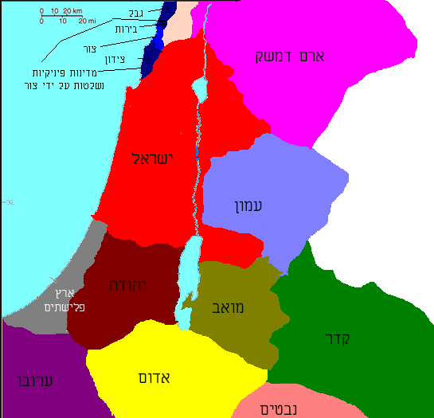
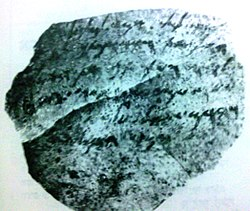
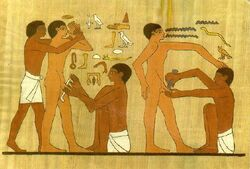

**<u>פרשת דברים – קרובינו ממזרח</u>**

**דברים פרק ב'**

(א) וַנֵּפֶן וַנִּסַּע הַמִּדְבָּרָה דֶּרֶךְ יַם סוּף כַּאֲשֶׁר דִּבֶּר יהוה אֵלָי וַנָּסָב
אֶת הַר שֵׂעִיר יָמִים רַבִּים:

(ב) וַיֹּאמֶר יהוה אֵלַי לֵאמֹר:

(ג) רַב לָכֶם סֹב אֶת הָהָר הַזֶּה פְּנוּ לָכֶם צָפֹנָה:

(ד) וְאֶת הָעָם צַו לֵאמֹר אַתֶּם עֹבְרִים <u>בִּגְבוּל אֲחֵיכֶם בְּנֵי עֵשָׂו
הַיֹּשְׁבִים בְּשֵׂעִיר</u> וְיִירְאוּ מִכֶּם וְנִשְׁמַרְתֶּם מְאֹד:

(ה) אַל תִּתְגָּרוּ בָם כִּי לֹא אֶתֵּן לָכֶם מֵאַרְצָם עַד מִדְרַךְ כַּף רָגֶל <u>כִּי
יְרֻשָּׁה לְעֵשָׂו נָתַתִּי אֶת הַר שֵׂעִיר:</u>

(ו) אֹכֶל תִּשְׁבְּרוּ מֵאִתָּם בַּכֶּסֶף וַאֲכַלְתֶּם וְגַם מַיִם תִּכְרוּ מֵאִתָּם בַּכֶּסֶף
וּשְׁתִיתֶם:

(ז) כִּי יהוה אֱלֹהֶיךָ בֵּרַכְךָ בְּכֹל מַעֲשֵׂה יָדֶךָ יָדַע לֶכְתְּךָ אֶת הַמִּדְבָּר
הַגָּדֹל הַזֶּה זֶה אַרְבָּעִים שָׁנָה יהוה אֱלֹהֶיךָ עִמָּךְ לֹא חָסַרְתָּ דָּבָר:

(ח) וַנַּעֲבֹר מֵאֵת <u>אַחֵינוּ בְנֵי עֵשָׂו</u> הַיּשְׁבִים בְּשֵׂעִיר מִדֶּרֶךְ
הָעֲרָבָה מֵאֵילַת וּמֵעֶצְיֹן גָּבֶר וַנֵּפֶן וַנַּעֲבֹר דֶּרֶךְ מִדְבַּר מוֹאָב:

(ט) וַיֹּאמֶר יהוה אֵלַי אַל תָּצַר אֶת מוֹאָב וְאַל תִּתְגָּר בָּם מִלְחָמָה כִּי
לֹא אֶתֵּן לְךָ מֵאַרְצוֹ <u>יְרֻשָּׁה כִּי לִבְנֵי לוֹט נָתַתִּי אֶת עָר</u> יְרֻשָּׁה:

.......

(יז) וַיְדַבֵּר יהוה אֵלַי לֵאמֹר:

(יח) אַתָּה עֹבֵר הַיּוֹם אֶת גְּבוּל מוֹאָב אֶת עָר:

(יט) וְקָרַבְתָּ מוּל בְּנֵי עַמּוֹן אַל תְּצֻרֵם וְאַל תִּתְגָּר בָּם כִּי לֹא אֶתֵּן
מֵאֶרֶץ בְּנֵי עַמּוֹן לְךָ <u>יְרֻשָּׁה כִּי לִבְנֵי לוֹט נְתַתִּיהָ יְרֻשָּׁה</u>:

**ואחר כך, מתחילות המלחמות. תחילה מול סיחון מלך האמורי,
ועוג מלך הבשן בצד המזרחי של הירדן, ואחר כך נגד 'עמי כנען' בצד המערבי של
הירדן. במה זכו אדום, מואב ועמון?**

**דברים פרק ב', "משוחח" היטב עם סיפורי ספר
בראשית.**

**איך נוצרים עמים....**

**בראשית י"ט**

(ל) וַיַּעַל לוֹט מִצּוֹעַר וַיֵּשֶׁב בָּהָר וּשְׁתֵּי בְנֹתָיו עִמּוֹ כִּי יָרֵא לָשֶׁבֶת
בְּצוֹעַר וַיֵּשֶׁב בַּמְּעָרָה הוּא וּשְׁתֵּי בְנֹתָיו:

(לא) וַתֹּאמֶר הַבְּכִירָה אֶל הַצְּעִירָה אָבִינוּ זָקֵן וְאִישׁ אֵין בָּאָרֶץ לָבוֹא
עָלֵינוּ כְּדֶרֶךְ כָּל הָאָרֶץ:

(לב) לְכָה נַשְׁקֶה אֶת אָבִינוּ יַיִן וְנִשְׁכְּבָה עִמּוֹ וּנְחַיֶּה מֵאָבִינוּ
זָרַע:

(לג) וַתַּשְׁקֶיןָ אֶת אֲבִיהֶן יַיִן בַּלַּיְלָה הוּא וַתָּבֹא הַבְּכִירָה וַתִּשְׁכַּב אֶת
אָבִיהָ וְלֹא יָדַע בְּשִׁכְבָהּ וּבְקוּמָהּ:

(לד) וַיְהִי מִמָּחֳרָת וַתֹּאמֶר הַבְּכִירָה אֶל הַצְּעִירָה הֵן שָׁכַבְתִּי אֶמֶשׁ אֶת
אָבִי נַשְׁקֶנּוּ יַיִן גַּם הַלַּיְלָה וּבֹאִי שִׁכְבִי עִמּוֹ וּנְחַיֶּה מֵאָבִינוּ זָרַע:

(לה) וַתַּשְׁקֶיןָ גַּם בַּלַּיְלָה הַהוּא אֶת אֲבִיהֶן יָיִן וַתָּקָם הַצְּעִירָה וַתִּשְׁכַּב
עִמּוֹ וְלֹא יָדַע בְּשִׁכְבָהּ וּבְקֻמָהּ:

(לו) וַתַּהֲרֶיןָ שְׁתֵּי בְנוֹת לוֹט מֵאֲבִיהֶן:

(לז) וַתֵּלֶד הַבְּכִירָה בֵּן <u>וַתִּקְרָא שְׁמוֹ מוֹאָב הוּא אֲבִי מוֹאָב עַד
הַיּוֹם:</u>

(לח) וְהַצְּעִירָה גַם הִוא יָלְדָה בֵּן <u>וַתִּקְרָא שְׁמוֹ בֶּן עַמִּי הוּא אֲבִי
בְנֵי עַמּוֹן עַד הַיּוֹם</u>:

**וצריך לזכור מיהו לוט:**

**בראשית פרק י"א**

(כז) וְאֵלֶּה תּוֹלְדֹת תֶּרַח תֶּרַח הוֹלִיד אֶת אַבְרָם אֶת נָחוֹר וְאֶת הָרָן
וְהָרָן הוֹלִיד אֶת לוֹט:

**בראשית פרק י"ב**

(ד) וַיֵּלֶךְ אַבְרָם כַּאֲשֶׁר דִּבֶּר אֵלָיו יהוה וַיֵּלֶךְ אִתּוֹ לוֹט וְאַבְרָם בֶּן
חָמֵשׁ שָׁנִים וְשִׁבְעִים שָׁנָה בְּצֵאתוֹ מֵחָרָן:

**לוט הוא בן אחיו של אברהם, אבל גם בנו המאומץ או אחיו
המאומץ, והוא נודד איתו לארץ.**

**ועשיו (אדום) הוא אחינו בכלל...**

**בראשית כ"ה**

(ל) וַיֹּאמֶר עֵשָׂו אֶל יַעֲקֹב הַלְעִיטֵנִי נָא מִן הָאָדֹם הָאָדֹם הַזֶּה כִּי עָיֵף
אָנֹכִי עַל כֵּן קָרָא שְׁמוֹ אֱדוֹם:

**בראשית ל"ב**

(ד) וַיִּשְׁלַח יַעֲקֹב מַלְאָכִים לְפָנָיו אֶל עֵשָׂו אָחִיו <u>אַרְצָה שֵׂעִיר שְׂדֵה
אֱדוֹם</u>:

(ה) וַיְצַו אֹתָם לֵאמֹר כֹּה תֹאמְרוּן לַאדֹנִי לְעֵשָׂו כֹּה אָמַר עַבְדְּךָ יַעֲקֹב
עִם לָבָן גַּרְתִּי וָאֵחַר עַד עָתָּה:

**בראשית ל"ו**

(ח) וַיֵּשֶׁב עֵשָׂו בְּהַר שֵׂעִיר עֵשָׂו הוּא אֱדוֹם:

(ט) וְאֵלֶּה תֹּלְדוֹת עֵשָׂו אֲבִי אֱדוֹם בְּהַר שֵׂעִיר:

(י) אֵלֶּה שְׁמוֹת בְּנֵי עֵשָׂו אֱלִיפַז בֶּן עָדָה אֵשֶׁת עֵשָׂו רְעוּאֵל בֶּן בָּשְׂמַת
אֵשֶׁת עֵשָׂו:

(יא) וַיִּהְיוּ בְּנֵי אֱלִיפָז תֵּימָן אוֹמָר צְפוֹ וְגַעְתָּם וּקְנַז:

(יב) וְתִמְנַע הָיְתָה פִילֶגֶשׁ לֶאֱלִיפַז בֶּן עֵשָׂו וַתֵּלֶד לֶאֱלִיפַז אֶת עֲמָלֵק
אֵלֶּה בְּנֵי עָדָה אֵשֶׁת עֵשָׂו:

.....

(לא) וְאֵלֶּה הַמְּלָכִים אֲשֶׁר מָלְכוּ בְּאֶרֶץ אֱדוֹם לִפְנֵי מְלָךְ מֶלֶךְ לִבְנֵי
יִשְׂרָאֵל:

(לב) וַיִּמְלֹךְ בֶּאֱדוֹם בֶּלַע בֶּן בְּעוֹר וְשֵׁם עִירוֹ דִּנְהָבָה:

(לג) וַיָּמָת בָּלַע וַיִּמְלֹךְ תַּחְתָּיו יוֹבָב בֶּן זֶרַח מִבָּצְרָה:

(לד) וַיָּמָת יוֹבָב וַיִּמְלֹךְ תַּחְתָּיו חֻשָׁם מֵאֶרֶץ הַתֵּימָנִי:

(לה) וַיָּמָת חֻשָׁם וַיִּמְלֹךְ תַּחְתָּיו הֲדַד בֶּן בְּדַד הַמַּכֶּה אֶת מִדְיָן בִּשְׂדֵה
מוֹאָב וְשֵׁם עִירוֹ עֲוִית:

(לו) וַיָּמָת הֲדָד וַיִּמְלֹךְ תַּחְתָּיו שַׂמְלָה מִמַּשְׂרֵקָה:

(לז) וַיָּמָת שַׂמְלָה וַיִּמְלֹךְ תַּחְתָּיו שָׁאוּל מֵרְחֹבוֹת הַנָּהָר:

(לח) וַיָּמָת שָׁאוּל וַיִּמְלֹךְ תַּחְתָּיו בַּעַל חָנָן בֶּן עַכְבּוֹר:

(לט) וַיָּמָת בַּעַל חָנָן בֶּן עַכְבּוֹר וַיִּמְלֹךְ תַּחְתָּיו הֲדַר וְשֵׁם עִירוֹ פָּעוּ
וְשֵׁם אִשְׁתּוֹ מְהֵיטַבְאֵל בַּת מַטְרֵד בַּת מֵי זָהָב:

(מ) וְאֵלֶּה שְׁמוֹת אַלּוּפֵי עֵשָׂו לְמִשְׁפְּחֹתָם לִמְקֹמֹתָם בִּשְׁמֹתָם אַלּוּף תִּמְנָע
אַלּוּף עַלְוָה אַלּוּף יְתֵת:..............

**לא כל כך חשובים לנו פרטי ההיסטוריה המקראית של אדום
(הקבלה הספרדית עושה מטעמים מאינפורמציה שאין לה הקשר, כביכול, לתולדות עם
ישראל, ומשייכת דברים אלה למבנה האלוהות). אבל, צריך לשים לב שהעורך,
בהכניסו פרטים כאלה, רואה באדום כמעט חלק מישראל, ואמנם גם השמות עבריים
ממש. בספרות המקראית יש יסודות מיהודה, ומישראל, והנה גם מאדום.**

**כמובן, היחסים עם אדום נעים בין אח, לנכבש, לשונא,
למתעלל...**

**מלכים א' פרק י"א**

(יד) וַיָּקֶם יהוה שָׂטָן לִשְׁלֹמֹה אֵת הֲדַד הָאֲדֹמִי מִזֶּרַע הַמֶּלֶךְ הוּא
בֶּאֱדוֹם:

(טו) וַיְהִי בִּהְיוֹת דָּוִד אֶת אֱדוֹם בַּעֲלוֹת יוֹאָב שַׂר הַצָּבָא לְקַבֵּר אֶת
הַחֲלָלִים וַיַּךְ כָּל זָכָר בֶּאֱדוֹם:

(טז) כִּי שֵׁשֶׁת חֳדָשִׁים יָשַׁב שָׁם יוֹאָב וְכָל יִשְׂרָאֵל עַד הִכְרִית כָּל זָכָר
בֶּאֱדוֹם:

(יז) וַיִּבְרַח אֲדַד הוּא וַאֲנָשִׁים אֲדֹמִיִּים מֵעַבְדֵי אָבִיו אִתּוֹ לָבוֹא
מִצְרָיִם וַהֲדַד נַעַר קָטָן:

....

(כא) וַהֲדַד שָׁמַע בְּמִצְרַיִם כִּי שָׁכַב דָּוִד עִם אֲבֹתָיו וְכִי מֵת יוֹאָב שַׂר
הַצָּבָא וַיֹּאמֶר הֲדַד אֶל פַּרְעֹה שַׁלְּחֵנִי וְאֵלֵךְ אֶל אַרְצִי:

......

(כו) וְיָרָבְעָם בֶּן נְבָט אֶפְרָתִי מִן הַצְּרֵדָה וְשֵׁם אִמּוֹ צְרוּעָה אִשָּׁה
אַלְמָנָה עֶבֶד לִשְׁלֹמֹה וַיָּרֶם יָד בַּמֶּלֶךְ:

(כז) וְזֶה הַדָּבָר אֲשֶׁר הֵרִים יָד בַּמֶּלֶךְ שְׁלֹמֹה בָּנָה אֶת הַמִּלּוֹא סָגַר אֶת
פֶּרֶץ עִיר דָּוִד אָבִיו:

**מעניין, ממלכת שלמה מתפוררת על ידי אדום ועל ידי ישראל
(הממלכה הצפונית) במקביל... ולא חשוב כלל, אם ממלכת שלמה הייתה קיימת או
לא, חשוב שהעמים שמדובר בהם "רוקדים" זה מול זה.**

**מלכים ב' פרק ג'**

(ז) וַיֵּלֶךְ וַיִּשְׁלַח אֶל יְהוֹשָׁפָט מֶלֶךְ יְהוּדָה לֵאמֹר מֶלֶךְ מוֹאָב פָּשַׁע בִּי
הֲתֵלֵךְ אִתִּי אֶל מוֹאָב לַמִּלְחָמָה וַיֹּאמֶר אֶעֱלֶה כָּמוֹנִי כָמוֹךָ כְּעַמִּי כְעַמֶּךָ כְּסוּסַי
כְּסוּסֶיךָ:

(ח) וַיֹּאמֶר אֵי זֶה הַדֶּרֶךְ נַעֲלֶה וַיֹּאמֶר דֶּרֶךְ מִדְבַּר אֱדוֹם:

(ט) וַיֵּלֶךְ מֶלֶךְ יִשְׂרָאֵל וּמֶלֶךְ יְהוּדָה <u>וּמֶלֶךְ אֱדוֹם</u> וַיָּסֹבּוּ דֶּרֶךְ
שִׁבְעַת יָמִים וְלֹא הָיָה מַיִם לַמַּחֲנֶה וְלַבְּהֵמָה אֲשֶׁר בְּרַגְלֵיהֶם:

(י) וַיֹּאמֶר מֶלֶךְ יִשְׂרָאֵל אֲהָהּ כִּי קָרָא יהוה לִשְׁלֹשֶׁת הַמְּלָכִים הָאֵלֶּה
לָתֵת אוֹתָם בְּיַד מוֹאָב:

**יהודה, ישראל ואדום נלחמים כתף אל כתף במואב. שוב, אחים
ואויבים....**

**דברים כ"ג**

(ח) לֹא תְתַעֵב אֲדֹמִי כִּי אָחִיךָ הוּא לֹא תְתַעֵב מִצְרִי כִּי גֵר הָיִיתָ
בְאַרְצוֹ:

(ט) בָּנִים אֲשֶׁר יִוָּלְדוּ לָהֶם דּוֹר שְׁלִישִׁי יָבֹא לָהֶם בִּקְהַל
יהוה:

**אבל, משום מה, כנראה בתקופה מסוימת שנאה למואב
ועמון:**

**דברים כ"ג**

(ד) לֹא יָבֹא עַמּוֹנִי וּמוֹאָבִי בִּקְהַל יהוה גַּם דּוֹר עֲשִׂירִי לֹא יָבֹא
לָהֶם בִּקְהַל יהוה עַד עוֹלָם:

**נראה שנישואי תערובת עם עמים אלה היו גם היו.**

**עמוס פרק א – האח הבוגד...**

(יא) כֹּה אָמַר יהוה עַל שְׁלשָׁה פִּשְׁעֵי אֱדוֹם וְעַל אַרְבָּעָה לֹא אֲשִׁיבֶנּוּ
<u>עַל רָדְפוֹ בַחֶרֶב אָחִיו וְשִׁחֵת רַחֲמָיו</u> וַיִּטְרֹף לָעַד אַפּוֹ וְעֶבְרָתוֹ שְׁמָרָה
נֶצַח:

(יב) וְשִׁלַּחְתִּי אֵשׁ בְּתֵימָן וְאָכְלָה אַרְמְנוֹת בָּצְרָה:

**עמוס לא קרא על מעשיו הנוראים של יואב בן צרויה
באדום....**

**אבל אותו עמוס, מספר פסוקים אחר כך, בפרק ב':**

(א) כֹּה אָמַר יהוה עַל שְׁלשָׁה פִּשְׁעֵי מוֹאָב וְעַל אַרְבָּעָה לֹא אֲשִׁיבֶנּוּ עַל
שָׂרְפוֹ <u>עַצְמוֹת מֶלֶךְ אֱדוֹם</u> לַשִּׂיד:

(ב) וְשִׁלַּחְתִּי אֵשׁ בְּמוֹאָב וְאָכְלָה אַרְמְנוֹת הַקְּרִיּוֹת וּמֵת בְּשָׁאוֹן מוֹאָב
בִּתְרוּעָה בְּקוֹל שׁוֹפָר:

**אח זה אח... (מואב האומה היחידה שעמוס מזכיר, שחטאה לא
כנגד ישראל!)**

**ולהיכן בורחים מיהודה בעת צרה?**

**שמואל א כ"ב**

(ג) וַיֵּלֶךְ דָּוִד מִשָּׁם <u>מִצְפֵּה מוֹאָב וַיֹּאמֶר אֶל מֶלֶךְ מוֹאָב יֵצֵא נָא
אָבִי וְאִמִּי אִתְּכֶם</u> עַד אֲשֶׁר אֵדַע מַה יַּעֲשֶׂה לִּי אֱלֹהִים:

(ד) וַיַּנְחֵם אֶת פְּנֵי מֶלֶךְ מוֹאָב וַיֵּשְׁבוּ עִמּוֹ כָּל יְמֵי הֱיוֹת דָּוִד
בַּמְּצוּדָה:

**רות פרק א'**

(א) וַיְהִי בִּיְמֵי שְׁפֹט הַשֹּׁפְטִים וַיְהִי רָעָב בָּאָרֶץ וַיֵּלֶךְ אִישׁ מִבֵּית לֶחֶם
יְהוּדָה לָגוּר <u>בִּשְׂדֵי מוֹאָב</u> הוּא וְאִשְׁתּוֹ וּשְׁנֵי בָנָיו:

**ירמיהו מ'**

(יא) וְגַם כָּל הַיְּהוּדִים אֲשֶׁר <u>בְּמוֹאָב וּבִבְנֵי עַמּוֹן וּבֶאֱדוֹם</u>
וַאֲשֶׁר בְּכָל הָאֲרָצוֹת שָׁמְעוּ כִּי נָתַן מֶלֶךְ בָּבֶל שְׁאֵרִית לִיהוּדָה וְכִי הִפְקִיד עֲלֵיהֶם אֶת
גְּדַלְיָהוּ בֶּן אֲחִיקָם בֶּן שָׁפָן:

**ואפילו "אחרית הימים" של שכנינו ממזרח דומה לשלנו, על פי
הנביא ירמיהו:**

**ירמיהו מ"ח פרק על מואב**

(יג) <u>וּבֹשׁ מוֹאָב מִכְּמֹושׁ כַּאֲשֶׁר בֹּשׁוּ בֵּית יִשְׂרָאֵל מִבֵּית אֵל</u>
מִבְטֶחָם:

**...(יש לשים לב, שירמיהו מייצג את <u>יהודה</u> בעלת הדת
של תקופת יאשיהו, השונה מזו של <u>ישראל</u> בעלת העגלים בבית אל ובדן,
שנחרבת בתקופת חזקיהו, "ומטוהרת" בתקופת יאשיהו)**

(מו) אוֹי לְךָ מוֹאָב אָבַד עַם כְּמֹושׁ כִּי לֻקְּחוּ בָנֶיךָ בַּשֶּׁבִי וּבְנֹתֶיךָ
בַּשִּׁבְיָה:

(מז) וְשַׁבְתִּי שְׁבוּת מוֹאָב בְּאַחֲרִית הַיָּמִים נְאֻם יהוה עַד הֵנָּה מִשְׁפַּט
מוֹאָב:

**(נבואת חורבן ונחמה, ממש כמו ליהודה).**

**ירמיהו מ"ט, פרק על עמון ועמים שכנים אחרים**

(ד) מַה תִּתְהַלְלִי בָּעֲמָקִים זָב עִמְקֵךְ הַבַּת הַשֹּׁובֵבָה הַבֹּטְחָה בְּאֹצְרֹתֶיהָ מִי
יָבֹוא אֵלָי:

(ה) הִנְנִי מֵבִיא עָלַיִךְ פַּחַד נְאֻם אֲדֹנָי יהוה צְבָאֹות מִכָּל סְבִיבָיִךְ
וְנִדַּחְתֶּם אִישׁ לְפָנָיו וְאֵין מְקַבֵּץ לַנֹּדֵד:

(ו) <u>וְאַחֲרֵי כֵן אָשִׁיב אֶת שְׁבוּת בְּנֵי עַמֹּון</u> נְאֻם
יהוה:

**יאשיהו מייצר את הייחוד והקנאות של יהודה כנגד פולחני
העמים השכנים:**

**מלכים ב' כ"ג**

(יג) וְאֶת הַבָּמוֹת אֲשֶׁר עַל פְּנֵי יְרוּשָׁלַם אֲשֶׁר מִימִין לְהַר הַמַּשְׁחִית
אֲשֶׁר בָּנָה שְׁלֹמֹה מֶלֶךְ יִשְׂרָאֵל <u>לְעַשְׁתֹּרֶת שִׁקֻּץ צִידֹנִים וְלִכְמוֹשׁ שִׁקֻּץ מוֹאָב וּלְמִלְכֹּם תּוֹעֲבַת
בְּנֵי עַמּוֹן</u> טִמֵּא הַמֶּלֶךְ:

(יד) וְשִׁבַּר אֶת הַמַּצֵּבוֹת וַיִּכְרֹת אֶת הָאֲשֵׁרִים וַיְמַלֵּא אֶת מְקוֹמָם עַצְמוֹת
אָדָם:

(טו) <u>וְגַם אֶת הַמִּזְבֵּחַ אֲשֶׁר בְּבֵית אֵל הַבָּמָה אֲשֶׁר עָשָׂה יָרָבְעָם בֶּן
נְבָט אֲשֶׁר הֶחֱטִיא אֶת יִשְׂרָאֵל</u> גַּם אֶת הַמִּזְבֵּחַ הַהוּא וְאֶת הַבָּמָה נָתָץ וַיִּשְׂרֹף אֶת הַבָּמָה
הֵדַק לְעָפָר וְשָׂרַף אֲשֵׁרָה:

**בשוּרה אחת: צידון (כנענים), מואב, עמון, ישראל. רק יהודה
"צדיקים".**

**ונישואי תערובת?**

**כולנו מכירים את רות המואביה, סבתא רבתא של דוד מלך
ישראל.**

**זה לא הכל:**

**מלכים א י"ד**

(כא) וּרְחַבְעָם בֶּן שְׁלֹמֹה מָלַךְ בִּיהוּדָה בֶּן אַרְבָּעִים וְאַחַת שָׁנָה רְחַבְעָם
בְּמָלְכוֹ וּשְׁבַע עֶשְׂרֵה שָׁנָה מָלַךְ בִּירוּשָׁלַם הָעִיר אֲשֶׁר בָּחַר יהוה לָשׂוּם אֶת שְׁמוֹ שָׁם מִכֹּל
שִׁבְטֵי יִשְׂרָאֵל **וְשֵׁם אִמּוֹ נַעֲמָה הָעַמֹּנִית**:

**נחמיה פרק י"ג**

(כג) גַּם בַּיָּמִים הָהֵם רָאִיתִי אֶת הַיְּהוּדִים הֹשִׁיבוּ נָשִׁים אַשְׁדֳּודִיּוֹת
עַמֳּונִיּוֹת מוֹאֲבִיּוֹת:

(כד) וּבְנֵיהֶם חֲצִי מְדַבֵּר אַשְׁדּוֹדִית וְאֵינָם מַכִּירִים לְדַבֵּר יְהוּדִית
וְכִלְשׁוֹן עַם וָעָם:

**נחמיה ובעיקר עזרא הקנאי מנסים להתמודד עם התופעה, אך
ההצלחה, כנראה, לא גדולה יותר מאשר בימינו.**

**מענין גם הפסוק הבא בספר נחמיה:**

**נחמיה ב'**

(יט) וַיִּשְׁמַע סַנְבַלַּט הַחֹרֹנִי <u>וְטֹבִיָּה הָעֶבֶד הָעַמּוֹנִי</u> וְגֶשֶׁם
הָעַרְבִי וַיַּלְעִגוּ לָנוּ וַיִּבְזוּ עָלֵינוּ וַיֹּאמְרוּ מָה הַדָּבָר הַזֶּה אֲשֶׁר אַתֶּם עֹשִׂים הַעַל הַמֶּלֶךְ
אַתֶּם מֹרְדִים:

**טוביה "העבד העמוני" בין המתנכלים לשבי ציון. אבל ברור
שטוביה הוא שם של אדם העובד את יהוה, על פי הסיומת יה... מה קורה לעמונים
בינתיים? האם הם מנסים להשתלב דווקא ביהודה?**

**מי לבטח השתלב ביהודה?**

**קודם כל שארית ישראל לאחר חורבן שומרון על ידי האשורים.
על כך יש עדויות בספר מלכים, ועדויות עקיפות מהעובדה שספר מלכים מכיל
סיפורים שללא ספק חוברו בתרבות "הישראלית" ולא בתרבות "היהודאית" (כמו למשל
מחזור סיפורי יוסף).**

**אחר כך, האדומים (שראינו שגם להם יש שרידי היסטוריה, או
נרטיב, בתנ"ך). האדומים נדחקים מארצם על ידי הנבטים, ומתרכזים בצד המערבי
של הערבה ואחר כך עולים צפונה (מעלה אדומים, מישור אדומים...). לפי יוסף בן
מתתיהו, יוחנן הורקנוס כובש אותם ומכריח אותם להימול ולהתייהד. לפי גיאוגרף
יווני מהמאה הראשונה לפנה"ס, סטראבון:**

"האדומים הם נבטים **(?)** שגלו מארצם בגלל מרד ונתחברו אל
היהודים והשתתפו עמהם באותם החוקים עצמם." **כלומר,
מרצונם**.

**וספק מי מדייק יותר.**

**אבל ברור, שהורדוס היה אדומי, שהאדומים השתתפו במרד נגד
הרומאים, כיהודים (אבל עדיין מאופיינים) ואחר כך הם כבר יהודים לכל
דבר.**

**בסוף המאה הראשונה לספירה, אחרי חורבן הבית השני, עם
ישראל הוא כבר תערובת אתנית של יהודה, ישראל, אדום, עמון ומואב.**

**האם הקירבה בין עמים אלה אפשרה התבוללות זו?**

**היסוד הברור ביותר המאפיין קירבה בין תרבויות, הוא
השפה.**

**הפילולוגים מאפיינים את השפות העתיקות, לפי משפחות
קירבה.**

**הינה קטע מתוך "סולם השפות" השמי. מתוך האתר:**

[https://he.wikipedia.org/wiki/%D7%A9%D7%A4%D7%95%D7%AA\_%D7%A9%D7%9E%D7%99%D7%95%D7%AA\#מיון_השפות_והעמים_השמיים](https://he.wikipedia.org/wiki/%D7%A9%D7%A4%D7%95%D7%AA_%D7%A9%D7%9E%D7%99%D7%95%D7%AA#מיון_השפות_והעמים_השמיים)

[שמיות צפוניות
מערביות](https://he.wikipedia.org/w/index.php?title=%D7%A9%D7%A4%D7%95%D7%AA_%D7%A9%D7%9E%D7%99%D7%95%D7%AA_%D7%A6%D7%A4%D7%95%D7%A0%D7%99%D7%95%D7%AA_%D7%9E%D7%A2%D7%A8%D7%91%D7%99%D7%95%D7%AA&action=edit&redlink=1) [לבנטיניות](https://he.wikipedia.org/wiki/%D7%9C%D7%91%D7%A0%D7%98)

- **[אמורית](https://he.wikipedia.org/wiki/%D7%90%D7%9E%D7%95%D7%A8%D7%99%D7%AA) -
  ככל הנראה קבוצת שפות שמשתקפות ב[ממצאים מתקופת
  הברונזה](https://he.wikipedia.org/w/index.php?title=%D7%90%D7%9C%D7%A4%D7%91%D7%99%D7%AA%D7%99%D7%9D_%D7%91%D7%AA%D7%A7%D7%95%D7%A4%D7%AA_%D7%94%D7%91%D7%A8%D7%95%D7%A0%D7%96%D7%94_%D7%94%D7%AA%D7%99%D7%9B%D7%95%D7%A0%D7%94&action=edit&redlink=1),
  ייחוסן** לא ודאי \*

- [אוגריתית](https://he.wikipedia.org/wiki/%D7%90%D7%95%D7%92%D7%A8%D7%99%D7%AA%D7%99%D7%AA) (ייחוסה
  שנוי במחלוקת \*

- [כנענית](https://he.wikipedia.org/wiki/%D7%A9%D7%A4%D7%95%D7%AA_%D7%9B%D7%A0%D7%A2%D7%A0%D7%99%D7%95%D7%AA)

  - ממצאים כתובים מאל-עמארנה

  - [עברית](https://he.wikipedia.org/wiki/%D7%A2%D7%91%D7%A8%D7%99%D7%AA)

    - [עברית
      ארכאית](https://he.wikipedia.org/w/index.php?title=%D7%A2%D7%91%D7%A8%D7%99%D7%AA_%D7%90%D7%A8%D7%9B%D7%90%D7%99%D7%AA&action=edit&redlink=1) (שירה
      מקראית קדומה

    - [עברית
      מקראית](https://he.wikipedia.org/wiki/%D7%A2%D7%91%D7%A8%D7%99%D7%AA_%D7%9E%D7%A7%D7%A8%D7%90%D7%99%D7%AA) קלאסית
      על ניביה
      [יהודאית](https://he.wikipedia.org/wiki/%D7%9E%D7%9E%D7%9C%D7%9B%D7%AA_%D7%99%D7%94%D7%95%D7%93%D7%94) ו[ישראלית](https://he.wikipedia.org/wiki/%D7%9E%D7%9E%D7%9C%D7%9B%D7%AA_%D7%99%D7%A9%D7%A8%D7%90%D7%9C)

    - עברית מקראית מאוחרת -
      ניב [בית
      שני](https://he.wikipedia.org/wiki/%D7%94%D7%A2%D7%91%D7%A8%D7%99%D7%AA_%D7%91%D7%AA%D7%A7%D7%95%D7%A4%D7%AA_%D7%91%D7%99%D7%AA_%D7%A9%D7%A0%D7%99) וניב [העברית
      המשנאית](https://he.wikipedia.org/wiki/%D7%9C%D7%A9%D7%95%D7%9F_%D7%97%D7%96%22%D7%9C)

    - [עברית בימי
      הביניים](https://he.wikipedia.org/wiki/%D7%AA%D7%A7%D7%95%D7%A4%D7%AA_%D7%94%D7%91%D7%99%D7%A0%D7%99%D7%99%D7%9D_%D7%A9%D7%9C_%D7%94%D7%A2%D7%91%D7%A8%D7%99%D7%AA) שפה
      כתובה וליטורגית, לא [שפת
      אם](https://he.wikipedia.org/wiki/%D7%A9%D7%A4%D7%AA_%D7%90%D7%9D)

    - [עברית ישראלית
      מודרנית](https://he.wikipedia.org/wiki/%D7%A2%D7%91%D7%A8%D7%99%D7%AA_%D7%99%D7%A9%D7%A8%D7%90%D7%9C%D7%99%D7%AA) (ייחוסה
      שנוי במחלוקת

  - [פיניקית](https://he.wikipedia.org/wiki/%D7%A4%D7%99%D7%A0%D7%99%D7%A7%D7%99%D7%AA) \*

    - גבלית (Byblian) \*

    - פיניקית סטנדרטית \*

      - פיניקית חוֹפִית (לאורך
        חופי [פיניקיה](https://he.wikipedia.org/wiki/%D7%A4%D7%99%D7%A0%D7%99%D7%A7%D7%99%D7%9D) ו[סוריה](https://he.wikipedia.org/wiki/%D7%A1%D7%95%D7%A8%D7%99%D7%94)
        \*

      - פיניקית ים תיכונית (בקולוניות\*

      - [פּוּנית](https://he.wikipedia.org/w/index.php?title=%D7%A4%D7%95%D7%A0%D7%99%D7%AA&action=edit&redlink=1) ([קרת
        חדשת](https://he.wikipedia.org/wiki/%D7%A7%D7%A8%D7%AA_%D7%97%D7%93%D7%A9%D7%AA)\*

      - פּוּנית חדשה \*

  - [עמונית](https://he.wikipedia.org/wiki/%D7%A2%D7%9E%D7%95%D7%A0%D7%99%D7%AA) \*

  - [מואבית](https://he.wikipedia.org/wiki/%D7%9E%D7%95%D7%90%D7%91%D7%99%D7%AA) \*

  - [אדומית](https://he.wikipedia.org/wiki/%D7%90%D7%93%D7%95%D7%9E%D7%99%D7%AA) \*

**\* מסמן שפות שנכחדו, שאין להן דוברים היום.**

"הניבים הכנעניים השונים כללו את
ה[מואבי,](https://he.wikipedia.org/wiki/%D7%9E%D7%95%D7%90%D7%91%D7%99%D7%AA) ה[אדומי,](https://he.wikipedia.org/wiki/%D7%90%D7%93%D7%95%D7%9E%D7%99%D7%AA) ה[עמוני,](https://he.wikipedia.org/wiki/%D7%A2%D7%9E%D7%95%D7%A0%D7%99%D7%AA) ה[פיניקי](https://he.wikipedia.org/wiki/%D7%A4%D7%99%D7%A0%D7%99%D7%A7%D7%99%D7%AA) וה[עברי](https://he.wikipedia.org/wiki/%D7%A2%D7%91%D7%A8%D7%99%D7%AA),
כאשר הניב הפיניקי היה למעשה
העיקרי." **(מתוך ויקיפדיה: "שפות
כנעניות")**.

**למרות שארץ ישראל נקראת "ארץ כנען", רואים בפיניקים את
מרכז התרבות הכנענית בתקופות שאנו עוסקים בהם (סוף ימי בית ראשון ובית
שני)**

**ישעיהו פרק כ"ג**

(ח) מִי יָעַץ זֹאת עַל צֹר הַמַּעֲטִירָה אֲשֶׁר סֹחֲרֶיה שָׂרִים כִּנְעָנֶיהָ נִכְבַּדֵּי
אָרֶץ:

**משלי ל"א**

(כד) סָדִין עָשְׂתָה וַתִּמְכֹּר וַחֲגוֹר נָתְנָה לַכְּנַעֲנִי:

**(כנעני מזוהה עם סוחר, והפיניקים הם עם
הסוחרים).**

**האיזור בתקופת בית ראשון (בערך... הרי שינויים היו כל
כמה שנים...)**

**נתחיל כבר להקטין אגו... יהודה הקטנה... ישראל הגדולה,
וגם אדום ועמון גדולות מיהודה, מואב בערך כמוה...**

**למזלנו נמצאו כמה תעודות, שמראות בבירור, שכל העמים האלה
דיברו ניבים של אותה שפה. את רוב המילים בשפות המואבית, העמונית והאדומית,
אנחנו יכולים להבין היום! הכתב הוא כתב דעץ או דומה לו, וגם הוא פיניקי
ביסודו.**

כתובת מישע מלך מואב, המאה התשיעית לפנה"ס

. אנך. משע. בן. כמש.. . מלך. מאב. הד

2\. יבני \| אבי. מלך. על. מאב. שלשן. שת. ואנך.
מלכ

3\. תי. אחר. אבי \| ואעש. הבמת. זאת. לכמש. בקרחה \|
במ\[ת. י\]

4\. שע. כי. השעני. מכל. המלכנ. וכי. הראני. בכל. שנאי \|
עמר

5\. י. מלך. ישראל. ויענו. את. מאב. ימן. רבן. כי. יאנף.
כמש. באר

6\. צה \| ויחלפה. בנה. ויאמר. גמ. הא. אענו. את. מאב \|
בימי. אמר. כ\[...\]

7\. וארא. בה. ובבתה \| וישראל. אבד. אבד. עלמ. וירש.
עמרי. את א\[ר\]

8\. צ. מהדבא \| וישב. בה. ימה. וחצי. ימי. בנה. ארבענ.
שת. ויש

9\. בה. כמש. בימי \| ואבן. את. בעלמען. ואעש. בה. האשוח.
ואבן

10\. את. קריתן \| ואש. גד. ישב. בארץ. עטרת. מעלם. ויבן.
לה. מלך. י

11\. שראל. את. עטרת \| ואלתחם. בקר. ואחזה \| ואהרג. את.
כל. העם.

12\. הקר. רית. לכמש. ולמאב \| ואשב. משמ. את. אראל. דודה.
ואס

כתובת עמונית ליד עמאן, בערך 800 לפנה"ס

לכם. בנה. לך. מבאת. סבבת\[

\]. ככל. מסבב. לך. מתימתן\[

\]כחד. אכחדם. וכל. מערב\[

\]ובכל. סדרת ילנן צדק\[

\]ל. תדלת. בדלת. בטן כרה\[

\]נה. תשתע. בבן. אלם.\[

\]וש\[\] \]ה. ונ\[

\].שלם. לך ושל\[ם

כתובת עמונית ליד עמאן משנת 600 בערך לפנה"ס

מעבד עמנדב מלך בנעמנ  
בן הצלאל מלך בנעמן  
בן עמנדב מלך בנעמן  
הכרם. וה.גנת. והאתחר  
ואשחת  
יגל וישמח  
ביומת רבם ושנת  
רחקת

כתובת אדומית, מבקעת ערד, המאה הששית לפנה"ס (בכתב
דעץ)

אָמַר לַמֶּלֶך, אֱמֹר לְבִלְבֵּל   
הֲשָלוֹם אַתָּ? וְהִבְרַכְתִּךָ   
לְקוֹס. וְעֲתָּ תַּן אֶת הָאֹכֶל   
אֲשֶר עִמָּד אֲחִאִמֹּה \[..   
וְהֵרִם עֲ\[דִ\]אֵל עַל מִזְ\[בַּח   
.. פֶּן יֶ\]חְמַר הָאֹכֶל 

**האם שכנינו היו נימולים?**

**הדברים אינם ברורים, ויש פסוקים בתנ"ך שיכולים לרמז על
כך אך ניתן להבינם כך או כך. למשל,**

**ירמיהו ט'**

(כד) הִנֵּה יָמִים בָּאִים נְאֻם יהוה וּפָקַדְתִּי עַל כָּל מוּל
בְּעָרְלָה:

(כה) עַל מִצְרַיִם וְעַל יְהוּדָה וְעַל אֱדוֹם וְעַל בְּנֵי עַמּוֹן וְעַל מוֹאָב
וְעַל כָּל קְצוּצֵי פֵאָה הַיּשְׁבִים בַּמִּדְבָּר כִּי כָל הַגּוֹיִם עֲרֵלִים וְכָל בֵּית יִשְׂרָאֵל עַרְלֵי
לֵב

יחזקאל פרק ל"ב

(כו) שָׁם מֶשֶׁךְ תֻּבַל וְכָל הֲמוֹנָהּ סְבִיבוֹתָיו קִבְרוֹתֶיהָ כֻּלָּם עֲרֵלִים
מְחֻלְלֵי חֶרֶב כִּי נָתְנוּ חִתִּיתָם בְּאֶרֶץ חַיִּים:

(כז) וְלֹא יִשְׁכְּבוּ אֶת גִּבּוֹרִים נֹפְלִים מֵעֲרֵלִים אֲשֶׁר יָרְדוּ שְׁאוֹל בִּכְלֵי
מִלְחַמְתָּם וַיִּתְּנוּ אֶת חַרְבוֹתָם תַּחַת רָאשֵׁיהֶם וַתְּהִי עֲוֹנֹתָם עַל עַצְמוֹתָם כִּי חִתִּית גִּבּוֹרִים
בְּאֶרֶץ חַיִּים:

(כח) וְאַתָּה בְּתוֹךְ עֲרֵלִים תִּשָּׁבַר וְתִשְׁכַּב אֶת חַלְלֵי חָרֶב:

(כט) שָׁמָּה אֱדוֹם מְלָכֶיהָ וְכָל נְשִׂיאֶיהָ אֲשֶׁר נִתְּנוּ בִגְבוּרָתָם אֶת חַלְלֵי
חָרֶב <u>הֵמָּה אֶת עֲרֵלִים יִשְׁכָּבוּ</u> וְאֶת יֹרְדֵי בוֹר:

**האם מנהג ברית המילה הוא מנהג יהודי?**

**  
**

# מתוך הויקיפדיה

# ברית מילה במצרים העתיקה.... הלכה למעשה....

# 

תיעוד של מילת מבוגרים במצרים העתיקה, ימי השושלת השישית,
2350-2000 לפנה"ס (אלף שנה לפני הופעת העם הישראלי בהיסטוריה)

המנהג למול היה קיים בקרב העמים השכנים עוד לפני תקופת
האבות, ובחינת מומיות מצריות העלתה שחלקן נימולו. הרודוטוס, היסטוריון
יווני בן המאה החמישית לפנה"ס, הזכיר את המנהג בכתביו,...  
**(ויש גירסה, שהכוהנים המצריים היו נימולים)**

**והנה הקטע מ"כתבי הרודוטוס", תרגום אלכסנדר שור, ירושלים
תרצ"ה. ספר ב' פסקה 104**

"... אבל בעיקר מזה, כי הקולכים והמצרים והכושים הם
היחידים המלים מימים קדמונים את ערותם. <u>הפניקים והסורים היושבים
בפלשתינה</u>, כפי שהם מודים למדו מהמצרים, והסורים היושבים על יד הנהר
תרמודון ופרתניוס, והמקרונים שכניהם אומרים, כי זה כבר למדו זאת מאת
הקולכים. הם לבדם בין כל בני-אדם מלים את בשרים וכנראה מחקים בזה את
המצרים. אשר למצרים ולכושים אינני יכול לאמר מי למד ממי.... "

**וצריך לשים לב שהרודוטוס חי בתקופת תחילת בית שני, לאחר
התפוררות האומות הקטנות של בית ראשון בעקבות כיבושי אשור, בבל
ופרס.**

**הוא מזכיר בתקופה זו את "הצורים" וה"סורים היושבים
בפלשתינה" כנראה כולל את היהודים ומי עוד? בכל אופן, יוסף בן מתתיהו, במאה
הראשונה לספירה מצטט אותו, ומוסיף בספרו "נגד אפיון":** "ומכל יושבי ארץ
פלשתים היהודים לבדם עושים זאת**". הוא מפרש כך את "הסורים היושבים
בפלשתינה".**

**לא ברור מי מעמי קדם שכנינו, היו נימולים. רמז לכך שלא
אנחנו לבד סבלנו זאת, הוא בכך, שבתנ"ך, הפלשתים (שמוצאם אירופי), מכונים
בשם "ערלים" ממש כשם נרדף ("**פן תשמחנה בנות פלשתים, פן תעלוזנה בנות
הערלים**" בקינת דוד). כלומר, אלו שלא מלו את בניהם היו היוצאי
דופן.**

**לסיכום:**

**צריך לעזוב את האגו של "העם הנבחר", שמטופח במסורת
היהודית מהתנ"ך והלאה.**

**יהודה היה אחד העמים השמיים המערביים הקרובים מאוד זה
לזה:**

**יהודה, ישראל, עמון, מואב, אדום.**

**עַם זה (אנחנו) שרד (והעיקר אולי, שפתו שרדה!) במזל גדול
את האשורים, במזל עוד יותר גדול את הבבלים (כי הגלות נמשכה רק עשרות שנים
ספורות), סיפח לתוכו חלקים מהישראלים שלא גלו לאשור (כבר בסוף ימי בית
ראשון) ואת רוב האדומים בימי בית שני. נישואי תערובת היו גם עם המואבים
(מעידה רות) ועם העמונים (מעיד רחבעם, ונחמיה). וכך נותרנו בשם "יהודים" או
"ישראל" לייצג את התערובת האתנית והתרבותית של חמשת העמים הללו (ואולי גם
עם מטען כנעני לא קטן ולא ברור, קדום יותר, ורמזים למטען
ארמי...).**

**וזה, כמובן, עוד לפני אלפיים שנות גלות, על כל ההתבוללות
ההדדית בהן.**

**כל זה לא רע בכלל, רק האובססיה הדתית של "מיהו יהודי"
מעוררת צחוק גדול, מלבד הצרות.**

**ואם נחזור לפרשתנו, יפה עשינו שחלפנו על פני אדום, מואב
ועמון, ולא התגרינו עמם מלחמה. חבל שלא הצלחנו בכך בדורות שלנו.**
