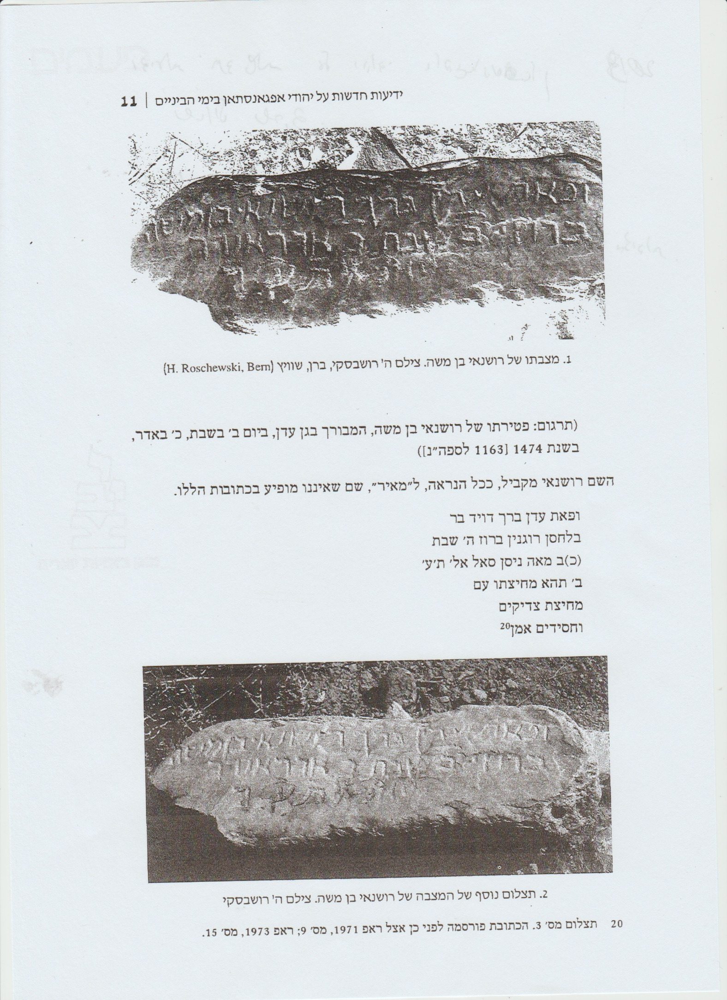
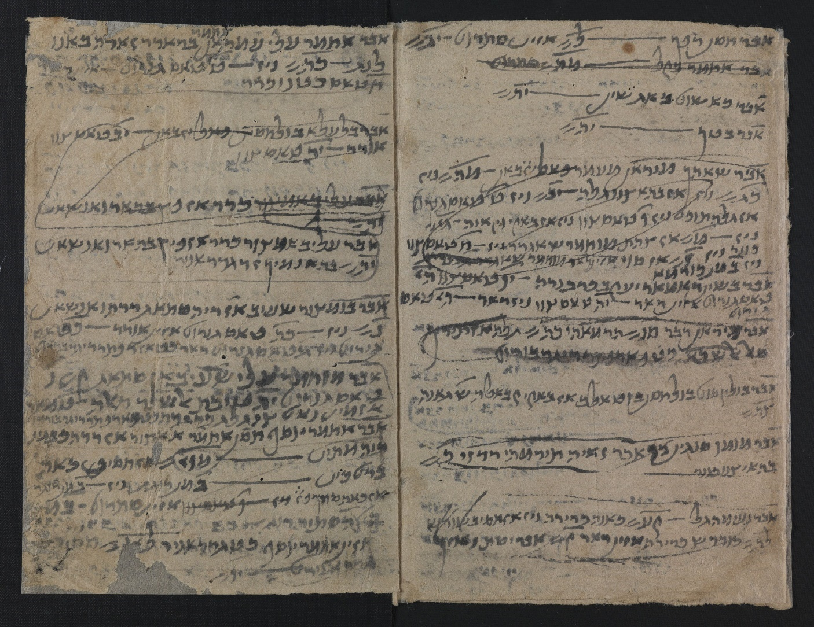

<u>תפוצות ישראל – יהודי אפגניסטן</u>

<u>היסטוריה של אפגניסטן (על רגל אחת...).</u>

בני אדם ישבו באיזור כבר לפני 50000 שנה, ואפילו קיימו
התיישבות חקלאית.

בתקופת האמפריה הפרסית הראשונה (האחמנית, המתחילה בכורש)
הייתה אפגניסטן חלק ממנה. כבר אז מופיעים השמות הידועים היום כשמות ערים :
קבול, הֶרָאט, בַּלְך, שנפגוש בהמשך.

אלכסנדר הגדול כובש את האזור, יחד עם כל הממלכה
הפרסית.

תקופה מסוימת הייתה ממלכה עצמאית באיזור, בשם
בקטריה.

ב 170 לפנה"ס האזור נכבש על ידי האימפריה הפרתית, ובמאה
השלישית לספירה עוברת השליטה באימפריה לידי השושלת הסאסאנית, עד הכיבוש
המוסלמי במאה השביעית.

תקופות קצרות השתלטו על אפגניסטן או על חלקה שבטים אחרים,
מצפון ואף ממערב סין.

מהכיבוש המוסלמי ועד 1750 בערך, אפגניסטן היא חלק ממחוז
ח'וראסאן. זה איזור המכיל את צפון מזרח אירן, צפון מערב אפגניסטן,
טורקמניסטן אוזבקיסטן וטג'יקיסטן, ובירתו חיווה, באוזבקיסטן. הערים הראט
ובלך, היו ערים מרכזיות באיזור זה.

הפלישה המונגולית בתחילת המאה ה-13 הביאה להרס של ערים
רבות באפגניסטן. רק השושלת המונגולית הטימורית ששלטה בין 1370 ל1507,
והתאסלמה, פיתחה את אפגניסטן מחדש. היורש שלה, באבור, גם הוא מונגולי, יצא
מאפגיניסטן והקים אימפריה ששלטה על הודו.

במשך מאתיים שנה, הייתה אפגניסטן מחולקת בין בוכארה,
הספאווים השיעים של פרס, והאימפריה המוגולית הסונית ששלטה בהודו.

בתחילת המאה ה-18 שבטים פשטונים מתמרדים ומצליחים להביס את
הצבא הפרסי, ואף כובשים את בירת פרס אז, אספהאן. הם השליטו שלטון טרור
ונהדפו משם לאחר כעשרים שנה.

בהמשך, הצליח אחמד דוראני לאחד שוב את השבטים הפשטונים,
ולכבוש את אפגניסטן, פקיסטן, ח'וראסאן ועד דלהי בהודו.

בתקופה זו נכנסים למשחק האימפריה הרוסית והאימפריה
הבריטית. צריך לזכור שהבריטים שולטים בהודו, כולל פקיסטן.

בסוף המאה ה-19 הרוסים והבריטים קובעים את הגבולות
המודרניים של אפגניסטן. רק ב 1919 הבריטים חותמים על הסכם שכולל הבטחה
לאפשר את עצמאות אפגניסטן. מועד החתימה נחשב ליום העצמאות של
אפגניסטן.

המאבק על מודרניזציה של אפגניסטן מתחיל כבר אז. המלך
אמאנאללה ח'אן, ושר החוץ שלו מחמוד טרזי ניסו לבצע רפורמות של חינוך נשים,
חינוך חובה, ביטול חובת רעלה וכו'. וכבר אז זה גרם לכך שמנהיגי שבטיים
ודתיים הפילו את המלך והשתלטו על קבול ב 1929. חלק מהשליטים שאחריו ניסו
לבצע רפורמות יותר איטיות.

משבר כלכלי ושחיתות הביאו להדחת השליט על ידי המפלגה
הקומוניסטית דרך הפיכה צבאית. השלטון הקומוניסטי היה אכזרי ביותר, וגרם
לשבטים השונים להתאחד נגדו תחת דגל האסלאם. למעשה אז החלו האסלאמיסטים
להיות חלק מהפוליטיקה.

בין 1979 ל 1989 שלטו הסובייטים באפגניסטן. בתקופה זו
נהרגו כמיליון אזרחים אפגנים, כ- 6 מיליון הפכו פליטים. ב 1992 חתמו
המפלגות הפוליטיות על הסכם שהפך את אפגניסטן למדינה אסלאמית. אך אז התערבו
איראן, סעודיה ופקיסטן, בניסיון לחמש מיליציות שונות כדי לקדם את האינטרסים
שלהם באפגניסטן. ב 1994 מתחילה להתפתח תנועת הטליבאן בתמיכת פקיסטן. ב 1996
הם משתלטים על קבול, בסיוע של פקיסטן וסעודיה.

לאחר אסון התאומים, ב 2001 מתערבת ארה"ב ונופל שלטון
הטאליבן.

לאחר מלחמה בלתי פוסקת, חוזר שלטון הטאליבן ב 2021, והעתיד
מי ישורנו.

למרות הכל הייתה גם תקופת זוהר תרבותית לאפגניסטן בין
המאות ה-11 ל-13 בעיקר.

למשל אבן סינא, מגדולי המדענים המוסלמים בימי הבינים, רופא
ופילוסוף, שנולד, הוא או אביו בבַּלך, ופעל בפרס בעיקר. וכן ג'לאל א-דין
(רומי) בלכי, שנולד בעיר בלך, אף לפי שמו, והיה משורר גדול, מיסטיקן סופי,
מייסד המסדר הסופי של "הדרווישים המחוללים".

<u>יהודי אפגניסטן</u>

ההיסטוריה של יהודי אפגניסטן, בדומה להיסטוריה של יהודי
סין, כוללת שתי תקופות נפרדות ושונות זו מזו, ללא רציפות. האחת בימי
הבינים, והשנייה בעת החדשה.

אך בסין, הקהילה היהודית שהתגבשה בימי הביניים, קהילת
יהודי קאיפנג, דעכה ונעלמה רק לקראת אמצע המאה ה-19, והצליחה "לגעת" בקהילה
החדשה שנוצרה אז, בערי החוף, בעיקר שנחאי.

לא כן באפגניסטן. קהילות ישראל באפגניסטן שהתגבשו, כנראה
במאה התשיעית אם לא קודם, הושמדו, או התפזרו כליל עם הכיבוש המונגולי במאה
ה-13.

הקהילות החדשות נוצרו לאחר המאה ה-16. כלומר, יש תקופה של
כשלוש מאות שנה שלא מוצאים עדות לקהילה יהודית באפגניסטן.

הידע על התקופה הקדומה, תקופת ימי הביניים, היה עד לאחרונה
מוגבל ביותר.

לכן, גם אנחנו נתחיל מהתקופה האחרונה.

<u>קהילת יהודי אפגניסטן, מהמאה ה-16.</u>

מתקופה זו, באפגניסטן ובפרס שולטים שני הזרמים השונים של
האסלאם. פרס שיעית ואפגניסטן סונית. השיעים היו פחות סובלניים כלפי היהודים
(בלשון המעטה), ולכן אפגניסטן מהווה מקום מפלט ליהודי איראן, מאז וממש עד
המאה העשרים.

בהֶראט, הקרובה לגבול פרס, הייתה הקהילה הגדולה והמשגשגת
ביותר.

במאה ה-18 פעל שם הפילוסוף והמשורר ר' סימן טוב מלמד. הוא
נולד אומנם ביַזְד שבפרס, אך עבר להֶראט, וחי שם רוב חייו. שם גם כתב את ספרו
הפילוסופי "חייאת א-רוח" בפרסית יהודית, בניב הדארי (שהיה הניב המקומי).
הספר הודפס בירושלים ב 1898 (כמאה שנה לאחר מות המחבר), אך בשפת המקור,
וטרם תורגם לעברית. לעומת זה חלק משיריו נכתבו גם בעברית.

ב 1839, נאלצים יהודי משהד שבפרס, להתאסלם, וכמה מאות
מהאנוסים מהגרים לעיר הֶראט באפגניסטן וחוזרים ליהדות. עד בואם (בשנים אלו)
היו רק 40 משפחות בעיר זאת.

אך כבר ב 1856 העיר נכבשת על ידי שליט קג'ארי (השולט
באירן), רכוש היהודים נבזז, והם מגורשים למחנה מעצר.

בכלל, סכסוכים בין אפגניסטן ואירן מתרחשים במשך המאה ה-19.
כ-250 יהודי קאבול מגורשים, ומגיעים לסמרקנד (בוכרה). מצד שני מהגרים
מבוכרה בורחים מברה"מ בשנות העשרים של המאה העשרים, לאחר המהפכה
הקומוניסטית, ומגיעים לאפגניסטן.

הממשל האפגני נקט מדיניות פרו-גרמנית בשנות השלושים של
המאה העשרים, בגלל מאבקיו עם הקולוניאליזם הבריטי. בהשפעת הנאצים מצב
היהודים הדרדר. נלמד זאת בהמשך.

בסוף שנות הארבעים מנתה יהדות אפגניסטן כ 4000 איש, בערים
הֶראת, קאבול, ובַּלְךְ.

עשרות משפחות יהודיות מאפגניסטן הגיעו לארץ בסוף המאה ה-19
ותחילת המאה העשרים, גם מעשירי הקהילה וגם מהשכבה הנמוכה, והתיישבו בעיקר
בשכונת הבוכרים בירושלים.

ר' מתתיה גרג'י (1845-1918), בן לשושלת רבנים ומורים, נולד
במשהד, חי באפגאניסתאן ועלה לירושלים בשנת 1908. הוא היה האישיות החשובה
ביותר בעדה זו והיחיד בה שכתב באפגאניסתאן ספר שנדפס, 'עונג לשבת' (ירושלים
תרע"ג), ... גרג'י חיבר גם את 'קורות זמנים', כרוניקה של הפורענויות שפגעו
ביהודי ארצו משנת 1839 ואילך, וסיפור שתי עליותיו לארץ.

לאחר קום המדינה עלו כ 4000 יהודי אפגניסטן, ב 1990 נותרו
שם 15 משפחות, וב 2021 עזב היהודי האחרון ארץ זו.

<u>מאמר על יהדות אפגניסטן בשנות הארבעים נכתב על ידי ד"ר
א. בראואר, וניתן למצוא ב</u>

<https://www.daat.ac.il/daat/kitveyet/sinay/yehudey-2.htm>

להלן קטעים בודדים ממאמר גדול:

המחבר הוא יהודי ממוצא גרמני, אנטרופולוג שלמד באוניברסיטה
גרמנית, וניתן לחוש בכתיבתו תפיסות של תורת הגזע (אם כי לא גזעניות, כלומר,
בלי היררכיית גזעים), וגם תפיסות של הציונות של אותה תקופה. הוא לא ביקר
באפגניסטן, אלא כתב את המאמר מפי יהודי אפגני.

יהודי אפגניסטן שייכים לאותם הקיבוצים, שידיעותינו עליהם
לקויות מאוד. עיון קל באנציקלופדיות היהודיות יאשר את הדבר. חקירותיי בין
יהודי המזרח כללו את בדיקת חייהם של היהודים הבוכריים והאפגנים, וכמוסרי
ידיעות שמשו לי עולי הארצות ההן, ילדים ומבוגרים. שיחק לי המזל ועם מוסרי
הידיעות שלי נמנה חכם אפגני חשוב (מובא להלן בשם חכם א.), שבאתי אתו במגע
בשנת 1937, זמן קצר לאחר בואו ארצה. הרגשתי בכך, שכאן ניתנת הזדמנות מיוחדת
במינה להשיג חומר על יהודי אפגניסטן. נתברר שהחכם אברהם הוא מקור מצוין
ומהימן - וכל מי שעסק בחקירה אתנולוגית בין יהודי המזרח יודע מה קשה למצוא
בר סמכא במסירת ידיעות. החכם א. היה שוחט באחת הקהילות, אבל גם נסע בארץ
כסוחר.  
  
החכם א. כיהודי בן המזרח, מפתיע בגובהו (173 ס"מ). הוא
דוגמה נאה של הטיפוס המכונה "מזרחי": בעל ראש ארוך, פנים ארוכים וצרים ואף
צר ועקום קצת. השערות השחורות והמסולסלות, העיניים השחורות והשפתיים העבות,
אף הן אופייניות לטיפוס המזרחי.  
  
מבחינה פיזיונומית בולטת הגליפות (Statuesque
quality) בפרצופו של יהודי בן המזרח, - בניגוד לפרצופו של
בן אירופה או אמריקה בימינו. הפנים מפיקים הבעה יציבה, בלתי משתנה. בן
המזרח אינו משנה את תבנית פניו בתכיפות דוגמת בן אירופה המערבית, שמן ההכרח
לקבוע תחילה את הסוג של קלסתר פניו כדי שתהא אפשרות לצלם אותו
כראוי.

............................

היהודי האפגני הוא עירוני לגמרי במובן הרע ביותר של המלה.
אין לו כל קשר לארץ או לקרקע, חסר בו כל סימן של יחס נפשי לטבע. דומה הוא
ליושב מערה, שאינו רואה אף פעם את השמש. אחד הסימנים לקשר בין בני אדם
והטבע הוא, למשל, מציאותם של שירי עם על מזג האוויר או שירי ערש על חזיונות
הטבע. אנו מוצאים שירים כאלה אצל היהודים הכורדים ואפילו אצל יהודי תימן,
אף על פי שהם קשורים יותר בקרקעה של ארץ ישראל מאשר באדמת תימן. אצל יהודי
אפגניסטן אין זכר לדברים ממין זה.

........

כפי שאמרנו, יהודי אפגניסטן הם כיום כמעט אך ורק סוחרים
ומבקשים להיות סוחרים. בהֶראת הם ממלאים תפקיד חשוב בשטח זה. רוב סוחרי
הטכסטיל הם יהודים; חנויותיהם נמצאות בשוק הכללי. נוסף על כך יש שורה שלימה
של חנויות, אף הן בידי יהודים, למכירת גלנטריה, אבל רק חנויות מעטות עוסקות
בצרכי מרקחת (עטארי, חנות למכירת בשמים, סוכר, תה).

........

חוסר הביטחון הכללי, שאפגניסטן סובלת ממנו מאות בשנים, הפך
את היהודי, ובמידה רבה יותר את היהודיה, ליצור נבהל ופחדני. האישה היהודית
נתונה תמיד במצב של חרדה ורק לעיתים רחוקות מעיזה היא לצאת אל הרחובות.
למעשה היא כלואה כמעט לחלוטין בחצר ביתה ובגבולות הרובע היהודי. כשהיא
עוזבת את הבית עליה לעטוף את עצמה בצ'אדר הגדול, שהוא - בניגוד לצ'אדר הלבן
של האישה האפגנית - כחול כהה ומכסה אותה מכף רגל ועד ראש, ועליה לשים על
פניה את הצעיף עם הריבועים הסרוגים לעיניים. רק פעמים מעטות בשנה היא מעיזה
לצאת מחוץ לעיר: ביום חג, למשל, כשהיא מבקרת בגן או בכרם בחברת
ידידותיה.

.......

זה היה מאמר כללי של אנתרופולוג.

מעניין לא פחות, ומזעזע למדי, הוא מכתב של מנהיגות הקהילה
האפגנית הקטנה בירושלים, לסוכנות היהודית, בשנת 1935, שבו הם מבקשים
סרטיפקטים ליהודים אפגנים הרוצים לעלות לישראל בגלל הרדיפות של ממשלת
אפגניסטן בהשראת יועציה הגרמניים.

<u>פניית יהודי אפגניסטן בישראל, למחלקת העלייה של הסוכנות
היהודית ב 1935.</u>

<https://www.ybz.org.il/_Uploads/dbsAttachedFiles/Article_29.5(1).pdf>

י"ט בניסן תרצ"ה (1935. 4. 22)

אנו מעירים את תשומת לבו לתזכיר שאנו מגישים לכבודו ואנו
מבקשים את כבודו לקראו בתשומת לב ולהתיחס ברצינות הגמורה לשאלתנו המעוררת
דאגה רבה בלבנו, ואשר אנו מקוים כי גם כבודכם תבינו
את רצינות השאלה ותבואו לעזרתנו במלוי בקשתנו בתזכירנו זה.

\]גזירת הגירוש\[

יהודי אפגאניסטאן , אשר לפני ארבע מאות שנה נמצאים בערי
אפגאניסטאן והמונים כיום 6000 נפש חיו בערי אפגאניסטאן בשלום ושלוה עד ימי
מלוכת עמנואלה \]אמן-אללה\[ ונדיר חאן הבא אחריו .
אבל רצח נאדיר חאן בעלות על כסא המלוכה בנו זהיר חאן , שונה המצב ויחס
הממשלה אל יהודי אפגאניסטאן שונה בהחלט לרעה .

הגזירה הראשונה אשר זעזעה את יסודות הישוב היהודי
באפגאניסטאן ואשר גרמה התחלת הרדיפות והענויים מצד הממשלה , היתה גזירת
הגרוש מכל עיר ועיר מתוך הערים הללו  
והן : מיימנה , אנדקוי , ושובור גאן , אקג'ה , מאזאר , סריפול , באלך וכו'
. הגזירה היתה בצורה זו , שכל יהודי ויהודי שנולד בעיר אחת מערי אפגאניסטאן
אין לו רשות לגור בעיר אחרת כי אם באותה עיר שבה נולד, והגרוש הפנימי הזה
יצא באופן תכוף ומבהיל עד שלא היתה שהות בידי פרנסי העדה ונשיאיה לאחוז
באמצעים ולבטל את הגזירה . באופן כזה הוגלו מאות אנשים מעיר לעיר מבלי
שתהיה להם השהות למכור את רכושם ולסדר את חשבונותיהם עם תושבי העיר . כל
אחד ואחד עזב את העיר וחזר לעיר מולדתו בחוסר כל , ולרגלי תקופת החורף שבה
יצאה הגזירה לפועל . קרו מקרי מות לרבים מבני
הגולים הללו .

\]נישול היהודים מפרנסתם\[

אחרי הגזירה הזאת באה גזירה יותר חמורה והיא פקוקת וַזַרַת
\[מיניסטריון\] המסחר אשר אסרה על כל סוחר וסוחר להתעסק במסחרו , כי אם רק
הממשלה רשאית להתעסק במסחר וכל הסוחרים מוכרחים להכנע לפקודות המסחריות,
לועדת המסחר, אשר מטרתן היו אך ורק להחליש ולבטל את השפעת הסוחרים היהודים
ולקחת מידם את המסחר אשר בו היו מתעסקים רוב בני העדה , וכל אכספורט
ואימפורט אסור היה להעשות מבלי רשיון כזה מועדת המסחר , ורשיון כזה כמובן
לא היה מקבל אף סוחר יהודי.

\[הרס הגטו היהודי בבאלח ' וגירוש היהודים\[

לרגלי הגזירה הראשונה חזרו לעיר בַּאלך הרבה משפחות אשר
נולדו בה , והתבססו בתוך רובע מיוחד ובנו להם חומה סביב ברובע וסדרו להם
כעין גיטו מיוחד . אבל אחרי אשר הסתדרו פחות או יותר והתחילו לדאוג לעתידם
באה מועצת עירית באלך והחליטה לסדר תכניות חדשות לשכלול העיר ולסדור גן
בעיר , סלילת כבישים חדשים בעיר . וכל התכניות שלהם התרכזו אך ורק בנקודת
הגיטו היהודי ומטרתם היתה להפריע ליהודים ולרדפם כליל. וביום בהיר אחד ,
מבלי שום אזהרה מוקדמת, ובלי שום קביעת מקום , גזרו על כל היהודים לעזוב את
מקום מגוריהם והתחילו להרוס את בתיהם ולסלול כבישים ודרכים חדשות . ובערך
קרוב למאה משפחות גורשו מבתיהם אל מחוץ לעיר ואשר עד היום נמצאים בשדות
ובכרמים , באהלים ומבלי אהלים ,ומבלי שהממשלה תתן
להם מקום ומבלי שתתענין בגורלם . וכיום כל המשפחות הללו צועקות ופונות
אלינו לעזרה להשתדל לעליתם לארץ , כי אין להם רשות ללכת לערים אחרות ע"י
הגזירה הראשונה , ואין להם איפה להתגורר בעיר מולדתם .
הממשלה הציעה להם למסור את ילדיהם ונשותיהם לבתי המושלמים
. וידוע לנו מה רצונם בהצעתם זאת . מדי פעם בפעם מסיתים כלפי היהודים את
תושבי המקום בכל מיני עלילות ומאיימים בפוגרומים וכו' . ובפרט בזמן האחרון
ע"י רבוי הפליטים ליהודי בוכרה ורוסיה הנמצאים קרוב ל-1200 נפש, ואשר
נחשבים כפליטים גם בעיני הממשלה , אבל אין הממשלה מתיחסת אליהם כראוי
ומציקה ורודפת אותם ואת תושבי המקום \[היהודים הוותיקים\]

\[הדרישה להעלאת יהודי אפגאניסתאן\[

אין אנו בטוחים כי המצב ישתנה לטובה , ואין אנו רשאים
לחשוב כזאת, אחרי כל מה שעבר על בני עדתנו במשך השנתיים האחרונות . ואנו
בני העדה הנמצאים כיום בארץ והמונים קרוב ל-750 נפש , ואשר עלינו במשך
השנים האחרונות , מוצאים לחובה לעצמנו לדאוג להטבת מצב בני עדתנו שמה .
ואין לנו אל מי לפנות לעזרה כי אם אליכם ומבקשים מכם לעזור לנו ברצוננו זה
, והדרך היחידה העומדת לפנינו כיום היא אך ורק לדאוג לעליתם של בני עדתנו
מאפגאניסטאן שעה אחת קודם ....

וכאן עלינו להעיר כי בני עדתנו בבואם לארץ לא יפלו למעמסה
על הצבור ולא על המוסדות הלאומיים , כי ברובם הם בעלי הון וגם בעלי מקצוע
אשר יוכלו להתפרנס בנקל בארץ . בקשתנו היא לתת
הוראות למחלקת העליה שע"י הסוכנות היהודית, כי יתחשבו עם עלית יהודי
אפגאניסטאן כעלית פליטים גם כן , לרגלי כל הרדיפות שרודפים אותם
.... .

כיום בקשות שהגשנו לסוכנות היהודית הן 90 במספר , אשר מהן
נתקבלו 59, והשאר לא נתקבלו על יסוד הגבלת סוג
הקרובים , אנו מבקשים לקבל את 31 הבקשות , לאשרן
ולתת לנו מהשדיול הזה את כל מספר הבקשות שהגשנו במלואן בכדי שנוכל להציל את
מספר הנפשות האלה כהקדם . בתוך מספר הבקשות הללו כוללים כ-30 משפחות תושבי
העיר באלך, אשר הדגשנו לעיל את מצבם החמור ....

כפי הידיעות והמכתבים האחרונים שאנו מקבלים עננים שחורים
רובצים על בני עדתנו באפגאניסטאן , ואם ח"ו יקרה דבר מה , דמם יזעקו אלינו
משם . אנו מבקשים לבירור השאלה , לקבל משלחת מבני עדתנו בימים הקרובים בכדי
לדון על רצינות השאלה הזאת , ולמצוא את הדרכים האפשריות לעזרתם. בתקוה כי
תזכירנו זה ימצא אוזן קשבת ותמצאו לנכון לבוא לעזרתנו במלוי בקשתינו
בתזכירנו זה , הננו אסירי תודה למפרע .

בכבוד רב

ועד יהודי אפגאניסטאן בא"י

דניאל גול

מרדכי שאולוף

והנה דברים על שפתם של יהודי אפגניסטן.

<u>מתוך "מנדחי ישראל באפגאניסתאן לאנוסי משהד באיראן" מאת
בן-ציון יהושע-רז, הוצאת ביאליק. מאתר "יהודי אפגניסטן בארץ
ובתפוצות".</u>

החברה היהודית באפגאניסתאן, שהייתה סגורה אף יותר מזו
המוסלמית, לא חיפשה כל נקודת מגע עם הלא-יהודים. יהודים מעטים בלבד ידעו
קרוא וכתוב אותיות ערביות, ידיעת פושטו \[הפֶּשטונים, או הפתאנים, מהווים
כמחצית מאוכלוסיית אפגניסטן\] – השפה הלאומית השנייה באפגאניסתאן אחרי
הדארי (ניב פרסי) – הייתה עוד יותר נדירה בקרב היהודים. בחיי יום-יום רווחו
בקרב היהודים שני ניבים של הפרסית-יהודית – האחת 'הֶראתית', לשון האוכלוסייה
האוטכטונית \[ילידית\], שמעמדה הכלכלי היה נחות, והשנייה 'גילכי', לשון
אנוסי משהד שמצאו מקלט באפגאניסתאן למן שנת הת"ר (1840). הסוחרים היהודים
שפעלו במרחב הארצות הדוברות פרסית סיגלו לעצמם שפת מסחר מיוחדת, שגם היא
התפשטה לניבים אחדים.

שפה זו מכונה 'לָא-תוֹרָאִי'-
דהיינו לשון שאינה של התורה. לשון זאת הייתה על טהרת
המקרא, כשהמילים העבריות מסורסות במבנן ובניגונן, וזוכות לתחביר ולדקדוק
פרסיים. יהודי היה יכול לגלגל בלשון זו עם אחיו היהודים בנוכחות המוסלמי,
שהיה חש בצליל הפרסי של הלשון המדוברת, מבלי להבין את הנאמר.

התלמיד היהודי למד פרסית – יהודית, הכתובה באותיות עבריות
דמויות רש"י, שכללה ניבים מקראיים משולבים בשפה הפרסית או מילים מקראיות
שקיבלו צורת פועל פרסית (כגון: כָּשֵר קָרְדָן – להכשיר;
בֵּרַכָה קָרְדָן – לברך). הנער למד גם עברית מקראית, ששימשה אותו בלימודי הקודש
ובתפילה. הלימוד נעשה בדרך של שינון תוך תרגום סימולטני (אחד מקרא ואחד
תרגום ללשון הפרסית – יהודית). 

נזכיר מעט מהמנהגים המיוחדים לקהילה האפגנית (אינפורמציה
רבה ומעניינת ניתן למצוא באתר
[https://www.afghanim.co.il/](https://www.afghanim.co.il/)
ממנו נלקח הקטע):

<u>יום כיפור </u>

שוט ליום כיפור . בערב יום כיפור
על כל אדם בישראל לזכור את חטאיו ולהתעורר לתשובה. על כן נהגו בקהילה
האפגנית להלקות את כל הגברים מגיל בר מצווה ומעלה בשוט עור מיוחד. זמן
ההלקאה הוא כתום תפילת המנחה בערב יום כיפור, לאחר הטבילה במקווה ולפני
קריאת "כל נדרי". 

נר נשמה – בערב יום כיפור נוהגים יהודי אפגניסתאן להדליק
בבית הכנסת נר נשמה גדול מידות, הנתון בפמוט נחושת או חרס והקרוי
"שַמְעדוּאן". הנר של יום כיפור דלק מערב יום כיפור ועד תפילת נעילה, ומכאן גם
שמו הנוסף, "נר נעילה".

<u>שמחת תורה</u>

אחרון למועדי חודש תשרי הוא שמחת תורה. מיוחדות לקהילה
האפגנית הן ההקפות סביב מגדל גבוה הנקרא "שמחת תורה". את המגדל מקימים בערב
החג ע"י הצבת כמה מרהיטי בית הכנסת, לרבות התיבה וכיסא אליהו, זה על גבי
זה. בראש המגדל מציבים תיק של ספר תורה (ללא ספר התורה כדי לא להלין ספר
תורה מחוץ להיכל) וסביב למגדל מציבים את ספרי התורה בתיקיהם.

פרוכות ואריגים אחרים ממלאים תפקיד חשוב בקישוט בית הכנסת.
בקהילה האפגנית מודגש מנהג זה בפאר רב הודות לנגישות למשובחים שבאריגי
האזור.

<u>חנוכה</u>

 מנורת החנוכה

את מצוות הדלקת נרות חנוכה קיימו באפגניסתאן במנורת החנוכה
המקומית "צֶ'ארָאק חנוכה". המיוחד במנורה זו שהיא מורכבת מתשעה בזיכים נפרדים
שאינם מקושרים ביניהם ועד היום מדליקים כל נר בבזיך נפרד, כשמידי יום
מתווסף עוד בזיך למנורה.

את הבזיכים הבודדים עורכים בשורה חזיתית, כשפייתם פונה
לחזית. מדליקים משמאל לימין לכיוון המזוזה. השמש הניצב בימין השורה, נבדל
משאר הבזיכים ע"י הגבהתו והפנייתו שמאלה כלפיהם. מנורות החנוכה בקהילה
האפגנית בישראל מרביתן עשויות כסף.

<u>עד כאן קהילות יהודי אפגניסטן בעת החדשה.</u>

כאמור, יהודים חיו באפגניסטן גם בימים קדומים הרבה יותר,
בימי הביניים המאוחרים.

במקורותינו, כמעט ואין שריד, לא רק ליצירה יהודית בתקופה
זו אלא גם לסיפור על נוכחות יהודית שם, בתקופה זו. והנה משהו
מהכמעט...

<u>במאמר מאת בן-ציון יהושע, בשם "מציבה עברית קדומה
מקאבול שבאפגאניסתאן"</u>

כותב המחבר:

הכתובות הקדומות ביותר שנתגלו עד כה והמצביעות על נוכחות
יהודית הן אלו שנתגלו על דרך המשי בטגנ-י-אזאו שבאפגאניסטאן והמיוחדות על
ידי הנינג לשנים 753-762 לספירה. הן כתובות פרסית-יהודית ונחשבות לאחד
השרידים הקדומים של השפה הפרסית.

הוכחה לקיומה של קהילה יהודית אנו מוצאים במציבות קבורה מן
המאה הי"ג שנמצאו בפירוזו-קו בירתם של סולטני גור, היעדרן של מציבות
מאוחרות יותר הן כנראה עדות **להיעלמה של הקהילה היהודית באפגאניסתאן בשל
חיסול פיסי, הגירה, הגליה או המרה.**

בהערות הוא מסביר, שיהודי אפגניסטן בדורות האחרונים הם
בעיקר פליטים מהרדיפות הדתיות בפרס, כמו שהערנו קודם.

במאמר "ידיעות חדשות על יהודי אפגאניסתאן" בעיתון "פעמים"
משנת 2013

<https://www.ybz.org.il/_Uploads/dbsAttachedFiles/Article_79.1(1).pdf>

מביא שאול שקד עדויות על מצבות מבית קברות יהודי בעיר
ע'ור.

המצבות הן מהמאה ה-12, ולא נמצאו מצבות מהמאה ה-13, וגם
ידוע שהעיר נחרבה בפלישת המונגולים.

ומה במקורותינו הדתיים?

במקורותינו ידוע שם אחד בלבד, מהתקופה הזו (המאה התשיעית),
של חכם יהודי מהעיר בַּלְך, המכונה חִיוִי הבלכי (במקום אחר "חמיאל
הבלכי").

חכם זה כתב ספר שבו הוא מקבל את תפיסת אריסטו לגבי קדמות
העולם, וכן מוכיח שהתורה, והתנ"ך בכלל, מלאים סתירות.

לא מפתיע שהספר שכתב נעלם (כמובן שהיה בכתב יד כמו כל
הספרים אז, ולא הועתק בתקופה מאוחרת יותר).

ידוע לנו על חשיבותו, בגלל שר' סעדיה גאון מגיב עליו,
ואפילו חכמים מאוחרים יותר בספרד.

<u>מתוך "אוצר ישראל" בעריכת איזנשטיין יהודה (אנציקלופדיה
למדעי היהדות, שיצאה בערך ב 1913 בניו יורק). נמצאת ברשת ב
HebrewBooks.</u>

חִיוִי הַבֵּלְכִי

מין וכופר יהודי בארץ פרס במחצית השניה של המאה
התשיעית.... גם כינוי בלכי, מורה כי היה בארץ פרס, היינו מעיר בַּלְךְ, (במדינת
בראסאן, והיא בקמריא הישנה ועתה אפגאניסטון), ... וגם הכינוי בלכי השתנה
אצל הכותבים עברית (כמו הראב"ד, הלוי, הראב"ע וכד') לשם כַּלבי (כנראה בכונה
לגנאי). את זמנו נוכל להוכיח מדברי הרס"ג ספר הגלוי... שנתפרסם חיבורו של
חיוי ששים שנה לפני זה...

לפי דברי הרס"ג... חיבר חיוי ספר שכתב בו מאתים טענות נגד
כה"ק (כתבי הקודש)... נוכל לעמוד אל מהותן מקרוב רק ממה שבא על שמו אצל
הבאים אחריו. בראשונה נשמע כי קעקע חיוי את כל יסודי דת ישראל. ובדברו על
הכתוב "והארץ היתה תהו ובהו" הראה אמונתו בקדמות העולם והלך בעקבות בעלי
האמגושים הפרסים... אף נטה לדעת הגבריים בין הערבים האומרים כי הכל בהכרח..
וא"כ כפר בבחירה החופשית... אבל קשה לומר כי האמין בשתי רשויות...

<u>קטע מ"ספר הקבלה" להראב"ד ( הראב"ד הראשון, ר' אברהם בן
דאוד, ספרד, 1160)</u>

ואחריו נפטר רב סעדיה בשנת ד' אלפים תש"ב והוא כבן נ' שנה
מן המרה השחורה, ואחר שחבר כמה ספרים טובים ועשה טובות גדולות לישראל והשיב
תשובות על הצדוקין ועל הכופרים בתורה. **ואחד מהם חמיאל בַּלְכִי בדה מלבו תורה
והעיד רב סעדיה שהוא ראה מלמדי תנוקות מלמדים אותם בספרים ובלוחות עד שבא
רב סעדיה ונצחם**.

גם אברהם אבן עזרא הגיב על ספרו של חיוי הבלכי.

אלו היו, אולי, כל הידיעות שהיו לנו על יהדות אפגניסטן של
ימי הביניים, עד לשנים האחרונות. וניתן היה לחשוב שכמעט לא היו יהודים
באפגניסטן בתקופה זו.

<u>אבל היום יש לנו את הגניזה האפגנית ואנחנו עומדים בפני
מחקר חדש של יהדות אפגניסטן בתקופה זו.</u>

בשנים האחרונות נתגלתה "הגניזה האפגנית". אוסף של כתבי יד
יהודיים מימי הביניים, שלפחות חלק מהם נרכשו על ידי הספריה הלאומית. נראה
כי הם נמצאו בידי סוחרי עתיקות, שרכשו אותם מתוך מערות באזור השליטה של
הטליבאן.

הרכישה הראשונה של הספריה הלאומית הייתה ב 2013.

באתר הספריה הלאומית, נכתב, שהיום מצויים 250 כתבי יד
מהגניזה בספרייה, חלק גדול מהם של משפחת סוחרים שבראשה עמד אבו נאסר,
ושסחרו בדרך המשי.

הכתבים הם בעברית, ערבית, יהודית פרסית, וארמית.

אין ספק שבהרצאה הבאה, בעוד מספר שנים, נדע הרבה יותר על
יהדות אפגניסטן בימי הביניים. בינתיים נציג שני ממצאים (ניתן להיכנס לאתר
הספרייה הלאומית ולראות יותר).

פנקס רשימות מהמאות ה-11 או ה-12.

פירוש התורה (ויקרא י"א) מהגניזה האפגנית, המאות
11-12

כדאי לשים לב, שהפירוש כתוב בשפה מקומית (ניב פרסי), אבל
בתוך הטקסט מופיעים קטעי פסוקים בעברית מספר ויקרא. למשל "שרץ העוף ההלך על
ארבע אשר לו כרע...".

כאמור, בעוד שנים ספורות נדע הרבה יותר, ובינתיים נעבור
לקהילה אחרת...
