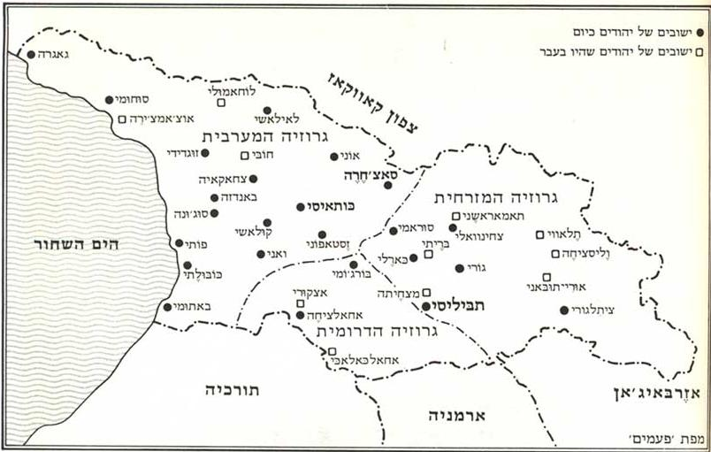
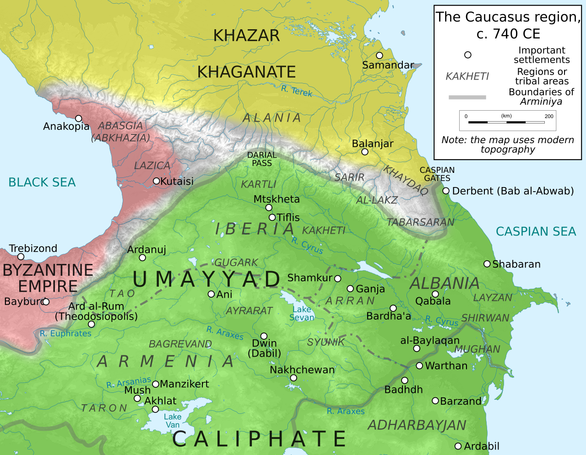
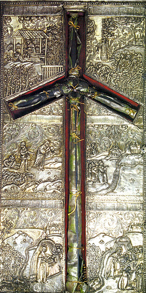

<u>תפוצות ישראל – יהודי גיאורגיה</u>

מפה משנת 1987, לפני העלייה של שנות התשעים, אחרי העלייה
של שנות השבעים.

<u>היסטוריה קצרה של גיאורגיה (מהויקיפדיה בעברית
ובאנגלית)</u>

השם גאורגיה הוא שם הנהוג בהרבה שפות, ומקורו הלניסטי. השם
הרוסי הוא גרוזיה, והיה נהוג אצלנו בעבר ועד היום. הגיאורגים מכנים את ארצם
"סכארתבלו".

באלף הראשון לפני הספירה כבר חילקו שתי ממלכות, קולכיס
ואיבריה את הארץ הזו

בשנת 337 לספירה, הפכה הנצרות לדת המדינה באיבריה, וב 523
הממלכה השנייה, שנקראה עכשיו אגריסי קיבלה את הנצרות גם היא.

שתי הממלכות התפרקו מסיבות חיצוניות ופנימיות, ונפלו בידי
הערבים במאה השביעית.

יש לציין שגאורגיה, או לפחות חלקה, שנקרא אז איבריה, קיבלה
את הנצרות כדת מדינה כחמישים שנה לפני רומא, והייתה כנראה המדינה השנייה
שהפכה נוצרית באופן רשמי, אחרי ארמניה.

הערבים שלטו בגיאורגיה כשלוש מאות שנה. הם הקימו את אמירות
טביליסי (בשמה הערבי, טיפליס), אבל, כנראה רק מרבית תושבי העיר התאסלמו,
ורוב תושבי האיזור נשארו נוצרים.

העובדה, שהגיאורגים עברו שלוש מאות שנה תחת שלטון מוסלמי
ונשארו נוצרים, ניתנת להסבר בכך שאזור שליטתם של הערבים בגיאורגיה היה
איזור גבול בין שלוש ממלכות, ולכן לא הייתה יציבות של ממש, בכל התקופה הזו.
אפילו הגבולות השתנו.

האימפריות שנאבקו באזור היו, הכליפות הערבית (שמרכזה היה
בית עבאס, בבגדד), מדרום, האימפריה הביזנטית, ששלטה באנטוליה ובחוף הים
השחור, ממערב, וממלכת הכוזרים שהתקיימה ממש במאות השנים הללו,
מצפון.

משנת 1020 מתמרדים הגיאורגים ומתחיל מאבק ביניהם ובין
אמירות טביליסי, ובו זמנית גם נגד הסלג'וקים (שבט תורכי שמגיע ממזרח) שהלכו
והשתלטו על האימפריה הערבית, ופלשו לשטחם. כמאה שנה אחר כך, מוקמת ממלכה
גיאורגית עצמאית על ידי המלך דוד הרביעי.

תקופת הזוהר היחידה של גיאורגיה הייתה במאה ה-12, ובעיקר
תחת שלטונה של המלכה תמר, שהזכרנו אותה בהקשר אחר.

במאה ה-13 פולשים המונגולים, הממלכה מתפרקת לאזורים
הנמצאים במשטר פיאודלי, ובמשך מאות שנה היא תחת שלטון זר בדרך כלל
(מונגולי, פרסי, עות'ומני), מנצלים ומנוצלים, ומידה מסוימת של עצמאותם תחת
חסות זרה, היא רק בזכות האיזור ההררי שהקשה שליטה ממש של המדינות השכנות,
אך איפשר להן מסעות נקם וטבח.

במאה ה-18 נאבקת גיאורגיה על עצמאותה, אך עקב מאבקים קשים
עם הפרסים הופכת למדינת חסות של רוסיה, שמתקדמת וכובשת ממש את כל גיאורגיה
במשך המאה ה-19.

לאחר 1917, המהפכה הקומוניסטית ברוסיה, הייתה גיאורגיה
לדמוקרטיה עצמאית במשך שלוש שנים, ונכבשה על ידי רוסיה תחת מנהיגותו של
סטלין שהיה בעצמו יליד גורי, שבגיאורגיה. יותר ממאה אלף גיאורגים נרצחו על
ידי המשטר הסובייטי. רבים עוד יותר נפלו במלחמת העולם השנייה כחיילים בצבא
הסובייטי.

היא חזרה להיות עצמאית ב 1991, ומאז הרבה מאבקים עם רוסיה,
ועם מיעוטים בתוכה הזוכים לתמיכת רוסיה, וגם מאבקי שלטון.

ולא נמשיך לפרט.

כל אוכלוסייתה של גיאורגיה היא כ 4 מיליון נפש. רובם
נוצרים, תחת הכנסייה הגיאורגית העתיקה (כאמור מאז המאה הרביעית לספירה).
קשורה היום לכנסייה האורתודוקסית המזרחית.

יש להם אפילו צלב מיוחד, הנקרא "צלב הגפן", על פי האגדה
המספרת על הגעתה של נערה בשם נינו הקדושה, שהפיצה את הנצרות בגיאורגיה עם
צלב של ענפי גפן (כאמור, בשנת 337 לספירה).

צריך להעיר, שהחומר המצוי על יהדות גרוזיה ברשת הוא גדול
מאוד, והבחירה קשה.

<u>היהודים הגרוזים בגרוזיה ובארץ ישראל (קטעים). מתוך
"פרויקט בן יהודה", ברשת.</u>

כתב: נתן אליהשווילי. (נפטר ב 1929).  

המחבר, היה יהודי ציוני בגרוזיה, הקים בית ספר יהודי
בטבילסי, וניסה לארגן עליה לא"י, ב 1925. הוא עצמו עלה בשנה זו יחד עם
משפחות בודדות, אך התייאש מיחס ההנהלה הציונית ואפשרויות הקליטה. עבד
בעבודות חקלאיות כעשר שנים.

נפטר בגיל 36 ממחלה, ונקבר בפתח תקוה. אשתו שמרה על כתב
היד, והעבירה אותו לבתו שושנה, שהצליחה להוציא אותו לאור ב 1975. מהדורה
חדשה יצאה ב 2017. הספר כולו נמצא ב"פרויקט בן יהודה" ברשת.

מזמן עתיק אנו רואים עקבות היהודים בארץ זו. שמות כפרים
ושכונות. יסודים, חרבות בתי כנסת ושרידי מצבות ישנות – כולם יחד יעידו,
שהיהודים חיו כאן במספר רב, במשך אלפי שנים. **ידיעות מדויקות ממספרם בעבר
אין בידוע, אבל כעת אומדים אותם בקירוב משלשים עד ארבעים אלף****.
**\[מקורות אחרים אמדו אותם ב 100
אלף בתחילת המאה העשרים\]

.....

מוצאים אנו ידיעה כזו על דבר ביאת היהודים לגרוזיה: “אז
החריב נבוכדנאצר מלך בבל את ירושלים והיהודים אשר הגלו משם, באו לכארתלי
(גרוזיה), ביקשו מראש המטה, אשר במצחטא, אדמה במס (חַרג’יז בגרוזית) להתישב
עליה, וראש המטה אשר במצחטא נתן להם את מבוקשם והושיבם על גדות אַרַגוִי (נהר
בגרוזיה המזרחית, אשר קרוב למצחטא מאחד הוא עם נהר קוּרָא ונופל עם זה האחרון
לים הכספי) ועל מעינות הנקראים בשם זנאוי”.

....

לא פעם אחת, אלא הרבה פעמים גלו היהודים לגרוזיה, כפעם
בפעם היו מופיעים גולים חדשים. את זה מאשרת ההיסטוריה הגרוזית. מספר
היהודים בגרוזיה היה רב מאד. לפי עדות “כארתליס צחוורבבא” \[מקור היסטורי
גיאורגי שלא הצלחתי לאתר את זמנו\], כאשר כבש אלכסנדרוס מוקדון את גרוזיה,
מצא שם יהודים במספר רב. היהודים היו מתישבים בגלילות שונים של גרוזיה, בהם
היו הגולים החדשים מוצאים כבר בבואם גרעיני הישוב העברי. ההסטוריון הגרוזי
ז. טשיטשינַאדזַא מביא בספרו “היהודים הגרוזים”, בשם הספר “כארתליס צחורבא”,
שמספר היהודים בזמן הקדמון היה כה רב בגרוזיה ושפתם כה נפוצה עד כי גם הרבה
מן הגרוזים ידעו לדבר עברית.

....

גם השליחים \[של ישו\] ידעו על אודות גרוזיה והיהודים
הנמצאים שמה. מסופר, שכאשר חילקו השליחים ביניהם את חלקי הארץ להטיף שמה
לאמונה החדשה, נפלה גרוזיה בחלקו של השליח אנדרי, תלמידו של ישו, להפיץ שמה
את הנצרות.

גם באוּדזַ’רמַא, עיר המלוכה השניה של מלכי גרוזיה הקדמונים
ובכפרים סביבותיה, נמצאו יהודים במספר רב. מן הנשים היהודיות מזמן ההוא
ידועה האישה שלומית מאודז’רמה, שהיתה מפורסמה בחכמתה וידיעותיה בתולדות
גרוזיה, היא קבלה את הנצרות וכתבה את תולדות נינא הקדושה.

גם בטיפליס \[טביליסי\]  בהיותה
עוד כפר קטן, מזמן קדמון מוצאים אנו עקבות הישוב היהודי. עד היום ברובע
הישן של העיר, לרגלי ההר, יש רחוב הנקרא “בית-חיים”. לפי המקורות הגרוזים,
היה נמצא לפנים סמוך למקום הזה ישוב יהודי ובמקום הזה היה בית-קברות יהודי,
אשר קוראים לו “בית-חיים”. כעת עומד במקום זה בית-יראה ארמני בשם “כנסית
בית-חיים”.

.....

לאט לאט התפשט הרעל הזה \[רעל האנטישמיות הדתית\] גם
בארצות אחרות וגם גרוזיה לא נמלטה ממנה. גם שם התחילו להביט על היהודים כעל
מעני אלהי הנוצרים וגם האגדות והדיבות על דבר שימוש דם הנוצרים מצאו קן
בלבותיהם, אם כי השנאה הזאת לא התבטאה בחריפותה ובמרירותה כמו בארצות
אירופה. רדיפת היהודים במערב אירופה מתחילה מהמאה השמינית, ימי הבינים, ימי
חושך ואפילה לעם ישראל. אולם בגרוזיה עומדת הממשלה עצמה, בית הבגרטיונים,
למגן ליהודים יושבי גרוזיה, משתדלת לפזר את העננים מעל שמיהם ולקרוע את רשת
השקרים והדיבות הנארגים מסביב להם ודואגת להבטיח את חייהם ולהגן עליהם
בעתיד. **המדינה עצמה, בתור מעוניינת בהבטחת חייהם ורכושם בעתיד מכל רדיפה
והתנגשות בשלומם ובזכויותיהם, מכריזה על היהודים בתור קניני בתי-היראה
הגדולים, ההגמונים והכמרים, ומשעבדים אותם להם החל מהמאה העשירית, כדי
שחייהם יהיו בטוחים יותר תחת חסותם.** מאותו הזמן והלאה אנו מוצאים את
היהודים משועבדים לבתי-יראה הגדולים של מצחַטא, גַלַטי, אַללָוֶרדי, ציון, וכן
לבתי-יראה קטנים מאלה. הודות לזה נשארים היהודים שקטים ובטוחים. כל משנאיהם
ורודפיהם ידעו מראש, שכל הנוגע בהם עתיד ליתן את הדין לפני הפטרון שלהם,
אשר אימתו עליהם. לכן לא העיזו לנגוע בהם לרעה. גם היהודים מצדם היו נוחים,
לא הקניטו את התושבים, חיו בצניעות ובהכנעה ונשאו את גורלם בדומיה.

היהודים המשועבדים לבתי-היראה ולהעומדים בראשם היו מעלים
לפטרונם שלהם מידי שנה בשנה מס מכל הבא לידם: חיטה, תירס, יין, דונג, דבש,
חוטי-ארג ועוד. מלבד המסים והמתנות האלה היו תמיד מוכנים לשירותם ולהוכיח
בכל מקרה לפטרוניהם את נאמנות רוחם.

....

אולם במרוצת הימים, מפני אי-אלה סיבות וגורמים שונים,
משתנה המצב בגרוזיה, כוחות בתי-היראה והעומדים בראשם הולכים ונחלשים, באופן
שאין להם עוד אותו הכח ואותה ההשפעה הנחוצה להן על נתיניהם-משועבדיהם,
כשמרגישים בזה היהודים, מפחדם שלא יישארו הפקר “ומרמס לרגל השור והחמור”,
מתחילים הם לחפש אחר אדונים ופטרונים אחרים מבין הנסיכים והאצילים, שיהיו
חוסים בצלם ויהיו למגן להם. וככה עוברים המה משיעבוד לבתי היראה לשיעבודם
לנסיכים ואצילים, על הרוב מבכרים הם להשתעבד ולחסות בצל אלה האדונים, שלפי
המסורת התיחסו על זרע ישראל. החל מהמאה השתים עשרה עד מחצית המאה התשע
עשרה, זמן שחרור האכרים ברוסיה וגרוזיה, היו היהודים משועבדים להנסיכים
האלה: דאַדיָני, אֶריסתָווי, צֵרֶטלי, ועוד במערב גרוזיה, מַטשבֶלי, אַוַאלישווילי,
פַלַוֹנדוֹף, ציצישווילי ועוד במזרחה.

....

לדוגמה ממצבם בידי אדוניהם והערך אשר היה ליהודי בעיני
אחדים מהם, נביא עובדה אחת מהמאה השתים עשרה. בשנת 35 למאה זו, היה הגמון
גרוזי אחד, דוֹמַנטי שמו, שחי זמן ידוע ביון, ובמשך הזמן הזה התחייב להסוחרים
הצרפתים ולהפטריק היווני 5500 לאו (550 רובל בערך), כעבור זמן מה תבע
הפטריק את החוב מגרוזיה, דומנטי זה לא ידע מה לעשות, לא היה לו במה לשלם
ולבסוף שולח הוא תמורת חובו 17 יהודים וגביע
זהב.  מזה אנו רואים שהאדונים הגרוזים לא רק
הקדישום לבתי יראה ונתנום כנדוניה לבנותיהם, אלא גם את חובותיהם שלמו בהם.
ככה עשו גם הנסיכים מבית אָרבִליָני עד אשר לא נשאר אצלם אף נתין יהודי אחד
מפני שכולם נמכרו על ידם לארצות אחרות, ניתנו במתנה, או החליפום בחפצים
שונים.

....

בהכתבים הגרוזים העתיקים אנו מוצאים ידיעות, על דבר הקדשת
משפחות יהודים על ידי אדוניהם לבתי יראה בתור הודאה לאלהים. הנה למשל
מוצאים אנו ידיעה כזו מסולומון השני מלך אִמֶרטיָה (1800): “היות וברצונו הטוב
של סולומון הראשון מלך אמרטיה נחצב לו קבר במנזר גֶ’נַטי, לכן הנני מצדי
מקדיש להמנזר שלוש משפחות מנתיני היהודים ועליהם יהיה לשלם להמנזר מידי שנה
בשנה 15 רובל וליטרא דונג 11".

...

 כל חוקרי דברי ימי גרוזיה מאשרים את העובדה, שחלק הגון מן
העם הגרוזי, ביחוד במערב גרוזיה, האימרטיים והגוּריים, **מזרע היהודים
מוצאם, היינו מהיהודים, שנטמעו בין הגרוזים, קלסתר פניהם, נימוסיהם, שמות
המשפחה וגם השמות הפרטיים העבריים הנפוצים בהם כל כך במדה מרובה מכריזים
בגלוי, שאכן יש יסוד להשערה זו.** גם כיום מוצאים אנו ביניהם הרבה שמות
עבריים כגון: אברהם, יצחק, יעקב, משה, דוד, שלמה, יוסף, גבריאל, מיכאל,
אליהו, אלעזר, בנימין, יהורם, זכריה, מלכיה ועוד. וכן שמות הנשים: תמר,
מרים, שרה, חנה, אסתר, שושנה, שולמית עוד.

צריך להוסיף לכתוב, שבמאה ה-19 עם הכיבוש הרוסי של
גיאורגיה, חדרה גם השפעת הכנסייה הפראבוסלבית, האנטישמית, ואפילו ידועות
שתי עלילות דם במאה הזאת.

<u>החיים הדתיים והמוסריים</u>

**את התלמוד לא הכירו וישיבות למרכז התורה והיהדות אין אנו
מוצאים שם.** אולם למרות חסרונם בידיעת התורה, היו נשמרים במלואם הדת
ומנהגי ישראל. את ספרי הדינים ידעו והתנהגו על פיהם. ה“טורים”, ה“שלחן
ערוך” וה“יד החזקה” של הרמב"ם היו מצויים ביניהם ונהגו על פיהם בדרכי החיים
הדתיים. עד כמה היו בקיאים בתורה ובהלכה ועד היכן הגיעה הבנתם בספרים אלה,
קשה לדעת, אבל מנהגי ישראל היו בידם והיו מתנהגים על פיהם. את התפילין
ושלוש תפילות חשב היהודי לשרשי האמונה, ובמזמורי תהלים הגה תמיד ונשא אותם
בחיקו בכל אשר פנה. בהיותו נודד בדרך, הרחק מביתו ומשפחתו, לבקש טרף
לילדיו, את ספר התהלים נשא אתו תמיד, בו שפך את שיחו ושיגו ובו מצא את
נחמתו.

את בית-הכנסת חשב לביתו העיקרי מלבד שלוש התפילות – שם היו
נאספים ושם היו נידונים ונחלטים כל צרכי הצבור. המילה והנישואין היו נעשים
כדת משה וישראל. החכמים ותופשי התורה היו מכובדים בעיני העם כמלאכי אלהים
והיו מפרנסים אותם בכבוד. על פי רוב, החכם היה ממלא גם תפקיד הרב, החזן,
השוחט והמלמד. את משכורתו היה מקבל מהכנסת בית הכנסת (דמי עליות שהיו
נמכרים בהכרזה ועוד), וגם קבל איזה חלק מהבהמות השחוטות (הצוואר). אם היה
מלמד תינוקות קיבל גם שכר-לימוד מאבות התלמידים.

 .....

האהבה והגעגועים לארץ ישראל היו גדולים ועמוקים בלבו.
היהודי הגרוזי חשב את עצמו לאזרח ארץ-ישראל. בדמיונו חי שם, בארצו והגלות
היתה רק חלום רע אחד, ארוך, שעוונותינו גרמו לו. להיקבר בלי עפר א“י, זה
היה חילול המת ודבר לא יצוייר. עד כמה השפיעו התנועות המשיחיות, שהיו בעמנו
בתקופות ידועות, על היהדות הגרוזית לא ידוע לנו, אבל ידוע, שהיו הרבה
מחשבי-קיצין, גם בזמן האחרון היתה אמונה חזקה בלב העם, שבשנת תרס”ו (1906)
יבוא הגואל (הם סמכו על הפסוק **ותסר** בגדי אלמנותה – בראשית ל“ח, י”ד).
כל ימיו חלם היהודי לעלות לא"י, לראותה פעם בעיניו, לפחות או להיקבר לעת
זקנתו שמה. זה היה כל מאוויו ובזה היה נשבע.

לגרוזיה היו באים משולחים מארץ-ישראל לאסוף נדבות בשביל
ישיבות ומוסדות שונים. בכל בית-כנסת היתה קבועה “קופה” בשביל “ארבע ארצות”
(ירושלים, חברון, טבריה וצפת). המשולחים היו על הרוב ספרדים. כנראה גם הם
לא היו מגדולי התורה ולרוב היו באים שמה אנשים פשוטים ובורים, אשר רק אל
הבצע עיניהם, שהיו מאספים סכומים הגונים בשם הארץ והכל היה הולך לטמיון.
אולם בכל זאת יש לשער, שגם אחדים מגדולי התורה היו מזדמנים שמה ועל חשבונם
צריך לזקוף הפצת מנהגי התורה והדינים, אשר ביהדות יסודם. שאם לא כן, קשה
להבין, איך בפינה נידחת זו, אשר לימוד התורה לא היה נפוץ שם, נשמרה בכל זאת
היהדות בטהרתה. העם היו מקבלים אותם הכבוד גדול ובסבר פנים יפות. וכל
בעל-בית היה חושב לו לכבוד גדול לאכסן אותו בביתו.

....

<u>האמונות והמנהגים</u>

בין הרבה מנהגים יפים ונאים היו להם גם הרבה מנהגי הבל
ואמונות-שוא, אשר דבקו בהם מן הגויים שכניהם, “מנהגי עכו”ם“. האמינו
בהבלי-שוא, בכישופים, בניחוש, לחישות קסמים, קמיעות ועוד דברים כאלה, אשר
בדמיון המוני יסודם. גם אחדים מן ה”חכמים" היו עוסקים בדברים ממין אלה,
בריפוי חולים על ידי לחישות, “הטלת גורל”, כתיבת קמיעות ועוד. .... היו
מחלות שלא הרשו לעצמם להשתמש כנגדן בשום אמצעי רפואה, שלא להקניט את המלאך
הממונה לכך.

....

<u>האשה ומצבה במשפחה ובחברה</u>

האשה העבריה בגרוזיה היתה יותר חפשיה ביחס לחברותיה בשאר
המקומות. היא היתה נהנית מחרות גמורה וזכויותיה היו מרובות במשפחה. האיש
מעולם לא הביט עליה כעל מקנת כספו, אלא כעל רעייתו וחברתו בחיים. הוא כיבד
את אשתו והבנים כיבדו את אמם. “חרמו של רבנו
גרשם היה נהוג בכל תוקף, ובשום אופן לא נשא איש אשה
על אשתו. אפילו הדין של “גרוש אשה עקרה אחרי עשר שנים” לא היה נהוג ביניהם
והאיש היה מקבל בהכנעה את גורלו להיות ערירי ובלבד לשבת עם אשת נעוריו.
\[צריך להעיר, שהסביבה הייתה נוצרית, ובוודאי הייתה לכך השפעה!\] האשה היתה
עסוקה במלאכת הבית ולא התערבה בעניני המסחר, שלפרנסת הבית דאג רק האיש. היא
לא היתה יוצאת רעולת פנים כנשי הדגסטנים, **כמו בבית כן ברחוב היתה מהלכת
גלויית פנים גם את שערותיה לא גזזה אחרי נשואיה וכל אשה יחד עם יפיה הטבעי
היתה מהוללת בצמותיה העבותות ובפאותיה הארוכות והמסולסלות.** בימות החול
נשאה על ראשה מטפחת צמר, או משי, ובימי החג התקשטה בכל מיני
קישוטים.

....

בימי החגים, או בכלל באיזו חגיגה שהיא, והנה נשים אחדות
יוצאות על המגרש, או על איזו רחבה שלפני הבית, אחת אוחזת בידה את התוף
והשניה את המפוחית (“הרמוניקה”) ומתחילה לנגן ולתופף. מיד בשמען את קול
התוף, היו נאספות מכל הבתים והשכונות נשים ובתולות, עושות מעגל גדול
ועורכות “גיל”. כלומר, מחולות. שתיים שתיים כסדר היו יוצאות במחול ומחוללות
מיני מחול שונים, מלאים חן ויופי. ואגב, היו נאספים גם בחורים להסתכל
ולשמוח אלי “גיל” ולפעמים היו משתתפים גם הם ויצאו יחד במחול. ככה היו
המחולות מקבלים צורה המונית עליזה ונהדרה.

....

בין נשי יהודי גרוזיה היה סוג של נשים “מלומדות”, שנקראו
“אומנת”. אשה כזו היתה מקבלת את ביתה נערות שהיו לומדות אצלה מלאכת-יד
(תפירה, סריגה, רקמה) וקריאה וכתיבה גרוזית (הבנות בגרוזיה לא למדו לקרוא
עברית). באופן כזה, במשך שלוש-ארבע שנים היו מספיקות לרכוש להן איזו ידיעות
הנחוצות בחיים בבית בעליהן. **אופיני היה שכר הלימוד. את שכר הלימוד לא
ההורי היו משלמים לה“אומנת”, אלא החתן. בזמן החופה היתה ה“אומנת” מופיעה
(היא היתה תופרת את בגדי הכלה וזכותה היתה לקשט אותה בזמן החופה) וגובה את
שכרה מהחתן ורשות היתה בידה לעכב את החופה עד שהחתן לא יתפשר אתה ולא יספיק
את תביעותיה****. **

.....

<u>מתוך ידיעות אחרונות 23.6.17 (על היהודים בגאורגיה
היום).</u>

 ההיסטוריון פרופ' גיבי חראמבשידזה, המדריך במוזיאון
היהודי בטיבליסי - מציין כי על פי דעה אחרת, מדובר בצאצאי הכוזרים
שהתגיירו - וזו אולי הסיבה שבקהילה הזו אין כהנים ולוויים, אלא רק
"ישראלים".

אישור לחלק מהדברים שכותב נתן אליהשווילי, אני מביא גם
ממקורות אחרים.

<u>מכללת הרצוג, קהילות יהודיות, גרוזיה,
טביליסי</u>

<u>מאת: אליהו בירנבוים (מתוך המדור היהודי עולמי ב"מקור
ראשון").</u>

בלי ישיבות ובלי ארגונים

אופייה של הקהילה הגרוזינית היה תמיד הקשר לבית הכנסת
כמקום מרכזי, לקהילה כיסוד החיים היהודיים ולמשפחה כמסגרת המאחדת והמעבירה
את המסורת. נכון שלא היו בגרוזיה ישיבות, כוללים, ארגוניים יהודיים פוליטים
ובתי ספר מסודרים, ואולי על ידי כך ניתן להסביר מדוע השלטון הסובייטי לא
הצליח לפגוע בהם, כיוון שלא היה היכן לפגוע.

 

השייכות הקהילתית הייתה גורם חשוב אצל יהודי גרוזיה יותר
מאשר לימוד התורה. התחושה של ערבות הדדית ומשפחתיות עמדה בלב הקהילה והיא
זאת ששמרה עליהם בתקופה הקשה של השלטון הסובייטי ולמעשה שומרת עליהם עד
היום.

 

מרכזיותו של בית הכנסת בחיי היהודים בגרוזיה הייתה כל כך
גדולה עד שאחד מסופרי הקהילה (מתן אליהשווילי) קובע כי "היהודי חשב את בית
הכנסת לביתו העיקרי" ולכן עשרות שנים של שלטון קומוניסטי לא פגעו במעמדו
בחיי היהודים. אריה (לובה) אליאב אשר ביקר בגרוזיה בשנות השישים
כותב: 

> "בימי שבת וחג מתמלאים בתי הכנסת עד לאין הכיל, לא רק
> הגברים אלא גם ילדים מכל הגילים. עזרת הנשים מלאה נשים זקנות ואמהות
> צעירות ותינוקות בזרועותיהן והבית מלא המולה בריאה ונורמאלית של עדת
> מאמינים".

כמו בכל עדה, יש משמעות ללשון שהעדה משתמשת בה, ובדרך כלל
משקפת את הקשר עם הסביבה הלא יהודית.

<u>מתוך: מאפייני לשון-הדיבור של יהודי גרוזיה</u>

<u>גרשון בן-אורן, וולף מוסקוביץ.</u>

ה . תיאור לשון-הדיבור של יהודי גרוזיה.

יהודי גרוזיה משתמשים **בלשון הגרוזית כלשון תקשורת עיקרית
שלהם** , אך בלשון דיבורם נשתמרו תכונות מיוחדות, המתגלות בעיקר בעת דו-שיח
ביניהם , במיוחד בעת עיסוקם במסחר או בלימוד בספרי-הקודש. ...

עד הזמן האחרון השתמשו יהודי גרוזיה לצורך שיחה ביניהם
בגרוזית שהיתה עשירה ברכיבים מיוחדים , בעלי תכונות מיוחדות, בהשוואה
ללהגים גיאוגראפיים וסוציולקטים אחרים בגרוזיה.

התכונות המיוחדות של הלשון הנדונה התפתחו ונשתמרו בזכות
זהותם הדתית והעדתית האחידה של יהודי גרוזיה. תכונות אלה, הניכרות בעיקר
באוצר המילים , הן :

א. אוצר המילים של הלשון הגרוזית, אשר יצא מכלל שימוש בקרב
הלא- יהודים , או מגלה ייחוד כלשהו בפי היהודים
;

ב. מילים שחדרו ללשונם מעברית ומארמית וכן מלשונות אחרות
;

ג. תרגומי-שאילה מעברית.

יהודי גרוזיה היו יוצאי דופן לא רק בהיסטוריה שלהם
ובתרבותם, אלא גם בעמידתם בפני הלחץ של המשטר הסובייטי ששלט בגרוזיה בין
1922 ל 1991.

<u>מתוך אתר חב"ד
http://www.chabad.org.il/Magazines/Article.asp?ArticleID=3991&CategoryID=986</u>

לא בכדי כונתה העיר קולאשי, ירושלים של גרוזיה. בעוד שברוב
אזורי ברית המועצות ננעלו בתי הכנסת, המקוואות נאטמו, החיטה הכשרה נאסרה
וקול התורה נדם, בעיר זו, במערבה של גרוזיה, שקקה חיי תורה ויהדות.

בזכות אומץ ליבם של חכמי העדה ובזכות עמידתם העקשנית של
פשוטי העם מול גזרות השלטון, נותרו בתי הכנסת מלאים מפה אל פה וקול לימודם
של הילדים ,תינוקות של בית רבן, הוסיף להדהד בחוצות העיר.

אך הנה באו ימים קשים גם על קולאשי. זה היה בחורף תשיג
\[1953\] – החודשים האחרונים למשטרו העריץ של סטלין. בהוראה מגבוה נסגרו כל
בתי הכנסת בגרוזיה, ובכלל זה בקולאשי. שומרים חמושים הוצבו בפתחי בתי הכנסת
הנעולים , כדי למנוע כל ניסיון להמרות את פי השלטון.

יהודי קולאשי לא ידעו את נפשם מרוב כאב וצער. הרב רפאל
אלאשוילי, תלמיד חכם צעיר כבן תשע עשרה.שלא מכבר נשא אישה, הטיל את עצמו
למערכה.הוא היה תלמידו של חכם יעקב דברשוילי,שלמד בשעתו בישיבת תומכי
תמימים בכותאיסי....

עד מהרה נמצאו האנשים שהסכימו לשכן בביתם את בתי –הכנסת
המחתרתיים. מפה לאוזן נלחשו הכתובות,ויהודי קולאשי יכולים היו-תוך נטילת
סיכון לא מבוטל-לשוב להתפלל במניין.

גם בימים ובשבועות הבאים הוסיף הרב חכם רפאל אלאשוילי
להיות הרוח החיה מאחורי ארגון התפילות. הוא התרוצץ מבית כנסת אחד
למשנהו,בזה קרא בתורה,בשני עבר לפני התיבה,ובשלישי השמיע דברי חיזוק
והתעוררות.

העובדה שבאותם ימים עדיין לא נשא בתפקיד רבני רשמי בקהילה,
הקלה עליו את המלאכה . בשעה שעיניהם הבולשות של השלטונות היו נתונות למעקב
אחר ה'חכמים' הידועים והמוכרים לכול,איש לא נתן דעתו למעשיו של הצעיר
הזה.

אולם לא חלף זמן רב ומידע מפליל על מעשיו של הרב הצעיר
והנמרץ החל לזלוג החוצה ולהגיע לידיעת המשטרה החשאית....

הוא יצא בשלום, וגם הגיע לישראל ב 1972 ונחשב לאחד מחשובי
הרבנים של היהדות הגיאורגית.

סיפור זה נלקח מאתר חב"ד, שסגנונו מתקתק ומתלהב, אך
אינפורמציה רבה אפשר למצוא דווקא באתר "בית רפאל" של יהדות גיאורגיה, הנקרא
על שמו של רפאל אלאשווילי <https://bet-refael.co.il>

ובהמשך, היו יהודי גיאורגיה גם פורצי דרך בציונות
שלהם.

<u>ציונות</u>

הקשר של יהודי גיאורגיה לארץ ישראל היה תמיד חזק.

גם הקשר של מנהיגים יהודיים מקומיים עם הציונות החדשה היה
מיידי.

צריך להזכיר במיוחד את דוד באזוב, ובנו הרצל באזוב.

דוד באזוב, היה רב ופעיל ציוני בגיאורגיה מ"ועידת ציוני
הקווקז" שהתקיימה בטביליסי ב 1901, דרך הקונגרס הציוני ב 1907, ופעילות
לשמירת היהדות והציונות גם בתקופת שלטונו של סטלין, עד מותו ב 1947. בנו
הרצל באזוב נרצח בטיהורים של 1938 בגלל פעילות כזו, ואביו ניצל בקושי מגורל
דומה.

וכמובן, תחילת העלייה הגדולה מברה"מ לישראל, זכורה גם לנו,
היא התארגנות יהודים בגיאורגיה, מול השלטונות הסובייטים.

<u>מתוך הויקיפדיה "יהדות גיאורגיה"</u>

הזדהותם של יהודי גאורגיה עם [מדינת
ישראל](https://he.wikipedia.org/wiki/%D7%99%D7%A9%D7%A8%D7%90%D7%9C) הגיעה
לשיאה לאחר [מלחמת ששת
הימים](https://he.wikipedia.org/wiki/%D7%9E%D7%9C%D7%97%D7%9E%D7%AA_%D7%A9%D7%A9%D7%AA_%D7%94%D7%99%D7%9E%D7%99%D7%9D) בשנת
1967. בתחילה סירבו השלטונות הסובייטים לבקשת היהודים לעלות לישראל.
באוגוסט 1969, 18 משפחות יהודיות מגאורגיה, בהנהגה של שבתי אלהשווילי, שלחו
מכתב לוועדה לזכויות האדם של
ה[או"ם](https://he.wikipedia.org/wiki/%D7%90%D7%95%22%D7%9D), בתביעה
להגר לישראל.

המכתב היה התביעה הפומבית הראשונה של קבוצת יהודים
סובייטים לעלייה לישראל. הדבר גרם למערכה אינטנסיבית של [ממשלת
ישראל](https://he.wikipedia.org/wiki/%D7%9E%D7%9E%D7%A9%D7%9C%D7%AA_%D7%99%D7%A9%D7%A8%D7%90%D7%9C) והעולם
היהודי להתיר את עלייתם של יהודי [ברית
המועצות](https://he.wikipedia.org/wiki/%D7%91%D7%A8%D7%99%D7%AA_%D7%94%D7%9E%D7%95%D7%A2%D7%A6%D7%95%D7%AA) לישראל.
מכתב שני נשלח בנובמבר 1969 ל[או
תאנט](https://he.wikipedia.org/wiki/%D7%90%D7%95_%D7%AA%D7%90%D7%A0%D7%98),
המזכיר הכללי של האו"ם, דרך [גולדה
מאיר](https://he.wikipedia.org/wiki/%D7%92%D7%95%D7%9C%D7%93%D7%94_%D7%9E%D7%90%D7%99%D7%A8),
שהייתה אז [ראש ממשלת
ישראל](https://he.wikipedia.org/wiki/%D7%A8%D7%90%D7%A9_%D7%9E%D7%9E%D7%A9%D7%9C%D7%AA_%D7%99%D7%A9%D7%A8%D7%90%D7%9C).

ביולי [1971](https://he.wikipedia.org/wiki/1971)
, **קבוצה של יהודים גאורגים קיימו [שביתת
רעב](https://he.wikipedia.org/wiki/%D7%A9%D7%91%D7%99%D7%AA%D7%AA_%D7%A8%D7%A2%D7%91)**** בחזית
בית הדואר
ב[מוסקבה](https://he.wikipedia.org/wiki/%D7%9E%D7%95%D7%A1%D7%A7%D7%91%D7%94)**.
מאבקם של יהודי גאורגיה הוביל לשינוי היסטורי בעמדת
השלטונות הסובייטים, ובמהלך [שנות
ה-70](https://he.wikipedia.org/wiki/%D7%A9%D7%A0%D7%95%D7%AA_%D7%94-70_%D7%A9%D7%9C_%D7%94%D7%9E%D7%90%D7%94_%D7%94-20) החלה
עלייה מסיבית לישראל. כ-30,000 יהודים גאורגים עלו לישראל, וחלקם למדינות
אחרות.

עלייה משמעותית נוספת של כ 12,000 יהודים התבצעה בשנות
התשעים, לאחר פירוק ברה"מ. מכיוון שיהודים רבים משתי העליות לא הגיעו
לישראל, הקיבוץ היהודי הנותר בגיאורגיה היום כולל אלפים בודדים. יש ויכוח
על מספר היהודים החיים שם היום, אבל אין למעשה חיים יהודיים קהילתיים
משמעותיים.

לסיכום, ניתן לראות ביהדות גיאורגיה,

- קהילה יהודית עתיקה, שמעט ידוע על מקורה.

- מזרחית בפולחן הדתי, אך מקורית במנהגיה,

- בניגוד לרוב יהודי המזרח חיה בסביבה נוצרית,

- רחוקה מהעולם הישיבתי של התלמוד, ובוודאי מקנאות
  דתית,

- קשורה מאוד לארץ ישראל, יוזמת וחלוצה בהגשמה ציונית
  בברה"מ.

תופעה דומה בעולם היהודי, נראה אולי, ביהדות
אתיופיה.
