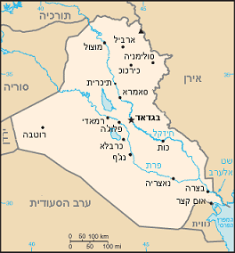
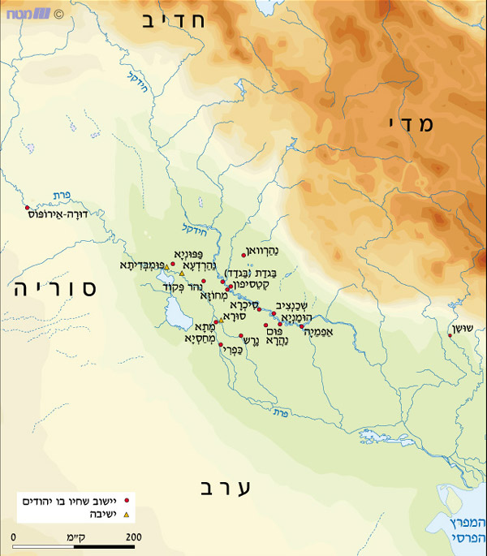
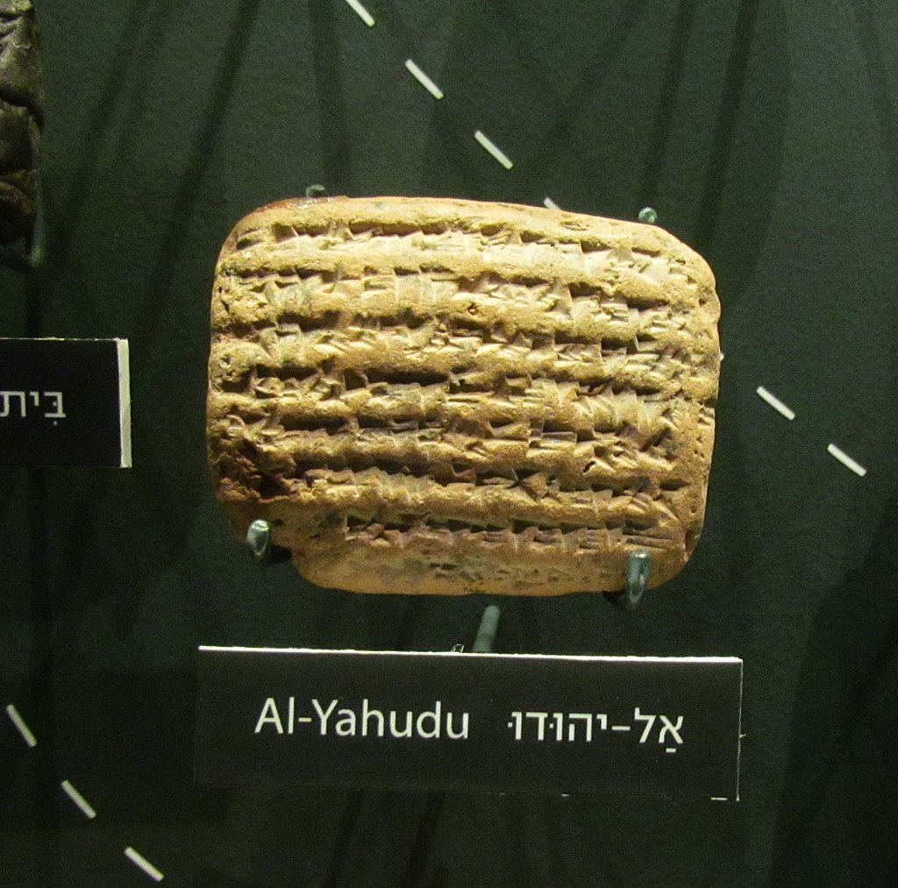
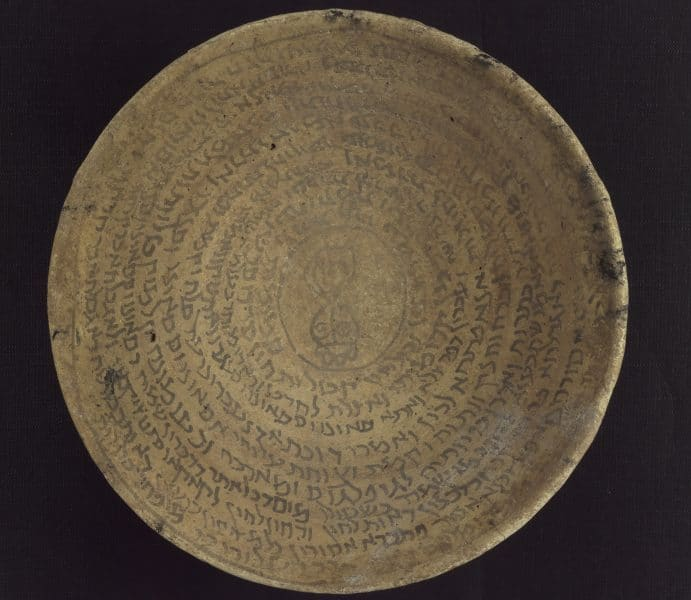

<u>תפוצות ישראל – יהודי בבל</u>

<u>היסטוריה קצרה של עיראק</u>.

הנושא שלנו הוא "יהודי בבל" ואנו נאלצים לדבר על
עיראק.

השם "בבל" הוא המצוי במקורותינו, כמתאר את האיזור שבין
נהרות הפרת והחידקל וסביב גדותיהן, אבל, בדרך כלל, דרומה מהעיר (היום) סמרא
או תיכרית, שמשם וצפונה איזור כורדיסטאן.

העיר בבל כבר איננה מיושבת למעלה מאלפיים ומאתיים שנה, ואת
חורבותיה ניתן למצוא כ 100 ק"מ דרומה לבגדד. בכל שנות קיומה היו לה הרבה
תקופות זוהר כעיר מרכזית, מפוארת, עם מקדשים, ואף עם אנשי מדע. אך הממלכה
הבבלית, שכל כך מפורסמת אצלנו, החזיקה מעמד פחות ממאה שנה, בין 625 ל 539
לפני הספירה. למזלנו הרע, ממלכה זו, עם המדיניות הכושלת של מלכי יהודה,
הביאה לחורבן בית ראשון, ולגלות של רבים משבט יהודה לבבל. מאז חיים יהודים
באיזור זה שבין הנהרות.

העיר בבל עצמה נהרסה פעמים רבות במרידות נגד כובשים שונים
ונבנתה מחדש.

עיראק, כמדינה, היא בעלת גבולות מלאכותיים, שנוצרו ב 1919
בוועידת פריז שלאחר מלחמת העולם הראשונה, וחלוקת השלל הקולוניאלי בין
המעצמות המנצחות. בריטניה שקיבלה את המנדט על עירק, נתנה עצמאות חלקית
לעיראק, והמליכה עליה מלך, את פייסל הראשון, שהיה קודם מלך סוריה. עירק
הפכה עצמאית ב 1932 אך בריטניה השתלטה עליה מחדש ב 1941 , בגלל ההשפעה
הנאצית, ושלטה בה עד 1947.

לכן, קשה לדבר גם על ההיסטוריה של עיראק.

היוונים קראו לאיזור "מסופוטמיה" בתרגום, בין הנהרות,
ומתאים גם לכינויו התנ"כית, ארם נהריים.

ולאיזור היסטוריה ארוכה ורבת תהפוכות.

טוענים שהערים הראשונות בעולם הוקמו במסופוטמיה, על ידי
השומרים, בערך 3500 שנה לפני הספירה. אימפריה ראשונה נוצרה על ידי האכדים
בשנת 2334 לפנה"ס. חמורבי, שעלה לשלטון בבבל, יצר אימפריה במאה ה-18 לפנה"ס
(אצלנו, בתקופת הארמונות הראשונים בחצור... אבל בני ישראל עדיין לא
קיימים). אחריו שלטו בבבל ובאיזור שושלת "כשית", שבטים מהרי הזגרוס שבגבול
עיראק איראן היום, שאין ידוע עליהם הרבה. בהמשך נשלטה בבל תקופה ארוכה על
ידי מלכי אשור הצפוניים תוך מרידות רבות, ואחר כך תקופת הזוהר הקצרה של
בבל, שבה היא הקימה אימפריה. רוב התקופה תחת שלטון נבוכדנצר (605-562
לפנה"ס), שבה אנחנו, היהודים, מתנגשים עם הבבלים, ואיננו נפרדים עוד עד
1952.

במשך שנים אלה שולטים במסופוטמיה הפרסים האחמנידים,
היוונים (שהורסים את בבל),

הפרתים שבאים מצפון איראן, שולטים באיראן ובאימפריה גדולה,
אך בירתם בקְטֶסִיפוֹן, שעל יד בגדד (בגדד טרם נבנתה). במאה השלישית לספירה
עובר השלטון לשושלת הפרסית הסאסאנית וקטסיפון נשארת בירתם, עד הכיבוש
המוסלמי במאה השביעית.

תקופת הסאסאנים היא תקופת התלמוד הבבלי, הסבוראים, ותחילת
תקופת הגאונים. תקופת הגאונים בעיקרה היא בתקופה המוסלמית. בשנת 651 נכבש
האיזור בידי הערבים.

בשנת 762 מקים הח'ליפה השני של בית עבאס את העיר בגדאד,
במשך 4 שנים, ובגדד מחליפה את דמשק שהייתה בירת בית אומייה הקודם, כבירת
האימפריה המוסלמית. בגדד הייתה למרכז תרבותי חשוב ביותר, מאות שנים. היא
יורדת מגדולתה במאה ה-11 בגלל מאבקים פנימיים, וב 1258 היא נכבשת על ידי
המונגולים, הטובחים את רוב תושביה ומחריבים אותה. היא משתקמת, תחת מלכים
מונגולים מוסלמים, אך אינה חוזרת לגדולתה, נכבשת ב 1534 על ידי העות'ומנים
ונשארת בירה מקומית אזורית.

כאמור, לאחר מלחמת העולם הראשונה ותבוסת העות'ומנים, נוצרת
עיראק, והבריטים מקיימים מנדט עם מלך מקומי עד 1932, וחוזרים וכובשים אותה
במלחמת העולם השנייה לתקופה קצרה עד 1947. משם זה כבר לא היסטוריה, כי כבר
אנחנו קיימים.

<u>יהודי בבל</u>

כאמור, הכינוי יהודי בבל, מתייחס ליהודים שחיו בחלק המרכזי
והדרומי של מסופוטמיה, (בערך עד גבול סוריה עירק היום).

יהודים מגיעים לבבל, בעל כורחם בשתי גלויות שהגלה אותם
נכבוכדנצר:

גלות יהויכין בשנת 597 לפנה"ס,

<u>ספר מלכים ב פרק כד</u>

(יא) וַיָּבֹא נְבֻכַדְנֶאצַּר מֶלֶךְ בָּבֶל עַל הָעִיר וַעֲבָדָיו צָרִים
עָלֶיהָ:

(יב) וַיֵּצֵא יְהוֹיָכִין מֶלֶךְ יְהוּדָה עַל מֶלֶךְ בָּבֶל הוּא וְאִמּוֹ וַעֲבָדָיו
וְשָׂרָיו וְסָרִיסָיו וַיִּקַּח אֹתוֹ מֶלֶךְ בָּבֶל בִּשְׁנַת שְׁמֹנֶה לְמָלְכוֹ:

(יג) וַיּוֹצֵא מִשָּׁם אֶת כָּל אוֹצְרוֹת בֵּית יְהֹוָה וְאוֹצְרוֹת בֵּית הַמֶּלֶךְ
וַיְקַצֵּץ אֶת כָּל כְּלֵי הַזָּהָב אֲשֶׁר עָשָׂה שְׁלֹמֹה מֶלֶךְ יִשְׂרָאֵל בְּהֵיכַל יְהֹוָה כַּאֲשֶׁר דִּבֶּר
יְהֹוָה:

(יד) וְהִגְלָה אֶת כָּל יְרוּשָׁלִַם וְאֶת כָּל הַשָּׂרִים וְאֵת כָּל גִּבּוֹרֵי הַחַיִל
עֲשֶׂרֶת אֲלָפִים גּוֹלֶה וְכָל הֶחָרָשׁ וְהַמַּסְגֵּר לֹא נִשְׁאַר זוּלַת דַּלַּת עַם הָאָרֶץ:

והגלות לאחר חורבן הבית הראשון 11 שנים מאוחר יותר:

<u>ספר מלכים ב פרק כה</u>

(ט) וַיִּשְׂרֹף אֶת בֵּית יְהֹוָה וְאֶת בֵּית הַמֶּלֶךְ וְאֵת כָּל בָּתֵּי יְרוּשָׁלַם וְאֶת
כָּל בֵּית גָּדוֹל שָׂרַף בָּאֵשׁ:

(י) וְאֶת חוֹמֹת יְרוּשָׁלַם סָבִיב נָתְצוּ כָּל חֵיל כַּשְׂדִּים אֲשֶׁר רַב
טַבָּחִים:

(יא) וְאֵת יֶתֶר הַעָם הַנִּשְׁאָרִים בָּעִיר וְאֶת הַנֹּפְלִים אֲשֶׁר נָפְלוּ עַל
הַמֶּלֶךְ בָּבֶל וְאֵת יֶתֶר הֶהָמוֹן הֶגְלָה נְבוּזַרְאֲדָן רַב טַבָּחִים:

מהנותרים בארץ "הכורמים והיוגבים" רבים ברחו למצרים, אך זה
כבר סיפור אחר.

בניגוד לאשורים, שפיזרו את גולי הממלכה הצפונית, המדיניות
של נבוכדנצר הייתה קונסטרוקטיבית, הוא רצה ליישב איזורים לא מיושבים בממלכה
כדי לפתח אותה, ולכן הושיב שם את היהודים במרוכז, מדרום לעיר בבל, ועזר להם
להתבסס. נראה כי היישוב המרכזי שם נקרא בשם אל-יהודו.

עדויות לכך נחשפו ממש בעשרות השנים האחרונות, דרך תעודות
כתובות על גלילי טין, בכתב יתדות, בשפה האכדית, אך עם שמות עבריים חד
משמעיים.

<u>תעודות אל-יהודו (מהויקיפדיה)</u>

התעודה הקדומה ביותר באוסף מתוארכת לשנת
572 [לפנה"ס](https://he.wikipedia.org/wiki/%D7%9C%D7%A4%D7%A0%D7%94%22%D7%A1),
כ-15 שנה לאחר [חורבן בית
המקדש](https://he.wikipedia.org/wiki/%D7%97%D7%95%D7%A8%D7%91%D7%9F_%D7%91%D7%99%D7%AA_%D7%94%D7%9E%D7%A7%D7%93%D7%A9),
עדיין בתקופת שלטונו של [נבוכדנצר
השני](https://he.wikipedia.org/wiki/%D7%A0%D7%91%D7%95%D7%9B%D7%93%D7%A0%D7%A6%D7%A8_%D7%94%D7%A9%D7%A0%D7%99) ב[בבל](https://he.wikipedia.org/wiki/%D7%91%D7%91%D7%9C).
התעודה האחרונה באוסף מתוארכת לשנת 477 לפנה"ס, תקופת
שלטונו של [חשיארש
הראשון](https://he.wikipedia.org/wiki/%D7%97%D7%A9%D7%99%D7%90%D7%A8%D7%A9_%D7%94%D7%A8%D7%90%D7%A9%D7%95%D7%9F) מלך [פרס](https://he.wikipedia.org/wiki/%D7%9E%D7%9E%D7%9C%D7%9B%D7%AA_%D7%A4%D7%A8%D7%A1),
כ-60 שנה לאחר תחילת [שיבת
ציון](https://he.wikipedia.org/wiki/%D7%A9%D7%99%D7%91%D7%AA_%D7%A6%D7%99%D7%95%D7%9F) וכ-20
שנה לפני [עליית עזרא
הסופר](https://he.wikipedia.org/wiki/%D7%A9%D7%99%D7%91%D7%AA_%D7%A6%D7%99%D7%95%D7%9F#%D7%A2%D7%9C%D7%99%D7%99%D7%AA_%D7%A2%D7%96%D7%A8%D7%90) ל[פחוות
יהודה](https://he.wikipedia.org/wiki/%D7%99%D7%94%D7%95%D7%93_%D7%9E%D7%93%D7%99%D7%A0%D7%AA%D7%90).

דוגמאות לשמות יהודיים (הצירוף "יהו" מופיע בתחילת השם או
בסופו)

- אחיקם בן יהושורי

- **נתניהו** בן ארזיא

- רימות בן פדיהו

- ביביאה בן זליתא

- דליהו בן אלישו

- בניהו בן אחיהו

ויש עשרות ואולי מאות כאלה.

כאמור, התעודות כתובות בכתב יתדות בשפה האכדית, והשמות
לפעמים חרוטים בעברית.

הנושאים הם ענייני יום יום, חוזים כלכליים, שכירות בתים,
חובת עבודה בשירות הממלכה. **אין בהן עיסוק בנושאים יהודיים ספציפים**
והזיהוי הברור הוא רק על פי השמות המופיעים בהן.

<table>
<colgroup>
<col style="width: 100%" />
</colgroup>
<thead>
<tr>
<th style="text-align: center;"><strong>אחיקם בן רפאיהו
משלם לפלאיהו בן ידעיהו, העובד אצל גובה המיסים, יהואדיר בן טובשלם, חוב
שירות למלך לשנה חמישית לכורש. נחתם בעיר כש.</strong></th>
</tr>
</thead>
<tbody>
<tr>
<td style="text-align: right;">6 שקל כסף חוב ההְַלׇך שנת
5 
לכורש מלך בבל והארצות 
אחיקם בן רַפַ-יׇמַ 
אל פִלִ-יׇמַ 
בן יׇדִ-יׇמַ מיופה הכוח של 
יׇחֻ-אׇדִיר בן 
טַבְ-שַלַמַ גובה המס שלו 
נתן 
עדים [.].. בן 
בֵל אֻבַלִ[ט..].. 
אַחֻשֻנֻ [בן רִ]ימוּת 
וה[סופר.... ב]ן 
נַ[בוּ . צאצא אִלְ]שֻ-אַבוּשֻ 
עיר כֶש חודש אדר יום 5 
שנת 5 לכורש מלך בבל 
והארצות.</td>
</tr>
<tr>
<td style="text-align: right;">תרגום מאוסף תעודות
אל-יהודו</td>
</tr>
</tbody>
</table>

על שיבת ציון מסופר עוד בתנ"ך, בספרי עזרא ונחמיה, חגי
וזכריה.

וכך מתאר עזרא את העליה הראשונה בראשות זרובבל 538
(לפנה"ס):

<u>ספר עזרא פרק ב</u>

(סד) כָּל הַקָּהָל כְּאֶחָד אַרְבָּע רִבּוֹא אַלְפַּיִם שְׁלֹשׁ מֵאוֹת שִׁשִּׁים:

(סה) מִלְּבַד עַבְדֵיהֶם וְאַמְהֹתֵיהֶם אֵלֶּה שִׁבְעַת אֲלָפִים שְׁלשׁ מֵאוֹת שְׁלֹשִׁים
וְשִׁבְעָה וְלָהֶם מְשֹׁרְרִים וּמְשֹׁרְרוֹת מָאתָיִם:

(סו) סוּסֵיהֶם שְׁבַע מֵאוֹת שְׁלֹשִׁים וְשִׁשָּׁה פִּרְדֵיהֶם מָאתַיִם אַרְבָּעִים
וַחֲמִשָּׁה:

(סז) גְּמַלֵּיהֶם אַרְבַּע מֵאוֹת שְׁלֹשִׁים וַחֲמִשָּׁה חֲמֹרִים שֵׁשֶׁת אֲלָפִים שְׁבַע
מֵאוֹת וְעֶשְׂרִים:

הדיוק המוגזם מעט חשוד... אך העבדים, שפחות ובהמות, מעידים
על יכולת כלכלית.

עזרא עצמו עולה שני דורות מאוחר יותר, בערך בשנת 460
לפנה"ס:

<u>ספר עזרא פרק ח</u>

(א) וְאֵלֶּה רָאשֵׁי אֲבֹתֵיהֶם וְהִתְיַחְשָׂם הָעֹלִים עִמִּי בְּמַלְכוּת אַרְתַּחְשַׁסְתְּא
הַמֶּלֶךְ מִבָּבֶל:

(ב) מִבְּנֵי פִינְחָס גֵּרְשֹׁם מִבְּנֵי אִיתָמָר דָּנִיֵּאל מִבְּנֵי דָוִיד
חַטּוּשׁ:

(ג) מִבְּנֵי שְׁכַנְיָה מִבְּנֵי פַרְֹעשׁ זְכַרְיָה וְעִמּוֹ הִתְיַחֵשׂ לִזְכָרִים מֵאָה
וַחֲמִשִּׁים:

(ד) מִבְּנֵי פַּחַת מוֹאָב אֶלְיְהוֹעֵינַי בֶּן זְרַחְיָה וְעִמּוֹ מָאתַיִם
הַזְּכָרִים:

......

(יג) וּמִבְּנֵי אֲדֹנִיקָם אַחֲרֹנִים וְאֵלֶּה שְׁמוֹתָם אֱלִיפֶלֶט יְעִיאֵל וּשְׁמַעְיָה
וְעִמָּהֶם שִׁשִּׁים הַזְּכָרִים:

(יד) וּמִבְּנֵי בִגְוַי עוּתַי וְזַכּוּר וְעִמּוֹ שִׁבְעִים הַזְּכָרִים:

עזרא לא מסכם את מספר העולים איתו, ומיותר לעשות זאת – הם
לא רבים.

נותרו יהודים רבים בבבל, שפשוט לא היה להם עניין בארץ
ישראל.

האם נותרה קהילה יהודית בבבל בימי הבית השני (תקופה של 500
שנה)?

<u>יהדות בבל ומוסדותיה, יהושע גפני, אתר מט"ח.</u>

אשר לימי הבית השני, אין בידינו לצרף אפילו עובדות בודדות
לכדי תמונה כלשהי של יהדות בבל. ברור כי גלות עשרת השבטים וגלות יהודה
הביאו לאזור בבל יהודים רבים. ואמנם בדורות מאוחרים זיהו את מקומות
יישוביהם של הגולים עם הארצות הסמוכות לבבל: חלואן, למדן, חדייב, גנז'
ועוד. כמו כן הפכה גם המלה הסתמית "גולה" נרדפת לבבל בלשונם של חכמים.
\[הדברים נכתבים ב 1994, כנראה לפני מציאת תעודות אל-יהודו\]

מדברי יוספוס, העוסק רק בעקיפין ביהדות הבבלית, עולה לפחות
עובדה חשובה אחת, שיהודי בבל "**הינם ריבואות לאין גבול, שאי אפשר לדעת את
מספרם**”.

דבריו מתאשרים גם על ידי פילון, המשיח לפי תומו על
פטרוניוס, נציב סוריה בימי גאיוס קליגולה, שחשש להעמיד צלם בהיכל בירושלים
גם בגלל כוחם והשפעתם הניכרת של יהודי בבל הפרתית (פילון, המלאכות אל גאיוס
216).

וקודם הוא מצטט מיוסף בן מתתיהו (וכאן כבר מדובר על סוף
תקופת הבית השני):

דוגמא מובהקת ליחס מיוחד זה \[של הפרתים ליהודים\] תשמש
אחת העדויות הבודדות ששרדו אצל יוספוס על תולדות
יהודי בבל בתקופת הבית השני. בספר י"ח של קדמוניות (379-310) מובא סיפור על
שני אחים יהודיים מנהרדעא, חסינאי וחנילאי, שהקימו מדינת שודדים בתוך בבל.
לאחר שגברו בקרב על הסאטראפ הבבלי המקומי, החליט המלך הפרתי ארטבן השלישי
לקשור עמהם קשרי ידידות, "מפני שרצה להשתמש בגבורת האחים היהודים כברסן,
כיוון שפחוותיו היו שרויות במרידה או ברוח של ערב מרידה, והוא התעתד לעלות
עליהם". מדינת יהודית זו נתקיימה חמש עשרה שנים בקירוב (35-20 לספירה), ועם
נפילתה נפגעו אלפי יהודים בראקציה של בבליים ויוונים כאחד, ואילו רבים
אחרים נאלצו לברוח **למבצרי היהודים, נהרדעא ונציבין**. מסיפור זה למדנו על
מספרם הרב של יהודי בבל וריכוזיהם בערים מסוימות, דבר שחוזר כמה פעמים אצל
יוספוס. הוא מדגיש, דרך משל, כי בגלל בטחונם של היהודים בנהרדעא ונציבין
הפקידו שם את **השקלים שנאספו לבית המקדש** "והשתמשו בערים אלה כבבתי אוצר.
מכאן, בהגיע הזמן, נשלחו והועלו המתנות לירושלים".

וביחס ליצירה היהודית הוא (יהושע גפני) כותב:

גם יצירה ספרותית מתורתה של יהדות בבל הפרתית לא הגיעה
אלינו, וקשה לעמוד על מצבה התרבותי-רוחני של הקהילה היהודית. אחרי ספרי
יחזקאל, דניאל ומגילת אסתר, דומה שאין בידינו כל שריד ליצירה יהודית-בבלית
מימי הבית, להוציא את הספר החיצוני טוביה (ואולי גם ספר שושנה).

.....

רק לקראת סוף ימי הבית השני עומדים אנו לפני התופעה של
אישיות רבנית בבבל, שחכמי ארץ ישראל מכירים בה ואף מעריצים אותה. ליהודה בן
בתירה שלחו חכמי ארץ ישראל עוד בימי הבית: "שלם לך ר' יהודה בן בתירה דאת
בנציבין ומצודתך פרוסה בירושלים” ([פסחים ג,
ב](http://pshita.cet.ac.il/sheet.aspx?SheetID=648)). ואמנם כנראה, חכם זה
הוא מייסד שושלת חכמים מחשובי התנאים המועטים הידועים לנו בבבל.

במסורת היהודית מייחסים להלל הזקן (המאה הראשונה לפני
הספירה) מוצא בבלי:

<u>תלמוד בבלי מסכת סוכה דף כ/א</u>

דאמר ריש לקיש הריני כפרת רבי חייא ובניו שבתחלה כשנשתכחה
תורה מישראל עלה עזרא מבבל ויסדה חזרה ונשתכחה עלה הלל הבבלי ויסדה חזרה
ונשתכחה עלו רבי חייא ובניו ויסדוה.

<u>תוספתא מסכת נגעים פרק א</u>

לענין טהרה הוא אומר טהור הוא וטהרו הכהן. וזה אחד מן
הדברים שעליהן עלה הלל מבבל:

אין ספק שבבל הייתה מקלט פליטים יהודים בכל ימי הבית השני
ובוודאי לאחר חורבן הבית השני ומרד בר כוכבא.

בתקופת התנאים, מתחילה תחרות בין המרכז היהודי בארץ ישראל
והמרכז היהודי בבבל, תחרות שנמשכת מאות שנים.

כאשר המרכז בישראל נחלש, המרכז בבבל מתחזק, ומן הסתם הגורם
המרכזי הוא הגירה.

וכבר הזכרנו את המאבק על סמכות קביעת לוח השנה לאחר ההרס
הנורא של מרד בר כוכבא.

<u>תלמוד בבלי מסכת ברכות דף סג/א</u>

כשירד חנינא בן אחי רבי יהושע לגולה היה מעבר שנים וקובע
חדשים בחוצה לארץ. שגרו אחריו שני תלמידי חכמים רבי יוסי בן כיפר ובן בנו
של זכריה בן קבוטל. כיון שראה אותם אמר להם למה באתם? אמרו ליה ללמוד תורה
באנו. הכריז \[עליהם\] אנשים הללו גדולי הדור הם, ואבותיהם שמשו בבית
המקדש. ...

התחיל הוא מטמא והם מטהרים, הוא אוסר והם מתירים.

הכריז עליהם אנשים הללו של שוא הם של תהו הם. אמרו לו כבר
בנית ואי אתה יכול לסתור, כבר גדרת ואי אתה יכול לפרוץ.

אמר להם מפני מה אני מטמא ואתם מטהרים אני אוסר ואתם
מתירים?

אמרו לו מפני שאתה מעבר שנים וקובע חדשים בחוץ
לארץ.

אמר להם והלא עקיבא בן יוסף היה מעבר שנים וקובע חדשים
בחוץ לארץ?!

אמרו לו הנח רבי עקיבא שלא הניח כמותו בארץ ישראל.

אמר להם אף אני לא הנחתי כמותי בארץ ישראל.

**אמרו לו גדיים שהנחת נעשו תישים בעלי קרנים והם שגרונו
אצלך**. וכן אמרו לנו לכו ואמרו לו בשמנו, אם שומע מוטב, ואם לאו יהא
בנדוי. ואמרו לאחינו שבגולה אם שומעין מוטב, **ואם לאו יעלו להר אחיה יבנה
מזבח חנניה ינגן בכנור ויכפרו כולם ויאמרו אין להם חלק באלהי ישראל.** מיד
געו כל העם בבכיה ואמרו חס ושלום יש לנו חלק באלהי ישראל וכל כך למה משום
שנאמר כי מציון תצא תורה ודבר ה' מירושלים.

והמצב ברור, מרד בר כוכבא מביא לחורבן המרכז ביבנה. חנניה
האחיין של ר' יהושע (מחכמי יבנה) יורד לבבל, ומקים שם מרכז מתחרה (קביעת
לוח השנה היא הפגנת הסמכות כלפי כל היהודים). ההתאוששות אחרי המרד, עם
בניית המרכז בגליל, מחזירה את הסמכות לארץ ישראל. יש לשים לב לחשיבות סמכות
קביעת הלוח.

ואכן עד חתימת המשנה בשנת 210 לספירה המרכז בישראל חזק
דיו.

לאחר מכן, בתקופת האמוראים, ובעיקר בתקופה הביזנטית
המתחילה כמאה שנה מאוחר יותר, המרכז בישראל נחלש (בעקבות רדיפות הביזנטים
הנוצרים), והמרכז הבבלי עולה.

רב, "אבא אריכא", היה מראשוני האמוראים בבבל. נולד שם, אך
למד תורה בישראל, בין השאר אצל רבי יהודה נשיא, חזר לבבל והקים את ישיבת
סורא.

ממש בשנים אלה מקים שמואל את ישיבת נהרדע, שאחר כך מוחלפת
על ידי פומפדיתא.

כך מתחילה תקופת האמוראים בבבל, בחסות השלטון הפרסי
הסאסאני הליברלי יחסית, שנמשכת כשלוש מאות שנה עד חתימת התלמוד הבבלי (על
פי המסורת על ידי רב אשי ורבינא בערך בשנת 500). אם נחתם בכלל.

אחריהם, תקופת הסבוראים, מפרשי התלמוד, ואחריהם תקופת
הגאונים עד שנת 1000 בערך.

שלוש מאות השנים של אמוראי בבל הניבו את התלמוד הבבלי, שעד
היום מהווה את הבסיס ללימודים הרבניים.

בעוד שהמשנה מלקטת את המצוות וההלכות של תקופת התנאים כ
150 שנה אחרי החורבן, התלמוד הבבלי הוא לקט עצום ממדים של דיונים בהלכות
אלה, מחלוקות ופלפולים, סיפורים ואגדות, ומעט מאוד פסיקות. לכן, הוא ספר
לימוד מצויין לחשיבה ההלכתית. ספרי הפסיקות מתחילים להופיע מאוחר יותר
(הגאונים, הרמב"ם, יוסף קארו ועד היום).

בתלמוד הבבלי מופיעות גם אמונות בשדים. הנה דוגמה
"מדעית".

<u>תלמוד בבלי מסכת חגיגה דף טז/א</u>

תנו רבנן: ששה דברים נאמרו בשדים, שלשה כמלאכי השרת, ושלשה
כבני אדם. שלשה כמלאכי השרת – יש להם כנפים כמלאכי השרת, וטסין מסוף העולם
ועד סופו כמלאכי השרת, ויודעין מה שעתיד להיות כמלאכי השרת. יודעין סלקא
דעתך? אלא שומעין מאחורי הפרגוד כמלאכי השרת. ושלשה כבני אדם – אוכלין
ושותין כבני אדם, פרין ורבין כבני אדם ומתים כבני אדם.

לאמונות עממיות אלו של שדים מסוכנים, קיימת גם עדות
ארכיאולוגית בדמות קערות השבעה (משביעים את השדים שיחדלו לעשות רע).

זו קערה מהמאה החמישית, סוף תקופת האמוראים.

הטקסט כתוב ארמית בכתב עברי, במרכזו השד כבול או משהו
דומה, אם השד לא יודע לקרוא יבין מהציור, ואוי לו לשד שלא יציית לאמור
כאן...

עסקנו פעם בקערות ההשבעה בהקשר לכך, שחלקן נכתב על ידי
נשים, שכתבו בהן את שמן. לא היו תלמידות ישיבה בבבל אבל היו
מכשפות...

התקופה הטובה מסתיימת באמצע המאה החמישית, עם התערערות
יציבות השלטון הסאסאני והתגברות יסודות קיצוניים בכהונה הזורואסטרית.
לכאורה נחתם אז התלמוד הבבלי, אך היום יש המערערים על כך שנחתם בכלל...
בתלמוד עצמו כתוב "רבי אשי ורבינא סוף הוראה".

תקופת הגאונים מתחילה עם השלטון המוסלמי, או כמה עשרות
שנים קודם. ונמשכת למעלה מארבע מאות שנה.

בשנת 651 מסתיים השלטון הסאסאני על ידי הכיבוש המוסלמי.
ראשיתו בשלטון בית אומייה שמרכזו בדמשק.

מאה שנה אחר כך, מתחיל שלטון בית עבאס ששם את מרכז
האימפריה בבגדד, ובגדד עולה לגדולה, מבחינה תרבותית ומדעית.

נזכיר ש"גאון" בבבל אינו האקר של תוכנות מחשב, אלא פשוט
תואר של ראש ישיבה. לכן תקופת הגאונים בבבל היא תקופת הישיבות הגדולות של
בבל, סורא ופומפדיתא. (סורא נקראת גם מתא-מחסיה), ובסוף המאה התשיעית שתי
הישיבות עוברות לבגדד, אך ממשיכות להיקרא בשמן הקודם.

בראש הקהילה במדינה כולה, רוב תקופת הגאונים, עמד "ראש
הגולה" (ריש גלותא). הוא היה אחראי כלפי השלטון המוסלמי, וגם הממנה של ראשי
הישיבות, הדיינים ועוד. היה בדרך כלל עשיר ומכובד, ותיאורטית מיוחס לבית
דוד.

ראש הגולה וחצרו, וגם הישיבות, מומנו ממיסים ומתרומות גם
מיהודי ארצות אחרות, בפרט מאלו ששאלו שאלות את הגאונים.

תקופת הגאונים, היא אולי התקופה המשמעותית ביותר בקביעת
ההלכה הדתית בישראל.

מלבד ביסוס ההלכה, נוצר בתקופה זו גם סידור התפילה, וגם
הלוח העברי המחושב. חשיבותה של בבל, ושל תקופה זו בתולדות ישראל,
עצומה.

על תקופת הגאונים (שגם בה לא הרבו היהודים לכתוב היסטוריה,
או זכרונות, או שכתבו ולא הגיע לידינו), אנחנו יודעים מכמה מקורות:  
ספרים שנכתבו על ידי הגאונים, השו"ת, ואיגרת ר' שרירא גאון.

הספר הראשון הידוע הוא ספרו של רב אחא (נפטר 760), שלא
נתמנה לגאון, ואף עזב את בבל לארץ ישראל, מאחר שחכם הכפוף לו מונה לגאון
פומפדיתא במקומו.

הספר נקרא "שאילתות" ובנוי בצורת שאלות על המצוות, עם
פסיקות של זמנו.

רב יהודאי גאון סורא, מאותה תקופה ממש, כתב את "הלכות
פסוקות" והוא ספר ראשון שמנסה להקיף את כל ההלכות הנוהגות אחרי החורבן
(כדוגמת "שולחן ערוך" 900 שנה מאוחר יותר...).

רב עמרם גאון סורא (נפטר 875) כתב את סידור התפילה הראשון,
שהשפיע על סידורי התפילה עד היום, בעיקר על הסידור הספרדי.

רב סעדיה גאון סורא (נפטר 942) כתב הרבה, ובין השאר את
הספר הפילוסופי "אמונות ודעות". גם הוא כתב סידור תפילה שהוא הבסיס לסידור
האשכנזי. מאבקו עם גאון ישיבת ארץ ישראל, ר' יעקב בן מאיר, על קביעת הלוח
בשנת 921 לספירה, מסמן את סוף המחלוקות על הלוח המחושב, הקיים מאז ועד
ימינו.

מנהג השו"ת, שליחת שאלות מכל רחבי העולם על חכמי הישיבות
וקבלת תשובות, גם הוא תוצר של תקופת הגאונים. חלק מתשובותיהם נותרו (צריך
לזכור שהכל היה בכתב יד ובלי דואר אויר) ניתן למצוא אותם בספר או ברשת
"אוצר הגאונים". כאמור, שואלי השאלות גם שלחו תרומות.

<u>דוגמא לתחילת תשובה של רב עמרם גאון:</u>

בן תשע שנים ויום אחד, שנשא אשה ומת קודם שיהא אשתו,
ואיפשר להיות קודם שיהא בוגר, **לא חולצת ולא מתייבמת**. תנינא להא (שם דף
צ"ו ע"ב) דת"ר שוטה וקטן שנשאו נשים ומתו שתיהן פטורות מן החליצה ומן
היבום. מה טעם,.....

איגרת ר' שרירא גאון, היא מסמך חשוב ומעניין.

שרירא היה גאון פומפדיתא שלפני האחרון, עד שנת 1005, ונשאל
על ידי ר' יעקב ניסים מקירואן (תוניס), על השתלשלות התורה שבעל פה מימי
התנאים ועד ימיו.

באופן נדיר, נמצא כאן מסמך העוסק בהיסטוריה של ההנהגה
הרבנית, ומהכתוב נראה שהוא יודע מה שהוא אומר לגבי תקופת הגאונים, וכנראה
היו לו מקורות כתובים. אבל הוא סוקר למעלה מאלף שנים של היסטוריה, ומונה
עשרות או אף מאות אישים, מי אחרי מי, וכמה שנים "מלך" (כלומר עמד בראש
ישיבה).

בקובץ PDF ברשת, תמצאו את האיגרת
באורך 46 עמודים, בכתב קטן, עברית מעורבת עם ארמית. (בכמה אתרים).

<u>הקראים</u>

התנועה הקראית התחילה גם היא בבבל, ותחילתה מעורפלת כרגיל.
יש רואים בענן בן דוד מהמאה השמינית את מייסדה, ויש הדוחים את תחילתה למאה
התשיעית, ורואים בדניאל בן משה אלקומיסי, מאחדם של תנועות שונות של התנגדות
ליהדות הרבנית.

הקראים התנגדו לכל התורה שבעל פה, כלומר למשנה, לתלמוד,
וממילא לישיבות גאוני בבל. היו להם חכמים לא מעטים, וקהילות בכל תפוצות
ישראל בימי הבינים, ויש אומרים שהיוו כארבעים אחוז מהיהודים בתקופת השיא
שלהם (המאה ה-11), בפרט בארץ ישראל שלפני הצלבנים. נאבקו בהם גאוני בבל,
ובמיוחד ר' סעדיה גאון, וגם גאוני א"י.

היום הם מיעוט אפסי ביהדות. מומלץ לבקר במוזיאון הקראים
בעיר העתיקה בירושלים.

האחרון לגאוני בבל הוא רב האי גאון פומפדיתא.

הוא חי כמעט מאה שנים, אך בתקופתו מתחילות רדיפות מוסלמיות
נגד יהודי בבל, וגם ירידה כלכלית בגלל אי יציבות בח'ליפות בכלל. ישיבת
פומפדיתא, האחרונה שנותרה, נסגרה בשנת 1040 בערך. רב האי גאון כתב הרבה
ספרים, הרבה תשובות, והיו לו תלמידים מקהילות יהודיות רבות בעולם.

הוא כתב גם שירים, אך לא נראה שבכך גדולתו. הנה שיר
חינוכי...

> ואם תוליד לך בנים ובנות
>
> בכל עת יסרם, אכן בחנוֹת.
>
> קנה להם בכל כחך ספרים
>
> ושים להם מלמד מנעורים.
>
> והענק תעניק לרב בהונך,
>
> אשר תתן ושתעניק לבניך,
>
> ודע כי קרנך בהם תרומם
>
> ושלום לך יהיה עקב שלומם.

יש אומרים שבזכותו, עם שקיעת המרכז בבבל עולים מרכזים
חדשים (בעיקר בספרד).

יהדות בבל נמצאת בתהליך שקיעה, מהגניזה הקהירית לומדים
**שבשנת 1121 גוזר הח'ליפה על היהודים ללבוש שני טלאים צהובים, ושרשרת סביב
הצוואר עם הכתובת "ד'ימי".** יהודים רבים עוזבים את עיראק לכל רחבי העולם,
גם המוסלמי, גם הביזנטי וגם האירופאי.

ב 1258 נהרסת בגדד על ידי המונגולים, ורוב תושביה נרצחים.
קהילה יהודית בעיראק ממשיכה להתקיים תחת שלטון המונגולים, אך היא קטנה,
בשולי העולם היהודי, ולא ידוע עליה הרבה במשך מאתיים או שלוש מאות שנה.
ניתן לומר שאין תרבות יהודית משמעותית בתקופה זו.

ב 1533 נכבשת עירק על ידי העות'ומנים. לאט מתפתחת הקהילה
המפוארת של עירק המודרנית.

ועל יהודי עירק בעת החדשה בפעם הבאה.
