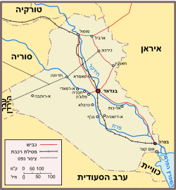

<u>תפוצות ישראל –­יהודי עיראק</u>

יהדות עיראק בעת החדשה מתרכזת בשלושה אזורים, בגדאד, בצרה
וכורדיסטן.

מכיוון, שיהדות כורדיסטן, בדרך כלל מנותקת מיהדות בבל
(מרכז עיראק ודרומה) כמעט עד העלייה לישראל ב 1950, ובוודאי עד יצירת
גבולות עיראק המודרנית ב 1919, ומכיוון שהרוב הגדול של יהודי עיראק מתרכז
בבגדאד וסביבותיה, ניתן לדבר על יהדות עיראק כיהדות בגדאד. (יהודי בצרה מנו
כ 10% מיהודי בגדאד).

באתר "בית התפוצות" שנקרא היום "אנו" נמצאים הקטעים
הללו:

במקורות היסטוריים אין כמעט אזכור ליהדות בבל בשנים שבין
המאה ה-13 למאה ה-18. שקיעתה הארוכה של הקהילה היהודית המפוארת ההיא קשורה
לחורבן שזרעו הכובשים המונגולים ולאחר מכן למלחמות הרבות בין הפרסים
לעותמאנים, שהפכו את בבל לאזור ספר מוכה דלות.  
......  
בשלהי המאה ה-18 החלה הקהילה היהודית בבגדאד להתאושש.
ב-1774 חיו בעיר כ-2,500 יהודים בלבד, כ-3% משיעור התושבים בבגדאד. ב-1893
נרשם גידול משמעותי במספר היהודים, לכ-50 אלף איש (35% משיעור התושבים
בכלל), ומספר בתי-הכנסת קפץ משלושה ל-30.

ואמנם עזבנו את יהדות בבל במאה ה-13 לאחר הכיבוש המונגולי,
ללא כל ידיעות על קהילה מאורגנת בתקופה ארוכה.

אבל, אנחנו מכירים את תחילת ההתאוששות, דווקא דרך סיפור
קהילת כורדיסטאן.

בשנת 1670 נפטרה אסנת ברזאני ראש ישיבת מוסול שבכורדיסטאן.
באותו זמן, בנה, שמואל מזרחי ברזאני משרת כרב בבגדאד, ובני משפחתו אחריו
ממשיכים להיות רבנים בקהילה הקטנה של בגדאד, עד 1743. בכל זאת קשה לדבר על
התאוששות כי הקהילה מקבלת מכה נוספת במגיפת דבר ב 1743 , שמקטינה עוד יותר
את קהילת בגדאד, ובה נספים גם הרבנים מכורדיסטאן.

לכן, ב-1774 , אולי תקופת השפל הקיצוני ביותר של קהילה זו,
שבעבר עמדה בראש העם היהודי, עם מאות רבות של מנהיגים וחכמים, במשך כמעט
800 שנה.

בשנה זו מבקשים ראשי קהילת בגדאד מיהודי חלֶב שבסוריה לשלוח
אליהם רב.

מספר היהודים בבגדאד הוא כ 2500, הרב של חלב שולח את הרב
צדקה חוצין לבגדאד, ואיתו מגיעים גם 50 משפחות של מגורשי ספרד, מהאיזור. הם
מביאים איתם גם כתבים רבים. יהודי עיראק הופכים "ספרדים".

פחות ממאתיים שנה אחר כך, עולים לישראל מבגדאד לבד כ 110
אלף יהודים.

ברור שקהילת בגדאד לא צמחה רק מריבוי טבעי, ויהודי עיראק
(פרט לכורדיסטאן) אינם דווקא צאצאים של יהודי בבל של תקופת הגאונים, אלא
הגיעו אליה כמהגרים, או ממזרח, מפרס וסביבתה, או ממערב, מארצות פיזורם של
מגורשי ספרד.  
היציבות היחסית שזכתה לה בגדאד בשלטון העות'ומני איפשרה את שגשוג העיר,
ובעיקר אחרי שהאימפריה הבריטית השתלטה על הודו, ולבגדאד היה שוב מקום טוב
באמצע. סוחרים יהודים נהנו מכך.

הקהילה ההולכת וגדלה של עיראק (למעשה, בגדאד), מתפתחת
במהירות, בעיקר לאחר 1831 שנה שבה הממשל העות'ומני נותן שוויון זכויות לכל
הדתות. עם הגידול היא גם פוגשת תהליכים של מודרניזציה, במאה ה-19.

וכך כותב ראובן שניר, במאמר:

<u>יחסי יהודים-מוסלמים בספרות ובעיתונות של יהודי
עיראק.</u>

https://www.ybz.org.il/\_Uploads/dbsAttachedFiles/Article_63.1(1).pdf

במחצית השנייה של המאה התשע עשרה והרבע הראשון של המאה
העשרים עברה המערכת התרבותית של יהדות בבל תהליכים חשובים של תמורה ,
התחדשות ומודרניזציה עד ראשית שנות השישים של המאה התשע עשרה לא היו בעיראק
מוסדות חינוך יהודיים כלליים , והפעילות החינוכית התאפיינה בעיקר בלימוד
התורה .

בעקבות הרפורמות העות'מאניות אף נוסד בית המדרש לרבנים
בבגדאד , שהיה בין הגורמים לפריחת לימוד התורה,
ובעיקר בזמנו של הרב עבדאללה סומך \[נזכיר אותו בהמשך\] והנה דווקא בשנים
אלה של תחיה רוחנית-דתית נזרעו הזרעים הראשונים של החילון וההתמערבות,
שמצאו את ביטוים הבולט ביותר בהתרחבותו של החינוך החילוני בחיי הקהילה , על
חשבונו של החינוך הדתי .

תפקיד מרכזי בתחום זה מילאה חברת 'כל ישראל חברים ' ,
שיסדה ב -10 בדצמבר 1864 בבגדאד את ביה "ס 'אליאנס' .

במעשה זה הונחו היסודות למערכת חינוך יהודית כללית,
שהתפתחה באופן מואץ ועברה תהפוכות רבות עד עלייתם ההמונית של יהודי עיראק
לישראל בראשית שנות החמישים. התפשטותו של החינוך החילוני המודרני לא היתה
קלה ולוותה בראשית דרכו בנסיונות להצר את צעדיו ..... למרות הקשיים ,
**ובעידודם של רבנים מרכזיים ופרגמאטיים בקרב יהדות בבל** , הפך אט אט ביה"
ס 'אליאנס' . כמו גם יתר מוסדות כי"ח , לשם דבר לא רק בקרב יהודי עיראק אלא
גם בחוגים מוסלמים ונוצרים. הרב עבדאללה סומך שהיה אחת הדמויות המרכזיות
שסייעו בתהליך זה לא רק שהיה ער לרוח הזמן והפגין היענות לתמורות החדשות,
הוא אף תמך בפעילותה של כי"ח בשולחו את בנו ונכדו להתחנך במוסדותיה
.\[נשים לב לדימיון לתהליכים באשכנז ולהבדלים\]

.......

החילון וההתמערבות הביאו לשבירתן של המחיצות בין הקהילה
היהודית והחברה הערבית הסובבת . בניגוד לעבר, החלו אינטלקטואלים יהודים
לגלות מעורבות בחיים הפוליטיים, החברתיים והכלכליים בעיראק וגם בחיי הרוח,
התרבות הספרות והאמנות. על רקע זה בצבץ אט אט אצל היהודים חזון תרבותי
חדש , ולראשונה מאז הופעת האיסלאם על בימת
ההיסטוריה ראו בעיני רוחם אפשרות שערביותם תוכר כלא נחותה מזו של המוסלמים
והנוצרים. ...

רצונם של האינטלקטואלים היהודים ליטול חלק בבניית תרבותה
של עיראק למודרנית דירבן אותם להעמיק בלימוד הלשון הערבית , לשונה של
האינטליגנציה העיראקית . הערבית לא תפסה, אמנם, מקום חשוב בבית הספר
'אליאנס' בתחילת פעילותו , אך היא היתה חלק מתוכנית
הלימודים בנוסף לעברית, תורכית, צרפתית ואנגלית. ברם בשנות העשרים של המאה
הנוכחית כבר תפסה הערבית מקום מרכזי ב'אליאנס', כפי שאנו למדים מזכרונותיו
רוויי הגעגועים של אנור שאול , הגם שמעיבה עליהם פעילותו של אחד המורים
לאחר שנים, בהפצת התעמולה הנאצית בעיראק .

בעשרות השנים הראשונות של המאה העשרים, ובעיקר לאחר הכיבוש
הבריטי ב 1917, אנחנו מוצאים בעיראק, קהילה יהודית משכילה יותר ומעורבת
ביותר, ובעיקר מגוונת יותר. דתיים ומסורתיים, חילוניים, בהם קומוניסטים
וציונים, ורבים שרואים בעיראק את מולדתם, לאומנים עיראקים.

ניתן לראות בתהליכי המודרניזציה בעיראק דימיון רב לאלו
שחלו בגרמניה חמישים או מאה שנה קודם, כאשר יהודים רבים רצו לראות בעצמם
"גרמנים בני דת משה". אך גם הבדל גדול, שנבע מהגישה הדתית הספרדית המכילה,
הלא-קנאית, שאיפשרה את ההתפתחויות השונות ללא חלוקה דיכוטומית של הקהילה,
שארעה בקהילות אשכנז.

המשורר היהודי אנור שאול, היה עורך השבועון "אל מצבאח",
כותב בגיליונו הראשון שיצא ב 1924 את מטרות השבועון.

(מצוטט מהמאמר הקודם)

א . הרחבת אופקיו של האזרח כאמצעי לקידומה של **האומה
העיראקית בכללותה**.

ב . תיקון הפגמים החברתיים והמוסריים **בחברה
העיראקית** .

ג. עידוד הנוער העיראקי לכתיבת מאמרים ספרותיים
ומדעיים .

ד . חיזוק הקשר הרוחני בין **אנשי הספרות היהודים ואנשי
הספרות העיראקים האחרים** ואיחוד הכוחות המשותפים **למען קידומה של
המולדת** .

שימו לב לפטריוטיות עיראקית ושאיפת השתלבות.

ימיה הטובים של קהילת בגדאד ועיראק בכלל (ואשליותיה),
מסתיימים לפני אמצע המאה העשרים.

נקודת השפל במשבר היא הפרהוד (בערבית "ביזה"), יומיים של
פרעות ביהודי ערי בגדאד, שהחלו ב 1 ביוני 1941, שבהם נרצחו כ 200 יהודים
מכל הגילים, נאנסו נשים, נבזזו מאות רבות של בתים וחנויות.

<u>מאמר מקיף על הפרהוד, "פוגרום הפרהוד בעיראק", מאת עזרא
מורד, נ</u>יתן למצוא באתר

<https://www.parshan.co.il/index2.php?id=8361&lang=HEB>

במאמר זה מונה המחבר התפתחויות של שנים שהביאו לפוטנציאל
הפרעות, ביניהם:

- מאורעות 1936-1939 בארץ ישראל.

- ביקור המופתי אל חוסיני בבגדאד, והסתה שלו.

- תעמולה נאצית של השגריר הגרמני בבגדאד, יחד עם נצחונות
  גרמניה ב 1941.

- פער כלכלי בין היהודים המבוססים יותר לשכבות עניות
  מאוד.

הצתת הפרעות נגרמה ממרד של צבא עיראק נגד הממשלה, שהייתה
בחסות הבריטית, והתגובה הבריטית שהביאה לכיבוש ישיר של בגדאד ב 30
למאי.

שלוש מגמות אידאולוגיות היו בחברה היהודית בעיראק לפני
הפרהוד: פטריוטיזם עיראקי, כלומר השתלבות, שינוי המשטר למשטר קומוניסטי,
וציונות. שלושתן המשיכו גם אחריו, אולם, הפרעות גרמו לכך שהנטייה הציונית
הלכה וגברה. בתקופת מלחמת השחרור גברו רדיפות היהודים, והחלה תנועת בריחה
לישראל, בעיקר דרך איראן.

לאחר המלחמה, בין 1950 ל 1952 הועלו, בהסכמת ממשלת עיראק
(ותמורת השארת כל הרכוש בעיראק) 120 אלף מיהודי עיראק. נותרו מספר אלפים,
שנרדפו ועלו בהזדמנויות שונות אחר כך. אומרים שהיום מתגוררים בעירק 4
יהודים.

הרוב הגדול של העולים מעיראק באו מבגדד וסביבתה, כעשרים
אלף מכורדיסטאן בעליה זו, וכעשרת אלפים מהעיר בצרה.

בהזדמנות זו נעיר בקצרה, שקהילת בצרה הייתה קטנה יחסית
לקהילת בגדד, וקשורה אליה, חרף העובדה שבצרה היא בקצה הדרומי ממש של
עיראק.

בבצרה התרחש בשנת 1791 אירוע יחיד במינו בכל תפוצות
ישראל.

**עלילת דם של יהודים נגד נוצרים**.

בעיר הייתה קהילה נוצרית גדולה בחסות ההשפעה הבריטית
(השלטון היה עות'ומני), וקהילה יהודית גדולה יחסית, שתי הקהילות שלטו למעשה
בעיר, ובעיקר במסחרה, והייתה תחרות גדולה ביניהם.

**יהודי נרצח, והיהודים האשימו נוצרים ברציחתנו לצרכי
פולחן, ערב הפסחא**!  
לא נאריך, ופרטים על הפרשה ניתן למצוא ברשת
<https://he.wikipedia.org/wiki/%D7%A2%D7%9C%D7%99%D7%9C%D7%AA_%D7%91%D7%A6%D7%A8%D7%94>

כדי להמחיש את השגשוג והגיוון של קהילת יהודי בגדאד במאה
ה-19 וה -20, וגם את סופה, נביא את סיפוריהם של מספר דמויות בתחומים
השונים.

בתחום הדתי נזכיר שני שמות.

<u>עבדאללה סומך (1813-1889) (מתוך אתר "החכם
היומי")</u>

חכם עבדאללה בן חכם אברהם סומך, נולד בבגדאד בשנת תקע"ג
(1813). תלמידו המובהק של [חכם יעקב
הרופא](https://www.hyomi.org.il/page.asp?id=857).
שוקד היה על תלמודו, ושוקט על שמריו. למזונותיו לא היה
נטרד, משולחן אביו התפרנס בכבוד. לא עברו ימים ושמו יצא כאחד הגדולים בתורה
ובחוכמה.

בתחילה עסק גם במסחר, והיה שותפו של הסוחר הגדול משה
כבאזה. ברם, בראותו כי לימוד התורה בבבל הולך ורופף, בגלל חוסר בית מדרש
לרבנים, התעורר ברגש קודש ובאהבה עזה, לקח עשרה אברכים והתחיל ללמדם תורה
בשקידה רבה, חינם אין כסף.

בימים ההם נמצא בבגדאד הנדיב רב הפעלים יחזקאל בן ראובן
מנשה. בראותו את מאמצי הרב עבדאללה סומך, נקשר אליו בנימי חיבה. בשנת ת"ר
(1840) קנה חצר ובנה בה בית מדרש לרבנים, שנקרא בשם "מדרש אבו מנשי",
והקדישו לתלמיד חכם עבדאללה. בשנת תרי"ד (1854) סתר בנו, מנשה בן יחזקאל,
את בית המדרש אשר בנה אביו, הרחיב ובנה בית כנסת, שנקרא "מדרש אבו-מנשי",
ועל ידו בנה בית מדרש גדול לרבנים בשם "מדרש בית זלכה". בית מדרש זה הלך
והתפרסם מיום ליום, ויהי שומעו בכל הארצות. תלמידים רבים נהרו אליו מכל ערי
בבל ואגפיה ושתו בצמא מפי המורה הגדול חכם עבדאללה. רבנים רבים יצאו מבית
המדרש, מוכתרים בכתר תורה, ושמשו ברבנות בבבל ומחוצה לה, ובתוכם [חכם אליהו
מני](https://www.hyomi.org.il/page.asp?id=197) רבה
של חברון, [וחכם יוסף
חיים](https://www.hyomi.org.il/page.asp?id=101) בעל
"הבן איש חי".

אנחנו רואים את הסימביוזה בין העושר הכלכלי להתפתחות הדתית
בבגדאד.

<u>וכך כותב צבי זוהר, במאמר "היצירה ההלכתית של חכמי בבל
בעת החדשה".</u>

הרב עבדאללה סומך (נפטר 1889) היה בעל השפעה מכרעת על
העולם התרבותי והדתי של יהדות בבל במאה הי"ט. זאת, מכיוון שמלבד עיסוקו
ביצירה תורנית ובפסיקת הלכה , היה היוזם ועמוד
התווך **בהקמת מערכת מסודרת של מוסדות להכשרת חכמים צעירים** וקידומם
בלימוד ובהוראה.

יוסף חיים ("בן איש חי") (מאותו מאמר של צבי זוהר).

הרב יוסף בן אליהו בן משה חיים (תקצ" ה-תרס"ט) \[נפטר
1909\] היה ללא ספק הדמות התורנית המרכזית ביהדות בבל בעת החדשה, וככל
הנראה מאז תקופת הגאונים לא קם בעיראק גדול תורה שכמותו. יצירתו הרבגונית
והמקורית בכל תחומי היצירה הספרותית המסורתית יש בה כדי להעמידו בשורה
הראשונה של היוצרים התורניים בעולם כולו , בעת
החדשה.

....

מקורות קבליים , שיקולים קבליים, והכרעות הלכתיות על פי
הקבלה, נפוצים מאוד בתשובותיו ההלכתיות של הרב יוסף חיים. ניכר כי אין
המחבר רואה הפרדה ברורה בין נורמות קבליות לנורמות הלכתיות, אלא כולן מהוות
בעולמו הרוחני מכלול רצוף. אולם התעניינותו בקבלה לא הביאה אותו להסתגרות
ולמיקוד בעולמות מיסטיים בלבד **. הרב יוסף חיים היה בעל סקרנות
אינטלקטואלית עצומה, ולא היה תחום או נושא שנמנע מלהתעניין בהם . ניתן לומר
כי הוא שאף לשילוב מלא של כל מקורות המידע והמדע שבטווח הכרתו**. כך , לצד
שילובו בין הלכה וקבלה , גילה הרב יוסף חיים עניין רב במדע החדיש, הן
במישור העיוני והן במישור המעשי, היינו, בהמצאות הטכנולוגיה המודרנית
והשפעתן על עולם ההלכה. מלבד התעניינותו בחידושים טכנולוגיים, גילה הרב
יוסף חיים עניין גם בחידושים בתחומי חיים אחרים, כגון דרכי מסחר ומימון,
תמורות חברתיות, תמורות דתיות, השכלה כללית, ועוד. הוא התייחס במפורש גם
למעמדם ההלכתי של עוברי עבירה - ובכללם מומרים לתיאבון ואפיקורסים - בזמן
הזה , וקבע (למשל) כי מומר לתיאבון בכל העבירות, מותר להעלותו לתורה לצרפו
למניין וכיוצא בזה; לא כן דינו של יהודי המחלל את השבת בפרהסיא, או של מי
שמצהיר כי אינו מאמין בדברי חז"ל. אכן, לקביעה אחרונה זו מוסיף הוא סייג:
"אך מכל מקום, היכא דנפיק מינה .... ושנאה ומחלוקת, ובפרט בזמן הזה דשכיחי
המכשולות האלה בעשירים ונכבדים - טוב להעלים עין".... אולם יחסו השלילי
כלפי אפיקורסים למיניהם לא הביא אותו לשלול השכלה כללית עבור ילדים
יהודיים, ובמקומות שונים בכתביו מתגלה יחסו החיובי והאוהד של הרב לתוכנית
לימודים המשלבת בין לימודים תורניים וכלליים.

יחד עם התיאור הזה של זוהר, צריך להעיר, שהרב יוסף חיים,
היה מחמיר בפסיקת הלכות כדרך האשכנזים. בעוד שחכמים ספרדים נוטים להסתמך על
"השולחן ערוך" של יוסף קארו המקל, האשכנזים מחמירים יותר על פי פסיקותיו של
הרמ"א (ר' משה איסרליש), שהוסיף "מפה" ל"שולחן ערוך". הרב עובדיה יוסף,
הנוטה להקל, חולק לא פעם על יוסף חיים.

אבל, למרות היותו של הרב יוסף חיים מחמיר כאשכנזי, הוא היה
סובלני ומכיל כספרדי...

<u>בתחום הכלכלי – משפחת ששון (האינפורמציה
מהויקיפדיה).</u>

משפחה זו קיבלה את הכינוי "הרוטשילדים של המזרח".

ששון בן צאלח (1750-1830) נחשב לפטריאך של המשפחה. היה
בנקאי, ושימש ממונה על ענייני האוצר בבגדאד העות'ומנית בשנים 1781-1817.
הוא היה גם נשיא הקהילה היהודית.

בנו ירש ממנו את תפקידו ב 1817. ב 1826 היה מושל מקומי
בבגדאד שהציק ליהודי בגדאד, ואז עוברים רוב בני המשפחה לפרס.

בשנים הבאות הם עוברים לבומבי (מומבאי) בהודו, שם צומחת
קהילה בגדאדית, ומנהלים פעילות מסחרית בין הודו, סין, יפן ובריטניה, בתחומי
הטקסטיל, משי, מתכות ועוד.

קשרי נישואין נוצרו בין המשפחה הזאת לאליטה היהודית
הכלכלית הבגדאדית, משפחות כדורי, סומך, עזרא, ועוד. אחד מנכדיו של ששון בן
צאלח, התחנך בבגדאד אך עבר ללונדון. בין צאצאי המשפחה היו עיתונאים, חברי
פרלמנט בבריטניה, משורר, חוקרת יהדות ועוד ועוד. רובם כבר לא בעיראק, והיו
אף מתנצרים.

בבגדאד עצמה היה ששון חזקאל מאותה משפחה (נפטר 1932) יו"ר
ועדת הכלכלה בפרלמנט העות'ומני ושר האוצר הראשון של עיראק המודרנית. יחד עם
זה היה גם מנהיג הקהילה, ותורם גדול לקק"ל, בכספו הוקם כפר יחזקאל ונקרא על
שמו.

משפחה בעלת היסטוריה דומה היא משפחת כדורי. גם הם עזבו את
עירק באמצע המאה ה-19 תחילה לכיוון מומבאי, ואחר כך פתחו עסקים בשנחאי
ובהונג-קונג.

מעזבונו של סר אליס כדורי, שנפטר ב 1922 בהונג-קונג, הוקם
בית הספר כדורי. ועל כך יש שתי גירסאות.

האחת אומרת שבצוואתו הוריש את את הכסף לממשלת בריטניה על
מנת להשקיעו בא"י או בעירק, וחיים וויצמן שכנע באמצעות אחיו של הנפטר את
השלטונות הבריטים להשקיעו בא"י, והם בנו שני בתי ספר חקלאיים אחד בטול כרם,
ואחד ליד כפר תבור.

הגירסה השנייה אומרת שהצוואה הייתה להשקיע את הכסף בא"י,
אך שלטונות המנדט התעקשו שיחולק בין יהודים לערבים.

<u>יהדות בגדאד הוציאה מתוכה סופרים, משוררים ואמנים
רבים.</u>

חלקם כתבו ערבית, חלקם עברית או את שתי השפות. נזכיר רק
אחד מהם הידוע בישראל, את **סמי מיכאל**, בגלל סיפור חייו המיוחד, ואולי
המאפיין הרבה מהדילמות של יהדות בגדאד.

סמי מיכאל, יליד 1926, למד ברשת החינוך של הקהילה היהודית
בבגדאד, אך כבר כתלמיד תיכון היה **ממנהיגי המחתרת הקומוניסטית העיראקית**,
שפעלה נגד המשטר ובעד דמוקרטיה וזכויות אדם. ב 1948 הוצא נגדו צו מאסר
(בגלל פעילותו זו), והוא ברח לאיראן, וחי שם בזהות אחרת.

וכך הוא מספר לפני שלוש שנים, בראיון ל"כאן", שמופיע בכתב
בבלוג "הספרנים" של הספריה הלאומית:

[https://blog.nli.org.il/mussach_28_reayon/](https://blog.nli.org.il/mussach_28_reayon/)

אני ברחתי ולא באתי, ברחתי כי נרדפתי. לי ולחברים שלי,
יהודים, נוצרים, מוסלמים, כורדים, אשורים, **היה חלום לפתח מדינה תקינה
בעיראק**. והובסנו, כל בני הדור שלי נכחדו, לא פעם חזרתי הביתה עם בגדים
שלי מלאים דם של חברים שנקטלו ברחובות, חלק מהם הוצאו להורג, ואני בדמעות
עזבתי את המולדת שלי, עיראק, שגידלה וטיפחה אותי. ברחתי לאיראן ומאיראן,
שבה לא מצאתי את מקומי והיה מסוכן להמשיך להיות שם, כי לא ישבתי בשקט שם…
**הדרך היחידה להציל את עצמי היא להגיע לאיזה מקום שלפחות מבחינה בסיסית
יבטיח לי קיום, וככה הגעתי לישראל**. בלי ידיעת השפה, בלי החלום הציוני של
התבדלות מהעולם, בלי שאיפות של עם של הימים ההם, וגם בלי לתרום כהוא זה
להקמתה של מדינת ישראל. והגעתי עם הצבע הלא נכון, השפה הלא נכונה, הכול
שייך לאויב, ובואי נגיד שזו לא הייתה אהבה ממבט ראשון. נעשיתי אזרח ישראלי
רק בזכות הילדים שלי שנולדו כאן, ואמרתי שזו המולדת שלהם ואז תהיה המולדת
שלי.

אני שמעתי מפיו (כנראה ברדיו, לפני שנים רבות) סיפור אחר,
שלצערי לא מצאתי אותו ברשת, אבל נראה לי ראוי לספרו, אפילו עם זכרוני ישבש
אותו במשהו.

לפי הסיפור הזה, ב 1949, בהיותו באיראן, הוא הוזמן על ידי
המפלגה הקומוניסטית הסובייטית, להגיע למוסקבה ולשדר שידורי תעמולה
קומוניסטית בערבית, לעולם הערבי.

קבעו לו נקודת מפגש בעיירה קטנה בצפון איראן, שמשם יקחו
אותו.

הוא הגיע לעיירה זו כערבי, וכערבי עובר אורח, לן במסגד.
אבל, המואזין במסגד היה שיכור (...), ודרש ממנו, תמורת "המלון" לעלות
במקומו למינראט ולקרוא למאמינים לתפילות. ואז עשה לעצמו קל וחומר: אני,
יהודי קומוניסט עיראקי, עומד על המינראט במסגד בקצה איראן וקורא למוסלמים
לתפילות, שלושה ימים, ומה הלאה? הרי אותו יהודי עיראקי עתיד לשבת שנים
בתחנת שידור במוסקבה, ולקרוא לצעירים ערבים להצטרף לשורות המפלגות
הקומוניסטיות. ואז חישב את דרכו מחדש...

נסע לטהרן, למשרד הסוכנות וביקש לעלות לישראל. הפקידים תהו
על רצונו של קומוניסט אנטי-ציוני, ואז אמר להם, הרי אתם מעלים כל משוגע...
והשתכנעו.

במשך שנים רבות לא היה מסוגל לכתוב ספרות בעברית, אלא רק
בערבית.

בארץ היה בתחילה חבר מערכת העיתון הערבי הקומוניסטי
אל-אלתיחד. ב 1955 עזב את המפלגה הקומוניסטית (כמו רבים אחרים שהתפכחו).
עבד עד גיל פנסיה בשירות ההידרולוגי, כתב ספרים רבים, קיבל פרסים רבים,
דוקטור כבוד של כל האוניברסיטאות בארץ (חוץ מבר-אילן...). היום הוא בן
95.

ספרו "חצוצרה בוואדי" הוא אולי הפופולרי ביותר, וגם הופק
ממנו סרט. היה ברשימת ספרים לבחינת הבגרות בספרות, וועדת ביטון החליפה אותו
בספר אחר שלו ב 2016, כנראה, בגלל שבמרכזו אהבה בין צעירה ערביה לגבר
יהודי, ובימינו גם הספרדים הם אשכנזים וקשה להם להכיל ערבים...

<u>קליטת יהדות עיראק בישראל</u>

ציטוט מאתר UBANK של עבודות
סמינריוניות בנושאים שונים.

רוב הגברים מקרב עולי עיראק היו בעלי השכלה. לחלק ניכר מן
הצעירים ובני דור הביניים היתה השכלה תיכונית, והיו גם בעלי השכלה תיכונית
ובעלי השכלה גבוהה שנרכשה בקולג'ים בעיראק או באוניברסיטאות שונות במזרח
התיכון ובאירופה. האנאלפבתיות התרכזה בקרב זקנים, בקרב נשים וכן בקרב
התושבים הכפריים של אזור כורדיסטאן.  
בדומה לעולי אירופה, היה בקרב עולי עיראק אחוז ניכר של
בעלי מקצועות מודרניים. כ- 22 אחוז מהמתפרנסים עסקו בעיראק בפקידות, מנהל
ומקצועות חופשים. כ- 28 אחוז עסקו במסחר, והיתר - במלאכות שונות, בחקלאות
(כ- 3 אחוז) ובהובלה. בכך היו קרובים יותר ליהודי אירופה, במיוחד לעולי
רומניה, מאשר לעולים מאסיה ומאפריקה.  
יהודי עיראק הצליחו להביא ארצה סכומי כסף, בדרך כלל לא
גדולים, אותם הצליחו להציל לפליטה מנכסיהם. ערב עלייתה נחשבה קהילה זו
לעשירה ביותר בין הקהילות היהודיות בארצות האסלאם, ואולם, תוך כדי תהליך
העלייה הקפיאה ממשלת עיראק את נכסי העולים (10.3.1951). היתה זו קבוצת
העולים ששילמה את המחיר הכלכלי היקר ביותר

......

המוביליות והאקטיביזם שבזכותם התרכזו ה"עיראקים" סביב
הערים הגדולות והוותיקות במרכז הארץ מלמדים על כך כי השתלבותם של עולי
עיראק בחברה הישראלית בשנותיה הראשונות הייתה קרובה לאלה של עולי אירופה
יותר מאשר לדפוסי השתלבותם של יתר העולים מארצות האסלאם. עם זאת, דרכם של
ה"עיראקים" להשתלבות היתה קשה וארוכה.

.....

השתלבותם של יוצאי עיראק בחברה הישראלית, בכל התחומים
הייתה מושלמת. בתחום התרבותי חלו שינויים מרחיקי לכת במבנה המשפחה, כאשר
ירידה בדפוסים מסורתיים ואימוץ דפוסים מערביים נמצאים בעליה מתמדת. גם
תהליכי החילון המואצים שהתרחשו בקרב יוצאי עיראק ראויים להתייחסות תוך
הדגמת השיעור הגבוה של נטישת מנהגיה  
הייחודיים של הקבוצה, בעיקר על ידי הצעירים, ילידי הארץ
בהשוואה לדור העולים...

עד כאן סקירתנו על יהודי בבל (עיראק), ונזכיר כמה שאלות
שמרחפות בסדרה הכללית של הפגישות:

1.  האם המסורת הדתית של היהדות המזרח אירופאית השלטת,
    למעשה, בישראל, אמנם מייצגת את "מסורת ישראל".

2.  האם אמנם היהודים נרדפו על ידי הנצרות, אך לא נרדפו
    במדינות המוסלמיות.

3.  האם הנרטיב של העליות החלוציות הראשונות מייצג היטב את
    תולדות הציונות.

4.  האם יהדות מרוקו מייצגת את "יהדות המזרח" או את יהדות
    מדינות האסלאם, כפי שמקובל לאחרונה בפוליטיקה הישראלית.

ונראה לי שהתשובות רק תסתבכנה כשנסקור את קהילות ישראל
בהודו, תימן, אתיופיה, מצרים, לוב, ועוד.
