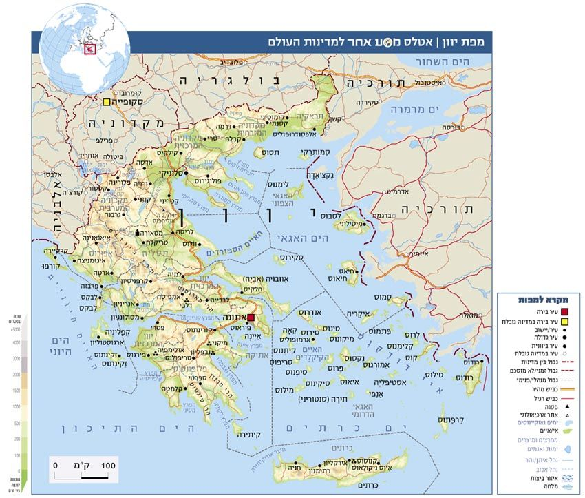
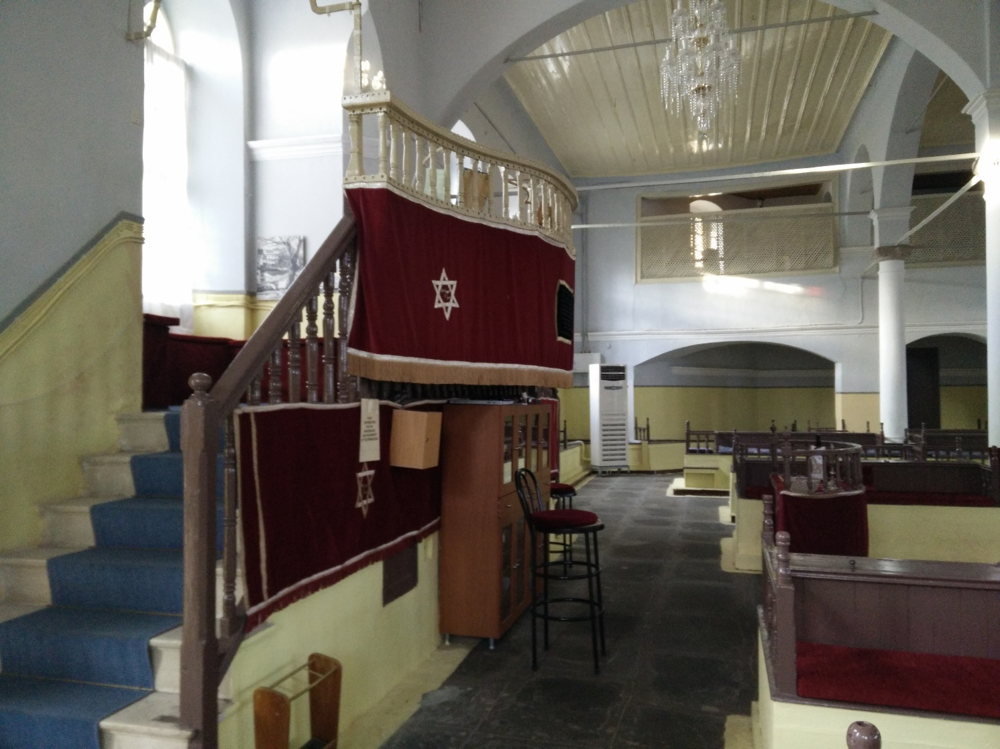

<u>תפוצות ישראל – יהדות יוון</u>

<u>יוון על רגל אחת</u>

יוון על רגל אחת... זה ממש לא מכובד. אבל אין לנו
ברירה.

תחילת התרבות היוונית הידועה להיסטוריונים, היא התרבות
המינאית שמרכזה היה בכרתים, ושגשגה קודם לאלף השני לפני הספירה ועד בערך ל
1500 לפני הספירה. בתרבות זו כבר היה כתב, ואפילו שלושה סוגי כתב שאחד מהם
לא פוענח עד היום.

התרבות הזו נעלמה, ועל הסיבות יש עדיין חילוקי דעות, אבל
זה היה לפני שאנחנו "בני ישראל" הופענו על במת ההיסטוריה.

אחריה עולה התרבות המיקנית, שמרכזה (לפחות במחקר) במיקנה
שבמרכז יוון, אבל היא כוללת כבר את הערים אתונה ותבאי. היא מתגברת על
המינואים, כאן אף מופיע הסיפור של מלחמת טרויה, אך משתמשת באחתנ משיטות
הכתב המינאי (במובן זה, יורשת אותה).

היא דועכת בערך ב 1100 לפני הספירה. "אנחנו" בקושי באנו
לעולם.

במקביל לתקופת המלוכה בישראל, ימי בית ראשון, מתפתחת
התרבות של יוון הקלאסית.

ערי המדינה, אתונה, ספרטה, תבאי, ועוד. מהמאה החמישית
לפנה"ס (בית שני אצלנו) נותרו היצירות הגדולות, הטרגדיות, הקומדיות, ואחר
כך הפילוסופים המפורסמים, סוקרטס, אפלטון, אריסטו, ואחרים פחות מפורסמים...
האולימפידות... הפיסול, המוזיקה... והמלחמות הבלתי פוסקות בין ערי המדינה
אתונה וספרטה, אך גם מלחמות ההגנה נגד הפרסים. (בניגוד לנוסחה מפורסמת, של
ירושלים האתית מול אתונה האסתטית, קרוב לוודאי, שאתונה הייתה לעין ערוך
מתקדמת יותר מירושלים בכל יסודות התרבות)

בשנת 338 לפנה"ס מצליח פיליפוס מלך מוקדון לכבוש את כל
יוון, ומתחילה התקופה ההלניסטית. אלכסנדר בנו מקים אימפריה, היא מתפרקת,
יוון תחת אחד הדיאדוכים (שליטי שלושת הממלכות), אנטיגונוס, אך ממשיכה לסבול
ממלחמות אחים עד שנכבשת על ידי הרומאים פחות ממאתיים שנה אחרי
איחודה.

ההלניזם היה כישלון שלטוני, אך השפעתו על העולם הייתה
אדירה. השפה היוונית, והתרבות היוונית על כל היבטיה, כמעט כבשו את התרבות
הרומית, והתפשטו בכל העולם שתחת שלטונה, ודרכה הם בעלי השפעה עד
ימינו.

במערב, רגילים לראות בירושלים ובאתונה את תשתית התרבות
המערבית. ירושלים זכתה בגלל הדתות המונותיאיסטיות, וספק אם היא בצד הטוב...
אתונה בכל השאר.

עם פירוקה של האימפריה הרומאית, יוון תחת שלטון הביזנטים,
הנוצרים אורתודוקסים, כמעט אלף שנה. היסטוריה מסובכת רבת מלחמות ופלישות של
זרים.

בשנת 1458 נכבשת אתונה בידי העות'מנים. במשך כ 400 שנה
שולטים הטורקים ביוון. הם לא כפו את האסלאם, ולכן יוון נשארת ברובה נוצרית
אורתודוקסית, ורק מיעוט התאסלם כדי לשפר תנאי חיים. קיימת השפעה הדדית בין
התרבות העותומנית והתרבות היוונית במשך השנים, והעות'מנים מנצלים את
יכולותיהם של היוונים במסחר ובדיפלומטיה מול ארצות אירופה.

בשנת 1821 מתלכדים היוונים למלחמת שחרור, ולאחר 11 שנה,
בעזרתם של בריטניה, צרפת ורוסיה (שכולם רצו בנפילת האימפריה העות'מנית...)
מקבלת יוון עצמאות, והפכה למונרכיה. שקט לא היה לא בפנים ולא בחוץ במאה
השנים הבאות.

לאחר מלחמת העולם הראשונה פורצת מלחמה בין טורקיה ליוון,
שבה מפסידה יוון, נאלצת לקלוט מיליון וחצי פליטים יוונים מאנטוליה במסגרת
חילופי אוכלוסין, וסובלת בעקבותיה מאי שקט פוליטי שנים רבות.

במלחמת העולם השנייה יוון נכבשת על ידי האיטלקים והגרמנים.
כוחות פרטיזנים רציניים פועלים נגד הכובשים, אך גם נאבקים בינם ובין עצמם,
כי חלקם קומוניסטים וחלקם לאומנים. אחרי השחרור פורצת מלחמת אזרחים.

משנת 1950 מתחילה יוון להתאושש, כדמוקרטיה, אך ב 1967
מתבצעת "הפיכת הקולונלים" והמשטר הצבאי נמשך עד 1973. מאז יוון היא
דמוקרטיה, אך מצבה הכלכלי קשה.

ואם ניקח בחשבון שכל אוכלוסיית יוון היא כעשרה מיליון,
בערך כמו אוכלוסיית ישראל, הרי האפשרות לבקר ולהנות ביוון היום נראית כמו
נס היסטורי...

<u>יהדות יוון</u>

גם יהדות יוון, כמו הקהילות של המזרח התיכון, היא קהילה
עתיקה ביותר, כלומר, כבר בימי הבית השני ישבו יהודים, ואפילו קהילות
יהודיות, ביוון. מניחים שתחילת ההתיישבות היהודית בתקופה ההלניסטית.

ספר מקבים מעיד על קשרים בין יונתן החשמונאי ובין העיר
ספרטה, שהתבטאו במכתבים, במטרה לקיים ברית כנגד בית סילווקוס שמרכזו
בסוריה. מכאן אין עדיין עדות למציאות יהודים ביוון.

אך קיימות עדויות מסוימות לקהילות יהודיות בספרטה וסיקיון
בפלופונסוס, על פי מכתב מהקונסול הרומאי (142 לפנה"ס). יוסף בן מתתיהו מספר
על 5000 שבויים יהודים שהועברו אחרי דיכוי המרד הגדול (שנת 70 לספירה)
לעבודת כפייה בפלופונסוס, וכרגיל עדויות ברורות על קהילות ובתי כנסת יש לנו
מהברית החדשה, כנראה מהמאה הראשונה לספירה.

להלן פסוקים מ"מעשי השליחים" המעידים על קהילות רבות, ובתי
כנסת בערים המרכזיות של יוון.

"ויהי אחרי עברם באמפפוליס ובאפלוניא ויבואו אל תסלוניקי
ושם בית כנסת ליהודים. ופולוס נכנס אליהם כמשפטו ושלש שבתות התוכח עמהם מן
המקראות.." (פרק י"ז,1).

"ויהי כאשר חכה להם פולוס באתינס וירא והנה העיר מלאה
אלילים ותחמץ רוחו בקרבו. על כן דבר בבית הכנסת עם היהודים ועם יראי אלהים,
ובשוק עם הנקרים אליו" (שם, 16).

"ויהי אחר הדברים האלה ויצא פולוס מאתינס ויבוא אל קֹרִנתוס.
וימצא יהודי אחד מולדתו פונטוס, ושמו עקילס, אשר בא מקרוב מן איטליא, הוא
ופריסקלה אשתו, מפני אשר צוה קלודיוס את כל היהודים לסור מעיר רומי. ויגש
אליהם.... וידבר בבית הכנסת בכל שבת ושבת, ויוכח אל היהודים ואל היונים.
....וקריספוס ראש הכנסת האמין באדון הוא וכל ביתו וגם קורנתיים רבים שמעו
ויאמנו ויטבלו." (שם, פרק י"ח 1-4)

ימי קלודיוס הם כעשרים שנה לפני חורבן הבית השני. מסופר
כאן על שלוש קהילות יהודיות, עם בתי כנסת ביוון, והערת אגב על גירוש יהודים
מרומי (נשאיר לנושא של יהדות איטליה). ברור שקהילות אלה כבר מבוססות
ביוון.

יוון כמו טורקיה, הייתה מאות שנים תחת שלטון הביזנטים,
וקרבתה לקונסטנטינופול לא הקלה על היהודים. רבים מהיהודים התנצרו בתקופה
זו. הקהילות שנותרו, וגם לא התבוללו בקהילות יהודיות ספרדיות מאוחרות, הן
הקהילות המכונות רומניוטיות.

את גורל היהדות היוונית תחת השלטון הביזנטי, ניתן לראות
בדמוגרפיה.

במאה השתים עשרה, חיים 2000 יהודים בתבאי, 500 בסלוניקי,
400 ברודוס ובכיוס, 300 בקורינתוס וסמוס, 200 בגליפולי. פחות מארבעת אלפים
בכל יוון. אין פלא שקשה למצוא אינפורמציה על יהודי יוון בתקופה זו.

<u>וכך כותב מנחם ברופמן, במאמר "תקופה לא מוכרת: על לימוד
התורה והחכמים באימפריה הביזנטית:</u>
<https://he.chabad.org/library/article_cdo/aid/3422072>

תולדות לימוד התורה בכלל וקורות הספרות הרבנית בפרט בתחומי
האימפריה הביזנטית הם פרק נעלם בתולדות הרוח של עם ישראל בימי הביניים.
ידיעותינו על מרכז רוחני זה ועל יצירותיו הספרותיות מצומצמות ביותר, והיא
עדיין אחת מן התעלומות הגדולות של ההיסטוריה התורנית של עם ישראל.
ידיעותינו בנושאים אלה, כך כותב ר"י תא שמע: ביחס לתחום הביזנטי מועטות
ידיעותינו עד לסוף המאה ה-12 כדי קרבה לאפס, והתחום כולו הוא בבחינת "ארץ
לא-נודעת". מספר כתבי היד בלשון הקודש הביזנטיים שמלפני המאה ה-13 המצויים
בידינו הוא כשישה-שבעה בלבד, רובם חלקי מקרא מנוקדים, מוטעמים ועם
מסורה.

.....

חיבור חשוב שהגיע לידינו מיהדות יוון – הוא מדרש "לקח
טוב". מחברו של מדרש זה הוא רבי טוביה ב"ר אליעזר "הגדול" (הכוונה היא: ראש
הישיבה), שחי ופעל בשליש האחרון של המאה ה-11 ב"ארץ מלכות יון ממדינת
קשטוריאה", כפי עדותו הברורה של רבי יהודה מושקוני, מחכמי יוון בשליש השני
של המאה ה-14.

....

על המחבר עצמו אין לנו ידיעות מספיקות, אבל שמו של אביו
נזכר בין גדולי התורה בזמנו, "ר' אליעזר בנו של ר' יהודה בן ר' אליעזר
הגדול", ב"מגילת ביזאנץ". מגילה זו מספרת על התעוררות הרוחנית הגדולה
שהתחוללה בביזנטיון בעקבות תנועת מסע הצלב הראשון, בימי שלטונו של אלכסיוס
קומננוס, שגרמה להזדהות מסוימת של היוונים הביזנטים עם העם היהודי, הזדהות
שבאה מתוך שנאה משותפת לאויב הצלבני. בימים אלו קמה בביזנטיון תנועה משיחית
אשר עוררה התלהבות רבה בקרב היהודים, אך זו דעכה סופית עם הטבח שערכו
הצלבנים ביהודי העיר בשנת 1099. "רבי אליעזר בנו של רבי יהודה בן רבי
אליעזר הגדול" הוא בעל המופת העיקרי באותות ובמופתים המתוארים שם כאירועים
שאירעו בפועל בשאלוניקי.

ב 1453 נכבשת יוון על ידי העות'מנים.

השלטון היה נוח בהרבה ליהודים. העות'מנים היו סובלניים
לדתות השונות. הקהילה גדלה מאוד על ידי הגירה מארצות שונות.

עוד בשנת 1376 גורשו היהודים מבולגריה, וחלקם הגיע ליוון.
רבים הגיעו בעקבות גירוש ספרד ופורטוגל, ושפת הלדינו הייתה השפה השלטת
בקהילה. לאי קורפו הגיעו יהודים מאיטליה, וגם יהודים אשכנזים מפולין הגיעו
ליוון לאחר גזירות ת"ח ת"ט (1648).

בדרך כלל היהודים היו בקשרים טובים יותר עם הטורקים מאשר
היוונים הנוצרים. בכלל, רוב היוונים נשארו נוצרים, ולכן קהילות ישראל ביוון
חיו בתנאים שונים מאלו שבטורקיה.

הסביבה הנוצרית הציקה לפעמים, יותר ממה שהשלטון המוסלמי
יכול היה להגן.

ב 1821, כאשר היוונים נלחמו על עצמאותם, תמכו רוב היהודים
בטורקים, ולכן נרצחו 5000 יהודים, ונערכו פרעות בערים שונות, ורבים עזבו את
יוון.

תנאים אלה מסבירים, כנראה, את מרכזיותה של קהילת סלוניקי
ביהדות יוון. סלוניקי הייתה עיר "יותר טורקית" משאר ערי יוון.

למרות שב 1882 החוק היווני הכיר בשוויון היהודים, היוונים
המשיכו בפרעות מדי פעם.

אוכלוסיה יהודית נוספת התווספה ליהודי יוון, לאחר 1913
כשסופחו ליוון שטחים חדשים בצפונה (תראקיה ומקדוניה) שגם בהם חיו
יהודים.

לפני השואה חיו מעל 78 אלף יהודים ביוון, מתוכם 55 אלף
בסלוניקי. הקהילות המשמעותיות האחרות: קורפו, יאנינה, אתונה ועוד.

<u>שואת יהודי יוון</u>

ב 1941 נכבשה יוון על ידי מדינות הציר, והשלטון בה חולק
בין איטליה, בולגריה (גם בולגריה הייתה בברית כזו או אחרת עם הנאצים)
וגרמניה.

עד ספטמבר 1943 היו רוב הקהילות היהודיות בשטח הכיבוש
האיטלקי, אבל הקהילה הגדולה ביותר, קהילת סלוניקי הייתה בשטח הכיבוש
הגרמני. בקהילת סלוניקי היו כ 60 אלף יהודים. עד ינואר 1943 רוכזו היהודים
בגטאות, הורעבו, נלקחו לעבודות כפייה והושפלו. רבים מתו ברדיפות אלו. באותה
תקופה גם הוחרם רוב רכושם בשיטות שבהם השתמש הגסטפו בכל אירופה.

בינואר 1943 הורה אדולף אייכמן לעוזרו ויסליצני להשמיד את
יהודי סלוניקי, ותוך חמישה חודשים נשלחו 46 אלף מיהודי סלוניקי לאושוויץ
וכמעט כולם נרצחו שם.

אלפים בודדים הצליחו לברוח מהעיר לפני ההשמדה, וכמה מאות
הצטרפו למחתרת היוונית. אלפיים נשארו בסלוניקי אחרי השחרור.

באותה תקופה נרצחו גם יהודי קהילות קטנות בשטחים שהיו
בשליטת בולגריה.

בסוף 1943, איטליה יצאה מהמלחמה, והצבא הגרמני נכנס לכל
שטחי יוון.

בשנת 1944 נרצחו יהודים מקהילות רבות בכל יוון. ביניהם
אתונה, לאריסה, קסטוריה, יואנינה, כרתים, רודוס, קורפו.

צריך לציין את חסיד אומות העולם, הארכיבישוף דמסקינוס
שגינה באופן פומבי את הנאצים, ואחרי השמדת יהודי סלוניקי קרא לאזרחי יוון
לפעול להצלת היהודים, ואף גייס את הכנסייה האורתודוקסית היוונית לשם
כך.

ואמנם ראשי כנסיות ואחרים הצילו לא מעט יהודים.

לאחר השואה נותרו ביוון כעשרת אלפים יהודים. "יד ושם"
העניק את אות חסיד אומות העולם ל 347 יוונים. כאלפיים יהודים ברחו לאלבניה
והוסתרו על ידי האלבנים בכפרים, או הצטרפו לתנועת ההתנגדות שם. אחרים
הצליחו להימלט לטורקיה ולהגיע לארץ ישראל.

ויסליצני, שעזר לאייכמן גם ברצח יהודי הונגריה, ובמקומות
אחרים, היה עד במשפטי נירנברג, ואחר כך הוסגר לצ'כוסלובקיה שדרשה לשפוט
אותו על פשעים שם, והוא הוצא להורג שם.

נחזור אחורה בזמן לקהילות יוון החיות.

חומר כתוב על קהילות יוון נמצא באתר "המרכז למורשת יהדות
שאלוניקי ויוון

<http://www.salonikaheritage.com/html5/?_id=11790&did=9267&G=11790>

ובאתרים אחרים.

<u>קהילת סלוניקי</u>

הקהילה הזאת, הידועה כבר מסוף ימי הבית השני, כקהילה
רומנויטית, הפכה לקהילה גדולה ומשמעותית בעת החדשה. בשנת 1370 בערך מגיעים
אליה יהודים הונגריים, אחר כך מוקמת בה גם קהילה אשכנזית, ממהגרים
מבבוואריה (גרמניה היום), וכרגיל, בעיקר ב 1500 בקירוב, ההגירה הגדולה של
יהודי ספרד ופורטוגל.

הוקמו בתי כנסת לקהילות השונות (כרגיל), והיו כשלושים כאלה
(כי גם הספרדים הזדהו לפי מקום מוצאם...), אך היו התכנסויות של ראשי העדות
לקביעת תקנות לכלל הקהילה.

במאה ה-16 היו כעשרים אלף יהודים בסלוניקי.

סלוניקי הייתה נמל חשוב, ליהודים היו קשרים עם קהילות
באירופה ומצרים, ולכן היה להם יתרון רב במסחר. מלבד זה עסק באריגה ובצביעה
של משי, בייצור תכשיטים, בעבודה במכרות ועוד.

הייתה בה גם פעילות תורנית גדולה. למשל, למדו בה שלמה
אלקבץ ומשה אלשייך שאחר כך חיו בצפת. בנוסף לישיבה היה גם בית מדרש לפיוט
וזמרה, ובית אולפנה למדעים שבו לימד רופא וחוקר בשם אמאטוס לוזיטאנוס. רופא
זה היה מגדולי הרופאים היהודים במאה זו. נולד בפורטוגל, וחי שם כאנוס, וברח
משם להולנד, איטליה ואחר כך סלוניקי ששם חזר ליהדות. היתה לו תרומה מכריעה
לגילוי מחזור הדם מאוחר יותר על ידי ויליאם הארויי.

באמצע המאה ה-17 היו שלושים אלף יהודים בסלוניקי, מחצית
מתושבי העיר. בתקופה זו מופיע שבתי צבי, ודווקא מסלוניקי הוא גורש על ידי
רבניה, אבל אחרי מותו התאסלמו 300 משפחות יהודיות ויצרו את כת הדונמה,
שמאוחר יותר עברה לטורקיה והזכרנוה שם.

בתחילת המאה העשרים היו 80 אלף יהודים בסלוניקי (מעט פחות
מחצי האוכלוסיה), אך מספרם פחת בעיקר בגלל שריפה ב 1917 שהותירה 50 אלף ללא
קורת גג, ומסיבות אחרות. ההגירה הייתה בעיקר לפריס אך גם לישראל. בין
העולים משפחת ריקנאטי, פלורנטין, מולכו, עוזיאל. הם תרמו הרבה לפיתוח תל
אביב. 300 עובדי נמל סלוניקאים הביא אבא חושי ב 1933 להפעלת נמל חיפה, והם
גם הפעילו את נמל תל אביב שלוש שנים אחר כך.

כאמור, 60 אלף יהודים היו בסלוניקי ערב השואה, ורובם
נרצחו.

<u>קהילת יהודי קורפו</u>

האי קורפו נמצא בים האדריאטי, מול חופה המערבי של יוון,
ובירתו קרקירה. גם באי זה הייתה קהילה יהודית רומניוטית מזמנים
עתיקים.

המיוחד בקהילה זו שהצטרפו אליה יהודים איטלקים.

למעשה היו שתי קהילות נפרדות, עם שני בתי כנסת, ובראש כל
אחד שני פרנסים ושני משגיחי כשרות... כל זה ל 500 יהודים.

במאה ה-16 היהודים הוגבלו לגור בגטו.

בשיאה הגיעה הקהילה ל 6000 איש, בסוף המאה ה-19. אך המספר
פחת בגלל עלילת דם ופרעות, וירד ל 3000 ב 1932, אך עם ארבעה בתי כנסת
שונים, לפי מוצא המתפללים.

בקורפו התפשטה גם ההשכלה והציונות.

ראוי לציין את יהודה ביבאס, יליד מרוקו שהגיע ב 1831
לקורפו (נפטר שם ב 1852), שנחשב לאחד ממבשרי הציונות (תלמידו היה הרב יהודה
אלקלעי, הידוע יותר). הוא קרא לעלייה, להתיישבות, ולאימון בנשק, כדי לכבוש
את ארץ ישראל מיד העות'מנים. כנראה, בהשראת מלחמת השחרור היוונית.

וכך כותב עליו יהודה אלקלעי: **(כתבי הרב יהודה
אלקלעי**, א, עמ'
21-20.)

"אין אני יכול להתאמץ להסתיר דברי [מוסר
השכל](https://he.wikipedia.org/wiki/%D7%9E%D7%95%D7%A1%D7%A8_%D7%94%D7%A9%D7%9B%D7%9C) אשר
שמעתי מפי איש אלהים קדוש, הרב המופלא וכבוד ה' מלא. המקובל הר"ר יהודא
ביבאס הי"ל (=השם ישמרהו לנצח) יש"ל (=ישתבח שמו לעד) אשר אמר שחס ושלום
ישראל פשענו ביוצרנו, פנינו לו עורף ולא פנים. וכבר אמרו רז"ל (=אמרו
רבותינו זכרונם לברכה): הדר בחוצה לארץ דומה כמי שאין לו
אלוה, חס ושלום, ומה אנו עושים? נדים אנו מעיר לעיר
לבקש מחיתנו, ואין אנו הולכים לארץ ישראל, ארץ אשר ה' אלוהיך דורש אותה
תמיד, ארץ אשר לא במסכנות תאכל בה לחם, ואכלת ושבעת
וברכת את ה' אלוהיך על הארץ הטובה כתוב".

רוב היהודים שנותרו בקורפו נרצחו בשואה.

<u>קהילת יאנינא (ינינה, יואנינה)</u>

עדויות כתובות על יהודים בעיר זו קיימות מהמאה ה-14 (למרות
שיש ידיעות על התיישבות יהודים עוד בתקופת בית שני). קיימות איגרות של
הקיסר הביזנטי אנדרוניקוס השני שבה מוזכרים צמיתים יהודים, שחייבים במתן
שירותים לבישוף העירוני של הכנסייה ביאנינא.

ברור שהקהילה עתיקה, וכנראה לא קלטה או קלטה מעט מיהודי
ספרד, מפני שחבריה הגדירו את עצמם כרומנויטים, דיברו יוונית (ולא לדינו),
והיה להם נוסח תפילה שלהם.

הם אפילו מאופיינים על ידי שמות משפחה אופיניים, הנגזרים
משמות פרטיים.

במיוחד זכתה הקהילה לשגשוג סביב 1800, כאשר הייתה יאנינא
עיר בירתו של עלי פחה האלבני. היהודים התפרנסו ממסחר ומלאכה, בנקאות
ופקידות. מתקופה זו קיים בה בית קברות הידוע היום.

בקהילה היו שני בתי כנסת, ואחד מהם, שהוקם ב 1826 עבר
בשלום גם את מלחמת העולם השנייה.

הקהילה מנתה כארבעת אלפים נפש בתחילת המאה העשרים, אך
כמחציתה עזבה אותה בסוף המאה ה-19 וראשית המאה העשרים, בגלל מהומות
פוליטיות, שריפות, וחוסר יציבות כלכלית, והיגרה לארה"ב.

חלק עלו גם לישראל.

עיתון החבצלת כותב ב 1872 על פרעות ביהודי העיר:

"פרצו היוונים בחימה שפוכה אל רחוב היהודים ויכום מכות
נוראות וישברו החלונות ופתחי הבתים לרסיסים וישדדו ויבוזו כאוות נפשם ואת
יהודי אחד הרגו באכזריות רצח. השופטים ואנשי הצבא לא עזרו כח להשקית \[כך\]
המית הפריצים, ועל כי רבים מהיהודים מצאו מפלט למו בבתי הישמעאלים, נסבו
עדת מרעים גם על רחוב הישמעאלים וכפרץ העם התפרצו בתוכה ויתנפלו עליהם בזעם
אף."

צריך לציין שהשלטונות הטורקיים ניסו למנוע את הפרעות אך לא
תמיד בהצלחה.

מתוך 2000 שחיו בה לפני השואה ניצלו כמאה בלבד.

באתר למורשת סלוניקי ויוון, מוזכרות למעלה מעשרים קהילות
יהודיות ביוון שלפני השואה. מלבד סלוניקי, רוב הקהילות מונות אלפים בודדים.
כשמונים אלף יהודים מנתה יהדות יוון לפני השואה, כגודל יהדות טורקיה,
איראן, ויותר מיהדות תימן. אך רוב יהדות יוון נרצחה בשואה.

לאחר קום המדינה עלו לישראל כארבעת אלפים יהודים מיוון. על
עלייה קודמת קשה היה למצוא מספרים, אך מצאתי שבעלייה החמישית (העשור שלפני
השואה), כ 3% היו יוונים, מתוך כ 200 אלף עולים, כלומר כששת אלפים
איש.

כך או כך, מבחינה מספרית אין העלייה הזאת ניכרת כמעט
בישראל.

לזכותה אפשר למנות את מושב צור משה שהוקם ב 1937 על ידי
עולים מקהילת קסטוריה, ואת שכונת פלורנטין בתל אביב, שהוקמה על ידי שלמה
פלורנטין מסלוניקי.

יש בין יוצאי יוון אנשים מעניינים בישראל.

- משפחת רקנאטי, שכוללת בנקאים ואנשי עסקים, מהעשירים
  בישראל מוצאה מסלוניקי.

- גם משפחת קרסו, העוסקת בעסקי רכב, ונחשבת לאחת העשירות
  בישראל מוצאה משם.

- ישעיהו אליהו, יליד קורפו, נפטר ב 1965 היה רופא
  והרנטגנולוג הראשון בתל אביב.

- משה כהן (נפטר ב 1982), יליד יואנינה, היה שופט בית
  המשפט העליון.

- יצחק רפאל מולכו (נפטר ב 1976) יליד סלוניקי, היה
  היסטוריון.

- נתן שלם (נפטר 1959), יליד סלוניקי, מראשוני חוקרי הטבע
  של ארץ ישראל, גאולוג וגיאוגרף. על שמו מצפה שלם.

- אליעזר שמואלי (נפטר 2018), יליד לאריסה, מורה ומומחה
  למינהל חינוכי, היה מנכ"ל משרד החינוך למעלה מעשר שנים, וזכור
  לרבים.

- יצחק ביבאס (חי וקיים), יליד סלוניקי, היה כדורגלן
  ב"הפועל" תל אביב בשנות החמישים.

- ונזכיר עוד את הזמר יהודה פוליקר, שהוא יליד הארץ, אך
  שני הוריו ניצולי שואת סלוניקי.

- וכמדומני, גם גום...
