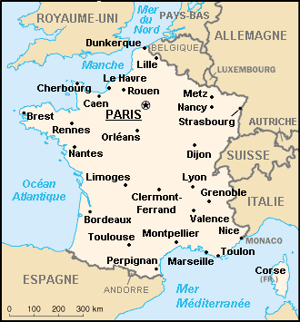
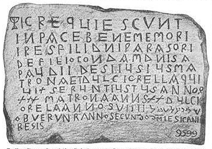
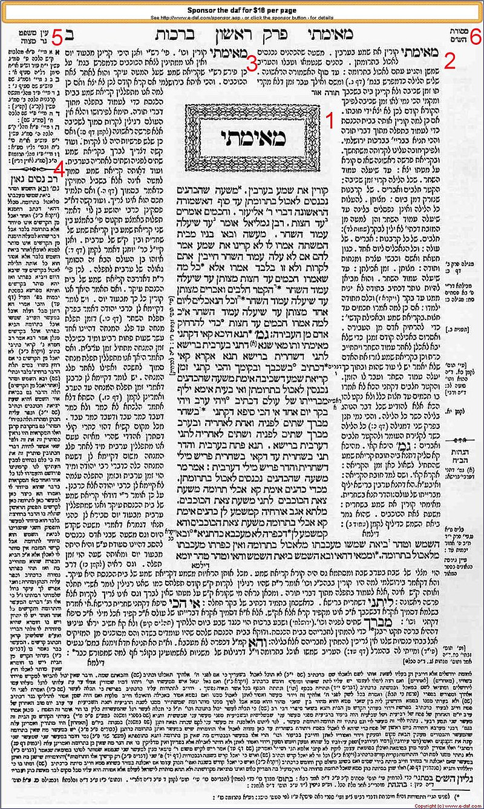
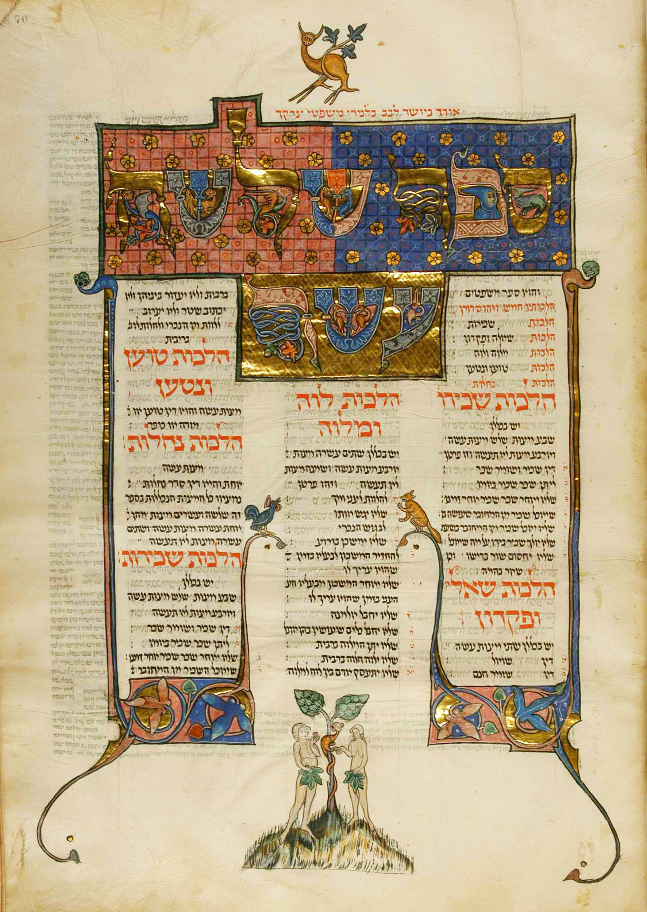

<u>תפוצות ישראל – יהדות צרפת</u>

<u>צרפת על רגל אחת</u>

בתקופת הרומאים ישבו בצרפת עם שנקרא "גאלים" (וארצם
גאליה), ממשפחת העמים הקלטיים הפגאנים שיישבו אז חלקים ממערב
אירופה.

יוליוס קיסר כובש את גאליה במאה הראשונה לספירה, והתושבים
מקבלים את השפה הלטינית והתרבות הרומית.

עם תחילת שקיעתה של רומי ופלישת העמים הגרמניים דרומה, בלט
שבט הפרנקים בפלישה והתיישבות בגאליה, הקים שם ממלכות שונות, קיבל עליו את
הנצרות, קבע את שמה של צרפת עד היום. (השם העברי מקורו בשם עיר על יד צידון
המוזכרת בימי אליהו הנביא וגם בספר עובדיה, שם השם מופיע ליד ספרד, ורש"י
קובע בפירושו לעובדיה שספרד היא אספמיה, וצרפת היא פְרַנְסָה).

ממלכות הפרנקים מתאחדות בשנת 771 תחת שלטונו של קרל הגדול,
שיוצר אימפריה משמעותית הכוללת את צרפת, חלקים מגרמניה וצפון איטליה.
שושלתו ממשיכה לשלוט עד שנת 1000 כמעט, אבל האימפריה מתפוררת (כרגיל), וכך
נוצרת צרפת הדומה לזו של היום. לקראת שנת 1000 עולה שושלת חדשה
(הקפטינגית), שמושלת בצרפת עד המהפכה הצרפתית, אך שליטתה באיזורים השונים,
לפעמים רופפת.

בימי הביניים המאוחרים, 1000 עד 1400 בערך, המשטר הוא
פיאודלי, והשלטון המרכזי חלש, לאחר מכן, המלוכה מצליחה לרכז את השלטון,
לשלטון אבסולוטי.

המפורסם ביותר כשליט אבסולוטי הוא לואי ה-14, ששלט מ 1638
עד 1715, ואמר "המדינה זה אני", וגם התכוון לכך.

בתקופה זו צרפת מתחילה להיות בעלת קולוניות באמריקה, אסיה
ואפריקה.

ב 1789 מתרחשת המהפכה הצרפתית. הרבה חלומות ל"חירות,
שוויון ואחווה", אך הדרדרות למשטר טרור, ואחריו דיקטטוריה של נפוליון
המגלומן, שהוביל את אירופה למלחמה טוטלית, ואת צרפת לתבוסה קשה. לאחר
תבוסתו ב 1815 חוזרת המלוכה לתקופה קצרה, שוב רפובליקה, נפוליון השלישי
כדיקטטור נוסף, ורפובליקה נוספת ב 1871, לאחר הפסד במלחמה עם
גרמניה.

במלחמת העולם הראשונה, צרפת נגד גרמניה ואוסטרו-הונגריה,
וכמעט מתמוטטת, אך התערבות ארה"ב מצילה אותה והיא עם המנצחות.

במלחמת העולם השנייה היא נכבשת במהירות על ידי גרמניה, חלק
קטן מצבאה בורח, בראשותו של שרל דה גול (ונקרא, "צבא צרפת החופשית"), ואילו
המרשל פטן נכנע ומקבל את החלק הדרומי של צרפת לשלטון עצמי, בחסות
הנאצים.

אחרי המלחמה, מפסידה צרפת את הקולוניות בהודו-סין ובצפון
אפריקה, וכל משבר מביא לשינוי חוקה. היום המשטר נקרא "הרפובליקה החמישית",
שבה לנשיא הנבחר יש סמכויות גדולות יחסית. ואם זו הרפובליקה החמישית
(כלומר, חוקה חמישית לרפובליקה), הרי היו ארבע תקופות של שלטון אבסולוטי
מאז המהפכה הצרפתית.

בצרפת היום כ 65 מיליון תושבים, חמישה מיליון מהגרים שרק
לשני מיליון מתוכם אזרחות צרפתית. 92% מתושביה הם צרפתים, קיימת הפרדת הדת
מהמדינה, אך יש מעל 5% מוסלמים. כ 40% מגדירים עצמם כחסרי דת, 41% קתולים,
6% נוצרים לא קתולים.

קרוב לחצי מיליון יהודים בצרפת.

מערכת החינוך הצרפתית אינה מכירה בדתות, כולל מנהגי לבוש
וחגים. יש מערכות חינוך פרטיות דתיות, אך הן לא ממומנות על ידי המדינה (פרט
לבתי ספר קתולים).

המטרה החינוכית היא "תרבות צרפתית רפובליקנית,
דמוקרטית".

<u>יהדות צרפת</u>

אם נתחיל מהיום, יהדות צרפת היא השלישית מבחינת גודלה
המספרי, ביהדויות העולם, אחרי ישראל וארה"ב. קהילת צרפת מונה כחצי מיליון
יהודים, קרוב ל 1.5% מכלל אזרחי צרפת.

כאשר מדובר על היסטוריה, ובדרך כלל, על אלפיים השנים
האחרונות, יש תקופות רבות שצריך להבחין בין שני איזורים שונים: פרובנס,
האיזור שגובל באיטליה ובספרד, לאורך הים התיכון, ושלא תמיד היה תחת השלטון
הצרפתי, והאיזור הצפוני הקרוב יותר לגבול הגרמני, הכולל את הבירה פריז
ומגיע עד שטרסבורג.

מניחים שיהודים הגיעו לגאליה, היא צרפת, בזמן השלטון
הרומי, אך עדויות קיימות רק מהמאה הרביעית. העדויות הן דרך הערות של
בישופים נוצריים, או תקנות של הקיסרים.

במאה השישית, מוזכרים יהודים, בערים רבות וביניהן מרסיי
ונרבונה בפרובנס, אך גם פריס בצפון.

מצבה מהמאה השביעית מנרבונה, עם מנורה וכתובת "שלום על
ישראל" בעברית.

במשך כמאתיים שנה של שלטון קרל הגדול ושושלתו (החל מ 771)
משתפר מצב היהודים בצרפת. הקרולינגים העריכו את תרומת היהודים למסחר
הבינלאומי.

בתקופה שלאחר שנת 1000 מתגברת השפעת הכנסייה, מתגברת
האנטישמיות, ולקראת 1100 מתחילה תקופת מסעי הצלב. מכאן והלאה, במשך מאות
שנים לא כדאי ליהודי לגור בצרפת.

הגבלות שונות הוטלו על היהודים, כמו טלאי על הבגד במקומות
ציבוריים, מגבלות על בעלות על אדמות ועיסוק בחקלאות, על סוגים שונים של
מסחר ועוד. יהודים רבים פונים לעיסוק בכספים (חלפנות, הלוואה
בריבית).

ב 1182 המלך מגרש את היהודים מהאיזור שבשליטתו הישירה
(שלמזלם של היהודים היה חלק קטן מצרפת הפיאודלית), מחרים את בתיהם
ואדמותיהם, בתי הכנסת עוברים לרשות הכנסייה הקתולית, והם עוד נקנסים. והמצב
מחמיר כאשר המלכים מגבירים את שליטתם.

מתרבות פרעות בערים שונות, ועלילות דם.

ב 1242 שיא חדש, עם "שריפת התלמוד".

שריפת התלמוד בפריז נזכרת במסורת ישראל כאחד הרגעים הקשים
בתולדות ישראל.

מספר שנים קודם לכך, יהודי מומר, ניקולס דונין, שהפך לנזיר
פרנציסקני, כותב לאפיפיור גריגוריוס התשיעי מכתב עם האשמות כלפי התלמוד,
כמכיל גידופים כנגד ישו והנוצרים.

ב 1239 שולח האפיפיור הוראות לכמרים בצרפת ומדינות אחרות,
לאסוף את כל ספרי התלמוד (אז, כמובן, כתבי יד), לשמרם אצל הנזירים, כדי
שאנשי הכנסייה יבדקו את הכתוב בהם. לאחר מכן נערכה חקירה של רבנים.

יש לפחות שתי גירסאות על החקירה הזאת. הגירסה הלטינית של
האינקביזציה, שהיא כנראה הנכונה, היא שהאינקביזציה חקרה בנפרד שני רבנים
כדי להשוות בין גירסאותיהם. האחד הוא רבי יחיאל מפריז, שהיה ראש ישיבה שם,
והיה מ"בעלי התוספות" (נזכיר להלן), השני ר' יהודה ממילון.

גירסה אחרת, ממקורות יהודים, אומרת שהיה ויכוח פומבי בין
רבנים לחכמי נצרות.

כך או כך, הנוצרים צדקו בטענותיהם... וממילא ליהודים היה
קשה להכחיש שהתלמוד אמנם משמיץ את ישו והנוצרים באופן בוטה (היום קשה למצוא
בתלמוד את ההשמצות הקשות הללו, כגון, שישו נדון בגיהנום בצואה
רותחת).

התוצאה הייתה שריפה של 24 עגלות מלאות בכתבי יד של
התלמוד.

האירוע נחשב לאסון גדול ביותר. המהר"ם מרוטנברג (שבגרמניה)
כותב קינה בשם "שאלי שרופה באש", בסגנון יהודה הלוי ("ציון הלא תשאלי"),
המתחילה בפסוקים "שאלי שרופה באש לשלום אבליך, המתאוים שכון בחצר זבוליך"
ונמשכת לאורך שורות רבות כמו "זעקי בקול מר לצור על שברונך ועל חליך ולו
יזכור אהבת כלולותיך"...

הקינה נאמרת עד היום, על ידי יהודי אשכנז, בבוקר תשעה
באב.

במשך מספר שנים לא ניתן היה למצוא תלמוד בצרפת, יש טוענים
שהבכורה התורנית עברה אז מצרפת לגרמניה, וכן שר' משה מקוצי, כתב "ספר מצוות
גדול" עם פסיקות, שיחליפו את התלמוד.

לאחר מספר שנים, הסכים האפיפיור לאפשר כתיבת ספרי תלמוד עם
צנזורה. לכן, מבחינת המחקר, הדו"ח הכנסייתי על המשפט, נותן אפשרות לשחזר
פסוקי תלמוד שלא נמצאים היום.

האנטישמיות בצרפת לא פסקה, מהימים ההם ועד ימינו אלה. אך
עד המהפכה הצרפתית היו לה תוצאות מרות ביותר.

גירושים של יהודים מכל צרפת היו ב 1182, וב 1394 (עם
אפשרות לחזור בין השנים הללו בתנאים כאלה או אחרים), והיו עוד גירושים רבים
מאיזורים מסוימים, בתוך התקופה הזו.

בין 1346 ל 1353 השתוללה מגיפת דבר ("מגיפת המוות השחור")
באירופה. היהודים הואשמו בגרימתה. האפיפיור קלמנט הששי ניסה להגן על
היהודים וגינה אלימות כנגדם. בכל זאת 2000 יהודים נשרפו בשטרסבורג, ופרעות
ורצח היו בערים אחרות בצרפת, גרמניה וארצות סמוכות.

אחרי המהפכה הצרפתית (1789), מוענק ליהודים בצרפת, לראשונה
בהיסטוריה האירופאית, שוויון זכויות אזרחי מלא, כאשר מציע החוק באסיפה
הלאומית טובע את הסיסמה: "אין להעניק ליהודים שום
דבר כאומה, ויש להעניק להם הכול כפרטים". (בדיוק
כמו הסיסמה בישראל כלפי ערבים ישראלים), והמטרה הייתה (בעיקר בתקופת
נפוליון) לגרום ליהודים להתבולל (וזה לא כמו בישראל). גישה שהצליחה במידה
מסוימת.

אך האנטישמיות לא פסקה, והיכרנו אותה היטב במשפט דרייפוס
(1894), כאשר אשמת בגידה (שמפקדי הצבא ידעו מי האשם בה) הוטלה על הקצין
היהודי בעל הדרגה הגבוהה ביותר.

שנים של מאבק ציבורי ומשפטי עברו עד זיכויו. והרצל הפך
ציוני בזכותו...

בתקופת המשפט היו גם פרעות בכל רחבי צרפת, אלא שאלו כבר
היו ברמה שהיום קוראים להם "אירועים אנטישמיים". זריקות אבנים, התנכלויות
לרכוש יהודי, ולפעמים ליהודים בודדים. השלטונות דיכאו אותם.

ב 1860 הוקם ארגון "כל ישראל חברים" (אליאנס) שמטרתו להגן
על זכויות היהודים, בעיקר בנושאי חינוך.

בראשית המאה העשרים חיו כתשעים אלף יהודים בצרפת, שהגיעו
קרוב לשלוש מאות אלף לפני השואה. בשנים אלה, היהודים כבר שותפים בחברה
הצרפתית בכל.

<u>השואה בצרפת</u>

לפני מלחמת העולם השנייה היו בצרפת יותר מ 300 אלף יהודים,
רק חצי מהם ילידי הארץ, מפני שצרפת הייתה ארץ הגירה, בעיקר ממזרח אירופה,
ולא רק ליהודים.

מעל שבעים אלף מיהודי צרפת נרצחו בשואה.

לאחר כיבושה המהיר של צרפת על ידי גרמניה, היא חולקה לצפון
הכבוש באופן ישיר, והדרום הנשלט על ידי ממשלת בובות בראשות הגנרל פטן,
שבירתה וישי. גם ממשלת פטן צייתה לגרמנים בחקיקה אנטישמית (בין השאר ביטול
חוק השוויון האזרחי של המהפכה הצרפתית). רדיפות היהודים נמשכו בכל צרפת,
וגם הוקמו מחנות ריכוז (הידוע בהם מחנה דראנסי מצפון לפריז). בשלב מסוים
החלו משלוחים לאושוויץ.

אבל ככל שנמשך הכיבוש, והתחילו משלוחי יהודים, גברה
ההתנגדות הפנימית האקטיבית והפסיבית של הצרפתים. ארגונים שלמים של יהודים
וצרפתים מילטו יהודים דרומה לאיזור וישי, וגם לשוויץ ולספרד.

אפשר שרבים מיהודי צרפת באמצע המאה העשרים, היו יותר
מתבוללים ולכן קשים יותר לזיהוי, ולכן קל היה יותר למלט אותם, או להחביא
אותם. אבל, אין ספק שיחס האוכלוסיה לגירוש היהודים היה בעל משקל משמעותי
לגבי מספר הניצולים. עם זאת, צריך גם להביא בחשבון, שהדיכוי הנאצי במערב
אירופה היה פחות דורסני מאשר במזרח, וגם זה איפשר יתר חופש פעולה לארגונים
שניסו להציל יהודים.

<u>יהדות צרפת היום</u>

אחרי השואה היגרו מספר גדול של עקורים ממזרח אירופה
לצרפת.

בשנות החמישים הגיעו אליה קרוב לעשרים אלף מיהודי
מצרים.

עם סיום השליטה הצרפתית בצפון אפריקה הגיעו אליה כ 400 אלף
יהודים, בעיקר מאלג'יר אך גם ממרוקו ותוניס.

כך שבשנות הששים של המאה העשרים, הקהילה בצרפת היא יותר
ספרדית מאשר אשכנזית.

קיימת מגמת התבוללות ברורה, אפילו אצל הדור השני של יורדים
מישראל.

על מידת השתלבותם של יהודי צרפת תעיד אפילו העובדה, שבמאה
העשרים היו חמישה ראשי ממשלות יהודים בצרפת, הראשון בהם לאון בלום (תקופות
קצרות מ 1936), שעל שמו כפר בלום.

יחד עם זה היו וישנם גם גלי עלייה לישראל, בעיקר כתגובה על
האנטישמיות.

בשנים האחרונות עלו כאלפיים עד ארבעת אלפים יהודים מצרפת
כל שנה. בארץ נמצאים כ 80 אלף מעולי צרפת, והרבה יותר ממוצא צרפתי.

<u>צרפת כמרכז תורני בימי הביניים</u>

התרבות היהודית באשכנז, מתפתחת במקביל לתרבות היהודית
בספרד, החל מהמאה התשיעית לספירה. אבל, התרבות היהודית בספרד, הייתה רחבת
אופקים, פתוחה, ומושפעת מהתרבות של סביבתה (בעיקר התרבות הערבית). היא כללה
בנוסף ליסודות הדתיים, גם שירה חילונית, מתמטיקה, אסטרונומיה
ופילוסופיה.

לעומתה, התרבות היהודית בצפון צרפת עד האמנסיפציה (שוויון
הזכויות) היא בעיקרה, תרבות תורנית סגורה, וצמודה יותר למסורת הדתית
שהתפתחה בארץ ישראל ובבבל, לתלמודים ולמדרשים של האלף הראשון.

בפרובנס יש התפתחויות אחרות (בהמשך).

מובן שהדמות המרכזית, מעין "אב קדמון" של התרבות התורנית
בצרפת, הוא רש"י, ר' שלמה יצחקי, שחי בין 1040 ל 1105, נולד ופעל בעיר
טרויש (הנקראת היום טרואה), כמאה וחמישים ק"מ מערב ממרכז פריז. כנראה
התפרנס ממסחר ולא מתפקיד רבני.

החומר עליו נלקח מאתר הספריה הלאומית

<https://www.nli.org.il/he/discover/judaism/figures/rashi>

את השכלתו התורנית הוא מקבל בישיבות גרמניה שאינן רחוקות.
כלומר, המרכז התורני שם קדם לזה של צרפת, אך כנראה לא בשנים רבות.

רש"י מקים ממש "אימפריה" של פרשנות של המקורות הקדומים.
הוא עצמו מפרש את כל התנ"ך, את כל התלמוד הבבלי, מחבר קינות ופיוטים, וגם
עונה בתשובות לשאלות שהזמן גרמן. פירושיו נחשבים לפשוטים ונוחים להבנה,
ולכן לומדים אותם עד היום. הוא מסתמך הרבה על חז"ל, גם במדרשי האגדה, ומפרש
מילים גם על ידי תרגומם לצרפתית של זמנו.

הנה דוגמה לתשובה של רש"י מתוך ספר "תשובות רש"י" שכנראה,
לוקטו מחכמים מאוחרים המצטטים אותו:
[Hebrewbooks_org_1734.pdf](file:///C:\Users\User\Downloads\Hebrewbooks_org_1734.pdf)

"וששאלתם, נכרי שהיה עובר בצד יינו של ישראל ונגעו בגדיו
ביין בלא כוונה. אם דמי להאי דנחית ולולבא בידיה ואסור בשתיה. או שרי,
הואיל והיה לבוש בגדיו ולא היה אוחזן בידו. בגדי נכרי שנגעו ביין שלא
בכוונה, אומר אני, שהוא מותר, שלא מצינו דוגמתו לאיסור."

חומרות היין מלוות אותנו עד היום במדינת ישראל.

לרש"י לא היו בנים, אלא ארבע בנות, אך חתניו, ורבים
מנכדיו, ניניו והלאה היו בסיס לקבוצה גדולה של רבנים, שפעלו במערב אירופה
במאות ה-12 וה-13, ומכונים "בעלי התוספות". כלומר, אלו שהוסיפו על פרשנות
התלמוד.

באתר הבא ניתן לראות את השושלת המשפחתית של רש"י.

<https://he.wikipedia.org/wiki/%D7%A9%D7%9E%D7%A9%D7%95%D7%9F_%D7%9E%D7%A9%D7%90%D7%A0%D7%A5#:~:text=%D7%99%D7%A6%D7%97%D7%A7%20%D7%94%D7%A6%D7%A8%D7%A4%D7%AA%D7%99,%D7%A8%D7%91%D7%99%20%D7%A9%D7%9E%D7%95%D7%90%D7%9C%20%D7%9E%D7%A2%D7%9B%D7%95>

אולי המפורסמים ביניהם, מבעלי התוספות שהם גם מהשושלת של
רש"י, הם הרשב"ם, רבנו תם (רשום ר"ת), הר"י הזקן (רבי יצחק בן שמואל
מדמפייר).

ידוע גם שמשון משאנץ, שעלה לישראל בסוף ימיו יחד עם ר'
יהונתן מלוניל, ועם 300 רבנים בעלייה המכונה "עליית בעלי התוספות" בערך ב
1210. חלקם התיישב בעכו, ושמשון משאנץ קבור בחיפה (כי עכו אינה בתחומי
א"י...).

אולם בעלי התוספות אינם, כמובן, רק ממשפחת רש"י, הנה תיאור
מתומצת מהויקיפדיה:  
בעלי התוספות הוא כינוי למספר רב (כמה מאות) של [תלמידי
חכמים](https://he.wikipedia.org/wiki/%D7%AA%D7%9C%D7%9E%D7%99%D7%93_%D7%97%D7%9B%D7%9D) שלקחו
חלק בכתיבת פירושים,
המכונים [תוספות](https://he.wikipedia.org/wiki/%D7%AA%D7%95%D7%A1%D7%A4%D7%95%D7%AA),
על 30
מ[מסכתות](https://he.wikipedia.org/wiki/%D7%9E%D7%A1%D7%9B%D7%AA) ה[תלמוד
הבבלי](https://he.wikipedia.org/wiki/%D7%AA%D7%9C%D7%9E%D7%95%D7%93_%D7%94%D7%91%D7%91%D7%9C%D7%99),
ועל [פירוש רש"י
לתלמוד](https://he.wikipedia.org/wiki/%D7%A4%D7%99%D7%A8%D7%95%D7%A9_%D7%A8%D7%A9%22%D7%99_%D7%9C%D7%AA%D7%9C%D7%9E%D7%95%D7%93).
הם יצרו ופעלו במשך כמאתיים שנה, במאות [השתים
עשרה](https://he.wikipedia.org/wiki/%D7%94%D7%9E%D7%90%D7%94_%D7%94-12) ו[השלוש
עשרה](https://he.wikipedia.org/wiki/%D7%94%D7%9E%D7%90%D7%94_%D7%94-13).
מרביתם מחוג
תלמידי [רש"י](https://he.wikipedia.org/wiki/%D7%A8%D7%A9%22%D7%99) ב[אשכנז](https://he.wikipedia.org/wiki/%D7%90%D7%A9%D7%9B%D7%A0%D7%96) וב[צרפת](https://he.wikipedia.org/wiki/%D7%99%D7%94%D7%93%D7%95%D7%AA_%D7%A6%D7%A8%D7%A4%D7%AA),
ומיעוטם
ב[אנגליה](https://he.wikipedia.org/wiki/%D7%99%D7%94%D7%93%D7%95%D7%AA_%D7%90%D7%A0%D7%92%D7%9C%D7%99%D7%94) וב[איטליה](https://he.wikipedia.org/wiki/%D7%99%D7%94%D7%93%D7%95%D7%AA_%D7%90%D7%99%D7%98%D7%9C%D7%99%D7%94).
ראשונים היו
תלמידי [רש"י](https://he.wikipedia.org/wiki/%D7%A8%D7%A9%22%D7%99),
שכתבו הערות וחידושים לפירושו. במשך הזמן התרחבו וגדלו
תוספות אלה, עד שהיו
ל[תוספות](https://he.wikipedia.org/wiki/%D7%AA%D7%95%D7%A1%D7%A4%D7%95%D7%AA) לתלמוד.

כך נראה דף בתלמוד הבבלי היום, כאשר המרכז הוא הטקסט
המקורי של התלמוד, בצד אחד פירוש רש"י, ובצד מולו פירושי בעלי התוספות. בצד
החיצוני פירוש של רב נוסף השונה ממסכת למסכת. ועוד הערות...

הכיוון הוא לא ימין ושמאל, אלא פנים (קרוב לכריכה) וחוץ.  
יש למעלה מ 1600 דפים כאלה, ולכן אפשר ללמוד כל החיים...

אבל, אם נחזור לבעלי התוספות, כך מעיד ר' שלמה לוריא,
פולין, המאה ה-16:

חכמי הצרפתים בעלי התוספות שעשאוהו אותו ככדור אחד, ועליהם
נאמר "דברי חכמים כדרבונות", הפכוהו וגלגלוהו ממקום למקום, עד שנראה לנו
כאחת, מבלי סותר ומבלי עוקר, לא סוגיא זו אומרת ככה וסוגיא זו אומרת ככה
ולא קרב זה אל זה, ונמצא מיושר התלמוד ומקושר.

ובמושגינו, צריך להעיר בקשר לכך, שהתלמוד ברובו אינו
פסיקות, אלא דיונים, מעורבים עם אגדות או סיפורי מעשים כדוגמאות. לכן,
האתגר של הפרשנים, לעשותו אחיד.

הרמב"ם שפעל באותה תקופה, נקט בשיטה של התעלמות מהדיונים,
וקביעת פסיקות, וכך גם חכמים ספרדיים אחרים, כולל "שולחן ערוך" של יוסף
קארו והלאה. הרמב"ם כותב במשנה תורה, שאין צורך לחזור לתלמוד, אפשר להסתפק
בספרו...

אך האשכנזים (אולי בגלל שהם יקים) לא מסכימים. הם רואים
בתלמוד את הבסיס ההכרחי לכל פסיקה וחוזרים לפרקטיקת הדיונים שבו, בכל דור,
ואין פלא שהישיבות האשכנזיות עד היום עוסקות בתלמוד הבבלי, כמרכז
לימודן.

ולמרות הכל, ובמקרה בלבד, ראיתי באתר "הספרנים" של הספריה
הלאומית, מאמר על איורים בכתבי יד יהודים, ובו איור, של "משנה תורה" הרמב"ם
מצפון צרפת, משנת 1296

היום במוזיאון בבודפשט.

[https://blog.nli.org.il/sodot-adam_and_eve/](https://blog.nli.org.il/sodot-adam_and_eve/)

ולפיכך, היה שם גם מי שידע לצייר, ולא רק ללמוד
תורה...

<u>חכמי פרובנס</u>

צרפת גדולה למדי. ולכן אין פלא, שרש"י וביתו היו קרובים
יותר למרכז בגרמניה, ואילו חכמי פרובנס היו קרובים יותר למרכז בקטלוניה
(ברצלונה, גירונה).

מרכז חכמי פרובנס היה בעיר נרבונה. ונראה שלא פעם היה מתח
ביניהם ובין האשכנזים בצפון.

הנה למשל, מכתב מרבנו תם (נכדו של רש"י) לרבי משולם
מפרובנס:

"גם אשלח לחכמי עירך, אם יודו לקולותיך ולגרסותיך, ולמה
שאתה אינך בקי בדברי גאוני מלכות, ומלכות כל מקומות ישראל, ורב יהודאי, ורב
עמרם, ורב שר שלום, ור' אחאי, ופירוש רבנו חננאל, ומסכת סופרים, ופרקי דר'
אליעזר, ורבנן סבוראי, כי ידעתי כי אם היית בקי בהם, לא מלאך לבך להתריס
כנגדם, ואחרי שהורית, בוש אתה לחזור"

חכמי פרובנס, שכאמור, היו קרובים יותר למסורת הספרדית,
עסקו גם בפילוסופיה וגם ביצירה תורנית נועזת יותר, שהיא בסיס הקבלה. מניחים
שהקבלה נוצרה בפרובנס, שם הופיע "ספר הבהיר" שהוא הספר הקבלי העתיק ביותר
הידוע, ושם פעלו ר' יצחק סגי נהור, ור' אברהם בן יצחק (הראב"ד הראשון),
שידועים כמפתחי הקבלה.

אך הנושא מורכב, ועמום למדי.

בפילוסופיה של פרובאנס כדאי להזכיר את ידעיה הפניני בדארשי
(נפטר 1340). ממעריצי הרמב"ם שהתווכח עם הרשב"א מברצלונה כנגד החרם החלקי
שהטיל על לימודי הפילוסופיה. כתב ספרים מספר. ביניהם "בחינת עולם", ספר
מתחום המוסר על חיי העולם הזה וכיצד להגיע לחיי העולם הבא.

הנה קטע, המקדים את ר' נחמן מברסלב, ב"גשר צר
מאוד":

העולם ים זועף

רב מצולה

רחב ידים

והזמן גשר רעוע בנוי עליו.

ראשו אחוז בחבלי העדר

הקודם להוייתו

ותכליתו לראות בנועם מתמיד לאור באור פני המלך. \[אלוהים,
כמובן\].

ואתה בן אדם

על כרחך את חי

עובר עליו תמיד

מיום היותך לאיש

בהביטך קוצר המסלול

ואין דרך לנטות ימין ושמאל,

התתפאר ביד ושם?

בהציצך אבדון ומות לך חומה?

<u>יהודי צרפת המודרנית</u>

מאז תקופת ההשכלה, והאמנסיפציה של יהודי צרפת, אנחנו
מוצאים אישים יהודים בולטים בכל התרבות הצרפתית

הזכרנו כבר את אלפרד דרייפוס, נולד ב 1859 ונפטר ב 1935.
היה היהודי היחיד באותה תקופה, שהגיע למשרה במטה הכללי. נשפט ב 1895 על
בגידה, כמזימה אנטישמית, וזוכה רק ב 1904, לאחר מאבק קשה, שלו ושל אישים
צרפתיים ליברלים.

<u>אדולף כרמיה</u>

נולד ב 1796 ונפטר ב 1880.

היה מפעילי השמאל הצרפתי ודאג ליהודים וגם לנרדפים אחרים
על רקע פוליטי ודתי.

יחד עם משה מונטיפיורי פעל להצלת יהודי דמשק בעלילת הדם של
1840.

ב 1848 נתמנה לשר המשפטים בממשלת הרפובליקה השנייה.

ב 1860 היה בין מייסדי חברת 'כל ישראל חברים'.

ב 1870 , כשר משפטים, יזם את החוק למתן אזרחות צרפתית
ליהודי אלג'יר.

<u>הברון אדמונד ג'ימס דה רוטשילד (הנדיב
הידוע)</u>

נפטר ב 1934. נולד לענף הצרפתי של משפחת רוטשילד. רכש
השכלה יהודית וכללית. וכבר לאחר הפוגרומים ברוסיה ב 1881, הבין שאת בעיית
היהודים צריך לפתור בארץ ישראל.

השקיע כספים רבים במושבות של העלייה הראשונה שהוקמו על ידי
תנועת חובבי ציון, ולמעשה הציל אותן מהתפוררות. תרם לא רק כסף, אלא גם
מומחים, וגם ניהול, עד כדי שליטה שלפעמים הביאה להתמרמרות. אין ספק שתרומתו
לתחילת היישוב בארץ הייתה בעלת משמעות גדולה ביותר, וגם אחר כך תרם, הוא
ומשפחתו אחיו למפעלים רבים בארץ.

<u>לאון בלום</u>

נולד בפריז ב 1872.

למד משפטים בסורבון, והיה למבקר ספרות. נכנס לחיים
הפוליטיים בעקבות פרשת דרייפוס, והתחבר עם ז'אן ז'ורס, ממנהיגי
הסוציאליסטים.

ב 1919 היה חבר פרלמנט, והפך ראש ממשלה ב 1936, וזכה
להערות אנטישמיות כבר בהשבעת ממשלתו. שרת כראש ממשלה שתי תקופות קצרות עד
הכיבוש הגרמני של צרפת.

נאסר על ידי הגרמנים ונשלח לבוכנוואלד, אך שרד ושוחרר ב
1945.

עמד שוב בראש ממשלה זמנית במשך כשנה, עד שנבחר נשיא לפי
החוקה החדשה.

ב 1948 התייעצו איתו שניים מראשי מפא"י אם נכון להכריז על
הקמת המדינה, והוא הדגיש שאסור להחמיץ את ההזדמנות. נפטר ב 1950.

<u>הרב יהודא ליאון אשכנזי (המכונה מניטו).</u>

היה הרב הראשי האחרון באלג'יריה. אך למד גם בישיבה וגם
באוניברסיטה באלג'יר. שרת בלגיון הזרים, ולאחר מלחמת העולם היגר
לצרפת.

עמד בראש בית ספר למנהיגות יהודית באורסיי והיה פעיל
ב"אסכולת פריז למחשבת ישראל". עלה לישראל לאחר 1967 והקים את מרכז יאיר
ללימודי יהדות וארץ ישראל. נפטר ב 1997. כתב ספרים רבים.

תורתו היא ניסיון לחבר בין מסורת ישראל לעולם המושגים
המערבי המודרני. לכן הוא פופולרי מאוד היום בין אנשים משכילים ומתונים מקרב
הציונות הדתית.

<u>עמנואל לוינס</u>

יליד ליטא 1906, אך בהתבגרותו עבר לצרפת, וב 1930 אחרי
שלמד פילוסופיה מגדולי הפילוסופים הגרמניים, הפך אזרח צרפתי.

גויס לצבא הצרפתי במלחמת העולם השנייה, נשבה על ידי
הגרמנים, אך ניצל מפני שהנאצים התייחסו לשבויים מהמערב לפי אמנת ז'נבה
(פחות או יותר...).

משפחתו בליטא נרצחה בשואה.

היה מנהל בית ספר למורים, ואחר כך מרצה
באוניברסיטה.

שיטתו הפילוסופית היא תורת מוסר קיצונית ההופכת את "האחר"
למרכז.

השפיע רבות על הפילוסופים הצרפתיים של סוף המאה העשרים.
נפטר ב 1995.

והיו עוד פילוסופים יהודים, וסופרים, ומדענים, וציירים,
וראשי ממשלה יהודים, וכל אלה מעידים על השתלבות יהודי צרפת במדינה, למרות
שהאנטישמיות הייתה תמיד, ואולי מתגברת היום בהשפעת מוסלמים
קיצוניים.
