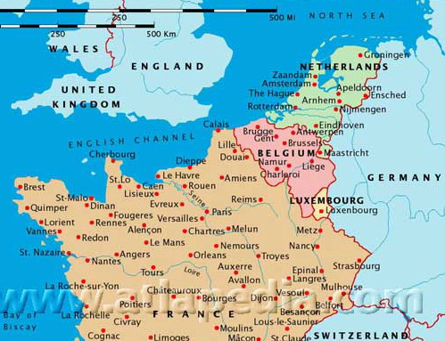
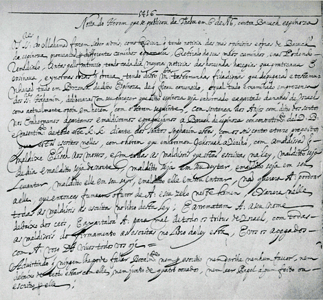
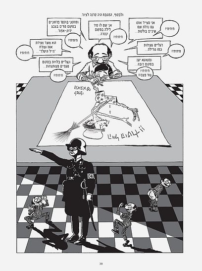

<u>תפוצות ישראל – יהדות ארצות השפלה</u>

<u>ארצות השפלה על רגל אחת</u>

ארצות השפלה היום הן המדינות הולנד, בלגיה ולוקסנבורג.
גיאוגרפית הן כלואות בין צרפת ובין גרמניה, וגם היסטורית, השלטון בהן עבר
מיד ליד, ולכן הן עצמאיות היום.

הרומאים כבשו, כידוע את גליה (צרפת), וגם את האיזור הזה
ואת דרום גרמניה.

כבר אז ארצות השפלה סופחו תחילה לפרובינציה גליה, ומאוחר
יותר לפרובינציה של דרום גרמניה. במקום ישבו אז שבטים גרמאנים שונים, והם
היו ביחסים טובים עם הכובש הרומאי, ולפחות מאחד השבטים הצטרפו רבים לצבא
הרומאי.

הרומאים בנו שם ערים, והביאו למקום פיתוח טכנולוגי ואפילו
את הכתב.

עם תבוסת הרומאים התחלק האיזור בין שלטון קרל הגדול
הצרפתי, ובין שלטון עצמאי. מאוחר יותר שלטו בו חלק משליטי גרמניה.

לקראת סוף האלף הראשון , הויקינגים שפושטים על כל אירופה
משתלטים על רובה של הולנד. את הויקינגים מגרש היינריך הראשון מלך גרמניה
בשנת 920.

לאחר מכן האיזור הוא חלק מממלכות גרמניות כמה מאות שנים.
אולם תקופה זו ראויה לציון בגלל התפתחות גדולה בתחום החקלאות, הגילדות
המקצועיות והמסחר. במערב הולנד החל תהליך של ייבוש אדמות ביצה והרחבת
השטחים החקלאיים. תהליך זה התחיל במאה ה-13 ונמשך עד ימינו. אנחנו קיבלנו
ממנו את המושג "לשים אצבע בסכר" על פי סיפור של הילד שהציל את האדמות
שיובשו מהצפה, תוך בניית סכרים.

תקופת ימי הביניים היא תקופה פיאודלית, של עצמאות יחסית של
האצילים המקומיים השולטים בכפריים. אחרי שנת 1400 מצליח דוכס בורגונדיה
(איזור במרכז צרפת) לשלוט על רוב השטח של הולנד ובלגיה, ולמעשה מאז מתחילה
להיווצר האומה ההולנדית. בתקופה זו הופך נמל אמסטרדם לנמל החשוב באירופה
למסחר בדגנים, ואיזורים שונים בבלגיה זוכים לשגשוג רב בסחר טקסטיל, וגם
אנטוורפן הופכת לעיר נמל חשובה.

אך אחרי 1500, עובר האיזור כולו, על ידי קצת מלחמות וקצת
פוליטיקה לשלטון ספרדי. ספרד, כידוע, היא קתולית, ולאינקויזיציה מעמד חשוב
בה, לעומת זה ההולנדים בתקופה זו מצטרפים לפרוטסטנטים, לזרם הקלוויניסטי.
וזו אחת הסיבות למרד שהתחיל נגד פיליפה מלך ספרד, ושנמשך שמונים
שנה.

ספר יפה המטפל בדרך ספרותית בתקופה קשה זו של מלחמת שמונים
השנה, הוא "טיל אולנשפיגל" בגירסה שכתב הסופר הבלגי שארל דה קוסטר (תרגם
אברהם שלונסקי). במקור הדמות היא דמות של ליצן ערמומי המערים על רבים (משהו
כמו הירשלה שלנו, או ג'וחא הערבי, או נאסר א-דין בבוכרה). אך דה קוסטר מנצל
את דמותו כדי לייצר גיבור המסייע למורדי ארצות השפלה נגד הספרדים ונגד
האינקויזיציה שלהם, במלחמת שמונים השנה.

שבעה מחוזות התאחדו במלחמת שמונים השנה, ועד 1648, הולנד
הקלויניסטית הופכת עצמאית, ובלגיה הקתולית נשארת בשלטון הספרדי.

במאה ה-17 הופכת הולנד למעצמה מסחרית ימית. בין השאר פורח
מסחר העבדים. התחרות על הים והקולוניות מביאה למלחמות בין הולנד לאנגליה
ולצרפת.

במאה ה-18 יורדת הולנד מגדולתה. בתחילת המאה ה-19,
נפוליאון משחרר את בלגיה מהספרדים ומצרף אותה להולנד אך כבר ב 1830, הבלגים
נפרדים מהולנד ומקימים בלגיה העצמאית.

במלחמת העולם השנייה נכבשו שתי המדינות במהירות על ידי
גרמניה הנאצית.

בלגיה שוחררה ב 1944 והולנד רק באמצע 1945.

בבלגיה כ 11 מיליון תושבים 60% פלמים דוברי הולנדית בצפון,
30% וולונים דוברי צרפתית בדרום ו 10% מעורבים בבריסל. קיים מתח ביניהם,
ובעיקר הפלמים רוצים פילוג.

כ 60% נוצרים קתולים, וכ 30% מגדירים עצמם חסרי דת. 5%
מוסלמים.

בהולנד כ 17 מיליון נפש. השפות הרשמיות הן פריזית והולנדית
(שתיהן שפות גרמאניות). הפריזית מדוברת בנוסף להולנדית במחוז אחד.

50% מההולנדים אינם דתיים. 24% קתולים ו 16% פרוטסטנטים.
5% מוסלמים.

יש להניח שהלא דתיים מוצאם פורטסטנטי בעיקר...

שתי המדינות במצב כלכלי טוב היום.

<u>יהדות הולנד</u>

לא ידוע הרבה על יהודים בהולנד בימי הביניים. ברור שהיו,
ספק אם היו הרבה, העדויות לכך הן מהספרות והשירה ההולנדית העוסקת ביהודים,
כמובן, מתוך עוינות. אבל, הואיל והיהודים כבר ידועים כאחראים למותו של ישו,
לא ברור אם ההתייחסות הרבה אליהם קשורה בנוכחותם במדינה... ברור שגם המעטים
שחיו שם סבלו קשות בתקופת המגיפה השחורה (1350) מפרעות, הוצאות להורג,
גירושים מקומיים.

התיישבות יהודית משמעותית מתחילה לאחר גירוש ספרד
ופורטוגל, ותחילתה בהתיישבות של אנוסים מפורטוגל לאחר 1500. גם אם לא יכלו
לשוב ליהדות שם, בארץ פרוטסטנטית (או לוחמת), היה קל יותר להתמודד עם
האינקויזיציה. בעיקר, הצליחו היהודים להתפרנס יפה הן מן המסחר שהתפתח, והן
מהתעשיות המתפתחות ובעיקר תעשיית היהלומים.

במיוחד פורחת קהילת האנוסים החוזרים ליהדות, לאחר 1619,
כאשר הולנד מאפשרת ליהודים לקיים את דתם בגלוי.

הקהילה היהודית הספרדית בהולנד הייתה אחת הקהילות המשגשגות
ביותר באירופה בשנים אלו. יהודים היו שותפים ב"חברת הודו המזרחית ההולנדית"
שבמאה הזאת שלטה במסחר הבינלאומי. כבר ב 1657 הכריז שליט הולנד שהיהודים הם
נתינים שווי זכויות.

ואם אין צרות מבחוץ, יש מבית. גם ליהודים יש כופרים. שני
כופרים ידועים, אוריאל אקוסטא וברוך שפינוזה, נזכיר להלן.

במאה ה -18 סבלו היהודים מירידה כלכלית כנראה כתוצאה של
שלטונה של צרפת בהולנד, או, פשוט, כמו שהזכרנו, שהולנד יורד מגדולתה. ייתכן
גם כתוצאה מהגירה גדולה של יהודים אשכנזים חסרי כל שהגיעו כתוצאה מרדיפות,
והיוו עומס על הקהילה המקומית.

אך שוב בסוף המאה מוכרז שוויון זכויות ליהודים, ולאחר 1800
כבר רוב יהודי הולנד הם אשכנזים. הספרדים (גם פורטוגזים הם ספרדים...)
הגיעו לאחר גירוש ספרד, אך מאז, ובתקופת השגשוג זרמו אליה יהודי
אשכנז.

לפני מלחמת העולם השניה נמצאים בהולנד כ 140 אלף יהודים,
ואחר כך נוספים עוד פליטים מגרמניה. רוב יהודי הולנד נרצחו.

היום קשה להעריך את מספר היהודים בהולנד, בגלל ההתבוללות
הרבה, או לפחות, חוסר הקשר לקהילות דרך בתי הכנסת. אין סעיף לאום או דת
בתעודת הזהות. מניחים שגרים שם עשרת אלפים ישראלים יורדים, ובערך פי שלושה
יהודים מקומיים.

<u>יהדות בלגיה</u>

גורלה של יהדות בלגיה שונה מזה של יהדות הולנד בגלל
הנסיבות ההיסטוריות. הולנד השתחררה מספרד, מהאינקויזיציה, ומהקתוליות הרבה
לפני בלגיה, ולכן הקהילה בבלגיה הייתה קהילת אנוסים בתקופות שבהולנד כבר
היו קהילות גלויות של יהודים.

גורלה של הקהילה בבלגיה בשואה, היה טוב יותר, ו"רק" מחצית
מיהודי בלגיה נרצחו לעומת למעלה מה 80% יהודי הולנד, ועל כך נפרט
בהמשך.

את ההיסטוריה נתאר דרך מאמר של חיים גיוזלי באתר "אנו", על
הקהילה באנטוורפן, ששנים רבות הייתה הקהילה המשמעותית בבלגיה.

דווקא באנטוורפן יש עדויות לנוכחות יהודים בתקופה עתיקה
יותר:

מרקיז אנטוורפן, הנרי השלישי רוצה לגרש את היהודים ב 1261,
כי הם "מלווים בריבית קצוצה". הוא נפטר, ואלמנתו מתייעצת עם תומאס מאקווינס
(תיאולוג נוצרי גדול בתקופה זו), והוא ממליץ לה לגרום ליהודים לעסוק
בעיסוקים אחרים...

אבל הקהילה התחסלה בעקבות המגיפה השחורה ב 1350.

לאחר 1500 (גירוש ספרד ופורטוגל) מתיישבים באנטוורפן
אנוסים (אז הם נקראו נוצרים חדשים). שתי סיבות טובות לכך: ההתפתחות המסחרית
של העיר, והעובדה שלמרות השליטה הספרדית, האינקויזיציה לא הורשתה לפעול
בעיר.

דרך העיר עברו גם דונה גרציה, ואחיינה דון יוסף נשיא,
המפורסמים, שבסופו של דבר הגיעו לארצות העות'מנים.

ידוע גם רופא מפורסם אמאטוס לוסיטאנוס, שאף הוזמן משם לחצר
המלך הצרפתי.

לקראת 1600, במלחמת שמונים השנה, נמלטו רוב היהודים מאימת
הספרדים, וגם אלו שחזרו לאחר הסכמי 1648, חיו תחת שלטון האינקויזציה
(נדגיש, שבלגיה נשארה בשלטון ספרד). בסוף המאה התגלו בתי כנסת חשאיים על
ידי רשויות העיר...

ב 1713 עובר השלטון לאוסטריה, אחר כך לצרפת, האינטרסים
הכלכליים גוברים על הקנאות הדתית, ויהודים מתיישבים כיהודים בעיר. מימשל
נפוליון ב 1794 מעניק אזרחות ליהודים, ועם זאת ב 1810, בכל בלגיה חיים פחות
מאלף יהודים.

עם עצמאות בלגיה בשנת 1830 זוכים היהודים לשוויון זכויות
מלא. ואם בתחילת המאה חיים באנטוורפן מאות יהודים, ב 1910 מספרם מגיע ל 16
אלף, ולפני השואה כחמישים אלף (מתוך 66 אלף יהודי בלגיה). הריבוי העיקרי
מהגירה מהמזרח. בתקופה זו תעשיית היהלומים ברובה בידיים יהודיות.

במאה העשרים יש באנטוורפן שלוש קהילות דתיות, תשע עשרה
תנועות נוער שונות, כמה מועדוני ספורט, יותר מחמישים כתבי עת יהודיים (רובם
באידיש).

בשואה נמחקה קהילה זו כמעט לחלוטין.

היום חיים בבלגיה כעשרים אלף יהודים, מחציתם באנטוורפן
ומחציתם בבריסל. גם היום ענף היהלומים מעסיק הרבה מיהודי אנטוורפן. כ 40%
מיהודי בלגיה חסידים, 40% אורתודוקסים מודרנים והשאר חילוניים.

<u>שואת יהודי הולנד ובלגיה</u>

מתוך 140 אלף יהודי הולנד נרצחו כ 108 אלף, קרוב ל 80%.
יותר מכל ארץ באירופה המערבית.

מתוך 65 אלף יהודי בלגיה נרצחו כ 29 אלף. קרוב ל
45%.

השואה הייתה נוראה בשתי המדינות אך נוראה בהרבה
בהולנד.

האם היה ההבדל במדיניות הגרמנית, או היה הבדל באופי העממי
של הציבור הלא יהודי. על כך מתמודדים מחקרים עד היום הזה.

בבלגיה יצרו הנאצים יודנרט ארצי שנקרא "איגוד יהודי בלגיה"
והשתמשו בו כדי לרשום את כל היהודים. נרשמו בו רק 47 אלף מתוך 65 אלף,
כלומר, לחלק ניכר לא היה אמון בארגון.

ב 1942 הוטלה גזירת הטלאי הצהוב. חלק מהממונים ברשויות
האזרחיות הבלגיות סירבו להפיץ אותו. באטנוורפן נגזרה הגזרה עוד ב 1940,
והמדיניות לא יושמה. אזרחים לא יהודים ענדו סרטי זרוע יהודיים
במחאה.

בסוף אוגוסט החלו משלוחים להשמדה. המלכה האם ניסתה להתערב,
ועיכבה במשהו. מצד שני חלק מהרשויות שיתפו פעולה עם הנאצים, ומתנדבים
פלמיים הלשינו על יהודים ובזזו את רכוש המגורשים.

לעומת זה הוקם ארגון מחתרתי להסתרת יהודים על ידי המחתרת
הבלגית "חזית העצמאות". הפעולה הידועה ביותר שלה היא עצירת רכבת "הטרנספורט
העשרים" לאושויץ, וכ 200 הצליחו להימלט ממנה, כאשר שלושת הצעירים שעצרו
אותה נעצרו.

גם הארכיהגמון הקתולי בבלגיה גינה את הרדיפות, והעמיד את
משאבי הכנסייה לצורך הסתרת יהודים.

בהולנד פעלו הנאצים כדרכם באופן הדרגתי ונחוש, החל מספטמבר
1940.

איסור על עיתונות יהודית, רישום עסקים יהודים, רישום כל
היהודים (מי שאחד מהורי הוריו יהודי). ב 1941 היו התפרעויות של המפלגה
הנאצית ההולנדית ברובע היהודי באמסטרדם, ויהודים יחד עם לא יהודים התגוננו
ואף הרגו נאצי מקומי. בתגובה נשלחו כ 400 יהודים למחנות ריכוז.

בשנה זו כבר בוצעה הפרדה בין יהודים ללא יהודים, גזילת
רכוש עסקי, והון. יהודים נשלחו לעבודות כפייה.

ב 1942 רוכזו יהודים במחנות ריכוז בתוך הולנד. כ 100 אלף
יהודים עברו את מחנה וסטרבורק בגבול הולנד גרמניה.

עד ספטמבר 1943 שולחו כל יהודי הולנד שהנאצים הצליחו לאתר,
למחנות ריכוז, רובם להשמדה.

מה היה חלקם של ההולנדים?

מצד אחד אין ספק שהיו אלפי חסידי אומות העולם שהסתירו
יהודים או עזרו להם להימלט. היו גם פעולות מחאה, של אזרחים ורשויות
הכנסייה.

כולנו יודעים את סיפורה של אנה פרנק.

מצד שני רבו מאוד גם משתפי הפעולה עם הנאצים שהלשינו על
יהודים. כולנו יודעים את סיפורה של אנה פרנק.

בפרט חלק גדול מההכנות לאיתור היהודים ושליחתם נעשה על ידי
פקידי ממשל הולנדיים.

ורוב האוכלוסיה ההולנדית הייתה אדישה לגירוש
היהודים.

בדרך כלל, מקובל שההבדל ברמת שיתוף הפעולה עם הנאצים בין
ההולנדים והבלגים החמיר את גורלה של יהדות הולנד, לעומת זו של
בלגיה.

<u>יהודים מפורסמים מארצות השפלה</u>

אי אפשר, כמובן, לדון ביהדות הולנד, מבלי להזכיר את ברוך
שפינוזה, שדמותו מהווה צומת היסטורי משמעותי בפילוספיה, בתיאולוגיה, ולמעשה
בתרבות המערב.

אבל לפניו נזכיר את אוריאל אקוסטה.

<u>אוריאל אקוסטה</u>

מתוך "סגולה" מגזין ישראלי להיסטוריה.

[https://segulamag.com/articles/uriel-de-costa/](https://segulamag.com/articles/uriel-de-costa/)

גבריאל דה-קוסטה פיוזה, נולד בפורטוגל ב 1583, לאב נוצרי,
ואם מצאצאי האנוסים ("מראנוס").

הוא למד באוניברסיטה שם, ואף שרת בתפקיד כנסייתי. במהלך
לימודיו למד הרבה תנ"ך, בא לידי כפירה בנצרות, והתחיל לראות עצמו
כיהודי.

מסיבות כלכליות דווקא, ברחה המשפחה לאמסטרדם ושם שבה
ליהדות כמו רבים מאנוסי פורטוגל. שם גם שינה את שמו לאוריאל דה
קוסטה.

אלא שכמו שהרהר אחרי הנצרות, ערער גם על היהדות הרבנית,
הואיל וכל השכלתו היהודית הקודמת הגיעה רק מהתנ"ך. הוא כתב בגלוי ספרים,
בהם הוא מסביר את התנגדותו ליהדות הרבנית. בשפתנו הוא היה פנדמנטליסט,
ואפילו קרוב לקראים שאותם לא הכיר.

הנה ציטוט מספרו "דוגמת חיי אדם":

אחרי עבור ימים מספר נוכחתי שהדינים והמנהגים של היהודים
מתאימים הם מעט מאוד לאותם החוקים שציווה לנו משה. בשעה שהתורה צריכה
להישמר בטהרתה ובדיוקה כפי המצווה בה, הנה אלה – שלשווא קוראים להם בשם
חכמי היהודים – המציאו המון דינים המתנגדים לה בהחלט.

מנהיגי הקהילה התייעצו עם הרב יהודה אריה ממודינה מוונציה,
והוא הביע התנגדות חריפה לאקוסטה ואף הטיל עליו חרם בוונציה ב 1618. העובדה
שאקוסטה הטיל ספק גם בהישארות הנפש, גרמה להתנגדות חמורה אליו גם בכנסייה
הנוצרית.

הוא התרחק מאמסטרדם, היו לו עסקים בהמבורג, ואחר כך גר חזר
לאמסטרדם, פרסם ספר, שרשויות העיר כלאו אותו בגללו לתקופה מסויימת, ועותקי
ספרו נשרפו.

ב 1629 שב לקהילה באמסטרדם שלמעשה לא הטילה עליו את החרם,
אך אחרי שלוש שנים מנהיגיה אישרו את החרם של קהילת וונציה.

שבע שנים אחר כך, אחרי מות אשתו, ניסה לחזור לקהילה. כך
הוא כותב:

"הלוא טוב לי כלפי חוץ עם האנשים האלה, לחקות מעשיהם
ולעשות כקוף בין הקופים"

אז היה צריך לעבור טקס שבו הוא מתוודה על חטאיו, מבקש
מחילה, סופג 39 מלקות, שוכב על מפתן בית הכנסת וכל בני הקהילה עוברים עליו.
הוא היה אז בן 53.

ההשפלה הייתה נוראה, וכך הוא כותב:

והנה ישפוט נא כל מי ששמע את כל הדברים האלה, מה נאמר
למחזה כזה, לראות איש זקן – שלגמרי איננו משפל המדרגה, והוא ביישן מטבעו
במידה שאין למעלה הימנה – נלקה בשר גופו הערום ברצועה קשה בפומבי, באספת
גברים, נשים ונערים, וכל זה בפקודת שופטים, כלומר ממין שכזה, שיותר שהם
שופטים הם עבדים שפלים.

כשנה אחר כך התאבד בירייה.

ספרו, "דוגמת חיי אדם" , שממנו הציטוטים, הוא המקור היחידי
לאירועים, והיו מי שערערו על מיהמנות הסיפור. אך מקרה דומה שתועד בקהילה,
מאשר את גירסתו.

<u>ברוך שפינוזה</u>

"כופר" ידוע הרבה יותר הוא ברוך, או בנדיקטוס,
שפינוזה.

הוא נולד ב 1632, למשפחה עשירה של אנוסים שחזרו ליהדות
באמסטרדם. הוא ניפטר בגיל 45, ונחשב לאחד מגדולי הפילוסופים בעת
החדשה.

בצעירותו למד תורה אצל מנשה בן ישראל, ואחר כך בישיבה. אך
בגיל 24 הוחרם על ידי פרנסי קהילת אמסטרדם. מעניין, שלא ידועה עד היום
הסיבה הממשית לחרם, אך כתב החרם, כתוב בפורטוגזית, מצוי ב"פנקס ההסכמות" של
הקהילה, הנמצא היום בארכיון העירוני של אמסטרדם. וזה תרגומו:

האדונים מן המעמד מודיעים לכבוד מעלתכם כי מאחר שמזה זמן
נמסר על דעותיו ומעשיו הרעים של ברוך דה אספינוזה, והם השתדלו בדרכים
ובהבטחות שונות להשיבו מדרכיו הרעות, אך לא עלה בידם לתקנו, ואדרבא, מידי
יום הגיעו לידיעתם ידיעות נוספות על כפירות נוראות שעשה והורה, ומעשים
מבעיתים שחולל, ויש בידם עדויות רבות ומהימנות שנמסרו כולן בנוכחות האדונים
החכמים. לכן, נמנו וגמרו על דעתם של אלה כי אספינוזה הנ"ל יוחרם וינודה
מעדת ישראל, והרי הם מטילים עליו את החרם הבא: "בגזירת עירין ובמימר קדישין
אנו מחרימים ומנדים ומאררין ומקללין את ברוך דה אספינוזה, על דעת המקום ועל
דעת הקהל הקדוש בספרי התורה האלו בשש מאות ושלוש עשרה מצוות הכתובות בו,
בחרם שהחרים יהושע את יריחו ובקללה שקלל אלישע את הנערים ובכל האלות
הכתובות בתורה. ארור הוא ביום וארור בלילה, ארור הוא בשוכבו וארור בקומו,
ארור בצאתו וארור בבואו. לא יאבה ה' סלוח לו כי אז יעשן אף ה' וקנאתו באיש
ההוא, ורבצה בו כל האלות הכתובה בספר התורה הזה ומחה את שמו מתחת השמים,
והבדילו ה' לרעה מכל שבטי ישראל ככל אלות הברית הכתובות בספר התורה הזה.
ואתם הדבקים בה' אלהיכם חיים כולכם היום". ואנו מתרים שאיש אינו רשאי
להתקשר עמו בעל פה או בכתב, ולא יסב לו טובה, ולא יחלוק עמו קורת גג ולא
יבוא בד' אמותיו ולא יקרא שום חיבור שעשה או כתב.

צריך להוסיף, שהחרם על שפינוזה לא הוסר מעולם. בפועל,
חרדים מחרימים אותו עד היום, וכך גם רבנים רבים, אם כי אורתודוקסים משכילים
בהחלט קוראים את כתביו.

הכנסיה כבר זיכתה את גלילאו... ואנחנו עוד מחכים.

ב 1924 הכריז אמנם יוסף קלוזנר:

במהלך הרצאה לציון 250 שנה למותו בשנת 1924 הכריז
ההיסטוריון וחוקר הספרות העברית יוסף קלוזנר מבין כותלי האוניברסיטה העברית
שהחרם על שפינוזה הותר בזאת: "לשפינוזה היהודי נקרא מאתיים וחמישים שנה
אחרי פטירתו, מעל רמת הר-הצופים, מתוך מקדש-המעט שלנו – האוניברסיטה העברית
בירושלים: – הותר החרם! סר עוון-היהדות נגדך וחטאתך לה תכופר! אחינו אתה,
אחינו אתה, אחינו אתה!"

אבל, זוהי הכרזה של תנועת ההשכלה, והציונות החילונית. גם
בן-גוריון אהב את שפינוזה...

כאמור, הסיבות המפורטות לחרם אינן נמצאות בכתב החרם, ולא
ברור מהן הכפירות הנוראות והמעשים המבעיתים שלו. חוקרים עוסקים בכך עד
היום.

לעומת זה, ידוע שכתביו הוחרמו לא רק על ידי היהודים, אלא
גם על ידי הממשלה ההולנדית, אפילו שנה אחרי מותו. למעשה, רק ספר אחד ידוע
שהתפרסם בימי חייו, "מאמר תיאולוגי מדיני". בספר זה קיימת ראשיתה של ביקורת
המקרא המודרנית. הוא טוען שהתורה נכתבה בידי אדם, ואף לא בידי משה, שחוקי
התורה התאימו לזמנם, ולכן אינם רלוונטים לזמננו, וכד'.

בספר זה, הוא מעיר דרך אגב, שייתכן ויבוא יום ועם ישראל
ישוב לארצו...

שפינוזה לא חזר לקהילה, התחבר עם נוצרים רדיקליים, אך לא
התנצר. הוצעה לו משרה באוניברסיטת היידלברג בתנאי שלא יפגע בדת הרשמית,
והוא סירב. התפרנס מליטוש עדשות, ואולי בגלל זה נפטר בגיל צעיר ממחלת
ריאות, יש אומרים משחפת.

בפילוסופיה שלו הוא לא הגדיר עצמו כאתיאיסט בשום אופן, אלא
נתן הגדרות לאלוהים שלא תאמו, כמובן, את הדתות המונותיאיסטיות.

החרם לא הוסר, הפילוסופיה שלו, כמו של כל פילוסוף, בויכוח
מתמיד, אבל מאתיים שנה אחר כך אומר הפילוסוף פרידריך הגל (שנחשב לגדול
ביותר בזמנו): "שפינוזה הוא אבן הראשה של הפילוסופיה המודרנית. בלי
השפינוזאים אין פילוסופיה כלל".

והפילוסוף הגרמני יעקבי אומר: "כל הפילוסופים, אם נלך
בדרכם בעקביות,יובילו באופן לוגי לשיטת שפינוזה". וכך גם פרופ' ירמיהו
יובל, בספרו "שפינוזה וכופרים אחרים".

גם אם יש הגזמה בהערצה לתורת שפינוזה, צריך להעיר כאן,
שחוקרים חדשים, רואים בפילוסופיה הזאת, את תחילת החילון, ויותר מכך, תולים
את תחילת החילון בעולם המודרני בתופעת האנוסים, או ליתר דיוק, בכפיית הדת
בכוח הזרוע.

הכיצד?

העובדה שעשרות אלפים או מאות אלפים של אנשים שהאמינו
באמונה אחת, נאלצו להאמין באמונה אחרת, כביכול, באותו האל, ולאחר שהמירו את
דתם עולם כמנהגו נהג, וחלקם אפילו מצבם השתפר, הביאה רבים לתחושה שאף אחד
מהאלים האלה לא קיים באמת, או, לפחות, כמו ששפינוזה התחיל בכך, האלוהים לא
דורש את מה שנציגיו דורשים בשמו. ובאמת, במאות הבאות אנחנו רואים מומרים
לצורך התקדמות חברתית, כלומר, חילוניים ברוחם.

כמובן שיהודים מפורסמים בהולנד היו רבים, מאז ימי שפינוזה
ועד ימינו, וניתן למצוא בויקיפדיה "קטגוריה: יהודים הולנדים". אך נזכיר
משהו מיהדות בלגיה.

<u>אמטוס לוזיטנוס</u>

הוזכר לעיל ונזכיר אותו כבלגי, למרות שבחייו חי בכמה
ארצות.

נולד בפורטוגל למשפחת אנוסים ב 1511, עזב מפחד
האינקויזיציה והתנכלויות לאנוסים, ועבר לאנטוורפן (היום בלגיה) בגיל 22.
עסק בבוטניקה וברפואה. הצטיין במיוחד ברפואה, וטיפל בין השאר בדונה גרציה,
בראש עיריית אנטוורפן, בקונסול הפורטוגזי. כמו כן פירסם שם את ספרו הראשון
בנושא בוטניקה רפואית, וגם ספרי סיכומים של חולים ומחלות.

משם נדד בערים שונות באיטליה, עבר לסלוניקי, שם חזר
ליהדות, ושם גם נפטר במגיפת דבר ב 1568.

הישגו הגדול ביותר במחקר רפואי היה גילוי המסתמים בורידים,
המאפשרים זרימה בכיוון אחד. הוא פרסם והוכיח את תגליתו, אך לא את המסקנה.
המסקנה היא שהדם זורם במחזור (ידוע לכולנו) ולא נספג ונוצר מחדש, כמו שקבע
אבי הרפואה גלנוס, והכנסייה קידשה... חוקרים צריכים להיזהר
מהשלטונות.

אמטוס כתב גם "שבועת רופא" משלו. הרי הקטע הראשון
ממנה:

אני נשבע בשמו
של [אלוהים](https://he.wikipedia.org/wiki/%D7%90%D7%9C%D7%95%D7%94%D7%99%D7%9D) הנצחי
הכל-יכול וב[עשרת
הדיברות](https://he.wikipedia.org/wiki/%D7%A2%D7%A9%D7%A8%D7%AA_%D7%94%D7%93%D7%99%D7%91%D7%A8%D7%95%D7%AA) הקדושות
שנתנו על [הר
סיני](https://he.wikipedia.org/wiki/%D7%94%D7%A8_%D7%A1%D7%99%D7%A0%D7%99) ל[משה](https://he.wikipedia.org/wiki/%D7%9E%D7%A9%D7%94) המחוקק,
שלעולם, בעת שליחותי הרפואית, לא חרגתי ממה שנמסר באמונה טובה לנו
ולזרענו; שמעולם לא עסקתי במעשי תעתועים, לעולם לא
שיניתי או הפרזתי בהערכה למען רווח כספי, שתמיד התאמצתי שלקחי עבודתי יעמדו
לטובת [המין
האנושי](https://he.wikipedia.org/wiki/%D7%94%D7%9E%D7%99%D7%9F_%D7%94%D7%90%D7%A0%D7%95%D7%A9%D7%99),

לא שיבחתי אף אחד ולא השמצתי אחר למען ענייני הפרטיים, אלא
רק כאשר האמת דרשה זאת.

אם דיברתי דברי כזב יכלו
אותי [אלוהים](https://he.wikipedia.org/wiki/%D7%90%D7%9C%D7%95%D7%94%D7%99%D7%9D) והמלאך
רפאל בזעמם הנצחי ומעתה והלאה לא ייתן אדם אמונו בי.

לא הייתי להוט אחר פיצוי עבור [טיפול
רפואי](https://he.wikipedia.org/wiki/%D7%98%D7%99%D7%A4%D7%95%D7%9C_%D7%A8%D7%A4%D7%95%D7%90%D7%99),
ואכן טיפלתי ברבים ללא קבלת כל תשלום, ולמרות זאת – במסירות.

...............

בקיצור, לא רק מדען רציני, אלא אדם בעל ערכים
נעלים.

וננסה לסיים בחיוך, אם גם עצוב.

<u>מישל קישקה</u>

מוגדר כקומיקסאי ישראלי, למעשה, מגדולי המאיירים
בארץ.

נולד ב 1954 בבלגיה. אביו יליד בריסל, בתקופת השואה האב
גורש לאושויץ עם משפחתו ושרד יחידי. אמו נמלטה עם משפחתה לשוויץ.

למרות שמישל ביטא את כשרונו הציורי מוקדם, הלך ללמוד הנדסת
בנין, ואחר כך אדריכלות. ההורים רוצים מקצוע אמיתי...

עלה לישראל ב 1974, בלי משפחתו, ולמד בבצלאל.

אייר עשרות רבות של ספרי ילדים ומבוגרים, צייר קריקטורות
לעיתונים רבים, וזכה בפרסים על הישגיו.

ספר מיוחד שלו הוא "הדור השני – דברים שלא סיפרתי
לאבא".

ספר זה, שכולו קומיקס, הוא, למעשה, אוטוביוגרפיה, שבמרכזה
יחסיו עם אביו, וביטוי השואה בחיי אביו, ובחייו שלו כבן לניצולים. מה מותר
להגיד ומה אסור, ואיך אסון אחר, פותח את הסיפור על השואה הנוראה.

עד כאן, יהדות ארצות השפלה.
