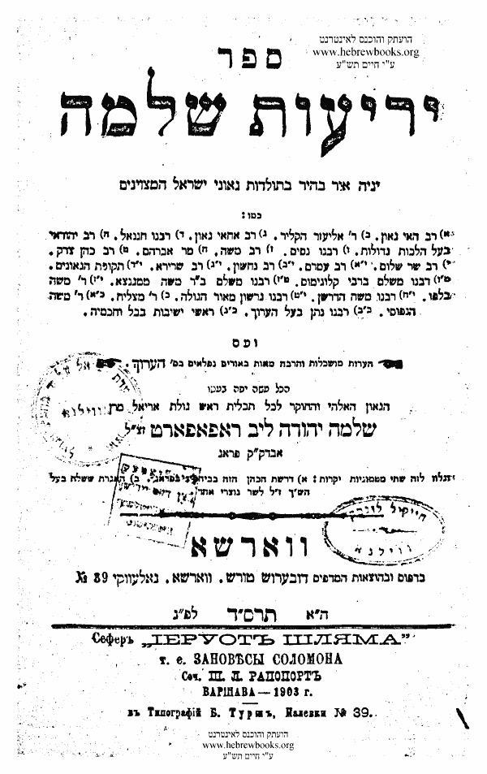
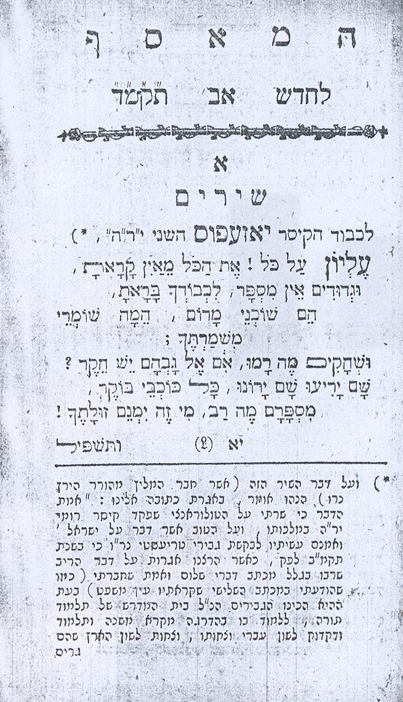
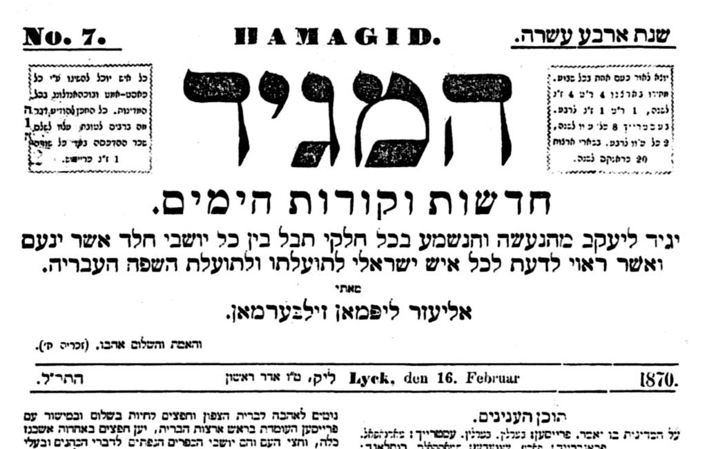
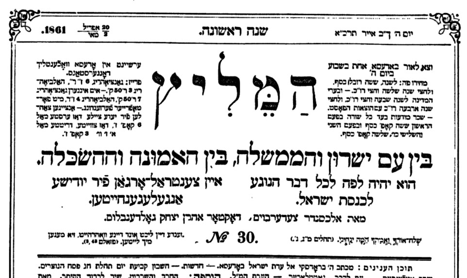
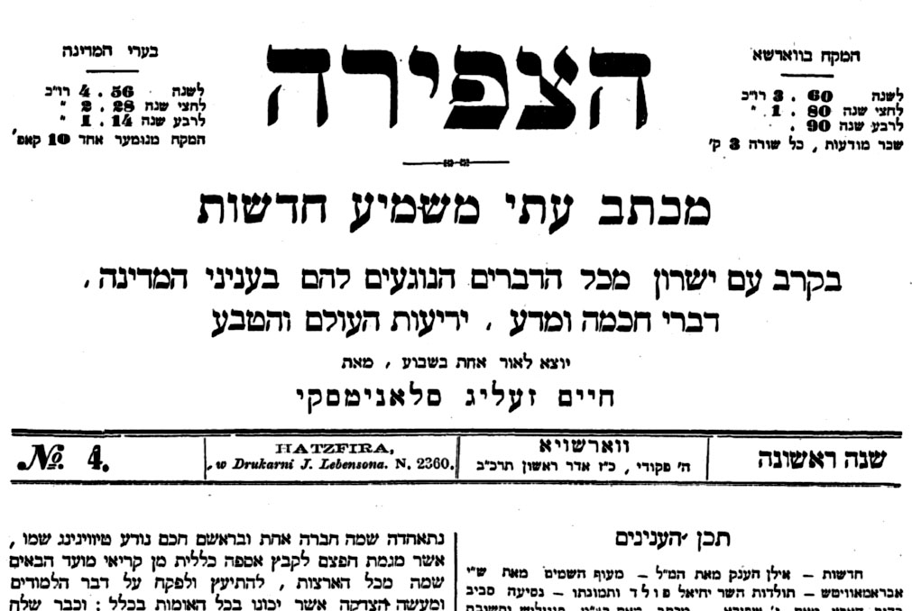

<u>תפוצות ישראל – השכלה</u>

תנועת ההשכלה היהודית קמה ממש באותו דור שבו נולדת תנועת
החסידות, בסוף המאה ה-18, וצמחה במקביל אליה. כמו כל תנועה, הגדרת תקופתה
תלויה בהגדרת התנועה. באתר המתאים בויקיפדיה נכתב שהיא מסתיימת לקראת סוף
המאה ה-19, והלאומיות עולה במקומה. אבל, אפשר גם לומר שהיא קיימת עד היום,
כאשר היא מתפצלת לכיוונים רבים, כמו, התבוללות, מהפכנות סוציאלית, ציונות
חילונית, ציונית דתית, זרמים דתיים לא אורתודוקסים.

הכל תלוי בהגדרה.

ראשוני המשכילים היהודים היו יהודים שומרי מצוות, ובדומה
לחסידים הראשונים מרדו נגד השמרנות הרבנות. אך בעוד שהחסידים הושפעו רבות
מזרמים מהפכניים ביהדות, כמו קבלת האר"י והשבתאות, המשכילים הושפעו מזרמים
בתרבות האירופית, בתקופה המכונה "תקופת הנאורות".

בעוד שהחסידות נבנתה על ידי הנהגה כריזמטית תוך התפרצות
רגשית של המוני החסידים, ההשכלה נבנתה על ידי אליטה תרבותית (ענייה בדרך
כלל), ותפיסות רציונליות.

המאפיינים העיקריים של ההשכלה היהודית, הם, תפיסה לאומית
של תרבות, ולא רק של דת, ולכן הדגשת השפה העברית והיצירה הספרותית, בדרך
כלל תוך שימוש בשפת המקרא ביצירותיהם. מאפיין נוסף הוא הרצון להשתלב
במדינות אירופה כאזרחים בעלי זכויות וחובות, תוך שמירת ייחודם. צריך להדגיש
שוב שהמשכילים הראשונים היו דתיים, חלקם רבנים. רובם ככולם התחנכו בחינוך
דתי מסורתי, והפכו למשכילים בבגרותם.

כמובן, שתפיסות כאלה, מול הרבנות השמרנית, מחייבות
רציונליזם, ביקורתיות, וחופש מחשבה.

נתאר את תנועת ההשכלה במזרח אירופה באמצעות מספר אישים,
שאנחנו מכירים אותם היום כרחובות בתל אביב וערים אחרות.

<u>רבי ישראל מזמושץ' (נפטר ב 1772).</u>

נולד בעיירה באוקראינה של היום, והתחנך בזמושץ' בפולין של
היום. שם למד תורה ותלמוד. אבל למד, דרך ספרים מימי הביניים פילוסופיה,
מתמטיקה ואסטרונומיה.

נדד בגרמניה ולמד גם שם. בברלין נתמך על ידי שניים מעשירי
הקהילה ועסק בהוראה.

משה מנדלסון למד אצלו פילוסופיה יהודית ומתמטיקה.

בין השאר כתב ספר על בעיות אסטרונומיות וגאומטריות
בתלמודים, ומאמר על הבערות וחוסר המוסריות בחברה היהודית (שאולי מתאים גם
היום?).

הנה קטעים מכתביו של ישראל מזמושץ', שנלקחו ממאמר:

<u>"נצח ישראל או רצח ישראל? מקום המדע בחידושיו של ר'
ישראל מזמוטש על התלמוד"</u> שכתב גד פרוידנטל, ונמצא ברשת.

ביקורת על הפלפול בישיבות:

מאז החלו הצרות הרבות והרעות להתגולל על קהל עדת ישראל //
וים קושי פרנסתם הולך וסוער עליהם והגלות פָרץ בארץ // התחילו קצת החכמים
שבכל דור ודור המבקשים פרנסתם ולא משיגים // לעשות חכמתם קרדום חותך מחייתם
// לכלכל שֵיבָתַם // \[...\] לכן התחילו אופני הלימוד להיות עקלקלות // ודרכי
החוכמה אבלות // החל השקר ומחנהו להיות פֶרץ בארץ להלך ולשוטט // ועמודי שמי
האמת להתמוטט // \[...\] שמו כל מגמתם לרדוף אחר המצאות שקריות מסברת כרסם
בדיות // ועיונים שקריים ומזוייפים \[...\] יחפאו
על תורתינו שקרים //

והוא מציע להכניס "חוכמות חיצוניות" ללימוד המקובל:

גם אם נראה שדברי הש"ס צריכין יישוב עפ"י איזה חכמה
מהחוכמות החיצונות, מאחת משבע החוכמות, או שצמחה שום קושיא על הש"ס מצד
איזה חכמה, **שגם בזה המצוה לעמוד על דברי החכמות
כדי ליישב דברי חז"ל....**

וזה בחוכמות שא"א \[שאי אפשר\] להכחיש דבריהם ולעקור
יסודותיהם בשום פנים, והוא חכמת הלימודית, הכוללת חכמת התכונה וההנדסה,
והצללים \[טריגונומטריה\], והראיה \[אופטיקה\]. בעבור שכל דברי חכמת
הלימודים נבנים על מופתים חזקים וברורים עד שהם כמו מוחשים שאין לדחותם
בשום פנים.

הדברים ברורים, אך כדי לראות את המהפכה ההשכלתית, צריך
לזכור את הקלישאה החרדית, שכל הידע האנושי נמצא בתורה (התורה קודמת
למדעים). כאן הוא רוצה להשתמש במדעים כדי להבין את התורה.

נשים לב שרב זה חי במקביל לבעש"ט ונפטר ממש בשנת פטירתו של
המגיד ממזריץ', כלומר ניצני ההשכלה מקבילים לניצני החסידות, וכמובן, הולכים
הרחק מהם.

תנועת ההשכלה היהודית מתפתחת קודם כל בברלין. כאן, נדלג על
פרק זה ונתרכז במזרח אירופה.

<u>ר' מנחם מנדל לפין מסטנוב (נפטר 1826)</u>

נולד בעיירה בפולין-ליטא ונפטר בטרנופול, גליציה, האימפריה
האוסטרית.

החל בלימודי מדע בנוסף ללימודי מסורתיים לאחר שקרא ספר
אלגברה בעברית, מהמאה הקודמת. עבר לברלין, ובהשפעת מנדלסון תרגם ספר רפואה
עממית "רפואות העם" של רופא שוויצרי טיסו. אחר כך נדד בערי פולין.

ב 1792 אחרי חלוקת פולין, והמהפכה הצרפתית, כתב תזכיר
בצרפתית המציע לשפר את חיי היהודים על ידי ההשכלה. **הקמת בתי ספר מתקדמים,
ואיסור לימודי חסידות וקבלה**.

יחד עם זה ביקר משכילים בני זמנו שמזלזלים במצוות.

כתב יצירות שונות עד מותו, וביניהם תרגום ספרי מקרא
לאידיש, וחיבור אנטי חסידי "מחכימת פתי" שאבד בשואה.

<u>יוסף פרל (נפטר ב 1839)</u>

יליד טרנופול (היום אוקראינה, אך בתקופתו חולקה פולין
הגדולה, והעיר הייתה בשלטון רוסי ובשלטון אוסטרו-הונגריה חליפות).

משפחתו דתייה כמובן, ומתנגדת לחסידות. הוא נטה לחסידות,
ואביו, כדי להרחיקו מהחסידות, העסיק אותו במסחר ושלח אותו לערים
שונות.

התוצאה שהפך משכיל, אם כי כל ימיו שמר מצוות.

במה התבטאה ההשכלה אצל יוסף פרל?

קודם כל הפך מתנגד חריף מאוד לחסידות. התנגדותו התבטאה
אפילו בהלשנה, והוא שהלשין לשלטונות על ר' ישראל מרוז'ין (מייסד חסידות
סדיגורה), בעניין הריגת שני מלשינים (הזכרנו את האירוע בשבוע
שעבר...).

אבל שתי פעילויות אחרות שלו משמעותיות הרבה יותר.

האחת היא הקמת בית ספר יהודי מודרני, שפתח אותו ב 1813
תחילה בביתו, ואחר כך במבנה מיוחד שהכיל גם בית כנסת, ספרייה, ואפילו בית
דפוס לצידו.

בית ספר זה הפך מודל לבתי ספר מתקדמים אחרים במזרח אירופה,
שכללו לא רק לימודים כלליים אלא גם לימודי מלאכה.

גם השלטונות הרוסיים, וגם השלטונות האוסטרים באותה תקופה,
תמכו בבתי ספר יהודיים משכיליים, משיקוליהם שלהם. במאה ה-19 הם כבר היו
מעוניינים לפתור את בעיית האנטישמיות מצד אחד, והפרודוקטיביות הנמוכה יחסית
של היהודים מצד שני, על ידי התבוללותם.

כך או כך, היה אינטרס משותף למשכילים ולשלטונות, לפחות
באופן חלקי, ולא פעם שיתוף פעולה. יוסף פרל קיבל מדליה גם משלטונות רוסיה
וגם משלטונות אוסטריה.

אבל לא להגזים, כאשר ניסה להשתדל אצל האוסטרים שירשו
ליהודים ללמוד רוקחות נתקל בסירוב. אנחנו נמצאים בתקופת ביניים, לפני
שוויון זכויות מלא.

המפעל השני שבו הצטיין יוסף פרל, וטרם מוצה עד היום הוא
מפעלו הספרותי.

ספרייתו שלו כללה, אגב, 4000 ספרים. הארכיון שנותר לפליטה
משתי מלחמות עולם, נמצא בספרייה הלאומית.

יש אומרים, שיוסף פרל הוא ראשון הסאטיריקנים העבריים.
הסאטירה המפורסמת שלו היא "מגלה טמירין", ספר אנטי חסידי, שמורכב מ 151
איגרות מפוברקות של חסידים. הספר היה כנראה משכנע ביותר, כי חסידים חשבו
בתחילה שהוא אמיתי, והפיצו אותו בעצמם, וכשהבינו סוף סוף שמגחיכים אותם
החלו לשרוף את הספרים.

הנה קטע לדוגמה (כל זה מהויקיפדיה):

הנני שולח לך ע"י מוכ"ז \[=מוסר כתב זה\] במיוחד א' קווארט
יין מחותם בחותם שלי, ותיכף ומיד תתן לפריידה לשתות ממנו, **כי זה היין הוא
מאותו יין שהסתכל בו רבינו** הקדוש שיחי', ובוודאי תהיה בריאה מזה. לא
יכולתי לאמר לרבינו לעשות פדיון עבור פריידה, \[כלומר, לעשות טקס ברכה או
לתת קמע\] מחמת שלא שלחת מעות על הפדיון, וידעת שעל פדיון צריך ליתן מעות,
אך המזל היה ששלח איש אחד מלאכיטש על פדיון לרבינו הק', ורבינו הק' היה בעת
הזאת בחדר התבודדות שלו, ולקחתי המעות פדיון עם הצעטיל \[=הפתק\] ששלחו משם
מיד השליח למסרם לרבינו שיחי', ולקחתי הצעטיל ששלחו והטמנתי אותו, ונתתי
לרבינו הק' צעטיל אחר עם השם של פריידה, ושם אמה, עבור דמים מרובים, ושלא
תפיל, ועשה רבינו פדיון, ויהיה עי"ז \[=על ידי זה\] בוודאי הכל טוב,
ולמע"הש \[=ולמען השם\] לכתוב לי ע"י מוכ"ז מה היא עושה, כי אני ג"כ בעצבות
מזה שהיא חולה.

עיקר שכחתי למען השם באם שישאר מהיין, אזי תשלח אותו לי
בחזרה, כי הוא דבר יקר מאד, ורק פעם אחד כאשר רבינו הק' היה בחדוה גדולה
מאד, והיה לו ממני תענוג גדול, **נתן לי במתנה ד' קווארט מזה היין שהסתכל
בו, ומי יודע אם יהיה לי זה הזכייה כל ימי חיי. **

הספר "מגלה טמירין" נמצא ברשת חופשי.

<u>נחמן קרוכמל (רנ"ק) (נפטר ב 1840)</u>

יליד ברודי (מערב אוקראינה היום, מזרח איזור
גליציה).

למד לימוד מסורתי, אך התעמק בפילוסופיה יהודית, הרמב"ם,
אבן עזרא, ואחר כך גם משה מנדלסון ושלמה מימון. למד גרמנית בכוחות עצמו,
ואז למד פילוסופיה לא יהודית (קאנט, פיכטה, הגל). למד שפות רבות, והשכלתו
הייתה רחבה ביותר.

נחשב לפילוסוף והיסטוריון, ולאחד הגדולים במשכילים. גדולתו
בחוג תלמידים שאסף סביבו. שנים רבות עמל על ספר אחד, שיצא אחרי מותו בשם
"מורה נבוכי הזמן".

יש, כרגיל, ויכוח בין חוקרי המאה העשרים על מידת השפעתו.
יוסף קלוזנר ואליעזר שביד, טוענים שכל חוקרי תולדות ישראל בדורות האחרונים
הושפעו ממנו, בעוד שגרשום שלום טוען שהשפעתו סמלית בלבד.

רנ"ק היה יהודי דתי, מאמין, אבל שואף לרוחב אופקים. הנה
כמה שורות מ"מורה נבוכי הזמן" בסגנונו הפילוסופי:

...נוכל לכלול את הלמודים הנעלים ההם המכוונים בשלש
מחלקות:

1.  למוד ידיעת מהותם של הרוחני והשכלי, ואיך יוכר
    בנמצאות, בנפשות היצורים כולם, ויותר במין האדם במשפחותם לגוייהם, ועוד
    יותר בסגולות המין הוא, ..... ועל כן כנוהו בשם הכולל מעשה מרכבה.  
    \[יש לשים לב שהוא משתמש במושגים המסורתיים של תורת הסוד לתיאור הרוח
    של העולם, אולי למטה-פיזיקה\]

2.  ציור אמתי מכלל העולם כלו וערך חלקיו זא"ז, פנימיות
    עצמי פרטי הנמצאות לפי טבעם החמרי והרוחני, התחלות הכחות הנטועים בכל
    דבר...  
    \[כלומר, העולם החומרי בלשון אריסטו, הפיזיקה\]

3.  למוד כוונת כלל התורה וסוד פנימי של כל המצווה בה, נפש
    האדם ובחירתה, בריאותה חליה ורפואתה, כוח החיים והמות הטוב והרע, תכלית
    מציאות האדם בעולם....  
    \[כלומר, האתיקה\]

בניגוד לרוב המשכילים, הוא מתייחס בביקורת, אבל בסלחנות
אפילו לחסידים:

כאשר ילהיב המאמין את נפשו לעבודה, ויפשוט מחשבתו מעסקי
העולם ומחמדי החיים, יבוא למאוס בכל הנופל תחת החושים, **אחר תקטן בעיניו
גם ההשגה השכלית, מוגבלת בשמושה על-פי ההגיון והבקורת,** יהפוך עינו כל
היום רק אל מעמד נפשו הנלהבת ויחלום בה כחות השגה חדשה ועוז
ממרומים....

... צעד אחרון, ישתגע לחשוב עצמו
כשותף להבורא ית”ש, ושבידו לשנות הטבע כחפצו ולגזור אומר ולהניע אותה
מחוקיה, **עד שלבסוף יגיע שגעונו לספר על-עצמו בתארים נשגבים מן האנושיות
ומן הרוחניות, וקרוב מאד מאד לעשות עצמו אלוה תעתועים.**

\[זה כבר ה"צדיק" החסידי עצמו\]

אבל, הכל מתחיל מהתלהבות כנה.

<u>שלמה יהודה רפפורט (שי"ר) (נפטר ב 1867)</u>

אישיות זו מדגימה יפה את מעמדם של משכילי מזרח אירופה.
וכרגיל, אדם מוגדר, לא פעם, על ידי מי שהתנגד לו, או על ידי מי שהוא לחם
בו....

שי"ר תקף והותקף על ידי החסידים והמתנגדים, והוא גם תקף
בזעם את הרפורמים בגרמניה, על התרחקותם מהדת, והותקף על ידם כשמרן.

עד גיל 20 למד רק תורה (במובנה הרחב), את הצטרפותו לעדת
המשכילים הקטנה החל בקריאת "מורה נבוכים" (כמו לא מעט מהמשכילים) ואחר כך
למד גרמנית צרפתית, ומכאן דרכו סלולה להרחבת אופקים.

כבר בשנות העשרים שלו כתב גם נגד החסידים ונגד המתנגדים,
והתחבר עם משכילי לבוב (היא לביב, היא למברג).

אחר החל לפרסם דברי מחקר ביהדות. אולי הראשון שפרסם (1823)
מחקר על יהודי תימן ואתיופיה, וכתב מחקרים גם על הקראים והכוזרים.

אחר כך חקר את ההיסטוריה של חכמי ישראל.

מאמריו בנושא נאספו בספר בשם "יריעות שלמה", נמצא ב
HEBREWBOOKS . חלק גדול ממסקנותיו התבררו כמוטעות אחרי
גילוי הגניזה הקהירית. זה לא חשוב, כמובן, לעניין אופיו כמשכיל, ולעובדה
שעל רוב הדמויות אין מחקרים קודמים.

הרפורמים (אברהם גייגר) ביקרו אותו על מחקריו, כשמרני,
והוא ביקר אותם חזרה...

ב 1837 בסיוע השלטונות, מונה לרב העיר טרנופול, עיר עם
קבוצת משכילים גדולה. אולי משום כך, ניסה להתיישר עם השמרנים ופרסם מכתב
גינוי לרפורמטור אברהם גייגר.

זה לא עזר, והשמרנים תקפו אותו בפשקווילים, הפצת שמועות על
עברותיו, ועוד, הכל כרגיל אצלנו. למעשה, הוא ברח משם.

ב 1840 הוא עובר לפראג ונבחר להיות אב בית דין שם. שם המצב
ההפוך. יהודי העיר אינם משכילים אך נוטים להתבוללות, ושולחים את ילדיהם
לבתי הספר הממשלתיים, מבלי להשלים את לימודיהם בתלמודי התורה. יהודי פראג
בחלקם ראו אותו כשמרן, והוא, לעומת זה כותב את ספרו "תוכחה מגולה" כנגד
הרפורמה, ב 1846. אך ב 1861 הוא כותב את "דברי שלום ואמת" כנגד
האורתודוקסים...

<u>אברהם מאפו (נפטר ב 1867)</u>

תולדות חייו של אברהם מאפו, בתחילתן, דומות לאלו של
המשכילים שהזכרנו לעיל. אך דרכו בבגרותו שונה.

אברהם מאפו נולד בעיירה ליטאית ליד קובנה (אז באימפריה
הרוסית), למשפחה ענייה וכמובן דתייה מאוד (אביו היה מלמד גמרא). בילדותו
נחשב לעילוי, ודרכו לספרות הייתה מקרית כמו חדירת ההשכלה בימים ההם.

הוא מצא ספר תהילים עם תרגום ללטינית, והחל ללמוד לטינית
על פי התרגום, וגם הצליח.

משם התקדם לשירה הקלאסית הלטינית, ללימוד צרפתית, גרמנית
ורוסית, ולקריאה של ספרי חול בסתר.

את הרומן הראשון והמפורסם ביותר שלו "אהבת ציון" הגה כבר
בגיל 22, אך הוא פורסם רק בהיותו בן 44 בערך בשנת 1852. כעשרים שנה עסק
בכתיבתו (התפרנס בדרך כלל מהוראה בבתי עשירים, ובשלב מסוים הפך למורה בבית
ספר ממשלתי ליהודים).

ספר זה הוא הראשון או אחד הראשונים שהוא רומן בעברית,
והרקע שלו ארץ ישראל בתקופת התנ"ך. הספר זכה להצלחה גדולה ביותר, תורגם
להרבה שפות יהודיות (אידיש, לדינו, ערבית יהודית, פרסית יהודית) וגם לשפות
זרות.

מובן שהאורתודוקסים תקפו את היצירה הזאת.

אם מחפשים זרעים לתמורות היסטוריות, ניתן לראות בספר זה גם
ראשית צמיחתה של הספרות הלאומית היהודית, וגם עוד טריגר (מַזְנֵק בעברית)
לציונות.

<u>אד"ם הכהן (נפטר ב 1878)</u>

אברהם דב-בער מיכלישוקר הכהן, גם הוא ליטאי, נולד בווילנה
למשפחת לבנסון.

התייתם מאמו בגיל צעיר, ועבר לגור עם סבו, יחד עם אביו שלא
הצליח במיוחד בחייו. כמו כולם למד תלמוד, וכמו רובם היה עילוי. דווקא לאחר
לימודיו השגרתיים הוזמן ללמוד תנ"ך, כנראה בצורה מתקדמת יותר, על ידי ר'
משה כהן, שחשובי העיר ווילנה מסרו לו את בניהם ללמדם.

בגיל 13 נשא אישה (רובם כך) ועבר לגור אצל חותנו בעיירה
מיכלישוק (מכאן שמו), וישב שם שמונה שנים. אחר כך נתמנה למשרת דיין, ואחר
כך מלמד, ואז החל ללמוד מדעים ופילוסופיה. מאוחר יותר היה מורה לעברית
וארמית בבית המדרש לרבנים בווילנה (שהיה בחסות השלטון הרוסי!). בניגוד
למשכילים אחרים לא ידע שום לשון מלבד עברית (?).

בשעתו נחשב לראש המשכילים בווילנה, וכך כותב עליו שמואל
ליב ציטרון (מתוך פרויקט בן יהודה):

משתמש בשם "לבנסון" שהוא שם משפחת אביו.

האידֶאל של לבנסון היה: אור, השכּלה, דעת וחיים מתוקנים, על
האידאל הזה נלחם כל ימיו מלחמה שאינה פּוסקת בּחרוף-נפש ממש. הוא עמד על
שדה-הקטל בּראש אוסרי מלחמת-ההשכלה, ושמו שמש סמל וסיסמה לכל בּעלי הדעות
וההשקפות החדשות, שנאספו לדגלו, לבנסון היה מיסד בּית-הכנסת של המשכילים,
שקרא לו בּשם “**טהרת-הקדש**” –
הלא הוא בּית-הכּנסת העומד וקיים בּוילנה עד היום – והוא היה
המטיף הראשון, שהפיץ מעל בּמתו את דעותיו והשקפותיו בין הקהל העברי.

מפעלו הספרותי הם ספרי שיריו, שהראשון בהם "שירי שפת קודש"
יצא בשנת 1843.

למרות, שאין הערכה גדולה לשיריו היום, הם התקבלו בזמנו
בהתלהבות בחוגי המשכילים, והשפיעו על הבאים אחריו.

לקבלה של תמונה ברורה יותר של תנועת ההשכלה היהודית במזרח
אירופה, להלן קטעים

מתוך

<u>"לבי במערב": תנועת ההשכלה במזרח אירופה</u>,

מאמר מאת ישראל ברטל באתר מטח.

שלא בדומה לתנועת החסידות, שלבשה במחצית הראשונה של המאה
התשע-עשרה אופי של תופעה המונית, והקיפה מאות אלפים של מאמינים בכל רחבי
מזרח-אירופה, היתה תנועת ההשכלה, אף שהיו לה, כאמור, סממנים מובהקים של
תנועה, מוגבלת עד לאמצע המאה התשע-עשרה **לכמה מאות בודדות של תומכים
ומזדהים**. כאן המקום להשמיע הערת ביקורת נוספת על ההיסטוריה המקובלת של
תנועת ההשכלה במזרח-אירופה. כל הקורא בספרי ההיסטוריה, מתרשם שתנועת ההשכלה
היתה הזרם המרכזי שהביא לשינוי בחברה היהודית! האורתודוכסיה היהודית של
היום מחזקת את הדימוי המוטעה הזה ו"מאשימה" את ההשכלה כמעט בכל תמורה
שהתרחשה בחברה היהודית במאתיים השנים האחרונות. לאמיתו של דבר, מה ששינה את
החברה היהודית היו תהליכי המודרניזציה עצמם, וההשכלה היתה לא **גורם** אלא
דווקא **תוצאה** של תהליך המודרניזציה. יתירה מכך, הופעתה של התנועה הזאת
היתה אחת התגובות האפשריות של החברה היהודית-לתהליכי המודרניזציה האחרים:
שקיעת המשק הפיאודלי ועליית הסדר הקפיטליסטי; התפרקות האוטונומיה היהודית;
**הגברת מעורבותה של המדינה הריכוזית בחיים הפנימיים של היהודים**; תהליכי
ההגירה והעיור - כל אלה עירערו את יסודותיה של החברה היהודית המסורתית, ולא
ההשכלה היא שעשתה זאת. אלא שגם אויבי תנועת ההשכלה וגם המשכילים עצמם היו
שותפים, מסיבות הפוכות לחלוטין, לטענה שההשכלה היתה תופעה רבת השפעה וכי
היא זו שגרמה לתמורות הגדולות שחלו בחברה היהודית במאה התשע-עשרה.

באיזה מובן, אם כן, היתה ההשכלה במזרח-אירופה אחת מן
התגובות שהתעוררו בחברה היהודית לתהליכי המודרניזציה, ולא רק גורם, אחד
מרבים, למודרניזציה? **ניתן לומר כי משכילי מזרח-אירופה ביקשו דרכים
להתגונן בפני השפעותיהן החריפות של תמורות העת החדשה, על-ידי קבלתן המבוקרת
והממותנת של אלה**. כבר עמדנו על כך כי המשכילים לא ביקשו להביא להיעלמותה
של החברה היהודית. הם גם לא שאפו להביא להיעלמותם של היהודים כיחידים. רבים
מהם ראו בקבלה מהירה ובלתי מבוקרת של תהליכי השינוי, **סכנה לעצם קיומה של
זהות יהודית בעתיד.** כאמור, ביקשו "לתקן" את היהודים. דמות החברה העתידה
שביקשה תנועת ההשכלה לעצב, היתה ונשארה חברה של "יהודים מתוקנים" - ולא של
"לא יהודים" המשתלבים בחברה האוניברסלית. פירושו של דבר הוא, כי במסגרת
הסתכלות רחבה יותר על מה שהתרחש במזרח-אירופה באמצע המאה התשע-עשרה, לא היו
המשכילים שונים, בסופו של דבר, מן האורתודוכסיה, שנואת נפשם ושונאתם
הגדולה. .....

המשכילים במזרח-אירופה היו, במובן מסוים, האבות הקדמונים
של כל תנועות השימור היהודיות הגדולות של סוף המאה התשע-עשרה וראשית המאה
העשרים. אין זה מקרה, למשל, כי קו ישיר מוליך מן ההשכלה היהודית אל ראשיתה
של הלאומיות היהודית המודרנית (בניגוד למה שניתן היה לקרוא בהיסטוריוגרפיה,
הציונית מן הסוג הישן). הלאומיות היהודית לאו דווקא מרדה בהשכלה. היא
המשיכה את עולם מושגיה של ההשכלה והיטתה אותם אל הלאומיות.

.....

תנועת ההשכלה היהודית במזרח-אירופה הכניסה מימד חדש
לחלוטין בתקשורת. ראשית הופעתה של העיתונות כאפיק להחלפת דיעות ולהפצת
רעיונות, היתה מפעלם של המשכילים.

ואני מוסיף את דעתי כאן, על ההבחנה בין ההשכלה לבין
הרפורמה, באנלוגיה למצב היום.

הרפורמה ניסתה להפוך את החרדים למסורתיים, וכך לאפשר
ליהודים להשתלב במדינות מושבם כאזרחים רגילים, השונים במנהגיהם. ההשכלה
ניסתה לתקן את היהודים כך שיוכלו כקהילה להשתלב במדינה המודרנית.

וזאת הזדמנות להזכיר לטובה את העיתונים היהודיים
הראשונים.

<u>המאסף</u>

התחיל לצאת לאור כבר ב 1784, ויצא עם הפסקות בקניגסברג (אז
גרמניה, היום קלינינגרד במובלעת רוסית בין פולין לליטא), ואחר כך בברלין,
ובברסלאו (פולין). הופיע פעם בחודש, ומטרתו הייתה הפצת השכלה ושימוש בשפה
העברית בקרב היהודים. כלל ביאורים למקרא, ביוגרפיות של גדולי ישראל, דברי
שירה, חדשות על ההתפתחויות באירופה וביקורת על ההנהגה הרבנית. יצא לאור
כחמש עשרה שנה.

גיליון משנת 1784 עם שיר מאת נפתלי הרץ ווייזל לכבוד הקיסר
יוזף השני.

<u>המגיד</u>

שבועון עברי, שיצא לאור בין 1856 ל 1903, תחילה בעיר ליק
(היום פולין), אחר כך בברלין, בקרקוב, ובוינה.

היה במה לתנועת ההשכלה ובהמשך גם ל"חיבת ציון".

גיליונות של העיתון הגיעו גם לצפון אפריקה.

מלבד הצהרת הכוונה הרשומה לעיל, בגיליון הראשון, כבר מצהיר
העורך:

השמרו בנפשותיכם לבלי לכתוב אלי דבר אף לא חצי דבר מפי
השמועה.

(נזהר מפייק ניוז)

<u>המליץ</u>

יצא בין 1860 עד 1904 תחילה כשבועון ואחר כך כיומון,
באימפריה הרוסית (אודסה, פטרבורג).

תחילה ביטא את רעיונות תנועת ההשכלה, ומשנת 1882 את
השקפותיה של תנועת "חובבי ציון".

<u>הצפירה</u>

ב 1862 החל לצאת בוורשה כשבועון, וכיוונו העיקרי היה עיסוק
במדעים.

אך אחרי 25 גיליונות חדל, וחודש ב 1874 בברלין, כבר על ידי
המשכילים המאוחרים יותר, שאפשר לשייכם לתנועה הלאומית, כמו פרץ סמולנסקין,
יל"ג ונחום סוקולוב.

מ 1886 היה ליומון, וכלל ענייני דיומא, ספרות ומאמרי
ביקורת.

אלה לא היו העיתונים היחידים במאה ה-19.

המעוניינים יחפשו גם את "הכרמל", "עברי אנוכי", "היום"
ועוד.

אבל ברור שלעיתונות הייתה חשיבות עצומה ביצירת דעת קהל,
וביכולת התארגנות של תנועות. ומעניין להשוות אותה עם הרשתות החברתיות של
היום.

מצד אחד חסרונה של העיתונות הוא הגבלת הדעה לעורכי
העיתונים וחבריהם. מצד שני האחריות בהפצת ידיעות ורעיונות גדולה בהרבה. אך
זה נושא בפני עצמו.
