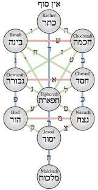
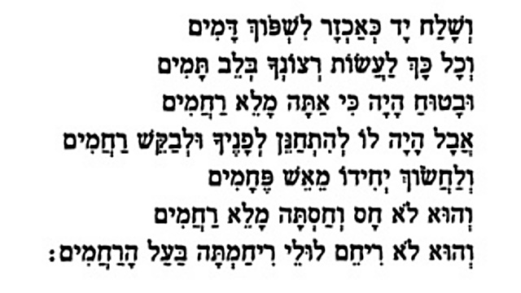

<u>גלגול נשמות – אברהם</u>

אברהם אבינו הוא אחד מגיבורי ספר בראשית. מבחינת אורך
הקטעים המוקדשים לו הוא אולי השני אחרי יוסף.

מתפיסה של ביקורת המקרא, אפשר לראות את אברהם כאב הקדמון
של ממלכת יהודה, בעוד שיעקב ויוסף הם הדמויות המיתולוגיות של ממלכת
ישראל.

כך או כך, עורך ספר בראשית, כנראה בתחילת ימי הבית השני,
אסף סיפורים שהתהלכו בין גולי בבל שם, או אלו שחזרו לירושלים, מכל
המקורות.

שהרי במאה וחמישים השנים האחרונות של ימי הבית השני, קלטה
ארץ יהודה רבים מתושבי ממלכת ישראל שנחרבה על ידי האשורים.

כך נוצר לנו אברהם אבי האומה, ועליו סיפורים רבים שאינם
מאפיינים דמות עקיבה, ולפעמים כל סיפור מתאר אברהם שונה...

- אברהם מציית לאלוהיו ונודד עם משפחתו לארץ כנען.

- אברהם יורד מצרימה, ומפקיר את אשתו לפרעה, כדי להגן על
  נפשו.

- אברהם נפרד בנדיבות וברוח טובה מלוט אחיינו.

- אברהם נלחם בראש 312 חניכיו (עבדיו?) נגד ארבעת המלכים,
  כדי להציל את לוט ואחרים מהשבי, מנצח נצחון מוחלט.

- אברהם מסרב לקבל כל תמורה על גבורתו זו.

- אברהם מקיים טקס מוזר של ברית בין הבתרים, ומקבל הבטחה
  לעתיד זרעו.

- אברהם שוכב עם הגר שפחת שרה והיא נכנסת להריון.

- אברהם מאפשר לשרה להתעלל בהגר, הגר בורחת וחוזרת במצוות
  מלאך.

- אברהם מקבל הבטחה אלוהית נוספת אך מצטווה למול את עצמו
  ואת כל הגברים.

- אברהם מקבל שלושה "אנשים" בהכנסת אורחים מרשימה, והם
  מבטיחים לו בן.

- אברהם מתווכח עם אלוהים, על הצדק בהשמדת סדום ועמורה,
  שאולי יש בהם צדיקים.

- אברהם מתגורר באיזור הפלשתים, ושוב מפקיר את אשתו למלך
  גרר.

- אברהם מגרש את הגר וישמעאל, לפי רצון שרה, ובהוראת
  ה'.

- אברהם הולך להקריב את בנו יצחק לה'.

- אברהם קונה בכסף מלא את מערת המכפלה, כדי לקבור את
  שרה.

אם נתעלם מהמדיניות של העריכה, שמייחסת להוראת האל את
ההתנהגויות הלא סימפטיות של אברהם (חוץ מאשר הפקרת אשתו, שכנראה נחשבה עוד
בזמן העריכה, כסבירה...), ונתייחס לסיפורים עצמם נוכל לראות כמה תכונות,
שחלקן סותרות:

- נאמנות לה'. מצד אחד, הולך להקריב את בנו ללא ויכוחים,
  מצד שני מתווכח על גורלם של הצדיקים שאולי קיימים בין רשעי סדום.

- איש משפחה? מצד אחד יחסו ללוט, נדיב, אחראי, ואפילו נלחם
  למענו. מצד שני, מפקיר את אשתו, מגרש את בנו ישמעאל ואמו, ומוכן להקריב
  את בנו "יחידו".

- מכניס אורחים.

- מתייחס לעמי הארץ בענווה (מערת המכפלה) ובהכנעה (מלך
  גרר).

זה, כנראה, אברהם שהתגבש בתחילת ימי הבית השני, ימי עריכת
ספר בראשית, מן הסתם.

מצד אחד, בכל ספרי "נביאים" (וגם ספרי "כתובים", שנכתבו
בימי הבית השני), אין איזכור של **סיפורי אברהם**, ושמו נזכר רק כאב קדמון,
וכמקבל את ההבטחה האלוהית על עתיד העם.

מצד שני, ספר בראשית מכיל מסורות מגוונות, שבאופן בולט
חלקן מגיעות ממלכת ישראל, כמו למשל, סיפורי יעקב ויוסף, ולכן הן מסורות
שנתהוו בימי בית ראשון. לכן סביר שגם מסורות על אברהם, לפחות חלקן, הן מימי
הבית הראשון.

לא קשה להבחין, שאברהם הוא אב קדמון של ממלכת יהודה דווקא,
ומרכז פעילותו באיזורים הדרומיים, כמו חברון ובאר שבע. הוא אף קונה את חלקת
הקבר בחברון.

חברון הייתה בירתו של דוד, על פי המסופר, שבע שנים, לפני
ירושלים.  
ברור שעורך ספר בראשית איחד את שלושת האבות וארבע האמהות, לשושלת אחת, וגם
קבר את כולם (חוץ מרחל) במערת המכפלה בחברון.

כאמור, לאחר ספר בראשית אין לנו חזרה על סיפורי אברהם בימי
בית ראשון, וגם לא בספר דברי הימים שנכתב בימי בית שני (אך עיקר עניינו דוד
המלך). למעשה, התנ"ך שמעבר לספר בראשית "לא מכיר" את סיפורי אברהם.

לראשונה (לפי הספרות המצויה בידינו) הסיפורים משוחזרים
ומורחבים ב"ספר היובלים".

ספר זה הוא ספר חיצוני (לא התקבל על ידי חז"ל), שנכתב
כנראה, במאה השנייה לפני הספירה (תקופת החשמונאים). נשמר במלואו רק בשפת
הגעז (השפה האתיופית העתיקה), וחלקים ממנו נתגלו, בעברית, בקומראן.

לענייננו, הספר מכיל לראשונה אגדות על מאבקו של אברהם
באלילות עוד בחרן, אגדות שהורחבו בספרות המדרשית המאוחרת יותר, וחלקן אולי
יחידות. כלומר, בימי החשמונאים קיבל אברהם גילגול שני, שכבר לא נכנס לתנ"ך,
אך נכנס למדרשים המאוחרים.

<u>קטעים מספר היובלים פרק יא עד פרק יז</u>

ובשנה השביעית לשבוע הזה ילדה לו בן ויקרא שמו
אברם...

ויחל הנער לדעת את שגגת הארץ כי שגו הכל אחרי הפסילים
ואחרי החטא...

ויחל להתפלל אל בורא הכל כי יצילהו משגגת בני האדם ודי לא
יפול גורלו ללכת אחרי החטא והתועבה...

אחר כך מופיע קטע שבו אברם מציל את שדות המזרע ממכת
העורבים, קטע שלא מצאתי בשום מקום אחר.

וענן עורבים בא לאכל את הזרע וירץ אברם לקראתם בטרם ישבו
על הארץ ויצעק עליהם ויגער בהם.... וישובו ביום ההוא ענני עורבים שבעים פעם
וישלחם ולא ישבו מכל העורבים בכל השדה אשר שם אברם ולא נותר אף
אחד...

והוא ממשיך לשכנע את תרח אביו לעזוב את האלילים,
ולבסוף...

ויהיה בשנת הששים לחיי אברם והיא השבוע הרביעי בשנה
הרביעית, ויקם אברם בלילה ויבער את בית האלילים וישרף את כל אשר בבית ואיש
לא ידע... וימהר הרן להצילם והאש בוערת עליו וישרף בתוך האש....

המדרשים האלה, כמו מדרשי הדורות הבאים, באים להשלים חוסרים
בכתיבה המקראית הקצרה, לפי רוח כותביהם ולפי הערכים שלהם.

בבראשית כתוב רק שאלוהים מצווה על אברם "לך לך...". המדרש
מנסה לענות על השאלה, למה דווקא אברם... בבראשית כתוב שהרן מת, ולוט בנו
יוצא עם אברם. כיצד הרן מת...

נדלג על שינויים ותוספות שונות, ביניהם כאלה המרמזים על
ההתיוונות בצורה יותר מפורשת מאשר המאבק באלילות, ונעיר רק על שינוי מעניין
בפרשת העקדה:

ויהי בשבוע השביעי בשנה הראשונה בחודש הראשון ביום ההוא
בשנים עשר לחדש הזה, היה דבר בשמים על אודות אברהם, כי נאמן הוא בכל אשר
ידבר. וה' אהבו כי בכל צרה נאמן הוא. ויבא **השר משטמה** ויאמר לפני
האלהים: הנה אברהם אהב את יצחק בנו ויבכרהו על כל, אמֹר לו ויעלהו עולה על
המזבח, ואתה תראה אם יעשה את הדבר הזה ותדע אם נאמן הוא בכל אשר
תנסהו...

שינוי זה, מזכיר כמובן, את ספר איוב, ומסביר שהרעיון הנורא
והבלתי מתקבל על הדעת אינו רעיון של האל הטוב... (צריך לזכור, שהקטע מתורגם
בתרגום ישן, ולכן "שר המשטמה" הוא "השטן").

<u>לאן יתגלגל אברהם אחרי חורבן הבית השני, בתקופת
חז"ל?</u>

האגדות שראינו בספר היובלים, הולכות ומתרחבות, וגם
מתגוונות, בספרות המדרש של המאות הראשונות לספירה.

<u>מדרש רבה בראשית - פרשה לט פסקה א</u>

מדרש ההופך את אברהם לפילוסוף.

אמר רבי יצחק. משל לאחד שהיה עובר ממקום למקום, וראה בירה
אחת דולקת. אמר: תאמר שהבירה זו בלא מנהיג? הציץ עליו בעל הבירה אמר לו:
אני הוא בעל הבירה.

כך, לפי שהיה אבינו אברהם אומר: תאמר שהעולם הזה בלא
מנהיג? הציץ עליו הקב"ה ואמר לו: אני הוא בעל העולם.

אותו מדרש בפרק ל"ח, עוסק בעימות בין אברהם (ותרח אביו)
ובין נמרוד, מלך רשע עובד אלילים, שבסופו מושלך אברהם לכבשן האש. המדרש
כתוב ארמית, ואת תרגומו ניתן למצוא בספר האגדה. לאברהם אין לדאוג, אלוהים
הציל אותו, אך הרן אחיו, חשב שגם הוא יכול להינצל ונכנס לכבשן ונשרף...
וכדאי לשים לב לעיבוד (האפשרי) של האגדה שקראנו בספר היובלים על סופו של
הרן בשריפה. כאן אנחנו עוסקים כבר במלחמת דתות.

אברהם ניצל, כאמור, והאגדות מגיעות מהמדרשים גם לתלמוד
הבבלי.

עונש בשריפה אהוב על הדתות השונות. אנחנו מכירים אותו
מהאינקויזציה עד לפני מאות שנים אחדות. אבל הוא מופיע אצלנו בספר
ויקרא:

<u>ספר ויקרא פרק כא</u>

(ט) וּבַת אִישׁ כֹּהֵן כִּי תֵחֵל לִזְנוֹת אֶת אָבִיהָ הִיא מְחַלֶּלֶת בָּאֵשׁ
תִּשָּׂרֵף:

וגם יהודה ששומע שכלתו "זנתה" מצווה "הוציאוה
ותישרף"...

אבל מוטיב ההשלכה לכבשן האש על רקע סירוב לעבודת אלילים
מופיע בספר דניאל, שם עזריה, חנניה ומישאל מושלכים לכבשן, וכמובן, יוצאים
בחיים.

התלמוד כבר מכיר אגדה זו ומפתח אותה.

<u>תלמוד בבלי מסכת פסחים דף קיח/א</u>

אמרו: בשעה שהפיל נמרוד הרשע את אברהם אבינו לתוך כבשן
האש, אמר גבריאל לפני הקדוש ברוך הוא: רבונו של עולם, ארד ואצנן ואציל את
הצדיק מכבשן האש. אמר לו הקדוש ברוך הוא: אני יחיד בעולמי והוא יחיד בעולמו
נאה ליחיד להציל את היחיד...

מעניין שבמאה הראשונה (תחילת תקופת חז"ל שעוד לפני
החורבן), ניתן למצוא פרשנות

מסוג שונה לחלוטין אצל פילון האלכסנדרוני, שהוא פילוסוף
יהודי המושפע מאוד מהתרבות היוונית.

<u>פרשנות אלגורית, בהשפעת אפלטון ואריסטו.</u>

אברהם מסמל הסתכלות, ועיון. (אידיאל יווני, בעיקר
אריסטוטלי).

דוגמה לפרשנות אלגורית, של מלחמת חמשת המלכים (בעמק סדום)
נגד ארבעת המלכים (הצפוניים).

זה הוא מאבק בין חמשת החושים, כנגד ארבעת
ההיפעלויות.

ההיפעלויות בפילוסופיה היוונית הן היצרים: תענוג, תאווה,
פחד, וצער.

הן השולטות בחושים.

התמרדות החושים כנגד העבדות ליצרים, נעשית על ידי
התבונה.

<u>אברהם, המייצג את התבונה, מנצח לבסוף. התבונה מנצחת את
היצרים.</u>

חרף הפרשנות האלגורית, פילון מתייחס לאברהם, כמובן,
כאישיות היסטורית ורואה בו רק מעלות.

בפרקי אבות, במשנה, מופיע לראשונה הרעיון של "עשרה
נסיונות" שנוסה אברהם:

<u>משנה מסכת אבות פרק ה</u>

(ג) עֲשָׂרָה נִסְיוֹנוֹת נִתְנַסָּה אַבְרָהָם אָבִינוּ עָלָיו הַשָּׁלוֹם וְעָמַד בְּכֻלָּם,
לְהוֹדִיעַ כַּמָּה חִבָּתוֹ שֶׁל אַבְרָהָם אָבִינוּ עָלָיו הַשָּׁלוֹם:

פרקי דרבי אליעזר, הוא מדרש, שעל פי המחקר נכתב בארץ ישראל
במאה השמינית (לאחר הכיבוש המוסלמי). הוא מיוחס לאליעזר בן הורקנוס (אליעזר
הגדול, רבו של רבי עקיבא, המאה הראשונה). המדרש מציג את אברהם ככליל
השלמות, ומרחיב את סיפור הנסיונות (ספק נסיונות ספק נסים) ומנסה למנות
אותם..

<u>פרקי דרבי אליעזר פרק כ"ו</u>

עשרה נסיונות נתנסה אברהם אבינו ועמד בכולן.

הנס הראשון. כשנולד אברהם בקשו כל גדולי מלכות והקוסמים
להרגו ונחבא בבית הרן שלש עשרה שנה, ולאחר שלש עשרה שנה יצא מבית הרן מדבר
בלשון הקדש ומאס באלילים ומשקץ את הפסילים ובטח בשם יוצרו...

הנס השני. נחבש בבית האסורים ...והשליכוהו לתוך כבשן האש
ומלך הכבוד פשט יד ימינו והצילו מכבשן האש ..

הנס השלישי. טלטולו מבית אביו ומארץ מולדתו ...

הנס הרביעי. מיום שנבראו שמים וארץ לא הביא הב"ה רעב בעולם
אלא בימי אברהם ...

הנס החמישי. נלקח שרה אשתו לפרעה לאשה... \[ואלוהים,
כמובן, מציל אותה\]

הנס הששי. באו עליו כל המלכים להרגו ואמרו נתחיל ראשון בבן
אחיו ואחר כך נתחיל לו. ובשביל לוט לקחו את כל רכוש סדום ועמורה... \[והוא
מנצח...\]

הנס השביעי. אחר הדברים האלה היה דבר ה' אל אברם במחזה
לאמר לכל הנביאים נגלה בחזון ולאברהם נגלה במראה החזון... \[בלי להתייחס
להבדלים בין הנביאים לפי גירסה זו, צריך להזכיר, שהרמב"ם, מייחד את משה
מכלל הנביאים, בצורת התקשורת שלו עם אלוהים\]

הנס השמיני. ויהי אברם בן תשעים ותשע שנה, אמ' לו הב"ה עד
עכשו לא היתה תמים, אלא מול את בשר ערלתך מעליך ותהלך לפני והיה
תמים...

הנס התשיעי. נולד ישמעאל בקֶשת, ונתרבה בקֶשת, שנ' ויהי
אלהים את הנער ויגדל. ונטל קשת וחצים והיה יורה אחר הפנות, וראה את יצחק
יושב לבדו וירה חץ להרגו. וראתה זה הדבר שרה והגידה לאברהם, ואמרה לו כזה
וכזה עשה ישמעאל ליצחק, אלא עמוד וכתוב ליצחק כל מה שנשבע הב"ה לך
ולזרעך.... \[כאן, חשוב להדגיש את האפולוגטיקה, הצורך להצדיק את גירוש
ישמעאל, אם מפני שגירוש סתם אינו מתאים לערכיו של הכותב, ואם מפני
שהמוסלמים שולטים בארץ בתקופת כתיבת המדרש\].

הנס העשירי. ויהי אחר הדברים האלה והאלהים נסה את אברהם.
ר"ל היה מנסה בכל פעם ופעם לידע את לבו, אם יכול לעמוד ולשמור המצות של
תורה ואם לאו... \[ועל כך נזכיר בהמשך את הדילמה המודרנית... עמד בניסיון
או נכשל בו...\]

גירסה זו נכנסה גם בסידור הן האשכנזי והן הספרדי, בקצרה,
דרך פירוש עובדיה מברטנורה למשנה (הנעזר בפרקי דרבי אליעזר):

<u>סדור תפלה נוסח אשכנז - פרוש ברטנורא לפרקי אבות - פרק
ה:</u>

(ד) עשרה נסיונות. אחד, אור כשדים שהשליכו נמרוד לכבשן
האש. ב', לך לך מארצך. ג', ויהי רעב. ד', ותוקח האשה בית פרעה. ה', מלחמת
המלכים. ו', מעמד בין הבתרים, שהראהו שעבוד מלכויות. ז', המילה. ח', וישלח
אבימלך ויקח את שרה. ט', גרש האמה הזאת ואת בנה. י', העקידה:

בימי הביניים מתגלגל אברהם לכמה כיוונים:

- בקבלה הוא מייצג את "החסד". החסד בתורה, מתבטא בהכנסת
  האורחים, ובדאגתו לצדיקי סדום האפשריים, ובאגדות גם במיסיונריות בדרכי
  נועם.

- לעומת זה, האסונות בימי הביניים מביאים להדגשת גדולתו של
  אברהם בפרשת העקדה.

- בנוסף, אברהם אבינו הופך לאביהם של גרי הצדק.

<u>זהר מנוקד/תרגום/ חלק א דף מו/א</u>

וַהֲלא נֶּאֱמַר (בראשית כ"ו) עֵקֶב אֲשֶׁר שָׁמַע אַבְרָהָם בְּקוֹלִי וַיִשְׁמוֹר
מִשְׁמָרְתִּי מִצְוֹתָי חֻקוֹתָי וְתוֹרוֹתָי. מָאי מִשְׁמָרְתִּי, אָמַר מִדַּת חֶסֶ"ד. כָּל יְמֵי היוֹת אַבְרָהָם
בָּעוֹלָם לא הוּצְרָכְתִּי אֲנִי לַעֲשׂוֹת מֵלַאכְתִּי, שֶׁהֲרֵי אַבְרָהָם עָמָד שָׁם בִּמְקוֹמִי. וַיִשְׁמוֹר
מִשְׁמָרְתִּי, בְּמִדָּה זוֹ הָיְתָה מֵלַאכְתִּי שֶׁאֲנִי מֵזָכֵּה אֶת הָעוֹלָם כֻּלּוֹ וְאֲפִילוּ נִתְחַיְיבוּ, אֲנִי
מֵזָכֵּה אוֹתָם. וְעוֹד מֵשִׁיבָם וּמֵבִיא בִּלְבַבָם לַעֲשׂוֹת רָצוֹן אֲבִיהֶם. כָּל זֶה עָשָׂה אַבְרָהָם
וּכְתִיב (בראשית כ"א) וַיִּטַּע אֶשֶׁל בִּבְאֵר שָׁבַע. סִידֵר לַחְמוֹ וּמֵימָיו לְכָל בָּאֵי עוֹלָם וְהָיָה
מֵזָכֵּה וּמְדַבֶּר עַל לִבָּם, לְמִי אַתֶּם עוֹבְדִּים, עִבְדוּ אֶת יְיָ אֱלֹהֵי הַשָׁמַיִם וְהָאָרֶץ. וְהָיָה
דוֹרֵשׁ לָהֶם, עַד שֶׁהָיוּ בָּאִים וְשָׁבִים.‏

<u>זהר מנוקד/תרגום/ חלק ג דף רמז/א</u>

בַּחִבּוּר הַקַּדְמוֹן, אָמַר הָרוֹעֶה הַנֶּאֱמָן, מִכָּאן נוֹדָע אֵלּוּ דְּבָרִים
סְתוּמִים הֵם, וְצָרִיךְ לִפְתֹּחַ אוֹתָם לִפְנֵי הַחֲבֵרִים. אַבְרָהָם וְיִצְחָק שֶׁתִּקְּנוּ תְּפִלַּת שַׁחֲרִית
וּמִנְחָה, נֶאֱמַר עֲלֵיהֶם, (ישעיה מח) אַף יָדִי יָסְדָה אֶרֶץ - זֶה יִצְחָק. וִימִינִי טִפְּחָה
שָׁמָיִם - זֶה אַבְרָהָם. שֶׁהַדְּרָגוֹת שֶׁלָּהֶם חֶסֶד וָפַחַד, שֶׁנֶּאֱמַר עֲלֵיהֶם (שם סב) נִשְׁבַּע ה'
בִּימִינוֹ וּבִזְרוֹעַ עֻזּוֹ. אֵלּוּ שְׁתֵּי זְרוֹעוֹת הַמֶּלֶךְ, שֶׁהוּא יְהֹוָ"ה, הָעַמּוּד הָאֶמְצָעִי.

בתוך עשרת הספירות הקבליות, יש קישורים לאבות.

אברהם, כאמור, קשור למידת החסד (מצד ימין). יצחק למידת
הדין (מצד שמאל). יוסף למידת היסוד.

גרי צדק (כלומר, מתגיירים) היו בישראל בכל הדורות, ותמיד
התעוררו הבעיות של הניגוד בין היהדות האתנית, והיהדות הדתית תרבותית. בפרט,
נשאל הרמב"ם, אם מתגייר יכול להתפלל בנוסח "אבותינו...".

תשובתו של הרמב"ם למתגייר ברורה. אברהם הוא המגייר הגדול,
ולכן אביהם של המתגיירים.

<u>שו"ת הרמב"ם - פאר הדור סימן קנח</u>

ועיקר הדבר שאברהם אבינו הוא שלימד כל העם והשכילם,
והודיעם דת האמת, וייחודו של הקב"ה, וביעט בע"ז והפר עבודתם, והכניס בנים
רבים תחת כנפי השכינה, ולמדם והורם וצוה בניו ובני ביתו אחריו לשמור דרך
יי', כמו שכתוב בתורה "כי ידעתיו למען אשר יצוה את בניו ואת ביתו אחריו
ושמרו דרך ה'" וגומר.

לפיכך כל מי שנתגייר עד סוף כל הדורות, וכל המייחד שמו של
הקב"ה כמו שהוא כתוב בתורה, מתלמידיו של אברהם אבינו ע"ה הוא ובני ביתו הם
כלם, והוא החזיר אותם למוטב. כשם שהחזיר אנשי דורו בפיו ובלמודו כך החזיר
כל העתידים להתגייר בצוואתו שצוה את בניו ואת ביתו אחריו. **נמצא אברהם
אבינו ע"ה הוא אב לזרעו הכשרים ההולכים בדרכיו ואב לתלמידיו, והם כל גר
שיתגייר. לפיכך יש לך לומר אלהינו ואלהי אבותינו שאברהם ע"ה הוא
אביך.**

כלומר, אברהם אבינו הוא אבי האומה, לא ביולוגית אלא דתית
תרבותית. המורה הגדול.

העקדה מודגשת יותר ויותר בעקבות גזירות קשות וקידוש
השם.

המקור הקדום יותר של מרטיריות (עינויים ומוות על קידוש
השם), הוא, אולי ספר מקבים ד' המספר על גזירות אנטיוכוס. הספר נכתב מאוחר
יחסית לאירועי אנטיוכוס, ואולי כבר קשור בהשפעת הקנאות של סוף ימי הבית
השני, ואולי אפילו המרטיריות הנוצרית.

סיפור האשה ושבעת בניה המופיע שם, מסופר בגירסאות שונות
בספרות המדרשית. במדרש "איכה רבה" (כנראה מהמאה השביעית) הוא מקושר לעקדה
במפורש:

<u>מדרש רבה איכה - פרשה א פסקה נ</u>

...נפלה אמו עליו והיתה מחבקתו ומנשקתו ואמרה לו **בני לך
אצל אברהם אביכם** ואמור לו כך אמרה אמי: אל תזוח דעתך עליך ותאמר בניתי
מזבח והעליתי את יצחק בני. הרי אמנו בנתה שבעה מזבחות והעלתה שבעה בנים
ביום אחד. אתה נסיון ואני מעשה...

במחזור התפילות של ראש השנה ויום הכיפורים יש תפקיד חשוב
להזכרת עקדת יצחק, כסיבה לזכותם של ישראל לבקש סליחה וכפרה מאלוהי
ישראל.

וכך מסביר הרמב"ן, בפירושו על שתי מילים בספר
"ויקרא":

<u>רמב"ן על ויקרא פרק כג פסוק כד</u>

**זכרון תרועה** – פסוקי זכרונות ופסוקי שופרות, לזכור לכם
עקדת יצחק שקרב תחתיו איל.

תפיסה פילוסופית של אהדה לאברהם ההולך להקריב את בנו,
אנחנו מוצאים אצל הפילוסוף הדני, סרן קירקגור (נפטר ב 1855). הוא משתמש
בנושא העקדה להבהרת שיטתו הפילסופית.

קירקגור מבחין בין שלושה רבדים בתרבות האנושית: החומרי,
המוסרי, והדתי.

הדתי הוא הגבוה ביותר והוא גובר על המוסרי.

בספרו "חיל ורעדה" הוא מתאר את אברהם כ"אביר האמונה",
שבלילות מלאות לבטים מוסריים הוא מצליח **להשליט את האמונה הדתית על המוסר
האנושי**, וללכת לבצע את העקדה, המצווה עליו.

בצורה רכה יותר, ניתן לראות את ישעיהו ליבוביץ הולך בדרך
הזו, ומתאר את "עול מצוות" כקטגוריה בפני עצמה, מנותקת מהמוסר האנושי
חברתי, שגם הוא, כמובן, חשוב לו.

לעומת זה, רוב הפרשנים (בודאי הרמב"ם) נוטים לראות בדרישות
הדתיות כמגלמות את המוסר. הבעיה נוצרת כמובן, מכך שהדרישות הדתיות הן
שמרניות, ולכן, במידה שאינן מתפתחות בהתאם למוסר החברתי, נוצרת סתירה,
וצריך פרשנות נועזת, או, להיפך, מתפתלת, כדי להצדיק גישה המאחדת מוסר עם
דת.

בפרט, לגבי העקדה עצמה, פרשנויות דתיות רבות, רואות בפרשה
לא רק מבחן אמונה, אלא גם דרך להביע דווקא את התנגדות האל לקורבן אדם, שהיה
נהוג בחברות פגאניות.

בימינו ממשיכה העקדה לסמל את הקורבנות הלאומיים, אך מקידוש
השם, היא מתרחבת לנופלים במלחמות.

ביקורת על קידוש השם קיימת כבר אצל הרמב"ם. הוא לא מעודד
מוות במקום המרת דת, אלא ממליץ להיכנע ולהמיר (בזמנו, להתאסלם), ואחר כך
לנסות לברוח ולחזור.

היום, כמובן, מתרבה גם הביקורת על עצם הרעיון של הקרבה על
קידוש השם, ולפעמים גם ערעור או לפחות ביקורת על קורבנות במלחמות שאין בהן
הכרח.

כבר בימי הביניים מוצאים פיוט של פרשן לא ידוע המבקר את
העקידה:

מעניינת ונועזת ביותר, היא עמדתו של דוב אלבוים, שיצא מבית
דתי למרחב הפילוסופי.

הנה קטע מביקורתו על העקדה.

<u>מדוע אין יותר שיחות בין אלוהים לאברהם לאחר
העקדה? – דוב אלבוים.</u>

<u>מתוך אתר 929</u>

אם אכן נכונה טענתם של כל הפרשנים בכל הדורות, שאת סיפור
העקדה צריך לקרוא כרגע הניצחון המלא של אברהם, שהצליח לעמוד בעשרה ניסיונות
גדולים וקשים, אם אכן צודקים כל המדרשים והדרשות שנכתבו על העקדה, ועקדת
יצחק היא מודל שאנחנו צריכם לחנך לאורו, אם כל זה נכון, אני לא מצליח להבין
מדוע מסתיר האל את פניו מאברהם שלאחר העקדה.

מדוע לאחר שנות חיים ארוכות שבהם אברהם מנהל דיאלוג עם
אלוהים, פתאום הדיאלוג הזה נפסק לחלוטין. פתאום אין התגלויות בלילות של
חשכה כמו ב"ברית בין הבתרים", פתאום האל לא מתייעץ עוד עם אברהם לפני שהוא
משמיד כמה ערים חוטאות. שום כלום.

......

האם לא נכון להציג כאן אופציה פרשנית אחרת, מאוד שונה מאלף
אלפי הפירושים והמדרשים? האם לא ראוי להציג אפשרות פרשנית שבה אברהם איננו
עומד בניסיון, אלא נכשל בו באופן ברור? כי אם אנו מסכימים להעלות אפשרות
שכזו על דעתנו, אפשר לאור זאת להבין מדוע לא מתרחשת יותר שיחה בין האל
לאברהם.

ייתכן שהנסיון הוא בעצם הפוך לגמרי – האם אברהם ישכיל
לצעוק לעבר האלוהים: "איך אתה מבקש ממני בקשה כזו – לרצוח את בני על לא
עוול בכפו?" אולי הניסיון שמנסה האל הוא לבדוק עד כמה האמונה של אברהם היא
אמונה שיש בה ביקורת או שזו אמונה תמימה ואוטומטית? אולי האל ניסה לבדוק
האם גם כאן אברהם יצעק לו: "השופט כל הארץ לא יעשה משפט?!" כמו שצעק כאשר
ניסה למנוע את החרבת סדום שבתוכה ישב אחיינו, לוט.

.... ייתכן שהאל קיווה שהנה הוא מצא אדם אחד שיכול להיות
פרטנר אמיתי, שיכול לצעוק עליו כשהוא טועה (כפי שעשה פעם בהקשר לסדום, וכמו
שעשה משה רבנו לאחר סיפור עגל הזהב), אבל הפעם אברהם לא הצליח לעמוד
בניסיון הקשה הזה.

עמדה הפוכה מביע הרב יעקב אריאל, שהיה רבה של רמת גן, ובעל
עמדות של הציונות הדתית המתנחלת.

<u>עקדת יצחק בפרספקטיבה של דורות – יעקב אריאל</u>

<u>אתר 929</u>

**.....**

**ההלכה**

ההלכה רואה בעקדת יצחק ערך נשגב. היא המליצה לומר את העקדה
כל יום. השופר, לדעת הרמב"ם חייב להיות מאיל דווקא. נוסחה ברכה מיוחדת
לסיומה של תפילת הזכרונות במוסף של ר"ה: **וַעֲקֵדַת יִצְחָק, לְזַרְעוֹ הַיּוֹם בְּרַחֲמִים
תִּזְכֹּר**.

והרמב"ם בהלכות בית הבחירה פרק ב: **ומסורת ביד הכל שהמקום
שבנה בו דוד ושלמה המזבח בגורן ארונה הוא המקום שבנה בו אברהם המזבח ועקד
עליו יצחק.**

ההלכה קבעה את עקדת יצחק **כערך מוסרי נעלה**. והלכה זו
מחייבת את כל בני אברהם להתייחס אל המעשה בהתאם. אומנם שערי פרשנות לא
ננעלו ויכול אדם לפרש פסוק כהבנתו, כל עוד אינו מסלף את התפיסה הכללית של
התנך. והתנך הוא ספר הספרים של עם ישראל, עם הספר. הוא שהבין והפנים אותו.
מי שאינו מפרש את התנך ברוח זו אינו מפרש תנך. עבורו זה קטע ספרותי קדום
שרק דמיון חיצוני ומקרי בינו לבין התנך. בכל מקרה אין אדם רשאי לנקוט עמדה
בניגוד מוחלט להלכה.  
\[האם זו ביקורת על דוב אלבוים?\]

.....

**המהפך האידיאולוגי**

בראשית דרכה של ההתיישבות החדשה בארץ התייחסה החברה
הישראלית אל הקרבנות שנפלו לצערנו, כעל נעקדים על המזבח. **היא המשיכה את
הראייה המוסרית של מורשת ישראל.** בתקופה האחרונה התהפך הגלגל. לנגד עינינו
מתחוללת מהפכה ערכית. העקדה הפכה מטרה לחיצי לעג ובקורת. הולכת ומשתלטת
תפיסה פרטנית המעמידה את הפרט במרכז. הפרט נותק מהכלל ולכן אינו מסוגל
לראות בהקרבת הפרט למען הכלל ערך. הצורך של "טוב לחיות בעד עצמנו" החליף את
הערך "טוב למות בעד ארצנו". באווירה כזו העקדה הופכת למעשה "לא מוסרי"
כביכול. העקדה המכריזה עקרון הפוך מציקה לבן דורנו המבולבל, כי היא תובעת
ממנו ראיה מוסרית נעלה יותר.

על העקדה נכתבו יצירות רבות מאוד בספרות החדשה, וכהדיוט
בנושא זה איני יכול לומר הרבה. הבאתי את שירו המפעים של חיים גורי. משורר
שאינו אומר מילה רעה על איש, אך מתאר את העולם בצורה מרתקת.

<u>ירושה – חיים גורי.</u>

האיל בא אחרון.  
ולא ידע אברהם כי הוא  
משיב לשאלת הילד,  
ראשית אונו בעת יומו ערב.  
  
נשא ראשו השב  
בראותו כי לא חלם חלום  
והמלאך ניצב-  
נשרה מאכלת מידו.  
  
הילד שהותר מאסוריו  
ראה את גב אביו.  
  
יצחק, כמסופר, לא הועלה קורבן.  
הוא חי ימים רבים,  
ראה בטוב, עד אור עיניו כהה.  
  
אבל את השעה ההיא הוא הוריש לצאצאיו.  
הם נולדים  
ומאכלת בליבם.

ונסיים בקצרה על דמותו של אברהם בדתות המונותיאיסטיות
האחרות.

<u>אברהם אבינו באסלאם.</u>

הקוראן, והמסורת המוסלמית בכללה, ניזונים, בין השאר,
מהתנ"ך, וגם ממדרשים מאוחרים לתנ"ך. בפרט, נכנסו למסורת זו המדרשים המתארים
את אברהם כמנפץ אלילים, ונלחם על ייחודו של האל, ערך חשוב ביותר לאסלאם עד
היום.

בקוראן הוא מכונה "חליל אללה", כלומר, ידיד האל, ועל שמו
שמה של העיר חברון "אלחליל".

בגלגולו המוסלמי, הוא מגיע, יחד עם בנו ישמעאל עד מֶכּה,
ובונה שם את הכעבה.

העקדה מוזכרת בקוראן בלי שם הבן, אך בפרשנות המאוחרת
ישמעאל הוא הנעקד.

<u>אברהם בנצרות</u>

זה, כמובן, סיפור ארוך....

בקיצור נמרץ, אברהם מופיע בבשורות הראשונות כ"אברהם אבינו"
בתורה, מפני שראשית הנצרות בין היהודים.

אבל פאולוס, המייסד של הנצרות האוניברסלית, זו המוותרת על
המצוות ומדגישה את האמונה, משתמש בפרשנות אלגורית (ולמעשה, גישתו לא רחוקה
מזו של הרמב"ם, ורק בכיוון הפוך). יש בשר, ויש רוח.

<u>קטע מ"האיגרת אל הגלטים" פרק ד'</u>

כִּי כָתוּב שְׁנֵי בָנִים הָיוּ לְאַבְרָהָם הָאֶחָד מִן־הָאָמָה וְהַשֵּׁנִי
מִן־הַחָפְשִׁיָּה׃  
וּבֶן־הָאָמָה נוֹלַד לְפִי הַבָּשָׂר וּבֶן־הַחָפְשִׁיָּה עַל־פִּי הַהַבְטָחָה׃  
וְהַדְּבָרִים הֵם מָשָׁל כִּי אֵלֶּה הֵן שְׁתֵּי הַבְּרִיתוֹת הָאַחַת מִן־הַר סִינַי
הַיּוֹלֶדֶת לְעַבְדוּת, וְהִיא הָגָר׃  
כִּי־סִינַי הוּא הַר בַּעֲרָב וְהוּא כְּנֶגֶד יְרוּשָׁלַיִם שֶׁל־עַתָּה, כִּי־בְעַבְדוּת
הִיא עִם־בָּנֶיהָ׃  
אֲבָל יְרוּשָׁלַיִם לְמַעְלָה חָפְשִׁיָּה הִיא וְהִיא אֵם כֻּלָּנוּ׃  
כִּי כָתוּב רָנִּי עֲקָרָה לֹא יָלָדָה פִּצְחִי רִנָּה וְצַהֲלִי לֹא־חָלָה כִּי רַבִּים
בְּנֵי־שׁוֹמֵמָה מִבְּנֵי בְעוּלָה׃  
**וַאֲנַחְנוּ אֶחָי הִנְנוּ כְיִצְחָק בְּנֵי הַהַבְטָחָה׃**  
וְכַאֲשֶׁר רָדַף אָז הַנּוֹלָד לְפִי־הַבָּשָׂר אֶת־הַנּוֹלָד לְפִי הָרוּחַ כֵּן־גַּם־עָתָּה׃
\[רדיפות הנוצרים בזמנו\]  
וְהַכָּתוּב מַה־הוּא אֹמֵר? גָּרֵשׁ הָאָמָה וְאֶת־בְּנָהּ כִּי לֹא יִירַשׁ בֶּן־הָאָמָה
עִם בֶּן־הַחָפְשִׁיָּה׃  
**עַל־כֵּן אֶחָי לֹא־בְנֵי הָאָמָה אֲנַחְנוּ כִּי אִם־בְּנֵי הַחָפְשִׁיָּה׃**

אברהם אבינו הוליד את המשועבדים (בני האמה, הנולדים לפי
הבשר) ואת החופשיים (הנולדים על פי ההבטחה, כלומר הרוח).

אנחנו, הנוצרים, לא משועבדים (למצוות) אנחנו החופשיים,
ירושלים של מעלה, החפשיה, היא אמנו, ויצחק שהוא בן ההבטחה (הצד הרוחני של
אברהם), הוא אבינו.

עד כאן גלגול נשמתו של אברהם אבינו, שלא רק התגלגלה, אלא
גם התפצלה, ומוסיפה להתפצל ולהתגלגל עד ימינו, ועוד נכונו לה גדולות
ונצורות.
