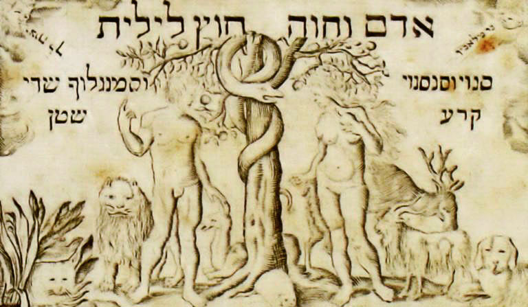
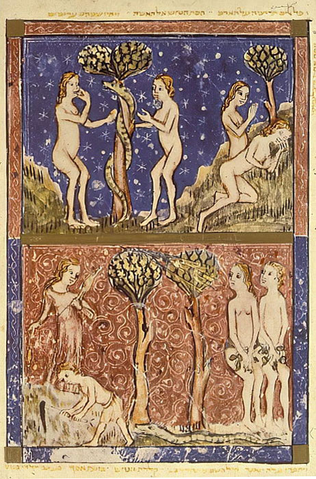

<u>גלגול נשמות – חווה אם כל חי</u>

חווה, אם כל חי נבראה פעמיים...

הרי כל סיפור הבריאה מופיע פעמיים בספר בראשית בגרסאות
שונות.

וכך גם בריאת האשה. בפרק א', נכתב:

<u>ספר בראשית פרק א</u>

(כו) וַיֹּאמֶר אֱלֹהִים נַעֲשֶׂה אָדָם בְּצַלְמֵנוּ כִּדְמוּתֵנוּ וְיִרְדּוּ בִדְגַת הַיָּם
וּבְעוֹף הַשָּׁמַיִם וּבַבְּהֵמָה וּבְכָל הָאָרֶץ וּבְכָל הָרֶמֶשׂ הָרֹמֵשׂ עַל הָאָרֶץ:

(כז) וַיִּבְרָא אֱלֹהִים אֶת הָאָדָם בְּצַלְמוֹ בְּצֶלֶם אֱלֹהִים בָּרָא אֹתוֹ זָכָר
וּנְקֵבָה בָּרָא אֹתָם:

קצר, פשוט וגם שוויוני. למרות שאין מעצור לפרשנות, וגם כאן
ניתן לפרש אחרת.

<u>ספר בראשית פרק ב</u>

(יח) וַיֹּאמֶר יְהֹוָה אֱלֹהִים לֹא טוֹב הֱיוֹת הָאָדָם לְבַדּוֹ אֶעֱשֶׂה לּוֹ עֵזֶר
כְּנֶגְדּוֹ:

(יט) וַיִּצֶר יְהֹוָה אֱלֹהִים מִן הָאֲדָמָה כָּל חַיַּת הַשָּׂדֶה וְאֵת כָּל עוֹף
הַשָּׁמַיִם וַיָּבֵא אֶל הָאָדָם לִרְאוֹת מַה יִּקְרָא לוֹ וְכֹל אֲשֶׁר יִקְרָא לוֹ הָאָדָם נֶפֶשׁ חַיָּה הוּא
שְׁמוֹ:

(כ) וַיִּקְרָא הָאָדָם שֵׁמוֹת לְכָל הַבְּהֵמָה וּלְעוֹף הַשָּׁמַיִם וּלְכֹל חַיַּת הַשָּׂדֶה
וּלְאָדָם לֹא מָצָא עֵזֶר כְּנֶגְדּוֹ:

(כא) וַיַּפֵּל יְהֹוָה אֱלֹהִים תַּרְדֵּמָה עַל הָאָדָם וַיִּישָׁן וַיִּקַּח אַחַת
מִצַּלְעֹתָיו וַיִּסְגֹּר בָּשָׂר תַּחְתֶּנָּה:

(כב) וַיִּבֶן יְהֹוָה אֱלֹהִים אֶת הַצֵּלָע אֲשֶׁר לָקַח מִן הָאָדָם לְאִשָּׁה וַיְבִאֶהָ
אֶל הָאָדָם:

(כג) וַיֹּאמֶר הָאָדָם זֹאת הַפַּעַם עֶצֶם מֵעֲצָמַי וּבָשָׂר מִבְּשָׂרִי לְזֹאת יִקָּרֵא
אִשָּׁה כִּי מֵאִישׁ לֻקֳחָה זֹּאת:

כאן כבר סיפור מיתולוגי, מעניין יותר, מורכב, וגם אין
שוויון בבריאה בין המינים. האיש נברא ראשון, והאשה נבראה רק לצורך "עזר
כנגדו", מצלעו.

מובן שההבדלים בין הסיפורים, מהווים מקור לא אכזב לדברי
פרשנות ואגדות אין ספור.

בדרך כלל הסיפור השני אהוב יותר על הפרשנים, וגם מבטא את
מצבה של האשה בכל הדורות.

אך רבים מדברים על "חוה ראשונה" ו"חוה שניה", גם פרשנים
קדומים וגם מאוחרים.

<u>מדרש רבה בראשית - פרשה כב פסקה ז
(המאה החמישית)</u>

ד) ויקם קין אל הבל אחיו וגו' יהודה בר אמי אמר על חוה
הראשונה היו מדיינין...

<u>זהר מנוקד/תרגום/ זהר חדש פרשת בראשית
(המאה ה-13)</u>

ר' יְהוֹשֻׁעַ אָמַר, חַוָּה הָרִאשׁוֹנָה הָיְתָה, וּלְקָחָהּ מִמֶּנּוּ, וְהִיא נִזְקֵי
דִּבְרִיָּיתָא. הֲדָא הוּא דִכְתִיב וַיִּקַּח אַחַת מִצַּלְעוֹתָיו, זוֹ הִיא הָרִאשׁוֹנָה שֶׁנִּלְקַח מִמֶּנּוּ, עַל
שֶׁהִיא רוּחַ מַזֶּקֶת. וַיִּסְגֹּר בָּשָׂר תַּחְתֶּנָּה, שֶׁהֵקִים אַחֶרֶת בִּמְקוֹמָהּ.‏

אך ב"זוהר" אנו מוצאים, מלבד דברי פרשנות קבליים גם הרבה
אמונות עממיות.

<u>זהר מנוקד/תרגום/ חלק ג דף יט/א</u>

בֹּא רְאֵה, מִנֶּקֶב תְּהוֹם רַבָּה נִמְצֵאת רוּחַ נְקֵבָה, רוּחַ שֶׁל כָּל הָרוּחוֹת,
וּבֵאַרְנוּ שֶׁשְּׁמָהּ לִילִית, וְהִיא נִמְצְאָה לָרִאשׁוֹנָה אֵצֶל אָדָם.

.....

וּכְשֶׁעָמַד אָדָם, הָיְתָה נְקֵבָתוֹ תְקוּעָה בְצִדּוֹ, וְאוֹתָהּ הַנְּשָׁמָה הַקְּדוֹשָׁה
שֶׁבּוֹ הָיְתָה מִתְפַּשֶּׁטֶת לַצַּד הַזֶּה וְלַצַּד הַזֶּה, וְהָיְתָה מַסְפִּיקָה לָזֶה וְלָזֶה, מִשּׁוּם שֶׁכָּךְ נִכְלְלָה.
אַחַר כָּךְ נִסֵּר הַקָּדוֹשׁ בָּרוּךְ הוּא אֶת הָאָדָם, וְתִקֵּן אֶת נְקֵבָתוֹ. זֶהוּ שֶׁכָּתוּב (שם) וַיִּבֶן ה'
אֱלֹהִים אֶת הַצֵּלָע וְגוֹ'. אֶת הַצֵּלָע, הֲרֵי בֵּאַרְנוּ, כְּמוֹ שֶׁנֶּאֱמַר (ויקרא מד) וּלְצֶלַע
הַמִּשְׁכָּן. וַיְבִיאֶהָ אֶל הָאָדָם, בְּתִקּוּנֶיהָ כְּמוֹ כַּלָּה לַחֻפָּה.

כֵּיוָן שֶׁרָאֲתָה לִילִית כָּךְ, בָּרְחָה, וְהִיא בִּכְרַכֵּי הַיָּם, וְעַד עַכְשָׁו הִיא
מְזֻמֶּנֶת לְהָרַע לִבְנֵי הָעוֹלָם. וּכְשֶׁעָתִיד הַקָּדוֹשׁ בָּרוּךְ הוּא לְהַחֲרִיב אֶת רוֹמִי הָרְשָׁעָה
וְשֶׁתֶּחֱרַב לְעוֹלָמִים, הוּא יַעֲלֶה אֶת לִילִית הַזּוֹ, וְיָשִׂים אוֹתָהּ בַּחֻרְבָּן הַזֶּה, מִשּׁוּם שֶׁהִיא
חֻרְבָּנוֹ שֶׁל הָעוֹלָם...

וּבְסִפְרֵי הָרִאשׁוֹנִים אָמְרוּ, שֶׁהִיא בָּרְחָה מִן הָאָדָם מִקֹּדֶם לָכֵן, אֲבָל
אָנוּ לֹא שָׁנִינוּ כָּךְ, מִשּׁוּם שֶׁהֲרֵי נְקֵבָה זוֹ נִמְצְאָה עִמּוֹ, אֲבָל טֶרֶם שֶׁקָּמָה הַנֶּפֶשׁ הַזּוֹ עִם
אָדָם כָּרָאוּי, הָיְתָה מִזְדַּוֶּגֶת עִמּוֹ, וּכְשֶׁזּוֹ תֻּקְּנָה עִמּוֹ כָּרָאוּי, הִיא בָּרְחָה לַיָּם, וּמְזֻמֶּנֶת
לְהַזִּיק לִבְנֵי הָעוֹלָם. ‏

וחוזר על כך בצורה יותר מסובכת, אולי, חיים ויטאל (המאה
ה-16) אך מסיים באופטימיות...

<u>ספר עץ חיים - שער לח פרק ב מ"ת</u>

ואמנם חוה ראשונה עליונה היא בחי' לאה, וחוה תחתונה רחל.
והנה להיות כי בחי' לאה היא בחי' דינין קשים מאד ... וזהו בחי' לילית. חוה
ראשונה שהיתה מזדווגת עם אדם קודם שנברא חוה שניה.

ואח"כ יצאה חוה שניה ממותקת, וזו נשארה לאשת אדם. והאחרת
נסתלקה כי היתה עדיין מעורבת בקליפות בתכלית, אשר לכן נק' חוה ראשונה
לילית, אבל אח"כ כאשר בא יעקב שופריה מעין שופריה דאדם, ותיקן פגם העריות
של אדה"ר, כנזכר זוהר קדושים ובפרשת תולדות, בענין הברכות שלקח במרמה מן
עשו אחיו, אז לקח שניהן, כי אז נתמתקה לאה והיתה בסוד הקדושה ונסתלקה מן
הקליפה.

ר' משה לייבוש בן יחיאל מיכל (נפטר 1879), סבו של מיכאל
הלפרין, מנסה בפירושו להדגיש שכל מילה במקומה, וכאן חשוב לו ההבדל בין
"אדם" ובין "אשה".

<u>מלבים על בראשית פרק ב פסוק כג</u>

וזה שאמר \[האדם\] הנה חוה הראשונה שנולדה דבוקה לגופי,
והיה בריאתה מן האדמה כמוני נקראת כמוני בשם אדם, שהוא שם העצם שנקרא בו
תיכף בהולדו, שוה לזכר כמו לנקבה.

אבל זאת הפעם, ר"ל חוה השניה, שנעשית זאת הפעם עצם מעצמי
ובשר מבשרי, שעתה כבר יש לי שם, איש, שמורה על הגדלות, שהוא שם התואר ע"ש
ישותו, לזאת היינו לחוה זאת השניה, יקרא אשה כי מאיש לוקחה זאת.

במדרשים, ובכל "ארון הספרים היהודי" מופיעה חווה אלפי
פעמים, אם גם הרבה פחות רעיונות (הספרים ניזונים אלה מאלה).

בדרך כלל חטאי חווה עוברים בירושה לכל הנשים
בכלל...

הנה דוגמה לניסיון הכושל של אלוהים לברוא אישה טובה לפי
המושגים של הגבר...

<u>מדרש רבה דברים - פרשה ו פסקה יא</u>

אמר רבי יהושע דסיכנין.

כשבא הקב"ה לבראות את חוה מן אדם היה מתבונן מהיכן לבראות
אותה, שנאמר (שם ג) ויבן ה' אלהים את הצלע וגו'.

אמר הקב"ה, לא אברא אותה מן העין שלא תהא עינה רמה, ולא מן
האוזן שלא תהא צוותנית, ולא מן הפה שלא תהא דברנית, ולא מן היד שלא תהא
גונבת, ולא מן הרגל שלא תהא פרדניתא.

מהיכן אברא אותה? מן אבר הצנוע שיש בו, מן הירך.\[ירך שם
אחר לצלע??\]

ואעפ"כ לא הועיל כלום וכל מה שנתכוין הקב"ה שלא יהא בה
כולהון הן, בכשרות (שבהן).

אמר הקב"ה לא אברא אותה מן העין שלא תהא עינה רמה – חוה
כתיב בה (שם ג) ותרא האשה וגו'. \[ראתה את פרי עץ הדעת..\]

לא אברא אותה מן האוזן שלא תהא צוותנית (שם יח) – ושרה
שומעת וגו'.\[את המלאכים\]

לא אברא אותה מן היד שלא תהא גונבת (שם לא) – ותגנוב רחל
את התרפים.

לא אברא אותה מן הרגל שלא תהא פרדנית – ולאה כתיב בה (שם
ל) ותצא לאה לקראתו וגו'. \[כנראה בסיפור הדודאים שנמכרו לרחל תמורת לילה
של לאה עם יעקב\]

לא אברא אותה מן הפה שלא תהא דברנית – ומרים הצדקת כתיב
בה, ותדבר מרים. וראה מה הגיע לה זכור את אשר עשה ה' אלהיך למרים:\[לשון
הרע על משה בענין האשה הכושית\]

ייתכן שר' יהושע מסכנין מדבר בהומור, אך ללא ספק יש השלכה
על חווה של כל תכונה שמייחסים לנשים...

אך יותר מהכל, זוכרים לחווה, כמובן, את חטאה בהתפתותה
לנחש, ופיתויה את האדם, שהרי בגלל חטא זה גורשנו מגן העדן (ויש אומרים
שבגללו אנחנו קיימים).

"ספר אדם וחווה" הוא ספר חיצוני, שנכתב עברית לפני החורבן
או מיד אחריו, אך נשמר רק בשפות אחרות. התרגום הישן ביותר הוא כנראה
הארמני. הספר אינו מופיע במגילות קומראן, אך במחקר הוא נחשב מוקדם יחסית,
לפני התפשטות הנצרות. הוא נשמר על ידי הנוצרים.

הספר מסתמך על ספר בראשית, אך מרחיב את הנוסח הקצר של
בראשית, לסיפור עשיר הכולל את עלילות המשפחה הראשונה, אלוהים והמלאכים, עד
מותם וקבורתם של אדם וחווה. גם אשמת גיבורי הספר אינה שונה עקרונית מאשמתם
בפרקי בראשית. וכך מתוודה חווה:

"ותקם חוה ותצא החוצה ותפול על פניה ארצה ותבך, ותאמר:
חטאתי אלהי, חטאתי אבי כל, חטאתי לך, חטאתי למלאכיך, בחיריך, חטאתי לכרובים
ולשרפים, חטאתי לכסאך הנורא אשר לא ימוט, **וכל החטאים באו לעולם
בגללי**..."

ועל החטא עצמו, היא מספרת באריכות רבה. כיצד פיתה אותה
הנחש, והכניס את זוהמתו לתוך הפרי, והזוהמה הזאת היא התאוה. והתאוה היא אם
כל חטאת...

וכך לוקחת חווה אחריות על כל החטאים שבאו לעולם, ובעיקר על
התאווה (המינית)...

המשנה, מזהירה נשים משלוש עברות.

<u>משנה מסכת שבת פרק ב</u>

(ו) עַל שָׁלשׁ עֲבֵרוֹת נָשִׁים מֵתוֹת בִּשְׁעַת לֵדָתָן, עַל שֶׁאֵינָן זְהִירוֹת
בַּנִּדָּה וּבַחַלָּה וּבְהַדְלָקַת הַנֵּר:

התלמוד ירושלמי, מקור עתיק (קודם שנת 400) קושר את החטאים
והעונשים לחטאה הקדום של חווה. הסגנון האנטי-פמיניסטי בולט. אדם הוא נזר
הבריאה, חווה הפושעת, וכל אישה היא קצת חווה...

<u>ירושלמי שבת פרק ב הלכה ו</u>

על שלש עבירות נשים מיתות בשעת לידתן.....

על שאינן זהירות בנדה, ובחלה, ובהדלקת הנר.

אדם הראשון דמו של עולם. דכתיב (בראשית ב) ואד יעלה מן
הארץ. וגרמה לו חוה מיתה לפיכך מסרו מצות נדה לאשה.

ובחלה. אדם הראשון חלה טהורה לעולם היה. דכתיב (שם) וייצר
ה' אלהים את האדם עפר מן האדמה. ותייא כיי דמר רבי יוסי בר קצרתה, כיון
שהאשה מקשקשת עיסתה במים היא מגבהת חלתה. וגרמה לו חוה מיתה. לפיכך מסרו
מצות חלה לאשה.

ובהדלקת הנר. אדם הראשון נרו של עולם היה. שנאמר (משלי כ)
נר אלהים נשמת אדם. וגרמה לו חוה מיתה. לפיכך מסרו מצות הנר לאשה.

ואפילו "מורנו הגדול רבי ליוויא בן בצלאל" מפראג, שנפטר ב
1609, מקבל גירסה זו.

<u>מהר"ל חדושי אגדות - שבת</u>

כלומר, שקרובה האשה למיתה בשעת לידתה, ובפעל קל תגיע לה
המיתה, שבלאו הכי הלידה הוא בשביל קלקול האשה, שחטאה ואכלה מן העץ
הדעת.

וכאשר נפקדה על עון שלה בדבר זה, נפקדה ג"כ מה שעשתה מן
החטא בעולם.

ואלו החטאים, דהיינו, נדה חלה הדלקה, ראוים שעל ידי זה
תקבל נפשה המיתה, כמו שאמרנו למעלה.

הוא מרמז לכך שנאמר "בעצב תלדי בנים", ועצם הלידה היא עונש
(בגן עדן, כאמור, אין רביה, למרות הברכה "פרו ורבו"...). אבל על עונש זה
נוסף עונש מיתה על אי קיום מצוות האישה.

הרוב הגדול של המדרשים בכל אלפיים השנה האחרונות דן את
האישה לגנות.

הנושא קשה לדור הנוכחי של שומרי המצוות, ולכן הם חוזרים
ומזכירים הרבה את דברי השבח המעטים.

<u>תלמוד בבלי מסכת נדה דף מה/ב</u>

א"ר חסדא מאי טעמא דרבי דכתיב ויבן ה' \[אלהים\] את הצלע
מלמד שנתן הקדוש ברוך הוא בינה יתירה באשה יותר מבאיש. \[המדרש הוא על
המילה "ויבן" כאילו היא מלשון בינה ולא מלשון בניין\]

זה, אגב, לא פעם תירוץ לכך שאשה לא צריכה ללמוד, היא מבינה
מעצמה.

יש, בהחלט, חכמים הדורשים לאהוב את האישה, לכבד אותה,
לראות באשה את הבית,וכו',

אך הביקורת, אם לא זלזול ואפילו טינה לנשים, נפוצה ביהדות
מהפילוסופיה ועד הקבלה.

להלן כמה פילוסופים:

ר' לוי בן גרשום, נפטר ב 1344 בפרובנאנס, פילוסוף ומדען
מבריק, אך שונא נשים..

<u>רלב"ג על התורה בראשית פרק ב פסוק ד</u>

....ולא תעלה השגתו, כי אם להשגות הפרטיות אשר ישותף
בהשגתם, האדם עם שאר הב"ח. ובזה קולל האדם, שישיג בקושי גדול מושכל אמתי עד
יום מותו. \[האדם מוגבל בשכלו, אך בקושי יכול להשתמש בשכלו מעל יכולת בעלי
החיים\]

והנה קרא האדם שם אשתו חוה, כאשר השיג בחלשת שכלה ר"ל,
**שלא עלתה מדרגתה על שאר הב"ח עלוי רב**. ואם היא בעלת שכל, כי רוב
השתמשותה אמנם הוכן לה בדברים הגופיים, לחלשת שכלה, ולהיותם לעבודת האדם.
ולזה הוא רחוק שיגיע לה שלמות השכל. אלא שעכ"פ היא יותר נכבדת, וכלם הם
לעבודתה, ולזה תארה בשהיא אם כל חי.

במילים שלנו, היא בין האדם ובין בעלי החיים, קצת יותר
מבעלי החיים ולכן היא אם כל חי...

יצחק עראמה, גורש מספרד, נפטר 1494.

<u>ספר עקידת יצחק - שער ט:</u>

ויקרא האדם שם אשתו חוה. בראשונה כשראה אותה עצם מעצמיו
ובשר מבשרו גזר עליה האפשרות להשתתף בשלמות האנושי כאחד האדם, וקרא אותה
אשה. אמנם אחר שראה, מה שנמשך לו בחברתה מהרע והקללה, חזר ונקבה בשם אחר
המורה על הנקביות לבד, והוא חוה, כמו שפירש ואמר כי היא היתה אם כל חי,
כלומר שאין עקר כוונתה באשר היא אשתו, **רק להעזר ממנו להשאיר המין כשאר
הבעלי חיים**, אבל בעניני השלמתם הכל מוטל עליו לבדו:

והנה בשני השמות האלה נתבאר שכבר יש לאשה שני תכליות,
האחד, מה שיורה עליו שם אשה, כי מאיש לוקחה זאת, וכמוהו תוכל להבין ולהשכיל
בדברי שכל וחסידות, כמו שעשו האמהות וכמה צדקניות ונביאות, וכאשר יורה פשט
פרשת אשת חיל מי ימצא כמו שיבא שער כב ב"ה. והשני, ענין ההולדה, והיותה
**כלי אליה** ומוטבעת אל הלידה וגידול הבנים, כאשר יורה עליה שם חוה כאשר
היא היתה אם כל חי.

בכל זאת יש לאשה גם פוטנציאל, אך רק נשים בודדות ניצלו
אותו... השאר תפקידן ללדת.

גם הרמב"ם רואה באישה יצור נחות, אבל הוא מתרחק מאמונות
טפלות, ונוטה לגישה מדעית, ולכן לא תולה את תכונותיה של האישה בחטאי
חווה.

ר' יעקב סקילי, מהמאה ה-14, רב שאינו פילוסוף, מתפלפל עם
חטאן של חווה ואשת לוט.

<u>ספר תורת המנחה לרבי יעקב סקילי - דרשה ט</u>

על כן ותהי נציב מלח, וזאת ההגדה היא ללמד דרך המוסר
והצניעות:

אמנם על דרך האמת, חטא חוה אמה נפקד עליה. שחוה אמה חטאת
בפרי עץ הדעת ונמשכה אחר תאותה, ליהנות בטוב טעם המאכל ההוא, דכתיב ותרא
האשה כי טוב העץ למאכל. לפיכך לקתה בתה אשת לוט בעברה על ציווי המלאך,
ונעשת נציב מלח, **דבר הנותן טוב טעם לכל המאכלות**, ומדה כנגד מדה:

פרשנות נחמדה... וצריך להעיר ש"דרך האמת" בקבלה היא קבלה,
בפילוספיה היא פילוסופיה. כאן זו נטייה לקבלה.

ויהונתן איבשיץ (נפטר 1764) מאמין בגלגול נשמות.

<u>ספר יערות דבש - חלק ראשון - דרוש טז</u>

וזו הכונה, כי דוד חשב שמת בעטיו של נחש, בעבור היותו
גלגול אדם הראשון כנודע, וידוע כי בת שבע היתה גלגול חוה... \[המפתה
הנצחית\]

אדם וחווה בקמע יהודי הקדום ביותר שיצא בדפוס.

מוטיב קיצוני, שחוזר באגדות מהתלמוד הבבלי, ועד ימינו,
מאשים את הנחש בחטא הקדמון, אבל ברמה זו או אחרת של אשמת חווה, עוסק ביחסי
מין בין הנחש ובין חווה.

הנוסח המקובל הוא שהנחש הטיל זוהמה בחווה, ובדרך כלל, אם
כי לא בהכרח, הכוונה להזדווגות. (בספר "אדם וחווה" הזוהמה של הנחש הוכנסה
לפרי).

<u>תלמוד בבלי מסכת שבת דף קמה/ב</u>

מפני מה עובדי כוכבים מזוהמין? שלא עמדו על הר
סיני.

שבשעה שבא נחש על חוה, הטיל בה זוהמא.

ישראל שעמדו על הר סיני פסקה זוהמתן.

<u>זהר מנוקד/תרגום/ חלק א דף קכו/א</u>

אָמַר רַבִּי יוֹסֵי, לָמָּה כָּל מִינֵי כְשָׁפִים וּקְסָמִים לֹא נִמְצָאִים אֶלָּא
בְּנָשִׁים?

אָמַר לוֹ, כָּךְ לָמַדְנוּ, מִשֶּׁבָּא נָחָשׁ עַל חַוָּה, הִטִּיל בָּהּ זֻהֲמָא. הִטִּיל בָּהּ
וְלֹא בְּבַעְלָהּ. אָמַר, כָּךְ זֶה וַדַּאי! בָּא רַבִּי יוֹסֵי וְנָשַׁק לְרַבִּי יִצְחָק. אָמַר, כַּמָּה פְעָמִים
שָׁאַלְתִּי עַל הַדָּבָר הַזֶּה וְלֹא זָכִיתִי בוֹ, אֶלָּא כָּעֵת.

כלומר‏ רק הנשים ירשו את הזוהמא מחווה, הגברים לא...

משה אלשייך, מחכמי צפת, נפטר ב 1600.

<u>פירוש האלשיך ז"ל - ספר תורת משה על בראשית - פרק כג
פסוק</u>

וכן חוה הטיל בה נחש זוהמא (שבת קמו א).

ושרה נלקחה שני פעמים ונשמרה לבל יוטל בה זוהמא. ובזה
מצאנו ראינו טעם אל. הביא הוא יתברך את שרה בנסיון ההוא כי צרה גדולה היתה
לה, **אך הוא לתקן קלקולי חוה**.

וגם רבקה הוצרכה לתקן במקומה כי עדיין לא נגמר התיקון,
והוא כי כל שלשת האבות יש להם שייכות עם אדם כנודע ליודעים חן. \[ח"ן, חכמה
נסתרה, קבלה\]

וגם שלשה דברים שקלקלה חוה, שעל כן נצטוו הנשים בנדה וחלה
והדלקת הנר, נתקן על ידי שרה, שעל כן אמרו ז"ל (בראשית רבה ס טו) שהיתה
עיסת שרה מתברכת. שהוא בלי ספק על דבר החלה, ונר דלוק מערב שבת לערב שבת על
דבר הנר, וענן קשור על פתח האהל, על פתחי נדה שהיתה טהורה מהן, ונכנסה
במקומה רבקה בברכות אלה כמפורש בענין אומרו ויביאה יצחק האהלה וכו'

לדעתו, שרה היא שקבעה את מצוות האישה כדי לתקן את חטאי
חווה.

יותר מתקדם, אברהם בן יחיאל מיכל דנציג, נפטר 1820,
פולין.

<u>ספר זכרו תורת משה - הקדמת המחבר
()</u>

ואיך יתגאה אדם על תלמיד חכם, יהיה מאיזה משפחה שיהיה,
ומכל שכן אם גם אבותיו היו תלמידי חכמים, כי מיום שבא נחש על חוה נתערבו כל
המשפחות, ואין לך משפחה שלא יהיו בה טובים ורעים, כידוע מספרים, וכאשר אנו
רואים בעינינו, ומכל שכן תלמיד חכם שיכול לחדש חידושי תורה:

אחרי האירוע המיתולוגי בין הנחש וחווה, אין לצפות שכולנו
נהיה טובים ומוכשרים.

הנוצרים גלגלו את חווה למקום אולי אפילו עוד יותר
קשה...

פאולוס מתחיל, אולי, מההשקפות של חז"ל:

<u>האיגרת אל טימוטיוס 1, פרק ב'</u>

**8** לָכֵן רְצוֹנִי שֶׁיִּתְפַּלֲלוּ הָאֲנָשִׁים בְּכָל־מָקוֹם וְיִשְׂאוּ יְדֵיהֶם קֹדֶשׁ
בְּלִי־רֹגֶז וּמְזִמּוֹת׃ **9** וְכֵן גַּם־הַנָּשִׁים תִּתְיַפֶּינָה בְּתִלְבּשֶׁת
נָאָה בְּבשֶׁת פָּנִים וּצְנִיעוּת לֹא בְּמַחְלְפוֹת הָרֹאשׁ לֹא בְזָהָב לֹא בִפְנִינִים וְלֹא בְּמַלְבּוּשִׁים
יְקָרִים׃ **10** אֶלָּא בְּמַעֲשִׂים טוֹבִים כָּרָאוּי לַנָּשִׁים אֲשֶׁר
בָּחֲרוּ לָהֶן יִרְאַת אֱלֹהִים׃ **11** הָאִשָּׁה תִּלְמַד דּוּמָם
בְּכָל־הַכְנָעָה׃ **12** וְאֵינֶנִּי נֹתֵן רְשׁוּת לָאִשָּׁה לְלַמֵּד אַף לֹא
לְהִתְנַשֵׂא עַל־הָאִישׁ אַךְ תִּדּוֹם׃ **13** כִּי אָדָם נוֹצַר
בָּרִאשׁוֹנָה וְאַחֲרָיו חַוָּה׃ **14** וְאָדָם לֹא נִפְתָּה כִּי
אִם־הָאִשָּׁה שָׁמְעָה לְקוֹל הַמֵּסִית וַתָּבֹא לִידֵי
עֲבֵרָה׃ **15** אֲבָל תִּוָּשַׁע בְּלִדְתָּהּ בָּנִים אִם תַּעֲמֹדְנָה בָּאֱמוּנָה
וּבָאַהֲבָה וּבַקְּדֻשָּׁה עִם־הַצְּנִיעוּת׃

ובכלל,

האיגרת אל הקורינטים 1, פרק 11

 **8** כִּי אֵין־הָאִישׁ מִן־הָאִשָּׁה כִּי אִם־הָאִשָּׁה
מִן־הָאִישׁ׃ **9** גַּם־לֹא־נִבְרָא הָאִישׁ בַּעֲבוּר הָאִשָּׁה כִּי
אִם־הָאִשָּׁה בַּעֲבוּר הָאִישׁ׃

בספרות הנוצרית חוה היא אם כל חטא יותר מאשר אם כל חי.
החטא של חוה דבק בכולנו ורק האמונה בישו יכולה למחוק אותו.

לנוצרים יש גם את האנטיתזה של חוה, והיא, כמובן, מריה,
שהיא טהורה לחלוטין.

צריך להעיר, שההשקפות הנוצריות יונקות מהיהדות, אך גם הן
וגם ההשקפות אצלנו, מושפעות כנראה גם מההשקפות היווניות, שאינן
שונות.

אריסטו, גדול הפילוסופים, רואה באשה כיצור בינים בין בעלי
חיים ובין אנשים, והאשה היא רק כלי קיבול לזרע הגבר שממנו נוצר העובר (מה
לעשות, לא ראו ביציות אז...).

במחקרים רבים שנעשו, על אודות המיתוסים של בריאת האדם, יש
הרואים גם הקבלה בין חוה במסורת שלנו לפנדורה במסורת היוונית.

פנדורה הייתה "חוה" שנבראה על ידי זאוס כעונש לאדם, אחרי
שפרומתיאוס נתן לו את האש (יכולת הקידמה). לפנדורה ניתנה על ידי האלים
תיבה, ובה כל הצרות של האנושות, וגם הוראה לא לפתוח אותה. כמובן, שהיא לא
עמדה בפני הפיתוי, פתחה אותה, ולכן יש לנו רפורמה... ונזכור שר' יהושע
מסיכנין אומר שאלוהים לא רצה לברוא את חוה מהאוזן, כדי שלא תהיה "צוותנית",
כלומר מצוטטת, די מקביל לסקרנית... סיבת האסונות שהביאה לנו פנדורה.

מאמר כבד על חוה בנצרות נמצא ב:

/<https://womenpriests.org/sexuality/baring4-eve-in-christian-culture>

באסלאם,

בכתבים הקדומים, האסלאם הרבה יותר שוויוני, ובדרך כלל רואה
בזוג הראשון אשמה שווה, וגם מכיל אותה יותר. כרגיל, הוא תובע מהמאמינים
לקיים את מצוות האל כדי להינקות מירושת האשמה.

בהמשך, הייתה השפעה של המיתוסים היהודיים והנוצריים גם על
האסלאם.

בתקופת ההשכלה הייתה עדנה לחוה, קל וחומר בימינו
הפמיניסטיים.

כמובן, יש אינסוף שירים, סיפורים ומאמרים בנידון.

נביא לסיום רק קטע ממאמר של אליעזר שטיינמן (נפטר ב 1970),
בשם "תהילה לאשה" (הועתק מפרויקט בן יהודה):

.....

מכאן ואילך הלך הגבר ועשה את האשה במשפטו עליה כמין פקעת
של חסרונות, כמין בליל כל מום רע. לא שכל לאשה, לא סגולת הרוח, לא חוש
היושר, לא טוב טעם ודעת, לא תבונת היוצר. כיוון שהפחית כל כך במעלתה עמד
ופסק גם הלכה זו, שאין נשמה לאשה, שהיא זרע השטן. ואפילו יראי־שמים
שבבריות, המגלגלים את רחמיהם על כל נברא ודנים כל יצור לכף זכות, אף הם
אינם נמנעים מלהטיל דופי באשה על־ידי שפוטרים אותה מן המצוות. השכל מחייב
שפטרו אותה מן המצוות שבין אדם לבין קונו כדי להכביר עליה חובות שבין אשה
לבעלה ולהודיע ולשנן לה שמוֹתר האדם מן החוה הוא לאין שיעור. וראיה לדבר
שהתקינו את הברכה, שיהירותה כצביעותה, ברוך שלא עשני אשה.

.......

כל **מזימות** לא תושענה לו לעומת האשה, אשר **משימות** כה
נכבדות הוטלו עליה. טבע גבר להיות נסוג־אחור, ורק האשה תעשה את מלאכתה ללא
רמיה, תיצמד לה, תשת את הכוס עד תומה. היא את שרשיה תשלח לתוך תאוות גבעות
עולם, לנבכי קדומים תרד, והגבר רק יציץ מן החרכים. ובשכר הצצת־ארעי זו לתוך
תהום החרדות והמולדות ישים למצחו ציץ הכבוד, שהוא הנזר העליון בסולם המעלות
של האנושי, ציץ האב. ....

אילולא אני חושש משום אבק מליצה הייתי אומר, שהאשה היא
בחינת פרשת בראשית, והגבר כתב בידו החזקה פרשת שמות, שכן הוא נותן שמות לכל
פרי ההילולים של האשה, הוא כל עיקרו בעל השמות ומניח המלים. אף מחבר
המנגינות והשירים, שכולם הם צאצאי האשה. זה הכלל: כל בנות השיר בנות־חוה
הן. האשה אוצלת מהודה על כל פרקי היצירה וילדי הרוח, אין לגבר משלו כלום,
אף כל פרי־רוחו הם פרי בטן האשה, כל אשר הרה והגה הגבר בשכל ובתבונה
ובחכמת־חרשים שאַב מרוח קדשה של האשה.

גודל ההערצה של שטיינמן לאשה כגודל הקטנתה והשפלתה בחלק
גדול מתרבותנו.

אבל אנחנו התחלנו בגְנות וסיימנו בשבח...

לכן, ירשו לי, אולי, להמשיך בהזדמנות אחרת, בנושאים
אחרים.

תמונות סיפורי גן העדן מהגדת סרייבו. (1350 בערך)
