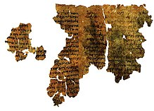
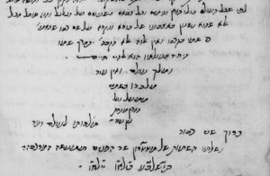
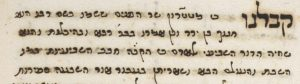
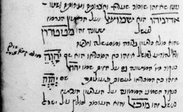
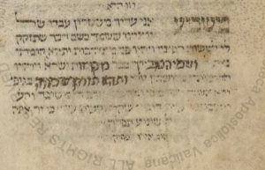
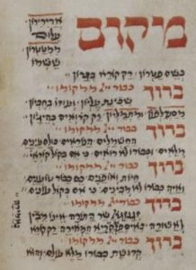

<u>גלגול נשמות – חנוך בן ירד</u>

ארבע דמויות ששמן "חנוך" מופיעות במקרא, כולן ברשימת
שושלות.

שתים אינן מעניינו כאן, חנוך בנו של ראובן (בסוף ספר
בראשית), חנוך בנו של מדין (בספר דברי הימים).

שני "חנוכים" מופיעים בשושלות הראשונות של ספר בראשית, בין
אדם לנוח. חוקרים טוענים שהשניים הם אחד...

<u>ספר בראשית פרק ד</u>

(יז) וַיֵּדַע קַיִן אֶת אִשְׁתּוֹ וַתַּהַר וַתֵּלֶד אֶת חֲנוֹךְ וַיְהִי בֹּנֶה עִיר
וַיִּקְרָא שֵׁם הָעִיר כְּשֵׁם בְּנוֹ חֲנוֹךְ:

(יח) וַיִּוָּלֵד לַחֲנוֹךְ אֶת עִירָד וְעִירָד יָלַד אֶת מְחוּיָאֵל וּמְחִיָּיאֵל יָלַד
אֶת מְתוּשָׁאֵל וּמְתוּשָׁאֵל יָלַד אֶת לָמֶךְ:

(יט) וַיִּקַּח לוֹ לֶמֶךְ שְׁתֵּי נָשִׁים שֵׁם הָאַחַת עָדָה וְשֵׁם הַשֵּׁנִית
צִלָּה:

(כ) וַתֵּלֶד עָדָה אֶת יָבָל הוּא הָיָה אֲבִי ישֵׁב אֹהֶל וּמִקְנֶה:

(כא) וְשֵׁם אָחִיו יוּבָל הוּא הָיָה אֲבִי כָּל תֹּפֵשׂ כִּנּוֹר וְעוּגָב:

(כב) וְצִלָּה גַם הִוא יָלְדָה אֶת תּוּבַל קַיִן לֹטֵשׁ כָּל חֹרֵשׁ נְחשֶׁת וּבַרְזֶל
וַאֲחוֹת תּוּבַל קַיִן נַעֲמָה:

<u>ספר בראשית פרק ה</u>

(ד) וַיִּהְיוּ יְמֵי אָדָם אַחֲרֵי הוֹלִידוֹ אֶת שֵׁת שְׁמֹנֶה מֵאֹת שָׁנָה וַיּוֹלֶד
בָּנִים וּבָנוֹת:

(ה) וַיִּהְיוּ כָּל יְמֵי אָדָם אֲשֶׁר חַי תְּשַׁע מֵאוֹת שָׁנָה וּשְׁלשִׁים שָׁנָה
וַיָּמֹת:

(ו) וַיְחִי שֵׁת חָמֵשׁ שָׁנִים וּמְאַת שָׁנָה וַיּוֹלֶד אֶת אֱנוֹשׁ:

........(אנוש מוליד את קינן, קינן את מהללאל, מהללאל את
ירד)

(יח) וַיְחִי יֶרֶד שְׁתַּיִם וְשִׁשִּׁים שָׁנָה וּמְאַת שָׁנָה וַיּוֹלֶד אֶת
חֲנוֹךְ:

(יט) וַיְחִי יֶרֶד אַחֲרֵי הוֹלִידוֹ אֶת חֲנוֹךְ שְׁמֹנֶה מֵאוֹת שָׁנָה וַיּוֹלֶד
בָּנִים וּבָנוֹת:

(כ) וַיִּהְיוּ כָּל יְמֵי יֶרֶד שְׁתַּיִם וְשִׁשִּׁים שָׁנָה וּתְשַׁע מֵאוֹת שָׁנָה
וַיָּמֹת:

**(כא) וַיְחִי חֲנוֹךְ חָמֵשׁ וְשִׁשִּׁים שָׁנָה וַיּוֹלֶד אֶת מְתוּשָׁלַח:**

**(כב) וַיִּתְהַלֵּךְ חֲנוֹךְ אֶת הָאֱלֹהִים אַחֲרֵי הוֹלִידוֹ אֶת מְתוּשֶׁלַח שְׁלשׁ
מֵאוֹת שָׁנָה וַיּוֹלֶד בָּנִים וּבָנוֹת:**

**(כג) וַיְהִי כָּל יְמֵי חֲנוֹךְ חָמֵשׁ וְשִׁשִּׁים שָׁנָה וּשְׁלשׁ מֵאוֹת
שָׁנָה:**

**(כד) וַיִּתְהַלֵּךְ חֲנוֹךְ אֶת הָאֱלֹהִים וְאֵינֶנּוּ כִּי לָקַח אֹתוֹ
אֱלֹהִים:**

(מתושלח מוליד את למך, למך מוליד את נוח)

כאמור, החוקרים משערים, ששתי השושלות, של שת ושל קין, הן
גירסאות שונות של אותם שמות, שאוחדו בעריכה של ספר בראשית.

הנה השוואה:

 אדם

| שת |  |
|----|----|
| אנוש |  |
| קינן | קין |
| מהללאל | חנוך |
| ירד | עירד |
| חנוך | מחויאל |
| מתושלח | מתושאל |
| למך | למך |
| נוח | יבל, יובל, תובל קין, נעמה |

אם בשושלת קין, נחליף את הסדר בין חנוך למחויאל, נמצא
דמיון בולט בין השמות בשתי השושלות. ברור גם שמחבר שושלת קין לא התכוון
ששלושת אבות התרבות האנושית (יבל, יובל ותובל קין) יושמדו במבול...

כך או כך, אנחנו מתעניינים רק ב"חנוך בן ירד", החנוך
מהשושלת "הלגיטימית" שמביאה אותנו לנוח ומשם עד אלינו. ואנחנו מתעניינים בו
רק מפני שהוא "התהלך את האלוהים" ומפני "ואיננו כי לקח אותו
אלוהים".

הספרות "הרשמית" של חז"ל, אינה עוסקת בחנוך. הוא אינו
מוזכר במשנה, ולא בתלמודים.

אמנם, הוא מוזכר במדרשים הקדומים, לפחות מהמאה
הרביעית.

אך כאשר "בראשית רבה" מזכיר אותו, אנחנו יכולים להתחיל
לחשוד, שהוא מנסה להתמודד עם מידע אחר, מספרות אחרת, שחז"ל לא כל כך אוהבים
אותה. מסבירים לנו שאלוהים לקח אותו לא מפני אהבתו אליו.

<u>מדרש רבה בראשית - פרשה כה פסקה א</u>

"ויתהלך חנוך את האלהים ואיננו כי לקח אותו אלהים".

אמר ר' חמא בר הושעיא: אינו נכתב בתוך טימוסן של צדיקים,
אלא בתוך טימוסן של רשעים.

א"ר איבו: חנוך חנף היה. פעמים צדיק פעמים רשע. אמר הקב"ה
עד שהוא בצדקו אסלקנו. א"ר איבו בר"ה דנו, בשעה שהוא דן כל באי
עולם.

אפיקורסים שאלו לרבי אבהו, אמרו לו, אין אנו מוצאין מיתה
לחנוך.

אמר להם, למה? אמרו לו: נאמרה כאן לקיחה ונאמרה להלן
(מלכים ב ב) כי היום ה' לוקח את אדונך מעל ראשך \[נאמר לאלישע ביחס לאליהו
הנביא\].

אמר להם: אם ללקיחה אתם דורשים, נאמר כאן לקיחה, ונאמר
להלן (יחזקאל כד) "הנני לוקח ממך את מחמד עיניך". \[ששם הכוונה
מוות\].

א"ר תנחומא, יפה השיבן רבי אבהו.

מטרונה שאלה את ר' יוסי אמרה לו: אין אנו מוצאין מיתה
בחנוך.

א"ל אלו נאמר (בראשית ה) ויתהלך חנוך את האלהים ושתק,
הייתי אומר כדבריך. כשהוא אומר "ואיננו כי לקח אותו אלהים"– ואיננו בעולם
הזה, כי לקח אותו אלהים: \[כלומר, מת\].

לא קשה להבין כנגד מי החכמים נאבקים, כנגד אמונות נוצריות
"המקרבות" את השמים לארץ, ומעבירות אנשים חיים לחסות אלוהים. אבל, מאבקם
כאן לא קל, כי קיימת ספרות גדולה מאוד, מאות שנים לפני החורבן, המפרשת את
הכתוב בצורה שאינה נוחה להם.

זו אינה ספרות נוצרית, ואינה ספרות חתרנית, אלא ספרות
אגדתית, שקדמה להופעת הנצרות. לנצרות היא הייתה נוחה, וחז"ל רצו להעלים
אותה.

קיימים היום בידינו שלושה ספרי "חנוך"... ונספר
עליהם.

<u>ספר חנוך א' (האתיופי).</u>

ספר זה, שגיבורו הוא חנוך בן ירד, נכתב בארץ ישראל, בימי
הבית השני, בתקופה ההלניסטית שלפני מרד החשמונאים.

ידוע שסופרים מאוחרים יותר מימי הבית השני, כמו כותב ספר
היובלים, יוסף בן מתתיהו, ופילון האלכסנדרוני הכירו אותו, ולפי זה, וגם לפי
מחקר אחר, מתארכים אותו.

הספר התפרסם רק במאה השמונה עשרה, כאשר עותקים ממנו הובאו
מאתיופיה, כתובים בשפת הגעז. משום כך נקרא "חנוך האתיופי" או "החבשי", אבל
ברור שהוא תורגם לגעז מיוונית, והגירסה היוונית מארמית.

בשנות החמישים התגלו קטעים רבים ממנו בארמית, בקומראן, אך
לא הטקסט המלא.

מסיקים מכך שהיה פופלרי בתקופה מסוימת, אך התנגדות חז"ל
אחר כך, מנעה את העתקתו, ולכן נשארו רק שרידים עתיקים.

קטעים מהמקור הארמי, מקומראן (מהויקיפדיה).

חז"ל התנגדו לספרות כזו, אם מפני התנגדות לפולחן מלאכים,
ואם מפני שאדם שבמקום למות עולה לשמים, תואם את האמונה הנוצרית.

הספר גדול יחסית לספרות התקופה. ב"ספרים חיצוניים" בעריכת
אברהם כהנא, הוא מכיל כשבעים עמודים.

הרקע לספר, הוא סיפור ספר "בראשית" על בני האלוהים היורדים
ונושאים להם נשים מבנות האדם... ועל חנוך מסופר בגוף שלישי, וגם בגוף
ראשון.

<u>ספר בראשית פרק ו</u>

(ד) הַנְּפִלִים הָיוּ בָאָרֶץ בַּיָּמִים הָהֵם וְגַם אַחֲרֵי כֵן אֲשֶׁר יָבֹאוּ בְּנֵי
הָאֱלֹהִים אֶל בְּנוֹת הָאָדָם וְיָלְדוּ לָהֶם הֵמָּה הַגִּבֹּרִים אֲשֶׁר מֵעוֹלָם אַנְשֵׁי הַשֵּׁם:

(ה) וַיַּרְא יְהֹוָה כִּי רַבָּה רָעַת הָאָדָם בָּאָרֶץ וְכָל יֵצֶר מַחְשְׁבֹת לִבּוֹ רַק
רַע כָּל הַיּוֹם:

פסוקים בודדים אלה נחשבים לרקע להשחתת האנושות לקראת
המבול, והם מפותחים בספר חנוך א' ובספרים חיצוניים אחרים למיתולוגיה של
מאבק בין המלאכים הטובים והרעים, שגם בני אדם שותפים לו.

ננסה להבהיר על ידי קטעים אחדים (מפרקים י"ב, י"ג):

לפני הדברים האלה נעלם חנוך ואיש מבני האדם לא ידע איפה
נעלם ואיו ומה היה לו. וכל מעשיו היו עם העירים \[שם נרדף למלאכים\] וימיו
היו עם הקדושים. ואני חנוך ברכתי את יי הגדול מלך העולמים. והנה העירים
קראו אלי, חנוך הסופר, ויאמרו אלי: חנוך אתה סופר הצדק, לכה והודעת לעירי
השמים, **אשר עזבו שמי מעלה, את המקום הקדוש לעולם,** ויטמאו בנשים, ויעשו
כמעשה בני האדם, ויקחו להם נשים, השחת השחיתו הרבה על הארץ. ולא יהי להם
שלום וסליחת חטא. ותחת שמחם בבניהם, ברצח אהוביהם ראו, ועל הכחד בניהם
יקוננו, והתפללו לנצח, ורחמים ושלום לא יהיו להם.

וילך חנוך ויאמר על עזזאל: לא יהי לך שלום דין קשה יצא
לאסרך. ולא תהי לך חנינה ושאלת רחמים על החמס אשר הורית, ועל כל מעשי הרשע
והפשע והחטא אשר הראית לאנשים. ואלך ואדבר אל כלם יחד וייראו ופחד ורעד
אחזום.

אבל, בנוסף לתפקידיו כשליח העליונים לתיקון העולם, חנוך גם
מסייר בעולמות העליונים (מפרק מ"א):

ואחרי אשר ראיתי את מסתרי השמים, ואיך תחלק הממלכה, ואיך
מעשי האדם ישקלו במאזנים, ראיתי שם את משכנות הבחירים ומשכנות הקדושים.
ועיני ראו שם את כל החוטאים המגורשים משם, הכופרים בשם אדון הרוחות,
והנסחבים משם ואין להם תקומה מפני הגמול היוצא מאת אדון הרוחות. ושם ראו
עיני את מסתרי הברק והרעם ומסתרי הרוחות איך יחלקו לנשב על הארץ ומסתרי
העבים והטל ...

בפרקים אחרים הוא מתאר גם את מהלך הירח והשמש, תיאור מדעי
של התקופה ההיא. הוא לומד את "חוק כל כוכבי השמים" מהמלאך אוריאל. בנוסף
הוא גם מקבל יכולת לדעת עתידות (פרק פ"א):

ויאמר אלי חנוך התבונן בלוחות השמים וקראת הכתוב עליהם
וידעת את הכל אחד לאחד. ואתבונן בלוחות השמים ואקרא את כל הכתוב ואבין הכל,
ואקרא ספר כל מעשי האדם וכל יליד בשר אשר יהיו על הארץ עד דורות
עולם.

הספר מפתח את הפסוקים הבודדים בספר בראשית, ובונה את חנוך
כשליח המלאכים הטובים, כמדען, וכנביא.

<u>ספר חנוך ב' (הסלאבי)</u>

ספר זה נמצא בשלמות בשפה הסלאבית העתיקה של הכנסייה,
ונתגלה לחוקרים ב 1886 בבלגרד.

אין קשר בינו ובין ספר חנוך א'.

מניחים שהספר תורגם מיוונית, והמקור עברי או ארמי, ורוב
החוקרים מעריכים שנכתב במאה הראשונה לספירה, כנראה, לפני חורבן בית
המקדש.

עיקר תוכנו של הספר הוא סיור של חנוך בעולמות העליונים, עד
הגעתו לאל עצמו, וכתוב בגוף ראשון:

וַיֵּרָאוּ אֵלַי שְׁנֵי אֲנָשִׁים גְּדוֹלִים מְאֹד אֲשֶׁר לֹא רָאִיתִי כְּמוֹהֶם מִיָּמַי
עַל־הָאָרֶץ: [ה](https://he.wikisource.org/w/index.php?title=%D7%A7%D7%98%D7%92%D7%95%D7%A8%D7%99%D7%94:%D7%97%D7%A0%D7%95%D7%9A_%D7%91_%D7%90_%D7%94&action=edit&redlink=1) וּפְנֵיהֶם
הָיוּ מַזְהִירִים כַּשֶּׁמֶשׁ, עֵינֵיהֶם בּוֹעֲרוֹת כְּלַפִּידִים, אֵשׁ מִפִּיהֶם יוֹצֵאת, בִּגְדֵיהֶם נוֹצוֹת
שׁוֹנוֹת לְמַרְאֶה, רַגְלֵיהֶם כְּאַרְגָּמָן, כַּנְפֵיהֶם מִזָּהָב מַזְהִירוֹת וִידֵיהֶם מִשֶּׁלֶג זַכּוֹת: וַיַּעַמְדוּ
עַל רֹאשׁ מִטָּתִי וַיִּקְרְאוּ־לִי
בִּשְׁמִי: [ו-ז](https://he.wikisource.org/w/index.php?title=%D7%A7%D7%98%D7%92%D7%95%D7%A8%D7%99%D7%94:%D7%97%D7%A0%D7%95%D7%9A_%D7%91_%D7%90_%D7%95-%D7%96&action=edit&redlink=1) וַאֲנִי
הֲקִיצוֹתִי מִשְּׁנָתִי וָאֵרֶא בְּהָקִיץ אֶת־הָאֲנָשִׁים הָהֵם בְּעָמְדָם עַל יָדִי וָאֲמַהֵר וָאֶשְׁתַּחֲוֶה לִפְנֵיהֶם
וָאֶפְחָד וּמַרְאֵה פָנַי שֻׁנָּה
מִפָּחַד: [ח](https://he.wikisource.org/w/index.php?title=%D7%A7%D7%98%D7%92%D7%95%D7%A8%D7%99%D7%94:%D7%97%D7%A0%D7%95%D7%9A_%D7%91_%D7%90_%D7%97&action=edit&redlink=1) וַיֹּאמְרוּ
אֵלַי הָאֲנָשִׁים חֲזַק חֲנוֹךְ אַל תִּירָא, אֱלֹהֵי־עוֹלָם שְׁלָחָנוּ אֵלֶיךָ וְהַיּוֹם אַתָּה עוֹלֶה אִתָּנוּ
הַשָּׁמַיְמָה: 

(מתוך פרק א')

 

וַיְהִי כְּכַלּוֹתִי לְדַבֵּר אֶל־בָּנָי, וַיִּקְרָאוּנִי הָאֲנָשִׁים הָהֵם וַיִּשָּׂאוּנִי
עַל־כַּנְפֵיהֶם וַיַּעֲלוּנִי אֶל־הָרָקִיעַ הָרִאשׁוֹן:
  [ב](https://he.wikisource.org/w/index.php?title=%D7%A7%D7%98%D7%92%D7%95%D7%A8%D7%99%D7%94:%D7%97%D7%A0%D7%95%D7%9A_%D7%91_%D7%92_%D7%91&action=edit&redlink=1) וַיַּעֲמִידוּנִי
עַל הָעֲנָנִים וַיֵּלֵכוּ וָאֵרֶא עוֹד לְמַעְלָה אֶת הָרוּחַ וּלְמַעְלָה \[מִמֶּנּוּ\] רָאִיתִי
אֶת־הָאֲוִיר:
  [ג](https://he.wikisource.org/w/index.php?title=%D7%A7%D7%98%D7%92%D7%95%D7%A8%D7%99%D7%94:%D7%97%D7%A0%D7%95%D7%9A_%D7%91_%D7%92_%D7%92&action=edit&redlink=1) וַיַּעֲמִידוּנִי
בָּרָקִיעַ הָרִאשׁוֹן וַיַּרְאוּנִי יָם רַב מְאֹד גָּדוֹל מִיָּם־הָאָרֶץ:
  [ד](https://he.wikisource.org/w/index.php?title=%D7%A7%D7%98%D7%92%D7%95%D7%A8%D7%99%D7%94:%D7%97%D7%A0%D7%95%D7%9A_%D7%91_%D7%92_%D7%93&action=edit&redlink=1) וַיַּעֲבִירוּ
לְפָנַי אֶת־רָאשֵׁי מִשְׁטְרֵי הַכּוֹכָבִים וְשָׂרֵיהֶם וַיַּרְאוּנִי מָאתַיִם מַלְאָךְ הַמֹּשְׁלִים עַל־הַכּוֹכָבִים
וּבִנְיַן הַשָּׁמָיִם וְהֵם מְעוֹפְפִים בְּכַנְפֵיהֶם וְהוֹלְכִים מִסָּבִיב לְכָל־הַשָּׁטִים:
  [ה](https://he.wikisource.org/w/index.php?title=%D7%A7%D7%98%D7%92%D7%95%D7%A8%D7%99%D7%94:%D7%97%D7%A0%D7%95%D7%9A_%D7%91_%D7%92_%D7%94&action=edit&redlink=1) וְשָׁם
רָאִיתִי אוֹצְרוֹת הַשֶּׁלֶג וְהַקֶּרַח וְהַמַּלְאָכִים הַמַּחֲזִיקִים אֶת־אוֹצְרוֹתֵיהֶם הַנּוֹרָאִים וְאוֹצְרוֹת
הָעֲנָנִים אֲשֶׁר מִשָּׁם יֵצְאוּ וָבָאוּ: 

(מתוך פרק ג')

ברקיע השלישי הוא רואה את גן העדן והגיהנום...

ברקיע הרביעי את השמש, הירח והכוכבים, אשר המלאכים
מובילים, ופותחים וסוגרים שערים לפניהם... (מזכיר את האסטרונומיה של התקופה
לפיה מלאכים מובילים את כוכבי הלכת)

ברקיע החמישי נענשים המלאכים שחטאו בספר
"בראשית"...

והעיקר ברקיע השביעי...

[א](https://he.wikisource.org/w/index.php?title=%D7%A7%D7%98%D7%92%D7%95%D7%A8%D7%99%D7%94:%D7%97%D7%A0%D7%95%D7%9A_%D7%91_%D7%98_%D7%90&action=edit&redlink=1)  וַיִּשָּׂאוּנִי
הָאֲנָשִׁים הָהֵם מִשָּׁם וַיַּעֲלוּנִי לָרָקִיעַ הַשְּׁבִיעִי, וָאֵרֶא שָׁם אוֹר כַּבִּיר מְאֹד וְכָל־צְבָא אֵשׁ
שֶׁל־שָׂרֵי הַמַּלְאָכִים וְכֹחוֹת לֹא־גּוּף וְשִׁלְטוֹנוֹת שָׂרִים וּמוֹשְׁלִים כְּרוּבִים וּשְׂרָפִים, כִּסְאוֹת
וּמְלֵאֵי־עֵינַיִם, עֲשָׂרָה גְּדוּדִים מַעֲמַד
אוֹר־הָאוֹפַנִּים:  [ב](https://he.wikisource.org/w/index.php?title=%D7%A7%D7%98%D7%92%D7%95%D7%A8%D7%99%D7%94:%D7%97%D7%A0%D7%95%D7%9A_%D7%91_%D7%98_%D7%91&action=edit&redlink=1)  וָאִירָא
וְאֶפְחַד פַּחַד
גָּדוֹל:  [ג](https://he.wikisource.org/w/index.php?title=%D7%A7%D7%98%D7%92%D7%95%D7%A8%D7%99%D7%94:%D7%97%D7%A0%D7%95%D7%9A_%D7%91_%D7%98_%D7%92&action=edit&redlink=1)  וְיִקָּחוּנִי
הָאֲנָשִׁים וַיּוֹלִיכוּנִי אֶל־תּוֹכָם וַיֹּאמְרוּ אֵלָי, חֲזַק חֲנוֹךְ
אַל־תִּירָא:  [ד](https://he.wikisource.org/w/index.php?title=%D7%A7%D7%98%D7%92%D7%95%D7%A8%D7%99%D7%94:%D7%97%D7%A0%D7%95%D7%9A_%D7%91_%D7%98_%D7%93&action=edit&redlink=1)  וַיַּרְאוּנִי
מֵרָחוֹק אֶת־יְיָ הַיּוֹשֵׁב עַל־כִּסְאוֹ הָרָם מְאֹד, וְכָל־צְבָא הַשָּׁמַיִם קְרֵבִים וְעוֹמְדִים בְּעֶשֶׂר
מַעֲלוֹת עַל־סִדְרָם וּמִשְׁתַּחֲוִים לַייָ, ...  

[ז](https://he.wikisource.org/w/index.php?title=%D7%A7%D7%98%D7%92%D7%95%D7%A8%D7%99%D7%94:%D7%97%D7%A0%D7%95%D7%9A_%D7%91_%D7%98_%D7%96&action=edit&redlink=1)  וַיִּשְׁלַח
יְיָ אֶת־אֶחָד מִנִּכְבָּדָיו אֶת־גַּבְרִיאֵל שַׂר־הַמַּלְאָכִים, וַיֹּאמֶר אֵלַי, חֲזַק חֲנוֹךְ אַל־תִּירָא, קוּם
וְהָלַכְתָּ אִתִּי וְעָמַדְתָּ לִפְנֵי יְיָ לְעוֹלָם: (מתוך פרק
ט')

את הספר הזה ניתן לשייך כבר לקטגוריה של ספרות "ההיכלות"
הנקראת גם "יורדי המרכבה", שהיא ספרות הסוד שנוצרה בתקופת חז"ל, בצד הזרם
המרכזי של הלכה ומדרשים, וחלקה נשמר גם בעברית. זו ספרות מיסטית, שעיקרה
מפגש ישיר של הגיבור עם האלוהות.

חנוך ג' (ספר היכלות)

<http://www.ma.huji.ac.il/~kazhdan/Shneider/barilan2011/3enoch-M.pdf>

ספר זה ממש שייך לסוגת ספרות ההיכלות.

נכתב במקור בעברית, בתקופה מאוחרת עוד יותר, בין המאה
השנייה למאה החמישית לספירה. ספר קצר, כשני עמודים בכתב קטן... וכנראה שיש
השפעה של חנוך א' על הכותב. אבל, זו כאמור, סוגה אחרת, ספרות ההיכלות, או
"יורדי המרכבה". המספר הוא, כביכול, ר' ישמעאל, חברו ובר הפלוגתא של ר'
עקיבא במאה השנייה לספירה.

וכך הוא מתחיל:

'ויתהלך חנוך את האלוהים ואיננו כי לקח אותו אלהים'. אמר
ר' ישמעאל, כשעליתי למרום להסתכל בצפייתי במרכבה, הייתי נכנס בששה היכלות
חדר בתוך חדר וכיון שהגעתי לפתח היכל השביעי עמדתי בתפילה... ואמרתי רבונו
של עולם בבקשה מלפניך שתגרום לי בשעה זאת זכות אהרון בן עמרם... שקבל כתר
כהונה מלפני כבודך בהר סיני... מיד זימן לי הקדוש ברוך הוא **מטטרון עבדו
מלאך שר הפנים**... ואמר לי בוא בשלום שנתרצית לפני מלך רם ונשא להסתכל
בדמות המרכבה.

ובהמשך, פרק ד'

אמר ר' ישמעאל, אמרתי לו למטטרון, מפני מה אתה נקרא בשם
קונך בשבעים שמות? ואתה גדול מכל השרים וגבוה מכל המלאכים וחביב מכל
המשרתים ונכבד מכל הצבאים ורב מכל האדירים במלוכה ובגדולה ובכבוד. ומפני מה
קוראים אותך בשמי מרומים נער?

השיב ואמר לי. מפני שאני הוא חנוך בן ירד. כשחטאו בני דור
המבול...

וכאן הוא מספר לו את כל קרבות המלאכים שהכרנו בחנוך
א'.

ומעניין פרק ט"ז האחרון:

אמר ר' ישמע\[א\]ל. אמר לי מטטרון מלאך שר הפנים הדר מרום
כל. בתחלה הייתי יושב על כסא (כבוד) גדול בפתח היכל
שביעי, ודנתי את כל בני מרומים פמיליא של מקום מרשות הב'ה.
..... וכיון שבא **אחר** להסתכל בצפיית המרכבה ונתן
עיניו בי. והוא מתיירא ומזדעזע מלפני, ונפשו מבוהלת לצאת ממנו, מפני פחדי
ואימתי ומוראי. כשראה אותי שאני יושב על כסא כמלך,
ומלאכי השרת היו עומדים עלי כעבדים, וכל שרי מלכיות קשורים כתרים סובבים
אצלי. באותה שעה פתח את פיו ואמר. **ודאי** **שתי
רשויות בשמים**. מיד יצאתה בת קול מלפני השכינה אומרת. **שובו בנים שובבים
חוץ מאחר** **דלא**. באותה שעה בא ענפיאל השר נכבד
נהדר נחמד נפלא נורא נערץ משליחות של הב'ה, והכני ששים פולסאות של אור
והעמידני על רגלי.

וכאן ספרות ההיכלות משוחחת עם ספרות חז"ל הידועה יותר,
התלמודית והמדרשית.

הוא מתאר "מצד שני" את האגדה התלמודית על "ארבעה שנכנסו
לפרדס" (בן עזאי, בן זומא, "אחר", ור' עקיבא) ו"אחר" הוא אלישע בן אבויה,
ש"קיצץ בנטיעות" (כלומר, כפר בתורה) לאחר שירד, מפני שהחליט שאין אלוהים
אחד אלא "שתי רשויות בשמים", ומטטרון, הוא חנוך, נענש על כך, בכך מפני
שנראה (או התחזה?) כמו האל עצמו...

בספרות הסוד של תקופת חז"ל, סופו הטוב של חנוך בן ירד הוא
הפיכתו למטטרון, שר הפנים האלוהי, מעין סגנו של אלוהים בכבודו ובעצמו, או
לפחות מנהל המשרד...

מטטרון, נזכר גם בתלמוד הבבלי, אך אינו מזוהה שם עם חנוך.
השם מטטרון אינו עברי, כמובן, ולא ברור. פירושים שונים מובאים מלטינית
ומיוונית, כמו "מורה דרך" או "קרוב לכסא".

<u>תלמוד בבלי מסכת סנהדרין דף לח/ב</u>

ואל משה אמר עלה אל ה'. עלה אלי מיבעי ליה \[היה צריך לומר
"עלה אלי"\] אמר ליה זהו **מטטרון** ששמו כשם רבו, דכתיב כי שמי
בקרבו...

הצורך המדרשי בדמות כזו של "ממלא מקום האלוהים" נוצרת
מפסוקים בשמות כ"ג:

(כ) הִנֵּה אָנֹכִי שֹׁלֵחַ מַלְאָךְ לְפָנֶיךָ לִשְׁמָרְךָ בַּדָּרֶךְ וְלַהֲבִיאֲךָ אֶל הַמָּקוֹם
אֲשֶׁר הֲכִנֹתִי:

(כא) הִשָּׁמֶר מִפָּנָיו וּשְׁמַע בְּקֹלוֹ אַל תַּמֵּר בּוֹ כִּי לֹא יִשָּׂא לְפִשְׁעֲכֶם
**כִּי שְׁמִי בְּקִרְבּוֹ**:

והביטוי "שמי בקרבו" הפך למקור למדרשים, היוצרים את דמות
מטטרון.

בספר נוסף מספרות ההיכלות, "היכלות רבתי", ר' עקיבא מזהה
את חנוך עם מטטרון.

<u>פרקי היכלות רבתי פרק לא אות ג</u>

ג אמר ר' עקיבא: שמעתי קול יוצא מתחת כסא הכבוד אומר. ומה
היה אומר? לקחתיו, אחזתיו, פקדתיו. זה חנוך בן ירד ששמו מטטרו"ן, ונטלתי
אותו מבני אדם ועשיתי לו כסא כנגד כסאי. וכמה שיעור של אותו כסא? אלף אלפי
רבבות פרסאות של אש. ומסרתי שבעים מלאכים כנגד שבעים אומות, ופקדתי בידו כל
פמליא של מעלה וכל פמליא של מטה, וסדרתי לו כל סדרי בראשית, ושמתי שמו
**אדנ"י הקטן** ששמו בגימטריא שבעים ואחד, ונתתי לו חכמה ובינה יותר מכל
המלאכים, ועשיתי לו גדולה יותר מכל מלאכי השרת.

ראינו שספרות חז"ל במחצית הראשונה של האלף הראשון, מסתייגת
מעלייה לשמים, וממלאכים בכלל, במסגרת מאבקה נגד הנצרות, כנראה. והספרות
המיסטית בכלל, וספרות חנוך בפרט, נמחקת (נשארת רק בשפות זרות) או נשארת
בשוליים.

אבל לקראת האלף השני, חודרות האגדות המיסטיות הללו
למדרשים, ובוודאי לקבלה.

<u>פרקי דרבי אליעזר ונציה ש"ד - פרק ח
</u>

במאה השמינית כבר מסכים שחנוך היה מן מדען בחסד
אלוהים.

"זה ספר תולדת אדם", מניָן עולם לכל תולדות בני אדם, אדם
מסר לחנוך ונכנס בסוד העיבור ועיבר את השנה, שנאמר (בראשית ה, כב), "ויתהלך
חנוך את האלהים" וגו', ויתהלך חנוך בדרכי מנין העולם שמסר אלהים לאדם,
וחנוך מסר לנח סוד העיבור ועיבר את השנה, ואמר (בראשית ח, כב), "עד כל ימי
הארץ זרע וקציר וקר וחם וקיץ וחרף".

לפני שנקבע הלוח העברי בצורה מתמטית מלאה, עיבור החודש
ועיבור השנה היה "סוד" המסור למנהיגים.

לעומת זה, יצחק דמן עכו, חכם שחי בעכו במאה ה-13 הולך רחוק
יותר, ואף מוסיף לנו אגדה על מסירותו של חנוך לאלוהים.

<u>ספר מאירת עינים לר' יצחק דמן עכו - פרשת לך
לך</u>

ושאלתי את פי מורי הר' יהודה הדרשן אשכנזי ז"ל מה היה
עניין חנוך, שעל ידו זכה לכל זה, כי עניין אליהו ז"ל ידוע, אבל חנוך למה?
ואמר שקבל, שחנוך היה אישכף, כלומר תופר מנעלים, ובכל נקיבה ונקיבה שהיה
נוקב במרצע בעור, היה מברך בלב שלם ובכוונה שלימה לשם ית', וממשיך הברכה
למטטרון הנאצל, ומעולם לא שכח אפי' בנקיבה אחת מלברך אלא תמיד היה עושה כן,
עד שמרוב אהבה איננו כי לקח אותו אלהים (בראשית ה') וזכה להקראות מטטרון
ומעלתו גדולה עד מאד:

אין קרבות מלאכים, ואין סיורים שמיימיים, אבל יש מסירות
קיצונית לאל, וזה שכרה.

ספר הזוהר מכיר ומקבל את ספרות ההיכלות נוסף לספרות המדרש
המרכזית.

<u>זהר מנוקד/תרגום/ חלק א דף נו/ב</u>

רַבִּי אֶלְעָזָר אָמַר, הַקָּדוֹשׁ בָּרוּךְ הוּא נְטָלוֹ אֶת חֲנוֹךְ וְהֶעֱלָהוּ לִשְׁמֵי
מְרוֹמִים, וּמָסַר בְּיָדָיו כָּל הַגְּנָזִים הָעֶלְיוֹנִים וַחֲמִשָּׁה וְאַרְבָּעִים מַפְתְּחוֹת סְתָרִים חֲקוּקִים
שֶׁבָּהֶם מִשְׁתַּמְּשִׁים מַלְאָכִים עֶלְיוֹנִים, וְכֻלָּם נִמְסְרוּ בְּיָדוֹ, וַהֲרֵי בֵּאַרְנוּ. וַיַּרְא ה' כִּי רַבָּה
רָעַת הָאָדָם בָּאָרֶץ וְכָל יֵצֶר מַחְשְׁבֹת לִבּוֹ.

אבל, אין לו בעיה, במקום אחר, להזכיר את הסתייגות חז"ל
מגדולתו של חנוך.

<u>זהר מנוקד/תרגום/ חלק א דף נו/ב</u>

בֹּא רְאֵה, חֲנוֹךְ הָיָה צַדִּיק, וְהַקָּדוֹשׁ בָּרוּךְ הוּא רָאָה שֶׁאַחַר כָּךְ
יְקַלְקֵל, וְלָקַח אוֹתוֹ בְּטֶרֶם יְקַלְקֵל. זֶהוּ שֶׁכָּתוּב (שיר ו) וְלִלְקֹט שׁוֹשַׁנִּים. מִשּׁוּם
שֶׁנּוֹתְנִים רֵיחַ טוֹב, לוֹקֵחַ אוֹתָם הַקָּדוֹשׁ בָּרוּךְ הוּא בְּטֶרֶם יְקַלְקְלוּ. וְאֵינֶנּוּ כִּי לָקַח אֹתוֹ
אֱלֹהִים. וְאֵינֶנּוּ - לְהַאֲרִיךְ יָמִים כִּשְׁאָר בְּנֵי אָדָם שֶׁהָיוּ מַאֲרִיכִים יָמִים. מָה הַטַּעַם? כִּי
לָקַח אוֹתוֹ הַקָּדוֹשׁ בָּרוּךְ הוּא בְּטֶרֶם הִגִּיעַ זְמַנּוֹ.

והזוהר מתייחס אפילו, להערה שבה התחלנו, שחנוך קיים גם
בשושלת קין.

<u>זהר מנוקד/תרגום/ תיקוני זהר דף קיט/ב</u>

אַחַר כָּךְ עָשָׂה תוֹלָדוֹת מִצַּד הָרַע, וְהִתְפַּשְּׁטוּ בְגִלְגּוּלִים בָּעוֹלָם,
וַעֲלֵיהֶם נֶאֱמַר וַיֵּדַע קַיִן אֶת אִשְׁתּוֹ וַתַּהַר וַתֵּלֶד אֶת חֲנוֹךְ, חֲנוֹךְ מִצַּד קַיִן, וְזֶה יֵצֶר
הָרָע, הַחִנּוּךְ לְרַע, וְיֵשׁ חֲנוֹךְ מִצַּד שֶׁל אֱנוֹשׁ, שֶׁהוּא יֵצֶר הַטּוֹב, הַחִנּוּךְ לְטוֹב, וְנֶאֱמַר
בּוֹ וַיִּתְהַלֵּךְ חֲנוֹךְ אֶת הָאֱלֹהִי"ם וְאֵינֶנּוּ כִּי לָקַח אוֹתוֹ אֱלֹהִי"ם, וְזֶה חֲנוֹךְ שֶׁהִתְהַפֵּךְ
בְּשָׂרוֹ לְלַפִּיד אֵשׁ.

......

וּשְׁלֹשָה הֵם, אָדָם שֵׁת אֱנוֹשׁ. אֱנוֹשׁ, שֶׁמִּשָּׁם הִתְיַחֲסוּ כָּל הַדּוֹרוֹת, זֶהוּ
שֶׁכָּתוּב אָז הוּחַל לִקְרֹא בְּשֵׁם יהו"ה, מִשָּׁם הִתְפַּשְּׁטוּ כָּל גִּלְגּוּלֵי הַצַּדִּיקִים. חֲנוֹךְ שֶׁיָּצָא
מֵאֱנוֹשׁ הוּא מטטרו"ן שֶׁנֶּהְפַּךְ בְּשָׂרוֹ לְלַפִּיד אֵשׁ, וְהוּא נוריא"ל, וְעַל שְׁנֵיהֶם נֶאֱמַר
וְהַחַיּוֹת רָצוֹא וָשׁוֹב, רָצוֹא זֶה נוריא"ל, וָשׁוֹב זֶה מטטרו"ן, כָּךְ עוֹלִים בְּחֶשְׁבּוֹן
כְּמַרְאֵ"ה הַבָּזָק, .....

וכמעט עד ימינו...

<u>ספר עבודת ישראל - פרשת וישב
(ישראל הופשטיין מקוז'ניץ, אדמו"ר חסידי 1800
בערך)</u>

וזה שאמר המקובל הנ"ל בפסוק והנה נער בוכה, כי מט"ט נקרא
בסוד נע"ר כידוע. וסיים כאשר תבין חנוך בן ירד, כי חנוך הוא מט"ט כנודע,
וכאשר יתבאר עוד לקמן מענינים אלו:

<u>מתוך בלוג הספריה הלאומית:</u>

"

"נשלמו השמות של מטטרון שר הפנים".

מתוך כתב יד של ספרות ההיכלות מן המאה ה-17 

"קיבלנו כי מטטרון שר הפנים ששמו כשם רבו הוא חנוך בן
ירד".

מתוך חיבור קבלי מן המאה ה-16 

התיאור המסתורי בספר "בראשית" והסיפור על הפיכתו לכאורה של
חנוך למלאך המשיך להסעיר את חכמי העולם היהודי ואת חכמי הקבלה. שמו של
חנוך, שעליו נאמר שחי 365 שנים, נקשר בלוח השנה השמשי – לוח השנה שנדחה
לטובת לוח השנה העברי הירחי שבו אנחנו משתמשים כיום. חז"ל אפילו העלו את
ההשערה שאותו מטטרון הוא מלאך האלוהים שהדריך את בני ישראל במסעם במדבר.
בעולם הקבלה המאוחר יותר מטטרון אף תואר בתור האדם העליון האידיאלי, שכן
הגשים את ההתעלות הרוחנית שאליה יש לשאוף. שמו שימש להשבעות וללחשים,
ומקובלים רבים אף המליצו שלא לבטא את שמו בקול רם.  

מתוך קובץ השבעות ותפילות שחובר בגרמניה במאה ה-16 

“משביע אני עליך מטטרון עבדו של יוצרנו".

מתוך מחזור תפילות של קהילות איטליה מן המאה ה-15 הנמצא
באוסף הוותיקן 

לצד העיסוק האינטנסיבי בדמותו של מטטרון בכתבי תורת הסוד
הקדומה כדוגמת ספרות ההיכלות, נכנס לאט-לאט שמו של המלאך גם לספרות קאנונית
יותר. מטטרון מוזכר גם בתפילות ובפיוטים ששולבו במחזורים לשבתות ולחגים
בחלק מן הקהילות. שמו, אם כן, היה מוכר לא רק לאלו שפנו לעסוק בכתבים
אזוטריים, אלא נשמע גם בבית הכנסת עצמו. כאן אפשר לראות את אחד הפיוטים
הללו מתוך סידור שנדפס במאה ה-14. הפיוט הוא מסוג "אופן", פיוטים שנאמרים
בזמן תפילת שחרית בשבת ובחג, ועוסקים לרוב בקדושת המלאכים ובתיאורי הרקיע
העליון.

 

פיוט מתוך מחזור "מנהג אשכנז המזרחי" מן המאה ה-14 

כך עשה חנוך/מטטרון את דרכו מפסוק עלום ויחיד בספר בראשית,
דרך כתבים מיסטיים בתורת הסוד הקדומה, אל מחזורי התפילה הרשמיים של קהילות
יהודיות שונות ברחבי העולם. במסע הארוך הזה הוא נעשה אחד המלאכים החזקים
ביותר בפולקלור היהודי, ובסופו של דבר מצא את עצמו מככב גם ביצירות מן
התרבות הפופולרית.  

מאמר של רחל אליאור על חנוך בספרית המגילות של הכוהנים בני
צדוק:

<https://benyehuda.org/read/21536>

מאמר של אלדד וייל על דימויו של חנוך בספר הזוהר בהשוואה
לספרות חז"ל:

<https://efrata.emef.ac.il/wp-content/uploads/2020/05/8-%D7%90%D7%9C%D7%93%D7%93-%D7%95%D7%99%D7%99%D7%9C.pdf>

הנצרות הקדומה קיבלה את חנוך כגיבור, וקידשה את ספר חנוך
א', אך במאה השלישית הורד מקדושתו ולכן נשמר רק בכנסייה החבשית.

בברית החדשה הוא נזכר כמנבא את יום הדין

 וְגַם־חֲנוֹךְ הַשְּׁבִיעִי לְאָדָם נִבָּא עֲלֵיהֶם לֵאמֹר הִנֵּה יְהוָֹה בָּא בְּרִבֲבֹת
קְדֹשָׁיו׃ (איגרת יהודה 14) אך לא מופיעים סיפוריו.

<u>חנוך כדמות איקונית בספרותנו – יהודית צוויק
(JSTOR)</u>

חנוך על אגדותיו היה נוח לנוצרים, בין השאר בגלל עלייתו
לשמים חי, ולעומת זה בכל ספרות חז"ל אינו נזכר או נזכר לשלילה.

הקבלה קיבלה אותו. יצחק דמן עכו בספרו "מאירת עיניים" עושה
אותו תופר מנעלים, וגירסה זו מופיעה אצל רמ"ק ב"פרדס רימונים"
והלאה.

בכל רשימת התנאים והאמוראים אין איש הנושא את השם חנוך. גם
לא ברשימת גאוני סורא ופומפדיתא. חנוך נזכר כבנו של אדם בשם משה, במסורת של
"ארבעת השבויים" שהקימו את מרכזי היהדות בספרד וצפון אפריקה בסוף האלף
הראשון.

מהמאה ה-17 נפוץ השם בחברה היהודית של מזרח אירופה כחנוך
או העניך (הביטוי האידישאי), וקיבלו שם זה כמה צדיקים חסידיים. מאז הוא גם
נפוץ בספרות היידיש.

בספרות החדשה, מופיעים שלושה נושאי שם זה ביצירות של
סופרים גדולים:

דמות ב "שכול וכישלון" של ברנר.

דמות העניך ב "מזה ומזה" של הזז.

דמות ב"אורח נטה ללון" של עגנון.

מחברת המאמר טוענת שהשם מעוגן בחנוך בן ירד והדמויות
מרמזות על מוטיבים הקשורים בו. כל השלושה מתים טרם זמנם. ולכולם מתאים
המושג "איננו" המקראי, גם בחייהם. אצל עגנון היא מוצאת גם מוטיבים רבים
מהאגדות על חנוך.

עד כאן חנוך בן ירד, שמפסוק אחד או שניים בתחילת ספר
בראשית, הגיע עד כסא הכבוד.
