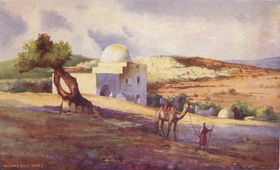
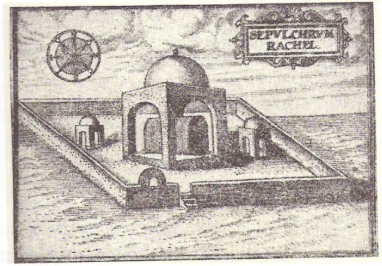
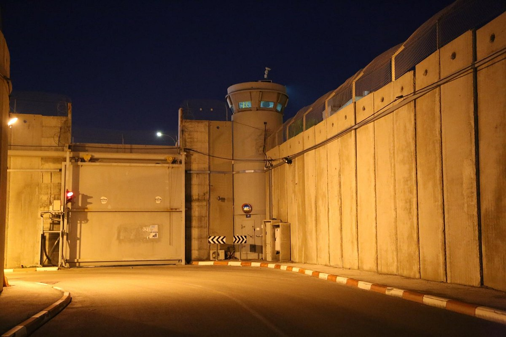
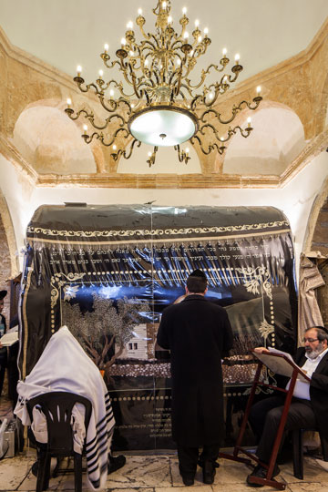

<u>גלגול נשמות – רחל אמנו</u>

רחל אמנו היא דמות המופיעה בסיפור ריאלי (חסר ניסים) עם
פרטים רבים.

<u>ספר בראשית פרק כט</u>

(ט) עוֹדֶנּוּ מְדַבֵּר עִמָּם וְרָחֵל בָּאָה עִם הַצֹּאן אֲשֶׁר לְאָבִיהָ כִּי רֹעָה
הִוא:

(י) וַיְהִי כַּאֲשֶׁר רָאָה יַעֲקֹב אֶת רָחֵל בַּת לָבָן אֲחִי אִמּוֹ וְאֶת צֹאן לָבָן
אֲחִי אִמּוֹ וַיִּגַּשׁ יַעֲקֹב וַיָּגֶל אֶת הָאֶבֶן מֵעַל פִּי הַבְּאֵר וַיַּשְׁקְ אֶת צֹאן לָבָן אֲחִי
אִמּוֹ:

(יא) וַיִּשַּׁק יַעֲקֹב לְרָחֵל וַיִּשָּׂא אֶת קֹלוֹ וַיֵּבְךְּ:

(יב) וַיַּגֵּד יַעֲקֹב לְרָחֵל כִּי אֲחִי אָבִיהָ הוּא וְכִי בֶן רִבְקָה הוּא וַתָּרָץ
וַתַּגֵּד לְאָבִיהָ:

<u>ספר בראשית פרק כט</u>

(יח) וַיֶּאֱהַב יַעֲקֹב אֶת רָחֵל וַיֹּאמֶר אֶעֱבָדְךָ שֶׁבַע שָׁנִים בְּרָחֵל בִּתְּךָ
הַקְּטַנָּה:

(יט) וַיֹּאמֶר לָבָן טוֹב תִּתִּי אֹתָהּ לָךְ מִתִּתִּי אֹתָהּ לְאִישׁ אַחֵר שְׁבָה
עִמָּדִי:

(כ) וַיַּעֲבֹד יַעֲקֹב בְּרָחֵל שֶׁבַע שָׁנִים וַיִּהְיוּ בְעֵינָיו כְּיָמִים אֲחָדִים
בְּאַהֲבָתוֹ אֹתָהּ:

(כא) וַיֹּאמֶר יַעֲקֹב אֶל לָבָן הָבָה אֶת אִשְׁתִּי כִּי מָלְאוּ יָמָי וְאָבוֹאָה
אֵלֶיהָ:

(כב) וַיֶּאֱסֹף לָבָן אֶת כָּל אַנְשֵׁי הַמָּקוֹם וַיַּעַשׂ מִשְׁתֶּה:

(כג) וַיְהִי בָעֶרֶב וַיִּקַּח אֶת לֵאָה בִתּוֹ וַיָּבֵא אֹתָהּ אֵלָיו וַיָּבֹא
אֵלֶיהָ:

(כד) וַיִּתֵּן לָבָן לָהּ אֶת זִלְפָּה שִׁפְחָתוֹ לְלֵאָה בִתּוֹ שִׁפְחָה:

(כה) וַיְהִי בַבֹּקֶר וְהִנֵּה הִוא לֵאָה וַיֹּאמֶר אֶל לָבָן מַה זֹּאת עָשִׂיתָ לִּי
הֲלֹא בְרָחֵל עָבַדְתִּי עִמָּךְ וְלָמָּה רִמִּיתָנִי:

<u>ספר בראשית פרק ל</u>

(א) וַתֵּרֶא רָחֵל כִּי לֹא יָלְדָה לְיַעֲקֹב וַתְּקַנֵּא רָחֵל בַּאֲחֹתָהּ וַתֹּאמֶר אֶל
יַעֲקֹב הָבָה לִּי בָנִים וְאִם אַיִן מֵתָה אָנֹכִי:

<u>ספר בראשית פרק ל</u>

(יד) וַיֵּלֶךְ רְאוּבֵן בִּימֵי קְצִיר חִטִּים וַיִּמְצָא דוּדָאִים בַּשָּׂדֶה וַיָּבֵא
אֹתָם אֶל לֵאָה אִמּוֹ וַתֹּאמֶר רָחֵל אֶל לֵאָה תְּנִי נָא לִי מִדּוּדָאֵי בְּנֵךְ:

(טו) וַתֹּאמֶר לָהּ הַמְעַט קַחְתֵּךְ אֶת אִישִׁי וְלָקַחַת גַּם אֶת דּוּדָאֵי בְּנִי
וַתֹּאמֶר רָחֵל לָכֵן יִשְׁכַּב עִמָּךְ הַלַּיְלָה תַּחַת דּוּדָאֵי בְנֵךְ:

(טז) וַיָּבֹא יַעֲקֹב מִן הַשָּׂדֶה בָּעֶרֶב וַתֵּצֵא לֵאָה לִקְרָאתוֹ וַתֹּאמֶר אֵלַי
תָּבוֹא כִּי שָׂכֹר שְׂכַרְתִּיךָ בְּדוּדָאֵי בְּנִי וַיִּשְׁכַּב עִמָּהּ בַּלַּיְלָה הוּא:

<u>ספר בראשית פרק ל</u>

(כב) וַיִּזְכֹּר אֱלֹהִים אֶת רָחֵל וַיִּשְׁמַע אֵלֶיהָ אֱלֹהִים וַיִּפְתַּח אֶת
רַחְמָהּ:

(כג) וַתַּהַר וַתֵּלֶד בֵּן וַתֹּאמֶר אָסַף אֱלֹהִים אֶת חֶרְפָּתִי:

(כד) וַתִּקְרָא אֶת שְׁמוֹ יוֹסֵף לֵאמֹר יֹסֵף יְהֹוָה לִי בֵּן אַחֵר:

<u>ספר בראשית פרק לא</u>

(כה) וַיַּשֵּׂג לָבָן אֶת יַעֲקֹב וְיַעֲקֹב תָּקַע אֶת אָהֳלוֹ בָּהָר וְלָבָן תָּקַע אֶת
אֶחָיו בְּהַר הַגִּלְעָד:

(כו) וַיֹּאמֶר לָבָן לְיַעֲקֹב מֶה עָשִׂיתָ וַתִּגְנֹב אֶת לְבָבִי וַתְּנַהֵג אֶת בְּנֹתַי
כִּשְׁבֻיוֹת חָרֶב:

......

(ל) וְעַתָּה הָלֹךְ הָלַכְתָּ כִּי נִכְסֹף נִכְסַפְתָּה לְבֵית אָבִיךָ **לָמָּה גָנַבְתָּ אֶת
אֱלֹהָי**:

(לא) וַיַּעַן יַעֲקֹב וַיֹּאמֶר לְלָבָן כִּי יָרֵאתִי כִּי אָמַרְתִּי פֶּן תִּגְזֹל אֶת
בְּנוֹתֶיךָ מֵעִמִּי:

(לב) **עִם אֲשֶׁר תִּמְצָא אֶת אֱלֹהֶיךָ לֹא יִחְיֶה** נֶגֶד אַחֵינוּ הַכֶּר לְךָ
מָה עִמָּדִי וְקַח לָךְ וְלֹא יָדַע יַעֲקֹב כִּי **רָחֵל גְּנָבָתַם**:

(לג) וַיָּבֹא לָבָן בְּאֹהֶל יַעֲקֹב וּבְאֹהֶל לֵאָה וּבְאֹהֶל שְׁתֵּי הָאֲמָהֹת וְלֹא
מָצָא וַיֵּצֵא מֵאֹהֶל לֵאָה וַיָּבֹא בְּאֹהֶל רָחֵל:

(לד) וְרָחֵל לָקְחָה אֶת הַתְּרָפִים וַתְּשִׂמֵם בְּכַר הַגָּמָל וַתֵּשֶׁב עֲלֵיהֶם וַיְמַשֵּׁשׁ
לָבָן אֶת כָּל הָאֹהֶל וְלֹא מָצָא:

(לה) וַתֹּאמֶר אֶל אָבִיהָ אַל יִחַר בְּעֵינֵי אֲדֹנִי כִּי לוֹא אוּכַל לָקוּם
מִפָּנֶיךָ כִּי דֶרֶךְ נָשִׁים לִי וַיְחַפֵּשׂ וְלֹא מָצָא אֶת הַתְּרָפִים:

<u>ספר בראשית פרק לה</u>

(טז) וַיִּסְעוּ מִבֵּית אֵל וַיְהִי עוֹד כִּבְרַת הָאָרֶץ לָבוֹא אֶפְרָתָה וַתֵּלֶד
רָחֵל וַתְּקַשׁ בְּלִדְתָּהּ:

(יז) וַיְהִי בְהַקְשֹׁתָהּ בְּלִדְתָּהּ וַתֹּאמֶר לָהּ הַמְיַלֶּדֶת אַל תִּירְאִי כִּי גַם זֶה
לָךְ בֵּן:

(יח) וַיְהִי בְּצֵאת נַפְשָׁהּ כִּי מֵתָה וַתִּקְרָא שְׁמוֹ בֶּן אוֹנִי וְאָבִיו קָרָא
לוֹ בִנְיָמִין:

(יט) וַתָּמָת רָחֵל וַתִּקָּבֵר בְּדֶרֶךְ אֶפְרָתָה הִוא בֵּית לָחֶם:

(כ) וַיַּצֵּב יַעֲקֹב מַצֵּבָה עַל קְבֻרָתָהּ הִוא מַצֶּבֶת קְבֻרַת רָחֵל **עַד
הַיּוֹם**:

רחל של ספר בראשית היא דמות מאוד עשירה, מאוד מגוונת, וכמו
הרבה דמויות בכל סיפורי יעקב ויוסף, היא דמות ריאלית ולאו דווקא אידיאלית.
בוודאי לא סטריאוטיפית.

פגישתה עם יעקב היא מעין אהבה ממבט ראשון.

יעקב מנשק אותה, דבר המהווה בעייה לשומרי המצוות עד היום
הזה... (התירוץ המקובל הוא שהיא הייתה קרובתו, בת דודו, אבל יש ויכוח אם
מותר לנשק בת דוד).

רחל היא עקרה, כמו רוב האמהות החשובות במקרא. עקרה שלבסוף
יולדת. אך כעקרה היא ממורמרת, ולבסוף מנסה את מזלה בעזרת הדודאים, צמח
שהאמינו שהוא תורם לפריון. כנראה שהצליחה, למרות שהמדרש טוען, שדווקא לאה,
שקיבלה עוד לילה עם יעקב תמורת הדודאים, ילדה את בנה החמישי...

רחל גונבת את התרפים (פסלי אלילים קטנים) מאביה, גם בלי
ידיעת יעקב, ומצליחה להחביא אותם ממנו. בעיה לפרשנים (לגניבות כבר התרגלנו,
אבל לאלילים...).

רחל יולדת את יוסף (בעזרת הדודאים?), ובדרך חזרה לארץ
ישראל, היא יולדת את בנימין ומתה בלידה. היא היחידה מקרב ארבעת האמהות שלא
נקברת במערכת המכפלה (השפחות, כמובן, אינן נחשבות) אבל, דווקא קברה נזכר
בתנ"ך מעבר לספר בראשית, ומערת המכפלה אינה נזכרת עד התקופה הביזנטית. גם
הביטוי "עד היום", מראה שהכותב, שכתב את הדברים בוודאי בימי ממלכת ישראל או
יהודה, אם לא מאוחר יותר, בימי הבית השני, ידע מסורת על מקום הקבר.

מבחינת ההיגיון הפשוט, הלא דתי, ברור שרחל היא דמות השייכת
למסורת ממלכת ישראל, הצפונית, יחד עם כל משפחת יעקב, שהרי היא אמם של יוסף
ובנימין, וסבתם של אפרים ומנשה (ואפרים היה השבט המרכזי בממלכה הצפונית).
אבל, הצטרפותו המאוחרת של שבט בנימין לממלכת יהודה, אולי מסבכת את
המצב...

המספר לא דן אותה, לא לזכות ולא לחובה.

רחל עולה לגדולה במסורת שלנו, מן הסתם, לא בגלל סיפורים
אלה, אלא בזכות ירמיהו הנביא.

בכלל, בניגוד לדמויות רבות מספר בראשית, שנזכרות רק כסמלים
בדרך כלל, רחל נזכרת שלוש פעמים בתנ"ך לאחר ספר בראשית.

פעם אחת בברכה:

<u>ספר רות פרק ד</u>

(יא) וַיֹּאמְרוּ כָּל הָעָם אֲשֶׁר בַּשַּׁעַר וְהַזְּקֵנִים עֵדִים יִתֵּן יְהֹוָה אֶת
הָאִשָּׁה הַבָּאָה אֶל בֵּיתֶךָ **כְּרָחֵל וּכְלֵאָה** אֲשֶׁר בָּנוּ שְׁתֵּיהֶם אֶת בֵּית יִשְׂרָאֵל וַעֲשֵׂה חַיִל
בְּאֶפְרָתָה וּקְרָא שֵׁם בְּבֵית לָחֶם:

הברכה מעניינת, לא רק מפני הקדמת רחל ללאה, למרות שמדובר
על בית לחם יהודה, אלא מפני ששתיהם "בנו את בית ישראל". כלומר, ישראל כאן
מאוחדת וכוללת את יהודה, וכנראה המגילה נכתבה בימי הבית השני. (מובן,
שמבחינה מסורתית ניתן לומר, שהתקופה היא תקופת דוד או שלמה).

בספר שמואל נזכר קבר רחל כבדרך אגב:

<u>ספר שמואל א פרק י</u>

(ב) בְּלֶכְתְּךָ הַיּוֹם מֵעִמָּדִי וּמָצָאתָ שְׁנֵי אֲנָשִׁים עִם קְבֻרַת רָחֵל בִּגְבוּל
בִּנְיָמִן בְּצֶלְצַח וְאָמְרוּ אֵלֶיךָ נִמְצְאוּ הָאֲתֹנוֹת אֲשֶׁר הָלַכְתָּ לְבַקֵּשׁ וְהִנֵּה נָטַשׁ אָבִיךָ אֶת דִּבְרֵי
הָאֲתֹנוֹת וְדָאַג לָכֶם לֵאמֹר מָה אֶעֱשֶׂה לִבְנִי:

המקום ידוע אז, ואשר למיקום עצמו, נראה אחר כך.

וכמובן, נבואת ירמיהו, המתייחס אליה כדמות חיה:

<u>ספר ירמיה פרק לא</u>

(יד) כֹּה אָמַר יְהֹוָה קוֹל בְּרָמָה נִשְׁמָע נְהִי בְּכִי תַמְרוּרִים רָחֵל מְבַכָּה
עַל בָּנֶיהָ מֵאֲנָה לְהִנָּחֵם עַל בָּנֶיהָ כִּי אֵינֶנּוּ:

(טו) כֹּה אָמַר יְהֹוָה מִנְעִי קוֹלֵךְ מִבֶּכִי וְעֵינַיִךְ מִדִּמְעָה כִּי יֵשׁ שָׂכָר
לִפְעֻלָּתֵךְ נְאֻם יְהֹוָה וְשָׁבוּ מֵאֶרֶץ אוֹיֵב:

עד כאן, במקרא.

במדרשים רחל היא צדיקה גדולה.

חלק מהמדרשים ממלאים את "החור" הבולט, של ליל הכלולות של
יעקב, שלא מרגיש שמחליפים לו אשה. המדרש משתף את רחל בתרגיל הרמיה של לבן,
אך מתוך מניעים מוסריים עילאיים.

<u>מדרש רבה בראשית - פרשה עג פסקה ד</u>

(ד) ויזכור אלהים את רחל. מה זכירה זכר לה? שתיקתה לאחותה.
בשעה שהיו נותנין לו את לאה היתה יודעת ושותקת.

אבל היא לא רק ידעה ושתקה... היא אפילו סייעה למעשה
המרמה.

ננסה להבין את הארמית בקטע הבא...

<u>תלמוד בבלי מסכת בבא בתרא דף קכג/א</u>

אמרה ליה \[רחל\]: אין מיהו אבא רמאה הוא ולא יכלת
ליה.

אמר לה: מאי רמאותיה?

אמרה ליה: אית לי אחתא דקשישא מינאי, ולא מנסבא לי
מקמה.

אמר לה: אחיו אני ברמאות \[א"ל\] ומי שרי להו לצדיקי
לסגויי ברמאותא, "אין עם נבר תתנבר ועם עקש תתפל". מסר לה סימנין. \[קוד,
סיסמה...\]

כי קא מעיילי לה ללאה, סברה השתא מיכספא אחתאי, מסרתינהו
ניהלה.

והיינו דכתיב: "ויהי בבקר והנה היא לאה" מכלל דעד השתא לאו
לאה היא, אלא מתוך סימנים שמסר לה יעקב לרחל ומסרתה ללאה, לא הוה ידע לה עד
ההיא שעתא.

וכרגיל, אנחנו תובעים מאלוהים שירחם עלינו בזכות אבותינו
ואמהותינו הצדיקים.

ובאיכה רבה היא לא מסתפקת במסירת הסימנים הסודיים שבינה
ובין יעקב...

<u>מדרש רבה איכה - הקדמה פסקה כד</u>

באותה שעה קפצה רחל אמנו לפני הקב"ה ואמרה: רבש"ע, גלוי
לפניך שיעקב עבדך אהבני אהבה יתירה ועבד בשבילי לאבא שבע שנים, וכשהשלימו
אותן שבע שנים והגיע זמן נשואי לבעלי יעץ אבי להחליפני לבעלי, בשביל אחותי.
והוקשה עלי הדבר עד מאד כי נודעה לי העצה, והודעתי לבעלי, ומסרתי לו סימן
שיכיר ביני ובין אחותי כדי שלא יוכל אבי להחליפני. ולאחר כן נחמתי בעצמי
וסבלתי את תאותי, ורחמתי על אחותי שלא תצא לחרפה, ולערב חלפו אחותי לבעלי
בשבילי ומסרתי לאחותי כל הסימנין שמסרתי לבעלי, כדי שיהא סבור שהיא רחל.
ולא עוד אלא **שנכנסתי תחת המטה** שהיה שוכב עם אחותי והיה מדבר עמה והיא
שותקת ואני משיבתו על כל דבר ודבר כדי שלא יכיר לקול אחותי. וגמלתי חסד עמה
ולא קנאתי בה ולא הוצאתיה לחרפה.

ומה אני שאני בשר ודם עפר ואפר לא קנאתי לצרה שלי ולא
הוצאתיה לבושה ולחרפה, ואתה מלך חי וקיים רחמן, מפני מה קנאת לעבודת כוכבים
שאין בה ממש והגלית בני ונהרגו בחרב ועשו אויבים בם כרצונם.

מיד נתגלגלו רחמיו של הקדוש ברוך הוא ואמר: בשבילך רחל אני
מחזיר את ישראל למקומן. הדא הוא דכתיב (ירמיה ל"א) כה אמר ה' קול ברמה נשמע
נהי בכי תמרורים רחל מבכה על בניה מאנה להנחם על בניה כי איננו וכתיב (שם)
כה אמר ה' מנעי קולך מבכי ועיניך מדמעה כי יש שכר לפעולתך וגו' וכתיב (שם)
ויש תקוה לאחריתך נאם ה' ושבו בנים לגבולם:

אבל יש עוד בעייה עם רחל... למה גנבה רחל תרפים מאביה? את
אלוהיו, כלומר, אליליו? הייתכן?

<u>רש"י על בראשית פרק לא פסוק יט</u>

ותגנב רחל את התרפים - להפריש את אביה מע"א נתכוונה
(ב"ר):

<u>רבנו חננאל על בראשית פרק לא פסוק יט
(פרשן איטלקי, שקדם לרש"י הצרפתי. נפטר בשנת
1055).</u>

ותגנוב רחל את התרפים אשר לאביה. גנבה אותם כדי שיחזור בו
ושיאמר אלוהים הגנוב אין בו ממש.

<u>אבן עזרא על בראשית פרק לא פסוק יט
(קצת יותר ביקורתי)</u>

...... \[לאחר הסבר על מהות התרפים\]... ויש אומרים שרחל
גנבתם לבטל עבודת כוכבי' מאביה ואילו היה כן למה הוליכה אותם עמה ולא טמנם
בדרך. והקרוב שהיה לבן אבהדדע מזלות, ופחדה שאביה יסתכל במזלות לדעת אי זה
דרך ברחו:

ראב"ע הוא פרשן רציונלי, אבל, מצד שני יש לו אמונה מסוימת
באסטרולוגיה.

<u>רשב"ם על בראשית פרק לא פסוק יט</u>

(יט) ותגנוב רחל את התרפים - שלא יגידו ויודיעו ללבן כי
רוצה יעקב לברוח כענין שנאמר "אין אפוד ותרפים כי התרפים דברו און". רגילים
היו לקסום בהם:

למרות הכוונות הטובות, מותה של רחל מיוחס לגניבה, מפני
שיעקב אומר ללבן שאם ימצא את התרפים אצל מישהו, הוא לא יחיה..

<u>רש"י על בראשית פרק לא פסוק לב</u>

(לב) לא יחיה - ומאותה קללה מתה רחל בדרך (ב"ר):

בקבלה רחל מזוהה עם ספירת מלכות, שהיא השכינה, שהיא כנסת
ישראל.... כמו כל הספירות שיש להם זיהויים שונים ולא תמיד חד
משמעיים.

ספירת מלכות, היא הנמוכה ביותר בעשרת הספירות, והיא מייצגת
את עם ישראל ואת בריתו עם האל. המוטיבציה לייחוס רחל לספירה זו היא, כמובן,
נבואת ירמיהו.

<u>זוהר מנוקד, תרגום, חלק א דף ר"ג/א‏</u>

"מַה לָּךְ אֵפוֹא כִּי עָלִית כֻּלָּךְ לַגַּגּוֹת" \[ישעיהו כ"ב א'\], שֶׁהֲרֵי
כְּשֶׁנֶּחֱרַב הַמִּקְדָּשׁ, **הַשְּׁכִינָה בָּאָה וְעָלְתָה לְכָל אוֹתָם הַמְּקוֹמוֹת שֶׁהָיָה בָהֶם מְדוֹרָהּ
בָּרִאשׁוֹנָה, וְהָיְתָה בּוֹכָה עַל בֵּית מְדוֹרָהּ, וְעַל יִשְׂרָאֵל שֶׁהָלְכוּ לַגָּלוּת,** וְעַל כָּל אוֹתָם
הַחֲסִידִים וְהַצַּדִּיקִים שֶׁהָיוּ שָׁם וְנֶאֶבְדוּ. וּמִנַּיִן לָנוּ? שֶׁכָּתוּב (ירמיה לא) כֹּה אָמַר ה'
**קוֹל בְּרָמָה נִשְׁמָע נְהִי בְּכִי תַמְרוּרִים רָחֵל מְבַכָּה עַל בָּנֶיהָ, וַהֲרֵי נִתְבָּאֵר. וְאָז הַקָּדוֹשׁ
בָּרוּךְ הוּא שׁוֹאֵל אֶת הַשְּׁכִינָה וְאוֹמֵר לָהּ: "מַה לָּךְ אֵפוֹא כִּי עָלִית כֻּלָּךְ
לַגַּגּוֹת".**

‏

<u>זהר מנוקד/תרגום/ חלק ב דף כט/ב</u>

בֹּא רְאֵה, **כְּנֶסֶת יִשְׂרָאֵל נִקְרֵאת כָּךְ: רָחֵל**. כְּמוֹ שֶׁנֶּאֱמַר (ישעיה
נג) וּכְרָחֵל לִפְנֵי גוֹזְזֶיהָ נֶאֱלָמָה. לָמָּה נֶאֱלָמָה? שֶׁכְּשֶׁשּׁוֹלְטִים שְׁאָר הָעַמִּים, הַקּוֹל נִפְסָק
מִמֶּנָּה וְהִיא נֶאֱלֶמֶת.

<u>ספר עץ חיים - שער לב פרק ה מ"ת
(ספר של חיים ויטאל תלמיד האר"י)</u>

כי מציון, הוא **יסוד** דז"א, אשר היסוד הזה נקרא מכלל
יופי בסוד "ויהי יוסף יפה תואר" ובסוד "והדרת פני זקן" כנודע. הנה מבחי'
ציון הנזכר, **אלקים, שהיא מלכות, הנקראת רחל,** הופיע וקבלה הארתה משם,
ע"י ציון שהוא **היסוד** דז"א, כמבואר אצלינו

**כנסת ישראל שכינה מלכות נקראת כנסת ישראל**. והטעם פי'
בזוהר (בלק דף קצ"ז.)

יצירות רבות בעת החדשה, נכתבו על רחל או מזכירות
אותה.

לא נעסוק בכך, אך אי אפשר בלי להזכיר את רחל המשוררת
כמזדהה עם רחל המקראית.

<u>רחל (רחל המשוררת)</u>

הֵן דָּמָהּ בְּדָמִי זוֹרֵם,

הֵן קוֹלָהּ בִּי רָן –

רָחֵל הָרוֹעָה צֹאן לָבָן,

רָחֵל – אֵם הָאֵם.  
וְעַל כֵּן הַבַּיִת לִי צַר

וְהָעִיר – זָרָה,

כִּי הָיָה מִתְנוֹפֵף סוּדָרָהּ

לְרוּחוֹת הַמִּדְבָּר;  
וְעַל כֵּן אֶת דַּרְכִּי אֹחַז

בְּבִטְחָה כָּזֹאת,

כִּי שְׁמוּרִים בְּרַגְלַי זִכְרוֹנוֹת

מִנִי אָז, מִנִּי אָז!

תרפ"ו

בשיר "עקרה", היא מזכירה את התמרמרותה אל יעקב על
עקרותה.

<u>עקרה</u>

בֵּן לוּ הָיָה לִי! יֶלֶד קָטָן,

שְׁחֹר תַּלְתַּלִים וְנָבוֹן.

לֶאֱחֹז בְּיָדוֹ וְלִפְסֹעַ לְאַט

בִּשְׁבִילֵי הַגָּן.

יֶלֶד.

קָטָן.  
אוּרִי אֶקְרָא לוֹ, אוּרִי שֶׁלִּי!

רַךְ וְצָלוּל הוּא הַשֵּׁם הַקָּצָר.

רְסִיס נְהָרָה.

לְיַלְדִּי הַשְּׁחַרְחַר

“אוּרִי!” –

אֶקְרָא!  
**עוֹד אֶתְמַרְמֵר כְּרָחֵל הָאֵם.**

עוֹד אֶתְפַּלֵּל כְּחַנָּה בְּשִׁילֹה.

עוֹד אֲחַכֶּה

לוֹ.

תרפ"ח

**רחל (שיר ביקורתי מאת שולמית חוה הלוי, 2020)**

לֹא דַי הָיָה לָךְ,  
יָפָה וַאֲהוּבָה מֵאֵם הַבָּנִים  
מֵאַנְתְּ לִשְׂמֹחַ.

כְּשֶׁפָּתַח רַחְמֵךְ אָמַרְתְּ לָאֵל לֹא דַי  
בְּתִינוֹקֵךְ לֹא הִבַּטְתְּ מִשְׁתָּאָה: רְאוּ הַיָּפֶה בַּבָּנִים  
לֹא דַי בְּךָ אָמַרְתְּ לוֹ וְחָרַצְתְּ שְׁמוֹ – יוֹסֵף  
חָרַצְתְּ אֶת מוֹתֵךְ  
אֶת יַתְמוּתוֹ.

הַיֵּצֶר מְקַנֵּן בְּרַחְמֵךְ  
קוֹנָה דוּדָאִים חֵלֶף לֵילוֹת בְּדִידוּת  
מְקוֹנֶנֶת עַל הַבָּנִים שֶׁלֹּא יִהְיוּ  
רוֹקֶמֶת מְעִילִים קְטַנִּים בְּפִרְחֵי לַעֲנָה  
אִישׁ לֹא הֵבִין אֶת הָאֲבֵלוּת הַמְפַכָּה  
אִישׁ לֹא בִּכָּה  
אִתָּךְ.

לֹא דַי הָיָה לָךְ  
לִהְיוֹת אֲהוּבָתוֹ  
מַתְּ בְּאֶמְצַע יָפְיֵךְ בְּאֶמְצַע הַדֶּרֶךְ  
כָּל תַּאֲוָתֵךְ  
בְּרַחְמֵךְ.

מִנְעִי קוֹלֵךְ  
אֵין אִישׁ  
אַתְּ תָּקִיצִי לְבַדֵּךְ  
אֲחוֹתֵךְ תָּקוּם לְקֵץ הַיָּמִין  
בִּימִין בַּעֲלֵךְ.

היחידה מכל האבות והאמהות, לרחל יש תאריך פטירה, ולכן,
כמובן, יש סיבה להתאסף בקברה לתפילות (למרות שכל יום מתאים לכך).

יום פטירתה הוא י"א מרחשוון.

תאריך זה, כמעט, נזכר בספר היובלים.

<u>ספר יובלים פרק ל"ב.</u>

(לט) ותלד רחל בן ותקרא שמו בן אוני בהקשותה בלידתה, ואביו
קרא לו בנימין, **בעשירי לחודש השמיני** בשנה הראשונה לשבוע השישי ליובל
ההוא. (מ) ותמת רחל שם ותיקבר בארץ אפרתה היא בית
לחם. (מא) ויבן יעקב על קבורת רחל מצבה בדרך על קבורתה.

אבל התאריך של י"א בחשוון נלקח מילקוט שמעוני, מדרש מאוחר,
ובו תאריכים היוולדם של בני יעקב. מכיוון שנראה שהמקור הקדום לתאריכים אלה
הוא ספר היובלים, כנראה שגם תאריך הולדת בנימין נלקח משם ומשום מה נוסף
יום.

<u>ילקוט שמעוני תורה ילקוט שמעוני על שמות פרק א המשך רמז
קסב</u>

בנימין נולד בי"א במרחשון ומת בן קט"ו שנים. באייר ושבט לא
נולדו ...

תאריך זה הוא בשימוש נרחב בשנים האחרונות בחינוך הציוני
דתי, מפני שהוא מאפשר להימנע מיום הזיכרון ליצחק רבין...

ומתברר שספר חיצוני, שנעלם בשפה העברית בגלל הצנזורה של
חז"ל, הוסיף לנו בכל זאת הילולה אחת.

<u>קבר רחל</u>

ציור מ 1911

על פי המסורת המקראית, רחל לא נקברה עם האבות במערת
המכפלה, אלא "בדרך", מאחר ומתה בלדתה את בנימין.

דיון על מקום קבורתה מתנהל כבר בתנ"ך, ואחר כך בין רבנים
שונים (מן הסתם, חוקר מודרני לא דתי, מתייחס לנושא כזה כמסורת בלבד, וכל
מסורת היא נכונה, אפשר להיקבר בכמה מקומות).

אמנם בבראשית נכתב:

"ותמת רחל ותקבר בדרך אפרתה היא בית לחם. ויצב יעקב מצבה
על קבורתה היא מצבת קבורת רחל עד היום" (בראשית ל"ה).

ספר בראשית נכתב בסוף ימי בית ראשון או בתחילת ימי בית
שני, והביטוי "עד היום" מעיד על כתיבה מאוחרת גם של פסוק זה. כלומר, היה
מיקום ידוע בזמן כתיבת הספר.

אבל בספר שמואל א' מדריך שמואל את שאול ואומר לו:

<u>ספר שמואל א פרק י</u>

(ב) בְּלֶכְתְּךָ הַיּוֹם מֵעִמָּדִי וּמָצָאתָ שְׁנֵי אֲנָשִׁים עִם קְבֻרַת רָחֵל בִּגְבוּל
בִּנְיָמִן בְּצֶלְצַח וְאָמְרוּ אֵלֶיךָ נִמְצְאוּ הָאֲתֹנוֹת אֲשֶׁר הָלַכְתָּ לְבַקֵּשׁ וְהִנֵּה נָטַשׁ אָבִיךָ אֶת דִּבְרֵי
הָאֲתֹנוֹת וְדָאַג לָכֶם לֵאמֹר מָה אֶעֱשֶׂה לִבְנִי:

זמן כתיבתו של ספר שמואל מצוי במחלוקת. יש המקדימים אותו
עד כמעט ימי התרחשות המאורעות, ויש המאחרים עד התקופה הפרסית.

מבחינת היגיון "פוליטי" סביר יותר שהוא נמצא אז באיזור
בנימין, שהרי בנימין הוא בנה, ובמקום קבורתה נולד. יותר מזה, סיפורי רחל הם
מסורת של הממלכה הצפונית, שהרי גם יוסף ואפרים הם צאצאיה.

גם ירמיהו הנביא, מזכיר את "הרמה" שנמצאת באיזור בנימין
(אם כי פרשנים מאוחרים, יטענו שהכוונה רק שהקול הוא רם). מי שיקרא את כל
פרק ל"א, יבחין שהוא מתייחס לגלות הממלכה הצפונית (שירמיהו, אמנם מתנבא
כמאה שנים אחריה), ולגעגועים לאיחוד עם ישראל וכו', ולפני האסון של גלות
בבל.

כך או כך, ברור שחילוקי הדעות בנושא ישנים, וכנראה, שתי
המסורות ישנות. המסורת של "בית לחם" ניצחה כמובן, שהרי ביהודה התחילה יהדות
בית שני.

לא מצאתי שום התייחסות לקבר רחל, כמו גם לקבר יוסף, ואפילו
למערת המכפלה, בכל ימי בית שני, וגם במשנה ובתלמוד. מדרש "בראשית רבה",
בתקופה הביזנטית, מעדיף את הגירסה הדרומית, אבל על ידי פרשנות, וספק אם
כותבו ביקר בקבר.

למרות זה, יש עדות משנת 333 של תייר לא ידוע הנקרא "הנוסע
מבורדו" (כתב לטינית, ויש תרגום אנגלי ברשת), על קבר רחל ליד בית לחם, ומאז
עדויות של תיירים רבים. בשנת 670 מתאר כומר נוצרי מצרפת את הקבר כמצבה
בלבד. בשנת 1170 מתאר בנימין מטודלה את הקבר ככיפה על ארבעה עמודים.
ומתיאורים שונים נראה שנהרס ונבנה מדי פעם.

ציור של הקבר מתוך ספר של עולה רגל נוצרי בשם ז'אן זואלארט
1585.

ידוע שב 1621 הרשה מושל ירושלים ליהודים להקיף את הקבר
בקירות.

ב 1827 הצליח אברהם בכר, מנהיג ספרדי בירושלים להשיג
פירמאן המכיר בזכויות היהודים בקבר רחל:

” פקודתנו לכם: \[את העניין הבא\] הביא בפנינו, נושא
פקודתנו זו, החכם נציג יהודי ירושלים המכובדת ומתורגמנו \[והוא\] שקבר כבוד
רחל, אם אדוננו יוסף... נוהגים הם, \[היהודים\] מימים קדומים לבקר אותו;
ואסור לאיש למנוע אותם או להתנגד להם \[מלעשות\] זאת.... התברר שבמקום
הקדוש הזה, מבקרים הם מזמן קדום, מבלי שימנע זאת איש מהם או ישיג גבולם,
ולהם \[יש\] כפי שהיה מנהגם. ובהתאם לפסק הדין הנכבד, הנני מצווה להוציא את
פקודתנו זאת אליכם, כדי שתנהגו בהם בהתאם לה ללא תוספת וללא הפחתה, ללא
מניעה וללא התנגדות של אף אחד להם, בכל דרך שהיא."

בראשית המאה העשרים מבקר בקבר הסופר הרוסי איוון בונין.
מאוחר יותר הוא כותב שיר על קבר רחל. הסופר אינו יהודי.

<u>מצבת קבורת רחל / איוון בונין (רוסית), תרגם שאול
טשרניחובסקי</u>

"וַתָּמָת הִיא וַיִּקְבְּרֶנָּה יַעֲקֹב

בַּדֶּרֶךְ שָׁם…" וְעַל מַצַּבְתָּהּ אֵין

כָּל-שֵׁם, כָּל-סִמָּן, כָּל-תָּו אָיִן;

אוֹר דַּל בַּלַּיְלָה יֵשׁ דּוֹלֵק בְּחֵן,

וְחִוְרַת-מִסְתּוֹרִין פֵּרְשָׂה כְּנָפֶיהָ

עַל הַכִּפָּה הַמַּלְבִּינָה בַּצֵּל.

בַּאֲפֵלָה קַלָּה אֶקְרַב אֵלֶיהָ

וּבְרֶטֶט אֶשַּׁק לֶעָפָר, לַחוֹל;

בְּאֶבֶן לְבָנָה זֹה, חֵן-נָשִׁים עָלֶיהָ,

הַנְּעִימָה בַּמִּלִּים, בַּיְקוּם – רָחֵל!

1933

<u>קטע מתוך: **חכמים בירושלים הישנה, עיסוקם ופרנסתם:
פרקי הווי מימים עברו**</u>

**מאת: [יעקב
יהושע](https://benyehuda.org/author/1496)**

(נכתב ב 1968 כזכרונות מתחילת המאה העשרים)

החדר הקטן בו מצויה מצבת הקבר היה טבול בלהבות. מאות נרות
ועששיות שמן קטנות דלקו בכל עבר ופינה. נברשת גדולה שנשאה עשרות עששיות שמן
נשתלשלה מן התקרה. אל המצבה עצמה נלחצו נשים אשר התייפחו בבכי וקראו אל רחל
אמנו לבוא לעזרתן. נשים הקיפו את המצבה ומתחו חוטים צבעוניים סגולה ליולדות
שאחזון צירי לידה, שתלדנה בשעה טובה. היללות, הבכי וקריאות התהילים לפי
נוסחי ניגון שונים וכן המחנק והריח שנדף מהעששיות השמן והנרות קשים היו
מנשוא. לפיכך לא האריכו הבאים את ישיבתם בחדר. אמרו את אשר אמרו, עשו את
אשר עשו ומיהרו לצאת החוצה כדי לשאוף אויר צח.

הממונה על קבר רחל אמנו היה הרב יהושע בורלא, אבי הסופר
יהודא בורלא. לבוש כפתן בלבד מחמת החום עמד ושירת בזריזות רבה את הקהל הרב
אשר עט עליו וביקש נרות להדלקה.

בלי להיכנס לפרטי ההיסטוריה של השנים האחרונות, בין ישראל
לירדן, לאחר 1967, כמובן, עלה המקום לגדולה.

רבין כמעט נתן את הקבר לרשות הפלשינאית, ובעקבות לחץ גדול,
הקבר נמצא בשטחי C. התוצאה היא שכמו כל מקום קדוש,
שהוא הפך למבצר.

אבל, מי שעובר את המסלול בהצלחה, מגיע ל...

ומן הסתם תישמע תפילתו.

ועל קבר רחל ניתן למצוא חומר רב מאוד ברשת.

הנשיקה שנשק יעקב לרחל על ידי הבאר, מעסיקה עדיין את הדור
הנוכחי, ויש שאלות לרבנים בעניין....

הנה קטע נחמד מתוך אתר "אוצר החכמה "

<http://forum.otzar.org/viewtopic.php?t=19665#p191398>

[**: "וישק יעקב לרחל ויבך" -
הכיצד?**](http://forum.otzar.org/viewtopic.php?t=19665#p191532)

[הודעה](http://forum.otzar.org/viewtopic.php?p=191532&sid=53ca15b3cf7579f22fb23e7af22ad22b#p191532)<u>על
ידי </u>[**לייטנר**](http://forum.otzar.org/memberlist.php?mode=viewprofile&u=2874&sid=53ca15b3cf7579f22fb23e7af22ad22b)<u> » ד'
אוקטובר 01, 2014 5:10 pm</u>

**שטייגעניסט כתב:**ישנו סיפור
\[לא מפורסם\] עם "הרעננה רב", שבעודו בפולין היה ממונה על שטיבל של חסידי
גור באחת הערים הגדולות, ויהי היום, התפרסם שאחד מאברכי השטיבל עשה מעשה
אשר לא יעשה, אשתו חזרה מבית הבראה ובעלה חיכה בבית הנתיבות, כשנפגשו נישק
אותה בפרהסיא !!! האברכים הקנאים רצו לסלק אותו מהשטיבל ופנו לקבול עליו
בפני "הרעננה רב". הלה שלך מכתב ל"אמרי אמת" לשאול כיצד לנהוג, במכתב שהשיב
לו הא"א כתב בין השאר, שהקוצקער אמר פעם ש'ויבך' שכתוב אצל יעקב הוא מפני
שידע, שיבואו דורות שלא יבינו את נשיקתו, ויראו במעשה זה משום
פריצות.

וכפי שאמר הנצי"ב על מקרה דומה של חתן וכלה תחת חופתם:
"לעיני כל ישראל – זה סוף התורה"...

העסיק אותי דימיון מסוים בין רחל היהודיה למרים
הנוצריה.

חיפשתי חומר על כך, ולא מצאתי כמעט, אבל יש חוקרים שעסקו
בכך.

הנה "הכמעט"

<u>הבשורה ע"פ רחל (אמנו) והבשורה ע"פ מרים (אם
ישוע). (מתוך הבלוג של יסכה הרני, חוקרת נצרות
ומורת דרך)</u>

<https://www.yiscaharani.com/post/chrismukkah>

  
הפרשה של פיתוח דמותה של רחל ביהדות, כתגובה לדמותה של מרים בנצרות וכתגובה
לטענות של העליונות הנוצרית - היא תחום מחקר מרתק. יותר ויותר נכתב בשנים
האחרונות על ההשפעות ההדדיות של היהדות והנצרות זו על זו, בכל מקום וגם
בהקשר הארץ ישראלי.

נהנתי מאד לקרוא את עבודת המאסטר המחכימה של
ד"ר חנה רוזבי-שחם, בהנחיתו של
ידידי המבריק פרופ' אפרים שהם (ותודה רבה לו !), ממנה אני מצטטת את הפסקה
הבאה:

"נקודות הדמיון בין רחל ובין מריה ממקמים את רחל
כאלטרנטיבה מוצלחת לנוכחותה ההולכת ומתעצמת של מריה בארץ ישראל בתקופה
הביזנטית.

הדגש על האמהות של רחל, יחד עם התפקיד המשיחי של בניה,
ניצב אל מול דמותה הנוכחת של מריה אם ישו.

כוחה של רחל בתפילה על בניה, יכול לעמוד בניגוד לתפקידה של
מריה כמליצת יושר עבור בניה המאמינים, בפני בנה האלוהי.
"

ונקווה שתתפלל גם עלינו.
