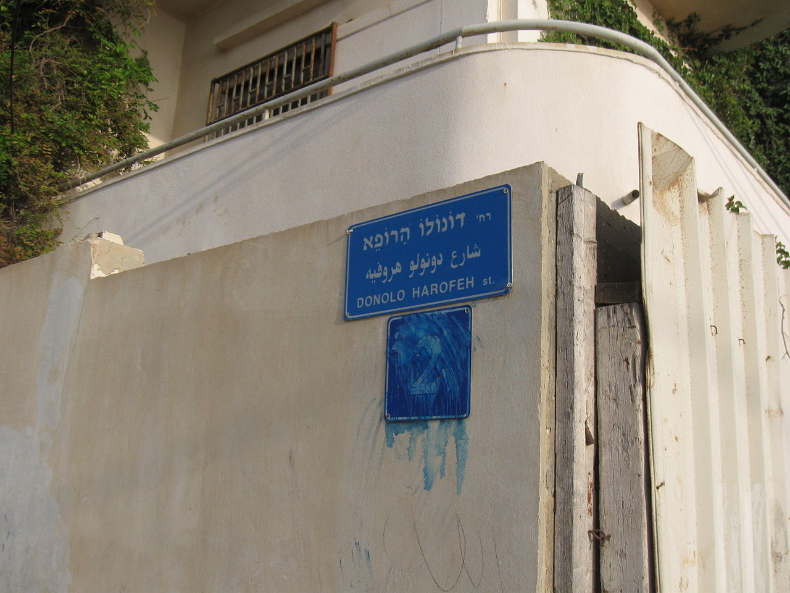
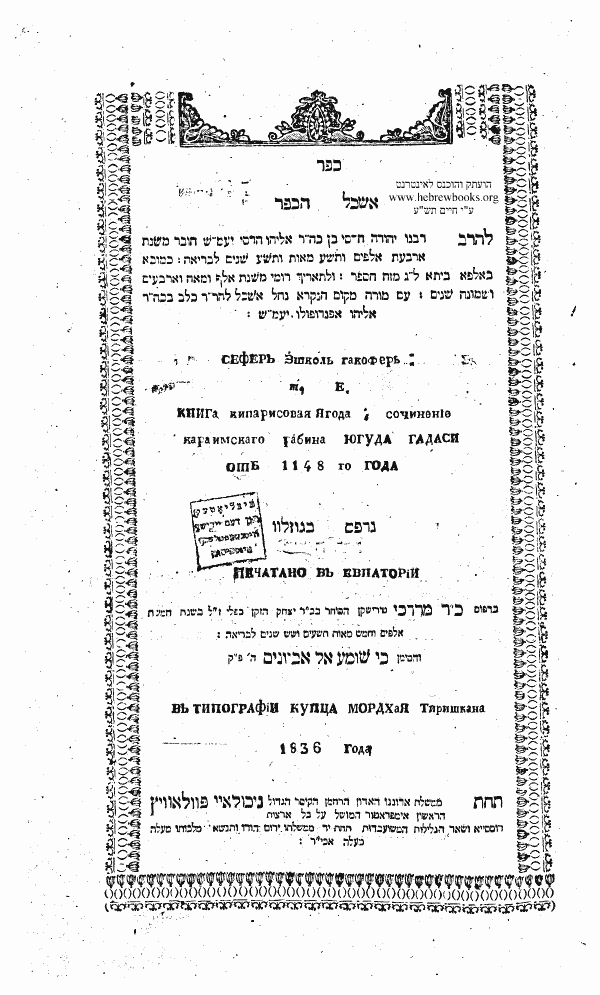

<u>השורה השניה – שבתי דונולו</u>

כאן היה פעם בית החולים "דונולו" ביפו.

נפתח ב 1949, מיד לאחר הקמת המדינה, בגבעת עליה, יפו. נסגר
ב 1980 עם הקמת בית החולים "וולפסון" בחולון.

גם בבני ברק יש רחוב "דונולו", כנראה מתייחס לאותו
איש.

מיהו האיש שעל שמו נקראים בית החולים והרחובות? ומדוע זכה
לכך?

שבתי דונולו, נולד בשנת 913 בעיר אוריה שבדרום איטליה,
והיה רב, חכם, אסטרונום, אסטרולוג ורופא. הוא הראשון באירופה הנוצרית שפרסם
ספר רפואה בעברית.

היה ספר רפואה קדום יותר בעברית, שנכתב בארץ ישראל, בתקופה
הביזנטית או המוסלמית המוקדמת, והוא ספרו של אסף הרופא. גם על שמו היה בית
חולים, שבשנת 2017 הוסב ל"מרכז הרפואי שמיר". סביר, ששבתי דונולו השתשמש גם
בספרו של אסף הרופא.

מה שידוע היום על שבתי דונולו עצמו, הוא מספריו שלו. הוא
מוזכר אצל אחרים, אך כרגיל באותה תקופה, מוזכרים דבריו, אבל בדרך כלל לא
היה מי שיכתוב ביוגרפיות.

בהקדמה לספרו "ספר חכמוני", שאיננו ספר רפואה, אלא ברובו
פירוש על "ספר יצירה", הוא מספר על עצמו, ובו נֵעָזר כדי להכירו.

מפליא עד כמה הוא כותב בעברית המובנת לנו היום בקלות,
וצריך להזהר רק בכתיב החסר מאוד שלו... (ניקדתי בכמה מקומות)

"כל זה נסיתי בחכמה אמרתי אחכמה והיא רחוקה ממני, אני שַׁבְּתַי
בר אברהם המכונה שמי דונולו הרופא, בעזרת אל חי לעד הנותן חכמה ותבונה
ודעת, בקשתי למצוא דברי חפץ ונזהרתי לעשות ספרים הרבה, ונתתי את לבי לדרוש
ולתור בחכמה על אשר גרמו העֳוֹנות, והָגְלֵתי מעיר אורס ארץ מולדתי על ידי חיל
ישמעאלים בשני בשבת בשעה רביעית ליום בכוכב מאדים בט' ימים לירח תמוז בשנת
ארבעת אלפים ושש מאות ושמונים וחמש לבריאת עולם בשנת י"א למחזור רמ"ז,
ונהרגו עשרה רבנים חכמים וצדיקים זכרם לברכה, ר' חסדיה ב"ר חננאל
הגדול.....

ואני שַׁבְּתַי נִפְדֵתי בטרנטו מממון אבותי בן י"ב שנה, והֶגלו את
אבותי ואת קרובי בארץ פלרמו ובארץ אפריקא, ואני נשארתי בארצות שתחת מלכות
רומיים ופניתי אני בכל מעשי שעשו ידי ובעמל שעמלתי לעשות, כי לא היה מלאכת
מעשה שראו עֵני שלא עשו ידי....

\[והנה איך אדם לומד באותם ימים... ואיך הוא מתייחס לחכמי
ישראל "ומציל" אותם\]

על כן יגעתי מאד להתלמד ולהבין חכמת הרפואה וחכמת הכוכבים
והמזלות, וכתבתי לי ספרים \[הכוונה העתקתי לי ספרים\] מספרי חכמי ישראל
הקדמונים ז"ל, **ולא מצאתי חכם ישראלי בכל אלו הארצות מבין בהם, אלא מקצת
חכמי ישראל היו אומרים על ספרי המזלות הכתובים ביד ישראל, שאין בהם ממש על
שלא היו מבינים בהם....**

סַבּותי אני בלבי לדעת ולתור ולבקש חכמת היונים וחכמת
הישמעאלים וחכמת בני בבל והודו, ולא שָׁלַוְתי עד אשר כתבתי ספרי חכמי יון
ומקדון בכתבם ובלשונם ופירושם, וגם מספרי חכמי בבל והודו. וחקרתי אותם
**ומצאתים שוים בכל דבר חכמת הכוכבים והמזלות עם ספרי ישראל ודעת כלם שוה
ונכונה**, וגם בינותי בספרים כי כל חכמת הכוכבים והמזלות מיוסדת בבְּרַיְתא
דשמואל הדורש, וגם ספרי הגוים מסכים עמה, **אך סתם שמואל** עד למאד את הספר
שלו.

\[ברייתא דשמואל, היא ספר אסטרונומי העוסק בלוח העברי,
ומיוחס לשמואל הקטן, בתקופת יבנה, ובמקומות אחרים לשמואל ירחינא מבבל, שעסק
בנושא, אבל הספר נכתב, כנראה במאה השביעית. היה ידוע ל"ראשונים" כלומר
ליורשי גאוני בבל, ואבד\]

ולאחר שכתבתי את הספרים \[כלומר, העתקתי אותם\] סבבתי
בארצות למצוא הגוים היודעים חכמת המזלות והכֹכבים להתלמד מהם, ומצאתי אחד
ושנים, ואחרי כן מצאתי גוי אחד חכם מבבל ושמו בגרש, והיה יודע חכמת הכוכבים
והמזלות לרוב מאד וגם לעשות מעשה חשבון **להבין באמת** מה שהיה ושיהיה
ולהבין במזלות ובכוכבים...

ואחרי למדי מן הגוי ההוא ונִסיתי בחכמה והבנתי בחוץ את
הרשום בכתב אמת, שמתי שכלי לפרש את הספרים כלם שבאו לידי ואגרתי כל חכמתם
עם חכמת הגוי הבבלי ולמודו, וכתבתים בביאור בספר הנקרא חכמוני.

עיקר ספר חכמוני, שגודלו כ 80 עמודים (בפורמט שאותו מצאתי)
עוסק בפירוש ל"ספר יצירה". זה בחלקו השני, כחמישים עמודים.

ההקדמה, שממנה ציטטנו לעיל, מתחילה באזהרות על זכויות
היוצרים שלו (לא ציטטתי), ואחר כך הפרטים הביוגרפיים על חייו ובעיקר על
לימודיו.

החלק הראשון, כעשרים וחמישה עמודים, כותרתו "פירוש נעשה
אדם בצלמנו כדמותנו" וממנו אנחנו יכולים ללמוד על ידיעותיו ואמונותיו
המתייחסים למבנה גוף האדם (האנטומיה).

להלן מספר קטעים.

כי האדם גולם הוא וגופו ככלי נקוב, ועשה לו הבורא נקבים
מבית ומבחוץ כדי להחיותו, עשה לו נקבי העינים ועפעפיהם ויראה בהן כשהן
פקוחות, וכאשר יעצים עפעפיו אינו רואה מאומה, ועוד כאשר יחפוץ לישון יעצים
עפעפיו...

ועשה לו בית הבליעה והגרון והושט לבלוע המאכל והמשקה, ועשה
לו הגרגרת להעלות ולהוריד רוח נשמת החיים מן הלב מתוך הריאה אל הנחירים ואל
הפה...

ועשה לו הלשון ללוש את המאכל בתוך הפה.... ועוד עשה לו
הלשון כדי לפרש הדבור **החושב בלב** אל השפתים, ומתחברת עם השפתים כשני
שותפים וחברים להוציא את הדבור חוצה, להשמיעו עם הקול היוצא מבין סמפוני
הריאה ברוח נשמת החיים...

ועשה לו **הלב להיות בית מכון לרוח החיים**, ואם ינוגע הלב
ימות האדם.....

... עשה לו הכבד לצד הימין עם המרה האדומה והדם במקורות
הכבד **לחמם את הקרב** \[מלשון קרביים\] העליון ובחום הכבד והמרה האדומה
**מתבשל המאכל והמשתה** בתוך הקרב העליון. עשה לו המעַיִּם לקבל את שמר המאכל
והמשתה ולהוליכו... להוציאו חוץ כדרך האדם. עשה את שתי הכליות ימין ושמאל
**לחמם את הבטן התחתון בחומם** לחיותו ולחזקו ולהוציא את הצואה ואת השתן
חוץ לגוף. עשה לו הטחול בצד השמאל עם המרה השחורה **לקרר בקָרָתַם את הקרבים**
ואת המעים והבטן, שלא יבשו ויחרבו המאכל והמשתה מפני חום ריתוח הקרבים
המתחממים ונרתחים מחום הדם והכבד והמרה האדומה...

\[כל זה מבוסס על תיאוריה של ארבע ליחות בגוף, המרה
האדומה, השחורה, הלבנה והצהובה, שכל אחת מהן היא צירוף של **לחות או יובש
עם חום או קור**, והבריאות היא איזון בין אלה, לכן צריך גם חימום וגם
קירור. התיאוריה היא של גלנוס מהמאה השנייה לספירה. ברור שאין עדיין היכרות
עם תפקיד האיברים הפנימיים, מלבד בודדים, אבל בהחלט הוא מכיר את האנטומיה
של הבטן והחזה, כלומר, היו ניתוחי מתים\].

......

עשה לו עצמות להיות הגוף חזק ובריא. שם בשר על העצמות לחמם
קרתם של עצמות...

\[אין עדיין הבנה של השרירים\] עשה לו גלגלת הראש והמוח
לחיותם. ברא את **הליחה** לסבב למוח כדי **שלא יתיבש** המוח והעינים מחום
המוח ומחום הקרבים העולה ממטה למעלה אל הראש......

......

עשה לנקבה רחם כדי להִדָגֵר ולהִזָרָה בתוכה הזרע ולהִבָּרֵא בתוכה
הילד....

\[אין עדיין ידע על ביציות, ותפקיד הנקבה הוא רק ככלי
קיבול לבריאת הילד, מהזרע\]

....

אם יחלה אחד מהם \[מהאיברים\] בחָלי כבד ומכאוב קשה, ומפני
החלי והמכאוב ישתנה אותו האבר מברייתו, או אז יֵצֵר רוח החיים צרה גדולה, כי
לא יוכל להיות במכונותיו כמתְחִלַת בריאת הגוף, אז תצא הרוח מרוב המצוק מן
הגוף הוא הגולם, ותשוב אל האלהים אשר נתנה, והגולם נשאר קר, מתיבש ונצפד,
כאליל העשוי מן הטיט והחומר...

.....

בהמשך, הוא רואה במוח את מקום הנשמה, ואפילו הדעת

... כן שִׁכֵּן את **רוח נשמת החיים והדעת והבינה** בקרום של
מוח של ראש, שנקרם על המוח ועל הליחה, ומזה נבין האמת כי אם נקרע המוח מיד
ימות האדם על אשר בו מכון רוח החיים.....\[למרות שקודם ייחס את המחשבה
ללב\] וכמו שמתקיים העולם ומתנהג ברוח אל אחד, כן מתקיים כל גוף האדם בכח
רוח החיים אחד, שנתן בו האל, ומתנהג בו להיות ישר ובריא וחזק, ומקיים עד
ביאת קצו, ואם יתערב בגופו רוח רעה מאומה אחרת, לא יתקיים הגוף להיות
כבתחילה... \[אולי מתייחס למחלות נפש?\]

גם תורת המוסר של שבתי דונולו היא שמרנית למדי, ומתאימה
לפרשנות המקובלת של חז"ל:

הוסיף על האדם יצר טוב ויצר רע לטובתו ולרעתו כדי לבחנו
ולנסותו בין טוב ובין רע, וכדי להתאוות לבנות ולנטוע ולנתוץ ולהרוס ולעקור
נטוע וליסד ולהכות ולהרוג. לחשוב מחשבות ולצבור כסף וזהב וללחום ולהלחם,
למשול ולרדות, ולמלוך, לשלול שלל ולבוז בז ולקצוף עד מאד. שאם לא היה מוסיף
עליו יצרו הרע על יצרו הטוב לא היה עוסק בפריה ורביה מפחד המות, ולא היה
מתאוה לקנות קנין ומקנה, ולא היה בונה בנין ולא נוטע נטיעה ולא זורע.... כי
היה אומר בלבו, מאחר שנגזרה עלי גזרת מות, מה לי לעמול לאחר, אין לי חפץ
בכל דבר, והיה נאבד ונהרס כל העולם...

דווקא היצר הרע הוא זה שמניע את האדם ליצירה. גם ההולדה,
וגם הפעילות הכלכלית, הן פרי היצרים (המין, והבצע), ובכלל נראה שהיצר הרע
בתפיסה זו הוא היוזם ופועל, והיצר הטוב הוא המרסן. דומה למדי לתפיסת בריאות
הגוף כאיזון.

... ואם יתגבר האדם עם יצר הטוב **לכבוש את יצר הרע שלא
יחטא לפני יוצרו**, כי אם להשתמש ביצרו הרע בדברים הנולדים והבאים מכח יצר
הרע לעשותם ביראת ה' בלא חטא ובלא פשע מאומה, זו היא טובתו...

.....

אך לבני אדם נתן דעה ורשות לעצור עצמם מלעשות רע, ועל זה
מתחייבין.

בהמשך הוא מסביר באריכות איך מבנה גוף האדם, דומה למבנה
העולם (ואפילו מכניס השוואה אסטרולוגית של איברי הפָּנים לכוכבי הלכת), וגם
מכאן מסיק מסקנה מוסרית:

...ועל זה כתוב, "שופך דם האדם באדם דמו ישפך", ללמדך שכל
מי שירצח את האדם כמו שהוא מחריב את כל העולם כלו, **על אשר דמה את האדם
לבריאת העולם ולצלם האלהים**.

צריך לציין שגישתו של שבתי דונולו היא גישה מדעית.

הוא מסתמך על התיאוריה המקובלת של ימי הבינים, שמקורה במדע
היווני, שלפיה העולם בנוי מארבעה יסודות (עפר, מים, אויר, אש), הגוף מארבע
ליחות, האיזון הוא בין הליחות, שתכונותיהן הן חום, קור, יובש ולחות. וגם על
סיפור הבריאה מהתורה ופרשנותו. בנוסף הוא בהחלט מוכן להציע ניסויים
פיזיקליים כדי להוכיח טענות.

הנה למשל "הוכחה" שממים ואש ניתן לייצר אבן (עפר).

ומי שירצה להאמין ולידע איך נעשתה הארץ מן המים מכח האש,
יעשה לו קומקום של נחשת וימלאנו מים זכים וצחים ומרתיחו על האש, וכל מה
שיחסרו המים יוסיף עליהם מים וירתיחהו עוד, ויוסף עוד עליהם וירתיח, ככה
יעשה בכל יום עד שנים רבות, ואם ישבור את כלי נחשת אחר כן אז ימצא בתוכו
כמו אבן קשה וחזקה.

ואין סיבה ללגלג על הניסוי ומסקנתו. אנחנו רואים שהטענות
המדעיות מורכבות מיכולת לזהות נתונים, ומפרשנות על התוצאה של הניסויים. כך
זה עד היום. כשלים של פרשנות, מגיעים לא פעם, מאי ידיעה של גורמים המשתתפים
בניסוי.

לכן בעוד אלף שנה יתייחסו בני האדם (אם נעבור את משבר
האקלים) לניסויים של היום, כמו שאנחנו מתייחסים לניסוי היפה הזה. אבל כבר
היום, כשלים רבים של ניסויים רפואיים למשל, נוצרים בגלל התעלמות ממשתנים
מסוימים שלא מזוהים בתהליך הניסוי.

אגב, בהמשך הוא מסביר היווצרות של אבנים במערכת השתן
ובמקומות אחרים בגוף, על ידי ניסוי זה.

שבתי דונולו כתב גם ספרי רפואה לתועלת הרופאים
המומחים.

להלן ציטוטים מ"ספר היקר" שנקרא גם "ספר המרקחת".

המקור הוא אתר הספריה הלאומית, צילום של ספר שהודפס ב 1867
בברלין.

הפיסוק וההדגשות שלי.

הנוסח העברי של הספר הזה נמצא רק בשני כתבי יד, שנמצאו או
נמצאים בידים פרטיות.

זה ספר המרקחות, והמשקיות, והאבקים, והתחבושות, והתמרוקים,
והמסיבות, הנקראות פפליסא, של רופא שתיקן שבתי הרופא, הנתכנֶה דונולו בר
אברהם, שהוגלה מעיר אוריס. ללמדו לרופאי ישראל ולהודיעם לרקֹחַ המרקחת כחכמת
רופאי ישראל **ומקדון**, ומנסיון מלאכת ידיו שניסה בחכמת הרפואה, לחקור
ולדרוש עומק הרפואה מ' שנה, בדבר השם.

ויש לציין את הפתיחות של האיש. למרות שהוא מסיים "בדבר
השם", הוא לומד מחכמת יוון, הוא חוקר ומנסה בעצמו ארבעים שנה, ואינו פונה
למקורות הדתיים.

נאה לרופאים החכמים והאומנים לידע טרם הבשמים והזיעות של
אילני רפואה, והשמנים והעשבים של רפואה, להכירם באמת, מלימוד חכמים ומלמדי
הספרים, והקדמונים, ולהבין ולידע אם יהיו הבשמים והזיעות והשמנים והעשבים
זכים וטהורים, בלי נכל ומרמה מאומה, כי מוכריהם מרמים ומנכלים
אותם...

המאבק הנצחי נגד ה"פייק" גם ברפואה...

דוגמה:

כל מקום שצומח שם האילן לרוב הנקרא בלשון יון קומקוס,
ובלעז צלבטרו, והנקרא בלשון יון קיאוס, ובלשון רומים אידרא, ורועין מהן
הדבורים – אותו הדבש רע הוא כי ריחו וטעמו רע....

כנראה ידע יוונית ולטינית, ובוודאי את שמות הצמחים
הרלוונטיים.

ואם יהיה המשקה מאותן המעמידין ומחזירין הילוך הבטן
\[עצירות ושלשול\], יתן הרופא שֵכר פרי התותים הנקרא סוכרא, או שכר של יערי
הדסים, או מימי השושנה, ויאחז המכתש בידו ויטבלהו ביין או באחד מן השכרים,
או במימי השושנים ויכתוש המרקחת בכל כוחו בתוך העלי, ויטבול עוד המכתש באחד
הדברים הכתובים למעלה....

אז תתן המרקחת בכלי זכוכית או של עופרת או של עץ המצופים
עם ברוניקי הוא סודרוס ועם שמן. כי אם תשים המרקחת בכלי עץ או בכלי חרס
שאינו מצופה יתרו, ומוצצו את ליחלוח המרקחת וכחה, ותשחת מהרה מלהועיל
ולהשמר לאורך ימים...

את נזקי העופרת טרם ידעו בזמנו.

ואם יחפוץ הרופא לעשות תחבושת או אינפלשטרין עם בשמים
וזיעות פלס תחבושת, ישחוק תחילה הדק את הבשמים והזיעות, אם אינן לחות ורכות
כמשפט הכתוב למעלה, לבד מן הזפת, וריטיני, וחלבנה, ודונג, וטירבינטינא, כי
אלו בסיר יחדו על האש בגחלים, ויתמסו במכבר של נחושת הנקוב בנקבים
דקים....

ועוד ועוד.

רפואה, כמו שאנו מכירים, אין כאן, כמובן. אבל, צריך לציין
שבחמשת הדפים של הספר הזה, הוא מזכיר כמאה ועשרים חומרים שונים. מן הסתם,
הייתה גם תועלת לפחות בחלק מהם. עובדה היא, שהספר נשמר בכתבי יד כארבע מאות
שנה עד המצאת הדפוס, ומאז עד ימינו, גם בשני כתבי יד.

באנציקלופדיה לתולדות גדולי ישראל חלק ד' (בעריכת מארי
אבולעפיה ותנחום ירושלמי, ונמצאת באתר
HEBREWBOOKS), מסופר על שבתי דונולו מעט יותר, ממקורות
נוצריים:

ר' שבתי היה מפורסם בדורו כרופא מומחה ומובהק ונקרא לחצרו
של המושל הביצנטיני של קלבריה. לפי מקור נוצרי אחד המספר קורות אחד
מנזיריהם, הוערך ר' שבתי כמלומד וחכם גדול ביותר אף בחוגי הכמורה הנוצרית,
ואנו שומעים שם הד ויכוחיו עם הנוצרים על ענייני האמונה...

ספריו של דונולו עמדו בשעתם על פסגת המדע במקצועות הרפואה
והתכונה, והובאו על ידי כמה מחכמי ימי הבינים, כמו רש"י, ר' יוסף קרא, ר'
אליעזר מגרמיזא, ורבים אחרים.

ואמנם רש"י, בפירושו לקטע ממסכת עירובין בתלמוד הבבלי,
בדיוק הקטע שציטטנו מדברי שמואל, בנושא "התקופות":

.... ימים וסימני שעות ראשונות של כל לילי השבוע כצנ"ש
חל"מ \[ראשי תיבות של כוכבי הלכת בתפיסה של ימי הבינים\], ור' שבתי דטל"ו
הרופא זכר צדיק לברכה, פירשו היטב בספר חכמוני שלו, למה נסדרו הכוכבים
בענין זה...

רש"י נולד בערך ששים שנה אחרי מותו של שבתי דונולו.

יוסף קרא, פרשן תנ"ך מצפון צרפת שנולד בערך שמונים שנה
אחרי מותו של שבתי דונולו, מזכיר אותו הרבה פעמים בפירושו לספר איוב (לא
מצאתי את המקום), ובין השאר מביא ציטוט מפירוש של שבתי לספר "ברייתא דר'
שמואל", שכאמור לא קיים היום. (על פי "אנציקלופדיה יהודית" אתר "דעת" של
מכללת הרצוג, ברשת).

מזכיר אותו גם יהודה הדסי, שהזכרנו אותו, כחכם קראי
בביזנטיון (קונסטנטינופל), במאה ה-12 לאחר חורבן המרכז הקראי
בירושלים.

הוא כתב ספר בשם "אשכול הכופר", העוסק בביאור המצוות.
הדפסה מ 1836 מצויה ב HEBREWBOOKS.

והנה ציטוט מספר זה (פרק העוסק באסטרונומיה):

סִדר ופירש ומשל ר' שבתי הרופא דונולוש בספרו.... עמידתם
וחזקתם וכחם פירשם בספרו, רב שמואל החכם בברייתא שלו, וכן ר' ישמעאל במעשה
בראשית ספרו, ור' שבתי דונולוס הרופא פירשם וציירם גם הוא בספרו...

ועוד מעניין, אם כי לא לענייננו, אלא לעניין ההרצאה הקודמת
(דניאל אלקומיסי) שעסקה בקראות. אתר HEBREWBOOKS
שהוא אתר המעלה לרשת ספרים יהודיים על ידי צילום (לא כמו
אתר בן יהודה, שבו הספרים מודפסים מחדש ב WORD).
האתר מאפשר לקורא לרשום הערות: "צור קשר על ספר זה". והנה מופיעה הערה בצבע
אדום (מופיעה בצד, אך לא הצלחתי להעתיק יחד עם שער הספר, והעתקתי אותה
אחריו):

|     |     |
|-----|-----|
|     |     |
|     |     |

[צור קשר על ספר זה Add Feedback on this
Sefer](https://www.hebrewbooks.org/feedback.aspx?type=sefer&id=44048)  
Previous feedback:

issue: Problem with Specific Book - בעיות עם ספר
מסויים  
pages: 2  
note: הספר הינו ספר קראי! האם ראוי כי הוא יהיה באתר קדוש
שכזה...? בברכת התורה

issue: Problem with Specific Book  
pages: 1

**Add Metadata Correction**

[Order Print Version (External
site)](https://www.publishyoursefer.com/reprints/id/HB-44048)

"הקדושה" מגיעה אפילו לאתר יהודי מדהים ששומר על ספרים שלא
יודפסו היום, מן הסתם. ובברכת התורה צריך להשמיד להרוג ולאבד
(ספרים)....

היו קשיים לא מעטים בזיהוי חומר ובאיסוף החומר.

ובכל זאת קיים ספר אחד מקיף על שבתי דונולו, שנכתב בשנת
1949.

"שבתי דונולו", מאת זיסמן מונטר.

הספר נמצא בספריה הלאומית, וניתן אפילו לקרוא את חלקו
במקוון, אלא כרגיל, במקרים כאלה, מתברר שלאחר מספר עמודים, נדרש
תשלום...

זיסמן מונטר עצמו היה סופר, היסטוריון ורופא, שנפטר ב
1973. פירסם מאמרים רבים על תולדות הרפואה.

בחלק מספרו, שניתן לקרוא, הוא מביא את שתי היצירות שחלקן
ציטטתי לעיל, אבל עם פירושים רבים לחומרים שאותם מזכיר דונולו, ופירושים
בכלל.

בנוסף הוא מביא יצירה נוספת בשם "פרקטיקה", העוסקת במחלות
וריפויין. יצירה זו נמצאה בכתב יד בלי שם המחבר, ורק ברור שהיא מאותה תקופה
ומאותו מקום שבו חי דונולו. מונטר מייחס את הספר לשבתי דונולו, כמובן, עם
הספק.

אנחנו נסתפק במועט...
