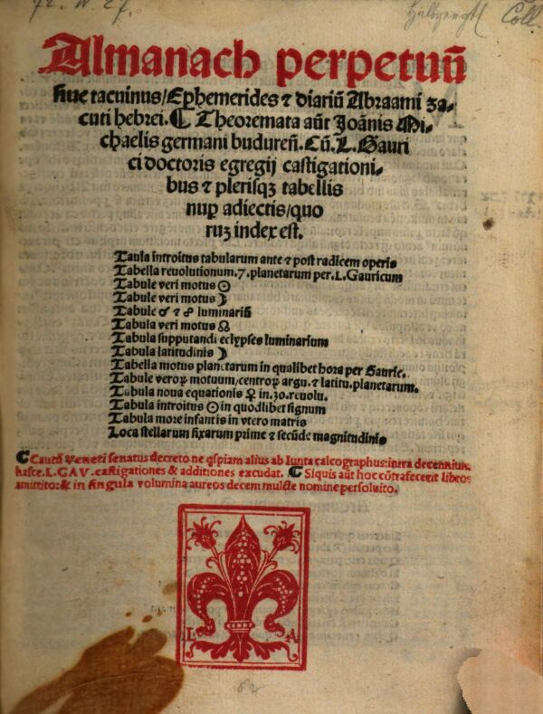
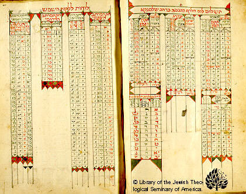
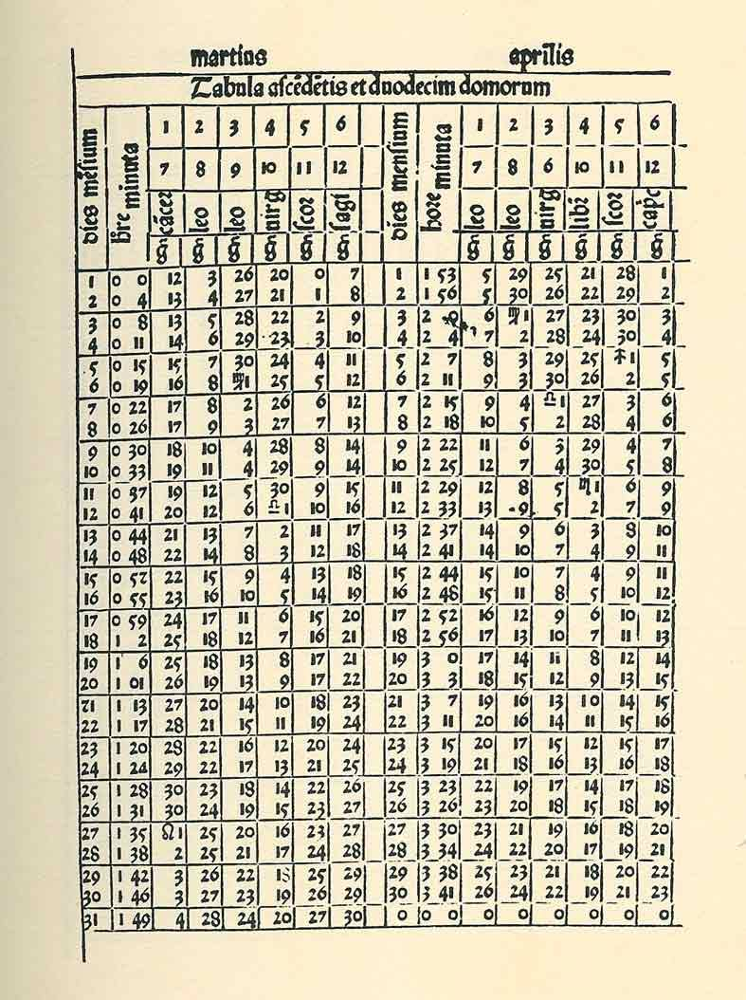
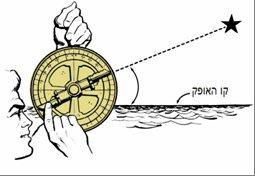
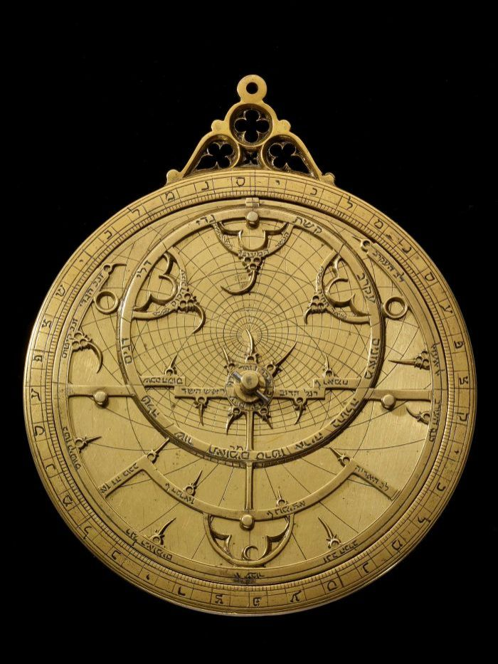
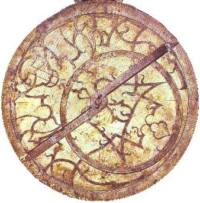

<u>השורה השניה – אברהם זַכּוּת</u>

מאתיים שנה אחרי יוסף אבן כספי, אנחנו עוברים לאחת התקופות
הקשות בתולדות ישראל, תקופת הרדיפות הדתיות הקשות בספרד, פורטוגל וארצות
אחרות, ששיאה בגירוש ספרד ופורטוגל.

בתקופה זו חי ופעל אברהם זַכּוּת, שמבטא באישיותו את גדולתה
של יהדות ספרד: יהדות שגם משמרת את ייחודה התרבותי והדתי, וגם מעורבת
בתרבות העולם.

קשה להכניס את אברהם זכות לשורה השניה. דווקא בהיסטוריה
העולמית הוא היה מהשורה הראשונה. עובדה, שהיוצא לטייל על פני הירח ימצא שם
מכתש הנקרא על שמו, מכתש זגוט.

אברהם זכות היה מגדולי האסטרונומים בעולם של זמנו מצד אחד,
ומצד שני גורש מספרד, וברח מפורטוגל, כדי לא להמיר את דתו, כתב ספר
היסטוריה של העם היהודי, ספר רציני מאוד, ונפטר בירושלים.

אברהם בן שמואל זכות נולד בסלמנקה, קסטיליה, ב 1452. למד
תורה אצל רבי יצחק אבוהב המכונה אחרון גאוני קסטיליה, שעמד בראש ישיבת
טולידו.

זה לא הפריע לו ללמוד גם אסטרונומיה באוניברסיטת
סלמנקה.

כנראה בזכות כשרונו הגדול זכה לחסות מהגמון סלמנקה, גונזלו
דה ויוירו, ואחרי מותו של ההגמון, בשנת 1480 התיישב בגאטה (לא מצאתי),
ובטירה של טומאר (היום במפת פורטוגל), ועבד בשיתוף עם מסדרי אבירים
נוצריים.

וצריך לשים לב שיהודי בכל רמ"ח אבריו, שנים ספורות לפני
הגירוש, עובד עם מסדרים נוצריים בנושאים מדעיים. אולי זה מרמז שהגירוש היה
פוליטי יותר מאשר דתי, כרגיל.

בשנים אלה חיבר ספר אסטרונומי שנקרא "החיבור הגדול" ובו
תיאור מערכת השמש (כמובן, על פי הגישה הפתולמאית), וטבלאות מיקום השמש
וכוכבי הלכת לפי תאריכים.

מעניין, שלמרות שהספר נכתב בעברית, ורק אחר כך תורגם לשפות
רבות (לטינית, ספרדית, ערבית ועוד), לא מצאתי אותו בעברית. וגם לא פרטים על
הגירסה העברית ברשת.

זַכות בעצמו, אגב, תרגם אותו ללטינית.

פרטים מסוימים באנגלית ניתן למצוא באתר
<https://second.wiki/wiki/almanach_perpetuum>

שם הוא נכתב בשמו הלטיני Almanach
Perpetuum, כלומר, מהלך ניצחי, או בשם יותר מלא בספרדית,
"המהלך הנצחי של תנועות שמימיות".

לספר הייתה חשיבות גדולה ביותר לניווט בים, מפני שהאמצעים
היחידים לקביעת קו הרוחב של ספינות בים, וגם תאריכים ושעות, היו מדידות
זוויות השמש והכוכבים, וזה היה נעשה על ידי מכשיר שנקרא אצטרולב, ובסיוע
טבלאות שהיו בידי רב החובל.

ונזכיר לנו, שהאסטרונומיה היא עדיין לפני קופרניקוס, וכדור
הארץ במרכז. אבל, הטבלאות שהסתמכו על כמות עצומה של תצפיות של אסטרונומים
במשך דורות רבים, איפשרו ניבוי של מיקום הכוכבים והשמש בכל תאריך ושעה, בכל
קו רוחב על פני כדור הארץ.

נראה ששמו של זכות כבר לא נזכר על כריכת הספר, כי ההדפסה
הראשונה בלטינית היה ב 1502, ויהודים כבר לא היו בפורטוגל. לעומת זה מופיעה
רשימה של הטבלאות Tabule.

הטבלאות של אברהם זכות לא היו המצאה שלו, אך היו מדויקות
בהרבה מהטבלאות שהיו בשימוש לפני כן, ושנקבעו כמאתיים שנה קודם. מאז נוספו
תצפיות רבות, ואותן כנראה אסף זכות ותיקן לפיהן את הלוחות . לכן הן הפכו
להיות מכשיר הניווט במשך שנים רבות אחרי כן.

כך נראית אחת הטבלאות (דווקא בעברית), שכמובן איני יכול
להיכנס לעומקה.

"לוחות ללקות השמש" הן תחזיות ליקויי חמה.

וזו טבלה אחרת, כנראה בלטינית.

כדי להשתמש בטבלאות (ה GPS של אותם
ימים) היה צריך לבצע מדידות באצטרולב, מכשיר עתיק ביותר (עוד מהתקופה
היוונית), אבל גם הוא שוכלל על ידי אברהם זכות, על ידי כך שבנה אותו
מנחושת, בעוד שעד אז נבנו האצטרולבים מעץ. בכך הגדיל את דיוק
המדידה.

אצטרולבים רבים נמצאים היום בכל מוזיאון העוסק בהיסטוריה
של הניווט.

כאן רואים את דרך השימוש באצטרולב. על ידי כך שאוחזים בו
בנקודה העליונה, וכך קובעים את הקו האופקי שלו באמצעות שווי המשקל של
המכשיר. אחר כך מכוונים את הצינור, או שתי עייניות על פס ישר, שניתנים
לסיבוב על הציר, כך שייראה הכוכב הרצוי, או שיעבור אור השמש. הזוויות
מסומנות מסביב.

אצטרולב יהודי, החלק הנע כנראה מצד שני.

אצטרולב מהמאה ה-16.

מכשירים כאלה שמשו את הימאים עד המאה ה-18 (בלי קשר לשינוי
בתפיסה האסטרונומית). במאה ה-18 הוחלף המכשיר בסקסטנט, מכשיר על עיקרון
דומה, אך נוספו שכלולים אופטיים של התקופה (מראות ועדשות) כדי להגביר
דיוק.

אברהם זכות עוד הספיק להואיל הרבה לספרדים ובעיקר
לפורטוגזים, לפני שנמלט מארצם בעקבות הרדיפות הדתית.

הוא לימד באוניברסיטת סלמנקה, שבה למד קודם.

ב 1492, לאחר גירוש ספרד, אברהם זכות עובר לפורטוגל, יחד
עם יהודים רבים.

באותה שנה משתמש קולומבוס בידע של אברהם זכות במסעותיו
לאמריקה.

בשנת 1496 זכות, כבר בפורטוגל, מדריך את וסקו דה גמא
וצוותו, בשימוש באצטרולב המתכתי ובטבלאות שלו, שאיפשרו לראשונה, ניווט גם
באיזור קו המשווה ודרומה לו.

שנה אחר כך עורך וסקו דה גמא את מסעו הראשון להודו דרך הים
(כלומר, עקיפת אפריקה).

קיים סיפור, לפיו השתמשו האירופאים בידע של חיזוי ליקוי
חמה כדי לאיים על הילידים. לא ברור אם הסיפור הוא אמיתי, אך גם טבלאות
ליקויים עתידיים נמצאות ב"חיבור הגדול" של אברהם זכות.

במאמר,

<u>המסע להודו: אברהם זכות, וסקו דה גמה והכרוניקאי גספר
קוריה.</u>

<u>מאת: סנג'יי סוברמניים, מוריס קריגל.</u>

המבקר את ההיסטוריון קוריה, בן הזמן, קיימים ציטוטים
מכתביו של אותו היסטוריון.

גם אם, לטענת הכותבים, האינפורמציה אינה מדויקת, אנחנו
לומדים איך בני הזמן ראו את אברהם זכות.

המלך "שלח להביא אליו יהודי מבז'ה, שהיה ידוע ומוכר לו,
והוא אסטרולוג דגול בשם זכותו, שעמו שוחח בחשאי, והפציר בו מאוד שיעמול כדי
לדעת אם לייעץ לו להמשיך הלאה לגילוי הודו, ואם הדבר אמנם אפשרי... כיוון
שאם אכן אפשרי הדבר, הוא משתוקק מאוד להוציא על כך את כל מה שידו משגת, אך
לא יעשה מאומה בלי עצתו..."

לדעת הכותבים אין דרך לקוריה (ההיסטוריון) לדעת מה דיברו
המלך ואברהם זכות ביניהם,אבל אין ספק שאברהם זכות נהנה מיוקרה רבה בתחומו,
והוא עצמו מעיד על כך ב"ספר יוחסין":

הלוחות האסטרונומים שלו "מפוזרים בכל ארץ אדום, גם בארץ
ישמעאל בקרב המוסלמים"

והם מפורסמים בשמו "אברהם זכות איש שלאמנקה". הוא מנמק גם,
על פי דברי חז"ל, מדוע מותר ליהודי להתפאר בידע אסטרונומי.

גם מעבר לאנפורמציה הסיפורית של קוריה, ידוע על קשריו של
זכות עם חצר המלך, ונמצאה חתימה אחת שלו בעברית שבה נכתב "ר' אברהם זכות
תוֹכֵן המלך יואן".

היהודים נטו להפיץ סיפורים על גדולתו, בהם אגדה
אחת:

המלך ז'ואאו ביקש להטעותו, ושאל אותו אם הוא יכול לנבא דרך
האסטרולוגיה באיזה שער ייכנס לעיר אוורה. זכות נתן לו מכתב חתום. המלך דרש
לפרוץ שער חדש בשבילו, אך זה בדיוק מה שהיה כתוב במכתב "המלך יעבור דרך שער
שאותו יחדש".

מעבר לאגדות, ממשיך ההיסטוריון הנוצרי לפאר את זכות,
המגשים את דבר האל הנוצרי...

ומאפשר למלך הפורטוגזי להגשים באמצעות וסקו דה גמה את
חלומו.

"וכך בכל הקשור לניווט להודו ולחלקים אחרים של העולם,
התקדמו העניינים התקדמות רבה ... כי אנשים רבי-ידע וחדי-הבנה הוסיפו להעמיק
חקר ולהשיג עוד, עד כי הכול היה בשלמות גמורה. ואת כל זאת החל אותו יהודי,
הנקרא זכותו, אסטרולוג דגול, אשר נמלט אחר-כך מפורטוגל לגולפו, כמו רבים
אחרים, ושם הוא מת **בדרכי הטעות**, כיוון שנסתמאו עיניו על ידי האויב
(השטן) ועל אף שהיה לו ידע כה רב בכוכבים, הוא היה סומא לאורו הבהיר של
היום שהוא אמונתנו הקתולית הקדושה...

למעשה, קוריה לא יודע את המשך הביוגרפיה של אברהם זכות,
אחרי בריחתו מפורטוגל.

לפי קוריה נפגש זכות לפני כן, גם עם וסקו דה גמה:

"בטרם יצא וסקו דה גמה מליסבון (בשנת 1497) הוא התייחד
במנזר עם היהודי זכותו, והלה נתן לו ידע רב על המוטל עליו לעשות בעת
המסע..."

התיארוך של קוריה אולי אינו מתאים למציאות, מפני שב 1497
כבר אולצו יהודי פורטוגל להתנצר, ומן הסתם אברהם זכות נמלט משם בערך בשנה
זו, וכנראה קודם. אך הסיוע לוסקו דה גמא ידוע.

ב 1497, לאחר שמלך פורטוגל נישא לבִּתם של מלכי ספרד, הוא
מסכים לגרש את יהודי פורטוגל, שרבים מהם הם פליטים מספרד, אם לא יתנצרו.
לעומת הספרדים שויתרו על יהודים רבים, מלך פורטוגל רצה שהם יישארו במדינה,
ולכן "ניצר" אותם בתרגיל מלאכותי, על ידי כך שאסף אותם במרכזי הערים, שם
התיז עליהם כומר "מים קדושים" עם כמה תפילות, והפך אותם נוצרים בעל כורחם.
מכאן ואילך היו תחת חסדי האינקויזיציה.

כנראה שבשלב זה, וקרוב לוודאי לפניו, אברהם זכות בורח עם
בנו מפורטוגל, ומגיע לאחר תלאות לתוניס.

בתוניס האסטרונום המפורסם הופך להיסטוריון מפורסם לא פחות.
אך אם כאסטרונום היה דמות אוניברסלית, את ההיסטוריה הוא כותב רק על זו של
עם ישראל.

ספרו נקרא "ספר יוחסין". הוא נדפס לראשונה באיסטנבול ב
1566, כארבעים שנה אחרי מותו של אברהם זכות.

ניתן למצוא את הספר ב HebrewBooks,
וגם בספריה הוירטואלית של מכללת הרצוג, דעת.

הספר המונה מאות עמודים, מתחיל מבריאת העולם ומסתיים בזמנו
של המחבר.

וכך הוא כותב בהקדמתו הארוכה:

...ולכן כדי לזכות לעצמי ולאחרים, נתעוררתי לעשות זה הספר
הקטן, שאספר בו בשם ובמספר, יחס חכמי המשנה והתלמוד בבלי הנמצא בידינו, חוץ
מרוב חכמי הברייתא מפני שאינם ידועים לי ולא זמנם. וכן אביא כל הגאונים
והמחברים ספר, וזמנם, כל מה שאמצא. ולא אתגדר לומר כי היא חכמה עמוקה, כי
בעונותי מרוב השמדות, והשביה, וצורך המזונות, אין בי כח ולא חכמה ודעת, ולא
עמד טעמי בי וריחי נמר....

לקראת סוף הספר הוא מזכיר גם את גורלו:

וכן בעונותינו ראינו כמו זה בעינינו, בגירוש ספרד ושיזיליא
וסרדיניא בשנת רנ"ב (1492). ובשנת נז"ר (רנ"ז 1497) לאחר גירוש פורטוגל,
.... וכלם \[משפחתו\] עמדו בשמדות קשטילייא על תלם בעבודת השם ית' ובתורתו,
גם אני השם ב"ה ובני שאקֹד שמו, עם שמואל בני, ובאנו לאפריקא והיינו שבויים
שני פעמים \[חטיפות של פיראטים כדי שיהודים בצפון אפריקה ישלמו כופר
לפדיונם\]. השם, למען חסדיו ורחמיו הגדולים, ישלים לי ולזרעי שיהיה אחריתנו
לעבודת השם ית' וית' ולתורתו, וישים חלקנו עם הצדיקים בג"ע והתחיית המתים,
ולבנין מקדשו, אכי"ר.

וממש בסוף הוא מתאר את מוראות הגירוש מספרד:

ובשנת רנ"ב (1492) יום ראשון מהשנה של הנוצרים שהוא ר"ח
אינירו, כבש את גראנטה ואז גזרו גירוש על יהודים.... ואז קצתם הלכו
לטורקיאה, וקצתם לאפריקא, ולעיר פאס, ולעיר והראן, והלך אחריהם הרעב והדבר
שכמעט אבדו כולם. אבל עיקר קשטילייא נכנס לפורטוגל, מפני שלא היו יכולין
ליכנס בים, ולזרז עצמן, ונתנו מעשר מכל ממונם.... ויִכלה הזמן ולא יכלה
מלספור דברי פורטוגאל, שנכנסו יותר מק"ג אלף נפשות ולא נשארו אלא מעט מהם
במגפה...

ואחר כך הוא מזכיר את הגזירות הראשונות בפורטוגל אך לא את
"התרגיל" הגדול, שכנראה כבר לא היה שם בזמנו.

במאמר הבא, טוען המחבר, שנוסף להיסטוריה לשמה, המחבר רוצה
לתת לקוראיו אמצעים להתמודד עם הנצרות.

<u>היסטוריה פולמוסית ב"ספר יוחסין" JSTOR</u>

<u>מאמר מאת רם בן שלום.</u>

אברהם זכות החל לכתוב את "ספר יוחסין" ב 1480. ב 1492 הוא
בורח לפורטוגל, וב 1497 לתוניס, שם הוא מסיים את הספר ב 1513.

בתקופתו זה היה הספר המדויק ביותר להיסטוריה של עם ישראל,
בעיקר לגבי תקופת חז"ל ואחריה, וכלל מאורעות בעולם ההלניסטי, הרומי,
והנוצרי.

עיסוק בהיסטוריה, בעיקר של תולדות עמים אחרים, לא היה
מקובל על חלק מהציבור היהודי, ולכן זכות מסביר את עמדתו, "לפי שהידיעה במה
שקרה בכל הזמנים לכל אומר... יועיל מאד לישראל הדרים בין האומה הנוצרית
להתוכח עמם על דתם".

ואמנם יש בספר נטייה פולמוסית כנגד הנצרות.

למשל, הוא מביא סיפור פגאני מהמיתוס היווני, על בתו של
הטיטן אטלס, בשם סאיגטה, שילדה שני ילדים ונותרה בתולה. והוא מעיר "וזה קשה
לנוצרים כפי דתם" (מפני שהם טוענים שלידת הבתולים של מרים היא
יחידנית....

במקום אחר הוא טורח להכחיש את האפשרות ש"הצלב הקדוש" (זה
שעליו נצלב ישו) נשרף בקונסטנטינופול בשלב מסוים, כפי אמונת הנוצרים,
שנוטים לספר סיפורים רבים על חפצים רבים הקשורים לישו ולקדושיהם. למעשה,
הוא מנסה לעשות את אמונותיהם אלו של הנוצרים למגוחכות.

כותב המאמר לא טוען שספר יוחסין נועד לפולמוס עם הנצרות,
אבל בין השאר, אברהם זכות מנצל אותו גם מכך.

כך או כך, למרות יחס לא אוהד במיוחד לספרי היסטוריה, ספר
"יוחסין" זכה לתשבחות רבות, ולאמון רב בדורות שאחרי כתיבתו.

הנה ציטוטים ממאמרו של הרב יעקב חיים סופר (יליד 1949
ירושלים), "על ספרים וסופרים" ב"צפונות, תשנ"ג":

וכבר ידעת שדברי הרב רבי אברהם זכות ז"ל, מחבר ספר יוחסין,
ברוב ככל מקומות נאמנו מאד, וכמעט כל מה שהשיג עליו בספר המופלא "סדר
הדורות" \[ספר היסטורי מאוחר יותר, נכתב ב 1769 על ידי יחיאל בן שלמה
היילפרין\] לא קשיא ולא מִידֵי \[אין שאלה ואין כלום\], והטעם, כי בעל יוחסין
השתמש בתלמודים ומדרשים כתבי יד.... \[כלומר, הוא דוחה את הביקורת של
היילפרין על זכות\].

הגאון מסטניסבל ז"ל ....כתב: וספר יוחסין אשר גבהו כארזים
וחסנו כאלונים.

והגאון רבי משה חאגיז ז"ל .... כתב: ואני טרם אכלה לדבר
במעלה זו דאמונת חכמים, איני רוצה להיות שוכח מלהזכיר לטובה ולברכה את הרב
הבקי המפורסם ומושלם בעל מעלה, בעל ספר יוחסין, זכר צדיק וקדוש לברכה, שאם
רצונך לרוות צמאונך בשלשלת יוחסין של חכמי המשנה והתלמוד... אל יזוז מעיניך
הספר הנחמד הזה....

הגאון החיד"א... כתב: "אפס כי עז, שהר"ב ספר יוחסין גמיר
ודייק"....

.... מלבד זה נוסף על חכמתו היה חכם שלם בלמודים, שלם
בתכונה, לימד בקתדרא בסאלאמנקא, עשה לוחות חדשות, ולוחות כל הגויים הקודמות
כאין נגדם...

בשנת 1513 אברהם זכות עוזב את תוניס ועולה
לירושלים.

אינפורמציה על ישיבתו של אברהם זכות נמצאה במקרה, בכתב יד
באוסף של דוד ששון, שם נמצאה הקדמה ללוחות האסטרונומיים של אברהם זכות,
שכנראה התאימם בירושלים מחדש. וכך נכתב שם:

אמר אברהם בכה"ר שמואל זכות ז"ל.... שזכיתי לישב בה
בירושלים ע"ה תותב"ב בישיבת החכמים הממונים על ידי אדונינו הנגיד נר ישראל
המאיר לעולם בתורה שבכתב ותורה שבעל פה ונותן מזון ופרנסה מממונו לכל בעלי
תורה שבמצרים ובכל ארץ ישראל וממשלתו מים עד ים עד נהר פרת הוא הכהן החכם
השלם כמה"ר יצחק שלאל יצ"ו ויתנהו לחן לחסד ולרחמים לפני המלך והשרים,
לכבוד מעלתו בשנת ס"א למולדי חידשתי אילו הלוחות... ומפני שכבר עשיתי
בנעורי היום ארבעים שנה לזה הדבר... ומפני שכבר עשיתי כמו זה במקומי
סאלאמאנקה, בקאשטילייא, וכן בפאס, בתלמשאן וכן בתוניס, וכולו היה נתקן על
חשבון הנוצריים... אבל עתה שבאתי לארץ ישראל ראיתי כי בעניין הדיבוקים
והניגודים ומקום המאורות והלקיות אפשר בחשבון ישראל ובמחזורים גדולים
שלמים, אמרתי טוב לעשותו כן במנין הקדושים, במנין ישראל, ובארץ הקדושה ועל
איש גדול אדונינו הנגיד יצ"ו.....

ולהסביר את הקטע:

הנגיד הוא יהודי עשיר ממצרים, המממן ישיבה בירושלים,
שבראשה עומד הרב יצחק שולאל. מקטע זה אנחנו לומדים יותר על נדודיו של זכות,
ועל כך שבכל מקום עדכן את הלוחות האסטרונומיים, וגם בירושלים.

כל זה לקוח ממאמר בשם: <u>"ר' אברהם זכות בישיבת ר' יצחק
שולאל בירושלים", מאת עזריאל שוחט, כתב עת "ציון" שנת תש"ח-תש"ט. ונמצא ב
</u><u>JSTOR.</u>

אברהם זכות היה אסטרונום, אך כל אסטרונום הוא גם אסטרולוג
בתקופה זו, ואכן, האיש עסק גם בחישוב הקץ באמצעים אסטרולוגיים.

בכתב יד שנמצא בספריה הלאומית, נמצא מאמר של אברהם זכות,
המחשב את "הקץ", כלומר בוא הגאולה, בשיטות אסטרולוגיות. נראה שהמאמר נכתב
עוד בצפון אפריקה.

מתוך המאמר:

<u>"מאמר על הקץ והאצטגנינות מאת ר' אברהם זכות" מאת מלאכי
בית אריה ומשה אידל. קרית ספר, 1979.</u>

בתוך המאמר, שהוא מכתב לאדם אחר שגם שמו אברהם, אברהם זכות
מסתייג בעצמו ממה שהוא עושה... מחישוב קיצים בעזרת האסטרולוגיה:

ולפי שהחכם המאושר הנגיד ר' אברהם, דר בעיר תלמסאן, שאל
ממני, אברהם זכות, הנגרש והנשבה פעמים בין שתי האומות \[כלומר, הנוצרית
והמוסלמית\], שאבאר לו מה שאמרו קצת מחכמי התכונה בענין הישועה, **אעפ"י
שאין דעתי כסברתם, אלא שהתשובה והמעשים טובים כתריס בפני הפורענות, וכמו
שאמרו ז"ל, "זכו אחישנה" וכו'** \[מדרש ידוע על הפסוק "בעִתָּה אחישנה",
הגאולה תבוא בעת שיקבע ה' אך אם ישראל יחזרו בתשובה הוא יקדים אותה\], וכן
אמרו הפסוק, "אל דרך הגוים אל תלמדו ומאותות השמים אל תחתו" \[ירמיהו
י'\]

וכן בהפך ח"ו אם לא יזכו.

אבל לעשות רצון קוני ולכבודו באתי לספק דעת חכמי התכונה,
וכבר גלה קצת דעתם הנגיד ר' אברהם בר' חייא הספרדי. \[מתמטיקאי ואסטרונום
יהודי ספרדי מברצלונה, שחי ארבע מאות שנה לפני אברהם זכות, והיה הראשון
לתרגם ספרים מדעיים מערבית לעברית\]

יש כאן אמירה ברורה למדי, שזכות מסתייג ממה שהוא עצמו
עושה, אבל "הנגיד" מתלמאשן, אלג'יר, הוא כנראה המפרנס אותו.... ולהרגיע את
עצמו, הוא מצדיק את עצמו שכבר חישב קיצים האסטרונום אברהם בן חייא בסוף
המאה האחת עשרה.

בכל זאת הוא מחשב את הקץ... הנה קטעים:

...לפי שהיה בעקרב מזל הישמעאלים אבל משנת רס"ד יתחילו
הישועות לישראל ורעה לגויים שחוזר החבור מסרטן מזל העולם והים. ועמהם מאדים
ר"ל. חבור שבתי וצדק ומאדים בסרטן, שמורה רבוי מלחמות בעולם ובפרט באיטלייא
נגד התוגר. והמלחמות יתחילו בפרסיים.....

....וכל זה יהיה עד חבור שנת רפ"ד, שיהיה החבור בין דלי
ולדגים כמו שהיה כשנכנסו ישראל לארץ עם יהושע....ולפי שמאדים יהיה עם שבתי
וצדק, בזה החיבור יורה מלחמות רבות וגדולות בעולם, ומלחמות גוג ומגוג,
ומיתת משיח בן יוסף. ולפי שכוכב נוגה יהיה ג"כ עמהם בחבור היום ההוא, יהיה
ישועה לישראל עם משיח בן דוד....

אגב, מכאן רואים שהמילה "חיבור" בשם ספרו האסטרונומי
בעברית "החיבור הגדול" אינה במובן של יצירה ספרותית, אלא של קירבה (נראית)
של כוכבים ומזלות.

בחישוב הקץ הוא מתייחס לשנים קרובות מאוד לזמנו, ה'רפ"ד
היא 1524.

לצערנו זה לא הצליח.

אבל אולי יצליח 500 שנה מאוחר יותר, כלומר בשנה הבאה.
אמן.
