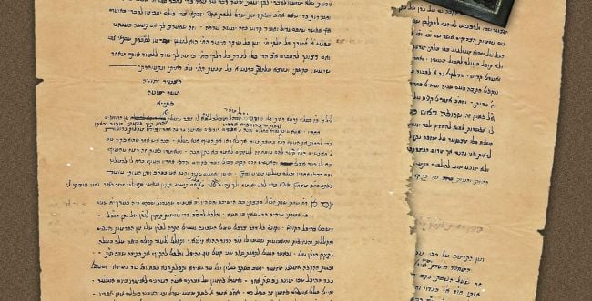
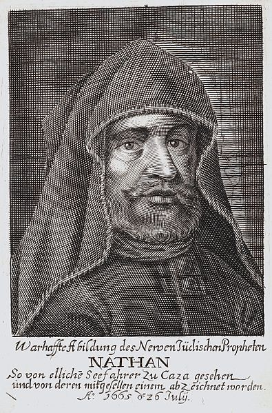

<u>השורה השניה – נתן העזתי</u>

כנראה שכל אחד מאתנו שמע שאת שמעו של שבתי צבי. אנחנו
וודאי יודעים שמשיחיות שבתי צבי גרמה לאחד הזעזועים המשמעותיים ביותר
בתולדות ישראל במאה ה-17 בכלל וב 1666 בפרט. יש התולים בה גם את התפתחות
היהדות לאחר מכן, ובעיקר הופעת החסידות.

מן הסתם, רובנו שמענו גם את שמעו של נתן העזתי, בן בריתו,
"נביאו", "מבשרו" "מפיץ רעיונותיו" של שבתי צבי. בגלל מעמדו בדעה הציבורית,
הרשיתי לעצמי להציב אותו בשורה השנייה.

גדול החוקרים של השבתאות, שמתחילה בשבתאי צבי אך השפעותיה
ניכרות שנים רבות לאחר מותו, ויש אומרים עד ימינו, הוא גרשום שלום. ספרו של
גרשום שלום "שבתי צבי והתנועה השבתאית בימי חייו" שמבוסס על סדרת הרצאות
באוניברסיטה העברית, ויצא לאור לראשונה ב 1957 הוא ניסיון ראשון להציג
תמונה רחבה של השבתאות. בשנת 1982 יצא ספרו "מחקרים ומקורות לתולדות
השבתאות וגלגוליה".

<u>הוא פותח את ספרו כך: (מתוך מאמר של אביהו זכאי באתר
"אלכסון").</u>

"אין לך פרק בתולדות עמנו במאתיים השנים האחרונות המכוסה
ערפל כמו התנועה השבתאית".

"בסוף הכרך השני של ספרו על שבתי צבי, בדברי הסיכום, כותב
שלום כי שבתי צבי ונתן העזתי, "משיח אלהי יעקב ונביאו", ביקשו "לפתוח את
שערי הגאולה והסעירו את כל בית ישראל". אכן "הפיכת הלבבות שצמחה מזרע
בשורתם, נתנה את אותותיה בתולדות ישראל בכל הדורות הבאים, ומשבר התנועה
שנשאה את דגלם הוא מנקודת-המפנה שהכריעו בגורלנו". 

דווקא בימינו, הנושא ממשיך להחקר, וכמובן, עמדות שונות של
חוקרים מתהוות לאור ממצאים חדשים. הממצאים הם, בדרך כלל, כתבי יד שנמצאו
בידי אנשים פרטיים ועברו מדור לדור, עד שבדרך מקרה, או לא, הגיעו לידיהם של
חוקרים.

בעוד שגרשום שלום מתעקש לחקור את הנושא מנקודת מבט של
"מַקרו", יש גם הבוחנים אותה מנקודת מבט של "מיקרו", כלומר, מי היו
הגיבורים, כיצד נצטלבו דרכיהם, כיצד שיתפו פעולה ביניהם, ומה היה משקלו של
כל אחד מהם.

בפרט, יש נטייה במחקר החדש להגדיל את משקלו של נתן העזתי
לעומת זה של שבתי צבי, וגם בכך יש פלא לא קטן.

מיהו אות אדם שמתואר בדרך כלל כ"נביאו של המשיח" ומה היה
תפקידו בסיפור?

<u>הנה מאמר מאת יהודה יפרח מתוך אתר "סגולה – מגזין
ישראלי להיסטוריה":</u>

את החזיון המדהים הזה תיעד ב-1667 מקובל צעיר ומסתורי ששמו
כבר נתפרסם בכל רחבי העולם היהודי - נתן בן אלישע חיים אשכנזי, או בכינויו
המוכר יותר - נתן הנביא העזתי (1643-1680). את תוכנו של החיזיון פירט מאוחר
יותר משה פיניירו, מראשי התנועה השבתאית:

\[שימו לב, שהתיאור הוא כבר מאחרי מפולת שבתי צבי, שהתאסלם
ב 1966. ובנוסף כדאי לשים לב שכל חייו של נתן הנביא העזתי, 37 שנה\]

היה רואה כמו עמוד אש לפניו והיה מדבר עמו, ולפעמים היה
רואה כמו פרצוף של בן אדם, וגם ידע בחינת הנשמה המדברת עמו ... ובהיותו
מעוטף בטלית ותפילין נתבטלו כל חושיו, אמנם עיניו היו פתוחות והיה לו שכל
זך מכל הימים שלפניו, וראה כל הדברים כסדרם והמרכבה העליונה ופרצוף אמיר"ה
\[=אדוננו מלכנו ירום הודו, כינוי לשבתי צבי\] וחזון זה נמשך כ"ד שעות,
והכל נראה לו לא באורו של עולם זה אלא באור העליון, אור שבעת הימים שבהם
רואה אדם מסוף העולם ועד סופו.

מיהו האיש הזה? מה היה בו, במקובל הצעיר והאנונימי שאפשר
לו להניע את אחת המהפכות הגדולות בהיסטוריה של העם היהודי? מאין הוא שאב את
הכשרון ואת הכוח לסחוף אחריו את רובו הגדול של העם - על מנהיגיו, פרנסיו,
רבניו ומקובליו - אל אמונה לוהטת במשיח המבשר על קץ ההיסטוריה?

אנרגיה גרעינית

נתן היה תלמידו המובהק של הפוסק המפורסם רבי יעקב חגיז
שישב בירושלים. העדויות מתארות עילוי נדיר, גאון של ממש. לפני גיל עשרים
הוא כבר מגיע לשליטה גבוהה בתלמוד ובפוסקים, ויודע שלושה סדרים מן הש"ס בעל
פה. ימיו ולילותיו עוברים עליו בשקידה אינסופית בבית המדרש שבירושלים,
בתעניות, בסיגופים ובזיכוך הנפש.

בגיל עשרים, משנשא אישה, החל לעסוק בקבלה ונכנס בשערי חכמת
הנסתר. תוך שנתיים הגיע לשליטה בלתי נתפסת בזוהר, בכתבי הרמ"ק ובכתבי
האר"י. משנכנס בשערי הפרדס הגיבה נשמתו בהתעוררות אדירה, שאינה אלא
התפוצצות נפשית עצומה. האנרגיה של הרוח פלשה לנשמתו בלי פילטרים וצמצומים
והפכה את לבו. הוא עבר המרה, מטמורפוזה ששינתה אותו בתודעתו העצמית והפכה
אותו למישהו אחר, למשהו אחר.

ההתגלות הזו, שהייתה אולי גורמת לאנשים נורמטיביים לקרוס
תחתיה, לאבד את השפיות ולשקוע בעולם של הזיה מנותקת, הטעינה את נתן העזתי
באנרגיה שאפשרה לו להניע מהפכה חסרת תקדים בתולדות ההיסטוריה היהודית.
בנוסף לכוח הרוחני היו בו גם כישורים אישיים יוצאי דופן: יכולת לפעילות
אינטנסיבית לאורך זמן, ריכוז והתמדה, מחשבה דתית נועזת ומקורית ויכולת
מפותחת להביע אותה בכתב ובעל פה. לאלה נוסף כוח רצון חזק, מתודולוגיה
מסודרת, וכשרון לעבודה על פי תכנית שיטתית ומפורטת. והחשוב מכל: יכולת בין
אישית נדירה. הוא פשוט מִגנט את כל מי שבא אתו במגע. אנשים שנפגשו אתו חשו
שהוא קורא אותם מבפנים, יודע אותם ידיעה אינטימית וחודרת שאין ממנה מפלט,
והם הלכו שבי אחר הקסם שבו.

לאחר ההתגלות וקבלת ה'נבואה' התחיל נתן לפעול ל'תיקון
הנשמות'. הוא גילה לאנשים את עוונותיהם הנסתרים, חשף את צפוני לבם והציע
להם דרך לתשובה ולתיקון. רפאל יוסף הג'יליבי - נגיד הקהילה היהודית במצרים
ושר האוצר המצרי, שהיה גם תלמיד חכם גדול בעצמו - שלח רבנים לתהות על קנקנו
של המקובל הצעיר. הם פגשו אותו, הוקסמו מידיעותיו ומכוחו הרוחני ודבקו
בו.

אחד מהאנשים שהגיעו ממצרים אל נתן היה תלמיד חכם בעל נפש
קרועה כבן ארבעים, שבתי צבי, שהגיע באייר תכ"ה (1665) כדי "למצוא תיקון
ומנוח לנפשו". אבל אז, "כראות אותו מהר"ר נתן, נפל לפניו ארצה וביקש ממנו
מחילה שלא התאבק בעפר רגליו מדי עוברו למצרים, ובישר לו היותו נשמה גדולה
עד מאוד".

ועל פי תיאור זה, שמקובל היום על ידי חוקרים, שבתי צבי כלל
לא ראה עצמו משיח, אלא סבל מתקופות של הזיות בהן ראה עצמו משיח, ובעיקר
מתקופות של דיכאון. הוא הגיע אל נתן הנביא בגלל דכאונותיו, כדי למצוא מרפא
לרוחו. אדם מדוכא המגיע אל ספת הפסיכיאטר.

ועוד כדאי לשים לב, שכל תקופת משיחיותו נמשכה קצת למעלה
משנה אחת...

גם אורי קציר, רואה בנתן העזתי את יוזם המשיחיות של שבתי
צבי.

<u>אורי קציר: נתן העזתי המשיח יצא מעזה אתר "אימגו מגזין
מאמרים".</u>

במה שנחשב לאסון החמור ביותר שפגע בעם היהודי מאז מרד בר
־כוכבא. מתוך הייאוש צמחו כיסופי גאולה אדירים שחיפשו להם אחיזה בכל בדל של
תקווה. אפילו כינויו של חמילניצקי, חמיל הרשע, נתפרש כראשי תיבות המעידות
על געגועים לגאולה. חמיל, היה מי שפירש, הם ראשי התיבות של ''חבלי משיח
יבואו לכם''. באופן המזכיר משהו את התפיסה הלניניסטית של מלחמת המעמדות,
האמינו רבים כי רק מהגרוע מכל יכול לצמוח הטוב המוחלט, האולטימטיבי.

על רקע זה צמחה דמותו של אברהם נתן בן אלישע חיים אשכנזי,
האיש שנתכנה על ידי מעריציו ''נביא'' ו''בוצינא קדישא'' – ככינויו של רבי
שמעון בר יוחאי בספר הזוהר. אביו של נתן, תלמיד חכם ומקובל, בא לירושלים
מפולין (או גרמניה), שם אף פעל לאחר מכן כשד''ר (שליח דרבנן) מירושלים. נתן
עצמו למד בישיבת יעקב חגיז ונראה שהצטיין שם. ב-‏1663 נשא לאישה את בִּתו של
שמואל ליסבונה, מעשירי דמשק שנמלט מעול המסים בעירו אל החמימות שהקרין
כלפיו מושל עזה, והתיישב שם. נתן נהג בסיגופים והתמסר ללימוד הקבלה
הלוריאנית.

ויחדיו היו מזמרים בדבקות פיוטים קדומים ושירים של הרב
ישראל נג'ארה ואלקבץ ומרקדים על שפת הים. הוא התנבא נבואות רבות וכילה
לתלמידיו את עוונותיהם, והורה להם את דרכי התשובה וביקש משמיים שיורוהו מי
הגואל. סגולותיו העיקריות של נתן, כמו גם תפיסתו המהירה ודמיונו העשיר,
עוררו בו עד מהרה חזיונות של מלאכים ומתים, וסמוך לפורים 1665 זכה לחוויה
אקסטטית, מלווה חיזיון מתמשך של העולם השמימי שנבדל בהרבה משיטת האר''י. אז
נתגלתה לו באור עליון, אור שבעת הימים, שליחותו של שבתאי צבי.

<u>וכיצד רואה נתן הנביא את הגאולה, בפרטי פרטים, אנחנו
יכולים למצוא במכתבו אל רפאל יוסף, נגיד יהודי מצרים.</u>

תחילה הוא מסביר, שהמשיח היה קרוב לבוא כבר, ור' חיים
ויטאל היה מתאים לכך.

... ואח"כ הבין הרח"ו ז"ל יותר מהאר"י ז"ל, והוא היה מוכן
להיות משיח, אם היה זכות, ולא היו נגדיים, כמו שהיו באותו זמן בעוונות
\[הזכות היא כנראה החלטה אלוהית, והנגדיים הם אולי כוחות שטניים\] . ואם גם
בזמן הזה יש ג"כ נגדיים, הם עושים רעה לעצמם, ואינם מנגדים כלל, מפני שעתה
קץ אחרון ודאי.

ואם זה כן אל תשאל מה זכות יש בדור שזכינו לזה, ונוסף
היסורין הקשים שסבל הרב שבתי צבי על האומה ישראלית, דבר שלא יעלה על הדעת
בלי קץ ותכלית. ועל זה יש לאל ידו לעשות באומה ישראלית כטוב בעיניו לזכות
או לחייב.

ואפילו לזכות את יותר חייב שבעולם, ואפילו יהיה כיש"ו, יש
לו רשות לזכותו. והמהרהר אחריו, אפי' שיהיה יותר חסיד שבעולם יש לו רשות
לחייבו בייסורין קשים. 

כלל העולה יהיה לו לודאי גמור, שאין לישראל חיים אם לא
יאמין באלו הדברים **בלי אות ומופת**. והכל סבה אלקית שהביא בדור זה
הראויים לראות תחלת הגאולה.

ואל יחוש לאותם שאינם מאמינים אפילו שיהיה אהובו
כלל. 

עתה אני מגלה איך יהיה הדבר. מהיום עד שנה ואיזה חדשים יקח
ממשלה מהמלך התוגר בלי מלחמה, זולת בשירים ותושבחות שיאמר. יהיו נכנעים תחת
ממשלתו כל האומות ויוליך עמו מלך התוגר לבדו לכל המקומות שיכבוש, וכל
המלכים יהיו לו למס עובד, ומלך התוגר לבדו יהיה לו עבד. ולא יהיה הרגה
בערלים, זולתי בארצות אשכנז.

ובעת ההיא עדין אין קיבוץ גליות והיהודים יהיה להם גדולה
כל אחד במקומו. ובנין בית קדשנו ותפארתנו לא יהיה בזה הזמן זולת שהרב הנ"ל
יגלה מקום המזבח ואפר פרה ויקריב קרבנות. וזה ימשך ד' או ה' שנים. אח"כ ילך
הרב הנז' לנהר סמבטיון, ובין כך ובין כך ימסור המלכות ביד מלך התוגר ויצוה
לו על היהודים. 

...............

ובסוף זה הזמן יהיו המופתים של ספר הזוהר, ויהיה עד שנת
השמיטה הבאה, וזהו בשביעית בן דוד בא. ובשנה השביעית שבת שהוא שבתי המלך.
ובעת ההיא יבא הרב הנז' מנהר סמבטיון עם בת זוגו שהיא בת משה רבינו,
....

ובשנה ההיא יבוא מנהר סמבטיון רכוב על אריה דבי עילאי,
ברסן נחש משבעה ראשים, ואש מפיו תאכל. ובראות זה
ודאי ישתחוו לו כל לאומים וכל מלכים ארצה. ובו ביום יהיה קיבוץ גליות ויראה
בית המקדש בנוי שיבוא מלמעלה. ובעת ההיא יהיה בארץ ישראל שבעת אלפים. ובו
ביום יהיה תחית המתים בארץ ישראל מן המתים שמתו שם ואותם שאין להם זכות
יפלוט אותם לחוץ לארץ וארבעים שנה אחר כך יהיה
תחיית המתים בח"ל.

<u>ועוד מכתב לאליהו ויוסף צבי (לא מצאתי נתונים
עליהם).</u>

הנשיאים הגבירים הרמים על כל ברכה ותהלה אח"י מל"ך ואח"י
ר"ם המה הגבירים כמה"ר אליהו צבי וכמה"ר יוסף צבי תרב גדולתם ותנשא
תפארתם.

.....

אף הן אלה קצות דברי, הרימותי ידי אל ה' כי אחת דיברתי
בקדשי לא אשוב ממנה, ומוצא שפתי לא אשנה, כי זאת היא שנת גאולתנו. עכ"פ בלי
ספק ופקפוק כלל וקרובה ישועתנו, כי כן ניתן כרוז במתיבתא דרקיעא בכ"ה לאלול
משנת תכ"ה, כי בקרב שנה וקצת ירחין תגלה ותראה מלכות אדוננו מושיענו שבת"י
צב"י יר"ה. ....

.... והוא ענין זה שעל ידי כן רבים
חשבוהו פושע ועל ידי כן חטא רבים נשא, כי עניינו זה הוא כענין נפילת אפים,
שמוסר אדם נפשו אל הקליפה לברר משם ניצוצות קדושה, שנפלו על ידי החטא בסוד
עת אשר שלט האדם באדם לרע לו. גם נרמז הענין בפסוק כי כהר פרצי"ם יקום ה'
כי בגימטריא שבת"י צבי שעתיד ליקרא בשם ה' .....

וכאן הוא מסביר את התנהגותו המוזרה של שבתי צבי, שמבצע
עברות דתיות בפרהסיה.

ההסבר מבוסס על ההשפעה הגדולה של קבלת האר"י.

הצדיק יורד על "הקליפות", כדי להרים ניצוצות משבירת הכלים,
לתיקונו של העולם העליון.

אך, כידוע, "מלך התוגר", כלומר השולטן התורכי, לא התרשם
מנבואותיו של נתן העזתי, הוא אסר את שבתי צבי, ולאחר חודשים מספר אילץ את
שבתי צבי להתאסלם בספטמבר 1966. נתן העזתי נשאר נאמן לאמונתו, אך עכשיו הוא
צריך להסביר את המרת הדת של "המשיח".

<u>איגרת נתן העזתי על ההמרה, 1667</u>

...הנה כל מי שהכיר אותי או ראה או ידעני יכול להעיד עדות
אמת ואמונה כי מקטנותי עד היום הזה לא נמצא בי שמץ פסול וקיימתי התורה
מעוני והגיתי בה יומם ולילה ת״ל. ומעולם לא רדפתי אחר תאוות גשמיות ואפי׳
בזמן שהיה לי הרוחה לענג עצמי כדרך כל הארץ הייתי מוסיף סיגופים וענויים
בכל מאמצי כחי ולא נהניתי כלל הנאה גשמית מסיבת בשורתי זאת ות״ל יש כמה
עדים נאמנים שיעידו. עוד נוסף על כל זה, ולמדתי תורה בטהרה עד היותי בן
עשרים שנה ועשיתי התיקון הכללי שאמר האר״י ז״ל על כל מי שהרבה לפשוע אע״פ
שת״ל לא נמצא בי עון במזיד. עשיתיו באם ואולי נפשי מלוכלכת מגלגול אחר ח״ו.
ובשנת העשרים התחלתי ללמוד ספר הזוהר ומעט מכתבי האר״י ז״ל והבא ליטהר
מסייעין אותו מן השמים ושלח מלאכיו הקדושים ונשמותיו הטהורות והודיעוני
הרבה מסודות התורה.

עד כאן הוא מתאר את קורות חייו "האמוניים" עד הכרותו עם
שבתי צבי.

ובאותה שנה אחר שנתעורר רוחי במראות מלאכים ונשמות קדושות
בהיותי בהפסקה בפ׳ ויקהל ואני סגור בחדר מיוחד בקדושה ובטהרה אחר שהתפללתי
תפלת לחש בבכי גדול בהיותי עסוק בתחנונים, הנה רוח על פני יחלוף תסמר שערת
בשרי וארכובותי, דא לדא נקשן צפיתי במרכבה וראיתי מראות אלהים כל היום ההוא
וכל הלילה ואז הנבאתי נבואה גמורה כא׳ מהנביאים .... ונשאר הדבר כמוס בלבי
עד שהגואל פרסם עצמו בעזה וחתם בשם משיח.

נבואתו מתגשמת...

ואז הורשיתי על יד מלאך הברית לפרסם מה שראיתי. ונודע לי
אמתותו על פי הסימנים שמסר האר״י ז״ל ... אמנם הזמן
שיתגלה לא נודע לי משום מלאך רק כרוז שמעתי באלול שנת התכ״ה בלשון
זה:

מכאן לשנה וקצת ירחין יתגלה משיח בן דוד בעולם. אולי
פירושו פרסום שמו. ואפי׳ אם יתכן שלא יהיה ממש בכרוז זה אין ליתן ח״ו פגם
בנבואה הברורה, ולא במלאך שנודע לי אמיתותו כי הוא עיקר ושורש גדול וכל
הרוחות שבעולם אין מזיזין אותו **וכל עוד שהגואל שאמרתי חי וקים בעולם אין
לשום בריה ליתן הכזבה לנבואה זאת****....**

\[כלומר, כל זמן ששבתי צבי חי אין אפשרות לומר שהנבואה
אינה נכונה\]

ויש לי להליץ על כל הדור הזה. שהרי רוב ישראל האמינו בתחלה
ואע״פ שחזרו ולא האמינו, כן היה במצרים, ואעפ״כ נחשב להם האמונה הראשונה
זכות ונאמר עליהם לא נגאלו אלא בזכות האמונה
... כי האיש אשר נאמרה הנבואה עליו
בזמן שהשי״ת מאיר עליו אורו עושה כמה עניינים נפלאים וזרים בפני הכל. ולולי
שהוא גואל האמיתי **כבר היה נאבד זכרו אפי׳ על א׳ מהקלות שעשה וזה אות גדול
על משיחו** **...**

ההצדקה הפרדוקסלית – הוא עשה דברים כה "זרים", כלומר
עבירות דתיות, שאם לא היה המשיח היה אלוהים כבר ממית אותו מזמן...

נתן העזתי לא הלך בעקבות משיחו. למרות שרבים מהקרובים
לשבתי צבי התאסלמו איתו.

בימי חייו הקצרים, עד מותו בשנת 1680, הוא הספיק לכתוב,
בנוסף לאגרותיו הרבות, גם ספר בשם "ספר הבריאה". הספר נותר בכתב יד, וכנראה
מפוזר בכתבי יד רבים, ויצא לאור רק לאחרונה, על פי מאמר ב"ישראל
היום"

<u>ישראל היום, 2019, החרדים זועמים: ספר קבלי סודי הודפס
לראשונה</u>

לראשונה בהיסטוריה, 350 שנים לאחר שחובר על ידי נתן העזתי,
רב שנוי במחלוקת ותומכו הגדול ביותר של נביא השקר שבתאי צבי, יצא לאחרונה
לאור ספרו "ספר הבריאה". מדובר בספר קבלה סודי, שחלקיו השונים נאספו
מארכיונים ברחבי תבל. 

ספר הבריאה, שנכתב ב-1670, הוא החיבור המרכזי של התנועה
השבתאית **לאחר התאסלמותו** של שבתאי צבי, ונכתב על ידי מחולל התנועה,
שהוגדר על ידי תומכיו כנביא של ממש. בספר הוא מביא טענות מדוע התאסלם שבתאי
צבי, בין היתר במטרה למנוע התאסלמות המונית. 

......

"נתן העזתי היה גדול הדור, ונחשב כנביא מובהק. עם ישראל
מחפש בכל רחבי העולם את הכתבים האבודים שלו, ובעיני היה חשוב להביא את הספר
למען האומה והדורות הבאים, שיהיה נוסח מלא של הטקסט", אומר הולצר \[מי
שהוציא את הספר\]. "הספר מעורר זעם וזו אחת הסיבות שהוצאתי אותו, כי אף אחד
מהסקטורים המאמינים יותר, לא היה יכול לבצע את הפעולות שעשיתי. נתן העזתי
נחשב לאדם מחוץ למחנה, ורמח"ל למשל הוחרם על הרבה פחות מכך. לכן, היה צריך
מישהו בעלי הבנה בקבלה לוריאנית מתקדמת ואדם שיש לו את היכולת לאסוף ולנתח
את הטקסט. הייתי רוצה שיבינו שהתנועה השבתאית הייתה תנועה פנים-הלכתית
בליבה, ותנועת התשובה הגדולה בהיסטוריה היהודית".

הנחתום מעיד על עיסתו, אבל זה מעניין.

גם רוחו של נתן העזתי זכתה, כנראה למנוחה (אולי אחרי שהות
קצרה בגיהנום) בעזרתו של יהודה פתייה, רב יוצא עיראק, כמובן מקובל, נפטר
בשנת 1942 בירושלים.

והנה מה שמגלה לנו אתר "סרוגים – אתר הבית של המגזר
הדתי":

סדר תיקון שערך המקובל רבי יהודה פתייה לנשמת נביא השקר
נתן העזתי בעל 'חמדת ימים' לאחר שהתגלה אליו בחלום כתוב בעצם כתב יד קדשו.
מוצע למכירה כעת בבית המכירות גנזים בירושלים.

וזה סיפור המעשה: בליל שני של חנוכה שנת תרע"א \[1911\]
בעת שלמד רבי יהודה פתייא בספר 'חמדת ימים', נרדם על גבי הספר והנה מופיע
לו בחלומו נתן העזתי \[וכאן מתאר רבי יהודה איך הוא היה נראה\] וחושף בפניו
שהוא חיבר את הספר חמדת ימים במטרה להדיח את עם ישראל, כדי שאח"כ ישמעו
לדבריו כי ש"צ הוא משיח, ואף מנסה להדיח את רבי יהודה להאמין בש"צ ומבטיחו
שאם יעשה כן ילמדו את כל ארבעת חלקי הספר ברגע אחד.

בעקבות חלום זה וחלומות נוספים, החליט רבי יהודה לערוך סדר
תיקון לנשמתו של נתן העזתי. הוא אוסף י"ב בחורים צעירים מישיבתו אשר אין
בהם טעם חטא.

'והלכנו לבהכנ"ס וישבנו בהיכל הקדש וקודם כל דבר, צרפנו
עמנו השכינה, ועשינו התרה לנר"ן \[לנפש רוח נשמה\] שלו מן החרמות והנדויים
והקללות והנזיפות והשמתות שעשו לו חכמי ורבני הדור ההוא זיע"א…

והלכנו להקיף את התיבה שבה הס"ת… ותקענו ג"פ תשר"ת \[שלוש
פעמים תקיעה שברים תרועה תקיעה\] והפרשנו צדקה בעד נר"ן על נתן…'.

ובליל שני של ר"ח בא אליו בחלום שליח מנתן העזתי והבין
ממנו שנתנו לנתן רשות להיכנס לגיהנם, ומתוך כך הבין שהתיקון הועיל ועתה
מתחילה כפרתו.

קצת נכנסנו לעולמה של קבלה מעשית...

ואל דאגה, לאחר תקופת העונש בגיהנום, כנראה, יגיע נתן
העזתי למקומות טובים יותר. בסך הכל היו לו כוונות טובות.

דרך אגב, חוקרים בטוחים שנתן העזתי לא כתב את הספר "חמדת
ימים", שהוא ספר שנכתב מאוחר יותר. אבל זה לא אומר שהתיקון לא
הצליח.

<u>פיוט לליל הסדר לר' בנימין נתן בן אלישע חיים ע"ה מתוך
ספר "חמדת ימים". (אתר "תורת אמת")</u>

הפיוט קיים היום בכמה הגדות אשכנזיות. נשים לב
לאקרוסטיכון.

**אסדר** שבחא. בלילא דפסחא. למיעל גו פתחא. מהימנותא
שלימתא.  
א תיא ותמהייא. דאלהא דשמיא. יאות להחוייא. חילא
דפורקנתא.  
נ צח כל כתרין. נוקבין ודוכרין. אתנין ובעירין. קוזמיטי
מלכותא.  
י דין יקירין. שרו כל כתרין. דהוו ישראל קשירין.
בעבדותא.  
ב רזא דיובלא. סליק ההוא ערזילא. אתגבר בחילא. ואפיק לון
לחירותא.  
נ היר וזהיר שמשא. במשח רבות קודשא. ויתעביד ליה רישא.
בתקוני מלחמתא.  
י סודי נהורייא. תקינו חכימייא. למעבד רמזייא. בדחילו
וחביבותא.  
מ וחי יינא דמנטרא. אתו בכסא דסדרא. ומריש מקורא. בפטורי
פטורתא.  
י קירו די בהון. סדרי לבדהון. לאשלמא פרצופהון. צלמא
ודמותא.  
נ הירו דכתפין. דאריך אנפין. משכין לזעיר אנפין. עטרא
שלימתא.  
נ ביעו דנייחין. ארכין וגחין. ארבע מוחין. כלילן
בתלתא.  
ת קוני זוודא. דהאי מועדא. אתו כחדא. בעידן
צלותא.  
נ טלי לאתריהון. בתר צלותיהון. ואשתאר להון. גדלות
קמייתא.  
ב סידור מיכלא. דעד פלגות לילא. הדר כל מלה. בנהורא
יתירתא.  
נ בעי מוחי פנימאי. ולבתר חיצונאי. בגין קליפאי. אשתני
משיכותא.  
א סחותא קמא. עיטרא דאימא. וקטנות האי עלמא. בטבול
כרפסתא.  
ל מבצע מפטירא. את וא''ו נטירא. ודל''ת בסידורא. וקטנות
חכמתא.  
י ה עיטרא דאבא. עיילי בנטילה רבה. ובאסחותא דחיובא. בבינה
ודעתא.  
ש כינתא דאתכסייא. מליאת בוסמייא. בתרין זמנייא. דטבול
חרוסתא.  
ע תיקא דעתיקין. ותרין דמתחבקין. לזעירין ודקיקין. אשלימו
כל חיותא.  
ח ירו רבה ויקירא. לשמשא וסיהרא. דמליין נהורא. וקיימין
באשלמותא.  
י הא רעוא קמיה. דנתייחד עמיה. ונחזי רומיה. בפורקן
בתרייתא.  
י חזי לן סתרי. וזיו נהוריה. רבותיה ויקריה. בכל
מלכותא.  
מ לכא משיחא. דאיהו נייחא. נחמי בהאי רוחא. כד יעדי כל
עקתא.  
ח יויא תקיפא. דמלא זעפא. וגליף בגילופא. יעביד
תבירתא.  
ז והר עתיק יומין. נחמי בכל עלמין. וכולהו עמין. קיימין
באחדותא.  
ק דושתא דקודשין. קאי בכל רישין. וקיימי בלבושין. כיומא
דשבתא.

<u>אבי אלקיים, במאמר: אסדר שבחא בלילא דפסחא: פיוט לליל
ההגדה של פסח לנביא השבתאי רבי אברהם נתן בנימין אשכנזי</u>

מתרגם לעברית את הפיוט. ניתן למצוא את המאמר ב
JSTOR

<https://www.jstor.org/stable/26273326?read-now=1&seq=63#page_scan_tab_contents>

התרגום לא מצלצל יפה כמו המקור, למרות שהמתרגם מנסה לשמור
על החרוז. אבל זה מה שיש, ונרשום רק את ההתחלה:

אסדר שבח בליל פסח

להכנס בפתח האמונה הקדושה

אותות ומופתים של אלהי השמים

נאה לשבח את כח הישועה

נצח כל הכתרים נקבות וזכרים

אתונות ובהמות תכשיטי המלוכה

ידים נכבדות התירו כל קשרים

שבהם היו ישראל קשורים בעבדות

צריך להעיר, שהספר "חמדת ימים" היה מיוחס לנתן העזתי,
והיום מתנגדים בדרך כלל לדעה זו. לכן ייתכן שגם הפיוט אינו שלו, וייתכן
שהפיוט שלו למרות שהספר לא נכתב על ידו. בכל זאת קיים אקרוסטיכון, וספק אם
מזייפים אקרוסטיכון, אבל הכל אפשרי.

ואם הזכרנו את חילוקי הדעות ביחס לספרים שכתב, מעניין
לקרוא באתר "נתן בנימין העזתי", באנציקלופדיה "אוצר ישראל". האנציקלופדיה
היהודית הראשונה, הוצאה לאור על ידי יהודה דוד אייזנשטיין בשנים 1907-1913
בניו יורק, כוללת 10 כרכים, ו 3675 ערכים. האנציקלופדיה הזאת עשירה
ומפורטת, אך היום לא נחשבת מדויקת מבחינה מדעית בדרך כלל. זה ברור, מפני
שבמאה השנים האחרונות נעשו מחקרים רבים מאוד ביהדות, בעוד שהמידע שבידי
כותבי האתרים באנציקלופדיה זו היה בעיקרו ממקורות מסורתיים, שהם מוטים יותר
אידיאולוגית ("יותר" מפני שתמיד קיים החשש הזה...).

האתר "נתן בנימין העזתי" נכתב ברוח הפחד משרידי השבתאות,
והשנאה לשבתאות במאות השמונה עשרה והתשע עשרה...

[Hebrewbooks_org_2596.pdf](file:///C:\Users\User\Downloads\Hebrewbooks_org_2596.pdf)
עמ' 127. כשני דפים צפופים, והעתקתי שורות ספורות להראות
את רוח הדברים:

נתן בנימין העזתי נביא שקר למשיח השקר שבתי צבי; נולד
בירושלים בשנת 1645 ומת בסופיא בולגריה בשנת ת"ם = 1681, ועל מצבתו חרות
"ת"ם עוונך בת ציון". אביו אלישע לוי אשכנזי היה שד"ר מירושלים.... ויעזוב
את בנו נתן לנפשו. ויאספו ר' יעקב חגיז לישיבתו. נתן רכש לו ידיעה שטחית
מהתלמוד ומלמודי הקבלה, והיה סופר מהיר בסגנון לשון הרבנים ומליצותיהם אז.
הוא בעצמו היה כבד פה ונלעג לשון, קטן הקומה ודל בשר, ראשו קרח ועיניו
מטיפות, פניו חוורות ונזעמות, אך ההצלחה האירה לו פנים, כי בא שמואל המכונה
לישיבונה, ספרדי עשיר מעזה, ויקחהו לחתן לבתו היפה שהיתה עיוורת בעין אחת,
בעצת הראש ישיבה ר"י חאגיז. ...

...ויהיה שונה בלמודי הקבלה עד שנעשה לבעל הזייה ורועה
רוח.

בהמשך הכותב רואה דווקא בשבתי צבי כדמות המתוחכמת שממנה את
נתן לנביאו, בניגוד למחקר היום שרואה את נתן העזתי כיוזם המשיחיות של שבתי
צבי בשעת דכאונו של האחרון.

אבל הוא מוסיף אין ספור פרטים על נתן העזתי וחייו, בגישה
עוינת כמובן.

מעניין לחשוב, שאחד המשברים הגדולים בתולדות ישראל, נגרם
בגלל ילד מוזנח, שלמד קצת קבלה, ושודך לנערה עיוורת בעין אחת, שקשה היה
למצוא לה שידוך... ולכן התיישב בעזה... ונפגש עם אדם בדיכאון שעבר שם בדרכו
ממצרים צפונה...
