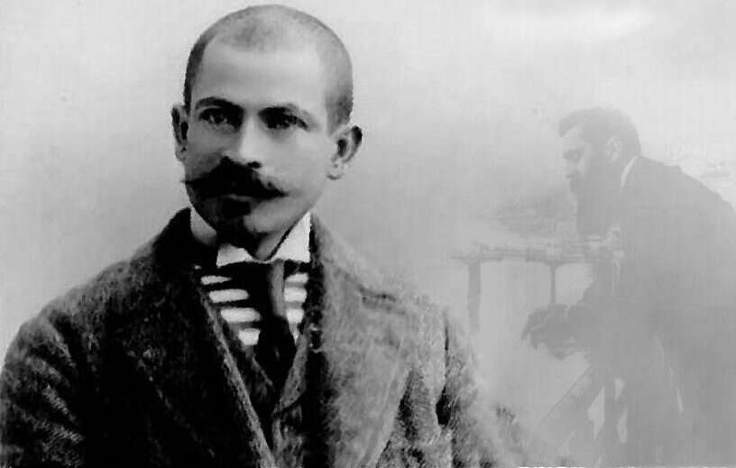
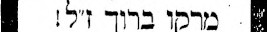
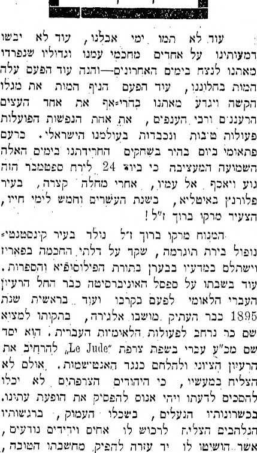
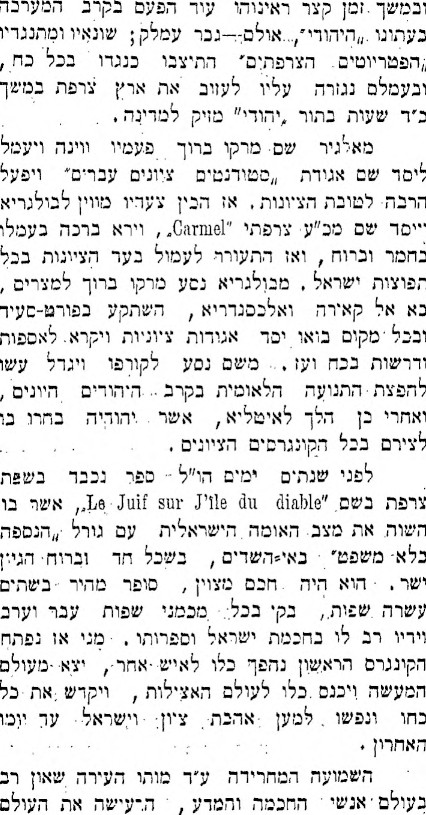
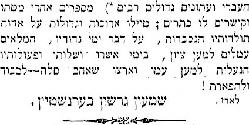
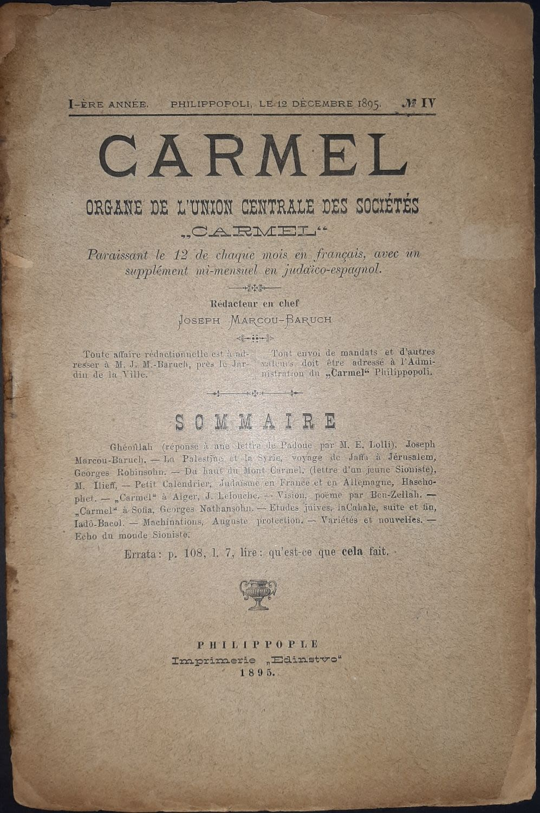

<u>השורה השניה – יוסף מרקו ברוך</u>

<u>(מתוך מאמר של אביה שקלאר-חמו ב"מקור ראשון" ינואר
2019)</u>

**"הגיע הזמן לתקן את הנרטיב הלאומי: מרקו ברוך תרם
לציונות הרבה יותר מאשר הרצל", **קובע ד"ר יגאל
בן־נון, שחקר את דמותו של המהפכן היהודי הנשכח. "ההערכות המפוכחות שלו
בעניין התארגנות צבאית של יהודים התגשמו לבסוף. הוא הבין שרק היהודים
יכולים להגן על עצמם מפני האנטישמיות, ושהפתרון הנכון הוא לכבוש את ארץ
ישראל. לא העיסוק הדיפלומטי של הרצל בכספים והקמת בנק לאומי, אלא הכוח
הצבאי הוא שגרם בפועל להקמת המדינה". 

אמנם, יגאל בן נון, הוא היסטוריון מעניין, אבל פרובוקטיבי
למדי, ואיננו חייבים לקבל את דעתו, אבל... זו פתיחה טובה כדי לשוחח על יוסף
מרקו ברוך, ציוני נשכח.

והנה מי שלא מקבל את דעתו, ממש באותו מאמר:

ד"ר יוסף קונפורטי, חוקר יהדות בולגריה (הקהילה היחידה שבה
נחשב ברוך למיתוס ציוני, כאמור), דווקא סבור שדמותו זכתה ליותר מדי הערכה.
"אני מציע להאמין למה שהרצל כתב ביומנו. ברוך היה אדם לא שפוי, ואי אפשר
היה לסמוך על דעתו. לולא העיתונים שלו הוא בכלל היה נשכח", קובע ד"ר
קונפורטי. "רק שש שנים לאחר שעזב את בולגריה, העלו את שמו כאבי הציונות שם.
בוועידה הציונית הראשונה בבולגריה, שהתקיימה ב־1898, ברוך כלל לא
הוזכר".

ההיסטוריונים לא מגלים היסטוריה, אלא מנסים לבנות נרטיבים,
אבל בזכותם אנחנו נחשפים לדמויות ואירועים שלא היכרנו.

היהודי הנשכח הזה בכל זאת זכה לשכונה תל אביבית שנקראת על
שמו: שכונת תל-ברוך, עם חוף שמרוחק מהשכונה היום, והיה מפוקפק למדי... וגם
לרחוב קטן, ללא מוצא, בקרית יובל בירושלים, בשם "מרקו ברוך".

מלבד אלו, קשה להניח שנותר בזכרונם של רבים בינינו, או,
אפילו של מעטים...

וכדי להתחיל להבין את דמותו, יוסף מרקו ברוך, נציין, שנולד
ב 1872 ונפטר ב 1899, כלומר בגיל 27 שנים. למעשה, לא סתם נפטר, אלא התאבד
ביריה, והסיבה הרשמית, אהבה נכזבת.

נחזור לתקופה, לשנת מותו, 1899 (שנתיים אחרי הקונגרס
הציוני הראשון), ונביא כתבת הספד, מעיתון "המליץ" אוקטובר 1899.

(בספריה הלאומית, ניתן למצוא צילומי עיתונות גם מהתקופה
ההיא)

 

הכותב, שמעון ברנשטיין, היה רוב שנותיו עסקן ציוני, שלא
עלה לישראל. נפטר ב 1962 בניו יורק.

והנה כותב אחר. שמריה גורליק, היה פובליציסט, עורך
ועיתונאי, תחילה נטה לבונד, ואחר כך לתנועה הציונית, עלה לישראל ונפטר ב
1942 כאן.

ארבע עשרה שנים מאוחר יותר, ב 21 למרץ 1913 כותב ש.
גורליק, מאמר גדול על יוסף מרקו ברוך, בעיתון "הצפירה". במאמר זה
"הרומנטיקן של הציונות" נראה כדמות מעט שונה.

מפני שהמאמר, הנמצא גם הוא בספרייה הלאומית, גדול בשבילנו,
אבל לא ניתן להעתיק קטעים ב"העתק-הדבק", העתקתי מספר קטעים מילה
במילה.

.... להזכיר נשמות סתם אנשים מקוריים, עמקנים, בהירים, שעל
פי סבות התלויות בתכונת רוחם לא עלתה בידם לעשות בשבילו \[בשביל העם\] דבר
ממשי – אין לו להעם פנאי לזה. מקום זה הניח לההיסטוריה, להספרות ולהאמנות
להתגדר בו; ... עליהם מוטל החובה להשתדל שלא יאבד איש כזה....

.....

תהי נא לי הרשות נתונה לשים לפניכם קוים אחדים המציירים את
האיש הנפלא הזה, שגז ועבר לפנינו כמיטיאור זה, כחזיון תפל בשביל אחדים,
וכחזיון מפליא ומוכתר בזר של אגדות בשביל אחרים – את מרקו ברוך, שחי בודד,
בלי שיבין איש לרעו, ומת בודד באיזו פנה נדחת ברחובות פלורנציה, בסמטא צרה
לפני פתח בית אהובתו.

.....

הוא היה מופיע והיה נעלם והפיץ בארצות ובערים שונות את
נאומיו החוצבים להבות אש. אדם דומה לסערה היה. בלי ראשית ובלי
תכלית.

.....

בפעם הראשונה "נתגלה" מרקו ברוך לפני הסטודנטים הציוניים
בברלין בקירוב בשנת תרנ"ד (1894). הוא קרא לאסיפה ודבר הרבה לפני הנאספים
בעוז ובהתלהבות, אינה מצויה כלל אצל הנואמים של הפרלמנטים – נפנופי יד,
קריאות היסטיריות, ותאוה מרובה יותר מדי בשביל אירופי. הוא בִּקר קשה (עוד
לפני הרצל) את המיטודות שהשתמשו בהן לתעמולה ודרש... שישנו את תנועת
הביל"ויים במדה יותר עזה וסערת מלחמה....

... מובן שלא הסכימו לו...הוא היה בעל תכניות גרנדיוזיות
(תמיד היו לו רק תכניות ולא הצעות ממשיות, כמורד אמתי) וביחס עם זה היה תם
כילד, לא חש ולא הרגיש שאין לדבר בכובד ראש על דבר עתון, שמספר חותמיו לא
עלה על שבעה – וכזה היה עתונו שבאלגיר.

.....

למעלה דברתי על ה"סוד" שבעיניו. בלי סוד זה לא נבין הרבה
ממעשיו וחייו של אותו האיש מרקו ברוך – רק שורה של חזיונות מפתיעים נראה,
כמו נאומו על המעלות בשעת הקונגרס השני, נועו ונודו בכל העולם, השתפכות הלב
לפני כל אדם עד לידי גועל, ההלואות של כסף שלו, שתותו אבסינט והתגעגעותו,
כפרא זה שתעה לבוא מארץ השמש אל הצפון הקר.

....

הציונות היתה לו למרקו ברוך גאולה פתאומית, קטסטרופלית.
ה"גאולה" לא היתה לו קנית הארץ הקדושה דונם דונם, מעט מעט, אלא ההחזרה
בחוזק יד של מה ששייך לנו עפ"י הדין. הזמן לא היה לו שום ערך בשביל
הטמפרמנט הנלהב שלו.

....

כך משוטט מרקו ברוך, זו הטעות ההיסטורית, בחוצות באזל
ואינו מבין כלום, כלום. בשביל כל המון אורחי הקונגרס וציריו אין ברוך אלא
אוריגינל, איש מיוחד במינו, איש מוזר, אנרחיסטן משוגע. מראים עליו באצבע,
מביטים עליו בסקרנות זו.... והוא, בעיניו הוא, היו כל הצירים וראשי הציונים
כמורדים בעמם. הה! אִלו שבו לדרך הישרה, אִלו הכירו בטעותם! ומרקו ברוך,
שמפני חוסר מנדט של ציר אינו יכול להכנס לתוך אולם הישיבות של הקונגרס
השני, מחכה לגמר הישיבה, ועוצר בעד כל המון הצירים בנאומו הנלהב מעל
המעלות. שומעים אותו, כמובן – אי אפשר שלא לשמוע אותו – אבל בקרב לבם
צוחקים השומעים על מְשֻבֹתָיו ונדים לו בראשם.

להרצל האמן, חובב הנשמות היפות, היה מרקו ברוך, אבן נוצצת
זו מן המוזאיקה המזרחית,

\[מרקו ברוך הוא יליד איסטנבול, וכמעט לא היו בקונגרסים
הראשונים צירים מיהודי המזרח\] קרוב ויקר ללבו.... אך הרצל העסקן המדיני...
לא יכול לעמוד אתו במחיצה אחת, כי מרקו ברוך היה מפריע את הסדר
והמשמעת...

......

הרומן שלו, שכתב בשעת היותו מתנדב במלחמת היונים עם
הטורקים ונדפס בירחון האיטלקי... נפסק לפעמים תכופות ע"י שירים צרפתיים...
שיריו מוקדשים לציונות..

שבח ותהלה לאבותינו היהודים

ותהלה שבעתיים לאומתנו;

שבח לאבותינו המכביים,

שבח ותהלה לשומרי מסורתנו,

שבח, שבח לבנינו, בני "ברוך", הבאים אחרינו

חַיָּלי ארצנו –

המה לנו את סוריה ישיבו.

\[וכן הלאה, והשיר, כנראה נכתב בצרפתית\]

.....

מרקו ברוך היה משוטט בכל הארצות ובכל מקום בואו היה משאיר
איזה סימן, איזה רושם, ככוכב שבט זה. במשך של חדשים אחדים אנו מוצאים אותו
– לפי הרשימות שביומן שלו – במקומות אלה: רומי, פלורנציה, פורט סעיד,
אלכסנדריה, פיליפופולי, קאירה, סופיה, ברלין, גנף, אנטוורפן. היו לו מכבדים
ומעריצים, אך לא היו לו חסידים שילכו בדרכיו. הוא נולד שלא בעִתו והיה בודד,
בודד לגמרי, ונשרף בלהב תאוה נכזבה, מיותר ונלעג.

....

מתוך מחלת אהבה ויראה ופחד הוא מאבד עצמו לדעת לפני פתח
הבית, שבו התגוררה "מלכתו אהבתו", שהיתה באמת רק תופרת פשוטה והבינה את
אוהבה עוד פחות מכל האנשים אשר על פני האדמה.

והמאמר כולל, כמובן, עוד פרטים רבים, אך זו רוחו.

ובכל זאת, יש עוד נקודת מבט

<u>מרקו ברוך, כ"מבשר" ז'בוטינסקי
והרוויזיוניזם</u>

מתוך אתר New1, קטעים מספר של אורי
מילשטיין על "צמיחת הציונות האסטרטגית של זאב ז'בוטינסקי"

מרקו ברוך, **שגילה, כאמור, לז'בוטינסקי את סוד המהפכה
העברית**, היה מבוגר ממנו בשמונה שנים. קיים דמיון מפתיע בין השניים: נולדו
בדרום אירופה – אודסה ואיסטנבול, התייתמו מאב בגיל צעיר; שלטו בשפות רבות;
למדו באוניברסיטת ברן, התייחסו לאיטליה כאל מולדת שניה, העריצו את גריבלדי,
ודבק בכל אחד מהם הכינוי "גריבלדי היהודי". שניהם היו עיתונאים ויסדו
עיתונים, היו משוררים, נדדו בעולם, היו ביקורתיים, מרדנים, פעילים ציוניים
כריזמטיים, נואמים בחסד, נקטו עמדות אופוזיציוניות לממסד, עמדות שנראו
בעיני רבים כהזויות; סולקו על-ידי הרצל מבמת הקונגרס הציוני באמצע דבריהם,
ושניהם העריכו כי טורקיה המתפוררת תחולק, וכי למען הגשמת הציונות חיוני
להקים צבא עברי, ולהילחם נגד טורקיה לצד אויביה, כדי לשלוט לאחר הניצחון על
ארץ-ישראל, בהסכמת המעצמות המנצחות, ובראש וראשונה בריטניה. שניהם לחמו
בעצמם בשדות הקרב נגד טורקיה. ברוך, במלחמה העות'מנית–יוונית על השליטה באי
כרתים ב-1897, וז'בוטינסקי, במלחמת העולם הראשונה בארץ ישראל.

....

היה גם הבדל אחד גדול ביניהם: בעוד שז'בוטינסקי העריץ את
הרצל על מנהיגותו, ברוך התנגד לו ולציונות המדינית שלו, בחריפות, עקב חוסר
ההבנה שגילה הרצל בחשיבות הגורם הצבאי בהקמת מדינה. ברוך טען שאין להסתפק
בשתדלנות אצל ראשי מעצמות ואין לסמוך על הבטחותיהם. ראוי שיהודים יעלו
בהמוניהם לארץ ישראל, יקימו צבא ויפתחו במאבק חמוש נגד הטורקים, לשחרורה של
הארץ בכוח ולהקמת מדינה יהודית. ברוך התאבד בפירנצה שבאיטליה ב-1899, והוא
בן 27 בלבד. גם ז'בוטינסקי שהה אז באיטליה, ועד ההתאבדות היו לו שיחות
אחדות עם ברוך. בשבועון הציוני שיסד הרצל, "דִי וֶלט" (העולם), ובעיתון היומי
הציוני הרוסי "המֵליץ", התפרסמו הספדים ובהם נכתב שהלך לעולמו אחד מלוחמיה
המוכשרים ביותר של התנועה הציונית. אחרי שנתיים פרסם עליו הפילוסוף מרטין
בובר שיר ב"די ולט". ברוך בישר את הציונות האסטרטגית, ז'בוטינסקי פיתח אותה
לאידאולוגיה שלמה.

אורי מילשטיין הוא בעל אג'נדה ברורה של ביקורת על הציונות
של הרצל ושל בן גוריון, והערצה לז'בוטינסקי. הוא הוציא ספר בשם **"גלגל
המנוף של ההיסטוריה – התגבשות הציונות האסטרטגית של ז'בוטינסקי",** דרך
מכון ז'בוטינסקי. בספרו הוא מקדיש מקום משמעותי ליוסף מרקו ברוך.

אין ספק שלמרקו ברוך היו עמדות מיליטנטיות קיצוניות, והוא
נאבק על הקמת צבא יהודי שיתקוף את תורכיה (וזה עוד 15 שנה לפני מלחמת העולם
הראשונה שבה התפוררה האימפריה העות'מנית).

באתר "הספרנים", של הספריה הלאומית, מצוטטים כמה מדבריו –
סיסמאותיו:

**מרקו ברוך על פגישת הרצל עם שליט האימפריה
העות'מנית:**

"למה נסע לשם, מה זכות היתה לו לכך? בשם מי? בשמנו? בשמי
אני? לא ולא. עבדול חמיד הנוכל מוליך אותו שולל."

**האלטרנטיבה שהוא הציע:**

"על העם היהודי לדעת לפעול כדי להשיב לידו את חלקו החוקי,
את שטחי המדינה היהודית הקטנה.

גיבורים יהיו אלה אשר יכבשו את ארץ ישראל מידי המשעבדים
התורכים ונשק בידם."

שירי לכת שחיבר בקראו ליהודים אל הנשק:

"לוחמינו בני החיל

יעלו על ארץ צור

אתא בוקר, תם הליל

ונקרא אליה דרור

נדליק את נר המכבים

כי דמם הוא בעורקינו.

גם אם נפול שם חללים

לא נשכח את מולדתינו"

**"**

**הציונות הצבאית" של מרקו ברוך:**

"היו אוסרים אותי בגלל הציונות הצבאית שלי, על שאני קורא
ואקרא תמיד: ישראל – לנשק!

אני דורש כי הביל"ויים החדשים שלנו יהיו חמושים ומזוינים
מכף רגל ועד ראש.

הביל"ויים שלי – רובה על שכם, גדודים, שורות שורות, צבא
שלם של חיילי ביל"ו!"

הקונגרס הציוני של מרקו ברוך מול הקונגרס הציוני של
הרצל:

"את הרצל אזמין לכאן לבולגריה. כאן, ליד גבול תורכיה ממש,
יותן לקונגרס אופי של הפגנה צבאית, הרי הרצל עצמו טען, כי דרוש לנו צבא, כי
קצינים יש לנו כבר ובמספר רב. מכאן יימסר האולטימטום לקושטא רבתי – כאן
יהיה התרמופילים \[קרב הענקים\] שלנו – שלי ושל הרצל זה."

**וכך אמר מרקו ברוך הבלתי מוזמן לקונגרס הציוני השלישי,
רגע לפני שהסדרנים סילקו אותו:**

"אני מציע להשתלט על ארץ ישראל בכוח הזרוע. בכל הפגמים
אשמים עשירי ישראל. יש להחרים את כספם ובעזרתו להקים צבא יהודי. במקום זאת
אנו שולחים אגרות של התרפסות!"

אך האם באמת ז'בוטינסקי נפגש איתו והושפע ממנו?

אם נצטט שוב קטע מספרו החדש של אורי מילשטיין (על פי סקירה
על הספר במוסד ביאליק):

"סוד המהפכה העברית", שאותו העביר יוסף מרקו ברוך
לז'בוטינסקי בן השבע-עשרה, בשיטוטיהם ברחובות רומא, נעוץ בחזרה לתרבות
הביטחונית, שאפיינה את העם העברי, באלפיים השנים שבין אברהם אבינו ליוחנן
בן זכאי.

ושוב במקום אחר:

ברוך אמנם לא הצליח להקים כוח צבאי עברי, אבל זאב
ז'בוטינסקי, שהקים את הגדודים העבריים והטמיע את התפיסה הביטחונית, יכול
להיחשב כמעין ממשיך דרכו. השניים הכירו בחוג ציוני באיטליה ונרקמה ביניהם
ידידות. בטיולים ליליים ברחובות רומא גולל ברוך באוזני הסטודנט האודסאי את
רעיונותיו. "זה היה דיאלוג פורה", אומר ד"ר אורי מילשטיין. "שניהם הבינו
שאין סיכוי להקים מדינה ללא צבא, ושצריך להקדיש לנושא הרבה חשיבה, תשומת לב
והכנה. בכך הם היו שונים מאוד בנוף המנהיגותי. אין ספק שז'בוטינסקי היה
לתלמידו, ובמובן מסוים ההשפעה של ברוך הגיעה עד לבן־גוריון. זו השפעה
תרבותית שמתגלגלת".

יוסף מרקו ברוך היה מבוגר מזאב ז'בוטינסקי בשמונה שנים,
ונפטר בגיל 27. לכן כאשר נפגשו ז'בוטינסקי היה כנראה בן 17... נראה קצת
מפוקפק.

חיפשתי מקור אחר, בנוסף למילשטיין, כי לא ברור על איזו
אינפורמציה מילשטיין התבסס.

ואכן, הפגישות עצמן הן עובדות מבוססות, אם כי נראה שאורי
מילשטיין הוסיף קצת פתוס.

מצאתי ברשת דף עיתון, ללא תאריך, אבל עם סיפור של אדם בשם
שמואל מרלין, איש תנועת החירות, שהיה גם חבר כנסת, ועזב את הארץ בשנות
החמישים. בביקור מולדת הוא מספר לאורי אבנרי על יחסי ז'בוטינסקי עם בגין,
ואגב כך:

ב- 1938 התקיים מושב של מועצת התנועה. ה"מכסימליסטים" (כפי
שקראו לנו אז) דיברו נגד הפוליטיקה של ז'בוטינסקי. אמרנו שצריכים להעביר את
נקודת-הכובד לפעולות אלימות....

...

הייתי האחרון ברשימת הנואמים....

ובאמת בניתי נאום שלא היתה בה אף מילה אחת שלי. ציטטתי את
הכל: "שא אש להצית אין דבר", "למען ההוד הנסתר", "כי שקט הוא רפש", הזכרתי
איך נפגש עם מרקו ברוך, הציוני התמהוני, שעימו ביקר ליד שער טיטוס, ומרקו
ברוך לקח צבע או גיר וכתב "שא אש להצית", **וז'בוטינסקי לא הבין את
הרעיון**. אז הסביר לו מרקו ברוך שלא ישימו לב לבעייה היהודית, אם לא יעשו
סקנדלים, אלימות, שיכריח את דעת הקהל לשים לב.

<https://olam.eu-central-1.linodeobjects.com/spdf/2141/B-I2141-D130978-P24.pdf>

<u>ומה בין הרצל ובין מרקו ברוך?</u>

אחרי מפגש ראשון, שבו מרקו ברוך אורב להרצל בדרך, מגיב
הרצל:

"האנרכיסט מרקו ברוך, שנלכד ברשתה של הציונות, אמר לי:
'אני מצטער שאתה מציג לפני העם היהודי את שאלת הבנק. אני לא הייתי רוצה
בכך, למען ההיסטוריה'. בדרך כלל מוח נפתל למדי, אך המילים האלה – זהו המשפט
הנהדר הראשון שהושמע בקונגרס זה!"

התפעלות...

אבל עד הקונגרס השלישי הוא כבר מסוכסך עם הרצל...

וכך אומר הרצל, לאחר התאבדותו של מרקו ברוך:

"האנרכיסט יוסף מרקו ברוך המית עצמו ביריה בפלורנץ. איש
מטורף זה היה שולח לי מכתבי איום מן הקונגרס השני והשלישי. אני חששתי באמת,
שינסה הפעם בבאזל להתנקש בחיי. איש לא הגן עלי. יוסף מרקו ברוך עמד, כשרצה
בכך, לפני, מצדי או מאחורי. אם היה רוצה היה יכול לדקור אותי בסכין… מותו
מרצון מוכיח, כי אל נכון ראיתי את הרצח בעיניו."

ואחרי כל הדעות השונות על אדם קצר ימים זה, נסכם בתקציר את
חייו הקצרים והסוערים של יוסף מרקו ברוך, על פי הויקיפדיה.

ונראה כמה קשה לשפוט אדם כזה...

יוסף מרקו ברוך נולד ב 1872 באיסטנבול, למשפחה שהיגרה
מהאימפריה הרוסית. אביו נפטר בגיל צעיר, ואימו עזבה את מרקו וחזרה
ללטביה.

ב 1890 למד בסמינר למורים בפריז, עבר לברן וב 1893 סיים
בהצלחה לימודי פילוסופיה וספרות.

ב 1894 הועסק כמורה ב"אליאנס" בעיירה באלג'יר, ערך כתב עת,
ונאם פעמים רבות נגד השלטון הצרפתי, כולל קריאות להתקוממות חמושה. גורש
מאלג'יר באותה שנה, בעקבות בקשה של ההנהגה היהודית...

הגיע לצרפת שם נעצר בחשד להשתתפות ברצח נשיא צרפת דאז, אך
שוחרר מחוסר אשמה, עזב את צרפת, שוב בלחץ הנהגת הקהילה, והתיישב
בברלין.

בהבינו כי האימפריה העות'מנית על סף קריסה (כולם חשבו כך)
קרא להקמת צבא יהודי שיכבוש בכוח את ארץ ישראל. תמכו בו בודדים (הידוע
מתומכיו הוא שמריהו לוין, פעיל ציוני, אחר כך עיתונאי שנפטר בארץ ב 1935,
ועל שמו כפר שמריהו).

מרקו ברוך גורש גם מגרמניה, כ"אישיות מסוכנת ובלתי רצויה"
ועבר לווינה, עד שגורש גם משם, לבודפשט, ושם הועלה לרכבת לאיסטנבול. נמלט
מהרכבת בסרביה, הגיע לבלגרד.

באפריל 1895 (נשים לב, מראשית עבודתו באלג'יר עברה רק שנה
וחצי...) הוא מגיע לסופיה. שם הוא זוכה לשיתוף פעולה של הרב הראשי ואחרים
הוא עובר לעיר פלובדיב, עדיין בבולגריה, שם הוא מצליח להוציא ירחון ציוני
בשם "כרמל", וגם להקים תאים של ארגון "כרמל" בכמה ערים בבולגריה, למרות שגם
שם הוא נעצר מדי פעם על ידי המשטרה.

בעיתונו, שאולי תוכלו לקנותו במכירה פומבית (אם הוא לא
נמכר במכירה שהתקיימה ב 2020), הוא מפיץ ציונות, מגנה אנטישמיות, אך גם
תוקף את עשירי הקהילה.

הירחון זכה לתפוצה של 500 עותקים, בין ספטמבר 1895 ל ינואר
1896 (שש חוברות), ולכן הוא בהחלט ממצא יקר ערך.

בסוף 1896 הוא מגיע למצרים ומייסד אגודות ציוניות בשם "בר
כוכבא" בשלוש ערים. אחר כך עובר ליוון ומתנדב למלחמת היוונים נגד העות'מנים
ב 1897, ביולי 1897 הוא כבר באיטליה, מייסד גם שם אגודות ציוניות, עובר
לשוויץ משתתף כמשקיף בקונגרס הציוני הראשון.

לקונגרס השני הוא נשלח כנציג הקהילה באיטליה. חצה ברגל את
האלפים כדי להגיע לקונגרס, מצליח להרשים את הרצל בשיחה "שחטף" ביציאתו של
הרצל מהאולם, ומקבל ממנו את משרד ההסברה בבריסל לתקופה קצרה. משם ההוא
מתפלמס עם הרצל במכתבים, עד שהיחסים ביניהם מתנתקים...

ב 1899 הוא משתתף בקונגרס השלישי, אך כבר בעימות עם הרצל
ועם רוב הצירים. לא מאפשרים לו לנאום. הוא עולה לבמה, והרצל מורה לסדרנים
להורידו.

משם הוא נוסע לבית ארוסתו או חברתו, או מי שרצה שתהיה כזו,
בפירנצה, יוצא מביתה ומתאבד ביריה.

מכל הקהילות שבהן ניסה לפעול, הוא זכור לטוב על ידי ציוני
בולגריה.

לכן את השכונה שהקימו בתל אביב ב 1947, קראו על שמו, תל
ברוך.

אבל גם זאב ז'בוטינסקי הזכיר אותו לטובה, והיום, מעלה את
זכרו מעלה מעלה, אורי מילשטיין, ומתארו כ"אביו הרוחני" של
ז'בוטינסקי.

וכמו שהובטח, אם חשקה נפשכם, עיתונו של יוסף מרקו ברוך,
"כרמל" משנת 1895 נמכר (או לא נמכר) במכירה פומבית ב 2020, במחיר התחלתי של
80 דולר. אולי עוד ניתן להשיגו...

דבר החברה העורכת את המכירה הפומבית

פריט 252:

נמכר ב: **\$80**

**"כרמל" - ביטאון ציוני בצרפתית - מס' 4 – 1895 מאת ברוך
מרקו.**

עיתון ציוני בצרפתית מאת מרקו ברוך, בטאון זה - הרביעי
בסדרה - יש לו משמעות מיוחדת בהיסטוריה הציונית. גיליונות הכרמל - והגיליון
הרביעי במיוחד - יצאו לאור בין גלי המלחמה של מתנגדיה שלחמו למען סגירת
העיתון. וכך כותב מרקו ברוך על הגיליון הרביעי: "לכשיתברר להם ליהודים
העשירים כי עיתוני מוסיף להופיע, ישלחו משלחת אל המיניסטר ויבקשו לגרש אותי
מתחום המדינה..."

