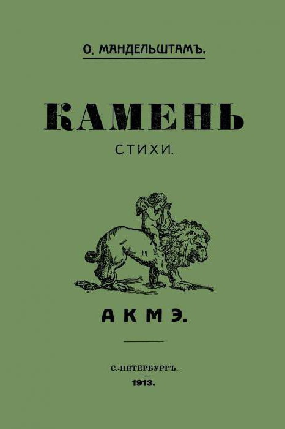
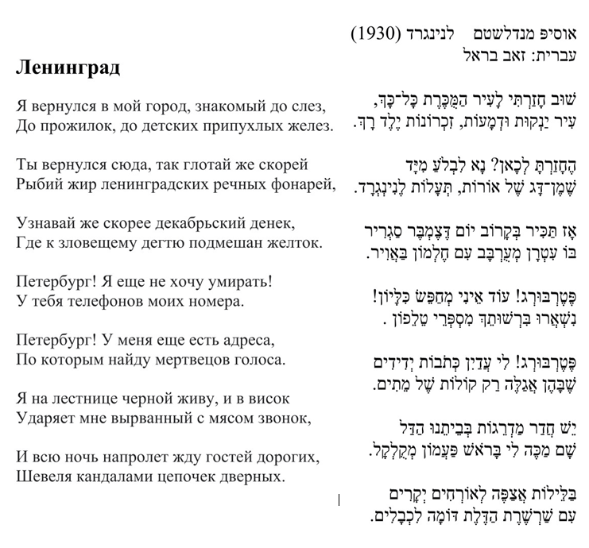
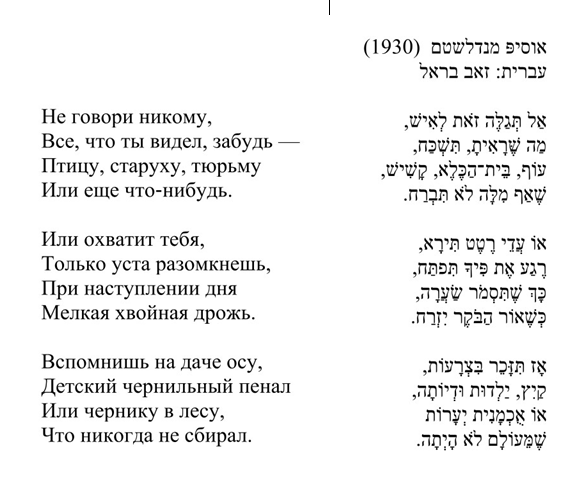
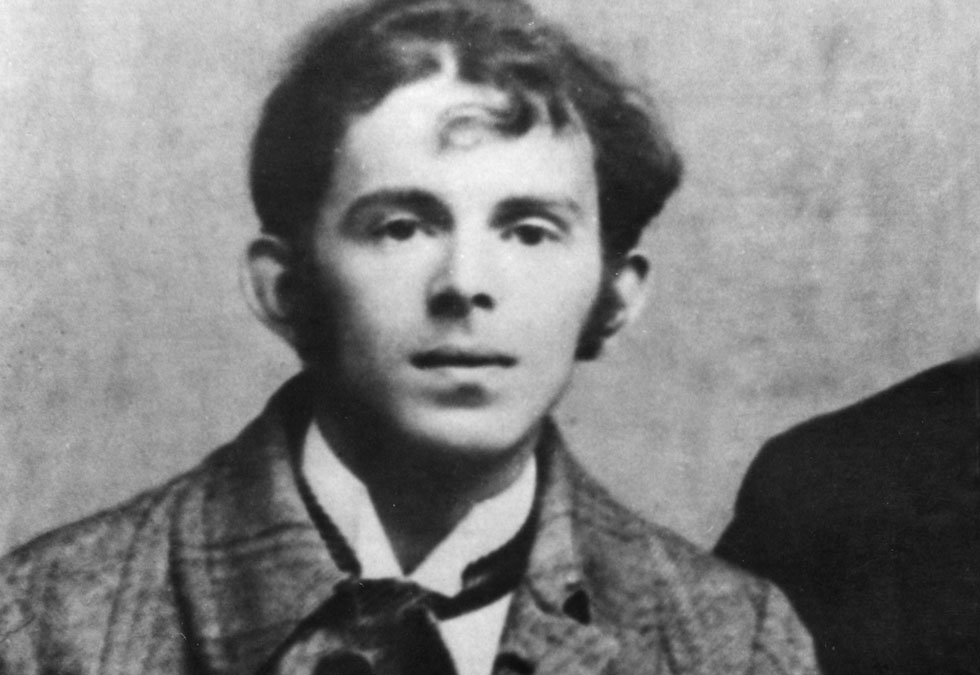
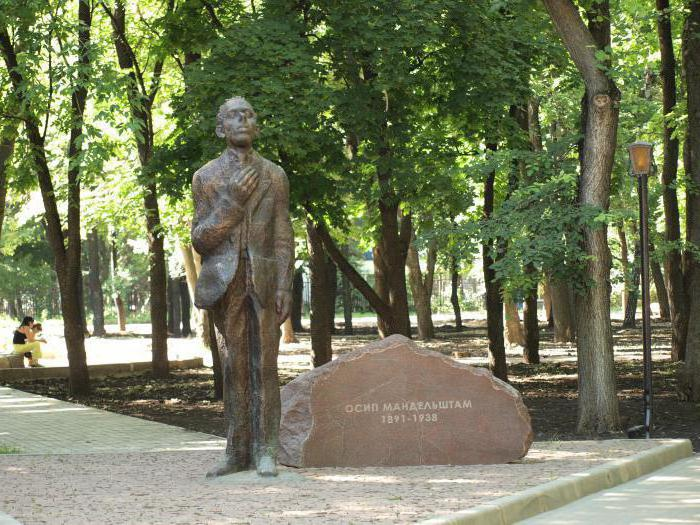

<u>השורה השניה – אוסיפ מַנְדֶלְשְטַם</u>

כמו רבים מגיבורי הסדרה הזו, גם אוסיפ מַנְדֶלשְטַם לא האריך
ימים בעולמנו, ודווקא בגלל זה, או למרות זה, בולטת אישיותו מאוד.

אוסיפ נולד, ב 1891 בוורשה, ונפטר ב 1938, בגיל 47 במחנה
אסירים ליד ולדיבוסטוק על חוף הים היפני בקצה המזרחי של רוסיה.

הוא מת בגלל שיר.

באתר "סופרת ספרים" כותבת עופרה עופר אורן, שאם מוציאים
להורג בגלל שירים, סימן שיש להם עוצמה. אבל נכון יותר לומר, שאם מוציאים
להורג בגלל שירים, יש למדינה דיקטטורית רשעות אין סופית. ודוקא בכיוון הזה
נכון לנו לחשוב היום.

יש מי שנולד לתקופה נוחה, קלה ואפילו מאושרת. ויש מי שנולד
לימים קשים.

בסוף המאה ה-19 התעוררו ברוסיה תנועות ליברליות,
סוציאליסטיות, אנרכיסטיות ועוד ועוד, שתבעו שינויים בשלטון, שהיה נתון בידי
משפחת הצארים, ובחברה. באותה תקופה עדיין רוב העם היה איכרים ורבים מהם
צמיתים (כלומר, אסורים לאדמתם). ניתן לומר שרוסיה הייתה עדיין פיאודלית
במידה רבה.

ב 1894 עלה לשלטון הצאר ניקולאי השני, שהיה מלך חלש
מאוד.

ב 1904 הפסידה רוסיה במלחמתה ביפן, דבר שעורר עוד יותר את
זעם ההמונים.

מחאה שפרצה ב 1905 הפכה למרידה של ממש, לאחר שחיילי הצאר
הרגו רבים בהפגנה לא אלימה מול ארמון הצאר.

כ 9000 איש נהרגו במהומות שנמשכו כשנתיים, ובתוכם פרעות
ביהודים, והרג של אנשי צבא, ומנהיגים ברמות שונות. בסופו של דבר נכשלה
ההפיכה.

לאחר כשלון ההפיכה, הקים הצאר דוּמה (פרלמנט), אך בפועל לא
השתנה כמעט דבר. לא נתנו סמכויות לפרלמנט.

12 שנה אחרי כן, ובעקבות מלחמת העולם הראשונה שטרם
נסתיימה, התפתחה מהפכה עממית נוספת בפברואר 1917, שבעקבותיה התפטר הצאר
והוקמה ממשלה רפובליקנית. אך במתחים שנוצרו בין התנועות השונות, הממשלה
הזאת נכשלה כליל והופלה לבסוף על ידי הקומוניסטים (הבולשביקים) באוקטובר
1917.

המהפכה הבולשביקית הייתה שקטה יחסית, והעם קיבל אותה
באדישות. אבל אחריה נפתחה מלחמת אזרחים עקובה מדם שנסתיימה רק שש שנים אחרי
כן, אם כי עיקר הקרבות התנהלו בשלושת השנים הראשונות. במהלך הקרבות נהרגו
מאות אלפי יהודים בפרעות בעיקר באוקראינה ודרום רוסיה.

מנהיג המהפכה היה ולדימיר לנין, שהיה אידיאליסט וגם פנה
בסוף חייו לדרכים פרגמטיות. אך הוא נפטר ב 1924, וירש אותו סטלין, שנחשב
בצדק לאחד מגדולי העריצים של המאה העשרים. הוא התחזק בהדרגה במשך שנות
העשרים, וכבר בסופן הדיח את חבריו של לנין, וחבריו שלו מההנהגה, ואף החל
לשלוח רבים לגלות בסיביר. הוא כפה באכזריות את הקולחוזים, ואת פיתוח
התעשייה הכבדה, גם תוך מוות ברעב של מיליונים.

באמצע שנות השלושים, בערך מ 1935, כנראה כבר החלה הפראנויה
האופיינית לדיקטטורים, והוא החל בחיסול פיזי של כל ההנהגה הותיקה, בדרגות
שונות, וגם חיסול המוני של חשודים, על ידי טרור של הלשנות. החיסולים והטרור
נמשכו עד פלישת הגרמנים במלחמת העולם השניה ב 1941 (מבצע ברברוסה), הופסקו
עד סוף המלחמה ב 1945, ולאחר המלחמה התרכז בעיקר בגירושים המוניים של עמים
ששתפו פעולה עם הנאצים או נחשדו בכך. רק מותו של סטלין ב 1953 הפסיק את
הטרור הנורא שלו.

זוהי התקופה העגומה שבחלקה חי אוסיפ מנדלשטם, שכאמור נפטר,
ולמעשה נרצח ב 1938, בתחילת תקופת הטרור הרצחני.

אוסיפ מנדלשטם נולד ב 1891 בוורשה, למשפחה יהודית, עשירה
ומתבוללת. אביו היה סוחר מוצרי עור, שהתנתק מהיהדות, והורשה לגור מחוץ
לתחום המושב. אמו הייתה מוזיקאית שלמדה בגימנסיה רוסית.

ב 1897 עוברת המשפחה לסנקט פטרבורג, ובשנים 1900 עד 1907
לומד אוסיפ בבית ספר מתקדם מהטובים בעיר, בית ספר למסחר.

אבל, הוא אינו יכול להתקבל לאוניברסיטה, בהיותו יהודי,
בגלל הנומרוס קלאוזוס. הוא לומד שלוש שנים בגרמניה ובצרפת, שפות, פילוסופיה
וספרות, ובשנת 1911 הוא מתנצר, בעיר שאינה רחוקה מפטרבורג. לאחר מכן הוא
מתקבל לפקולטה לפילולוגיה באוניברסיטת פטרבורג.

הוא מתחיל בכתיבת שירים בסגנונות שונים, ומושפע בעיקר מאנה
אחמטובה. אנה אחמטובה הייתה מהגדולות במשוררות הרוסיות במאה העשרים. אפילו
סטלין, שרדף אותה, הרג את הבעלים שלה ואסר את בנה, כדי לדכא את עצמאות
שירתה, לא העז לפגוע בה, ואפילו הציל אותה ממצור הנאצי על פטרבורג.

את ספר שיריו הראשון, הוציא אוסיפ מנדלשטם, בשנת 1913, על
חשבונו. הוא היה אז בן 22.

לא ננתח כאן את שירתו של אוסיפ מנדלשטם בשנות העשרה ובשנות
העשרים, בהם היה עד לתלאות מלחמת העולם הראשונה והמהפכה. (אני בור למדי
בנושא שירה).

בין השאר הוא כותב שירי אהבה לאשתו, נדיז'דה, אותה הכיר ב
1919, והיא האריכה ימים הרבה אחריו, והקדישה את חייה בשבילו ולמען
זכרו.

בין 1925 ל 1930 הוא מפסיק לכתוב שירה וכותב פרוזה.

בראשית שנות השלושים, הוא מבין לאן המשטר הסובייטי הולך.
הוא מתנתק מהתרבות הרשמית, ובשירים שכתב ב 1933, כבר בסתר, היה השיר שחרץ
את גורלו.

אך לפני כן, כבר ב 1930 ניתן לחוש בשירו את הפסימיות שלו
ביחס למשטר:

<u>מאתר "יקום תרבות" מאמר: לנינגרד – שירים של אוסיפ
מנדלשטם בתרגומו של זאב בראל</u>

<u>אבל השיר שחרץ את גורלו, הוא אולי הנועז ביותר שנכתב
בברה"מ בתקופה זו.</u>

(תרגום לעברית פטר קריקסונוב, מאתר
<https://xnet.ynet.co.il/articles/0,7340,L-5244367,00.html>)

אֶת הָאָרֶץ תַּחְתֵּינוּ אֵינֶנּוּ חָשִׁים,

לֹא שִׂיחוֹת שִׂיחָתֵנוּ, אֶלָא לְחָשִׁים,

אֲבָל גַּם מֵחֲצִי שִׂיג וְשִׂיחַ

אִישׁ הָהָר הַקְּרֶמְלִינִי שׁוֹחֵט הָאִכָּרִים יָגִיחַ:

אֶצְבָּעוֹת לוֹ עָבוֹת וּשְׁמֵנוֹת כְּתוֹלָע,

כְּמִשְׁקֹלֶת שֶׁל טוֹן נְכוֹנָה כָּל מִלָּה,

כְּמוֹ מַקָּק צוֹחֲקוֹת הָעֵינַיִם,

בֹּהַק עַז מַבְהִיקִים מַגָּפַיִם.

 

וּסְבִיבוֹ מַנְהִיגִים דְקִיקֵי הַצַּוָּאר

חֲצָאֵי אֲנָשִׁים יַעֲשׂוּ כֹּל דָּבָר,

זֶה שׁוֹרֵק, זֶה נוֹהֵק, זֶה מֵרִיעַ –

וְרַק הוּא מְהַמְהֵם וּמַצְבִּיעַ

כְּמוֹ פַּרְסָה יַעֲנִיק כֹּל פְּקֻדָּה וּפְקֻדָּה –

יַךְ בַּשֵּׁן וּבָעַיִן קְרָבַיִם יִגְדַּע,

כֹּל דִּין מָוֶת כִּדְבָשׁ יֶעֱרַב לוֹ,

וְחָזֶה אוֹסֶטִי רָחָב לוֹ.

 

אגב, מכל העלבונות שהוא מטיח בסטלין, אחד הגדולים הוא
המילה "אוסטי", כלומר בין לעם האוסטים, שהוא עם בגיאורגיה, וכנראה פוגע
בגאוותו הגאורגית של סטלין.

אבל אין ספק, זה לא שיר "מרמז" זה שיר שמכה ישירות
בפנים.

הנה קריאה של השיר, בתרגום אחר על ידי יעקב לח:

<https://www.youtube.com/watch?v=exprEWhaWjk>

אם כן, הקטע הזה מדגיש, שהשיר האנטי סטליניסטי אינו ממיטב
שירתו של אוסיפ מנדלשטם, אבל מבטא את שיא הגבורה שלו. וכל מי שחושש
מהתפתחותה של דיקטטורה ראוי לו לשים לב לקורותיו של האיש.

בשביל לחזק את גירסתו של יעקב לח, שאוסיפ היה קודם כל
משורר, ולמעשה משורר פטריוט רוסי (של השפה הרוסית), הנה קטע קטן ממאמר
בפרוזה שאוסיפ כותב, על השירה, ב 1924, אחרי המהפכה אך טרם הטרור
הסטליניסטי:

אוריינות פואטית אינה דומה בשום-אופן לידיעת קרוא-וכתוב
ואף לא לבקיאות ספרותית. אחוז האנאלפביתים והבורים ברוסיה גבוה, אך מידת
הנבערות הספרותית הינה מפלצתית ממש. מצער עוד יותר הוא הזיהוי הרווח בין
האוריינות הבסיסית לבין האוריינות הפואטית. הנאמר מתייחס באופן בלעדי להמון
המשכיל למחצה הלוקה בסנוביזם, לו אבדה תחושת הלשון השורשית. למעשה, המון זה
הוא לחלוטין נעדר לשון, הוא אמורפי ביחס לשפתו. המון זה מגרה את עצבי השפה
אשר קהו זה מכבר בגירויים זולים, בליריות מפוקפקת, בניאולוגיזמים \[מילים
או ביטויים מחודשים\] שלעיתים תכופות עוינים וזרים למהותה של השפה
הרוסית .

מנדלשטם אינו מהפכן, או מורד, שמשתמש בשירה כדי לבטא את
עמדותיו הפוליטיות, אלא משורר מאז התבגרותו (ספר שירים ראשון בגיל 22),
פטריוט של מולדתו ושל שפתו הרוסית, שנסחף לעבר ההתנגדות כשחזה את המתחולל
סביבו.

אשתו של אוסיפ, נדיז'דה, מספרת, שנודע לה שהחוקר הציג את
השיר בפני אוסיפ, והוא הודה שהוא המחבר, ושהשמיע אותו בפני כעשרה אנשים. זה
הספיק כדי שהאינפורמציה תגיע עד לשליט העליון.

<u>וכך כותבת עופרה עופר אורן ב
XNET:</u>

אין פלא שאשתו של המשורר כל כך חששה. "כששבתי למוסקבה",
סיפרה נדז'דה, "גיליתי שכולם מכסים את מכשיר הטלפון שלהם בכרים: פשטה שמועה
שבכל טלפון מותקן טייפ, וכל התושבים רעדו מפחד מפני העד המתכתי השחור
המאזין למחשבותיהם הכמוסות". והנה בעלה כותב שיר כזה. אמנם, אינו מפרסם
אותו – השיר עבר מיד ליד, ואנשים שיננו אותו בעל פה – ובכל זאת, איזה אומץ,
או ייאוש, או שניהם. בסופו של דבר, השיר הגיע לידיו (או לאוזניו) של גנריך
יגודה, ראש המשטרה החשאית הסובייטית, שהשמיע אותו לסטלין.

הדיקטטור החליט על שיטת התעללות מיוחדת במינה: לא הוצאה
מיידית להורג, אלא מעין משחק של חתול ועכבר. אחרי מעצר קצר נשלח מנדלשטם
לחופשי, אבל עליו ועל אשתו נאסר לגור באף אחת מ-12 הערים הגדולות ברוסיה.
כמו כן, נאסר עליהם לעבוד למחייתם. במשך ארבע שנים הם נדדו ברחבי ברית
המועצות כמו קבצנים חסרי בית, סמוכים על שולחנותיהם של חברים שהסכימו לתמוך
בהם (היו גם אנשים חסרי רגש שמתחו עליהם ביקורת על שאינם מתפרנסים בעצמם,
נוטלים "הלוואות" ולא מחזירים אותן), עד שב-1937 נאסר מנדלשטם ונשלח למחנה
במזרח הרחוק, שם מת במועד לא ידוע. גם לא ברור ממה בדיוק הוא מת: מטיפוס,
מקור, מרעב או מחולשה – כנראה שמכל אלה ביחד.

 

"אני לא מוכן לעזוב את העולם בלי להשאיר אחריי את דעתי
הברורה על מה שמתרחש לנגד עינינו", אמר מנדלשטם. על האפשרות שיוצא להורג
אמר: **"אם מוציאים להורג בגלל שירים, סימן שיש להם עוצמה, שרוחשים להם
כבוד והערצה, שמפחדים מהם, ואם כך − שהם יכולים להשפיע**".

 

מעטים היו האנשים שהעזו אז לומר את אשר על ליבם. "כולנו
השלמנו עם כך: שתקנו, בתקווה שיהרגו את שכנינו ולא אותנו", כתבה לימים
אשתו, שהקדישה את חייה להנצחתו. את שיריו שיננה בעל פה ונעזרה בידידים
שהעתיקו והטמינו אותם במקומות שהוסתרו גם ממנה, כדי שלא תוכל להסגירם, אם
תיתפס.

 

על ימיו האחרונים לא נודע לה דבר. אפילו לא הודיעו לה שמת.
אבל ידיעה אחת הגיעה אליה: שורות משירו של מנדלשטם נמצאו חרוטות על קיר בתא
הנידונים למוות, והוא עצמו ידע על כך, כנראה. נדז'דה התנחמה מהמחשבה
שהידיעה העניקה לו כמה רגעים של חסד.

זו תמונתו של אוסיפ מנדלשטם, המשורר המורד.

מי שסיפרה את הביוגרפיה של אוסיפ מנדלשטם היא, כמובן,
נדייז'דה אשתו, בספר שבתרגום לעברית על ידי י.מ.חֶשון נקרא "תקוות השיר".
נדייז'דה, נולדה ב 1899, למשפחה יהודית בעיר סראטוב, נישאה לאוסיפ, כאמור ב
1919, עברה את כל תלאות הסטליניזם, ונפטרה ב 1980 במוסקבה. את הארכיון שלה
העבירה לאוניברסיטת פרינסטון בארה"ב, כך שלא נראה שגם היא שמרה על קשר
לישראל או ליהדות.

וכך כותבת נילי מירסקי, בביקורת על "תקוות השיר" בשם "על
הומאניזם ושירה" בעיתון "דבר" 1978.

הדבר שהרשים אותי יותר מכל בזכרונותיה של נאדייז'דה
מנדלשטם....

הוא אופן קיומה המיוחד של השירה בתוך מירקם החיים מוכי
הרדיפות והאימה המתוארים בספר: השירה כאן איננה בבחינת תפנוק אינטלקטואלי
לאניני-טעם....

בתוך המציאות שמעלה נאדייז'דה מנדלשטם בזכרונותיה מופיעה
השירה ככוח בעל עוצמה חיונית דינאמית מאוד, וקיומה הוא ממשי וניכר בעליל לא
פחות מקיומם של בתי-חרושת או בתי הסוהר: למען הצלתם של טורי-שיר בודדים
מוכן אדם לסכן את כל אשר לו וגם את חייו, ושינון פסוקי שירה יש בו כדי
להפיג את ייסוריו של אסיר מחנות-כפיה.

......

זכרונותיה הם בין השאר גם וידוי-אכזבה מריר....

אם לחץ הדיכוי הצארי שימש, מבחינות רבות קאטאליזאטור
להתגבשותם ולהעמקתם של ערכי ההומאניזם והקידמה החברתית בקרב האינטליגנציה,
הרי שאמצעיו (האכזריים והמתוחכמים בהרבה) של הטרור הסטאליני הצליחו לזרוע
פירוד, חשדנות ואיבה בין אנשי-הרוח לבין עצמם ולשבור את כוח התנגדותם
הפנימית ואת נאמנותם לצו-המצפון...

במרכז הספר עומדת דמותו של אחד המעטים שלא נשברו – בעלה של
הכותבת....

שיריו הוחרמו ונאסרו בפרסום, אך היו נפוצים בכתבי-יד בקרב
חוג מצומצם – ונלהב מאד – של מעריצים...

.....

הוא לא שלל את המהפכה מעיקרה; להיפך, מנעוריו ציפה לה ותלה
בה תקוות גדולות. אך משהעמידה אותו המציאות בפני הבחירה בין מהפכה לבין
הומאניזם – בחר בהומאניזם. ועל כך שילם בחייו.

ועופרה עופר אורן, באתר "סופרת ספרים" כותבת כך:

יותר משלושים שנה אחרי שמנדלשטם כתב את השיר שהביא כנראה
למותו, הגניבה נדיז'דה למערב את כתב היד של זיכרונותיה: התיאור של מה שעבר
עליהם באותן שנים. הספר, תקוות השיר,.... ראה אור בישראל בשנת 1977.... זה
אחד הספרים המרגשים ביותר שקראתי אי פעם. קשה להבין איך הוא מצליח להיות
מסעיר כל כך, איך הוא זוהר מבעד לעברית המוזרה והפגומה \[של המתרגם\], ועוד
יותר מכך – איך סבל בל יתואר מוליד יופי ועוצמה כאלה.

ובעצם, אין מה להתפלא. מנדלשטם תיאר פעם את המעשה האמנותי:
"יושב לו אדם ומפסל בסכין גזיר עץ והנה נוצר אלוהים".

....

אחד החלקים המדהימים ביותר בספר הוא תיאור האמון העיוור
שנתנו התושבים בשלטונות. "כולם", היא מספרת, "האמינו במה שפיטמו
אותם"...

.....

מי שחי בדיקטטורה, היא מסבירה, חש מהר מאוד את אוזלת ידו
ומוצא צידוק ונחמה באדישותו.... כולנו השלמנו עם כך: שתקנו בתקווה שיהרגו
את שכננו ולא אותנו.

....

תיאור האופן שבו נודע לה על מותו של האדם היקר לה מכול –
כשעמדה בתור במשך שלוש או ארבע שעות כדי לשלוח לו חבילה, שם נמסר לה שאין
צורך, גם הקודמת חזרה, כי הנמען מת...

אנדרטה לזכרו. אך גם תזכורת לסכנת הדיקטטורה. לא הצלחתי
לברר היכן.

אבל ננסיה לסיים בשיר אהבה של מנדלשטם:

<https://www.youtube.com/watch?v=nZCiLpmhw5M>

ולמעוניינים תכנית רדיו על אוסיפ מנדלשטם, הוקלטה, ונמצאת
בספריה הלאומית:

<https://www.nli.org.il/he/items/NNL_MUSIC_AL990034683070205171/NLI>
