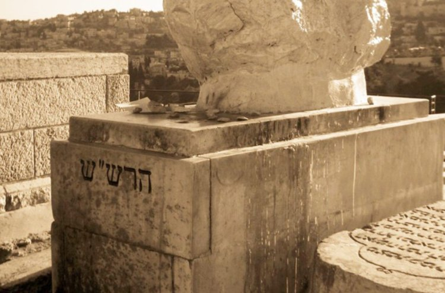
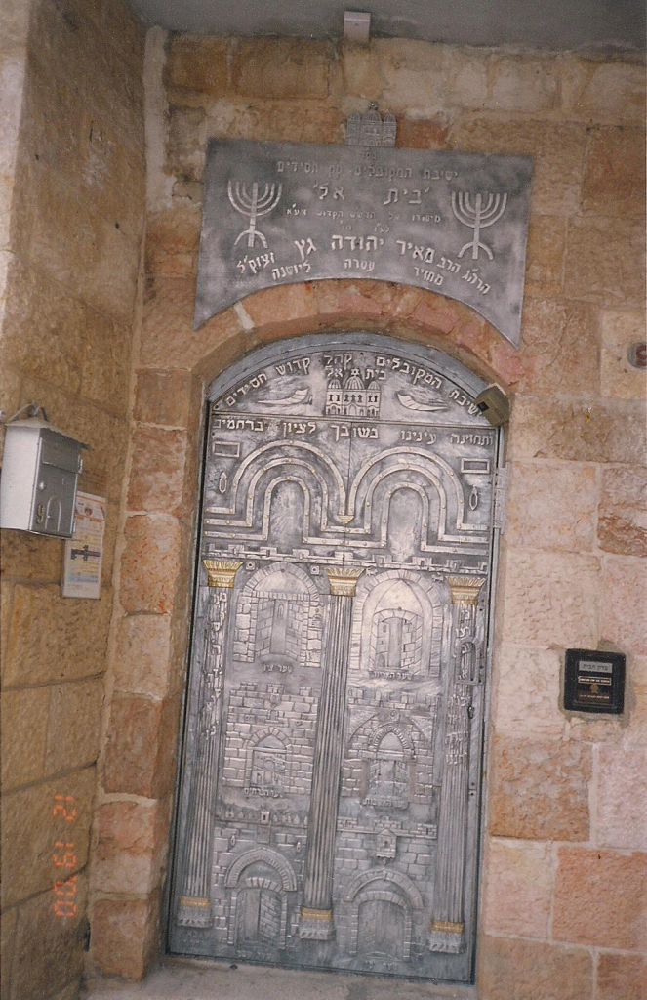

<u>השורה השניה – רבי שלום שרעבי</u>

מהפך.

מר' אברהם זכות, יהודי ספרדי, שכוחו רב במדע האסטרונומיה
של התקופה, מדען ורציונליסט גם בכתיבה ההיסטורית שלו, של "ספר יוחסין",
יהודי בכל רמ"ח אבריו שסובל קשות מרדיפות, אנחנו קופצים מאתיים וחמישים שנה
קדימה, לירושלים, לישיבת מקובלים קיצונית ביותר, שעוסקת בתיאולוגיה
אבסטרקטית, ולמנהיגה שמגיע מתימן.

רבי שלום מזרחי שרעבי, שבדרך כלל נקרא רק על שם עירו, שרעב
שבתימן, רבי שלום שרעבי, וכרגיל בראשי תיבות (הרש"ש), נולד ב 1720 בתימן,
ונפטר ב 1777 או 1782 בירושלים. במשך שנים היה ראש ישיבת "בית-אל"
בירושלים, שהייתה (עד היום) ישיבה של מקובלים, הלומדים, מלמדים, וחיים את
קבלת האר"י ומפרשיו. על ישיבה זו נרחיב מעט יותר. בקבלת האר"י ניגע, אך
קטונתי מלהתעמק בה. בנוסף עמד הרש"ש בראש חבורת רבנים, מחשובי רבני ירושלים
בתקופתו, שנקראה "חברת אהבת שלום", ובוודאי נזכיר אותה בהמשך.

אחת התופעות המאפיינות את חכמי הקבלה, שלא רק תורתם מלאת
מסתורין, אלא גם סיפור חייהם מורכב ממציאות ומאגדות שקשה ואולי בלתי ניתן
להפרידם.

<u>וכך מספר שלמה שבא על רבי שלום שרעבי, במאמרו "חכמי
בית-אל חותמים על כתב התקשרות" (נמצא בפרויקט בן יהודה).</u>

וכרגיל, מפני אריכות הדברים נקצר, והמעוניין יפנה
למקור.

יהודי שרעב שבצפון תימן, שמשם בא שלום שרעבי, מפרוסמים היו
בחריפותם ובחוכמתם. בגיל צעיר נמשך ללימודי הקבלה, אבל לאחר שאביו הרוכל
נפטר... אנוס היה לקחת את חבילת הרוכלים של אביו על גבו ולעבור בכפרי המחוז
ולמכור את מרכולתו כדי לפרנס את משפחתו הגדולה. וכשהיה משתכר קצת כסף שב
מיד לביתו ומסרו לידי אמו... וחזר לספריו...

נאה היה, פניו כפני מלאך, כך אמרו הבריות... ופעם בא לעיר
הבירה צנעא ועבר ברחוב וחבילתו על גבו וראתה אותו מחלון ביתה אישה עשירה
וחשקה בו, וקראה אליו שיעלה לביתה כיוון שרוצה היא לקנות סחורה... \[וכאן
בה סיפור המקביל לסיפור יוסף ואשת פוטיפר, ובו הוא נודר לעלות לארץ ישראל
אם יינצל\] ... וקפץ בעד החלון אל הרחוב ולא נפגע, וחזר וסיפר לאמו את כל
אשר קרה לו ואת הנדר אשר נדר.

והכינה לו אמו צידה לדרך, ונסע לעיר עדן ... ומשם הפליג
להודו, ומשם לבצרה שבעיראק ומשם לבגדד ומשם לדמשק \[במקורות אחרים מסופר
שהוא למד בישיבה בבגדד\].

.... ויצא לירשלים וכמסופר, התייצב לפני הרב גדליה חיון,
ראש ישיבת המקובלים, ולא גילה תורתו, והשכיר עצמו כשמש. והיה מעיר את חכמי
הישיבה בלילות והולך לפניהם למקווה הטוהרה ופנס בידו... ובבית המדרש היה
נותן לכל אחד את ספרו והוא יושב בפינה ושומע לדברי התורה ושותק...

ופעם דנו חכמי הישיבה בעניין חשוב אחד ולא ידעו פתרונו
והרב חיון היה מצטער. שלום שרעבי הבין... רשם את התשובה על גבי גיליון נייר
וכשכינס את ספרי הלומדים, הכניס את הגיליון לספרו של הרב חיון. ... פתח הרב
חיון את ספרו וקרא את הכתוב ונדהם... והשביע את החכמים להגיד לו מי כתב את
הדברים, ואיש לא ידע.

...וכך קרה כמה פעמים... ולא היה מתגלה הסוד, אלמלא בתו של
הרב חיון – חנה. ... ופעם השגיחה חנה, כי בשעה שכל החכמים יצאו מן הישיבה
הכניס השמש שלום שרעבי גיליון נייר לאביה...

\[וכמובן, שלו שרעבי "מתגלה", הופך לתלמיד הישיבה, חנה בת
הרב חיון ושלום שרעבי נישאים, כמצופה...\]

בשנת 1751 נפטר מייסד הישיבה, רבי גדליה חיון, ואז נתמנה
שלום שרעבי לראש ישיבת המקובלים בית-אל.

למרות שהסיפור עד כאן נראה כסיפור סינדרלה, מותאם לישיבת
מקובלים, והוא מזכיר גם סיפורי חסידים רבים של התגלות החכם או הצדיק הנסתר,
הרי העובדות הבסיסיות נכונות.

שלום שרעבי, מיסטיקן צמא דעת, נודד לבדו מתימן דרך בגדד
ודמשק לירושלים, נכנס לישיבה כשמש, אחר כך תלמיד, והופך לראש
הישיבה.

ועוד נכון, שבימיו גדלה ישיבת בית-אל, וכנראה הגיעה לשיאה.
יותר מכך, המסורת של ישיבת בית-אל מזוהה עם הרש"ש, ר' שלום שרעבי, וקיימת
עד היום.

רעיון הצדיק הנסתר נפוץ במסורת הספרותית. יש, כמובן, ל"ו
צדיקים נסתרים שבזכותם העולם קיים, והם אינם מתגלים. אבל נפוץ אולי יותר
המוטיב של הצדיק הנסתר שבשלב מסוים מתגלה, כמו במעשה או באגדה על רבי שלום
שרעבי (ולפניו, בפולין, הבעל שם טוב...).

הנה כך מתאר רבי נחמן מברסלב את רעיון הצדיק הנסתר, ורומז,
או יותר מרומז, על הנזק שגורמת הפוליטיקה לצדיק המתגלה... אבל הוא
מתגבר...

כִּי טוֹב מְאד מַעֲלַת הַצַּדִּיקִים
הַגְּנוּזִים, שֶׁהֵן יְכוֹלִין לְקַבֵּל שֶׁפַע וְרב טוֹבָה לְהַמְשִׁיךְ
לְהָעוֹלָם, \[כלומר, להזרים לעולם\] וְאֵינָם שׁוֹאֲלִים עֲלֵיהֶם וְאֵינָם מְקַטְרְגִים עֲלֵיהֶם,
מֵחֲמַת שֶׁהֵם גְּנוּזִים וְאֵינָם מְפֻרְסָמִים. אַךְ אֲפִלּוּ מִי שֶׁהוּא מְפֻרְסָם, כְּשֶׁיֵּשׁ עָלָיו מַחֲלקֶת,
הוּא תּועֶלֶת לָזֶה, כִּי הַמַּחֲלקֶת מְכַסָּה עָלָיו, וְעַל יְדֵי זֶה יָכוֹל לְהַמְשִׁיךְ שֶׁפַע
לְהָעוֹלָם, וְלא יִמְחוּ וִיקַטְרְגוּ עָלָיו... **(**ליקוטי
מוהר"ן קמא קיד)

ורבי שלום שרעבי התגלה והתגבר.

שלום שרעבי מזוהה עם ישיבת בית-אל למרות שהוא חי שישים שנה
בערך והישיבה שלוש מאות שנה.

<u>להלן כמה דברים על ישיבת המקובלים בית-אל.</u>

ישיבת המקובלים בית-אל, נוסדה בירושלים על ידי רבי גדליה
חיון, שעלה מטורקיה, בשנת 1737. בתחילה נקראה "מדרש חסידים". מראש נוסדה
כדי ללמוד את תורת הסוד, נתפרסמה בעולם, והגיעו אליה אנשים מארצות שונות.
למד בה גם אברהם גרשון מקיטוב, שהיה גיסו של הבעל שם טוב, וכאן היה תלמידו
של הרש"ש.

הישיבה התפרנסה, כמובן, מאיסוף כספים בחו"ל, ובאופן מיוחד,
חכמי ירושלים הרשו לישיבה לשלוח שד"רים משלהם (שליחי דרבנן להשגת התרומות).
בדרך כלל, היו שד"רים רק מטעם ההנהגה של הקהילה בירושלים (שהייתה אז ספרדית
בלבד, כי אשכנזים לא הורשו לגור בירושלים בגלל פרשת יהודה חסיד). הרשות
לאסוף כספים היא הודאה בחשיבות ומעמדה של הישיבה.

ישיבת בית-אל התקיימה עד מלחמת השחרור (מאתים שנה!), וגם
חודשה אחר כך בשכונה בירושלים, ולאחר מלחמת ששת הימים נפתח סניף שלה בעיר
העתיקה. בצורה שונה היא קיימת עד היום.

וכך מספר עגנון ב"לפנים מן החומה":

על בית תפילה אחד אשים דברי ועליו אספר משהו. לא גדולות
ונפלאות ממני אספר, רק מה שהראוני שם אספר. בית-אל שם בית הכנסת, של קהל
חסידים עדת **המכוונים** הוא. בעשירי באב קודם חצות היום...באתי לשם בפעם
הראשונה. בבית לא היה איש וכלי הבית מכוסים היו סדינים, שעמדו לסייד את
הבית לכבוד שבת הנחמה, שכיון שיצא [תשעה
באב](https://he.wikipedia.org/wiki/%D7%AA%D7%A9%D7%A2%D7%94_%D7%91%D7%90%D7%91) ולא
בא הגואל חזרו והכינו עצמם לו וכן את מקדשם.

עגנון משתמש במילה "מכוונים", המילה הזאת הודגשה, מה
משמעותה?

"הכוונות" הם חלק משמעותי מתורת הקבלה של האר"י וההולכים
בעקבותיו. "הכוונה" היא אמנם מושג כללי בתפילה, שמשמעותו, להימנע מקריאה
אוטומטית של משפטי התפילה, ולהשתדל להתכוון בלב, לכתוב ולנקרא.

אבל "כוונות" האר"י, הן מושג קבלי. המקובל, כשהוא מתפלל,
חושב במקביל על הנעשה בעולמות העליונים, ובעזרת כוונותיו מבצע "ייחודים",
כלומר, זיווגים, שם, ועל ידי כך משפיע שפע לעולם שלנו, או מקרב את
הגאולה.

הנה תשובה ברשת, באתר "דין, בית המדרש המרכזי לדיינות"
לשאלה בנושא "כוונות האר"י".

כוונות האר"י אינם פירוש למילים של התפילה, וזה לא בא
במקום הכוונה הפשוטה, זה משהו אחר לגמרי: בכל פעולה של מצוה, תפילה או ברכה
שאדם עושה הוא ממשיך שפע במקומים ופועל זיווגים וכו', שמות הקודש והניקודים
השונים וכו' המובאים בסידורי האר"י, הם השמות והרמזים של אותו סוג שפע
וזיווג, ומקומו וכו' בא"ק ואבי"ע \[אדם קדמון ואצילות, בריאה, יצירה
עשייה\] של אותה מצוה וברכה, ויש סדר ארוך של השתלשלות הכולל בכל שלב שלו
כ"ל צמ"א \[כלים לבושים צלמים מוחין אורות\], ותכלית הכוונה בעצם לחשוב
ולהבין את מהותו של אותו תיקון עליון הנמשך ממעשיו. לכן, מי שאינו מבין
היטב את הענין על כל פרטיו בלי שום סטיה, ומסתכל על השמות האלו כתרנגול
בבני אדם לא עשה דבר וחצי דבר… ורוב העושים כן אינם מבינים. לימוד קבלה הוא
עמוק מאוד ומצריך השקעה רבה של שנים ארוכות ונמסר ליחידי סגולה. רק אדם
שמילא כרסו שנים רבות בש"ס ופוסקים, ולמד בעיון וזכה להבנה מופשטת ויש לו
סדר בראש, והרבה מאוד יראת שמים \[יש הרבה תנאים שכתב מהרח"ו ללימוד הקבלה
בקדושה ובהנהגה וכו', כדי שחלילה לא יגשים ולא יטעה\] הוא הראוי ללימוד זה,
אם הוא מוכן להשקיע בזה הרבה מאוד זמן מאמץ ושינון.

דוגמא מסידור הרש"ש

קדיש דס"ג וע"ב

דאחרי אשרי ובא לציון

**יכוין** באומר שבח הקדוש הזה בלשון תרגום, להכניע הקלי'
ולברר מתוכם את י"א מיני קדושה שנשארו בהם מז"מ דזו"ן שהם ו"ה ולחברם
לאותיה י"ה שהם או"א.

לפרש את הכל איני יכול, אך משהו, גם אם לא אדייק.

ס"ג וע"ב הם שמות שונים ומורכבים של האל (כנראה, מספרי
האותיות של שם אלוהים!)

הקלי' קיצור של הקליפות, המושג שמתאר את הרע בעולם, שנוצר
"מהמפץ הגדול" של הבריאה, על פי קבלת האר"י, שבו נשברו הכלים שלא יכלו
להכיל את האור האלוהי, ושבריהם הם שורש הרע. הקליפות מכילות ניצוצות של
האור שאותם יש להציל.

ז"מ הם שבעה מלכים (איני יודע משמעותם), זו"ן הם זעיר
אנפין ונוקבא, והם ששת הספירות שמתחת שלושת העליונות, יחד עם השכינה, שהיא
הנוקבא (ספירת מלכות).

יחד הם ה ו"ה בשם המפורש יהוה, כאשר מחברים אותם עם י"ה
שהם או"א – אבא ואמא, והן הספירות העליונות בינה וחכמה....

אך מה שחשוב יותר לענייננו זו המילה יכוון, מלשון כוונה,
התכוונות, ריכוז החשיבה. כלומר, על כך יש לחשוב בזמן התפילה המסוימת
הזו.

אך מה שאנו לומדים מתשובת הרב הקודמת, שהרב מתייחס בכבוד
רב לקבלה הזו, אך מדגיש את האזוטריות שלה. רק ליחידי סגולה, גם מוכשרים,
וגם מתמידים. כנראה, שלא לנו הוא מתכוון.

לקבלה הקיצונית הזו יש גם פנים מעשיות. הנה פסיקה ממש של
הרש"ש שדנים בה היום, וכוללת תפיסה דמויית "דיבוק" חסידי:

הרב שלום אילוז:

**שאלה**

מתי אלמנה צריכה לעשות תיקון, ומהו תיקון אלמנה?

**תשובה**

תיקון האלמנה הוא תיקון שחיבר רבינו הרש"ש שעל ידי תיקון
זה תוכל האלמנה להנשא בשנית מבלי שרוח בעלה הראשון "תפריע" לזיווג החדש. אך
מטבע הדברים בדברים כאלה יש לשאול, בכל מקרה לגופו, רב מקובל.

ישיבת המקובלים "בית-אל" בראש העין (ישיבה שנקראת על שם
ישיבת בית-אל...):

**תיקון אלמנה**

דע כי האדם כשנושא אשה נותן בה חלק מנפשו. חלק זה נשאר
אצלה עד יום מותה. ויש בזה סודות עמוקים. וכאשר מתגרשים ע"י נתינת הגט,
יוצא ממנה אותו חלק הנפש של בעלה. אמנם באלמנה אינו יוצא ממנה אותו נפש
הבעל. ולכן כשמתחתנת עם בעל אחר אותו נפש של בעלה הראשון מתעורר ויכול
להזיק לבעל החדש. וכדי למנוע זה תיקן מו"ר הרש"ש זיע"א תיקון מיוחד ובו
מוציאים את נפש הבעל הקודם ומתקנים נשמתו, ואז יכולה להתחתן ללא
חשש.

התיקון נעשה ע"י מו"ר עם עשרה מקובלים מבית מדרשנו.

ויש גם בעיות גופניות ממש בתפילה עם כוונות כל כך
מורכבות.

**אתר TAVORI – קבלה פסיכולוגית
ויהדות**

איך מכוונים כוונות הרש"ש?

בעניין הארכת התיבות בעת הכוונה

ראוי ללמוד בספר הקדוש עטרת מרדכי לרב המקובל מרדכי עטיה
שליטא

מדף ש"ס עד שע"ו שהאריך והרחיב והביא כמה מקורות קחנו
משם.

ואנו נביא רק בקיצור נמרץ את עיקרי הדברים כפי שאנו נוהגים
ממה שראינו מהמקובלים המכוונים שבירושלים בדור זה וגם בדור שעבר....

לפי הזוהר הקדוש .....

משמע מהזוהר הנל שהכוונה צריכה להיות הזמן שמוציא הברת
התיבה מפיו.

.....

מאחר והרבנים המקובלים המכוונים בסידור כוונות הרש״ש זיע״א
מכוונים כוונות ארוכות מאוד, ולא כולם יכולים לגמור הכוונות בלי שיספיקו
באמצע התיבה לקחת עוד נשימה כדי לסיים הכוונות, בעודם מוציאים הבל המילה
מפיהם, כי צריך בשביל זה אורך נשימה גדול, פעמים שלמעלה מדקה וחצי ואף יותר
לתיבה אחת, כגון במילת "באהבה"

......

וזה כמעט בלתי אפשרי במציאות כלל לגמור כל הכוונות הנשימה
אחת

לכן מנהג מהמכוונים בירושלים שראיתי, וזכיתי להתפלל עמם,
הוא לא רק להאריך את התיבה מאוד אלא גם כאשר נגמר להם האויר, ונשאר עוד
הרבה כוונות לוקחים נשימה חדשה באמצע התיבה וממשיכים את הכוונות עד
גומרה.

אך לפי הפשטנים אין לעשות כן כלל ונקרא הפסק גמור וספק אם
יוצא ידי חובת הברכה...

אין בדברים הללו כדי ללגלג על התופעה. בכל הדתות (וגם
בבודהיזם) קיימות תופעות מיסטיות קיצוניות, הכוללות גם חקרנות תיאולוגית,
וגם מדיטציות מגוונות, מנטרות בעל פה ובלב, וכו'.

אם נחזור לישיבת המקובלים בית-אל, ולמורשתו של הרש"ש, הנה
מאמר מהתקופה האחרונה, המתייחס גם לניתוח של גרשום שלום לרש"ש.

<u>יניב מזומן: הגישה הקבלית של הרש"ש בהבנת כתבי האר"י
והפרשנות הקבלית בעקבות תורתו.</u>

<https://www.jstor.org/stable/26548079?read-ow=1&seq=25#page_scan_tab_contents>

...כתיבתו והגותו \[של הרש"ש\] עוסקות בקבלת האר"י, והוא
נחשב בעיני כמה קבוצות מקובלים משפיעות לגדול מפרשי כתבי האר"י, ויש בהם אף
שרואים בו גלגול שלו:

"....הנה מצינו לגדול בתורה וחסידות, המפורסם בקבלה, רב
שר-שלום שרעבי ז"ל, אשר אמרו עליו, כי הבטחה שהבטיח רבנו האריז"ל לתלמידיו,
כשהיה רטוב בתוך הטבילה כשהוליכוהו לקברו, שאמר להם: אם תזכו, אבוא אליהם
פעם אחרת, כי בא להם הרב הארי ז"ל בגילגול ברבנו שלום שרעבי זיע"א...
"(מתוך ספר של ר' חיים פלאג'י, וגם מספר של י"מ הלל). \[ר' חיים פלאג'י הוא
מגדולי רבני טורקיה במאה ה-19\]

תפיסה זו מעמידה את שיטתו של הרש"ש כשיטה הלגיטימית היחידה
בפרשנות תורת האר"י...

...מתאר גרשום שלום את התרשמותו אחרי ביקור בישיבת בית-אל
\[כמובן, במאה העשרים\]. הוא מציין, כי 'מה שנשאר מהקבלה בבית-אל היה משהו
הדומה ליוגה....גם הוא מציין את המקום המרכזי של קבלת הרש"ש: '...השיטה
היחידה בקבלה שיש לה במידה ידועה עוד חיים משלה היא זו קבלת ר' שלום שרעבי
ממקובלי תימן שחי בירושלים במאה הי"ח".

גרשום שלום רואה בתורתו גישה אשר מחזירה את הקבלה לתחום
האזוטרי (בעקבות נפילת השבתאות).

ועוד כותב גרשום שלום 'שקשה למצוא ולו חיבור אחד שאדם מן
החוץ עשוי להבינו'. 'ייתכן שמשום כך וגם מסיבות נוספות, כתבי הרש"ש, שיטתו
הקבלית ופיתוח הפרקטיקה של התפילה בכוונות נחקרו מעט מאוד'.

...

כתיבת הרש"ש היא כתיבה מקודדת ומוצפנת... תורת הרש"ש היא
גישה פרשנית המתרצת ומסבירה את הסתירות שעולות מתוך כתבי האר"י.

ולמרות הכל קמו ישיבות או בתי מדרש ברוח אזוטרית זו
וקיימות עד היום. אם כי צריך לקחת בחשבון שישיבה כזו מונה עשרות בודדות של
תלמידים, ולא מאות או אלפים כמו הישיבות הגדולות העוסקות ב"נגלה", כלומר,
גמרא וכו'.

**הנה למשל, בית מדרש ללימוד ותפילה בכוונות האר"י והרש"ש
זיע"א**

הישיבה הקדושה הוקמה עפ"י מסורת ישיבת בית-אל הקדומה
בישיבה **כמנין אברכים** הקמים לאחר חצות לילה ומעתירים בתפילות ויחודים
לאקמא שכינתא מעפרא ולאחר מכן עוסקים בתורת הסוד עד עלות השחר ומתפללים 3
תפילות בכוונות האר"י והרש"ש.

יותר משמעותית היא ישיבת "שער השמים". בין השאר, מפני
שספרדים ואשכנזים לא ממש פעלו יחד אפילו בירושלים של אז....

בשנת תרס"ו (1906), הוקמה בירושלים ישיבת "שער השמים",
ישיבת מקובלים **אשכנזית** ראשונה, וגם היא, לפחות בתחילתה הלכה בעקבות
שיטתו של הרש"ש. אחד ממיסדיה, הרב שמעון צבי הורוביץ, בוגר ישיבת וולוז'ין
שבפולין, הגיע לירושלים ב1887, ולמד בישיבת המקובלים בית-אל, מאה שנה אחרי
מותו של הרש"ש.

הרב קוק, שהיה מ 1904 רב יפו והמושבות, ואחרי כן הרב הראשי
הראשון עד מותו ב 1935 היה מאוהדי הישיבה הזו וכך כתב ביחס לאירוע לא
ידוע:

מצאתי לי לחובה קדושה להודיע לכבודכם, שלא ישימו לב כלל
לדברי הפלסתר שנכתבו ע"י איזה איש בלתי אחראי כלל נגד הישיבה הקדושה שער
השמים שהיא ישיבה מפוארה שהרבה ת"ח מצוינים בנגלה ובנסתר ובעבודה יושבים בה
בשקידת תוה"ק, והגבאים והמנהלים שלה הם ג"כ ת"ח מצוינים גדולי תורה ויראה,
נוסיף דרכו בקודש לחזק ולאמץ את הישיבה הקדושה הנ"ל ושכרו כפול מן
השמים.

מצאתי אתר שבו חרדים דנים על ההיסטוריה של הישיבה הזו, הם
מזכירים את הרב קוק, אך לא את הרש"ש...

ישיבה זו קיימת עד היום גם היא, ומה לומדים שם היום, מי
יידע.

לעומת זה, במאמר של יהונתן מאיר (מאוניברסיטת הנגב) שנכתב
באנגלית, ואני מתרגם:

הבה נתמקד בישיבת "שער השמים" ובפעולתה עד השואה. הישיבה
נוסדה ב 1906 על ידי קבוצת מקובלים שהשתייכו קודם לישיבת בית-אל (כמו מה
שקרה גם עם ישיבת "רחובות הנהר"). לדבר באופן מעשי, "שער השמים" המשיכה את
המסורת הירושלמית של לימוד הכתבים הלוריאנים \[של האר"י\] ותפילות עם
כוונות לפי השיטה של הרש"ש, שנחשב להיות גלגולו של האר"י. בכל זאת, נראה
שלישיבת "שער השמים" הייתה גישה מיוחדת משלה שהבדילה אותה מישיבות מקובלים
אחרות בזמנה.

ומעניינת לא פחות, ישיבה שנפתחה לפני עשר שנים בבני ברק,
ושמה "דברי שלום", ויש לה אתר ברשת... הנה משהו ממה שהאתר כותב
עליה.

בס"ד

ביהמד"ר וישיבת המקובלים

**דברי שלום**

נפתחו בחודש אלול שנת תשס"ג ע"י מו"ר הגה"צ רבי יחזקאל
בינג שליט"א.

לאחר שנים רבות שמו"ר שליט"א קנה את תורת הנסתר אצל מורו
ורבו הגה"צ רבי יחיאל פישל אייזנבאך זצוק"ל **ר"י שער השמים**, נתבקש מו"ר
על ידי רבו **להעתיק את דרך הלימוד וסגנון הישיבה הק' מירושלים לעיר בני
ברק ולהקים גם בה פינת יקרת ואבן שואבת בדמות ביהמד"ר לתפילות ולימודי תורת
הנסתר, בהם ישולב תורת רבותינו האר"י והרש"ש בד בבד עם עבודת ה' בדרך
הבעש"ט הק' ותלמידיו זיע"א.**

בקיטון צר ברחוב חזון איש בבני ברק נפתחה הישיבה, ובו
הצטופפו **כ' 20 אברכים בני עליה** מכל גווני הקשת מסלתה ושמנה של העיר בני
ברק והגו בהתמדה רבה בתורת הנסתר ושתו בצמא ובשקיקה את השיעורים היום
יומיים שנאמרו בבהירות רבה ע"י מו"ר ראש הישיבה שליט"א וכ"ז בתנאים שלא
יאמנו.

במשך הזמן החלו לערוך במקום גם תפילות יום יום **בכוונות
הרש"ש בד בבד עם הנוסח החסידי הלוהט** שסחפו אחריהם רבים מתושבי
האזור.

והנה מזרח ומערב נפגשו, ואולי יבוא לציון גואל.

*קבר הרש"ש בהר הזיתים.*

נחזור לאישיותו של ר' שלום שרעבי, כאמור, ביוגרפיה מהולה
באגדות, אך ניתן להוציא מתוכה את דמותו.

מתוך אתר MYTZADIK

לאחר פטירת ר' גדליה חיון בה' אב ה'תק"י, מונה בהתאם
לצוואת חותנו לראש ישיבת "בית-אל". ידע בעל פה את הספר "עץ חיים" והיה בקי
בהקדמותיו, גדולי דורו מחכמי ורבני הספרדים והאשכנזים נהרו ללמוד עמו את
תורת הנסתר ומכל קצוות תבל נשלחו אליו שאלות בכל מקצועות התורה.

עמד בראש קבוצת "חברת אהבת שלום" שלמדה עמו את תורת הנסתר
ובחודש תמוז ה'תקי"א חתמו על "שטר התקשרות" המכיל תקנות בלימוד התורה
ובעבודת השם, המחייב את כל חברי הקבוצה.

הקפיד ללמוד את תורת האר"י רק מתוך ספריו של ר' חיים
ויטאל, והביע התנגדות לספרי קבלה שחוברו אחרי המקובל ר' חיים ויטאל.

כל לילה לאחר אמירת "תיקון חצות" היה מייחד ייחודים וברוב
חכמתו ידע לערוך את "כוונות" האר"י כסדרן, שימש כחזן בתפילת שחרית, מנחה
וערבית. כתב תפילה "לחצות הלילה" ותפילה "לאמרה בעת צרה". חיבר סידור תפילה
עם "כוונות" לכל מילה וכן לכל פרט במעשה המצוות. כתב "כוונה" של שמות קודש
להמשכת השפע.

תלמידי ישיבת "בית א-ל" העתיקו את ה"סידור הארוך" הכולל
"כוונות" לפרטיהן בכתב יד ואילו את ה"סידור הקצר" הידוע כ"סידור הרש"ש" עם
הכוונות בקצרה הביאו לדפוס.

התפרסם כפועל ישועות וקיבל את כל הפונים אליו בבקשת עצה
וברכה בסבר פנים יפות. ניכר בענוותנותו ואהבתו לכל יהודי, סייע לנזקקים
ופעל לביטול "מס הקבורה" שהטיל המושל הטורקי על יהודי ירושלים.

בכ"ד ניסן ה'תקל"א נפטרה זוגתו ועל פי תקנת רבני ירושלים
האוסרת על רווקים מגיל 20 ומעלה להתגורר בירושלים ללא אשה, מיהר לשאת לאשה
את המשרתת בביתו שזכתה לראות אותו לומד עם אליהו הנביא, אולם כעבור שנים
אחדות אף היא נפטרה ונטמנה בהר הזיתים \[בסמוך למקום קבורת הרש"ש\].

בסיום עריכת ליל הסדר של פסח שנת ה'תקל"ו / ה'תקמ"א נתנמנם
וערך 'עליית נשמה', כאשר הקיץ, הודיע שהגיע זמנו להפטר מהעולם.

טרם פטירתו בשנת ה'תקל"ז / ה'תקמ"ב התעטף בטלית ותפילין,
ערך כוונות וייחודים ומסר לתלמידיו את סדר טהרתו וקבורתו, הבטיח שהמתפללים
בלב תמים על קברו לכל ישועה נדרשת תפילתם לא תשוב ריקם והשיב את נשמתו
ליוצרה.

מאוד מזכיר אדמו"רים חסידיים כמו ר' נחמן...

"כתב ההתקשרות" שחתמו עליו מקובלי בית-אל, אמנם מצוי,
ולהלן פרטים.

תלמידי ישיבת בית-אל, בראשות ר' שלום שרעבי חתמו על כתב
התקשרות לאגודה, שהם קראו לה "אהבת שלום"

רוח קודש לבשה אותנו צעירי הצאן, להיות כאיש אחד חברים.
והכול לשם ייחוד קודשא ברוך הוא, לעשות נחת רוח ליוצרנו, ועל דבר זה נכרת
ברית בינותינו.

... ראשון הוא שכולנו **שנים־עשר**, כמספר שבטי יה, נהיה
אוהבים כולנו זה לזה אהבה רבה אהבת נפש ואהבת הגוף, והכול לעשות נחת רוח
ליוצרנו, בדביקו דרוחא חדא אך בחלקות לעניין הגשם בלבד \[באופן חלקי
לענינים החומריים\]. ונהיה כולנו כנפש אחת רבת תפארת, וכל אחד יעלה על חברו
כאילו הוא חלק אבר ממנו ממש בכל נפש ובכל מאוד, באופן שאם יהיה צער לאחד
ממנו, לסייעו כולנו יחד או כל אחד בפרטות ככל הבא לידו.

עוד נתרצינו ונאותנו ונתחייבנו שלא לשבח איש אחד ממנו את
חברו, ואפילו שהוא גדול ממנו בחוכמה ובמניין ושלא לקום איש ממנו לחברו,
ושנתנהג כאילו כולנו איש אחד.”

ועוד: “נתחייבנו שלא להקפיד איש על חברו כלל ועיקר, ואם
יחטא איש לאיש ימחול לו מיד בכל לב ובכל נפש.”

והחליטו: “נתחייבנו שלא לגלות הדבר הזה שנתחברנו ונתייחדנו
לשום נברא שבעולם.”

וצריך לשים לב לרוח המסמך.

המקובלים אינם נזירים, הם בעלי משפחה. ואין כאן שותפות
חומרית כלשהי, אלא שותפות רוחנית, במובן של מניעת תחרות על כבוד, ומניעת
קנאה ועלבונות.

ונסיים בחלקים מתפילה שחיבר הרש"ש, שמלאה בקבלת האר"י,
והיא מומלצת כל לילה, אחרי תיקון חצות.

יהִי רָצוֹן מִלְּפָנֶיךָ ה' אֱלֹקֵינוּ וֶאֱלֹקֵי אֲבוֹתֵינוּ, שֶׁיִּהְיֶה עַתָּה עֵת
רָצוֹן וְיִמָּשֵׁךְ מִן הַאֵין סוֹף בָּרוּךְ הוּא מִמְּקוֹר הַחַיִּים הָעֶלְיוֹנִים שֶׁפַע בְּרָכָה עֶלְיוֹנָה
וּקְדֻשָּׁה עֶלְיוֹנָה לְחָכְמָה דְּמַחֲשָׁבָה עֶלְיוֹנָה \[כלומר, ספירת חכמה\]. וְתִפְתַּח מְקוֹר אוֹתָהּ
הַחָכְמָה דְּמַחֲשָׁבָה עֶלְיוֹנָה לְהַשְׁפִּיעַ קְדֻשָּׁה עֶלְיוֹנָה וּבְרָכָה רַבָּה לְשָׁרְשֵׁי מְקוֹרוֹת הָעֶלְיוֹנִים
שֶׁל שָׁרְשֵׁי הַחֲסָדִים הָעֶלְיוֹנִים וְהָרַחֲמִים הַגְּדוֹלִים. וְתִפְתַּח הָאוֹצָר הַטּוֹב הָעֶלְיוֹן הַשָּׁמַיִם
הָעֶלְיוֹנִים. וְתַשְׁפִּיעַ חֲסָדִים הָעֶלְיוֹנִים וְרַחֲמִים גְּדוֹלִים לְכָל הַפַּרְצוּפִים הָעֶלְיוֹנִים
(דעתי"ו. וא"א ונוק'. ואו"א. וישסו"ת. וזו"ן. ויעקו"ר) דְּכָל הָעוֹלָמוֹת הַקְּדוֹשִׁים
\[מושגים מקבלת האר"י שלא למדתי\], וּלְשָׁרְשֵׁי **נֶפֶשׁ** **רוּחַ נְשָׁמָה חַיָּה יְחִידָה**
שֶׁלָּנוּ \[לפי המסורת, חמש דרגות לנשמה\]. וְתַשְׁפִּיעַ חֲסָדִים עֶלְיוֹנִים וְרַחֲמִים גְּדוֹלִים
לִירוּשָׁלַיִם הָעֶלְיוֹנָה וּלְבֵית הַמִּקְדָּשׁ הָעֶלְיוֹן וְתִפְתַּח חֲלוֹנֶיהָ וּשְׁעָרֶיהָ שֶׁל יְרוּשָׁלַיִם
הָעֶלְיוֹנָה וְשֶׁל בֵּית הַמִּקְדָּשׁ הָעֶלְיוֹן, וְתִשְׁמַע וּתְקַבֵּל בְּרַחֲמִים וּבְרָצוֹן אֶת תְּפִלָּתֵנוּ (עַל
יְדֵי שמועאל שֶׁהוּא בְּכֶתֶר דְּחָכְמָה דִּיצִירָה שֶׁמְּקוֹרוֹ הוּא אהוה).

וְתַשְׁפִּיעַ חֲסָדִים עֶלְיוֹנִים וְרַחֲמִים גְּדוֹלִים לַשְּׁכִינָה לָתֵת לָהּ כֹּחַ גָּדוֹל
לָצֵאת מִתּוֹךְ הַקְּלִפָּה וְלִפְשׁוֹט מֵעָלֶיהָ הַבְּגָדִים הַצּוֹאִים. וְתַלְבִּישׁ אוֹתָהּ פוֹרְפִרָה עִלָּאָה
קַדִּישָׁא, וְתֵן לָהּ כֹּחַ גָּדוֹל לָצֵאת עִמָּהּ כָּל נִיצוֹצֵי הַקְּדֻשָּׁה שֶׁנִּשְׁאֲרוּ בַּקְּלִפּוֹת.
.......

*שער הישיבה היום*

ובתפילה זו נסיים, ואם לא בתפילה זו אז כל אחד יתפלל
בדרכו.
