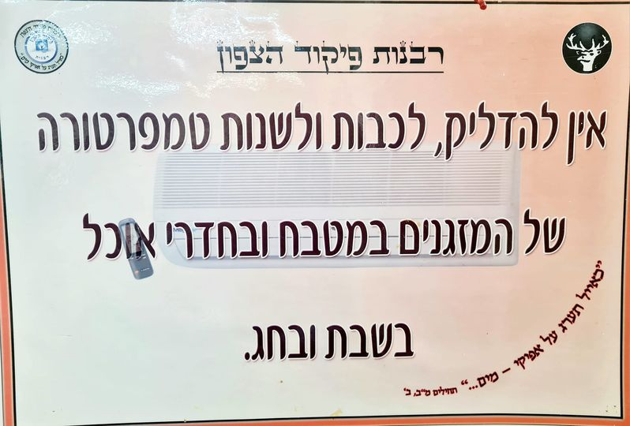
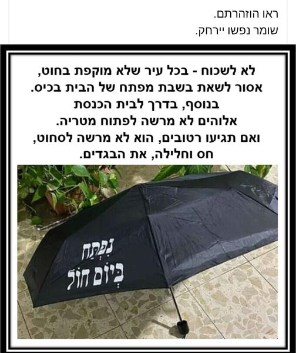
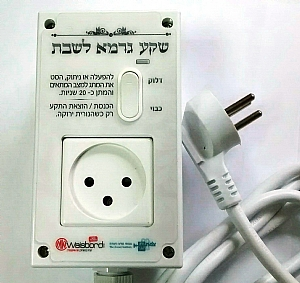

<u>התפתחות בהלכה – הערמה</u>

למילה "הערמה", שמקורה ב"עורמה", יש, בדרך כלל, משמעות
שלילית, של "מירמה", "התחכמות כדי להרע" וכד'. אך דווקא בהלכה יש לה משמעות
טכנית. כלומר יש הערמה מותרת ונכונה, ויש הערמה שלילית ואסורה. וזאת למרות
שהערמה, כמשמעותה הרגילה, היא דרך של עקיפת המצוות, דרך של הפיכהת האסור
למותר, של התגברות על החובה.

אנחנו מכירים יפה את נושא ההערמה גם בעולם החילוני
היומיומי, כאשר אנחנו מתגברים על החוק, בצורה חוקית. התופעה נפוצה ביותר
בנושא מיסים.

החוקים והתקנות של המס המוטל על כל תושב במדינה, ובעיקר על
בעלי עסקים, הם מסובכים ביותר, ולכן יש שיטות שונות של הגדרות שונות, או
העברות כספים מחשבון לחשבון, כדי להקטין תשלום מס. בפעולות חוקיות כאלה
נעזרים אפילו ב"יועצי מס", שתפקידם הוא, למעשה, ניצול הפרצות בחוק, כדי
לבצע "הערמה" לטובת לקוחותיהם.

מובן, שיש גם פעילות לא חוקית של הערמה, כגון הלבנת כספים,
העלמת הכנסות, עבודה "בשחור" ועוד.

מדוע מצוות שנחקקו על ידי חז"ל, והפוסקים אחריהם, זקוקות,
או מאפשרות הערמה?

נושא זה מתקשר לנושא מהשבוע שעבר, טעמי המצוות.

אם היינו מסכימים שלכל מצווה יש טעם, היה כמובן ויכוח על
הטעמים, אבל לאחר הסכמה (או כפייה) לא היה כל היגיון בהערמה.

אבל ראינו שרוב רובם של החכמים, גם אם אינם מתנגדים לחקירת
טעמי המצוות, הם מתנגדים לחלוטין להסתמכות על טעמי המצוות. מבחינתם המצוות
הן "גזירת מלך", כלומר, עליך למלא אותן בין שאתה מבין אותן ובין שאינך מבין
אותן, כי האל שחקק אותן (כביכול) חכם מכולנו.

דווקא שלילת ההסתמכות על טעמי המצוות, מאפשרת את ההערמה
"החוקית", מפני שהמצוות הן "הוראות טכניות", ואם אתה מוצא דרך לעקוף אותן
מבלי לשלול אותן, מותר.

העומס של מצוות חז"ל היה גדול ואפילו בלתי ניתן לביצוע,
ולכן, ייתכן, שהנצרות הצליחה להתפשט בזכות פריקת עול המצוות שכפו חז"ל. הנה
קטע מהברית החדשה:

<u>האיגרת אל הגלטים ג, 28-23</u>

ולפני בוא האמונה שמורים וסגורים היינו תחת התורה אלי
האמונה העתידה להיגלות. ובכן התורה הייתה אומנת אותנו למשיח למען נצדק
באמונה. אבל עתה אחרי אשר באה האמונה איננו עוד תחת יד האומן. כי אתם כולכם
בני אלוהים על ידי האמונה במשיח ישוע.

לעומת זה בהלכה אנחנו רואים, פרצות, הערמה וכנגד הערמה,
סוגרים פרצות...

הנה, למשל, שתי מודעות שהופיעו בפייסבוק. האחת מטעם רבנות,
השנייה כנראה סאטירה, אבל גם היא כוללת עובדות נכונות.

למה אסור לשנות טמפרטורה של מזגן? מפני ששינוי טמפרטורה
מפעילה אותו, והיא יכולה להיות גם דרך לעקוף את איסור הדלקתו.

למשל, בקיץ, תשאיר אותו דלוק, אך מכוון ל 40 מעלות,
וכשתרצה שיפעל, תשנה את הטמפרטורה ל 20 מעלות.... לא. זה אסור.

סגרנו את הפרצה, אבל אל דאגה, הטכנולוגיה של המאה העשרים,
תתגבר שוב בהערמה חדשה.

ובמודעה זו, שהיא, כנראה לגלוג, הכל נכון.

חוקי השבת, כבר מהמשנה, אוסרים להוציא חפץ מרשות היחיד
לרשות הרבים. מצב בלתי אפשרי זה, הביא להערמה כבר במשנה עצמה,
העירוב.

ואכן, נזכיר בקיצור, כמה מההערמות שהזכרנו בעבר, והם כאלה
שהציעו כבר חז"ל כדי להתגבר על החוקים הכתובים בתורה או שהם בעצמם
חוקקו.

הראשון והמפורסם מאוד הוא הפרוזבול, שלפי המסורת חקק אותו
הילל, במאה הראשונה לספירה עוד לפני החורבן, כדי להתגבר על חוק שמיטת
החובות כל שבע שנים, הכתוב בתורה.

ההערמה כאן, הייתה, להחליף את המלווה (שאסור לו לגבות את
החוב) בבית הדין, שלפחות לא נאמר שאסור לו לגבות חובות... והוא כמובן מחזיר
את הכסף למלווה. כלומר, ההערמה כאן היא שקופה לחלוטין, ביטול חוק חברתי שלא
ניתן היה לבצעו כבר בימים ההם, על ידי טופס נייר בלבד.

חוק דומה, שהמטריה לעיל מדגימה אותו, הוא חוק שחז"ל חוקקו
בעצמם, והוא איסור להוציא חפץ שאינו לבוש שאתה לבוש בו, מרשות היחיד לרשות
הרבים.

ההערמה כאן היא "העירוב". הקפת כל היישוב, או השכונה, או
קבוצת בתים, ב"חומה" שיכולה להיות חוט בלבד, ועל ידי כך כל התחום הזה הופך
לרשות היחיד, ובו מותר לטלטל חפץ.

אם אנחנו מתלבטים לפעמים, במה עסוקה הרבנות העירונית...
בין השאר בדאגה לעירוב ובבדיקתו כל ערב שבת.

והנה עוד הערמה ישנה, אך בויכוח.

בשבת אסור להדליק אש, ואפילו להעביר אש ממקור למקום
אחר.

ביום טוב (חג, כמו ראש השנה, ראשון ואחרון בסוכות ופסח)
מותר.

בשניהם מותר לבשל אבל רק לאותו היום.

קורה שיום טוב חל ביום ששי. כיצד מבשלים לשבת?

להערמה הזאת יש שם "עירוב תבשילין".

<u>תלמוד בבלי מסכת ביצה דף יז/ב</u>

מבשל הוא ליום טוב ואם הותיר הותיר לשבת. ובלבד שלא יערים
ואם הערים אסור....

מותר או אסור? כאילו במקרה מותר, ובכוונה אסור... רש"י
מסביר... וגם הוא מתפתל.

<u>רש"י על ביצה דף יז/ב</u>

שלא יערים - לאחר שבישל לצורך, לומר עוד אני צריך להזמין
אורחים, ויבשל תבשילין אחרים, ויותירם לשבת. אבל בקדרה אחת, אם ירבה לשבת
הא אמר דאפילו לחול שרי. כדלעיל ממלאה אשה קדרה בשר, ואף על פי שאינה צריכה
אלא לחתיכה אחת:

להערמה צריך תירוצים אבל תמיד אפשר למצוא.

הנה יעקב בן אשר בעל הטורים

<u>טור או"ח סימן תקג</u>

אסור לבשל בי"ט אלא כדי צורך היום, אבל מי"ט לחבירו או
מי"ט לשבת אסור. \[המצווה הידועה\]

אבל \[וכאן באה ההערמה\] ממלאה אשה הקדירה מבשר, אע"פ
שאינה צריכה אלא לחתיכה אחת, מפני שהתבשיל מיתקן יותר כשיש הרבה בקדירה
\[התירוץ ולא הסיבה\].

וי"א דאפילו אמרה בפירוש שהיא רוצה אותו לצורך מחר שהוא
מותר. ויש אוסרין. ונראה שהוא מותר, **כיון דטעם ההיתר, מפני שהתוספת גורם
טעם בתבשיל**. \[מותר, כי יש תירוץ, ואפילו אם התירוץ הוא לא
הסיבה\]

יש דברים שממש אין להם פתרון, כמו הפלגה בים, שנמשכת ימים
רבים. אמנם מפעילי הספינה הם גויים ובכל זאת:

<u>תלמוד בבלי מסכת שבת דף יט/א</u>

תנו רבנן אין מפליגין בספינה פחות משלשה ימים קודם לשבת
במה דברים אמורים לדבר הרשות אבל לדבר מצוה שפיר דמי **ופוסק עמו על מנת
לשבות ואינו שובת**, דברי רבי. רבן שמעון בן גמליאל אומר אינו צריך. ומצור
לצידן אפילו בערב שבת מותר:

כלומר, מסכים עם הקברניט שהספינה תעגון בשבת, אבל הוא לא
עושה כן. ורבן גמליאל מוותר על הטקס הזה.

והשולחן ערוך מקל אפילו יותר, בהתאם לצרכים
שמתהווים:

<u>שו"ע או"ח סימן רמח</u>

(א) מותר להפליג בספינה אפי' בערב שבת, אם הולך לדבר מצוה;
ופוסק עמו שישבות, ואם אח"כ לא ישבות אין בכך כלום; אבל לדבר הרשות אין
מפליגין בספינה פחות מג' ימים קודם השבת:

הגה - אבל קודם שלשה ימים שרי, אפי' בספינה שמושכים אותה
ע"י בהמות, ואפילו אין בגובה המים י' טפחים (מהרי"ק שורש מ"ה) ואפילו במקום
שיצטרך הישראל לעשות אחר כך מלאכה בשבת להוליך הספינה (ריב"ש סימן
קנ"ב).

\[האסמכתות מגיעות מחכמים רבים העוסקים בנושא, ומסבירים
ב"פיקוח נפש" ועוד...\].

ויש דברים חשובים אפילו יותר מהבשר בשבת והמסע
בספינה.

למשל, כמו היום, איך לא לשלם מיסים.

התבואה חייבת במעשרות. יש הערמה.

<u>תלמוד בבלי מסכת בבא מציעא דף פז/ב</u>

אמר רבי ינאי אין הטבל מתחייב במעשר עד שיראה פני הבית,
שנאמר "בערתי הקדש מן הבית".

זה לא לגמרי מובן, וההמשך בארמית, אבל זה יובן יותר דווקא
מתלונתו של רבה בר בר חנה על ירידת הדורות...

<u>תלמוד בבלי גיטין פא ע"א</u>

אמר רבה בר בר חנה, אמר רבי יוחנן משום רבי יהודה בר
אילעאי: בוא וראה, שלא כדורות הראשונים דורות האחרונים. דורות הראשונים
מכניסין פירותיהן דרך טרקסמון \[=השער הראשי\] כדי לחייבן במעשר. דורות
האחרונים מכניסין פירותיהן דרך גגות ודרך קרפיפות כדי לפוטרן מן
המעשר.

כלומר, פירשו חכמים שאת המעשר צריך להפריש כאשר התבואה
נכנסת לבית דרך השער. הערימו והכניסו אותה דרך הגג...

אבל אפילו רבה בר בר חנה, ואלו שהוא מצטט, לא אומרים
שההערמה אינה חוקית. סתם לא יפה...

ממש כמונו, שמסתכלים בביקורת על בעל העסק שרושם את קניית
הכורסה לבית (שהוא רשם אותו כמשרד) כהוצאה מוכרת לצרכי מס, אבל יודעים
שיועץ המס שלו הציע לו להערים כך.

ועדיין כל אלה הם הערמות קטנות.

הערמה גדולה שמשרתת את הכלכלה שלנו עד היום, היא "היתר
עיסקא".

התורה אוסרת לקיחת ריבית. לכן, במשך דורות רבים, הלוו
יהודים לגויים, שמהם מותר לקחת ריבית. אבל הצרכים הכלכליים
מתגברים...

לשם כך נקבע כבר בתלמוד "היתר עיסקא".

הרעיון של ההיתר הזה הוא מסובך, ולא תמיד עובד, אך אחרי כל
השיפורים שחלו בו במשך השנים הוא קרוב מאוד להיתר לקחת ריבית. הבנקים
בישראל משתמשים בו, ולעתים רחוקות בעיות מגיעות לבתי משפט, למרות שלא הכל
סגור.

הרעיון בנוי על כך שמחצית מההלוואה היא פיקדון, וצריך
להחזירה ותו לא.

החצי השני הוא שותפות בין המלווה ללווה, והרווחים מתחלקים
ביניהם וזו הריבית.

ומה אם מפסיד הלווה? אז יש כל מיני שיטות להתחייבותו מראש
על הרווחים, וקשיים גדולים על הוכחה שלו שהוא הפסיד...

יחד עם זה, אנשי דת טוענים לא פעם, שיש היגיון בשיטה
היסודית של "היתר עיסקא", כדי שהלוואות יינתנו רק כאשר הבנק עצמו בטוח
ברווחיות ההשקעות, ולכן נוטל סיכון.

בשביל שני חוקים מהתורה, שאי אפשר לעמוד בהם, יש צורך
בגוי.

"היתר מכירה" של אדמות ישראל בשנת שמיטה כדי לבטל, למעשה,
את חוקי השמיטה.

וביעור החמץ בפסח. לכאורה צריך לבער את החמץ לא רק מהבית,
אלא כל חמץ שברשותך. לכן, מוכרים את כל חמץ המדינה לגוי, ואפילו את המחסנים
בהם הוא מאוכסן...

"בקטנה" היתר מכירה לחמץ מופיע כבר בתוספתא, במאה
השלישית.

<u>תוספתא מסכת פסחים פרק ב</u>

ישראל ונכרי שהיו באין בספינה וחמץ ביד ישראל, ה"ז מוכרו
לנכרי ונותנו במתנה, וחוזר ולוקח ממנו \[לאחר\] הפסח ובלבד שיתנו לו במתנה
גמורה:

(ז) רשאי ישראל שיאמר לנכרי עד שאתה לוקח במנה \[קח במאתים
שמא אצטרך ואבא\] ואקח ממך אחר הפסח:

בתקופה המודרנית, כאשר יהודים היו בעלי עסקים שכללו מחסנים
ומבנים רבים שאין אפשרות לבער בהם חמץ, הייתה שיטת ה"ישראל ונכרי בספינה"
הכרחית. ולכן, למרות התנגדות של רבנים רבים (כולל הגאון מוילנה), התרחבה
מכירת החמץ.

בפסח תשס"ו, נמכרו לגוי בנוסף לכל חמץ המדינה, גם מאות
כלבים של צה"ל, שהתברר שמזונם מכיל חמץ.

אם הבנתי נכון, בפסח הקרוב, כבר תוכלו למכור את החמץ שלכם
דרך האינטרנט.

הטכנולוגיה יצרה אפשויות הערמה חדשות.

אולי המפורסם בהם הוא שעון השבת.

בזמנו סיפרתי את הבדיחה של ג'קי לוי, על כיבוי האור על ידי
חתול ושאריות הדג.

שעון שבת מאפשר לוותר על החתול... מכוונים מראש את השעות
שהאור או המכשיר יפעל.

במאה העשרים, הוקם במדינת ישראל מפעל שעיסוקו בהערמות
באמצעות הטכנולוגיה.

המפעל נקרא בשם צֹמת, ראשי תיבות "צוותי מדע ותורה". הוא
נוסד על ידי הרב ישראל רוזן, בשנת 1976, וממוקם באלון שבות. הרב המייסד
נפטר ב 2017.

<https://www.zomet.org.il/?CategoryID=209>

מצד אחד "צמת" מפתחת עשרות מוצרים מתוחכמים כדי לבצע
"הערמה" על המצוות של היהדות האורתודוקסית, ומצד שני, מנקודת מבט חילונית,
היא מוכיחה עד כמה המצוות הללו אבסורדיות.

המפעל עוסק גם בייעוץ ובפיקוח.

הנה כמה דוגמאות. אך תחילה פירוש המושג "גרמא".

כבר במשנה (שבא נקבעו תקנות השבת, ובין השאר איסור לכבות
דלקה) דנים בשאלה אם מותר לכבות דלקה **בצורה עקיפה**, על ידי גורם
מתווך.

<u>משנה מסכת שבת פרק טז</u>

(ה) רַבִּי שִׁמְעוֹן בֶּן נַנָּס אוֹמֵר, פּוֹרְסִין עוֹר שֶׁל גְּדִי עַל גַּבֵּי שִׁדָּה
תֵּבָה וּמִגְדָּל שֶׁאָחַז בָּהֶן אֶת הָאוּר, מִפְּנֵי שֶׁהוּא מְחָרֵךְ. וְעוֹשִׂין מְחִצָּה בְּכָל הַכֵּלִים, בֵּין
מְלֵאִים בֵּין רֵיקָנִים, בִּשְׁבִיל שֶׁלֹּא תַעֲבֹר הַדְּלֵקָה. רַבִּי יוֹסֵי אוֹסֵר בִּכְלֵי חֶרֶשׂ חֲדָשִׁים
מְלֵאִין מַיִם, לְפִי שֶׁאֵין יְכוֹלִין לְקַבֵּל אֶת הָאוּר וְהֵן מִתְבַּקְּעִין וּמְכַבִּין אֶת
הַדְּלֵקָה:

מסכימים שמותר לתחום את הדלקה. אבל הרעיון להניח מסביבה
כדי חרס (שטרם נשרפו באש) מלאים מים, כדי שיתבקעו מהחום והמים יכבו את האש,
הוא רעיון "גרמא". ובמשנה זו, רבי יוסי מתנגד (כלומר, רואה גם בכך חילול
שבת).

ואמנם שיטות הגרמא זוכות לדיונים רבים במשך הדורות. היום
מקובל, שלפחות בנושאים שגורמים לסבל (על פיקוח נפש אין ויכוח), מותר להשתמש
בשיטות גרמא להקלה.

והנה פיתוח של "צמת" לשקע, שניתן לחבר אליו כל מכשיר חשמלי
וכך להפעילו.

**שקע גרמא**

כיום קיים ציוד מגוון - ביתי ומוסדי - המסייע לחולים,
לתשושים, ולסתם בעלי מיחוש להתגבר על מצוקתם. הטכנולוגיה המודרנית מקדישה
מאמצים לפיתוח עזרים שונים להקל על אנשים אלו במצוקותיהם.

 מרבית הציוד הינו מופעל בחשמל ולעתים רבות קיימת בעיית
השימוש בשבת, כאשר לא מדובר ב[חולה שיש בו
סכנה](https://www.zomet.org.il/?CategoryID=199&ArticleID=71&Page=), או
אפילו ספק סכנה. למשל, מכשיר אדים רפואי לילדים , מכשיר אינהלציה, מכשיר
להקלת נשימה, מזרן מתנפח לפצעי לחץ ועוד.

כמו כן מיכשור מוסדי, בבית אבות או בבית חולים, לעתים רבות
הינו נייד ולא ניתן להתקין לו במקור סידור שבת. למשל, משאבת מינון
לאינפוזיה אשר החולה יכול לטלטלה עמו על גבי עמוד, ולא להיות צמוד למיטתו.
ומכשירים רבים נוספים. ומה עושים בשבת? איך מנתקים את המכשיר מן השקע
שבקיר? (המשאבה מצוידת בסוללה נטענת, **אך פעולת הניתוק והחיבור אסורה
בשבת**).

**גם בענף הביטחון **קיימת אותה בעייה. ישנם מכשירים רבים,
כמו מכשירי קשר נפוצים, ביפרים וכד', הזקוקים להחלפת הסוללות או לטעינתן,
לעתים מזומנות. כיצד ניתן להמעיט בחילול השבת הנגרם מאחזקת ביטחון
השוטף?

כדי לפתור את בעיית השימוש במכשיכים כאלו בשבת, מכון
'צומת' פיתח שקע חשמלי הפועל בשיטת ה 'גרמא'. שקע
זה מתאם בין רשת החשמל הרגילה לבין המכשיר שאותו רוצים להפעיל, והופך אותו
למכשיר שמותר להשתמש בו בשבת לצרכים חיוניים.

שקע הגרמא מחובר למתח חשמלי מערב שבת. מנגנון פנימי בודק
את מצב המתג מדי כ-15 שניות, במשך אלפית השניה. 

 כאשר מחברים את
המכשיר המיועד להפעלה לשקע ומסיטים את המתג למצב 'הפעל' - דבר לא מתרחש. רק
בהגיע מועד הבדיקה המחזורית הקבועה - המתח יתחבר. לניתוק - השיטה דומה.
מסיטים את המתג למצב 'נתק'. דבר לא מתרחש עד לבוא הפולס המחזורי הקרוב. 
בכל מקרה, קיימת אבטחה כי לעולם לא תתרחש התוצאה אם האדם 'יפגע' בדיוק
באותה אלפית שניה ויסיט בה את המתג.

שקע הגרמא מתאים לכל מכשיר חשמלי הניזון ממתח הרשת
החשמלית 220 וולט. (יש אפשרות גם לשקע גרמא המותאם ל110
וולט) **....**

**שימו לב:** שקע הגרמא מיועד רק למכשירים חשמליים בעלי
מתג הפעלה קבוע (בעל שני מצבים קבועים: מצב חיבור ומצב ניתוק) . למכשירים
אשר עם חידוש הזרם אינם פועלים באופן אוטומטי, אלא ממתינים ללחיצה על
לחצן START  (לחצן רגעי קפיצי או ע"י כפתור מגע) -
נדרש פיתוח מיוחד במעבדות המכון.

ובבניינים גבוהים אנחנו זקוקים למעלית, אפילו כדי לצאת
מהבית וללכת לבית הכנסת לתפילת שחרית של שבת. לשם כך המציאו כבר מזמן את
המעלית של שבת. מעלית זאת עולה ויורדת כל השבת, ונעצרת כל קומה. אבל אם פעם
חשבתי שזו מערכת פשוטה בא מכון "צמת" ומזהיר, שמעלית כזו צריכה את
פיקוחו.

הנה קטע מהדרישות שהמכון מפקח עליהן:

מה נדרש, למשל, ממעלית כדי שתוכשר לשמש כ'מעלית
שבת'?

1.  שעון שבת לעלייה ולירידה אוטומטיות.

2.  השבתת לחצני ההפעלה (למעט לחצן חירום).

3.  עצירה אוטומטית בכל קומה או שתיים, והותרת די זמן
    לכניסה וליציאה בטוחות.

4.  נטרול ההשפעות החשמליות הקשורות בכניסת אנשים ויציאתם
    בעת העצירה.

5.  הפעלת זמזם שיתריע על כך שהדלת עומדת להיסגר.

6.  טיפול נכון במיתקני השקילה - ניטרולם לחלוטין או ביטול
    השפעת כניסת האדם למעלית עליהם.

7.  טיפול נכון בפילוס האוטומטי (re-leveling)

8.  השבתת כיתובים 'מיותרים ותשומת לב ל'מראה
    הקומות''.

9.  שילוט מתאים במעלית ובכל קומה.

וכל זה מלבד בזבוז חשמל גדול מהפעלת המעלית בלי
הרף...

מלבד מה שכולנו יודעים על מעליות, מתברר שיש עוד מתקנים
סמויים המגיבים למשקל הנכנסים, ולחלוקת המשקל הפנימית. אלו מתקני בטיחות.
מן הסתם הם לא מבוטלים, אלא פועלים בשיטת "הגרמא" כמו השקע לעיל, כלומר,
במקום תגובה על מצב חדש, בדיקה שגרתית בקצב קבוע של המצב ואז תגובה. שינוי
זה, הוא כאילו מבטל מצב שהאדם הנכנס למעלית יפעיל מעגל חשמלי.

בעיות רבות מסוג זה קיימות בכל מתקני החשמל כמעט, וייתכן
שמכון "צמת" לא רק פותר אותן אלא גם מגלה אותן. אולי בלעדיו איש לא היה
חושב, שאדם מפעיל את גוף החימום של הדוד, בגלל שהוא מתקלח, ומוציא מים
חמים, ובכך הוא מחלל שבת... או שבמעלית הוא מפעיל מתקן חשמלי המאזן אותה
כאשר הוא נכנס אליה....

לכן כמות המתקנים שהמכון מציע ממלאת דפים רבים, ולעיין בהם
זה מעניין, וקצת עצוב.

לצערנו, אנחנו רואים שדרכה של האורתודוקסיה היא להקל על
המצוות הבלתי רלוונטיות, ולא משמעותיות לדורנו, אך רבנים עושים זאת ב
"הערמה", שמשמעותה המעשית מחיר כלכלי לא קטן, שמביא גם לפערים בעומס המצוות
בין השכבות החלשות והחזקות.

החרדים, בהתאם לכוחם הפוליטי, תובעים מהמדינה משאבים
כלכליים, או, הפרת חוקי המדינה, כדי שיוכלו לעמוד במצוות ההלכה. למשל,
בנושא חשמל בשבת.
