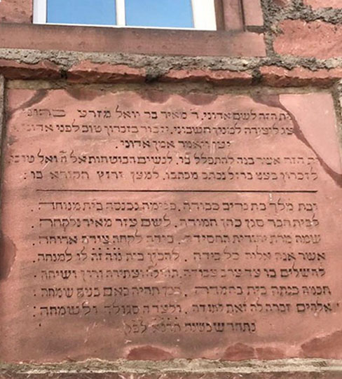
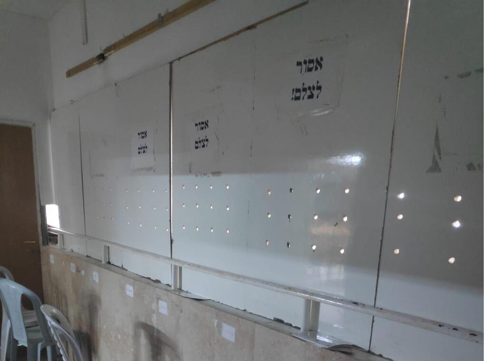

<u>התפתחויות בהלכה – הפרדה מיגדרית</u>

נושא הפרדה בין נשים וגברים בתפילה הוא נושא בוער
לאחרונה.

ידוע שהפרדה נהוגה אצל שומרי מצוות ברמות שונות. לא רק
הפרדה בתפילה, אלא גם בשמחות, ובעיקר בחינוך, מגיל צעיר יותר או בוגר יותר,
הכל בהתאם למידת האדיקות של הקהילות.

מעניין שלא ברור מתי נוצר המנהג, וכיצד התפתח. מיסתורין
כמו לא מעט מנהגים והלכות.

ומה שלא יודעים תמיד יותר מעניין...

<u>בתורה אין כל רמז בנושא זה.</u>

הנה למשל, מצווה ה' את משה לקבוע בסוף כל שנת שמיטה,
בסוכות, אסיפה של כל העם ללימוד, או שמיעה לפחות, של התורה, במעמד שנקרא
מעמד "הַקְהֵל":

<u>ספר דברים פרק לא</u>

(יא) בְּבוֹא כָל יִשְׂרָאֵל לֵרָאוֹת אֶת פְּנֵי יְהֹוָה אֱלֹהֶיךָ בַּמָּקוֹם אֲשֶׁר
יִבְחָר תִּקְרָא אֶת הַתּוֹרָה הַזֹּאת נֶגֶד כָּל יִשְׂרָאֵל בְּאָזְנֵיהֶם:

(יב) הַקְהֵל אֶת הָעָם הָאֲנָשִׁים וְהַנָּשִׁים וְהַטַּף וְגֵרְךָ אֲשֶׁר בִּשְׁעָרֶיךָ לְמַעַן
יִשְׁמְעוּ וּלְמַעַן יִלְמְדוּ וְיָרְאוּ אֶת יְהֹוָה אֱלֹהֵיכֶם וְשָׁמְרוּ לַעֲשׂוֹת אֶת כָּל דִּבְרֵי הַתּוֹרָה
הַזֹּאת:

אף מילה על מחיצת הפרדה... בימינו מנסים לבצע את המצווה
הזאת (כמובן בהפרדה).

גם בתנ"ך כולו לא מסופר על אירועים בהפרדה, לא במדבר, לא
בימי המלכים ואפילו לא בימי עזרא ונחמיה שאז מתחילה קנאות נגד זרים.

קרוב לוודאי שהמצווה הזאת, מצוות "הקהל" נכתבת בראשית ימי
בית שני, בערך כאשר עזרא ונחמיה אוספים את העם לשמוע את התורה:

<u>ספר נחמיה פרק ח</u>

(א) וַיֵּאָסְפוּ כָל הָעָם כְּאִישׁ אֶחָד אֶל הָרְחוֹב אֲשֶׁר לִפְנֵי שַׁעַר הַמָּיִם
וַיֹּאמְרוּ לְעֶזְרָא הַסֹּפֵר לְהָבִיא אֶת סֵפֶר תּוֹרַת מֹשֶׁה אֲשֶׁר צִוָּה יְהֹוָה אֶת יִשְׂרָאֵל:

(ב) וַיָּבִיא עֶזְרָא הַכֹּהֵן אֶת הַתּוֹרָה לִפְנֵי הַקָּהָל מֵאִישׁ וְעַד אִשָּׁה וְכֹל
מֵבִין לִשְׁמֹעַ בְּיוֹם אֶחָד לַחֹדֶשׁ הַשְּׁבִיעִי:

(ג) וַיִּקְרָא בוֹ לִפְנֵי הָרְחוֹב אֲשֶׁר לִפְנֵי שַׁעַר הַמַּיִם מִן הָאוֹר עַד
מַחֲצִית הַיּוֹם נֶגֶד הָאֲנָשִׁים וְהַנָּשִׁים וְהַמְּבִינִים וְאָזְנֵי כָל הָעָם אֶל סֵפֶר הַתּוֹרָה:

......

(ה) וַיִּפְתַּח עֶזְרָא הַסֵּפֶר לְעֵינֵי כָל הָעָם כִּי מֵעַל כָּל הָעָם הָיָה
וּכְפִתְחוֹ עָמְדוּ כָל הָעָם:

אף מילה על הפרדה, וממילא לא על מחיצה.

משהו בכל זאת נמצא, אצל הנביא זכריה, מאחרוני הנביאים
המנבאים בתחילת ימי בית שני, כאשר הוא מנבא נבואה לא קלה על אחרית
הימים:

<u>ספר זכריה פרק יב</u>

(יא) בַּיּוֹם הַהוּא יִגְדַּל הַמִּסְפֵּד בִּירוּשָׁלִַם כְּמִסְפַּד הֲדַדְרִמּוֹן בְּבִקְעַת
מְגִדּוֹן:

(יב) וְסָפְדָה הָאָרֶץ מִשְׁפָּחוֹת מִשְׁפָּחוֹת לְבָד מִשְׁפַּחַת בֵּית דָּוִיד לְבָד
וּנְשֵׁיהֶם לְבָד מִשְׁפַּחַת בֵּית נָתָן לְבָד וּנְשֵׁיהֶם לְבָד:

(יג) מִשְׁפַּחַת בֵּית לֵוִי לְבָד וּנְשֵׁיהֶם לְבָד מִשְׁפַּחַת הַשִּׁמְעִי לְבָד וּנְשֵׁיהֶם
לְבָד:

(יד) כֹּל הַמִּשְׁפָּחוֹת הַנִּשְׁאָרוֹת מִשְׁפָּחֹת מִשְׁפָּחֹת לְבָד וּנְשֵׁיהֶם
לְבָד:

פסוקים אלה, העוסקים במיספד שיהיה "ביום ההוא", ומדברים גם
על הפרדת משפחות זו מזו, ספק אם הם רלוונטים לנושא שלנו. אך הם רלוונטיים
לפרשנויות מאוחרות המצדדות בהפרדה. רק פסוקים אלה, בכל התנ"ך, משמשים את
פרשני ההפרדה, אין יותר.

לראשונה מוצאים עדויות להפרדת נשים מגברים, מהסיבה של
משיכה מינית, במשנה וספרות חז"ל שאחריה. וכך אנו מוצאים במסכת "מידות"
במשנה, תיאור של כל המבנה והמנהגים של בית המקדש, כפי שהם זכורים על ידי
חכמים, לאחר חורבנו:

<u>משנה מסכת מדות פרק ב</u>

(ה) עֶזְרַת הַנָּשִׁים הָיְתָה אֹרֶךְ מֵאָה וּשְׁלשִׁים וְחָמֵשׁ עַל רֹחַב מֵאָה
וּשְׁלֹשִׁים וְחָמֵשׁ. וְאַרְבַּע לְשָׁכוֹת הָיוּ בְאַרְבַּע מִקְצֹעוֹתֶיהָ, שֶׁל אַרְבָּעִים אַרְבָּעִים אַמָּה. וְלֹא
הָיוּ מְקֹרוֹת. .... וּמֶה הָיוּ מְשַׁמְּשׁוֹת. דְּרוֹמִית מִזְרָחִית, הִיא הָיְתָה לִשְׁכַּת הַנְּזִירִים,
שֶׁשָּׁם הַנְּזִירִין מְבַשְּׁלִין אֶת שַׁלְמֵיהֶן, וּמְגַלְּחִין אֶת שַׂעְרָן, וּמְשַׁלְּחִים תַּחַת הַדּוּר. מִזְרָחִית
צְפוֹנִית, הִיא הָיְתָה לִשְׁכַּת הָעֵצִים, ....

מַעֲרָבִית דְּרוֹמִית, אָמַר רַבִּי אֱלִיעֶזֶר בֶּן יַעֲקֹב, שָׁכַחְתִּי מֶה הָיְתָה
מְשַׁמֶּשֶׁת. אַבָּא שָׁאוּל אוֹמֵר, שָׁם הָיוּ נוֹתְנִין יַיִן וְשֶׁמֶן, ...

וַחֲלָקָה הָיְתָה בָּרִאשׁוֹנָה, וְהִקִּיפוּהָ כְצוֹצְרָה \[גזוזטרה\], שֶׁהַנָּשִׁים
רוֹאוֹת מִלְמַעְלָן, וְהָאֲנָשִׁים מִלְּמַטָּן, כְּדֵי שֶׁלֹּא יְהוּ מְעֹרָבִין, וַחֲמֵשׁ עֶשְׂרֵה מַעֲלוֹת עוֹלוֹת
מִתּוֹכָהּ לְעֶזְרַת יִשְׂרָאֵל...

הייתה חצר בבית המקדש שנקראה "עזרת נשים" אך כל המיקום
והתיאורים מעידים שהיו עוברים בה גם גברים. ובשלב מסוים נבנתה מחיצה. (בכל
אופן מכאן המושג "עזרת נשים").

ואמנם כל הפרשנים מדברים על הפרדה במחיצה המתוארת כאן,
כקיימת רק בשמחת בית השואבה. פרשנות זו מקורה בתוספתא שנכתבת סמוך לכתיבת
המשנה.

<u>תוספתא מסכת סוכה פרק ד</u>

(א) בראשונה כשהיה שמחת בית השואבה אנשים רואים מבפנים
ונשים רואות מבחוץ וכשראו בית דין שהן באין לידי קלות ראש עשו שלש
גזוזטראות בעזרה כנגד שלש רוחות ששם נשים יושבות ורואות בשמחת בית השואבה
ולא היו מעורבין:

כלומר, "בית דין", כלומר סנהדרין, החליטה על מחיצות בזמן
שמחת בית השואבה, כי עירוב נשים וגברים הביא ל"קלות ראש".

למעשה, זה כל הידוע על ימי הבית השני, וגם זה ממש רק סוף
ימי הבית השני. כי הזוכרים, אחרי החורבן, זוכרים את בניית המחיצה. וייתכן,
אפילו, שאלו רק תפיסות מאוחרות של מה שקרה או לא קרה בו. בוודאי זה לא אומר
דבר על בתי הכנסת או אירועים אחרים.

התלמוד הירושלמי ("נחתם" בערך בשנת 400), כבר משתמש בפסוקי
אחרית הימים של זכריה לביסוס "מדאורייתא" של מה שנכתב לפניו,
בתוספתא:

<u>ירושלמי סוכה פרק ה הלכה ב</u>

ומתקנין שם תיקון גדול. מה תיקון היו עושין שם. שהיו
מעמידין האנשים בפני עצמן והנשים בפני עצמן. כהיא דתנינן תמן "וחלקה היתה
בראשה והקיפוה כצוצטרא שהנשים רואות מלמעלן והאנשים מלמטן כדי שלא יהו
מעורבין". ממי למדו? מדבר תורה. (זכריה יב) "וספדה הארץ משפחות משפחות לבד"
תרין אמורין. חד אמר, זה הספידו של משיח, וחורנה אמר, זה הספידו של יצר
הרע. מאן דאמר זה הספידו של משיח, מה אם בשעה שהן אבילין את אמר \[אתה
אומר\] האנשים בפני עצמן והנשים בפני עצמן בשעה שהן שמחים לא כל שכן. מאן
דאמר זה הספידו של יצר הרע, מה אם בשעה שאין יצר הרע קיים את אמר האנשים
בפני עצמן והנשים בפני עצמן, בשעה שיצר הרע קיים לא כל שכן:

כאן כבר יש שיוך מפורש לא רק לייצר הרע, אלא גם "למדו מדבר
תורה". פסוקים אלה מספיקים כדי שרבנים בימינו יקבעו שהפרדה של גברים ונשים
היא "מדאורייתא".  
כל מה שנחשב "מדאורייתא", כלומר, מצוות התורה, הוא המחייב ביותר. פחות
מחייבת מצווה "מרבנן", כלומר מחז"ל, ועוד פחות המנהג.

נקפוץ אלף שנים ממש מחורבן הבית, מפני שקשה למצוא עדות
ממשית על המצב קודם.

במאמר קצר בשם "יציע נשים בבנין בית הכנסת בתקופת הגאונים"
מאת ש.ד. גויטיין,

<https://www.jstor.org/stable/23591029?read-now=1#page_scan_tab_contents>

הוא מספר על עדויות מהגניזה הקאהירית על עזרות נשים בבתי
כנסת במצרים.

העדויות הן מהמאה ה-11, כלומר, סוף תקופת גאוני בבל,
שנמשכה בערך משנת 500 עד מעט אחרי שנת 1000.

בדו"ח על בית הכנסת של הירושלמים בעיר פוסטאס, מסופר על
בית "הסמוך לשער הנשים" של בית הכנסת, ומרחוב אחר הייתה הכניסה
הראשית.

בחשבון הוצאות בית הכנסת מוזכרים "חישורים לעמודים שבבית
הנשים".

בתעודה העוסקת בבית הכנסת של הבבליים כתוב (מתורגם
מערבית): בית מאחורי בית כנסת העראקים הגובל בשער הסודי, מקום שנשי היהודים
עולות מעליו.

בבית כנסת של העיר דמוה, ליד גיזה, שהיה מקום עלייה לרגל,
נקבעה תקנה שהנשים למעלה והגברים למטה "בהתאם למנהג".

כל זה עדויות מהגניזה ומדברות על המאה ה-11.

נחזור לתקופות עתיקות יותר.

האם באלף הראשון נשים הגיעו לבית הכנסת בכלל?

כמובן, התשובה קשורה במקום ובזמן.

<u>משנה מסכת ברכות פרק ג</u>

(ג) נָשִׁים וַעֲבָדִים וּקְטַנִּים פְּטוּרִין מִקְּרִיאַת שְׁמַע וּמִן הַתְּפִלִּין,
**וְחַיָּבִין בַּתְּפִלָּה** וּבַמְּזוּזָה וּבְבִרְכַּת הַמָּזוֹן:

זה עדיין לא אומר שאינן יכולות להתפלל בביתן.
אבל...

<u>תלמוד בבלי מסכת עבודה זרה דף לח/א</u>

שופתת אשה קדירה על גבי כירה ובאת עובדת כוכבים ומגיסה, עד
שתבא מבית המרחץ או מבית הכנסת ואינה חוששת...

השאלה כאן, היא בכלל אם מותר להשאיר גויה לבד בבית שמתבשל
בו משהו, משיקולי כשרות, אך דרך אגב מספרים שנשים הולכות לבית
הכנסת.

<u>ירושלמי ברכות פרק ה הלכה ד</u>

ר' אחא ר' תנחומא בר' חייא בשם רבי שמלאי עיר שכולה כהנים
נושאין את כפיהם למי הם מברכין לאחיהם שבצפון לאחיהם שבדרום לאחיהם שבמזרח
לאחיהם שבמערב ומי עונה אחריהם אמן הנשים והטף.

<u>תלמוד בבלי מסכת סוטה דף כב/א</u>

דההיא אלמנה דהואי בי כנישתא בשיבבותה כל יומא הות אתיא
ומצלה בי מדרשיה דרבי יוחנן אמר לה בתי לא בית הכנסת בשיבבותך אמרה ליה רבי
ולא שכר פסיעות יש לי?

כל אלה מביא שמואל ספראי במאמרו

"האם היתה קיימת עזרת נשים בבית הכנסת בתקופה
העתיקה?

<https://www.jstor.org/stable/23590992?read-now=1&seq=1#page_scan_tab_contents>

ואמנם ברור מכאן שבתקופת האמוראים (התקופה הרומאית
והביזנטית) היו נשים בבית הכנסת הן בישראל והן בבבל.

ספראי מנסה לשכנע במאמרו, שלא הייתה עזרת נשים בבתי הכנסת
בתקופה העתיקה. גם "עזרת נשים" המפורסמת בבית המקדש לא הייתה דומה למה
שהיום מקובל בבתי הכנסת, היו עוברים בה גברים, היו מזמרים ומנגנים בה לויים
ועוד ועוד.

המחקר הארכיאולוגי אינו חד משמעי. נמצא שהיו יציעים בחלק
מבתי הכנסת, אך אין כל ראיה ששימשו כעזרת נשים. בבתי כנסת אחרים לא נמצאו
יציעים.

בבית הכנסת המשוחזר בגולן באום אל קנאטיר (עין קשתות) אין
יציע, ולא נראה שהייתה עזרת נשים.

הנושא הוא ללא הכרעה מוחלטת, מפני "שלא מצאתי אינה ראיה".
אפשר והיו הפרדות מסוג אחר. וברור שחוקרים דתיים משתדלים להראות שההלכות
המקובלות היום היו מקובלות תמיד. הליברלים יראו שהייתה התפתחות.

כאשר אנחנו מתקדמים לימי הביניים, מעניינת עמדתו של
הרמב"ם, כמאה מאתיים שנה אחרי העדויות מהגניזה על מציאות עזרת נשים:

מצד אחד:

<u>רמב"ם יד החזקה הלכות תפלה ונשיאת כפים פרק
א</u>

(ב) ולפיכך נשים ועבדים חייבין בתפלה לפי שהיא מצות עשה
שלא הזמן גרמא אלא חיוב מצוה זו כך הוא שיהא אדם מתחנן ומתפלל בכל יום
ומגיד שבחו של הקדוש ברוך הוא ואחר כך שואל צרכיו שהוא צריך להם בבקשה
ובתחנה ואחר כך נותן שבח והודיה לה' על הטובה שהשפיע לו כל אחד לפי
כחו:

הרמב"ם גם מצטט את הירושלמי, שבו נאמר שהנשים והטף אומרים
אמן אחרי ברכת כוהנים. כלומר, הוא לא מתכוון שנשים צריכות להתפלל
בבית.

מצד שני:

<u>רמב"ם יד החזקה הלכות אישות פרק יג</u>

לפי שכל אשה יש לה לצאת ולילך לבית אביה לבקרו ולבית האבל
ולבית המשתה לגמול חסד לרעותיה ולקרובותיה כדי שיבואו הם לה שאינה בבית
הסוהר עד שלא תצא ולא תבוא. אבל גנאי הוא לאשה שתהיה יוצאה תמיד פעם בחוץ
פעם ברחובות ויש לבעל למנוע אשתו מזה ולא יניחנה לצאת אלא כמו פעם אחת
בחודש או פעמים בחודש כפי הצורך שאין יופי לאשה אלא לישב בזוית ביתה שכך
כתוב (תהלים מ"ה) כל כבודה בת מלך פנימה:

הוא "מרשה" לאשה לבקר את משפחתה ולהשתתף באירועים משפחתיים
וחברתיים, ולא מזכיר תפילה בבית הכנסת. והדברים תמוהים. אבל יש הרבה סתירות
בכתבי הרמב"ם.

אנחנו היכרנו את כרימה בת עמאר, מאה שנה או פחות לפני
הרמב"ם, שהלכה לבית הכנסת (וגרשוה משם בגלל שלא נישאה כדין לבן זוגה...),
וידוע גם שתרמה לבתי כנסיות.

אבל כאמור, על פי הגניזה, הייתה כבר עזרת נשים, או הפרדה
ברורה בבתי הכנסת, במצרים, בתקופה זו.

צריך לציין שגם בנושא ההפרדה הרמב"ם מביא קולות שונים. מצד
אחד:

<u>רמב"ם יד החזקה הלכות שביתת יום טוב פרק ו</u>

(כא) חייבין בית דין להעמיד שוטרים ברגלים שיהיו מסבבין
ומחפשין בגנות ובפרדסים ועל הנהרות כדי שלא יתקבצו לאכול ולשתות שם אנשים
ונשים ויבואו לידי עבירה וכן יזהירו בדבר זה לכל העם כדי שלא יתערבו אנשים
ונשים בבתיהם לשמחה ולא ימשכו ביין שמא יבואו לידי עבירה:

ומצד שני:

<u>רמב"ם יד החזקה הלכות איסורי ביאה פרק כב</u>

נשים הרבה עם אנשים הרבה אין חוששין לייחוד

כלומר, הוא חושש רק מ"ייחוד", גבר אחד עם אשה אחת, שיבואו
(חס ושלום) ליחסי מין, אך אינו עוסק בכלל בשאלות "הייצר הרע" שמעסיקות את
רבני ימינו.

בבלוג של הספריה הלאומית "הספרנים", קיים מאמר בשם:

"נפרדנו כך: איך נולדה עזרת הנשים בבתי הכנסת?" מאת חן
מלול.

[https://blog.nli.org.il/sodot-court-of-the-women/](https://blog.nli.org.il/sodot-court-of-the-women/)

קשה לומר שהמאמר נותן תשובה ממשית להתפתחות ההפרדה, וספק
אם ניתן לדעת זאת היום (או שמחקרים חדשים יוסיפו דעת). המאמר מביא דוגמאות
ממקומות שונים ותקופות שונות.

במאה ה-12 מופיע באשכנז המושג "בית כנסת הנשים". מבנה נפרד
מבית הכנסת שבו מתפללות הנשים בהנהגת נשים. לשמיעת הדרשה היו הנשים מצטרפות
לבית כנסת הגברים עם או בלי מחיצה. לא ברור.

מנהג זה דווקא תרם לכך שנשים היו חזניות, ומנהלות
תפילה.

לדוגמה, כתובת על מצבה של אורניאה בת החזן אברהם מוורמס,
שנפטרה בשנת 1275:

"האבן הזאת הוקמה לראש, זאת הגברת מרת אורניאה, בת החבר ר'
אברהם ראש המשוררים תפילתו לתפארת, בקוד קולו בעד עמו בנעימת עתרת, והיא גם
בקול זמרה, לנשים משוררת בפיוטים".

בבית הכנסת בוורמיזא, נבנתה ב 1213 עזרת נשים, הראשונה
הידועה בוודאות, על פי כתובת שנמצאת שם עד היום. כנראה בתקופה שבבתי כנסת
אחרים הייתה הפרדה במבנים.

מעל הקו, שבחים לר' מאיר בר יואל... "אשר בנה להתפלל בו
לנשים הבוטחות באל"

כמובן, לא כל בתי הכנסת נשמרו עד היום (בית הכנסת בוורמיזא
הוא מיוחד בכך), וקשה לדעת על בתי כנסת אחרים, ארבע מאות שנה אחר כך, הרבה
יותר קרוב לימינו, מופיע המושג "עזרת נשים" בבתי הכנסת באירופה. מה קורה
באמצע? איננו יודעים.

ב 1600 בערך, מתאר ר' יהודה ממודנה עזרת נשים
באיטליה:

"ובחדר מקום מיוחד מלמעלה או מצדו עם שבכה מעץ, ששם עומדות
הנשים להתפלל ולראות בכל הנעשה בבית, אבל אינן נראות לעיני האנשים ואינן
מתערבות עמהם בעבודת התפילה למען לא תשחת כוונת התפילה **על ידי רעיוני חטא
ופשע**".

וזוהי כבר האידאולוגיה השלטת באורתודוקסיה עד היום הזה.
רואות, אך אינן נראות, ופסיביות, כדי שהגברים יצליחו להימלט מהייצר
הרע.

בצרפת, מתוארת עזרת נשים דווקא במרתף, כאשר חזן גבר מנהל
את תפילתן, ואיכשהו הן יכולות לראות מלמטה את ספר התורה. (לא ברורה שאלת
הייצר הרע של החזן...).

לעומת זה בתימן, אסור היה לנשים להגיע לבית הכנסת בכלל.
שוב, לא ברור ממתי.

בירושלים במאה ה-19 הייתה הדרת נשים קיצונית. הפרדה על ידי
מחיצת עץ, חובת הנשים לצאת מבית הכנסת לפני הגברים, ובשנת 1854 יצאה תקנה
שנשים בגיל קטן מארבעים לא תלכנה לבית הכנסת חוץ מבראש השנה ויום הכיפורים.
אמנם רוב החרדים בימינו אינם יורשי אותה קהילה, אלא אולי רק "העדה החרדית",
אבל יש רבים שירשו את היחס לנושא.

כך או כך, התוצאה הייתה שנשים העדיפו קברי צדיקים כמו קבר
רחל, ואת הכותל, על פני בתי הכנסת. העות'מנים לא התירו לשים מחיצה בכותל
(מסיבות שלהם, כנראה קדושת הר הבית למוסלמים). הבריטים אפשרו, ומאז עד היום
המצב הולך ומחמיר....

<u>וכך מסכם הרב ד"ר אברהם סתיו (מרבני צהר):  
</u>שאלת המקום של נשים בבית הכנסת, מקום במובן הפיזי, **היא בין המסתורין
הגדולים של הספרות ההלכתית.** אצל הרמב"ם ובשולחן ערוך ובשאר ספרי הפסיקה
הקאנוניים יש התעלמות מוחלטת מ'הלכות עזרת נשים'. בקושי ישנם אזכורים
בודדים לעצם קיומה. כך גם ביחס לשאלה של כניסת נשים לעזרת גברים, שאפשר
ללמוד עליה רק מהתייחסויות עקיפות ובודדות. אנחנו יודעים שנשים הגיעו לבית
הכנסת, גם אם לא במספרים גדולים. ישנם כבר בספרות חז"ל סיפורים על נשים
כאלו. ומצד שני די ברור, לפחות במאות השנים האחרונות, שהן לא ישבו באולם של
הגברים".

אבל, עובדה שהרב הנכבד מתעלם ממנה, ברור גם שבמאתיים השנים
האחרונות קיימים כבר זרמים ליברליים ביהדות. תופעה אופיינית, שרבנים
אורתודוקסים, גם מתונים, מתייחסים ליהדות כזהה עם היהדות
האורתודוקסית.

ב 1845 הוסרה המחיצה בבית הכנסת הרפורמי בגרמניה. ושש שנים
אחר כך בבתי הכנסת הרפורמיים בארה"ב. גברים ונשים החלו להתפלל בתפילה
משותפת. מאוחר יותר גם בזרם הקונסרבטיבי. אצל הרפורמיים יש שוויון מוחלט גם
בתפקידי הרבנות, החזנות, וכו'.

אבל בחסידות גור, לא תראו את הנשים שמעבר למחיצה
שבתמונה:

**עזרת נשים בבית כנסת של חסידות גור. ואני לא צילמתי, רק
העתקתי מאתר של YNET....**

עם כל חומרת הבעייה אצלנו, צריך להזכיר, שהאורתודוקסים הם
מיעוט ביהדות העולם, וכוחם בארץ גדול בגלל המצב הפוליטי, ובגלל הצלחתם לדכא
התפתחות של הזרמים האחרים. בארצות הברית רק כ 10% מהיהודים הם אורתודוקסים
והשאר קונסרבטיבים, רפורמים, או חילוניים לחלוטין (כלומר חסרי מסגרת
קהילתית). רוב המתפללים היהודים בארה"ב, מתפללים ללא הפרדה.

עניין "המסתורין" שמזכיר הרב אברהם סתיו הוא מעניין ביותר.
זה לא הנושא היחיד שהוא מרכזי בשיח הישראלי, וכמעט לא קיים בשיח ההלכתי
העצום והרב. ולכן אולי נדבר על נושאים אלה בעתיד. למשל, נושא כיסוי ראש,
נושא שירת נשים ועוד.

<u>ההפרדה בחינוך</u>

למעשה, הפרדת המינים בחינוך לא נבעה בראשית מאידיאולוגיה
של הפרדה, אלא מאידאולוגיה של חינוך שונה. לא הייתה מצווה ללמד בנות,
ואפילו הייתה התנגדות מלכתחילה. נושא זה הוא בויכוח בהלכה מאז ימי חז"ל. יש
האוסרים בעיקרון, מתוך הנחה שהאשה אינה מסוגלת ללמוד, ויש המסתפקים בכך
שאינה חייבת בלימוד... \[מאות שנים לימוד התורה והתלמוד היה העיקר ולימוד
כתיבה וקריאה רק אמצעי\]. יחד עם זה הכל הסכימו שהאשה חייבת לקיים הרבה
מצוות, אבל החינוך הראוי לה הוא בבית, בעיקר על ידי האם.

לכן נושא חינוך משותף או בהפרדה לא היה על הפרק
כלל.

כאשר בשנת 1918, לפני כמאה שנה, הקימה שרה שנירר את בית
הספר הראשון של בית יעקב, לבנות בלבד, היא ביססה תוכנית לימוד מתקדמת
מיועדת לבנות, כלומר מוכוונת לצרכים האמיתיים, הן של שמירת מצוות, והן של
החזקת בית וגם פרנסה. ההצלחה הגדולה של רשת בית יעקב ביהדות החרדית, הביאה
למצב הפרדוקסלי היום, שנשים הן בעלות השכלה (חילונית, השכלה במובן שלנו),
ואילו גברים הם בעלי השכלה תורנית, למעשה בלתי רלוונטית לחיי העולם
המודרני.

אף על פי כן מצליחים עדיין מנהיגי הקהילות החרדיות להחזיק
את הנשים במסגרות הישנות, אם כי נוצרים סדקים. תהליכים חברתיים מתקדמים
לאיטם, בוודאי בחברות סגורות.

כדי להתמודד עם המודרנה נוצרות תקנות חמורות הרבה יותר
להפרדה, כנראה בעיקר בישראל.

הפרדה בתחבורה ציבורית, במקומות בילוי, ואפילו ברחוב. מאבק
על הפרדה באקדמיה, והדברים ידועים. ייתכן שזו התגובה על תהליכים של התקדמות
הנשים.

לעומת זה בארה"ב, הרב משה פיינשטיין (נפטר 1986), מגדולי
הפוסקים **החרדיים** של ארה"ב פוסק ביחס לתחבורה ציבורית:

בדבר נסיעה באוטובוס בזמן שהולכים בני אדם לעבודתם,
שנמצאים שם אנשים ונשים דחופים זה בזה, שקשה מליזהר מנגיעה ודחיפה בנשים,
אם מותר אז ללכת בשעות אלו שם.

\[זאת השאלה\]

הנה מצד הנגיעה ודחיפה בנשים אין שום איסור, משום שאין דרך
תאווה וחיבה, וכל איסור נגיעה בעריות, אף להרמב"ם שסובר שהוא בלאו ד"לא
תקרבו" דאורייתא, הוא דווקא דרך תאווה כמפורש בדבריו ריש פרק כ"א מהלכות
איסורי ביאה. ומשמע שבלא דרך תאווה אין אפילו איסור מדרבנן, שלא הזכיר
איסור כזה.

ובהמשך אפילו מתיר לשבת ליד אישה...

כמובן, היו גם פוסקים מחמירים יותר בארה"ב.

בחוגים דתיים בכלל, היום קיימת הפרדה בגוונים שונים בהתאם
למידת הקנאות.

תנועת "בני עקיבא" חינכה בעבר בנים ובנות במשותף, בשנת
1980 התפלגה, ותנועת "אריאל" שיצאה ממנה שמרה על הפרדה מוחלטת. לעומת זה
בבני עקיבא הנוהגים מגוונים בהתאם למקום.

ההתנגשות עם הציבור החילוני נעשית על ידי הציבור החרדי
בעיקר באקדמיה, מפני שבמקומות אחרים (כמו בתחבורה) הם מפרידים עצמם
מהחילוניים בכלל.

לעומת זה הזרם החרד"לי שמקורו בציונות הדתית הוא פנייה
לאחור של חלק מהציונות הדתית, והוא אגרסיבי ביחס לנושאים רבים וגם בנושא
זה, ומתנגש יותר עם הציבור החילוני.

לאחרונה התפרסם הארגון "ראש יהודי" שהוא תוצר של ההתנחלות
החרד"לית, שחוזר לגבולות ישראל במטרה מוצהרת להחזיר את החילוניים
בתשובה.

חלק מ"התשובה" הוא, כמובן, "הצניעות", כלומר,
הפרדה....

יהיה מעניין.
