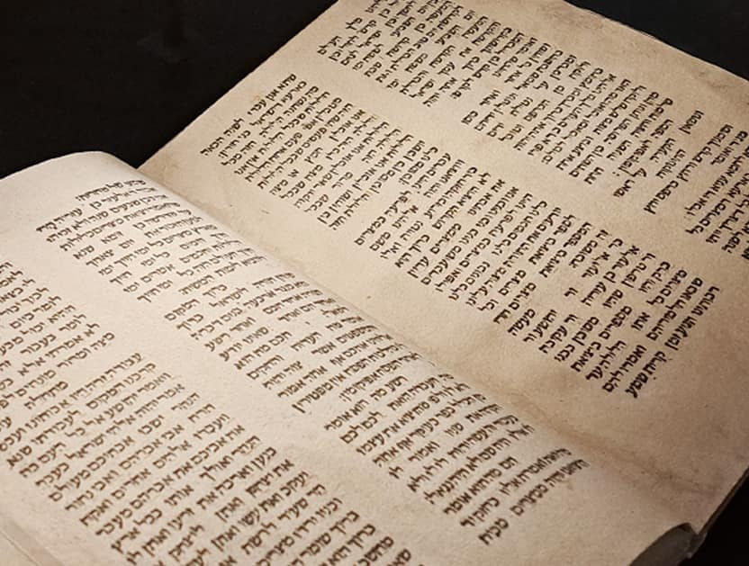

<u>התפתחויות בהלכה – סדר פסח</u>

חג הפסח איננו, כנראה, חג שנחוג בימי הבית הראשון, או
לפחות ברובם.

<u>ספר מלכים ב פרק כג</u>

(כא) וַיְצַו הַמֶּלֶךְ אֶת כָּל הָעָם לֵאמֹר עֲשׂוּ פֶסַח לַיהֹוָה אֱלֹהֵיכֶם כַּכָּתוּב
עַל סֵפֶר הַבְּרִית הַזֶּה:

(כב) כִּי לֹא נַעֲשָׂה כַּפֶּסַח הַזֶּה מִימֵי הַשֹּׁפְטִים אֲשֶׁר שָׁפְטוּ אֶת יִשְׂרָאֵל
וְכֹל יְמֵי מַלְכֵי יִשְׂרָאֵל וּמַלְכֵי יְהוּדָה:

(כג) כִּי אִם בִּשְׁמֹנֶה עֶשְׂרֵה שָׁנָה לַמֶּלֶךְ יֹאשִׁיָּהוּ נַעֲשָׂה הַפֶּסַח הַזֶּה
לַיהֹוָה בִּירוּשָׁלָם:

חג הפסח לא מוזכר בספר שופטים, אלא בספר יהושע בלבד, ספר
מאוחר יחסית ולא אמין מבחינה היסטורית. יאשיהו מלך שנים ספורות לפני חורבן
הבית הראשון. כך, שלמרות שהנביאים, מעמוס והלאה מזכירים את יציאת מצרים
(עמוס, כמאה וחמישים שנה לפני חורבן הבית הראשון), החג עצמו לא נחוג,
והתפתח בימי הבית השני. אולי גם כתוצאה מדגש על העלייה מבבל וההתנחלות
מחדש.

כמו שבימינו, הזכירו הרבה את עזרא ונחמיה, הבונים את הבית
השני.

חגיגת הפסח של ימי הבית השני נקראת "פסח דורות" (להבדיל
מ"פסח מצרים" הלילה שבו יצאו בני ישראל ממצרים).

במשנה מסכת "פסחים" עשרה פרקים. תשעה מהם עוסקים ב"פסח
דורות", על הר הבית, בפרטי פרטים. והפרק האחרון ב"סדר פסח" שהחליף את הפסח
שעל הר הבית. נוסטלגיה.

<u>משנה מסכת פסחים פרק ה</u>

(ה) הַפֶּסַח נִשְׁחָט בְּשָׁלֹשׁ כִּתּוֹת, שֶׁנֶּאֱמַר (שמות יב) וְשָׁחֲטוּ אֹתוֹ כֹּל
קְהַל עֲדַת יִשְׂרָאֵל, קָהָל וְעֵדָה וְיִשְׂרָאֵל. נִכְנְסָה כַּת הָרִאשׁוֹנָה, נִתְמַלֵּאת הָעֲזָרָה, נָעֲלוּ
דַלְתוֹת הָעֲזָרָה. תָּקְעוּ וְהֵרִיעוּ וְתָקְעוּ. הַכֹּהֲנִים עוֹמְדִים שׁוּרוֹת שוּרוֹת, וּבִידֵיהֶם בָּזִיכֵי
כֶסֶף וּבָזִיכֵי זָהָב. שׁוּרָה שֶׁכֻּלָּה כֶּסֶף כֶּסֶף, וְשׁוּרָה שֶׁכֻּלָּהּ זָהָב זָהָב. .... \[נחסוך את
השחיטה\]

(ז) יָצְתָה כַּת רִאשׁוֹנָה וְנִכְנְסָה כַּת שְׁנִיָּה. יָצְתָה שְׁנִיָּה, נִכְנְסָה
שְׁלִישִׁית. כְּמַעֲשֵׂה הָרִאשׁוֹנָה כָּךְ מַעֲשֵׂה הַשְּׁנִיָּה וְהַשְּׁלִישִׁית. **קָרְאוּ אֶת הַהַלֵּל**. אִם גָּמְרוּ
שָׁנוּ, וְאִם שָׁנוּ שִׁלֵּשׁוּ, אַף עַל פִּי שֶׁלֹּא שִׁלְּשׁוּ מִימֵיהֶם. רַבִּי יְהוּדָה אוֹמֵר, מִימֵיהֶם שֶׁל
כַּת שְׁלִישִׁית לֹא הִגִיעַ **לְאָהַבְתִּי כִּי יִשְׁמַע ה'**, מִפְּנֵי שֶׁעַמָּהּ מֻעָטִין:

אחר כך גם יש פירוט כיצד צולים את הפסח.

מבלי להיכנס לפרטים נוספים, ברור, שהחג כלל שחיטת טלה או
גדי, צליית הבשר וקריאת הלל, וכמובן אכילת הבשר. לפי התיאור הקריאה הייתה
במקביל לשחיטה. ההלל הוא מספר פרקים בתהילים, קי"ג עד קי"ח. מאוחר יותר
הוסיפו את קל"ו, המכונה הלל גדול.

ההלל, נמצא היום בסוף ההגדה "הרשמית", לפני הפיוטים, ורובו
אחרי הסעודה.

אגב, לפי התיאור, ניתן לשער שרוב העם חגג את הפסח בביתו,
אך כנראה באותה צורה.

כמה טלאים ניתן לשחוט בערב אחד, אפילו בהר הבית...

לאחר החורבן, חכמי יבנה ואחריהם חכמי הגליל, קובעים תחליף
ל"פסח דורות" והוא "סדר פסח" עד ימינו אלה.

ההגדה של פסח, שאנחנו קוראים (או לא קוראים) ב"סדר", משתנה
במשך הדורות. קיימים ספרים שלמים של מחקר על ההגדה, שאינם בידי.

הסיבה ברורה, בניגוד לתנ"ך, ואפילו למשנה, לא הייתה להגדה
הילה של קדושה, ולכן "כל דכפין" היה יכול לשנותה, לפחות במשך מאות שנים.
(ובזכות זה היא גם מצויירת על ידי כל מאייר, עד ימינו). לעדות השונות יש
נוסחים שונים לפחות בחלק שאחרי הסעודה.

על התפתחות ההגדה, אביא גירסה אחת ששמעתי ממרצה
באוניברסיטת "בר אילן", שהוא תולה אותה במחקר של פרופ' יוסף תבורי.

ראשיתם של סדר פסח וההגדה של פסח, כמו רוב ההלכות שאחרי
החורבן, במשנה.

<u>משנה מסכת פסחים פרק י</u>

(א) עַרְבֵי פְסָחִים סָמוּךְ לַמִּנְחָה, לֹא יֹאכַל אָדָם עַד שֶׁתֶּחְשַׁךְ. וַאֲפִלּוּ
עָנִי שֶׁבְּיִשְׂרָאֵל לֹא יֹאכַל עַד שֶׁיָּסֵב. וְלֹא יִפְחֲתוּ לוֹ מֵאַרְבָּעָה כוֹסוֹת שֶׁל יַיִן, וַאֲפִלּוּ מִן
הַתַּמְחוּי:

(ב) מָזְגוּ לוֹ כוֹס רִאשׁוֹן, בֵּית שַׁמַּאי אוֹמְרִים, מְבָרֵךְ עַל הַיּוֹם,
וְאַחַר כָּךְ מְבָרֵךְ עַל הַיַּיִן. וּבֵית הִלֵּל אוֹמְרִים, מְבָרֵךְ עַל הַיַּיִן, וְאַחַר כָּךְ מְבָרֵךְ עַל
הַיּוֹם:

(ג) הֵבִיאוּ לְפָנָיו, מְטַבֵּל בַּחֲזֶרֶת, עַד שֶׁמַּגִּיעַ לְפַרְפֶּרֶת הַפַּת. הֵבִיאוּ
לְפָנָיו מַצָּה וַחֲזֶרֶת וַחֲרֹסֶת וּשְׁנֵי תַבְשִׁילִין, אַף עַל פִּי שֶׁאֵין חֲרֹסֶת מִצְוָה. רַבִּי אֱלִיעֶזֶר
בְּרַבִּי צָדוֹק אוֹמֵר, מִצְוָה. וּבַמִּקְדָּשׁ הָיוּ מְבִיאִים לְפָנָיו גּוּפוֹ שֶׁל פֶּסַח:

(ד) מָזְגוּ לוֹ כוֹס שֵׁנִי, וְכָאן הַבֵּן שׁוֹאֵל אָבִיו. וְאִם אֵין דַּעַת
בַּבֵּן, אָבִיו מְלַמְּדוֹ, מַה נִּשְׁתַּנָּה הַלַּיְלָה הַזֶּה מִכָּל הַלֵּילוֹת, שֶׁבְּכָל הַלֵּילוֹת אָנוּ אוֹכְלִין
חָמֵץ וּמַצָּה, הַלַּיְלָה הַזֶּה כֻּלּוֹ מַצָּה. שֶׁבְּכָל הַלֵּילוֹת אָנּוּ אוֹכְלִין שְׁאָר יְרָקוֹת, הַלַּיְלָה הַזֶּה
מָרוֹר. שֶׁבְּכָל הַלֵּילוֹת אָנוּ אוֹכְלִין בָּשָׂר צָלִי, שָׁלוּק, וּמְבֻשָּׁל, הַלַּיְלָה הַזֶּה כֻּלּוֹ צָלִי.
שֶׁבְּכָל הַלֵּילוֹת אָנוּ מַטְבִּילִין פַּעַם אַחַת, הַלַּיְלָה הַזֶּה שְׁתֵּי פְעָמִים. וּלְפִי דַעְתּוֹ שֶׁלּ בֵּן,
אָבִיו מְלַמְּדוֹ. מַתְחִיל בִּגְנוּת וּמְסַיֵּם בְּשֶׁבַח, וְדוֹרֵשׁ מֵאֲרַמִּי אוֹבֵד אָבִי, עַד שֶׁיִּגְמוֹר כָּל
הַפָּרָשָׁה כֻלָּהּ:

(ה) רַבָּן גַּמְלִיאֵל הָיָה אוֹמֵר, כָּל שֶׁלֹּא אָמַר שְׁלֹשָׁה דְבָרִים אֵלּוּ בַפֶּסַח,
לֹא יָצָא יְדֵי חוֹבָתוֹ, וְאֵלּוּ הֵן, פֶּסַח, מַצָּה, וּמָרוֹר. פֶּסַח, עַל שׁוּם שֶׁפָּסַח הַמָּקוֹם עַל
בָּתֵּי אֲבוֹתֵינוּ בְמִצְרָיִם. מַצָּה, עַל שׁוּם שֶׁנִּגְאֲלוּ אֲבוֹתֵינוּ מִמִּצְרָיִם. מָרוֹר, עַל שׁוּם
שֶׁמֵּרְרוּ הַמִּצְרִים אֶת חַיֵּי אֲבוֹתֵינוּ בְמִצְרָיִם. בְּכָל דּוֹר וָדוֹר חַיָּב אָדָם לִרְאוֹת אֶת עַצְמוֹ
כְּאִלּוּ הוּא יָצָא מִמִּצְרַיִם, שֶׁנֶּאֱמַר (שמות יג), וְהִגַּדְתָּ לְבִנְךָ בַּיּוֹם הַהוּא לֵאמֹר, בַּעֲבוּר
זֶה עָשָׂה ה' לִי בְּצֵאתִי מִמִּצְִרָיִם. לְפִיכָךְ אֲנַחְנוּ חַיָּבִין לְהוֹדוֹת, לְהַלֵּל, לְשַׁבֵּחַ, לְפָאֵר,
לְרוֹמֵם, לְהַדֵּר, לְבָרֵךְ, לְעַלֵּה, וּלְקַלֵּס, לְמִי שֶׁעָשָׂה לַאֲבוֹתֵינוּ וְלָנוּ אֶת כָּל הַנִּסִּים הָאֵלּוּ,
הוֹצִיאָנוּ מֵעַבְדוּת לְחֵרוּת, מִיָּגוֹן לְשִׂמְחָה, וּמֵאֵבֶל לְיוֹם טוֹב, וּמֵאֲפֵלָה לְאוֹר גָּדוֹל,
וּמִשִּׁעְבּוּד לִגְאֻלָּה. וְנֹאמַר לְפָנָיו, הַלְלוּיָהּ:

(ו) עַד הֵיכָן הוּא אוֹמֵר, בֵּית שַׁמַּאי אוֹמְרִים, עַד אֵם הַבָּנִים שְׁמֵחָה
\[סוף תהילים קי"ג\]. וּבֵית הִלֵּל אוֹמְרִים, עַד חַלָּמִישׁ לְמַעְיְנוֹ מָיִם \[סוף קי"ד\].
וְחוֹתֵם בִּגְאֻלָּה.

(ז) מָזְגוּ לוֹ כוֹס שְׁלִישִׁי, מְבָרֵךְ עַל מְזוֹנוֹ. רְבִיעִי, גוֹמֵר עָלָיו
אֶת הַהַלֵּל \[סוף קי"ח\], וְאוֹמֵר עָלָיו בִּרְכַּת הַשִּׁיר.

מהי "ברכת השיר"? יש שתי גירסאות לגבי ברכה זו כבר בתלמוד,
תפילות הנקראות "ברכת יהללוך" ו"נשמת כל חי".

אבל מעניין, שרבן גמליאל המשתלב בהגדה של פסח, חרף היותו
הנשיא, כנראה, נוקט עמדה ביחס לסדר, שלא נתקבלה.

<u>משנה מסכת ביצה פרק ב</u>

(ז) אַף הוּא \[רבן גמליאל\] אָמַר שְׁלשָׁה דְבָרִים לְהָקֵל, מְכַבְּדִין
בֵּין הַמִּטּוֹת, וּמַנִּיחִין אֶת הַמֻּגְמָר בְּיוֹם טוֹב, **וְעוֹשִׂין גְּדִי מְקֻלָּס בְּלֵילֵי פְסָחִים.
וַחֲכָמִים אוֹסְרִין:**

גדי מקולס,הוא גדי הנצלה בשלמותו, כמו שהיה נהוג על הרב
הבית. ולמה חכמים אוסרים?

נוסיף:

<u>תוספתא מסכת פסחים פרק י</u>

(ח) חייב אדם לעסוק בהלכות הפסח כל הלילה אפילו בינו לבין
בנו אפילו בינו לבין עצמו אפילו בינו לבין תלמידו **מעשה ברבן גמליאל
וזקנים שהיו מסובין בבית ביתוס בן זונין בלוד והיו עסוקין בהלכות הפסח כל
הלילה עד קרות הגבר. הגביהו מלפניהם ונועדו והלכו להן לבית המדרש.** איזו
היא ברכת הפסח? ברוך אשר קדשנו במצותיו וצונו **לאכול הפסח**. איזו ברכת
הזבח? ברוך אשר קדשנו במצותיו וצונו לאכול הזבח:

ובמה עסקו רבי אליעזר ורבי יהושע ורבי אלעזר בן עזריה,
ורבי טרפון, ורבי עקיבא?

<u>הפוסחים על שתי הסעיפים: ההגדה של פסח והפסחא הנוצרית,
ישראל יעקב יובל, תרביץ, תשנ"ו.</u>

דומה שתפקידו של הסיפור על חכמי בני-ברק בהגדה היה לבסס את
**החיוב החדש לספר ביציאת מצרים בליל הפסח**. למטרה דומה שובצו בהגדה גם
דעותיהם של ר' אלעזר בן עזריה, בן זומא וחכמים בנוגע להזכרת יציאת מצרים
בלילה ובימות המשיח. ר' אלעזר בן עזריה אומר: הרי אני כבן שבעים שנה ולא
זכיתי שתאמר יציאת מצרים בלילות, עד שדרשה בן זומא "למען תזכור את יום צאתך
מארץ מצרים כל ימי חייך" – ימי חייך הימים, כל ימי חייך הלילות, ודבריו
הובאו בהגדה כדי לבסס את המצווה לספר ביציאת מצרים בליל הפסח. האירוע הנזכר
התרחש בימי זקנותו של ר' אלעזר בן עזריה, כנראה בשנות העשרים של המאה
השניה. מסתבר שעד אותה עת נהגו **לדרוש בהלכות הקרבן ואולי אף לזבוח גדי
מקולס, זכר לקרבן.** המעשה על חבורת התנאים שהתכנסה בבני-ברק – אולי בניגוד
לעמדת הנשיא, רבן גמליאל – **הוא לפיכך מעין 'סיפור ייסוד' של המצווה החדשה
לספר ביציאת מצרים בליל הפסח כתחליף לטקס הקרבן**, ודרשת בן זומא סיפקה את
הביסוס המדרשי לחידוש שהונהג בבני-ברק. את דברי החכמים שדרשו את הפסוק "כל
ימי חייך" להביא ימות המשיח, אפשר להבין על רקע זה בביקורת מובלעת על אותם
יהודים משיחיים, אשר ביקשו לטשטש את זיכרון יציאת מצרים ולספר סיפור פסח
שונה ואקטואלי על צליבת ישו וזאת בהסתמכך על ירמיהו כ"ג, ז-ח; ל"א,
לא-לב.

<u>ספר ירמיה פרק כג</u>

(ז) לָכֵן הִנֵּה יָמִים בָּאִים נְאֻם יְהֹוָה וְלֹא יֹאמְרוּ עוֹד חַי יְהֹוָה אֲשֶׁר
הֶעֱלָה אֶת בְּנֵי יִשְׂרָאֵל מֵאֶרֶץ מִצְרָיִם:

(ח) כִּי אִם חַי יְהֹוָה אֲשֶׁר הֶעֱלָה וַאֲשֶׁר הֵבִיא אֶת זֶרַע בֵּית יִשְׂרָאֵל
מֵאֶרֶץ צָפוֹנָה וּמִכֹּל הָאֲרָצוֹת אֲשֶׁר הִדַּחְתִּים שָׁם וְיָשְׁבוּ עַל אַדְמָתָם:

<u>ספר ירמיה פרק לא</u>

(לא) לֹא כַבְּרִית אֲשֶׁר כָּרַתִּי אֶת אֲבוֹתָם בְּיוֹם הֶחֱזִיקִי בְיָדָם לְהוֹצִיאָם
מֵאֶרֶץ מִצְרָיִם אֲשֶׁר הֵמָּה הֵפֵרוּ אֶת בְּרִיתִי וְאָנֹכִי בָּעַלְתִּי בָם נְאֻם יְהֹוָה:

(לב) כִּי זֹאת הַבְּרִית אֲשֶׁר אֶכְרֹת אֶת בֵּית יִשְׂרָאֵל אַחֲרֵי הַיָּמִים הָהֵם
נְאֻם יְהֹוָה נָתַתִּי אֶת תּוֹרָתִי בְּקִרְבָּם וְעַל לִבָּם אֶכְתֲּבֶנָּה וְהָיִיתִי לָהֶם לֵאלֹהִים וְהֵמָּה יִהְיוּ
לִי לְעָם:

.... למטרת שני הקטעים הללו \[הדרשות לעיל\] בהגדה שותף
קטע קודם.... אילו לא הוציא הקדוש ברוך הוא את אבותינו ממצרים, הרי אנו
ובנינו ובני בנינו משועבדים לפרעה במצרים, ואפילו כולנו חכמים, כולנו
נבונים, כולנו יודעים את התורה – מצווה עלינו לספר ביציאת מצרים.

בהמשך טוען המחבר, שגם "הא לחמא עניא" יכול להיות תגובה
לפולחן הנוצרי שלפיו הלחם הוא בשרו של ישו.

וייתכן גם שהבן הרשע בארבעת הבנים, ש"הוציא עצמו מהכלל",
מייצג את היהודי הנוצרי.

אבל, צריך לשים לב, שהמטרה של ההגדה היא לא רק להתמודד עם
היהודים הנוצרים, ולהדגיש את יציאת מצרים כנושא העיקרי, אלא גם להתמודד עם
אותם חכמים שמרנים, וכנראה רבן גמליאל בראשם, שרואים את העיקר בשינון
"הלכות פסח", כלומר, טקס קורבן הפסח, ואפילו ממשיכים לאכול בחג "גדי מקולס"
כמו לפני החורבן. הם אינם משלימים עם החיים החדשים של עם ישראל ללא מקדש
וללא קרבנות.

ההגדה שהתגבשה בסופו של דבר בימי הגאונים, מדגישה שיש לספר
ביציאת מצרים, ולהתעלם מ"פסח דורות". יש בה השלמה עם הגלות היום, יחד עם
תקווה לגאולה מחר, תמיד מחר.

<u>סעודת הסדר</u>

הסדר מבוסס על סעודה של עשירים (בני חורין) בתקופה
הרומית.

בפרוזדור היו עומדים ואוכלים ירקות מוטבלים במי מלח או
חומץ.

בטרקלין היו יושבים בהסבה על צד שמאל, כאשר האוכל מוגש על
שולחנות קטנים, וכלל לחם, בשר, ותבשיל נוסף.

אחרי הסעודה מביאים את המוגמר, שהוא קטורת.

ואז, מקיימים שיחה, הנקראת סימפוזיון, מילה מוכרת.

האפיקומן הוא הקינוח, ובחגים היו נוהגים גם לעבור מחבורה
לחבורה.

יין שותים לא בסעודה המרכזית, אך בנקודות קבועות
במסיבה.

<u>כך גם במשנה:</u>

כוס ראשונה לשם קידוש.

מתחילים בטיבול ירק בחזרת, עוברים לסעודה העיקרית הכוללת
מצה, חזרת, חרוסת ושני תבשילים. תמה הסעודה.

מוזגים כוס שניה, ואז הבן שואל את הקושיות ועונים
לו.

כוס שלישית לברכת המזון.

כוס רביעית – גומר את ההלל.

הסימפוזיון מוחלף בשיח על יציאת מצרים, שמתחיל בקושיות.
וכן הקטע "ארמי אובד אבי".

אלא שכולנו יודעים שלא כך הסדר בימינו.

נוספה חציית המצה וברכה על הלחם.

נוסף הקטע "הא לחמא" המספר על המצה שחוצים אותה.

הסעודה נדחית אחרי "המגיד" (מהקושיות ועד חלק מההלל), לצער
כולנו.

ואולי הכי מעניין מה קרה ל"מה נשתנה".

בכתבי היד של המשנה, לא מופיעות הקושיות כמו במשנה היום
(שתוקנה במשך הדורות) מופיעות רק שלוש קושיות, שנכתוב בקצרה:

- הלילה הזה כולו מצה.

- הלילה הזה מטבלים שתי פעמים.

- הלילה הזה אוכלים רק בשר צלוי.

מכיוון ש"מטבלים שתי פעמים" מדבר על המרור (פעם אחת,
הכרפס, מטבלים בכל סעודה רצינית, ובו אין חידוש), והבשר הצלוי מדבר על הפסח
בהר הבית, אפשר לראות בדבריו של רבן גמליאל תשובות לקושיות:

- פסח, על שום שפסח אלוהים...

- מצה, על שום שנגאלו אבותינו ממצרים... (אולי, זה מתקשר
  לגירסה האלטרנטיבית לסיבת אכילת המצה, שאנו מוצאים גם ב"הא לחמא", לחם
  העוני שאכלנו במצרים, בגירסה המאוחרת זה הוחלף ב"על שום שלא הספיק בצקם
  של אבותינו להחמיץ").

- מרור, על שום שמררו המצרים את חיי אבותינו...

אלא שעיקר ההלכה לא נקבעה בארץ ישראל אלא בבבל. וכך גם
בהגדה שלחו האמוראים ואחריהם הגאונים את קולמוסם, ויצרו לנו "סלט" לא
קוהרנטי.

בבבל לא הכירו את סעודת החגיגה הרומית. לא היה נהוג לטבול
מתאבנים. לכן הקושיה:

בכל הלילות אנו מטבלים פעם אחת, הלילה הזה שתי פעמים, הפכה
להיות, בכל הלילות אין אנו מטבלים אפילו פעם אחת... ואז הקושיה מרמזת בעצם
על ההטבלה הראשונה (או גם עליה) ולכן הוסיפו קושיה מיוחדת למרור.

הקושיה על הפסח (בשר צלוי) נעלמה, אחרי ש"פסח דורות" התרחק
מאות שנים, ונוספה קושיה אחרת על ההסבה, שגם היא הייתה מנהג רומי, שהיה
ברור מאליו בארץ ישראל, וראוי לשאלה בבבל.

ואז התשובות של רבן גמליאל כבר לא מתאימות, והן נדחות לסוף
הסדר. הוסיפו עוד קטעים למגיד, לסיפור יציאת מצרים. והיום אנחנו חושבים שאב
הסדר האומר, אחרי הקושיות : עבדים היינו לפרעה במצרים וכו', עונה על
הקושיות. אבל לא. הילד אינו שואל מדוע אנחנו חוגגים היום, אלא מדוע אנחנו
חוגגים בדרך המיוחדת הזאת עם הסבה, עם הטבלה, עם מצה ועם מרור.

על כך אינו מקבל תשובות, כי בסוף, כשרבן גמליאל עונה סוף
סוף, הוא עונה על קושיות ישנות שעבר זמנן, וממילא גם הילד כבר נרדם, ולכן
אין פלא שהוא ישאל את אותן שאלות גם בשנה הבאה....

נחזור ונדגיש את "הפוליטיקה".

בקטעים השונים יש הד גם לויכוחים פנימיים שההגדה מכריעה
בהם.

קודם כל הויכוח עם הנוצרים, האם הפסח הוא זיכרון לצליבתו
ולשובו לחיים של ישו, או שהוא זיכרון למסורת העתיקה של עם ישראל.

ואחר כך, ויכוח פנימי, האם הסדר הוא זיכרון ל"פסח דורות"
שהתנהל על הר הבית ואבד, או, מתוך השלמה עם גורלנו לאחר החורבן, הסדר הוא
זיכרון ליציאת מצרים, וכך גם יצירת תקווה ל"יציאת מצרים" נוספת.

וסדר "יציאת מצרים" ניצח.

ומה עושה כוסו של אליהו על השולחן?

ויכוח בין ר' טרפון וחכמים:

ר' טרפון אומר: רביעי גומר עליו את ההלל, ואומר הלל גדול
(פרק קל"ו, הנוסף).

ואילו גירסת גאוני בבל: רביעי גומר עליו את ההלל, חמישי
אומר הלל גדול.

הרמב"ם כותב שכוס חמישי רשות.

<u>רמב"ם יד החזקה הלכות חמץ ומצה פרק ח</u>

(י) ואחר כך נוטל ידיו ומברך ברכת המזון על כוס שלישי
ושותהו ואחר כך מוזג כוס רביעי וגומר עליו את ההלל ואומר עליו ברכת השיר
והיא יהללוך ה' כל מעשיך וכו' ומברך בורא פרי הגפן ואינו טועם אחר כך כלום
כל הלילה חוץ מן המים, ויש לו למזוג כוס חמישי ולומר עליו הלל הגדול והוא
מהודו לה' כי טוב עד על נהרות בבל וכוס זה אינו חובה כמו ארבעה
כוסות.

האשכנזים עשו פשרה, (כמו בבדיחות של החלמאים): מוזגים כוס
חמישי, אך לא שותים.

מכאן מתפתחת מסורת "כוסו של אליהו הנביא", סתם כוס שלא
שותים? מה גם שהגאון מוילנה אומר על המחלוקת: "יהא מונח עד שיבוא אליהו",
כמיטב המסורת בחילוקי דעות לא פתורים.

ואם הגענו ל"**חֲסַל סִדּוּר פֶּסַח כְּהִלְכָתוֹ**
**"–** הרי זה פיוט שהוא חלק מפיוט
ארוך, הנאמר בשבת הגדול (השבת שלפני הפסח).

כתב אותו ר' יוסף טוב עלם, המאה ה-11, פרובנס.

ומהפסוק "כאשר זכינו לסדר אותו כן נזכה לעשותו", כלומר
זכינו לסדר פסח, ונזכה לפולחן הפסח במקדש, אנחנו זוכים ונזכה, לצרות גדולות
מגדודי המשיחיים, שהיום רק מנסים לשחוט גדי על הר הבית, אבל חולמים חלומות
של מלחמת גוג ומגוג שבעקבותיה יחזרו לחגוג באכילת גדיים על הר הבית.

הטירוף חוגג, והמטורפים לא מאושפזים ולא נאסרים.

<u>נסיים בהגדות מיוחדות</u>

באתר הספריה הלאומית, מספרים על הגדות עתיקות המצויות
בספרייה.

[https://blog.nli.org.il/pesach_haggadot/](https://blog.nli.org.il/pesach_haggadot/)

קטעים מהגדה משנת 1000 בערך נמצאו בגניזה הקאהירית, אך
ההגדה השלמה העתיקה ביותר הידועה היום היא "הגדת סרייבו".

אין לה קשר לסרייבו, מלבד העובדה שהיום היא נמצאת במוזיאון
הלאומי של בוסניה הרצגובינה, שבסרייבו.

זו הגדה מצויירת, שלפי המחקר נכתבה וצויירה בברצלונה בערך
בשנת 1350.

תמונות מתוכה ניתן לראות באתר:

<https://www.talmud.de/sarajevo/detailansicht_bild.htm>

והאתר מונע העתקת תמונות פרט לזו...

לעומת זה ניתן לראות הגדה מלאה, כמעט מאותה תקופה, באתר
הספריה הלאומית, "הגדה של פסח כמנהג פרובנס".

סיפור מעניין הוא הגדת "אל חג'ארה", שהיא ההגדה
**המודפסת** העתיקה ביותר, והיום ידוע רק עותק אחד שלה, והוא נמצא בספרייה
הלאומית.

אבל יותר מסיפור ההגדה עצמה, מעניין סיפור הזיוף
שלה.

וסיפור זה תמצאו במגזין הספריה הלאומית "הספרנים".

זאת הגדה שהודפסה בוואדי אלחג'ארה שליד מדריד בספרד, שם
ישבה קהלה יהודית.

מעריכים שהיא הודפסה בשנת 1482, בבית הדפוס של שלמה אלקבץ
(הסבא של מחבר "לכה דודי"). מזהים את המדפיס על פי סימן מים על הדפים שהוא
השתמש בהם.

ההגדה פשוטה ביותר, צפופה וללא תמונות. אך רק עותק אחד
מהדפסה זו ידוע בעולם והוא נמצא בספרייה הלאומית. הגיע בדרך עקלקלות,
בסופה, מתנה של אספן הספרים שלמה זלמן שוקן, ב 1939.

אבל, ככל שהעותק מהדפסה עתיקה נדיר, כך גדול הפיתוי
לזייפו.

ההזדמנות נוצרה כאשר אברהם יערי, ביבליוגרף, הכניס את
ההגדה הזאת לרשימת 2700 הגדות מודפסות במאות השנים האחרונות, ובנוסף הכין
עותק פקסימיליה (עותק מדויק) של ההגדה הזאת לצרכי מחקר.

אדם בשם ראובן פודה, שהציג עצמו כנזיר איטלקי שהתגייר, עבד
בספריה הלאומית במחלקת שיקום ושימור. במשך הזמן הוא נחשד בגניבת ספרים
נדירים, ובטרם נתפס ברח עם משפחתו לארצות הברית.

הוא יצר זיוף של הגדת וואדי חג'ארה, על ידי שימוש בדפים
עתיקים ריקים מספרים שגנב, יחד עם עותק פקסימיליה של ההגדה שקל
לרכוש.

ומי שרוצה את הסיפור המלא של הזיוף והפענוח שלו יקרא
בתיאורו של העיתונאי אמנון לוי בעיתון "חדשות" בערב פסח 1989.

הזייפן הצליח למכור עותק מזוייף אחד לשני אספני ספרים מניו
יורק, במחיר של 60 אלף דולר, באמצעות גיסו (כי שמו היה כבר ידוע כחשוד).
כאשר ניסה למכור עותק נוסף לאספן יהודי אחר, שהיה כנראה מומחה גדול יותר,
הוא חשד בזיוף, ופירסם אזהרה לאספנים.

אחד הקונים הקודמים לקח את העותק שקנה, והביא אותו לבדיקה
בספרייה הלאומית כאן, ואמנם הזיוף פוענח. החקירה הועברה ל
FBI, וההמשך לא נכתב במאמר.

העיקר שהעותק של הספרייה הלאומית שלנו, נותר עדיין היחידי
בעולם....

לא נותר לנו אלא לברך ב"חג שמח", עם הגדה כזו או אחרת,
ובלבד שנספר ביציאת מצרים, ונקווה לגאולה.
