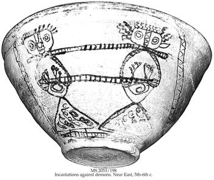

<u>התפתחויות בהלכה – עבודה זרה</u>

העבירה "עבודה זרה", היא אחת העבירות הקשות ביותר שמתוארות
במקורותינו.

אבל המונח "עבודה זרה" מופיע לראשונה (עד כמה שמצאתי...)
רק אצל חז"ל. לכן, אין פלא, שכמו הרבה מונחים מתקופה זו, הוא נתון לפרשנות
גם לגבי משמעותו ביחס לתקופה שקדמה לחורבן הבית, וגם ביחס למשמעותו באלפיים
השנים האחרונות. כמו כל מושג היסטורי הוא עמום, ותלוי בתקופה.

מבחינה זו הפירושים ב"ויקיפדיה", לא פעם לוקים בחסר ואפילו
מטעים. הנה המשפטים בראש האתר של הויקיפדיה:

"עבודה זרה, עבודת
אלילים, עבודת גילולים או עבודת כוכבים
ומזלות (ב[ראשי
תיבות](https://he.wikipedia.org/wiki/%D7%A8%D7%90%D7%A9%D7%99_%D7%AA%D7%99%D7%91%D7%95%D7%AA): ע"ז, עכו"ם או עכומ"ז
במינוח המסורתי),
או פולחן [פגני](https://he.wikipedia.org/wiki/%D7%A4%D7%92%D7%A0%D7%99%D7%95%D7%AA) במינוח
מודרני, הם מונחים
המתארים [פולחן](https://he.wikipedia.org/wiki/%D7%A4%D7%95%D7%9C%D7%97%D7%9F) [דתי](https://he.wikipedia.org/wiki/%D7%93%D7%AA) המופנה
לישויות [גשמיות](https://he.wikipedia.org/wiki/%D7%92%D7%A9%D7%9E%D7%99%D7%95%D7%AA),
כפי שמתייחסת לפולחן כזה ה[דת
היהודית](https://he.wikipedia.org/wiki/%D7%99%D7%94%D7%93%D7%95%D7%AA)."

ומייד אחרי כן מובא ציטוט מספר דברים האוסר עבודת
אלילים:

וְנִשְׁמַרְתֶּם מְאֹד לְנַפְשֹׁתֵיכֶם כִּי לֹא רְאִיתֶם כָּל תְּמוּנָה בְּיוֹם דִּבֶּר ה'
אֲלֵיכֶם בְּחֹרֵב מִתּוֹךְ הָאֵשׁ. פֶּן תַּשְׁחִתוּן וַעֲשִׂיתֶם לָכֶם פֶּסֶל, תְּמוּנַת כָּל סָמֶל, תַּבְנִית זָכָר
אוֹ נְקֵבָה; תַּבְנִית כָּל בְּהֵמָה אֲשֶׁר בָּאָרֶץ, תַּבְנִית כָּל צִפּוֹר כָּנָף אֲשֶׁר תָּעוּף בַּשָּׁמָיִם, תַּבְנִית
כָּל רֹמֵשׂ בָּאֲדָמָה, תַּבְנִית כָּל דָּגָה אֲשֶׁר בַּמַּיִם מִתַּחַת לָאָרֶץ. וּפֶן תִּשָּׂא עֵינֶיךָ הַשָּׁמַיְמָה
וְרָאִיתָ אֶת הַשֶּׁמֶשׁ וְאֶת הַיָּרֵחַ וְאֶת הַכּוֹכָבִים, כֹּל צְבָא הַשָּׁמַיִם, וְנִדַּחְתָּ וְהִשְׁתַּחֲוִיתָ לָהֶם
וַעֲבַדְתָּם; אֲשֶׁר חָלַק ה' אֱלֹהֶיךָ אֹתָם לְכֹל הָעַמִּים תַּחַת כָּל הַשָּׁמָיִם.

מצד אחד הכל נכון, כך לימדונו בכיתה ג', ומצד שני, נשאלת
השאלה, האם לכך מתכוונים חז"ל, למשל, כשהם מאיימים עלינו:

<u>משנה מסכת אבות פרק ה</u>

(ט) חַיָּה רָעָה בָּאָה לָעוֹלָם עַל שְׁבוּעַת שָׁוְא, וְעַל חִלּוּל הַשֵּׁם. גָּלוּת
בָּאָה לָעוֹלָם עַל **עוֹבְדֵי עֲבוֹדָה זָרָה**, וְעַל גִלּוּי עֲרָיוֹת, וְעַל שְׁפִיכוּת דָּמִים, וְעַל
הַשְׁמָטַת הָאָרֶץ.

<u>תוספתא מסכת שבת פרק טז</u>

אין לך דבר עומד בפני פיקוח נפש חוץ **מע"ז** וגילוי עריות
ושפיכות דמים.

<u>תלמוד בבלי מסכת סנהדרין דף עד/א</u>

אמר רבי יוחנן משום רבי שמעון בן יהוצדק נימנו וגמרו
בעליית בית נתזה בלוד כל עבירות שבתורה אם אומרין לאדם עבור ואל תהרג יעבור
ואל יהרג **חוץ מעבודת כוכבים** וגילוי עריות ושפיכות דמים.

בכל אלה, אנחנו מוצאים את העוינות הדרמטית של ההלכה
ל"עבודה זרה" שהופכת בתלמוד בבלי גם ל"עבודת כוכבים" (בנאמנות לספר דברים).
אבל מהי אותה עבודה זרה? מהי עבודת כוכבים?

החשיבות של הנושא בהלכת חז"ל היא גדולה ביותר, שהרי גם
במשנה וגם בשני התלמודים יש מסכת שלמה המוקדשת ל"עבודה זרה", כלומר,
לאזהרות מפני התקרבות לעבודה זרה.

"עבודה זרה" בימי בית ראשון הייתה ברורה יותר, ועם זאת,
אפילו האמוראים בתקופת התלמוד, בבבל (כמעט אלף שנה אחרי חורבן בית ראשון),
מבינים שבימי בית ראשון עבדו גם בישראל וגם ביהודה, ברוב התקופה, עבודה
זרה, במובן הפגאני הפשוט, פולחן לפסלים המייצגים אלים אחרים שאינם
ה'.

<u>תלמוד בבלי מסכת יומא דף ט/ב</u>

מקדש ראשון מפני מה חרב מפני שלשה דברים שהיו בו: עבודה
זרה וגלוי עריות ושפיכות דמים.

אבל, צריך להדגיש, ש"עבודה זרה" בימי בית ראשון, מוגדרת
מנקודת מבט של ימי בית שני, שאז נכתבים רוב ספרי התנ"ך. היא מסתמכת גם
ובעיקר על דברי הנביאים האחרונים, שניבאו במאה האחרונה לימי הבית הראשון,
בגלות בבל, ובתחילת ימי הבית השני.

למעשה, מסוף ימי הבית הראשון, ימי יאשיהו (בערך 640
לפנה"ס), "העבודה הנכונה", היא רק הפולחן בבית המקדש בירושלים, לאל שאין לו
פסל. כל פולחן אחר, בין שהוא לאל אחר, ואפילו הוא לאלוהי ישראל, אבל במזבח
שאינו במקדש בירושלים, הוא עבודה זרה. למעשה, הדגש בתקופה זו הוא על מיקום
הפולחן.

מקריאה ביקורתית של ספר מלכים, ניתן לראות שזוהי נקודת מבט
מאוחרת, ובתקופה שקדמה ליאשיהו, לא נתפס פולחן בבמות (כלומר בכל מקום שנבנה
בו מזבח), כעבודה זרה, ובממלכת ישראל, פסלי עגל ייצגו את אלוהי ישראל עצמו,
בדן ובבית אל.

למעשה, כל תקופת הבית הראשון (כ 400 שנה), להוציא כמה
עשרות שנים בסופה, ובממלכת יהודה בלבד, היא תקופה של "עבודה זרה", אם אנחנו
מקבלים את תפיסת העבודה הזרה של חז"ל.

אפילו אליהו הנביא, שהוא דמות חיובית אצל עורך ספר דברים,
בונה מזבח ומקריב לאלוהי ישראל על הר הכרמל, ומעולם לא הגיע לבית המקדש
בירושלים.

יותר מזה, האל של ימי הבית הראשון אינו אוניברסלי אלא
לאומי.

אליהו אומר לאחזיה מלך ישראל: "המבלי אין אלוהים בישראל
שאתה הולך לדרוש בבעל זבוב אלוהי עקרון?". ובכך ברור שהטענה אינה דתית אלא
פרטיוטית לאומית.

וקיימות עדויות רבות לכך, שלא נפרט כאן.

ובקיצור, מה שהיה לגיטימי בימי הבית הראשון הופך למפרע
ל"עבודה זרה" בימי הבית השני.

לא ברור מתי הפך אלוהי ישראל לאלוהי העולם. זה היה במהלך
ימי הבית השני. ואכן, אפילו הצהרת כורש (שנתגלתה בנוסח המקורי), שאיפשר לכל
העמים שגלו בימי הבבלים לחזור ולהקים את מקדשיהם, גוירה, ובנוסח התנ"כי
נכתב בה: "כל ממלכות הארץ נתן לי אלוהי השמים והוא ציווה עלי להקים לו בית
בירושלים אשר ביהודה". כמובן, זה לא הנוסח המקורי.

ובכל זאת ברור, שהאל היהודי בימי הבית השני, מתאפיין,
בהיותו חסר דמות, ולפחות בארץ ישראל היה לו מקדש אחד (מקדשים נוספים היו,
כנראה במצרים).

יהודי ישראל היו קנאים לאל חסר הדמות, וידועות מרידות
דתיות, כמובן בימי המכבים, אך גם כמעט מרידות בתקופת הרומאים.

ההנחה שעמים אחרים ראו בפסלים אלוהים, הנחה שהנביאים מרבים
ללגלג עליה, אין בה אמת. גם אלוהיהם היו אי שם בשמיים, בהרים או בתהומות,
כמו גם אלי היוונים והרומאים. הפסלים רק ייצגו אותם.

קל לראות שבסופו של דבר גם היהודים מכירים בכך ומשלימים עם
כך, שגם הגוי לא חושב שהפסל הוא אל.

המשנה מקדישה מסכת בת חמישה פרקים לנושא, ומתייחסת לקורא
כאילו הוא יודע מהי "עבודה זרה". עיקר עיסוקה הוא בהתרחקות מהלא יהודים,
הגויים, עובדי עבודה זרה, לכאורה כדי להתרחק מהעבודה הזרה עצמה, למעשה,
כנראה, למניעת התבוללות.

ובכל זאת בפרק השלישי, יש גם התייחסות להגדרות.

<u>משנה מסכת עבודה זרה פרק ג</u>

(א) כָּל הַצְּלָמִים אֲסוּרִים, מִפְּנֵי שֶׁהֵן נֶעֱבָדִין פַּעַם אַחַת בַּשָּׁנָה, דִבְרֵי
רַבִּי מֵאִיר. וַחֲכָמִים אוֹמְרִים, אֵינוֹ אָסוּר אֶלָּא כָל שֶׁיֵּשׁ בְּיָדוֹ מַקֵּל אוֹ צִפּוֹר כַדּוּר. רַבָּן
שִׁמְעוֹן בֶּן גַּמְלִיאֵל אוֹמֵר, כָּל שֶׁיֵּשׁ בְּיָדוֹ כָּל דָּבָר:

(ב) הַמּוֹצֵא שִבְרֵי צְלָמִים, הֲרֵי אֵלּוּ מֻתָּרִים. מָצָא תַבְנִית יָד אוֹ
תַבְנִית רֶגֶל, הֲרֵי אֵלוּ אֲסוּרִים, מִפְּנֵי שֶׁכַּיּוֹצֵא בָהֶן נֶעֱבָד:

ספר "דברים" נשכח, או מפורש מחדש, על פי הפולחנים המוכרים
לחז"ל.

עדיין לא ברור מה פירוש "נעבדין", מהי העבודה עצמה, אך
ברור שהחשש הוא מעבודת אלילים המופיעים כפסלים (קיימים "שברי
צלמים").

האגדה באותו פרק ממחישה את הבעיה של חז"ל, בתקופת כתיבת
המשנה, תחת השלטון הרומאי המרבה בהצגת פסלי אלים, ודווקא לצרכי
קישוט:

<u>משנה מסכת עבודה זרה פרק ג</u>

(ד) שָׁאַל פְּרוֹקְלוֹס בֶּן פְּלוֹסְפוֹס אֶת רַבָּן גַּמְלִיאֵל בְּעַכּוֹ, שֶׁהָיָה רוֹחֵץ
בַּמֶּרְחָץ שֶׁל אַפְרוֹדִיטִי, אָמַר לוֹ, כָּתוּב בְּתוֹרַתְכֶם, וְלֹא יִדְבַּק בְּיָדְךָ מְאוּמָה מִן הַחֵרֶם.
מִפְּנֵי מָה אַתָּה רוֹחֵץ בַּמֶּרְחָץ שֶׁל אַפְדוֹדִיטִי. אָמַר לוֹ, אֵין מְשִׁיבִין בַּמֶּרְחָץ. וּכְשֶׁיָּצָא אָמַר
לוֹ, אֲנִי לֹא בָאתִי בִגְבוּלָהּ, הִיא בָּאת בִּגְבוּלִי. אֵין אוֹמְרִים נַעֲשָׂה מֶרְחָץ לְאַפְרוֹדִיטִי
נוֹי, אֶלָּא אוֹמְרִים, נַעֲשָׂה אַפְרוֹדִיטִי נוֹי לַמֶּרְחָץ. דָּבָר אַחֵר, אִם נוֹתְנִין לְךָ מָמוֹן
הַרְבֵּה, אִי אַתָּה נִכְנָס לַעֲבוֹדָה זָרָה שֶׁלְּךָ עָרוֹם וּבַעַל קֶרִי וּמַשְׁתִּין בְּפָנֶיהָ, וְזוֹ עוֹמֶדֶת
עַל פִּי הַבִּיב וְכָל הָעָם מַשְׁתִּינִין לְפָנֶיהָ. לֹא נֶאֱמַר, אֶלָּא אֱלֹהֵיהֶם. אֶת שֶׁנּוֹהֵג בּוֹ מִשּׁוּם
אֱלוֹהַּ, אָסוּר. וְאֶת שֶׁאֵינוֹ נוֹהֵג בּוֹ מִשּׁוּם אֱלוֹהַּ, מֻתָּר:

ובמילים פשוטות, רבן גמליאל מבחין בין פסל "שעובדים אותו"
ובין פסל שנועד לקישוט, גם אם הוא פסלה של האלה אפרודיטה. הפסלים כבר אינם
אסורים כקישוט, רק "העבודה" אסורה.

ובבתי כנסת עתיקים, אמנם איננו מוצאים פסלים של אלים
יווניים, אבל פסיפסים שבהם הם מצוירים מוצאים הרבה. וזוהי המחשה לגישה "את
שאינו נוהג משום אלוה, מותר". התייחסות אסתטית לאלים היווניים.

אבל "עבודה זרה" היא מושג יותר רחב.

<u>משנה מסכת עבודה זרה פרק ג</u>

(ה) הַגּוֹיִם הָעוֹבְדִים אֶת הֶהָרִים וְאֶת הַגְּבָעוֹת, הֵן מֻתָּרִים וּמַה
שֶּׁעֲלֵיהֶם אֲסוּרִים, שֶׁנֶּאֱמַר, (דברים ז) לא תַחְמֹד כֶּסֶף וְזָהָב עֲלֵיהֶם וְלָקַחְתָּ. רַבִּי יוֹסֵי
הַגְּלִילִי אוֹמֵר, (שם יב) אֱלֹהֵיהֶם עַל הֶהָרִים, וְלֹא הֶהָרִים אֱלֹהֵיהֶם. אֱלֹהֵיהֶם עַל
הַגְּבָעוֹת, וְלֹא הַגְּבָעוֹת אֱלֹהֵיהֶם. .... אָמַר רַבִּי עֲקִיבָא, אֲנִי אוֹבִין וְאָדוּן לְפָנֶיךָ. כָּל
מָקוֹם שֶׁאַתָּה מוֹצֵא הַר גָּבוֹהַּ וְגִבְעָה נִשָּׂאָה וְעֵץ רַעֲנָן, דַּע שֶׁיֶּשׁ שָׁם עֲבוֹדָה זָרָה:

הכוונה היא שמותר לך לעבד אדמה או לחצוב אבנים גם מהר שיש
עליו "עבודה זרה". מן הסתם פסל לאל, או פסל שמשמש לפולחן.

<u>משנה מסכת עבודה זרה פרק ד</u>

(ה) כֵּיצַד מְבַטְּלָהּ, קָטַע רֹאשׁ אָזְנָהּ, רֹאשׁ חָטְמָהּ, רֹאשׁ אֶצְבָּעָהּ, פְּחָסָהּ
אַף עַל פִּי שֶׁלֹּא חִסְּרָהּ, בִּטְּלָהּ.

ואחרי שאתה מבטל אותה, היא מותרת. כנראה לצורך קישוט, או
שימוש אחר.

מכל אלה ברור ש"עבודה זרה" כוללת פסלים, ופולחן כלשהו
שנעשה לפניהם.

בנוסף לפסלים יש עבודה זרה נוספת:

<u>משנה מסכת עבודה זרה פרק ד</u>

(ז) שָׁאֲלוּ אֶת הַזְּקֵנִים בְּרוֹמִי, אִם אֵין רְצוֹנוֹ בַּעֲבוֹדָה זָרָה, לָמָּה
אֵינוֹ מְבַטְּלָהּ. אָמְרוּ לָהֶן, אִלּוּ לְדָבָר שֶׁאֵין צֹרֶךְ לָעוֹלָם בּוֹ הָיוּ עוֹבְדִין, הָיָה מְבַטְּלוֹ.
הֲרֵי הֵן עוֹבְדִין לַחַמָּה וְלַלְּבָנָה וְלַכּוֹכָבִים וְלַמַּזָּלוֹת. יְאַבֵּד עוֹלָמוֹ מִפְּנֵי
הַשּׁוֹטִים?

ובהמשך דנים גם בפסלים, ומוצאים תירוץ לאי התערבות אלוהית
בחופש הבחירה האנושי, כרגיל.

העובדים לצבא שמים, נקראים בקיצור עכו"ם, עובדי כוכבים
ומזלות.

לא הצלחתי לברר איך בדיוק עובדים לשמש, או לכוכב נוגה, אבל
ידוע שבעולם העתיק, בעיקר במזרח, היו מִקדשים מיועדים לכוכב מסויים, ומן
הסתם נעשה שם פולחן של הקרבת קורבנות כרגיל בתקופה זו.

בימי הביניים (ולמעשה, עוד קודם) פונה המאבק ב"עבודה זרה"
לשני כיוונים:

האחד התרחקות **מפולחן** עבודה זרה (פגאנית ואחר כך
נוצרית) ואגב כך התרחקות מהגויים.

השני התרחקות **מאמונות** פגאניות, ובפרט מהגשמת האל
(כלומר מתן תכונות חומריות או אף אנושיות לאל). וכך קיימות במקורותינו
התייחסות לפרקטיקה והתייחסות לתודעה.

אבל, בשני הכיוונים הללו אנחנו מוצאים עליות
וירידות.

בהתייחסות לפרקטיקה, אנחנו מוצאים נוקשות וקנאות רבה
בכתבים, אך ספק אם היא התגברה על על כשפים מסוגים שונים, שעוקפים את האל
האחד, שאסור לייחס לו דמות או תכונות של רוע שניתן להתגבר עליהן, ופונים
לשדים שיש להם צורה ודמות.

דוגמה ידועה היא קערות ההשבעה מתקופת הגאונים בבבל
(500-1000 לספירה). מאגיה עממית שמתמודדת עם שדים.

את האל לא מציירים, אבל מציירים שדים, ומשביעים אותם
להתנהג יפה באיומים קשים.

החכמים שקבעו את ההלכה, וגם כתבו את "האמונות הנכונות",
התנגדו בתקופה זו, ובעיקר בתקופה המוסלמית ובהשפעת האסלם לכל התופעות
האלה.

בעוד שהפגאנים והנוצרים מכונים עכו"ם (עובדי כוכבים
ומזלות) היהודים עצמם לא נמנעו מאסטרולוגיה בימי הבינים. ומהי אסטרולוגיה
אם לא סוג של עבודת כוכבים.

אפילו חכמים גדולים כמו אברהם אבן עזרא, או אברהם זכות
עסקו באסטרולוגיה, כלומר, האמינו בהשפעת הכוכבים על גורל בני האדם. בדרך
כלל היו מוסיפים למחקריהם האסטרולוגים הערות, שהיהודים אינם כפופים לתנועת
הכוכבים, בעיקר אם הם מקיימים את המצוות, וכד'. ידועה האמרה "אין מזל
לישראל" שכוונתה, שעמים זרים כפופים ל"שרים" בשמים שכוכבים מייצגים אותם,
וישראל כפופים ישירות לאל. כך יצאו ידי חובת הימנעות מ"עבודה זרה".

ובכל זאת מומלץ לא לצאת למסע בים כאשר "מצב הכוכבים"
נגדך.

ומה באשר לדמותו של אלוהים עצמו? לאמונות בייחוד האל
ובהיותו חסר דמות?

ר' סעדיה גאון (נפטר 942) מתאמץ מאוד, לבטל כל תיאור גשמי,
חומרי, של אלוהים:

<u>ספר אמונות ודעות - מאמר שני - אות ט</u>

ולפי שנתברר שהוא בורא כל אדם, וכל אויר, וכל אש, וכל חלל,
וכל מצוי וידוע, הרי בטלו על ידי המופת השכלי כל הדמיונות הללו. וכפי
שנתאמת זה בשכל כך נתאמת בכתובים, והוא שהדברים הנמצאים חמשה יסודות, הדומם
והצומח והחי והכוכבים והמלאכים, ושללו הכתובים חמשתם **מלהיות דומים לבורא
או ידמה להם**, ואמרו, בחשובי הדומם, והם הזהב והכסף, למי תדמיוני ותשוו
ותמשלוני. ונדמה, .... בטל בו שיהא הוא דומה לאיזה דבר.

כפילוסוף הוא מסביר בהיגיון ("מופת") שהבורא לא יכול להיות
דומה לברואיו, וכמאמין, הוא מצטט פסוקים מתאימים.

לעומת זה, עוד לפניו, במאות הראשונות לספירה מתפתחת ספרות
שלמה, בעיקר בארץ ישראל, המתארת פגישות של אדם עם האל, כולל תיאורים של האל
עצמו. ספרות זו נקראת "ספרות ההיכלות".

לדוגמא:

<u>היכלות רבתי פרק י'</u>

פנים נאים פנים הדורים של יופי, פנים של להבה, פני ה' אלקי
ישראל, כשהוא יושב על כסא כבודו וסלסולו מתייא במושב הדר. .... מיופי גבורת
הדא מעלה מהדר חתנים וכלות בבית חופתן. המסתכל בו מיד נבקע. המציץ ביפיו
משתפך כקיתון.

המשרתים אותו ביום לא ישרתוהו מחר והמשרתים אותו למחר אינם
משרתים לו היום, כי תשש כחם והושחרו פניהם, .... ונחשכו עיניהם אחר הדר
יופי הדר של מלכם, שנאמר קדוש קדוש קדוש ה' צבאות וגו':

ויש אפילו תיאורים מפורטים יותר בספרות ההיכלות.

תיאור האלוהים מתחיל עוד מנבואות ישעיהו ויחזקאל במאה
השביעית לפנה"ס.

הפילוספיה היהודית המתפתחת בימי הביניים בעיקר בהשפעת
הפילוסופיה המוסלמית, היא רציונלית, ונאבקת נגד כל הגשמה (ראייה חומרית,
צורנית) של אלוהים.

כמובן, שהבולט כאן הוא הרמב"ם.

פרקים רבים ב"מורה נבוכים" מסבירים לנו מדוע ביטויים של
האנשה של אלוהים, כמו "יד אלוהים", "חרון אפו", "ימינך ה' נאדרי בכח",
"הארץ הדום רגליו", ועוד ועוד, כולם אינם אלא משל ומטפורה, והאלוהים אין לו
כל דמות וכל צורה, לא ידיים, לא אף, לא רגליים, ובכלל לא ניתן לדבר עליו
בתארים חיוביים ככועס, נוקם, אוהב, אלא שליליים בלבד. מה הוא לא.

לעומת זה כולם מתפשרים עם קיום המלאכים. הם מוכרים כישויות
אמיתיות לא רק אצל המון העם אלא גם אצל חכמינו. אפילו הרמב"ם מכיר במלאכים,
אבל הוא עושה גם מהם ישויות לא חומריות, ומכנה אותם "שכלים נבדלים". שכל
ללא גוף. אחד התפקידים של המלאכים, אגב, הוא להניע את כוכבי הלכת
במסילותיהם.

עם ישראל קיבל את חוקי התלמוד, המרחיקים אותו מהפגאנים,
ואפילו מהנוצרים, אם מרצון ואם מאונס (מפני שגם הנוצרים, ואפילו המוסלמים
הרחיקו את היהודים), אבל נראה שאת האמונות המופשטות של הפילוסופיה היהודית
הרציונלית לא יכול היה לקבל.

"המרד" נגד האל האבסטרקטי של הפילוסופים, הגיע במאה ה-12
או ה-13, דרך קבלת הספירות.

אמנם, ביסודה, הקבלה אינה מספרת איך נראה אלוהים, אבל היא
"מפרקת" אותו לתכונותיו, המיוצגות על ידי מושג "הספירה" (בניגוד מוחלט
לאיסור התארים החיוביים על ידי הרמב"ם).

ספר הזוהר, מרחיק לכת בחלקים מסוימים, כמו ב"אידרא רבא",
שבו חכמי חבורת ר' שמעון בר יוחאי דורשים דרשות על חלקי "פרצופו" של "העתיק
יומין". כמובן, הכל יפורש אחר כך כמשל.

אבל "המשלים" מרחיקים לכת לחיי המין, בזיווגים שבין
הספירות השונות, בעיקר בקבלת האר"י, ששם התפקיד האנושי (היהודי כמובן) הוא
להביא לזיווגים האלה שיקרבו את הגאולה.

ברור שהיו חכמים, וישנם עד היום כאלה, הפוסלים את הקבלה
מכל וכל.

אברהם אבולעפיה, שנפטר ב 1291, כעשר שנים אחרי פרסום ספר
הזוהר כותב באגרת בשם "וזאת ליהודה"

ולפיכך אודיעך שבעלי הקבלה הספירות חשבו **לייחד השם
ולברוח מאמונת השלוש ועשרוהו**. וכמו שהגוים אומרים הוא שלשה והשלשה אחד,
כן מקצת בעלי הקבלה מאמינים ואומרים כי האלוהות עשר ספירות והעשרה הם אחד
...

וכך גם חכמים אחרים, מאירופה ועד תימן, מהזמן ההוא ועד
זמננו (ישעיהו ליבוביץ), רואים בקבלה לפחות אבק של עבודה זרה, אם לא עבודה
זרה ממש.

אבל, עם ישראל ברובו קיבל אותה, בעיקר בעקבות החסידות
שבמידה רבה התבססה על קבלת האר"י, אם כי עידנה אותה, והפנתה את תכניה
לכיוון נפש האדם יותר מאשר לכיוון סודות השמים.

לאחר התקופה הרומית, הופך העולם הרלוונטי ליהודים להיות
נוצרי, ואחר כך נוצרי ומוסלמי.

לכן הפרקטיקה כבר אינה נגד עבודת פסלים, אלא בהתייחסות
לדתות האחרות.

האסלאם נלחם בקנאות יתר כנגד אמונות פגאניות, והיה קיצוני
ביותר בהתנגדות לאפשרות של צורה ודמות לאללה. במסגדים לא נראה צורות אדם,
ואפילו לא צורות חיות אלא קישוטים מופשטים בלבד, ערבסקות (סבך של גבעולים
ועלים) וקליגרפיה (קישוט אמנותי של אותיות ופסוקים).

לכן בדרך כלל התייחסה האורתודוקסיה היהודית, מאז התלמוד,
לנצרות כעבודה זרה, ולא כן לאסלאם. עד היום יהודים אורתודוקסים, ברובם, לא
נכנסים לכנסיות.

הנוצרים מאמינים ב"שילוש", שניתן לפרשו כמנוגד ל"אחד",
ומרבים בפסלים וציורים בכנסיותיהם.

אבל המוסלמים בסדר.

<u>מתוך שו"ת הרמב"ם, תשובה לגר צדק</u>

שאלה

על אלו הישמעאלים שאמרת שאינם עובדי עבודה זרה ואמר לך רבך
שהם עובדי ע"ז והאבנים שמשליכים בתרופן הן למרקוליס, והשיב לך שלא כהוגן,
עד שנתעצבת אל לבך ונכלמת וקרא עליך ענה כסיל כאולתו:

<u>תשובה</u>

אלו הישמעאלים אינם עובדי עבודה זרה כלל וכבר נכרתה מפיהם
ומלבם והם מיחדים לאל יתברך יחוד כראוי יחוד שאין בו דופי ....

ואם יאמר אדם שהבית שהם מקלסין אותו בית עבודה זרה הוא,
ועבודה זרה צפונה בתוכו, שהיו עובדים אותה אבותיהם, מה בכך, אלו המשתחוים
כנגדו היום, אם לבם לשמים.

וכבר פירשו רבותינו ז"ל בסנהדרין שאם השתחוה אדם לבית
עבודה זרה, והוא סבור שהוא בית הכנסת, הרי לבו מסור לשמים. וכן אלו
הישמעאלים היום כלם טף ונשים נכרתה עבודה זרה מפיהם ובייחוד השם אין להם
טעות כלל.

לעומת זה את הנוצרים רואה הרמב"ם כעכו"ם, אך בשום מקום לא
מנמק.

<u>רמב"ם יד החזקה הלכות עבודת כוכבים פרק ט</u>

(ד) כנענים עובדי כו"ם הם ויום ראשון הוא יום אידם לפיכך
אסור לתת ולשאת עמהם בארץ ישראל יום חמישי ויום ששי שבכל שבת ושבת ואין
צריך לומר יום ראשון עצמו שהוא אסור בכל מקום וכן נוהגין עמהם בכל
אידיהם:

(כאן הוא מכנה אותם כנענים, אך ברור שהכוונה לנוצרים, שיום
ראשון הוא יום חגם).

גישה זו הייתה מקובלת על רוב חכמי הביניים, שרובם, כמובן,
חיו באיזורים מוסלמים....

אבל, באיזורים הנוצריים היו כאלה שגישתם שונה.

<u>המאירי (מנחם המאירי, נפטר 1316, פרובאנס) על בבא קמא
דף קיג/א</u>

היה המוכס מעובדי האלילים הקדומים, **שאינם גדורים בדרכי
הדתות**, והבריח ממנו את המכס

.....

ומ"מ באותם **הגדורים בדרכי הדתות** לא נאמר כן אלא אם באו
לפנינו לדין אין מעבירין להם את הדרך כמלא מחט אלא יקוב הדין את ההר אם לו
אם לשכנגדו:

(הבחנה מעורפלת מעט אבל חד משמעית בין עובדי אלילים
לנוצרים)

<u>המהר"ל (נפטר ב 1609, פראג) בספרו "באר
הגולה":</u>

לא אמרו חז"ל דבר זה אלא על העכו"ם שהיו בזמניהם, שהיו
עובדי כוכבים ומזלות, ולא היו מאמינים ביציאת מצרים ובחידוש העולם \[גורם
נוסף להבחנת עבודה זרה\]. אבל אלו הגוים אשר אנחנו האומה הישראלית חוסים
בצל שלהם ומפוזרים ביניהם, הם מאמינים בחידוש העולם וביציאת מצרים ובעיקרי
הדת, וכל כוונתם **לעושה שמים וארץ** .... לא די שאין איסור להצילן אלא
אפילו אנחנו מחוייבים להתפלל בשלומן .... (בניגוד לעובדי עבודה זרה,
כמובן).

ובימינו, כבר פחות מתלבטים...

<u>מתוך הצהרה משנת 2015 עליה חתומים עשרות רבנים
אורתוקסים מקהילות יהודיות</u>

כמו הרמב”ם (הלכות מלכים פ”יא ה”ד, גרסה לא מצונזרת) ור’
יהודה הלוי (ספר הכוזרי, מאמר ד’ כ”ב), גם אנו מכירים בכך כי הנצרות איננה
תופעה מקרית או שגיאה, אלא תוצאה של תהליך אלו-הי ומתנה לעמים. בכך שהפריד
בין היהדות לנצרות, הקב”ה הפגין את רצונו בהפרדה בין שותפים בעלי הבדלים
תיאולוגיים משמעותיים, ולא בהפרדה בין אויבים.

רבי יעקב עמדין (יעב”ץ, נפטר 1776, גרמניה) כתב כי “הנוצרי
עשה טובה כפולה בעולם: מצד אחד, חיזק תורת משה בכל עוז. ואין אחד מחכמינו,
שדיבר יותר מזה בפה מלא בחיוב קיום נצחי לתורה. ומצד אחר, לאומות העולם
היטיב הרבה, **שביטל עבודה זרה והסיר הפסילים מהם וחייב אותן בשבע מצוות
בני נוח,** שלא יהיו כבהמות השדה, וזיכה להם במידות מוסריות…. נוצרים הם
קהילות שפועלות לשם שמים שנועדו להישגים, כוונתם היא לשם שמים ושכרם לא
יימנע.” ....

**כעת, משהכנסייה הקתולית הכירה בברית הנצחית בין הקב”ה
לבין ישראל, אנו היהודים יכולים להכיר בתקפותה הקונסטרוקטיבית המתמשכת של
הנצרות כשותפתנו לגאולת העולם ....**

ואפילו הגענו הרבה יותר רחוק, כאשר הרבנות הראשית בישראל,
החליטה שגם ההינדואיסטים אינם עובדי אלילים...

<u>מתוך מאמר ב YNET "הודו להשם:
ההינדואיזם הדת הקרובה ביותר ליהדות" מאת הרב אלון גושן גולטשטיין.
2017</u>

הוא מספר על מפגשים בין מנהיגים יהודים
והינדואיסטים...

אם קרה משהו במפגשים ההם, מעבר לסמליותם, **הרי זה השינוי
שחל בעמדת הרבנים בכל הנוגע למעמד ההינדואיזם כעבודה זרה.** הדברים באים
לידי ביטוי גם בהודעה המשותפת ובה ההכרזה **שההינדים פולחים רק לישות
העליונה**. על הצהרה זו חתומה הרבנות הראשית לישראל.

 

לעומת זה, ההיאחזויות הצצות לבקרים ביהודה ושומרון "על כל
גבעה רמה ותחת כל עץ רענן" לדעתי, מתאימות להגדרה של עבודה זרה... וגם
לדעתו של רבי עקיבא שציטטנו לעיל... אבל לא לדעת הרבנות הראשית.

ונראה לי שגם הרב שרלו (מרבני "צוהר") מסכים עם דברים אלה
באמרו, בשפה של מאמין, ונראה כתוקף גם את היוצאים בשאלה וגם את הקיצוניים
הלאומנים:

ברם, מדברי ההלכה עולה כי ההתבוננות על העבודה הזרה לא
נעשית רק דרך שאלת הפסילים והאלילים, כי אם גם דרך דרכי עבודת ד'. הגשמה
אינה רק עניין תיאולוגי מוחשי שיש להיאבק נגדו, כי אם גם תפישה מוטעית של
העניין האלוקי. יסודה של העבודה הזרה טמון בניסיון של האדם לעצב לו את
האלוהים הזרים כרצונו. הוא הבונה אותו בתבניתו ובדמותו, והוא הקובע לאור
אלו עקרונות יפעל אותו אליל או פסל. האמת היא שמבחינה זו לא השתנה הרבה גם
בימנו. גם כיום עולה לא אחת ניסיון לקבוע לריבונו של עולם כיצד הוא צריך
לפעול ומה הוא צריך להיות. העבודה הזרה המודרנית באה לידי ביטוי בניסיון
לעצב את האלוקים לפי רוח האדם. כשמצווה מסוימת לא נראית ולא מתיישבת עם
מערכת הערכים – עובדי עבודה הזרה המודרניים יקבעו שהיא אינה מחייבת או שכלל
לא נאמרה. אם דרך המצוות המעשיות התמידיות והריטואליות אינה נראית בעיניהם
של עובדי העבודה הזרה המודרנית, הם יצורו לעצמם דמות אלוהית אחרת שלה מערכת
ערכים שהם עצמם בנו להם. אם התנהלות הדברים בהיסטוריה נמצאת בניגוד למה שהם
סברו שצריך להיות, בין אם העריכו כי משיח צריך להופיע עכשיו ובין אם סברו
כי יש להתנכר לגאולת ישראל, הם ימהרו וישרטטו לעצמם מלך אחר. **הצד השווה
שבכולם הוא הניסיון לקבוע לריבונו של עולם כיצד הוא צריך להיות לפי דעת בני
אדם, וזו עבודה זרה מובהקת****.**

והמסקנה מכל הסיפור היא שגם הגדרת "עבודה זרה", בכל
הדורות, היא קצת או הרבה, פוליטית.

מהפטריוטיות של מלכי יהודה בימי בית ראשון, דרך שאיפות
ההיבדלות של היהודים בימי בית שני ובעיקר של חז"ל, ההכרח לחיות בשלום עם
המוסלמים והנוצרים כל תקופת הגלות, ועד הרצון ליחסים טובים עם הודו
בימינו...
